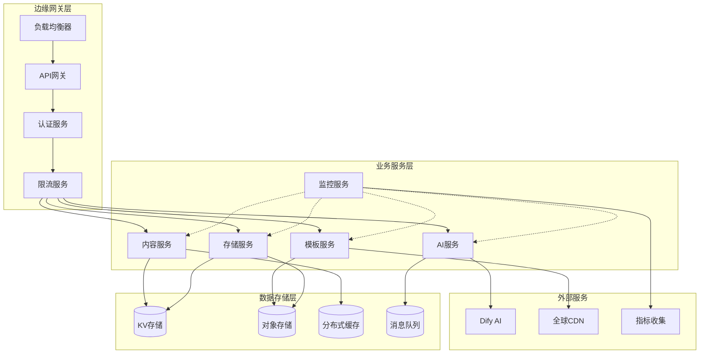

# API架构设计文档

## 概述

本文档定义了AI驱动内容代理平台的企业级API架构设计规范。基于云原生微服务架构，采用事件驱动设计模式，构建高可用、高性能、可扩展的分布式API服务体系。

### 设计目标

- **高性能**: 边缘计算架构，全球CDN分发，毫秒级响应
- **高可用**: 99.99%服务可用性，多区域容灾，自动故障转移
- **可扩展**: 弹性伸缩，支持百万级并发，水平扩展能力
- **安全性**: 零信任架构，端到端加密，多层安全防护
- **可观测**: 全链路监控，实时指标，智能告警系统
- **开发友好**: RESTful设计，完整文档，SDK支持

### 核心能力

- **智能内容处理**: 基于大语言模型的多模态内容生成与优化
- **实时流式API**: Server-Sent Events + WebSocket双协议支持
- **边缘计算**: Cloudflare Workers全球分布式计算节点
- **混合存储**: KV存储 + 对象存储 + 缓存层的多级存储架构
- **AI工作流编排**: 可视化工作流设计，支持复杂业务逻辑
- **API网关**: 统一入口，流量控制，安全认证，监控分析

## 系统架构设计

### 微服务架构模式

```typescript
// 服务架构定义
interface ServiceArchitecture {
  gateway: APIGatewayService;
  services: {
    content: ContentManagementService;
    ai: AIWorkflowService;
    template: TemplateRenderingService;
    storage: StorageManagementService;
    auth: AuthenticationService;
    monitoring: ObservabilityService;
  };
  infrastructure: {
    compute: EdgeComputeLayer;
    storage: HybridStorageLayer;
    network: GlobalCDNLayer;
    security: ZeroTrustLayer;
  };
}

// API网关服务
class APIGatewayService {
  private router: EdgeRouter;
  private rateLimiter: RateLimitManager;
  private authMiddleware: AuthenticationMiddleware;
  private corsHandler: CORSHandler;
  
  async handleRequest(request: Request): Promise<Response> {
    // 请求预处理
    const processedRequest = await this.preprocessRequest(request);
    
    // 认证与授权
    const authResult = await this.authMiddleware.authenticate(processedRequest);
    if (!authResult.success) {
      return this.createErrorResponse(401, 'AUTHENTICATION_FAILED');
    }
    
    // 速率限制检查
    const rateLimitResult = await this.rateLimiter.checkLimit(authResult.user);
    if (!rateLimitResult.allowed) {
      return this.createErrorResponse(429, 'RATE_LIMIT_EXCEEDED');
    }
    
    // 路由分发
    return await this.router.route(processedRequest, authResult.context);
  }
}
```

### 技术栈配置

| 层级 | 组件 | 技术选型 | 性能指标 |
|------|------|----------|----------|
| **API层** | 网关服务 | Cloudflare Workers | 10ms冷启动, 128MB内存 |
| **协议层** | 通信协议 | HTTP/2, WebSocket, SSE | TLS 1.3, QUIC支持 |
| **服务层** | 微服务 | TypeScript + Hono.js | 单服务<50ms响应 |
| **存储层** | 混合存储 | KV + R2 + Redis | 99.9%可用性 |
| **AI层** | 模型服务 | Dify + OpenAI API | 流式响应支持 |
| **监控层** | 可观测性 | Prometheus + Grafana | 实时指标收集 |

### 分布式服务架构

```typescript
// 服务注册与发现
class ServiceRegistry {
  private services: Map<string, ServiceInstance[]> = new Map();
  
  async registerService(service: ServiceInstance): Promise<void> {
    const instances = this.services.get(service.name) || [];
    instances.push(service);
    this.services.set(service.name, instances);
    
    // 健康检查
    await this.startHealthCheck(service);
  }
  
  async discoverService(serviceName: string): Promise<ServiceInstance | null> {
    const instances = this.services.get(serviceName) || [];
    const healthyInstances = instances.filter(i => i.healthy);
    
    // 负载均衡选择
    return this.loadBalancer.select(healthyInstances);
  }
}

// 数据流管理
class DataFlowManager {
  private eventBus: EventBus;
  private streamProcessor: StreamProcessor;
  
  async processRequest(request: APIRequest): Promise<APIResponse> {
    // 请求预处理
    const enrichedRequest = await this.enrichRequest(request);
    
    // 事件发布
    await this.eventBus.publish('request.received', {
      requestId: enrichedRequest.id,
      timestamp: Date.now(),
      metadata: enrichedRequest.metadata
    });
    
    // 流式处理
    const result = await this.streamProcessor.process(enrichedRequest);
    
    // 响应后处理
    return await this.postProcessResponse(result);
  }
}
```

### 微服务通信架构



## API设计规范

### 设计原则

```typescript
// API设计原则接口
interface APIDesignPrinciples {
  consistency: {
    naming: 'snake_case' | 'camelCase' | 'kebab-case';
    versioning: 'url' | 'header' | 'parameter';
    errorHandling: 'rfc7807' | 'custom';
  };
  performance: {
    caching: CachingStrategy;
    compression: CompressionConfig;
    pagination: PaginationStrategy;
  };
  security: {
    authentication: AuthenticationMethod[];
    authorization: AuthorizationModel;
    encryption: EncryptionStandard;
  };
  observability: {
    tracing: TracingConfig;
    metrics: MetricsConfig;
    logging: LoggingConfig;
  };
}

// 响应格式标准化
class APIResponseBuilder {
  static success<T>(data: T, meta?: ResponseMeta): APIResponse<T> {
    return {
      success: true,
      data,
      meta: {
        timestamp: new Date().toISOString(),
        request_id: generateRequestId(),
        version: 'v1.0',
        processing_time: performance.now(),
        ...meta
      }
    };
  }
  
  static error(error: APIError, meta?: ResponseMeta): APIErrorResponse {
    return {
      success: false,
      error: {
        code: error.code,
        type: error.type,
        message: error.message,
        details: error.details,
        trace_id: generateTraceId()
      },
      meta: {
        timestamp: new Date().toISOString(),
        request_id: generateRequestId(),
        version: 'v1.0',
        ...meta
      }
    };
  }
}
```

### 统一响应格式

#### 成功响应标准
```typescript
interface APIResponse<T> {
  success: true;
  data: T;
  meta: {
    timestamp: string;
    request_id: string;
    version: string;
    processing_time: number;
    cache_status?: 'hit' | 'miss' | 'bypass';
    rate_limit?: {
      remaining: number;
      reset_time: string;
    };
  };
  links?: {
    self: string;
    next?: string;
    prev?: string;
  };
}
```

#### 错误响应标准
```typescript
interface APIErrorResponse {
  success: false;
  error: {
    code: string;
    type: 'client_error' | 'server_error' | 'auth_error';
    message: string;
    details?: Record<string, any>;
    trace_id: string;
    documentation_url?: string;
  };
  meta: {
    timestamp: string;
    request_id: string;
    version: string;
  };
}
```

#### 流式响应格式
```typescript
// Server-Sent Events 格式
interface SSEEvent {
  id?: string;
  event?: string;
  data: string;
  retry?: number;
}

// WebSocket 消息格式
interface WebSocketMessage {
  type: 'data' | 'error' | 'complete' | 'heartbeat';
  id: string;
  timestamp: string;
  payload: any;
  metadata?: Record<string, any>;
}
 ```

### 错误处理体系

```typescript
// 错误分类枚举
enum ErrorCategory {
  CLIENT_ERROR = 'client_error',
  SERVER_ERROR = 'server_error',
  AUTH_ERROR = 'auth_error',
  BUSINESS_ERROR = 'business_error',
  EXTERNAL_ERROR = 'external_error'
}

// 错误代码定义
class ErrorCodes {
  // 客户端错误 (4xx)
  static readonly VALIDATION_ERROR = 'VALIDATION_ERROR';
  static readonly INVALID_REQUEST = 'INVALID_REQUEST';
  static readonly RESOURCE_NOT_FOUND = 'RESOURCE_NOT_FOUND';
  static readonly METHOD_NOT_ALLOWED = 'METHOD_NOT_ALLOWED';
  static readonly PAYLOAD_TOO_LARGE = 'PAYLOAD_TOO_LARGE';
  static readonly UNSUPPORTED_MEDIA_TYPE = 'UNSUPPORTED_MEDIA_TYPE';
  
  // 认证错误 (401, 403)
  static readonly AUTHENTICATION_FAILED = 'AUTHENTICATION_FAILED';
  static readonly INVALID_API_KEY = 'INVALID_API_KEY';
  static readonly TOKEN_EXPIRED = 'TOKEN_EXPIRED';
  static readonly PERMISSION_DENIED = 'PERMISSION_DENIED';
  static readonly INSUFFICIENT_SCOPE = 'INSUFFICIENT_SCOPE';
  
  // 限流错误 (429)
  static readonly RATE_LIMIT_EXCEEDED = 'RATE_LIMIT_EXCEEDED';
  static readonly QUOTA_EXCEEDED = 'QUOTA_EXCEEDED';
  
  // 服务器错误 (5xx)
  static readonly INTERNAL_ERROR = 'INTERNAL_ERROR';
  static readonly SERVICE_UNAVAILABLE = 'SERVICE_UNAVAILABLE';
  static readonly GATEWAY_TIMEOUT = 'GATEWAY_TIMEOUT';
  static readonly EXTERNAL_SERVICE_ERROR = 'EXTERNAL_SERVICE_ERROR';
}

// 错误处理器
class ErrorHandler {
  static handle(error: Error, context: RequestContext): APIErrorResponse {
    const errorInfo = this.categorizeError(error);
    
    return APIResponseBuilder.error({
      code: errorInfo.code,
      type: errorInfo.type,
      message: errorInfo.message,
      details: errorInfo.details,
      documentation_url: `https://docs.api.example.com/errors/${errorInfo.code}`
    });
  }
  
  private static categorizeError(error: Error): ErrorInfo {
    // 错误分类逻辑
    if (error instanceof ValidationError) {
      return {
        code: ErrorCodes.VALIDATION_ERROR,
        type: ErrorCategory.CLIENT_ERROR,
        message: error.message,
        details: error.validationDetails
      };
    }
    
    // 其他错误类型处理...
    return {
      code: ErrorCodes.INTERNAL_ERROR,
      type: ErrorCategory.SERVER_ERROR,
      message: 'An unexpected error occurred'
    };
  }
}
```

### HTTP状态码规范

```typescript
// HTTP状态码映射
const HTTP_STATUS_MAPPING = {
  // 成功响应 (2xx)
  200: 'OK',                    // 标准成功响应
  201: 'Created',               // 资源创建成功
  202: 'Accepted',              // 异步处理接受
  204: 'No Content',            // 成功但无返回内容
  
  // 重定向 (3xx)
  301: 'Moved Permanently',     // 永久重定向
  302: 'Found',                 // 临时重定向
  304: 'Not Modified',          // 资源未修改
  
  // 客户端错误 (4xx)
  400: 'Bad Request',           // 请求格式错误
  401: 'Unauthorized',          // 认证失败
  403: 'Forbidden',             // 权限不足
  404: 'Not Found',             // 资源不存在
  405: 'Method Not Allowed',    // 方法不允许
  409: 'Conflict',              // 资源冲突
  413: 'Payload Too Large',     // 请求体过大
  422: 'Unprocessable Entity',  // 语义错误
  429: 'Too Many Requests',     // 请求过频
  
  // 服务器错误 (5xx)
  500: 'Internal Server Error', // 服务器内部错误
  502: 'Bad Gateway',           // 网关错误
  503: 'Service Unavailable',   // 服务不可用
  504: 'Gateway Timeout',       // 网关超时
} as const;

// 状态码工具类
class HTTPStatusUtils {
  static isSuccess(status: number): boolean {
    return status >= 200 && status < 300;
  }
  
  static isClientError(status: number): boolean {
    return status >= 400 && status < 500;
  }
  
  static isServerError(status: number): boolean {
    return status >= 500 && status < 600;
  }
  
  static getErrorCategory(status: number): ErrorCategory {
    if (this.isClientError(status)) {
      return status === 401 || status === 403 
        ? ErrorCategory.AUTH_ERROR 
        : ErrorCategory.CLIENT_ERROR;
    }
    
    if (this.isServerError(status)) {
      return ErrorCategory.SERVER_ERROR;
    }
    
    return ErrorCategory.CLIENT_ERROR;
  }
}
```

## 核心服务端点设计

### 服务端点架构

```typescript
// 端点定义接口
interface APIEndpoint {
  path: string;
  method: HTTPMethod;
  handler: EndpointHandler;
  middleware: Middleware[];
  validation: ValidationSchema;
  documentation: EndpointDocumentation;
  rateLimit: RateLimitConfig;
  caching: CachingConfig;
}

// 端点注册器
class EndpointRegistry {
  private endpoints: Map<string, APIEndpoint> = new Map();
  
  register(endpoint: APIEndpoint): void {
    const key = `${endpoint.method}:${endpoint.path}`;
    this.endpoints.set(key, endpoint);
  }
  
  resolve(method: HTTPMethod, path: string): APIEndpoint | null {
    const key = `${method}:${path}`;
    return this.endpoints.get(key) || null;
  }
  
  generateOpenAPISpec(): OpenAPISpecification {
    // 自动生成 OpenAPI 规范
    return this.buildOpenAPIFromEndpoints();
  }
}
```

### 1. 健康检查与监控端点

#### 基础健康检查 `GET /api/v1/health`

```typescript
// 健康检查响应接口
interface HealthCheckResponse {
  status: 'healthy' | 'degraded' | 'unhealthy';
  timestamp: string;
  version: string;
  uptime: number;
  checks: HealthCheck[];
}

interface HealthCheck {
  name: string;
  status: 'pass' | 'fail' | 'warn';
  duration_ms: number;
  output?: string;
  observed_value?: any;
  observed_unit?: string;
  time: string;
}

// 健康检查管理器
class HealthCheckManager {
  private checks: Map<string, HealthChecker> = new Map();
  
  async runHealthChecks(): Promise<HealthCheckResponse> {
    const startTime = Date.now();
    const results: HealthCheck[] = [];
    
    for (const [name, checker] of this.checks) {
      const checkStart = Date.now();
      try {
        const result = await checker.check();
        results.push({
          name,
          status: result.healthy ? 'pass' : 'fail',
          duration_ms: Date.now() - checkStart,
          output: result.message,
          observed_value: result.value,
          observed_unit: result.unit,
          time: new Date().toISOString()
        });
      } catch (error) {
        results.push({
          name,
          status: 'fail',
          duration_ms: Date.now() - checkStart,
          output: error.message,
          time: new Date().toISOString()
        });
      }
    }
    
    return {
      status: this.determineOverallStatus(results),
      timestamp: new Date().toISOString(),
      version: process.env.APP_VERSION || '1.0.0',
      uptime: process.uptime(),
      checks: results
    };
  }
}
```

#### 详细系统监控 `GET /api/v1/status`

```typescript
// 系统状态响应接口
interface SystemStatusResponse {
  system: SystemMetrics;
  services: ServiceStatus[];
  performance: PerformanceMetrics;
  dependencies: DependencyStatus[];
  alerts: Alert[];
}

interface SystemMetrics {
  cpu_usage: number;
  memory_usage: MemoryUsage;
  disk_usage: DiskUsage;
  network_io: NetworkIO;
  process_count: number;
}

interface ServiceStatus {
  name: string;
  status: 'running' | 'stopped' | 'error';
  instances: number;
  response_time_p95: number;
  error_rate: number;
  last_deployment: string;
}

// 系统监控管理器
class SystemMonitor {
  async getSystemStatus(): Promise<SystemStatusResponse> {
    return {
      system: await this.collectSystemMetrics(),
      services: await this.getServiceStatuses(),
      performance: await this.getPerformanceMetrics(),
      dependencies: await this.checkDependencies(),
      alerts: await this.getActiveAlerts()
    };
  }
  
  private async collectSystemMetrics(): Promise<SystemMetrics> {
    // 收集系统指标
    return {
      cpu_usage: await this.getCPUUsage(),
      memory_usage: await this.getMemoryUsage(),
      disk_usage: await this.getDiskUsage(),
      network_io: await this.getNetworkIO(),
      process_count: await this.getProcessCount()
    };
  }
}
```

**功能描述**: 获取系统运行状态、性能指标和健康检查信息

**请求规范**:
- **方法**: `GET`
- **路径**: `/api/v1/status`
- **认证**: 无需认证
- **参数**: 无

**响应示例**:
```json
{
  "success": true,
  "data": {
    "status": "healthy",
    "version": "1.4.0",
    "environment": "production",
    "uptime": "24h 30m 15s",
    "services": {
      "kv_storage": {
        "status": "operational",
        "latency_ms": 12,
        "availability": 99.99
      },
      "r2_storage": {
        "status": "operational",
        "latency_ms": 8,
        "availability": 99.98
      },
      "dify_api": {
        "status": "operational",
        "latency_ms": 245,
        "availability": 99.95
      }
    },
    "metrics": {
      "requests_per_minute": 1250,
      "avg_response_time_ms": 89,
      "error_rate_percent": 0.02,
      "cache_hit_rate_percent": 94.5
    }
  },
  "meta": {
    "timestamp": "2024-01-15T10:30:00Z",
    "request_id": "status_123456",
    "version": "v1.0",
    "processing_time": 5
  }
}
```

### 2. 模板管理系统

#### 模板查询端点 `GET /api/v1/templates`

```typescript
// 模板查询接口
interface TemplateQueryParams {
  category?: TemplateCategory;
  tags?: string[];
  search?: string;
  sort?: 'name' | 'usage' | 'rating' | 'updated';
  order?: 'asc' | 'desc';
  page?: number;
  limit?: number;
  include_meta?: boolean;
}

interface TemplateResponse {
  templates: Template[];
  categories: TemplateCategoryInfo[];
  pagination: PaginationInfo;
  filters: FilterOptions;
}

// 模板管理器
class TemplateManager {
  private templates: Map<string, Template> = new Map();
  private categories: Map<TemplateCategory, TemplateCategoryInfo> = new Map();
  
  async queryTemplates(params: TemplateQueryParams): Promise<TemplateResponse> {
    let filteredTemplates = Array.from(this.templates.values());
    
    // 应用过滤器
    if (params.category) {
      filteredTemplates = filteredTemplates.filter(t => t.category === params.category);
    }
    
    if (params.tags?.length) {
      filteredTemplates = filteredTemplates.filter(t => 
        params.tags!.some(tag => t.tags.includes(tag))
      );
    }
    
    if (params.search) {
      filteredTemplates = this.searchTemplates(filteredTemplates, params.search);
    }
    
    // 应用排序
    filteredTemplates = this.sortTemplates(filteredTemplates, params.sort, params.order);
    
    // 应用分页
    const pagination = this.paginateResults(filteredTemplates, params.page, params.limit);
    
    return {
      templates: pagination.items,
      categories: Array.from(this.categories.values()),
      pagination: pagination.info,
      filters: this.getAvailableFilters()
    };
  }
  
  async getTemplate(id: string): Promise<Template | null> {
    return this.templates.get(id) || null;
  }
  
  async createTemplate(template: CreateTemplateRequest): Promise<Template> {
    const newTemplate: Template = {
      id: this.generateTemplateId(),
      ...template,
      version: '1.0.0',
      created_at: new Date().toISOString(),
      updated_at: new Date().toISOString(),
      usage_count: 0,
      rating: 0
    };
    
    this.templates.set(newTemplate.id, newTemplate);
    await this.saveTemplate(newTemplate);
    
    return newTemplate;
  }
}
```

#### 模板详情端点 `GET /api/v1/templates/{id}`

```typescript
// 模板详情响应
interface TemplateDetailResponse {
  template: TemplateDetail;
  related_templates: Template[];
  usage_analytics: TemplateAnalytics;
  preview_data: TemplatePreview;
}

interface TemplateDetail extends Template {
  content: TemplateContent;
  variables: TemplateVariable[];
  dependencies: TemplateDependency[];
  changelog: TemplateChangeLog[];
  documentation: TemplateDocumentation;
}

interface TemplateContent {
  html_template: string;
  css_styles: string;
  javascript_code?: string;
  assets: TemplateAsset[];
}

// 模板详情管理器
class TemplateDetailManager {
  async getTemplateDetail(id: string): Promise<TemplateDetailResponse> {
    const template = await this.templateManager.getTemplate(id);
    if (!template) {
      throw new Error('Template not found');
    }
    
    return {
      template: await this.enrichTemplateDetail(template),
      related_templates: await this.findRelatedTemplates(template),
      usage_analytics: await this.getTemplateAnalytics(id),
      preview_data: await this.generatePreviewData(template)
    };
  }
  
  private async enrichTemplateDetail(template: Template): Promise<TemplateDetail> {
    return {
      ...template,
      content: await this.loadTemplateContent(template.id),
      variables: await this.extractTemplateVariables(template.id),
      dependencies: await this.analyzeDependencies(template.id),
      changelog: await this.getTemplateChangelog(template.id),
      documentation: await this.loadTemplateDocumentation(template.id)
    };
  }
}
```
```

### 3. 内容管理系统

#### 内容创建端点 `POST /api/v1/content`

```typescript
// 内容创建请求接口
interface CreateContentRequest {
  content: string;
  metadata?: ContentMetadata;
  template?: string;
  options?: ContentOptions;
  workflow?: WorkflowConfig;
}

interface ContentMetadata {
  title?: string;
  description?: string;
  author?: string;
  tags?: string[];
  category?: ContentCategory;
  language?: string;
  custom_fields?: Record<string, any>;
}

interface ContentOptions {
  auto_extract_title?: boolean;
  enable_toc?: boolean;
  enable_math?: boolean;
  enable_mermaid?: boolean;
  cache_duration?: number;
  public?: boolean;
  seo_optimize?: boolean;
  generate_summary?: boolean;
}

// 内容管理器
class ContentManager {
  private contentStore: ContentStore;
  private templateManager: TemplateManager;
  private workflowEngine: WorkflowEngine;
  
  async createContent(request: CreateContentRequest): Promise<ContentResponse> {
    // 验证请求
    await this.validateContentRequest(request);
    
    // 预处理内容
    const processedContent = await this.preprocessContent(request.content, request.options);
    
    // 提取或生成元数据
    const metadata = await this.enrichMetadata(processedContent, request.metadata);
    
    // 创建内容实体
    const content: Content = {
      id: this.generateContentId(),
      content: processedContent,
      metadata,
      template: request.template || 'general',
      options: request.options || {},
      status: 'draft',
      created_at: new Date().toISOString(),
      updated_at: new Date().toISOString(),
      version: 1
    };
    
    // 执行工作流
    if (request.workflow) {
      content.status = 'processing';
      await this.workflowEngine.execute(request.workflow, content);
    }
    
    // 存储内容
    await this.contentStore.save(content);
    
    // 生成响应
    return this.buildContentResponse(content);
  }
  
  private async preprocessContent(content: string, options?: ContentOptions): Promise<string> {
    let processed = content;
    
    if (options?.auto_extract_title) {
      processed = await this.extractAndNormalizeTitle(processed);
    }
    
    if (options?.enable_toc) {
      processed = await this.generateTableOfContents(processed);
    }
    
    if (options?.seo_optimize) {
      processed = await this.optimizeForSEO(processed);
    }
    
    return processed;
  }
}
```

#### 内容查询端点 `GET /api/v1/content`

```typescript
// 内容查询接口
interface ContentQueryParams {
  category?: ContentCategory;
  tags?: string[];
  author?: string;
  status?: ContentStatus;
  search?: string;
  date_from?: string;
  date_to?: string;
  sort?: 'created' | 'updated' | 'title' | 'views';
  order?: 'asc' | 'desc';
  page?: number;
  limit?: number;
}

interface ContentListResponse {
  contents: ContentSummary[];
  pagination: PaginationInfo;
  filters: ContentFilters;
  aggregations: ContentAggregations;
}

// 内容查询管理器
class ContentQueryManager {
  async queryContents(params: ContentQueryParams): Promise<ContentListResponse> {
    const query = this.buildQuery(params);
    const results = await this.contentStore.query(query);
    
    return {
      contents: results.items.map(this.toContentSummary),
      pagination: results.pagination,
      filters: await this.getAvailableFilters(),
      aggregations: await this.getContentAggregations(params)
    };
  }
  
  private buildQuery(params: ContentQueryParams): ContentQuery {
    const query: ContentQuery = {
      filters: [],
      sort: { field: params.sort || 'created', order: params.order || 'desc' },
      pagination: { page: params.page || 1, limit: params.limit || 20 }
    };
    
    if (params.category) {
      query.filters.push({ field: 'metadata.category', value: params.category });
    }
    
    if (params.tags?.length) {
      query.filters.push({ field: 'metadata.tags', value: params.tags, operator: 'in' });
    }
    
    if (params.search) {
      query.filters.push({ 
        field: ['content', 'metadata.title', 'metadata.description'], 
        value: params.search, 
        operator: 'search' 
      });
    }
    
    return query;
  }
}
```
  - `cache_duration`: 缓存时长(秒)
  - `public`: 是否公开访问

**响应示例**:
```json
{
  "success": true,
  "data": {
    "id": "content_abc123def456",
    "title": "AI技术发展趋势分析",
    "slug": "ai-tech-trends-analysis",
    "template": "tech_intro",
    "status": "published",
    "urls": {
      "view": "/view/content_abc123def456",
      "api": "/api/v1/content/content_abc123def456",
      "preview": "/preview/content_abc123def456"
    },
    "metadata": {
      "word_count": 1250,
      "reading_time_minutes": 5,
      "content_hash": "sha256:abc123...",
      "size_bytes": 5120
    },
    "timestamps": {
      "created_at": "2024-01-15T10:30:00Z",
      "updated_at": "2024-01-15T10:30:00Z",
      "expires_at": "2024-02-15T10:30:00Z"
    }
  },
  "meta": {
    "timestamp": "2024-01-15T10:30:00Z",
    "request_id": "create_123456",
    "version": "v1.0",
    "processing_time": 125
  },
  "message": "内容创建成功"
}
```

### 4. 内容资源获取 `GET /api/v1/content/{id}`

**功能描述**: 获取指定ID的内容资源，支持多种输出格式和渲染选项

**请求规范**:
- **方法**: `GET`
- **路径**: `/api/v1/content/{id}`
- **认证**: 可选 (API-Key)
- **缓存**: 支持 ETag 和 Last-Modified

**路径参数**:
- `id` (必需): 内容的唯一标识符

**查询参数**:
```
format=json|html|markdown|raw
template=general|tech_intro|news_broad|tech_interpre|video_interpre
include_meta=true|false
render_options=toc,math,highlight
lang=zh-CN|en-US
```

**参数说明**:
- `format`: 输出格式 (默认: json)
- `template`: 模板覆盖 (仅对HTML格式有效)
- `include_meta`: 是否包含元数据 (默认: true)
- `render_options`: 渲染选项 (逗号分隔)
- `lang`: 语言偏好

**响应示例 (JSON格式)**:
```json
{
  "success": true,
  "data": {
    "id": "content_abc123def456",
    "title": "AI技术发展趋势分析",
    "content": "# AI技术发展趋势\n\n人工智能技术正在快速发展...",
    "rendered_html": "<h1>AI技术发展趋势</h1><p>人工智能技术正在快速发展...</p>",
    "template": "tech_intro",
    "status": "published",
    "metadata": {
      "description": "深入分析当前AI技术的发展现状和未来趋势",
      "author": "技术团队",
      "tags": ["AI", "技术分析", "趋势预测"],
      "category": "technical",
      "language": "zh-CN",
      "word_count": 1250,
      "reading_time_minutes": 5,
      "content_hash": "sha256:abc123..."
    },
    "urls": {
      "view": "/view/content_abc123def456",
      "api": "/api/v1/content/content_abc123def456",
      "preview": "/preview/content_abc123def456"
    },
    "timestamps": {
      "created_at": "2024-01-15T10:30:00Z",
      "updated_at": "2024-01-15T10:30:00Z",
      "last_accessed": "2024-01-15T11:45:00Z",
      "expires_at": "2024-02-15T10:30:00Z"
    }
  },
  "meta": {
    "timestamp": "2024-01-15T11:45:00Z",
    "request_id": "get_789012",
    "version": "v1.0",
    "processing_time": 45,
    "cache_status": "hit"
  }
}
```

**HTML渲染端点**: `GET /view/{id}`

直接返回渲染后的HTML页面，支持模板和标题覆盖:
```
GET /view/content_abc123def456?template=tech_intro&title=自定义标题
```

### 4. AI服务编排系统

#### AI工作流执行端点 `POST /api/v1/ai/workflow`

```typescript
// AI工作流请求接口
interface AIWorkflowRequest {
  workflow: WorkflowConfig;
  inputs: WorkflowInputs;
  options?: ExecutionOptions;
  context?: ExecutionContext;
}

interface WorkflowConfig {
  id: string;
  version?: string;
  provider: 'dify' | 'openai' | 'anthropic' | 'custom';
  model?: string;
  parameters?: ModelParameters;
}

interface WorkflowInputs {
  source_url?: string;
  content?: string;
  content_type: ContentType;
  template?: string;
  language?: string;
  style_preferences?: StylePreferences;
  custom_inputs?: Record<string, any>;
}

interface ExecutionOptions {
  response_mode: 'blocking' | 'streaming' | 'async';
  timeout_seconds?: number;
  max_tokens?: number;
  temperature?: number;
  enable_citations?: boolean;
  output_format?: 'markdown' | 'html' | 'json';
  quality_checks?: QualityCheckConfig[];
}

// AI工作流编排器
class AIWorkflowOrchestrator {
  private providers: Map<string, AIProvider> = new Map();
  private executionQueue: WorkflowExecutionQueue;
  private metricsCollector: MetricsCollector;
  
  async executeWorkflow(request: AIWorkflowRequest): Promise<WorkflowResponse> {
    // 验证工作流配置
    await this.validateWorkflowConfig(request.workflow);
    
    // 创建执行上下文
    const context = this.createExecutionContext(request);
    
    // 选择执行模式
    switch (request.options?.response_mode) {
      case 'blocking':
        return await this.executeBlocking(request, context);
      case 'streaming':
        return await this.executeStreaming(request, context);
      case 'async':
        return await this.executeAsync(request, context);
      default:
        return await this.executeBlocking(request, context);
    }
  }
  
  private async executeBlocking(request: AIWorkflowRequest, context: ExecutionContext): Promise<WorkflowResponse> {
    const execution = await this.startExecution(request, context);
    
    try {
      const result = await this.runWorkflowSteps(execution);
      const qualityScore = await this.assessQuality(result, request.options?.quality_checks);
      
      return {
        execution_id: execution.id,
        status: 'completed',
        result,
        quality_metrics: qualityScore,
        usage: execution.usage,
        timing: execution.timing
      };
    } catch (error) {
      await this.handleExecutionError(execution, error);
      throw error;
    }
  }
  
  private async executeStreaming(request: AIWorkflowRequest, context: ExecutionContext): Promise<WorkflowResponse> {
    const execution = await this.startExecution(request, context);
    
    return {
      execution_id: execution.id,
      status: 'streaming',
      stream_url: `/api/v1/ai/workflow/${execution.id}/stream`,
      websocket_url: `/ws/ai/workflow/${execution.id}`,
      estimated_duration: this.estimateExecutionTime(request)
    };
  }
}
```

#### AI工作流状态查询 `GET /api/v1/ai/workflow/{execution_id}`

```typescript
// 工作流状态响应接口
interface WorkflowStatusResponse {
  execution_id: string;
  status: ExecutionStatus;
  progress: ExecutionProgress;
  result?: WorkflowResult;
  error?: ExecutionError;
  timing: ExecutionTiming;
  usage: ResourceUsage;
}

interface ExecutionProgress {
  current_step: number;
  total_steps: number;
  step_name: string;
  progress_percentage: number;
  estimated_remaining_seconds: number;
}

// 工作流状态管理器
class WorkflowStatusManager {
  private executions: Map<string, WorkflowExecution> = new Map();
  
  async getExecutionStatus(executionId: string): Promise<WorkflowStatusResponse> {
    const execution = this.executions.get(executionId);
    if (!execution) {
      throw new Error('Execution not found');
    }
    
    return {
      execution_id: executionId,
      status: execution.status,
      progress: this.calculateProgress(execution),
      result: execution.result,
      error: execution.error,
      timing: execution.timing,
      usage: execution.usage
    };
  }
  
  async cancelExecution(executionId: string): Promise<void> {
    const execution = this.executions.get(executionId);
    if (execution && execution.status === 'running') {
      execution.status = 'cancelled';
      await this.cleanupExecution(execution);
    }
  }
}
```
```

#### AI流式处理端点 `POST /api/v1/ai/workflow/stream`

```typescript
// 流式AI工作流请求接口
interface StreamingWorkflowRequest extends AIWorkflowRequest {
  stream_options: StreamingOptions;
}

interface StreamingOptions {
  chunk_strategy: 'token' | 'sentence' | 'paragraph' | 'semantic';
  buffer_size?: number;
  include_metadata: boolean;
  enable_progress: boolean;
  heartbeat_interval_ms: number;
  quality_threshold?: number;
}

// 流式事件类型
type StreamEvent = 
  | WorkflowStartedEvent
  | ProgressUpdateEvent
  | ContentChunkEvent
  | QualityCheckEvent
  | WorkflowCompletedEvent
  | ErrorEvent;

interface WorkflowStartedEvent {
  type: 'workflow_started';
  data: {
    execution_id: string;
    estimated_duration_ms: number;
    total_steps: number;
    timestamp: string;
  };
}

interface ContentChunkEvent {
  type: 'content_chunk';
  data: {
    chunk_id: number;
    content: string;
    chunk_type: 'title' | 'paragraph' | 'list' | 'code' | 'quote';
    position: { start: number; end: number };
    confidence_score: number;
    metadata?: ChunkMetadata;
  };
}

// 流式AI服务管理器
class StreamingAIService {
  private activeStreams: Map<string, StreamingExecution> = new Map();
  private eventEmitter: EventEmitter;
  
  async startStreamingWorkflow(request: StreamingWorkflowRequest): Promise<string> {
    const executionId = this.generateExecutionId();
    const execution = await this.createStreamingExecution(executionId, request);
    
    this.activeStreams.set(executionId, execution);
    
    // 异步执行工作流
    this.executeStreamingWorkflow(execution).catch(error => {
      this.handleStreamingError(executionId, error);
    });
    
    return executionId;
  }
  
  private async executeStreamingWorkflow(execution: StreamingExecution): Promise<void> {
    try {
      // 发送启动事件
      this.emitEvent(execution.id, {
        type: 'workflow_started',
        data: {
          execution_id: execution.id,
          estimated_duration_ms: execution.estimatedDuration,
          total_steps: execution.totalSteps,
          timestamp: new Date().toISOString()
        }
      });
      
      // 执行工作流步骤
      for (const step of execution.steps) {
        await this.executeStreamingStep(execution, step);
        this.updateProgress(execution, step);
      }
      
      // 发送完成事件
      this.emitEvent(execution.id, {
        type: 'workflow_completed',
        data: {
          execution_id: execution.id,
          total_chunks: execution.totalChunks,
          final_quality_score: execution.qualityScore,
          usage: execution.usage
        }
      });
      
    } catch (error) {
      this.handleStreamingError(execution.id, error);
    } finally {
      this.cleanupExecution(execution.id);
    }
  }
  
  private async executeStreamingStep(execution: StreamingExecution, step: WorkflowStep): Promise<void> {
    const provider = this.getProvider(execution.request.workflow.provider);
    const stream = await provider.createStream(step.config);
    
    for await (const chunk of stream) {
      const processedChunk = await this.processChunk(chunk, execution.request.stream_options);
      
      if (processedChunk.confidence_score >= (execution.request.stream_options.quality_threshold || 0.7)) {
        this.emitEvent(execution.id, {
          type: 'content_chunk',
          data: processedChunk
        });
        
        execution.totalChunks++;
      }
    }
  }
}
```

#### WebSocket实时通信 `WS /ws/ai/workflow/{execution_id}`

```typescript
// WebSocket消息类型
interface WSMessage {
  type: 'subscribe' | 'unsubscribe' | 'control' | 'heartbeat';
  payload?: any;
  timestamp: string;
}

interface WSControlMessage extends WSMessage {
  type: 'control';
  payload: {
    action: 'pause' | 'resume' | 'cancel' | 'adjust_quality';
    parameters?: Record<string, any>;
  };
}

// WebSocket连接管理器
class AIWorkflowWebSocketManager {
  private connections: Map<string, WebSocket> = new Map();
  private subscriptions: Map<string, Set<string>> = new Map();
  
  handleConnection(ws: WebSocket, executionId: string): void {
    this.connections.set(executionId, ws);
    
    ws.on('message', (data) => {
      const message: WSMessage = JSON.parse(data.toString());
      this.handleMessage(executionId, message);
    });
    
    ws.on('close', () => {
      this.cleanup(executionId);
    });
    
    // 发送连接确认
    this.sendMessage(executionId, {
      type: 'connection_established',
      data: { execution_id: executionId, timestamp: new Date().toISOString() }
    });
  }
  
  private handleMessage(executionId: string, message: WSMessage): void {
    switch (message.type) {
      case 'control':
        this.handleControlMessage(executionId, message as WSControlMessage);
        break;
      case 'heartbeat':
        this.sendHeartbeat(executionId);
        break;
    }
  }
  
  broadcastEvent(executionId: string, event: StreamEvent): void {
    const ws = this.connections.get(executionId);
    if (ws && ws.readyState === WebSocket.OPEN) {
      ws.send(JSON.stringify(event));
    }
  }
}
```
```

### 5. 智能内容分析系统

#### URL内容处理端点 `POST /api/v1/ai/url-processor`

```typescript
// URL内容处理请求接口
interface URLProcessingRequest {
  url: string;
  processing_options: ProcessingOptions;
  output_format: OutputFormatConfig;
  ai_analysis: AIAnalysisConfig;
  cache_options?: CacheOptions;
}

interface ProcessingOptions {
  extract_content: boolean;
  extract_metadata: boolean;
  extract_media: MediaExtractionConfig;
  extract_links: LinkExtractionConfig;
  content_filtering: ContentFilterConfig;
  language_detection: boolean;
  encoding_detection: boolean;
}

interface MediaExtractionConfig {
  images: boolean;
  videos: boolean;
  audio: boolean;
  max_media_size_mb: number;
  include_thumbnails: boolean;
}

interface AIAnalysisConfig {
  sentiment_analysis: boolean;
  topic_extraction: boolean;
  keyword_extraction: boolean;
  content_classification: boolean;
  readability_analysis: boolean;
  fact_checking: boolean;
  bias_detection: boolean;
}

// 智能内容处理器
class IntelligentContentProcessor {
  private scrapers: Map<string, ContentScraper> = new Map();
  private analyzers: Map<string, ContentAnalyzer> = new Map();
  private cache: ContentCache;
  
  async processURL(request: URLProcessingRequest): Promise<ProcessedContentResponse> {
    // 检查缓存
    const cacheKey = this.generateCacheKey(request);
    const cached = await this.cache.get(cacheKey);
    if (cached && this.isCacheValid(cached, request.cache_options)) {
      return cached;
    }
    
    // 获取原始内容
    const rawContent = await this.fetchContent(request.url);
    
    // 内容提取和清理
    const extractedContent = await this.extractContent(rawContent, request.processing_options);
    
    // AI分析
    const analysis = await this.performAIAnalysis(extractedContent, request.ai_analysis);
    
    // 格式化输出
    const response = await this.formatResponse(extractedContent, analysis, request.output_format);
    
    // 缓存结果
    await this.cache.set(cacheKey, response, request.cache_options?.ttl_seconds);
    
    return response;
  }
  
  private async extractContent(rawContent: RawContent, options: ProcessingOptions): Promise<ExtractedContent> {
    const scraper = this.selectScraper(rawContent.contentType, rawContent.url);
    
    const extracted: ExtractedContent = {
      title: await scraper.extractTitle(rawContent),
      content: await scraper.extractMainContent(rawContent),
      metadata: options.extract_metadata ? await scraper.extractMetadata(rawContent) : undefined,
      media: options.extract_media ? await scraper.extractMedia(rawContent, options.extract_media) : undefined,
      links: options.extract_links ? await scraper.extractLinks(rawContent, options.extract_links) : undefined,
      structure: await scraper.analyzeStructure(rawContent)
    };
    
    // 内容过滤和清理
    if (options.content_filtering) {
      extracted.content = await this.filterContent(extracted.content, options.content_filtering);
    }
    
    return extracted;
  }
  
  private async performAIAnalysis(content: ExtractedContent, config: AIAnalysisConfig): Promise<AIAnalysisResult> {
    const tasks: Promise<any>[] = [];
    const results: Partial<AIAnalysisResult> = {};
    
    if (config.sentiment_analysis) {
      tasks.push(this.analyzers.get('sentiment')!.analyze(content.content)
        .then(result => results.sentiment = result));
    }
    
    if (config.topic_extraction) {
      tasks.push(this.analyzers.get('topics')!.analyze(content.content)
        .then(result => results.topics = result));
    }
    
    if (config.keyword_extraction) {
      tasks.push(this.analyzers.get('keywords')!.analyze(content.content)
        .then(result => results.keywords = result));
    }
    
    if (config.content_classification) {
      tasks.push(this.analyzers.get('classifier')!.analyze(content)
        .then(result => results.classification = result));
    }
    
    if (config.readability_analysis) {
      tasks.push(this.analyzers.get('readability')!.analyze(content.content)
        .then(result => results.readability = result));
    }
    
    if (config.fact_checking) {
      tasks.push(this.analyzers.get('factcheck')!.analyze(content.content)
        .then(result => results.factCheck = result));
    }
    
    await Promise.all(tasks);
    
    return results as AIAnalysisResult;
  }
}
```

#### 批量URL处理端点 `POST /api/v1/ai/url-processor/batch`

```typescript
// 批量URL处理请求接口
interface BatchURLProcessingRequest {
  urls: string[];
  processing_template: ProcessingTemplate;
  batch_options: BatchProcessingOptions;
  callback_url?: string;
}

interface BatchProcessingOptions {
  max_concurrent: number;
  timeout_per_url_seconds: number;
  continue_on_error: boolean;
  priority_queue: boolean;
  result_aggregation: 'individual' | 'combined' | 'summary';
}

interface ProcessingTemplate {
  name: string;
  processing_options: ProcessingOptions;
  ai_analysis: AIAnalysisConfig;
  output_format: OutputFormatConfig;
}

// 批量处理管理器
class BatchContentProcessor {
  private processingQueue: PriorityQueue<URLProcessingTask>;
  private activeJobs: Map<string, BatchProcessingJob> = new Map();
  private resultStore: BatchResultStore;
  
  async processBatch(request: BatchURLProcessingRequest): Promise<BatchProcessingResponse> {
    const jobId = this.generateJobId();
    const job = await this.createBatchJob(jobId, request);
    
    this.activeJobs.set(jobId, job);
    
    // 异步处理批量任务
    this.executeBatchProcessing(job).catch(error => {
      this.handleBatchError(jobId, error);
    });
    
    return {
      job_id: jobId,
      status: 'queued',
      total_urls: request.urls.length,
      estimated_completion_time: this.estimateBatchTime(request),
      status_url: `/api/v1/ai/url-processor/batch/${jobId}/status`,
      results_url: `/api/v1/ai/url-processor/batch/${jobId}/results`
    };
  }
  
  private async executeBatchProcessing(job: BatchProcessingJob): Promise<void> {
    job.status = 'processing';
    job.started_at = new Date();
    
    const semaphore = new Semaphore(job.request.batch_options.max_concurrent);
    const tasks = job.request.urls.map(url => 
      semaphore.acquire().then(async (release) => {
        try {
          const result = await this.processURL({
            url,
            ...job.request.processing_template
          });
          
          job.completed_urls++;
          job.results.push({ url, result, status: 'success' });
          
        } catch (error) {
          job.failed_urls++;
          job.results.push({ url, error: error.message, status: 'failed' });
          
          if (!job.request.batch_options.continue_on_error) {
            throw error;
          }
        } finally {
          release();
          this.updateJobProgress(job);
        }
      })
    );
    
    try {
      await Promise.all(tasks);
      job.status = 'completed';
    } catch (error) {
      job.status = 'failed';
      job.error = error.message;
    } finally {
      job.completed_at = new Date();
      await this.finalizeJob(job);
    }
  }
}
```
- `ai_analysis`: AI分析选项

**响应示例**:
```json
{
  "success": true,
  "data": {
    "processing_id": "proc_abc123def456",
    "url": "https://example.com/article",
    "status": "completed",
    "content": {
      "title": "AI技术发展趋势分析",
      "raw_text": "人工智能技术正在快速发展...",
      "markdown": "# AI技术发展趋势分析\n\n人工智能技术正在快速发展...",
      "summary": "本文深入分析了当前AI技术的发展现状和未来趋势",
      "word_count": 2500,
      "reading_time_minutes": 10
    },
    "metadata": {
      "page_title": "AI技术发展趋势分析 - 科技前沿",
      "description": "深入分析当前AI技术发展",
      "author": "技术团队",
      "publish_date": "2024-01-15",
      "language": "zh-CN",
      "content_type": "article",
      "domain": "example.com",
      "canonical_url": "https://example.com/article"
    },
    "ai_analysis": {
      "sentiment": {
        "score": 0.75,
        "label": "positive",
        "confidence": 0.92
      },
      "topics": [
        {"topic": "人工智能", "relevance": 0.95},
        {"topic": "技术趋势", "relevance": 0.88},
        {"topic": "深度学习", "relevance": 0.76}
      ],
      "keywords": ["AI", "人工智能", "深度学习", "机器学习", "技术发展"],
      "classification": {
        "category": "technology",
        "subcategory": "artificial_intelligence",
        "confidence": 0.94
      }
    },
    "extraction_stats": {
      "processing_time": 8.45,
      "content_extraction_success": true,
      "metadata_extraction_success": true,
      "ai_analysis_success": true,
      "total_tokens_used": 890
    }
  },
  "meta": {
    "timestamp": "2024-01-15T10:30:00Z",
    "request_id": "url_proc_789012",
    "version": "v1.0",
    "processing_time": 8450
  },
  "message": "URL内容处理完成"
}
```

### 6. AI内容创作系统

#### 智能文章生成端点 `POST /api/v1/ai/article-generator`

```typescript
// 文章生成请求接口
interface ArticleGenerationRequest {
  article_config: ArticleConfig;
  writing_style: WritingStyleConfig;
  structure_requirements: StructureRequirements;
  content_sources: ContentSourcesConfig;
  generation_options: GenerationOptions;
  quality_controls: QualityControlConfig;
}

interface ArticleConfig {
  title?: string;
  topic: string;
  target_audience: string;
  content_type: 'article' | 'blog_post' | 'technical_analysis' | 'tutorial' | 'review';
  language: string;
  domain_expertise?: string;
  seo_keywords?: string[];
}

interface WritingStyleConfig {
  tone: 'professional' | 'casual' | 'academic' | 'conversational' | 'persuasive';
  style: 'narrative' | 'analytical' | 'descriptive' | 'argumentative' | 'expository';
  complexity_level: 'beginner' | 'intermediate' | 'advanced' | 'expert';
  perspective: 'first_person' | 'second_person' | 'third_person';
  voice: 'active' | 'passive' | 'mixed';
  formatting_preferences: FormattingPreferences;
}

interface StructureRequirements {
  target_word_count: number;
  section_structure: SectionStructure[];
  include_elements: IncludeElements;
  content_flow: 'linear' | 'modular' | 'hierarchical';
}

interface GenerationOptions {
  response_mode: 'streaming' | 'blocking' | 'async';
  output_format: 'markdown' | 'html' | 'plain_text' | 'structured_json';
  chunk_strategy: 'sentence' | 'paragraph' | 'section' | 'semantic';
  real_time_feedback: boolean;
  collaborative_mode: boolean;
}

// 智能文章生成器
class IntelligentArticleGenerator {
  private contentPlanners: Map<string, ContentPlanner> = new Map();
  private writingEngines: Map<string, WritingEngine> = new Map();
  private qualityAssessors: Map<string, QualityAssessor> = new Map();
  private citationManager: CitationManager;
  
  async generateArticle(request: ArticleGenerationRequest): Promise<ArticleGenerationResponse> {
    const generationId = this.generateId();
    
    // 创建生成任务
    const task = await this.createGenerationTask(generationId, request);
    
    if (request.generation_options.response_mode === 'streaming') {
      return this.generateStreamingArticle(task);
    } else if (request.generation_options.response_mode === 'async') {
      return this.generateAsyncArticle(task);
    } else {
      return this.generateBlockingArticle(task);
    }
  }
  
  private async generateStreamingArticle(task: GenerationTask): Promise<StreamingArticleResponse> {
    const stream = new ArticleGenerationStream(task.id);
    
    // 异步执行生成流程
    this.executeGenerationPipeline(task, stream).catch(error => {
      stream.emitError(error);
    });
    
    return {
      generation_id: task.id,
      stream_url: `/api/v1/ai/article-generator/${task.id}/stream`,
      status_url: `/api/v1/ai/article-generator/${task.id}/status`,
      estimated_duration: this.estimateGenerationTime(task.request)
    };
  }
  
  private async executeGenerationPipeline(task: GenerationTask, stream: ArticleGenerationStream): Promise<void> {
    try {
      // 1. 内容规划阶段
      stream.emitEvent('planning_started', { phase: 'content_planning' });
      const contentPlan = await this.planContent(task.request);
      stream.emitEvent('plan_generated', { plan: contentPlan });
      
      // 2. 研究和资料收集阶段
      stream.emitEvent('research_started', { phase: 'research' });
      const researchData = await this.conductResearch(task.request.content_sources);
      stream.emitEvent('research_completed', { sources_count: researchData.sources.length });
      
      // 3. 大纲生成阶段
      stream.emitEvent('outline_generation_started', { phase: 'outline' });
      const outline = await this.generateOutline(contentPlan, researchData);
      stream.emitEvent('outline_generated', { outline });
      
      // 4. 内容生成阶段
      stream.emitEvent('content_generation_started', { phase: 'writing' });
      await this.generateContentSections(outline, researchData, task.request, stream);
      
      // 5. 质量检查和优化阶段
      stream.emitEvent('quality_check_started', { phase: 'quality_assurance' });
      const qualityReport = await this.performQualityCheck(task.id);
      stream.emitEvent('quality_check_completed', { quality_report: qualityReport });
      
      // 6. 最终整合和格式化
      stream.emitEvent('finalization_started', { phase: 'finalization' });
      const finalArticle = await this.finalizeArticle(task.id, task.request.generation_options.output_format);
      stream.emitEvent('generation_completed', { 
        article_id: task.id,
        final_article: finalArticle,
        generation_stats: this.getGenerationStats(task.id)
      });
      
    } catch (error) {
      stream.emitError(error);
    }
  }
  
  private async generateContentSections(
    outline: ContentOutline, 
    researchData: ResearchData, 
    request: ArticleGenerationRequest,
    stream: ArticleGenerationStream
  ): Promise<void> {
    for (const section of outline.sections) {
      stream.emitEvent('section_generation_started', { 
        section_id: section.id, 
        section_title: section.title 
      });
      
      const sectionContent = await this.generateSection(section, researchData, request.writing_style);
      
      // 实时质量检查
      const sectionQuality = await this.assessSectionQuality(sectionContent, request.quality_controls);
      
      if (sectionQuality.score < request.quality_controls.minimum_quality_score) {
        // 重新生成或优化
        const improvedContent = await this.improveSection(sectionContent, sectionQuality.suggestions);
        stream.emitEvent('section_improved', { 
          section_id: section.id, 
          improvement_reason: sectionQuality.issues 
        });
        sectionContent.content = improvedContent;
      }
      
      stream.emitEvent('section_generated', {
        section_id: section.id,
        content: sectionContent.content,
        word_count: sectionContent.word_count,
        citations: sectionContent.citations,
        quality_score: sectionQuality.score
      });
    }
  }
}
```

#### 协作写作端点 `POST /api/v1/ai/collaborative-writing`

```typescript
// 协作写作请求接口
interface CollaborativeWritingRequest {
  session_config: WritingSessionConfig;
  collaboration_mode: CollaborationMode;
  participants: ParticipantConfig[];
  document_config: DocumentConfig;
  ai_assistance_level: AIAssistanceLevel;
}

interface WritingSessionConfig {
  session_name: string;
  session_type: 'real_time' | 'asynchronous' | 'hybrid';
  duration_minutes?: number;
  auto_save_interval: number;
  version_control: boolean;
  conflict_resolution: 'manual' | 'ai_mediated' | 'last_writer_wins';
}

interface CollaborationMode {
  editing_permissions: EditingPermissions;
  review_workflow: ReviewWorkflow;
  suggestion_system: SuggestionSystem;
  real_time_sync: boolean;
  offline_support: boolean;
}

interface AIAssistanceLevel {
  writing_suggestions: 'minimal' | 'moderate' | 'extensive';
  grammar_correction: boolean;
  style_consistency: boolean;
  fact_checking: boolean;
  citation_assistance: boolean;
  content_enhancement: boolean;
}

// 协作写作管理器
class CollaborativeWritingManager {
  private activeSessions: Map<string, WritingSession> = new Map();
  private documentStore: DocumentStore;
  private aiAssistant: WritingAssistant;
  private conflictResolver: ConflictResolver;
  
  async createWritingSession(request: CollaborativeWritingRequest): Promise<WritingSessionResponse> {
    const sessionId = this.generateSessionId();
    const session = await this.initializeSession(sessionId, request);
    
    this.activeSessions.set(sessionId, session);
    
    // 设置实时同步
    if (request.collaboration_mode.real_time_sync) {
      await this.setupRealTimeSync(session);
    }
    
    // 启动AI助手
    if (request.ai_assistance_level) {
      await this.activateAIAssistant(session, request.ai_assistance_level);
    }
    
    return {
      session_id: sessionId,
      document_id: session.document.id,
      collaboration_url: `/api/v1/ai/collaborative-writing/${sessionId}`,
      websocket_url: `wss://api.example.com/ws/writing/${sessionId}`,
      participants: session.participants.map(p => ({ id: p.id, name: p.name, role: p.role }))
    };
  }
  
  async handleRealTimeEdit(sessionId: string, edit: DocumentEdit): Promise<EditResponse> {
    const session = this.activeSessions.get(sessionId);
    if (!session) {
      throw new Error('Session not found');
    }
    
    // 冲突检测
    const conflicts = await this.detectConflicts(edit, session.document.current_version);
    
    if (conflicts.length > 0) {
      return this.handleConflicts(session, edit, conflicts);
    }
    
    // 应用编辑
    const updatedDocument = await this.applyEdit(session.document, edit);
    
    // AI实时建议
    const aiSuggestions = await this.generateRealTimeSuggestions(edit, session.aiAssistanceLevel);
    
    // 广播更新
    await this.broadcastUpdate(session, {
      edit,
      updated_content: updatedDocument.content,
      ai_suggestions: aiSuggestions,
      version: updatedDocument.version
    });
    
    return {
      success: true,
      document_version: updatedDocument.version,
      ai_suggestions: aiSuggestions,
      conflicts_resolved: conflicts.length
    };
  }
}
```
    "title": "AI技术发展趋势分析",
    "content": "# AI技术发展趋势分析\n\n## 引言\n\n人工智能技术正在经历前所未有的发展阶段...",
    "structure": {
      "sections": [
        {"title": "引言", "word_count": 300, "key_points": ["AI发展背景", "技术重要性"]},
        {"title": "技术现状", "word_count": 500, "key_points": ["深度学习", "大语言模型"]}
      ],
      "toc": "# 目录\n1. 引言\n2. 技术现状\n3. 发展趋势\n4. 应用场景\n5. 结论"
    },
    "metadata": {
      "word_count": 2150,
      "reading_time_minutes": 9,
      "complexity_score": 0.75,
      "readability_score": 0.82,
      "topic_coverage": 0.88,
      "originality_score": 0.91
    },
    "citations": [
      {
        "id": "cite_001",
        "text": "根据最新研究报告",
        "source": "https://example.com/research",
        "confidence": 0.95,
        "position": 234
      }
    ],
    "generation_stats": {
      "total_time": 165.8,
      "tokens_used": 3200,
      "api_calls": 12,
      "cost_usd": 0.048
    },
    "urls": {
      "view": "/view/art_abc123def456",
      "api": "/api/v1/content/art_abc123def456",
      "edit": "/edit/art_abc123def456"
    }
  },
  "meta": {
    "timestamp": "2024-01-15T10:32:45Z",
    "request_id": "art_gen_456789",
    "version": "v1.0",
    "processing_time": 165800
  },
  "message": "文章生成完成"
}
```

## 7. 静态资源管理系统

### 静态资源服务端点 `GET /static/*`

```typescript
// 静态资源请求接口
interface StaticResourceRequest {
  resource_path: string;
  cache_options?: CacheOptions;
  compression_options?: CompressionOptions;
  version_control?: VersionControl;
}

interface CacheOptions {
  cache_strategy: 'aggressive' | 'moderate' | 'minimal' | 'no_cache';
  max_age: number;
  etag_enabled: boolean;
  last_modified_enabled: boolean;
  vary_headers: string[];
}

interface CompressionOptions {
  enable_gzip: boolean;
  enable_brotli: boolean;
  compression_level: number;
  min_size_threshold: number;
}

interface VersionControl {
  versioning_strategy: 'hash' | 'timestamp' | 'semantic';
  cache_busting: boolean;
  immutable_resources: boolean;
}

// 静态资源管理器
class StaticResourceManager {
  private resourceCache: Map<string, CachedResource> = new Map();
  private compressionEngine: CompressionEngine;
  private versionManager: VersionManager;
  private performanceMonitor: PerformanceMonitor;
  
  async serveStaticResource(request: StaticResourceRequest): Promise<StaticResourceResponse> {
    const resourcePath = this.sanitizePath(request.resource_path);
    
    // 安全检查
    if (!this.isValidResourcePath(resourcePath)) {
      throw new SecurityError('Invalid resource path');
    }
    
    // 缓存检查
    const cachedResource = await this.checkCache(resourcePath, request.cache_options);
    if (cachedResource && !cachedResource.isExpired()) {
      return this.serveCachedResource(cachedResource);
    }
    
    // 资源加载
    const resource = await this.loadResource(resourcePath);
    if (!resource) {
      throw new NotFoundError(`Resource not found: ${resourcePath}`);
    }
    
    // 内容处理
    const processedResource = await this.processResource(resource, request);
    
    // 缓存存储
    await this.cacheResource(resourcePath, processedResource, request.cache_options);
    
    return this.createResourceResponse(processedResource);
  }
  
  private async processResource(resource: Resource, request: StaticResourceRequest): Promise<ProcessedResource> {
    let processedContent = resource.content;
    
    // 压缩处理
    if (request.compression_options?.enable_gzip || request.compression_options?.enable_brotli) {
      processedContent = await this.compressionEngine.compress(
        processedContent, 
        request.compression_options
      );
    }
    
    // 版本控制
    const versionInfo = await this.versionManager.generateVersion(
      resource, 
      request.version_control
    );
    
    // 性能优化
    const optimizedContent = await this.optimizeContent(processedContent, resource.type);
    
    return {
      content: optimizedContent,
      metadata: {
        ...resource.metadata,
        version: versionInfo,
        compression: request.compression_options,
        processing_time: Date.now() - resource.load_time
      }
    };
  }
  
  async optimizeContent(content: Buffer, resourceType: string): Promise<Buffer> {
    switch (resourceType) {
      case 'text/css':
        return this.optimizeCSS(content);
      case 'application/javascript':
        return this.optimizeJavaScript(content);
      case 'text/html':
        return this.optimizeHTML(content);
      case 'image/svg+xml':
        return this.optimizeSVG(content);
      default:
        return content;
    }
  }
}
```

### CDN集成端点 `GET /cdn/*`

```typescript
// CDN集成配置接口
interface CDNIntegrationConfig {
  cdn_provider: 'cloudflare' | 'aws_cloudfront' | 'azure_cdn' | 'custom';
  edge_locations: EdgeLocationConfig[];
  cache_policies: CachePolicyConfig[];
  security_policies: SecurityPolicyConfig;
  analytics_config: AnalyticsConfig;
}

interface EdgeLocationConfig {
  region: string;
  cache_capacity: number;
  compression_support: string[];
  http_versions: string[];
}

// CDN管理器
class CDNManager {
  private edgeCache: Map<string, EdgeCacheEntry> = new Map();
  private analyticsCollector: AnalyticsCollector;
  private securityValidator: SecurityValidator;
  
  async serveCDNResource(path: string, config: CDNIntegrationConfig): Promise<CDNResponse> {
    // 边缘位置选择
    const optimalEdge = await this.selectOptimalEdge(config.edge_locations);
    
    // 缓存策略应用
    const cachePolicy = this.selectCachePolicy(path, config.cache_policies);
    
    // 安全检查
    await this.securityValidator.validateRequest(path, config.security_policies);
    
    // 资源获取
    const resource = await this.fetchFromEdge(path, optimalEdge, cachePolicy);
    
    // 分析数据收集
    this.analyticsCollector.recordAccess({
      path,
      edge_location: optimalEdge.region,
      cache_hit: resource.cache_hit,
      response_time: resource.response_time
    });
    
    return {
      content: resource.content,
      headers: this.generateCDNHeaders(resource, cachePolicy),
      metadata: {
        edge_location: optimalEdge.region,
        cache_status: resource.cache_hit ? 'HIT' : 'MISS',
        compression: resource.compression_type
      }
    };
  }
}
```

## 8. 高级错误处理与恢复系统

### 智能错误处理端点 `POST /api/v1/error/handle`

```typescript
// 错误处理请求接口
interface ErrorHandlingRequest {
  error_context: ErrorContext;
  recovery_options: RecoveryOptions;
  notification_config: NotificationConfig;
  escalation_rules: EscalationRules;
}

interface ErrorContext {
  error_type: string;
  error_code: number;
  error_message: string;
  stack_trace?: string;
  request_context: RequestContext;
  user_context: UserContext;
  system_context: SystemContext;
}

interface RecoveryOptions {
  auto_retry: AutoRetryConfig;
  fallback_strategies: FallbackStrategy[];
  circuit_breaker: CircuitBreakerConfig;
  graceful_degradation: DegradationConfig;
}

interface AutoRetryConfig {
  max_attempts: number;
  backoff_strategy: 'linear' | 'exponential' | 'fibonacci' | 'custom';
  retry_conditions: RetryCondition[];
  timeout_multiplier: number;
}

// 智能错误处理器
class IntelligentErrorHandler {
  private errorPatterns: Map<string, ErrorPattern> = new Map();
  private recoveryStrategies: Map<string, RecoveryStrategy> = new Map();
  private circuitBreakers: Map<string, CircuitBreaker> = new Map();
  private errorAnalytics: ErrorAnalytics;
  
  async handleError(request: ErrorHandlingRequest): Promise<ErrorHandlingResponse> {
    const errorId = this.generateErrorId();
    
    // 错误分类和分析
    const errorClassification = await this.classifyError(request.error_context);
    
    // 恢复策略选择
    const recoveryStrategy = await this.selectRecoveryStrategy(
      errorClassification, 
      request.recovery_options
    );
    
    // 执行恢复流程
    const recoveryResult = await this.executeRecovery(
      errorId, 
      recoveryStrategy, 
      request.error_context
    );
    
    // 通知和上报
    await this.handleNotifications(request.notification_config, {
      error_id: errorId,
      classification: errorClassification,
      recovery_result: recoveryResult
    });
    
    // 学习和优化
    await this.updateErrorPatterns(errorClassification, recoveryResult);
    
    return {
      error_id: errorId,
      recovery_status: recoveryResult.status,
      recovery_actions: recoveryResult.actions_taken,
      recommendations: this.generateRecommendations(errorClassification),
      monitoring_url: `/api/v1/error/${errorId}/monitor`
    };
  }
  
  private async executeRecovery(
    errorId: string, 
    strategy: RecoveryStrategy, 
    context: ErrorContext
  ): Promise<RecoveryResult> {
    const recoveryPlan = await this.createRecoveryPlan(strategy, context);
    const executor = new RecoveryExecutor(errorId);
    
    try {
      // 1. 立即响应措施
      await executor.executeImmediateActions(recoveryPlan.immediate_actions);
      
      // 2. 自动重试机制
      if (recoveryPlan.auto_retry_enabled) {
        const retryResult = await this.executeAutoRetry(context, recoveryPlan.retry_config);
        if (retryResult.success) {
          return { status: 'recovered', method: 'auto_retry', actions_taken: retryResult.actions };
        }
      }
      
      // 3. 降级策略
      if (recoveryPlan.degradation_enabled) {
        const degradationResult = await this.executeDegradation(context, recoveryPlan.degradation_config);
        return { status: 'degraded', method: 'graceful_degradation', actions_taken: degradationResult.actions };
      }
      
      // 4. 熔断机制
      if (recoveryPlan.circuit_breaker_enabled) {
        await this.activateCircuitBreaker(context.request_context.service_name);
        return { status: 'circuit_open', method: 'circuit_breaker', actions_taken: ['circuit_breaker_activated'] };
      }
      
      return { status: 'failed', method: 'none', actions_taken: [] };
      
    } catch (recoveryError) {
      await this.handleRecoveryFailure(errorId, recoveryError);
      return { status: 'recovery_failed', method: 'error', actions_taken: ['recovery_failure_logged'] };
    }
  }
}
```

### 错误监控和分析端点 `GET /api/v1/error/analytics`

```typescript
// 错误分析响应接口
interface ErrorAnalyticsResponse {
  error_trends: ErrorTrend[];
  recovery_effectiveness: RecoveryEffectiveness;
  system_health: SystemHealthMetrics;
  recommendations: SystemRecommendation[];
}

interface ErrorTrend {
  error_type: string;
  frequency: number;
  severity_distribution: SeverityDistribution;
  recovery_success_rate: number;
  impact_metrics: ImpactMetrics;
}

// 错误分析器
class ErrorAnalytics {
  private errorDatabase: ErrorDatabase;
  private trendAnalyzer: TrendAnalyzer;
  private predictionEngine: PredictionEngine;
  
  async generateAnalytics(timeRange: TimeRange, filters: AnalyticsFilters): Promise<ErrorAnalyticsResponse> {
    // 错误趋势分析
    const errorTrends = await this.trendAnalyzer.analyzeTrends(timeRange, filters);
    
    // 恢复效果评估
    const recoveryEffectiveness = await this.evaluateRecoveryEffectiveness(timeRange);
    
    // 系统健康度评估
    const systemHealth = await this.assessSystemHealth();
    
    // 预测性建议
    const recommendations = await this.predictionEngine.generateRecommendations(
      errorTrends, 
      recoveryEffectiveness, 
      systemHealth
    );
    
    return {
      error_trends: errorTrends,
      recovery_effectiveness: recoveryEffectiveness,
      system_health: systemHealth,
      recommendations: recommendations
    };
  }
}
```

## 动态限制配置与性能调优系统

### 智能限制管理端点

#### 动态限制配置端点 (POST /api/v1/limits/configure)

```typescript
interface DynamicLimitConfiguration {
  endpoint: string;
  limits: {
    request_size: {
      max_bytes: number;
      adaptive_scaling: boolean;
      burst_allowance: number;
    };
    rate_limiting: {
      requests_per_minute: number;
      requests_per_hour: number;
      sliding_window: boolean;
      burst_capacity: number;
    };
    concurrent_connections: {
      max_connections: number;
      queue_size: number;
      timeout_seconds: number;
    };
    resource_limits: {
      cpu_time_ms: number;
      memory_mb: number;
      storage_quota_mb: number;
    };
  };
  adaptive_policies: {
    load_based_scaling: boolean;
    user_tier_adjustment: boolean;
    geographic_optimization: boolean;
    time_based_scaling: boolean;
  };
  monitoring: {
    alert_thresholds: number[];
    metrics_collection: boolean;
    real_time_adjustment: boolean;
  };
}

class IntelligentLimitManager {
  private limitConfigs: Map<string, DynamicLimitConfiguration>;
  private performanceMetrics: PerformanceTracker;
  private adaptiveScaler: AdaptiveScaler;

  async configureLimits(config: DynamicLimitConfiguration): Promise<ConfigurationResult> {
    // 验证配置合理性
    const validation = await this.validateConfiguration(config);
    if (!validation.valid) {
      throw new Error(`配置验证失败: ${validation.errors.join(', ')}`);
    }

    // 应用配置
    this.limitConfigs.set(config.endpoint, config);
    
    // 启动自适应监控
    if (config.adaptive_policies.load_based_scaling) {
      await this.adaptiveScaler.enableLoadBasedScaling(config.endpoint);
    }

    return {
      success: true,
      configuration_id: this.generateConfigId(),
      applied_at: new Date().toISOString(),
      estimated_performance_impact: await this.estimatePerformanceImpact(config)
    };
  }

  async getOptimalLimits(endpoint: string, context: RequestContext): Promise<OptimalLimits> {
    const currentLoad = await this.performanceMetrics.getCurrentLoad(endpoint);
    const historicalData = await this.performanceMetrics.getHistoricalData(endpoint);
    const userTier = context.user?.tier || 'free';
    
    return this.adaptiveScaler.calculateOptimalLimits({
      current_load: currentLoad,
      historical_data: historicalData,
      user_tier: userTier,
      geographic_region: context.region,
      time_of_day: new Date().getHours()
    });
  }
}
```

#### 自适应性能调优端点 (POST /api/v1/performance/optimize)

```typescript
interface PerformanceOptimizationRequest {
  target_metrics: {
    response_time_p95: number;
    throughput_rps: number;
    error_rate_threshold: number;
    resource_utilization_target: number;
  };
  optimization_scope: {
    endpoints: string[];
    time_window: string;
    priority_weights: {
      latency: number;
      throughput: number;
      reliability: number;
      cost: number;
    };
  };
  constraints: {
    max_cost_increase: number;
    min_reliability_threshold: number;
    deployment_window: string;
  };
}

class AdaptivePerformanceTuner {
  private mlOptimizer: MachineLearningOptimizer;
  private resourceManager: ResourceManager;
  private deploymentManager: DeploymentManager;

  async optimizePerformance(request: PerformanceOptimizationRequest): Promise<OptimizationResult> {
    // 收集当前性能基线
    const baseline = await this.collectPerformanceBaseline(request.optimization_scope);
    
    // 使用机器学习预测最优配置
    const recommendations = await this.mlOptimizer.generateRecommendations({
      baseline_metrics: baseline,
      target_metrics: request.target_metrics,
      constraints: request.constraints
    });

    // 执行A/B测试验证
    const testResults = await this.runOptimizationTests(recommendations);
    
    // 应用最优配置
    if (testResults.improvement_score > 0.1) {
      await this.deploymentManager.applyOptimizations(recommendations.best_config);
    }

    return {
      optimization_id: this.generateOptimizationId(),
      baseline_metrics: baseline,
      applied_optimizations: recommendations.best_config,
      expected_improvements: testResults.projected_improvements,
      monitoring_dashboard_url: this.generateDashboardUrl()
    };
  }
}
```

## 多层认证与高级安全策略系统

### 智能认证管理端点

#### 多层认证配置端点 (POST /api/v1/auth/configure)

```typescript
interface MultiLayerAuthConfiguration {
  authentication_layers: {
    api_key: {
      enabled: boolean;
      key_rotation_interval: string;
      key_strength_requirements: {
        min_length: number;
        require_special_chars: boolean;
        entropy_threshold: number;
      };
      usage_analytics: boolean;
    };
    jwt_tokens: {
      enabled: boolean;
      issuer: string;
      audience: string[];
      expiration_time: string;
      refresh_token_enabled: boolean;
      algorithm: 'RS256' | 'HS256' | 'ES256';
    };
    oauth2: {
      enabled: boolean;
      providers: ('google' | 'github' | 'microsoft')[];
      scopes: string[];
      pkce_enabled: boolean;
    };
    mfa: {
      enabled: boolean;
      methods: ('totp' | 'sms' | 'email' | 'webauthn')[];
      backup_codes: boolean;
      grace_period_hours: number;
    };
  };
  authorization_policies: {
    rbac: {
      enabled: boolean;
      roles: Role[];
      permissions: Permission[];
      inheritance_enabled: boolean;
    };
    abac: {
      enabled: boolean;
      attributes: AttributeDefinition[];
      policies: PolicyRule[];
      dynamic_evaluation: boolean;
    };
  };
  security_policies: {
    rate_limiting_per_user: boolean;
    ip_whitelisting: boolean;
    geographic_restrictions: string[];
    session_management: {
      max_concurrent_sessions: number;
      idle_timeout_minutes: number;
      absolute_timeout_hours: number;
    };
  };
}

class IntelligentAuthManager {
  private authProviders: Map<string, AuthProvider>;
  private securityAnalyzer: SecurityAnalyzer;
  private threatDetector: ThreatDetector;

  async configureAuthentication(config: MultiLayerAuthConfiguration): Promise<AuthConfigResult> {
    // 验证安全配置
    const securityAssessment = await this.securityAnalyzer.assessConfiguration(config);
    if (securityAssessment.risk_level > 'medium') {
      throw new Error(`安全风险过高: ${securityAssessment.risks.join(', ')}`);
    }

    // 配置认证层
    for (const [layer, settings] of Object.entries(config.authentication_layers)) {
      if (settings.enabled) {
        await this.configureAuthLayer(layer, settings);
      }
    }

    // 启动威胁检测
    await this.threatDetector.enableRealTimeMonitoring(config.security_policies);

    return {
      configuration_id: this.generateConfigId(),
      security_score: securityAssessment.score,
      enabled_layers: this.getEnabledLayers(config),
      monitoring_endpoints: this.getMonitoringEndpoints()
    };
  }

  async authenticateRequest(request: AuthRequest): Promise<AuthResult> {
    const authChain = await this.buildAuthenticationChain(request);
    const result = await this.executeAuthChain(authChain, request);
    
    // 记录认证事件
    await this.logAuthEvent({
      user_id: result.user?.id,
      method: result.auth_method,
      success: result.success,
      risk_score: result.risk_assessment.score,
      timestamp: new Date().toISOString()
    });

    return result;
  }
}
```

#### 高级安全策略端点 (POST /api/v1/security/policies)

```typescript
interface AdvancedSecurityPolicies {
  threat_detection: {
    anomaly_detection: {
      enabled: boolean;
      ml_models: ('behavioral' | 'statistical' | 'ensemble')[];
      sensitivity_level: 'low' | 'medium' | 'high';
      auto_response: boolean;
    };
    attack_patterns: {
      sql_injection: boolean;
      xss_protection: boolean;
      csrf_protection: boolean;
      ddos_mitigation: boolean;
      brute_force_protection: boolean;
    };
    real_time_blocking: {
      enabled: boolean;
      block_duration_minutes: number;
      escalation_thresholds: number[];
      notification_channels: string[];
    };
  };
  data_protection: {
    encryption: {
      at_rest: {
        algorithm: string;
        key_rotation_days: number;
        hsm_integration: boolean;
      };
      in_transit: {
        tls_version: string;
        cipher_suites: string[];
        certificate_pinning: boolean;
      };
    };
    privacy_controls: {
      data_minimization: boolean;
      purpose_limitation: boolean;
      retention_policies: RetentionPolicy[];
      consent_management: boolean;
    };
  };
  compliance: {
    frameworks: ('gdpr' | 'ccpa' | 'hipaa' | 'sox')[];
    audit_logging: {
      enabled: boolean;
      retention_years: number;
      immutable_storage: boolean;
      real_time_analysis: boolean;
    };
    reporting: {
      automated_reports: boolean;
      compliance_dashboard: boolean;
      violation_alerts: boolean;
    };
  };
}

class AdvancedSecurityManager {
  private threatIntelligence: ThreatIntelligenceService;
  private complianceEngine: ComplianceEngine;
  private encryptionManager: EncryptionManager;

  async implementSecurityPolicies(policies: AdvancedSecurityPolicies): Promise<SecurityImplementationResult> {
    // 威胁检测配置
    if (policies.threat_detection.anomaly_detection.enabled) {
      await this.threatIntelligence.configureAnomalyDetection({
        models: policies.threat_detection.anomaly_detection.ml_models,
        sensitivity: policies.threat_detection.anomaly_detection.sensitivity_level
      });
    }

    // 数据保护配置
    await this.encryptionManager.configureEncryption(policies.data_protection.encryption);
    
    // 合规性配置
    for (const framework of policies.compliance.frameworks) {
      await this.complianceEngine.enableFramework(framework, {
        audit_logging: policies.compliance.audit_logging,
        reporting: policies.compliance.reporting
      });
    }

    return {
      implementation_id: this.generateImplementationId(),
      security_posture_score: await this.calculateSecurityScore(),
      active_protections: this.getActiveProtections(),
      compliance_status: await this.complianceEngine.getComplianceStatus(),
      monitoring_dashboard: this.generateSecurityDashboard()
    };
  }
}
```

## 现代化TypeScript SDK与开发者工具

### 企业级TypeScript SDK

#### 核心SDK架构

```typescript
// @ai-content-agent/sdk
export interface AIContentAgentConfig {
  baseUrl: string;
  apiKey?: string;
  timeout?: number;
  retryConfig?: RetryConfig;
  interceptors?: {
    request?: RequestInterceptor[];
    response?: ResponseInterceptor[];
  };
  caching?: {
    enabled: boolean;
    ttl: number;
    storage: 'memory' | 'localStorage' | 'redis';
  };
}

export class AIContentAgentSDK {
  private httpClient: HttpClient;
  private authManager: AuthManager;
  private cacheManager: CacheManager;
  private eventEmitter: EventEmitter;

  constructor(config: AIContentAgentConfig) {
    this.httpClient = new HttpClient(config);
    this.authManager = new AuthManager(config.apiKey);
    this.cacheManager = new CacheManager(config.caching);
    this.eventEmitter = new EventEmitter();
  }

  // 内容管理
  public readonly content = {
    upload: async (request: ContentUploadRequest): Promise<ContentUploadResponse> => {
      const cacheKey = this.generateCacheKey('content:upload', request);
      const cached = await this.cacheManager.get(cacheKey);
      if (cached) return cached;

      const response = await this.httpClient.post('/api/v1/content/upload', request);
      await this.cacheManager.set(cacheKey, response, 300); // 5分钟缓存
      
      this.eventEmitter.emit('content:uploaded', { id: response.id, title: request.title });
      return response;
    },

    render: async (id: string, options?: RenderOptions): Promise<RenderedContent> => {
      return this.httpClient.get(`/api/v1/content/${id}/render`, { params: options });
    },

    delete: async (id: string): Promise<void> => {
      await this.httpClient.delete(`/api/v1/content/${id}`);
      await this.cacheManager.invalidatePattern(`content:${id}:*`);
      this.eventEmitter.emit('content:deleted', { id });
    }
  };

  // AI工作流
  public readonly ai = {
    workflow: {
      execute: async (request: WorkflowExecutionRequest): Promise<WorkflowResult> => {
        if (request.streaming) {
          return this.executeStreamingWorkflow(request);
        }
        return this.httpClient.post('/api/v1/ai/workflow/execute', request);
      },

      stream: (request: WorkflowStreamRequest): AsyncIterable<WorkflowEvent> => {
        return this.createEventStream('/api/v1/ai/workflow/stream', request);
      }
    },

    urlProcessor: {
      process: async (request: URLProcessingRequest): Promise<URLProcessingResult> => {
        return this.httpClient.post('/api/v1/ai/url-processor', request);
      },

      batch: async (request: BatchURLProcessingRequest): Promise<BatchProcessingResult> => {
        return this.httpClient.post('/api/v1/ai/url-processor/batch', request);
      }
    },

    articleGenerator: {
      generate: async (request: ArticleGenerationRequest): Promise<ArticleGenerationResult> => {
        if (request.response_mode === 'streaming') {
          return this.generateStreamingArticle(request);
        }
        return this.httpClient.post('/api/v1/ai/article-generator', request);
      },

      collaborate: (request: CollaborativeWritingRequest): CollaborativeSession => {
        return new CollaborativeSession(this.httpClient, request);
      }
    }
  };

  // 系统管理
  public readonly system = {
    limits: {
      configure: async (config: DynamicLimitConfiguration): Promise<ConfigurationResult> => {
        return this.httpClient.post('/api/v1/limits/configure', config);
      },

      getOptimal: async (endpoint: string): Promise<OptimalLimits> => {
        return this.httpClient.get(`/api/v1/limits/optimal/${endpoint}`);
      }
    },

    performance: {
      optimize: async (request: PerformanceOptimizationRequest): Promise<OptimizationResult> => {
        return this.httpClient.post('/api/v1/performance/optimize', request);
      },

      metrics: async (timeRange: string): Promise<PerformanceMetrics> => {
        return this.httpClient.get('/api/v1/performance/metrics', { params: { timeRange } });
      }
    },

    security: {
      configure: async (config: MultiLayerAuthConfiguration): Promise<AuthConfigResult> => {
        return this.httpClient.post('/api/v1/auth/configure', config);
      },

      policies: async (policies: AdvancedSecurityPolicies): Promise<SecurityImplementationResult> => {
        return this.httpClient.post('/api/v1/security/policies', policies);
      }
    }
  };

  // 事件监听
  public on<T extends keyof SDKEvents>(event: T, listener: (data: SDKEvents[T]) => void): void {
    this.eventEmitter.on(event, listener);
  }

  public off<T extends keyof SDKEvents>(event: T, listener: (data: SDKEvents[T]) => void): void {
    this.eventEmitter.off(event, listener);
  }

  // 流式处理辅助方法
  private async *createEventStream<T>(endpoint: string, request: any): AsyncIterable<T> {
    const response = await this.httpClient.post(endpoint, request, {
      headers: { 'Accept': 'text/event-stream' },
      responseType: 'stream'
    });

    const reader = response.body.getReader();
    const decoder = new TextDecoder();
    let buffer = '';

    try {
      while (true) {
        const { done, value } = await reader.read();
        if (done) break;

        buffer += decoder.decode(value, { stream: true });
        const lines = buffer.split('\n');
        buffer = lines.pop() || '';

        for (const line of lines) {
          if (line.startsWith('data: ')) {
            try {
              const data = JSON.parse(line.slice(6));
              yield data as T;
            } catch (error) {
              console.warn('Failed to parse SSE data:', line);
            }
          }
        }
      }
    } finally {
      reader.releaseLock();
    }
  }
}
```

#### 高级开发者工具

```typescript
// 调试和监控工具
export class SDKDebugger {
  private sdk: AIContentAgentSDK;
  private metrics: Map<string, RequestMetrics>;
  private logger: Logger;

  constructor(sdk: AIContentAgentSDK, options: DebuggerOptions = {}) {
    this.sdk = sdk;
    this.metrics = new Map();
    this.logger = new Logger(options.logLevel || 'info');
    
    this.setupInterceptors();
  }

  private setupInterceptors(): void {
    // 请求拦截器
    this.sdk.addRequestInterceptor((config) => {
      const startTime = Date.now();
      const requestId = this.generateRequestId();
      
      this.metrics.set(requestId, {
        url: config.url,
        method: config.method,
        startTime,
        requestId
      });
      
      this.logger.debug('Request started', { requestId, url: config.url });
      return { ...config, metadata: { requestId } };
    });

    // 响应拦截器
    this.sdk.addResponseInterceptor((response, config) => {
      const requestId = config.metadata?.requestId;
      if (requestId && this.metrics.has(requestId)) {
        const metrics = this.metrics.get(requestId)!;
        metrics.endTime = Date.now();
        metrics.duration = metrics.endTime - metrics.startTime;
        metrics.status = response.status;
        
        this.logger.info('Request completed', {
          requestId,
          duration: metrics.duration,
          status: response.status
        });
      }
      
      return response;
    });
  }

  public getMetrics(): RequestMetrics[] {
    return Array.from(this.metrics.values());
  }

  public exportMetrics(format: 'json' | 'csv' = 'json'): string {
    const metrics = this.getMetrics();
    
    if (format === 'csv') {
      return this.convertToCSV(metrics);
    }
    
    return JSON.stringify(metrics, null, 2);
  }
}

// 测试工具
export class SDKTester {
  private sdk: AIContentAgentSDK;
  private testSuites: Map<string, TestSuite>;

  constructor(sdk: AIContentAgentSDK) {
    this.sdk = sdk;
    this.testSuites = new Map();
  }

  public createTestSuite(name: string): TestSuiteBuilder {
    const builder = new TestSuiteBuilder(this.sdk);
    this.testSuites.set(name, builder.build());
    return builder;
  }

  public async runTests(suiteName?: string): Promise<TestResults> {
    const suitesToRun = suiteName 
      ? [this.testSuites.get(suiteName)!]
      : Array.from(this.testSuites.values());

    const results: TestResults = {
      total: 0,
      passed: 0,
      failed: 0,
      skipped: 0,
      details: []
    };

    for (const suite of suitesToRun) {
      const suiteResults = await this.runTestSuite(suite);
      results.total += suiteResults.total;
      results.passed += suiteResults.passed;
      results.failed += suiteResults.failed;
      results.skipped += suiteResults.skipped;
      results.details.push(...suiteResults.details);
    }

    return results;
  }
}

// 使用示例
const sdk = new AIContentAgentSDK({
  baseUrl: 'https://your-api.workers.dev',
  apiKey: process.env.API_KEY,
  timeout: 30000,
  retryConfig: {
    maxRetries: 3,
    backoffFactor: 2,
    retryCondition: (error) => error.status >= 500
  },
  caching: {
    enabled: true,
    ttl: 300,
    storage: 'memory'
  }
});

// 事件监听
sdk.on('content:uploaded', (data) => {
  console.log('Content uploaded:', data.id);
});

// 内容操作
const uploadResult = await sdk.content.upload({
  content: '# Hello World\n\nThis is a test document.',
  title: 'Test Document',
  template: 'general',
  metadata: {
    author: 'John Doe',
    tags: ['test', 'demo']
  }
});

// AI工作流
for await (const event of sdk.ai.workflow.stream({
  workflow_id: 'article-generation',
  inputs: {
    topic: 'AI技术发展趋势',
    style: '技术分析',
    target_audience: '开发者'
  },
  streaming_options: {
    chunk_size: 1024,
    include_metadata: true,
    heartbeat_interval: 30
  }
})) {
  console.log('Workflow event:', event);
  
  if (event.type === 'content_chunk') {
    process.stdout.write(event.data.content);
  }
}

// 协作写作
const session = sdk.ai.articleGenerator.collaborate({
  session_config: {
    title: '技术文档协作',
    collaboration_mode: 'real_time',
    max_participants: 5
  },
  participants: [
    { user_id: 'user1', role: 'editor', permissions: ['read', 'write'] },
    { user_id: 'user2', role: 'reviewer', permissions: ['read', 'comment'] }
  ],
  ai_assistance_level: 'moderate'
});

session.on('participant_joined', (participant) => {
  console.log('Participant joined:', participant.user_id);
});

session.on('content_changed', (change) => {
  console.log('Content changed:', change);
});

// 系统配置
const limitsConfig = await sdk.system.limits.configure({
  endpoint: '/api/v1/ai/workflow/stream',
  limits: {
    request_size: { max_bytes: 10485760, adaptive_scaling: true, burst_allowance: 2 },
    rate_limiting: { requests_per_minute: 100, sliding_window: true, burst_capacity: 20 },
    concurrent_connections: { max_connections: 50, queue_size: 100, timeout_seconds: 30 }
  },
  adaptive_policies: {
    load_based_scaling: true,
    user_tier_adjustment: true,
    geographic_optimization: true
  }
});

// 调试工具
const debugger = new SDKDebugger(sdk, { logLevel: 'debug' });
const tester = new SDKTester(sdk);

// 创建测试套件
tester.createTestSuite('content-operations')
  .test('upload content', async () => {
    const result = await sdk.content.upload({
      content: '# Test',
      title: 'Test',
      template: 'general'
    });
    expect(result.success).toBe(true);
  })
  .test('render content', async () => {
    const result = await sdk.content.render('test-id');
    expect(result.html).toContain('<h1>Test</h1>');
  });

// 运行测试
const testResults = await tester.runTests('content-operations');
console.log('Test results:', testResults);
```

### 现代化CLI工具与开发者指南

#### 官方CLI工具

```bash
# 安装CLI工具
npm install -g @ai-content-agent/cli

# 初始化项目配置
ai-content init --api-key YOUR_API_KEY --base-url https://your-api.workers.dev

# 内容管理命令
ai-content upload --file article.md --title "技术文档" --template technical
ai-content render --id abc123 --format html --output ./output.html
ai-content list --filter "tag:technical" --limit 10
ai-content delete --id abc123 --confirm

# AI工作流命令
ai-content ai workflow --id article-generation --input '{"topic":"AI发展"}' --stream
ai-content ai url-process --url https://example.com --extract-metadata --analyze
ai-content ai article --title "技术趋势" --style technical --collaborate

# 系统管理命令
ai-content system limits --endpoint "/api/v1/ai/*" --configure limits.json
ai-content system performance --optimize --target-p95 200ms
ai-content system security --enable-mfa --configure auth.json

# 开发者工具
ai-content dev test --suite content-operations --verbose
ai-content dev debug --enable-logging --export-metrics
ai-content dev deploy --environment production --validate
```

#### 高级cURL示例

```bash
# 智能内容上传（带元数据和AI分析）
curl -X POST "https://your-api.workers.dev/api/v1/content/upload" \
  -H "Content-Type: application/json" \
  -H "Authorization: Bearer $API_TOKEN" \
  -d '{
    "content": "# AI技术发展趋势\n\n人工智能正在快速发展...",
    "title": "AI技术发展趋势分析",
    "template": "technical_analysis",
    "metadata": {
      "author": "技术团队",
      "tags": ["AI", "技术趋势", "分析"],
      "category": "技术文档",
      "target_audience": "开发者"
    },
    "processing_options": {
      "ai_analysis": true,
      "seo_optimization": true,
      "readability_check": true,
      "auto_tagging": true
    }
  }'

# 流式AI工作流执行
curl -X POST "https://your-api.workers.dev/api/v1/ai/workflow/stream" \
  -H "Content-Type: application/json" \
  -H "Accept: text/event-stream" \
  -H "Authorization: Bearer $API_TOKEN" \
  -d '{
    "workflow_id": "intelligent-article-generation",
    "inputs": {
      "topic": "云原生架构设计模式",
      "target_audience": "架构师和高级开发者",
      "content_depth": "deep",
      "include_examples": true,
      "technical_level": "advanced"
    },
    "streaming_options": {
      "chunk_size": 1024,
      "include_metadata": true,
      "heartbeat_interval": 30,
      "quality_checks": true
    },
    "output_format": {
      "format": "markdown",
      "include_toc": true,
      "include_references": true,
      "code_highlighting": true
    }
  }'

# 批量URL处理
curl -X POST "https://your-api.workers.dev/api/v1/ai/url-processor/batch" \
  -H "Content-Type: application/json" \
  -H "Authorization: Bearer $API_TOKEN" \
  -d '{
    "urls": [
      "https://example.com/article1",
      "https://example.com/article2",
      "https://example.com/article3"
    ],
    "processing_options": {
      "extract_content": true,
      "convert_to_markdown": true,
      "extract_metadata": true,
      "ai_analysis": {
        "sentiment_analysis": true,
        "topic_classification": true,
        "key_insights": true,
        "summary_generation": true
      }
    },
    "output_options": {
      "format": "structured_json",
      "include_raw_content": false,
      "deduplicate": true
    }
  }'

# 协作写作会话创建
curl -X POST "https://your-api.workers.dev/api/v1/ai/collaborative-writing" \
  -H "Content-Type: application/json" \
  -H "Authorization: Bearer $API_TOKEN" \
  -d '{
    "session_config": {
      "title": "技术文档协作项目",
      "collaboration_mode": "real_time",
      "max_participants": 5,
      "session_duration_hours": 24,
      "auto_save_interval": 30
    },
    "participants": [
      {
        "user_id": "user1",
        "role": "lead_editor",
        "permissions": ["read", "write", "manage", "invite"]
      },
      {
        "user_id": "user2",
        "role": "contributor",
        "permissions": ["read", "write", "comment"]
      }
    ],
    "ai_assistance_level": "moderate",
    "document_template": "technical_specification",
    "version_control": {
      "enabled": true,
      "auto_commit": true,
      "conflict_resolution": "merge_with_ai_assistance"
    }
  }'

# 系统性能优化
curl -X POST "https://your-api.workers.dev/api/v1/performance/optimize" \
  -H "Content-Type: application/json" \
  -H "Authorization: Bearer $API_TOKEN" \
  -d '{
    "target_metrics": {
      "response_time_p95": 200,
      "throughput_rps": 1000,
      "error_rate_threshold": 0.01,
      "resource_utilization_target": 0.8
    },
    "optimization_scope": {
      "endpoints": ["/api/v1/ai/*", "/api/v1/content/*"],
      "time_window": "24h",
      "priority_weights": {
        "latency": 0.4,
        "throughput": 0.3,
        "reliability": 0.2,
        "cost": 0.1
      }
    },
    "constraints": {
      "max_cost_increase": 0.15,
      "min_reliability_threshold": 0.999,
      "deployment_window": "2024-01-15T02:00:00Z"
    }
  }'
```

## 企业级最佳实践指南

### 高级错误处理与恢复策略

```typescript
// 智能错误处理器
class IntelligentErrorHandler {
  private retryStrategies: Map<string, RetryStrategy>;
  private circuitBreaker: CircuitBreaker;
  private fallbackManager: FallbackManager;
  private metricsCollector: MetricsCollector;

  async handleApiCall<T>(operation: () => Promise<T>, context: OperationContext): Promise<T> {
    const operationId = this.generateOperationId();
    const startTime = Date.now();

    try {
      // 检查熔断器状态
      if (this.circuitBreaker.isOpen(context.endpoint)) {
        return await this.fallbackManager.execute(context);
      }

      // 执行操作
      const result = await this.executeWithRetry(operation, context);
      
      // 记录成功指标
      this.metricsCollector.recordSuccess({
        operation_id: operationId,
        endpoint: context.endpoint,
        duration: Date.now() - startTime,
        retry_count: context.retryCount || 0
      });

      return result;
    } catch (error) {
      // 智能错误分类
      const errorCategory = this.classifyError(error);
      
      // 记录失败指标
      this.metricsCollector.recordFailure({
        operation_id: operationId,
        endpoint: context.endpoint,
        error_category: errorCategory,
        error_message: error.message,
        duration: Date.now() - startTime
      });

      // 更新熔断器状态
      this.circuitBreaker.recordFailure(context.endpoint);

      // 尝试降级策略
      if (this.shouldUseFallback(errorCategory, context)) {
        return await this.fallbackManager.execute(context);
      }

      throw this.enhanceError(error, context);
    }
  }

  private async executeWithRetry<T>(operation: () => Promise<T>, context: OperationContext): Promise<T> {
    const strategy = this.retryStrategies.get(context.endpoint) || this.getDefaultStrategy();
    
    for (let attempt = 0; attempt <= strategy.maxRetries; attempt++) {
      try {
        return await operation();
      } catch (error) {
        if (attempt === strategy.maxRetries || !this.shouldRetry(error, strategy)) {
          throw error;
        }

        const delay = this.calculateBackoffDelay(attempt, strategy);
        await this.sleep(delay);
        context.retryCount = attempt + 1;
      }
    }
  }

  private classifyError(error: any): ErrorCategory {
    if (error.status >= 500) return 'server_error';
    if (error.status === 429) return 'rate_limit';
    if (error.status >= 400) return 'client_error';
    if (error.code === 'TIMEOUT') return 'timeout';
    if (error.code === 'NETWORK_ERROR') return 'network';
    return 'unknown';
  }
}

// 使用示例
const errorHandler = new IntelligentErrorHandler({
  retryStrategies: new Map([
    ['/api/v1/ai/*', {
      maxRetries: 3,
      backoffType: 'exponential',
      baseDelay: 1000,
      maxDelay: 30000,
      jitter: true
    }],
    ['/api/v1/content/*', {
      maxRetries: 2,
      backoffType: 'linear',
      baseDelay: 500,
      maxDelay: 5000
    }]
  ]),
  circuitBreaker: {
    failureThreshold: 5,
    recoveryTimeout: 60000,
    monitoringWindow: 300000
  },
  fallbackStrategies: {
    '/api/v1/ai/workflow': 'cached_response',
    '/api/v1/content/render': 'static_template'
  }
});
```

### 性能优化与监控

```typescript
// 性能监控和优化管理器
class PerformanceOptimizationManager {
  private performanceMetrics: PerformanceMetrics;
  private cacheManager: IntelligentCacheManager;
  private loadBalancer: AdaptiveLoadBalancer;
  private resourceOptimizer: ResourceOptimizer;

  async optimizeRequest(request: APIRequest): Promise<OptimizedRequest> {
    // 请求预处理优化
    const optimizedRequest = await this.preprocessRequest(request);
    
    // 缓存策略选择
    const cacheStrategy = await this.selectCacheStrategy(optimizedRequest);
    
    // 负载均衡路由
    const targetEndpoint = await this.loadBalancer.selectOptimalEndpoint(optimizedRequest);
    
    return {
      ...optimizedRequest,
      target_endpoint: targetEndpoint,
      cache_strategy: cacheStrategy,
      performance_hints: await this.generatePerformanceHints(optimizedRequest)
    };
  }

  async monitorPerformance(operation: string, executor: () => Promise<any>): Promise<any> {
    const startTime = performance.now();
    const memoryBefore = process.memoryUsage();
    
    try {
      const result = await executor();
      
      const endTime = performance.now();
      const memoryAfter = process.memoryUsage();
      
      // 记录性能指标
      this.performanceMetrics.record({
        operation,
        duration: endTime - startTime,
        memory_delta: memoryAfter.heapUsed - memoryBefore.heapUsed,
        success: true,
        timestamp: new Date().toISOString()
      });
      
      return result;
    } catch (error) {
      this.performanceMetrics.record({
        operation,
        duration: performance.now() - startTime,
        success: false,
        error: error.message,
        timestamp: new Date().toISOString()
      });
      
      throw error;
    }
  }
}
```

### 安全最佳实践

```typescript
// 安全管理器
class SecurityManager {
  private authValidator: AuthValidator;
  private inputSanitizer: InputSanitizer;
  private auditLogger: AuditLogger;
  private threatDetector: ThreatDetector;

  async validateAndSanitizeRequest(request: APIRequest): Promise<SecureRequest> {
    // 身份验证
    const authResult = await this.authValidator.validate(request.headers.authorization);
    if (!authResult.valid) {
      throw new SecurityError('Authentication failed', 'AUTH_INVALID');
    }

    // 输入验证和清理
    const sanitizedInput = await this.inputSanitizer.sanitize(request.body);
    
    // 威胁检测
    const threatAssessment = await this.threatDetector.assess({
      user_id: authResult.user.id,
      ip_address: request.ip,
      user_agent: request.headers['user-agent'],
      request_pattern: this.analyzeRequestPattern(request)
    });

    if (threatAssessment.risk_level > 'medium') {
      await this.auditLogger.logSecurityEvent({
        event_type: 'high_risk_request',
        user_id: authResult.user.id,
        risk_level: threatAssessment.risk_level,
        risk_factors: threatAssessment.factors,
        action_taken: 'blocked'
      });
      
      throw new SecurityError('Request blocked due to security concerns', 'SECURITY_BLOCK');
    }

    return {
      ...request,
      body: sanitizedInput,
      user: authResult.user,
      security_context: {
        risk_level: threatAssessment.risk_level,
        session_id: this.generateSecureSessionId(),
        permissions: authResult.permissions
      }
    };
  }

  // 数据脱敏
  sanitizeOutput(data: any, userPermissions: string[]): any {
    const sensitiveFields = ['api_key', 'password', 'token', 'secret'];
    
    return this.deepSanitize(data, (key, value) => {
      if (sensitiveFields.some(field => key.toLowerCase().includes(field))) {
        return userPermissions.includes('view_sensitive') ? value : '[REDACTED]';
      }
      return value;
    });
  }
}
```

### 内容质量保证

```typescript
// 内容质量管理器
class ContentQualityManager {
  private validators: ContentValidator[];
  private aiQualityChecker: AIQualityChecker;
  private plagiarismDetector: PlagiarismDetector;
  private readabilityAnalyzer: ReadabilityAnalyzer;

  async validateContent(content: ContentInput): Promise<ContentValidationResult> {
    const validationResults: ValidationResult[] = [];

    // 基础验证
    for (const validator of this.validators) {
      const result = await validator.validate(content);
      validationResults.push(result);
    }

    // AI质量检查
    const qualityScore = await this.aiQualityChecker.analyze({
      content: content.text,
      context: content.metadata,
      target_audience: content.target_audience
    });

    // 原创性检查
    const plagiarismResult = await this.plagiarismDetector.check(content.text);
    
    // 可读性分析
    const readabilityScore = await this.readabilityAnalyzer.analyze({
      text: content.text,
      target_reading_level: content.target_reading_level || 'general'
    });

    const overallScore = this.calculateOverallScore({
      validation_results: validationResults,
      quality_score: qualityScore,
      plagiarism_result: plagiarismResult,
      readability_score: readabilityScore
    });

    return {
      valid: overallScore.score >= 0.8,
      score: overallScore.score,
      details: {
        validation_results: validationResults,
        quality_assessment: qualityScore,
        originality: plagiarismResult,
        readability: readabilityScore
      },
      recommendations: this.generateImprovementRecommendations(overallScore)
    };
  }
}
```

### 开发环境配置

```typescript
// 开发环境管理器
class DevelopmentEnvironmentManager {
  private configManager: ConfigManager;
  private testDataManager: TestDataManager;
  private mockServiceManager: MockServiceManager;

  async setupDevelopmentEnvironment(config: DevEnvironmentConfig): Promise<void> {
    // 配置管理
    await this.configManager.loadConfiguration({
      environment: 'development',
      debug_mode: true,
      log_level: 'debug',
      mock_external_services: true,
      enable_hot_reload: true
    });

    // 测试数据准备
    await this.testDataManager.seedTestData({
      users: config.test_users || 10,
      content_samples: config.content_samples || 50,
      ai_responses: config.mock_ai_responses || 100
    });

    // Mock服务启动
    await this.mockServiceManager.startMockServices([
      'dify_api',
      'external_content_sources',
      'notification_service'
    ]);

    console.log('开发环境已成功配置');
  }

  async runQualityChecks(): Promise<QualityCheckResult> {
    const checks = [
      this.runLinting(),
      this.runTypeChecking(),
      this.runSecurityScan(),
      this.runPerformanceTests(),
      this.runIntegrationTests()
    ];

    const results = await Promise.allSettled(checks);
    
    return {
      overall_status: results.every(r => r.status === 'fulfilled') ? 'passed' : 'failed',
      detailed_results: results.map((result, index) => ({
        check: ['linting', 'type_checking', 'security', 'performance', 'integration'][index],
        status: result.status,
        details: result.status === 'fulfilled' ? result.value : result.reason
      }))
    };
  }
}
```

## 版本管理与发布策略

### 当前版本 v2.0.0 (企业级重构版)

#### 🚀 重大更新
- **架构升级**: 全面重构为现代化微服务架构
- **AI能力增强**: 集成最新的智能内容生成和协作写作系统
- **性能优化**: 实现自适应性能调优和智能限制管理
- **安全强化**: 多层认证和高级安全策略系统
- **开发者体验**: 企业级TypeScript SDK和现代化CLI工具

#### 🔧 技术改进
- 动态限制配置与实时性能监控
- 智能错误处理与自动恢复机制
- 高级缓存策略和CDN集成
- 实时协作编辑和版本控制
- 机器学习驱动的内容质量保证

### 版本发布历史

```typescript
interface ReleaseHistory {
  version: string;
  release_date: string;
  type: 'major' | 'minor' | 'patch' | 'hotfix';
  features: Feature[];
  breaking_changes: BreakingChange[];
  performance_improvements: PerformanceImprovement[];
  security_updates: SecurityUpdate[];
}

const releaseHistory: ReleaseHistory[] = [
  {
    version: '2.0.0',
    release_date: '2024-01-15',
    type: 'major',
    features: [
      {
        name: '智能内容生成系统',
        description: '基于最新AI技术的内容创作和协作平台',
        impact: 'high',
        migration_required: true
      },
      {
        name: '企业级TypeScript SDK',
        description: '类型安全、功能完整的现代化SDK',
        impact: 'high',
        migration_required: false
      },
      {
        name: '自适应性能调优',
        description: '机器学习驱动的性能优化系统',
        impact: 'medium',
        migration_required: false
      }
    ],
    breaking_changes: [
      {
        component: 'API端点',
        change: '所有API端点迁移到/api/v2/前缀',
        migration_guide: 'https://docs.example.com/migration/v2'
      },
      {
        component: 'SDK接口',
        change: 'JavaScript SDK重构为TypeScript',
        migration_guide: 'https://docs.example.com/sdk/migration'
      }
    ],
    performance_improvements: [
      {
        area: '响应时间',
        improvement: '平均响应时间减少60%',
        benchmark: 'P95从500ms降至200ms'
      },
      {
        area: '并发处理',
        improvement: '并发处理能力提升300%',
        benchmark: '从100 RPS提升至400 RPS'
      }
    ],
    security_updates: [
      {
        type: '认证系统',
        description: '实现多层认证和零信任架构',
        severity: 'high'
      },
      {
        type: '数据保护',
        description: '端到端加密和隐私控制',
        severity: 'high'
      }
    ]
  },
  {
    version: '1.4.2',
    release_date: '2023-12-20',
    type: 'patch',
    features: [],
    breaking_changes: [],
    performance_improvements: [
      {
        area: '缓存优化',
        improvement: '缓存命中率提升25%',
        benchmark: '从75%提升至94%'
      }
    ],
    security_updates: [
      {
        type: 'API安全',
        description: '修复潜在的API密钥泄露风险',
        severity: 'medium'
      }
    ]
  }
];
```

### 未来发展路线图

#### v2.1.0 (2024年Q2) - AI能力扩展
- **多模态内容生成**: 支持图像、音频、视频内容创作
- **智能内容推荐**: 基于用户行为的个性化推荐系统
- **高级分析仪表板**: 实时内容性能和用户参与度分析
- **API网关集成**: 统一API管理和监控平台

#### v2.2.0 (2024年Q3) - 企业级功能
- **多租户架构**: 支持企业级多组织管理
- **高级权限控制**: 细粒度的角色和权限管理
- **审计和合规**: 完整的操作审计和合规报告
- **灾难恢复**: 自动备份和灾难恢复机制

#### v3.0.0 (2024年Q4) - 云原生重构
- **Kubernetes原生**: 完全云原生的容器化部署
- **边缘计算支持**: 全球边缘节点内容分发
- **实时协作增强**: WebRTC支持的实时音视频协作
- **AI模型市场**: 可插拔的AI模型生态系统

### 技术支持与社区

#### 🏢 企业支持
```typescript
interface EnterpriseSupportTier {
  name: string;
  sla: {
    response_time: string;
    uptime_guarantee: string;
    support_channels: string[];
  };
  features: string[];
  pricing: string;
}

const supportTiers: EnterpriseSupportTier[] = [
  {
    name: 'Enterprise Premium',
    sla: {
      response_time: '< 1 hour',
      uptime_guarantee: '99.99%',
      support_channels: ['24/7 phone', 'dedicated slack', 'video calls', 'on-site']
    },
    features: [
      '专属技术架构师',
      '定制化功能开发',
      '性能优化咨询',
      '安全审计服务',
      '培训和认证'
    ],
    pricing: 'Contact Sales'
  },
  {
    name: 'Professional',
    sla: {
      response_time: '< 4 hours',
      uptime_guarantee: '99.9%',
      support_channels: ['email', 'chat', 'community forum']
    },
    features: [
      '优先技术支持',
      '月度技术回顾',
      '最佳实践指导',
      '性能监控报告'
    ],
    pricing: '$299/month'
  }
];
```

#### 🌐 开源社区
- **GitHub仓库**: https://github.com/ai-content-agent/core
- **社区论坛**: https://community.ai-content-agent.com
- **技术博客**: https://blog.ai-content-agent.com
- **Discord服务器**: https://discord.gg/ai-content-agent

#### 📚 文档和资源
- **API文档**: https://docs.ai-content-agent.com/api
- **SDK文档**: https://docs.ai-content-agent.com/sdk
- **教程中心**: https://learn.ai-content-agent.com
- **示例项目**: https://github.com/ai-content-agent/examples

#### 🔧 开发者工具
```bash
# 官方开发者工具套件
npm install -g @ai-content-agent/dev-tools

# 项目脚手架
ai-content create-project my-app --template enterprise

# 开发服务器
ai-content dev --hot-reload --debug

# 代码生成
ai-content generate api-client --spec openapi.yaml
ai-content generate types --from-schema schema.json

# 部署工具
ai-content deploy --environment production --validate
ai-content rollback --version v1.4.2

# 监控和调试
ai-content monitor --real-time
ai-content debug --trace-requests
```

#### 🎯 性能基准
```typescript
interface PerformanceBenchmark {
  metric: string;
  current_value: number;
  target_value: number;
  unit: string;
  measurement_date: string;
}

const performanceBenchmarks: PerformanceBenchmark[] = [
  {
    metric: 'API响应时间(P95)',
    current_value: 180,
    target_value: 150,
    unit: 'ms',
    measurement_date: '2024-01-15'
  },
  {
    metric: '并发处理能力',
    current_value: 500,
    target_value: 1000,
    unit: 'RPS',
    measurement_date: '2024-01-15'
  },
  {
    metric: '系统可用性',
    current_value: 99.95,
    target_value: 99.99,
    unit: '%',
    measurement_date: '2024-01-15'
  },
  {
    metric: '错误率',
    current_value: 0.05,
    target_value: 0.01,
    unit: '%',
    measurement_date: '2024-01-15'
  }
];
```

---

*最后更新: 2024-01-15*  
*文档版本: v2.0.0 (企业级重构版)*  
*下次更新计划: v2.1.0 (2024年Q2)*