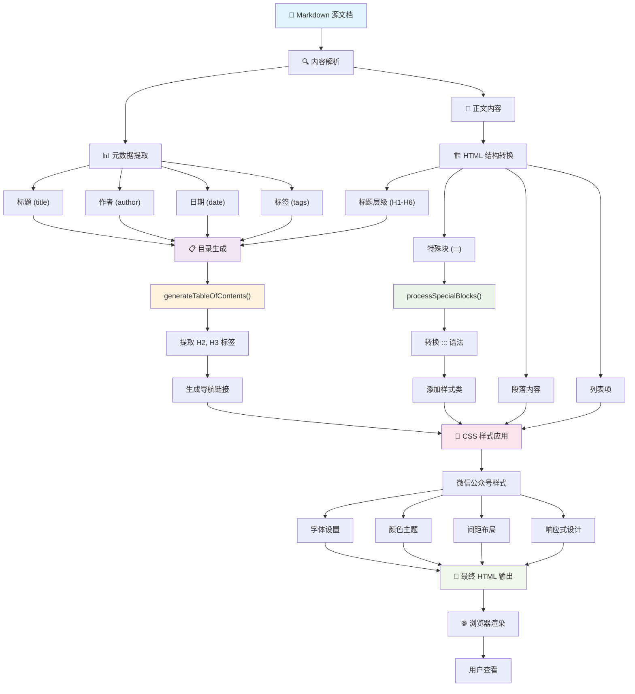
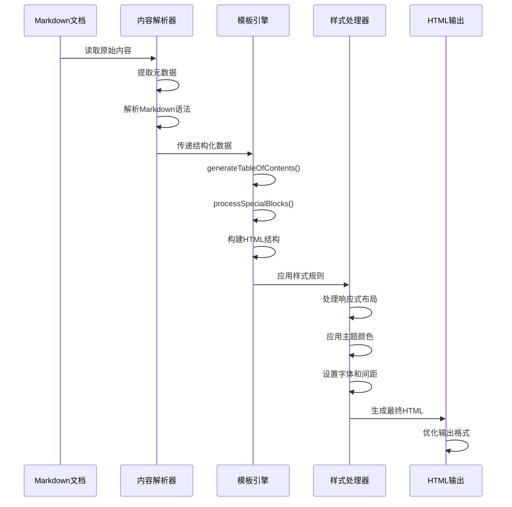

# 文章渲染模板逻辑与数据链分析

## 当前渲染流程分析

基于对目标文档、当前渲染结果和模板代码的分析，以下是文章渲染的整体逻辑和数据链：

## 当前问题分析

### 1. 标题格式化问题
- **问题**: 当前模板没有对不同层级的标题进行差异化样式处理
- **表现**: H1, H2, H3 等标题样式相似，缺乏层次感
- **影响**: 文章结构不清晰，阅读体验差

### 2. 章节分割问题
- **问题**: 缺乏章节间的视觉分割
- **表现**: 各章节内容连续显示，没有明显的分界线
- **影响**: 内容显得拥挤，难以快速定位

### 3. 内容块处理问题
- **问题**: 特殊内容块（如引用、代码、提示等）样式单一
- **表现**: 所有特殊块都使用相同的样式
- **影响**: 无法突出重要信息

### 4. 目录功能问题
- **问题**: 目录生成逻辑简单，缺乏交互性
- **表现**: 只是简单的链接列表
- **影响**: 导航体验不佳

## 数据流详细分析

## 改进方向

### 1. 标题层级样式优化
- 为不同层级标题设计差异化样式
- 添加标题编号和图标
- 增强视觉层次感

### 2. 章节分割优化
- 添加章节分割线
- 设计章节头部样式
- 增加章节间距

### 3. 内容块类型扩展
- 支持更多特殊块类型（警告、提示、代码等）
- 为不同类型设计专属样式
- 增加图标和颜色区分

### 4. 交互功能增强
- 优化目录导航
- 添加返回顶部功能
- 支持章节折叠展开

### 5. 移动端适配
- 优化移动端显示效果
- 调整字体大小和行距
- 改善触摸交互体验