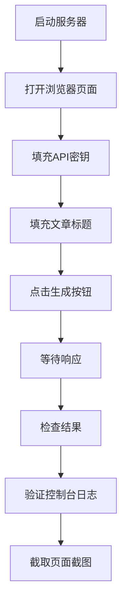
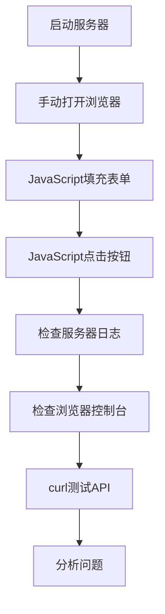

# 使用Playwright进行前端测试的经验总结

## 项目背景

在AI驱动内容代理项目的开发过程中，我们尝试使用Playwright MCP工具进行自动化前端测试，以验证前后端API连接和用户界面功能。

## Playwright工具使用经验

### 1. 预期的Playwright功能

在理想情况下，Playwright MCP工具应该提供以下功能：

#### 页面操作工具
- `playwright_goto`: 导航到指定URL
- `playwright_click`: 点击页面元素
- `playwright_fill`: 填充表单字段
- `playwright_type`: 输入文本
- `playwright_reload`: 刷新页面

#### 页面状态检查
- `playwright_wait_for_selector`: 等待元素出现
- `playwright_get_text`: 获取元素文本
- `playwright_screenshot`: 截取页面截图
- `playwright_console_logs`: 获取控制台日志

#### 网络和性能
- `playwright_network_logs`: 获取网络请求日志
- `playwright_performance`: 性能指标监控

### 2. 实际遇到的问题

#### 工具不可用问题
```
mcp error: MCP tool is not found
```

**问题分析**:
- Playwright MCP服务器配置可能有问题
- MCP连接可能中断
- 工具名称可能不正确

**尝试的解决方案**:
1. 检查MCP服务器列表配置
2. 尝试不同的工具名称
3. 重启MCP服务

### 3. 替代测试方案

当Playwright工具不可用时，我们采用了以下替代方案：

#### 3.1 JavaScript直接执行
```javascript
// 强制刷新页面并清除缓存
window.location.reload(true);

// 填充表单字段
document.getElementById('api-key').value = 'aiwenchuang';
document.getElementById('workflow-title').value = 'API连接测试';

// 触发点击事件
document.getElementById('generate-article-btn').click();
```

#### 3.2 手动浏览器操作
- 手动打开浏览器
- 手动填充表单
- 手动点击按钮
- 手动检查控制台日志

#### 3.3 curl命令测试API
```bash
curl -X POST http://localhost:8787/api/v1/workflows/dify-article/execute \
  -H "Content-Type: application/json" \
  -H "X-API-Key: aiwenchuang" \
  -d '{"title":"测试文章","style":"专业","context":"这是一个测试"}'
```

## 测试流程设计

### 1. 理想的自动化测试流程



### 2. 实际执行的测试流程



## 遇到的具体问题与解决方案

### 1. 缓存问题

**问题现象**:
- 代码更改后，前端行为没有变化
- 旧的JavaScript代码仍在执行
- API请求使用旧的参数

**解决方案**:
```javascript
// 方法1: 强制刷新页面
window.location.reload(true);

// 方法2: 清除特定缓存
if ('caches' in window) {
  caches.keys().then(names => {
    names.forEach(name => {
      caches.delete(name);
    });
  });
}

// 方法3: 添加时间戳到请求
const apiUrl = `${baseUrl}?t=${Date.now()}`;
```

**预防措施**:
- 开发时禁用浏览器缓存
- 使用版本号管理静态资源
- 设置合适的缓存头

### 2. 网络连接问题

**问题现象**:
```
ERR_CONNECTION_REFUSED
503 Service Unavailable
403 Forbidden
ERR_EMPTY_RESPONSE
```

**排查步骤**:
1. 检查服务器是否运行
2. 验证端口是否正确
3. 检查防火墙设置
4. 验证API密钥
5. 检查CORS配置

**解决方案**:
```javascript
// 添加重试机制
async function fetchWithRetry(url, options, maxRetries = 3) {
  for (let i = 0; i < maxRetries; i++) {
    try {
      const response = await fetch(url, options);
      if (response.ok) return response;
      throw new Error(`HTTP ${response.status}`);
    } catch (error) {
      if (i === maxRetries - 1) throw error;
      await new Promise(resolve => setTimeout(resolve, 1000 * (i + 1)));
    }
  }
}
```

### 3. API认证问题

**问题现象**:
- 403 Forbidden错误
- API密钥验证失败
- 后端没有收到认证头

**调试方法**:
```javascript
// 检查请求头
console.log('Request headers:', {
  'Content-Type': 'application/json',
  'X-API-Key': apiKey
});

// 验证API密钥格式
console.log('API Key length:', apiKey.length);
console.log('API Key value:', apiKey);
```

**解决方案**:
- 确保API密钥正确设置
- 验证请求头格式
- 检查服务器端验证逻辑

## 测试工具对比

### 1. Playwright vs 手动测试

| 特性 | Playwright | 手动测试 |
|------|------------|----------|
| 自动化程度 | 高 | 低 |
| 执行速度 | 快 | 慢 |
| 可重复性 | 高 | 低 |
| 调试难度 | 中 | 低 |
| 环境依赖 | 高 | 低 |
| 成本 | 低(长期) | 高(长期) |

### 2. 不同测试方法的适用场景

#### Playwright适用于:
- 回归测试
- 批量测试
- CI/CD集成
- 性能测试

#### 手动测试适用于:
- 探索性测试
- 用户体验测试
- 复杂交互测试
- 工具不可用时的应急方案

## 最佳实践建议

### 1. 测试环境准备

```bash
# 确保服务器运行
npm run dev

# 检查端口占用
lsof -i :8787

# 清除浏览器缓存
# Chrome: Cmd+Shift+R (macOS)
# 或使用开发者工具的"Disable cache"
```

### 2. 测试数据管理

```javascript
// 使用测试专用的API密钥
const TEST_API_KEY = 'test_key_123';

// 使用固定的测试数据
const TEST_DATA = {
  title: 'API连接测试',
  style: '专业',
  context: '这是一个自动化测试'
};
```

### 3. 错误处理和日志记录

```javascript
// 详细的错误日志
try {
  const response = await fetch(apiUrl, options);
  console.log('✅ Request successful:', response.status);
} catch (error) {
  console.error('❌ Request failed:', {
    error: error.message,
    url: apiUrl,
    options: options,
    timestamp: new Date().toISOString()
  });
}
```

### 4. 测试结果验证

```javascript
// 验证响应格式
function validateResponse(data) {
  const required = ['title', 'content', 'style'];
  return required.every(field => data.hasOwnProperty(field));
}

// 验证UI状态
function validateUIState() {
  const button = document.getElementById('generate-article-btn');
  const isDisabled = button.disabled;
  const hasLoadingClass = button.classList.contains('loading');
  return { isDisabled, hasLoadingClass };
}
```

## 工具配置和故障排除

### 1. MCP Playwright配置检查

```json
// 检查MCP服务器配置
{
  "server_name": "mcp.config.usrlocalmcp.playwright",
  "description": "",
  "tools": []
}
```

### 2. 常见故障排除

#### MCP工具不可用
```bash
# 检查MCP服务状态
ps aux | grep mcp

# 重启MCP服务
# (具体命令取决于MCP配置)
```

#### 浏览器连接问题
```javascript
// 检查浏览器是否支持所需功能
if (!window.fetch) {
  console.error('Fetch API not supported');
}

if (!window.EventSource) {
  console.error('Server-Sent Events not supported');
}
```

## 总结

### 关键经验

1. **工具依赖性**: 不要完全依赖单一测试工具，准备备用方案
2. **缓存管理**: 开发过程中要特别注意缓存问题
3. **分层测试**: 前端、后端、API分别测试，逐层排查问题
4. **日志记录**: 详细的日志是快速定位问题的关键
5. **环境一致性**: 确保开发、测试、生产环境的一致性

### 改进建议

1. **建立测试套件**: 创建标准化的测试用例
2. **自动化部署**: 集成测试到CI/CD流程
3. **监控告警**: 设置自动化监控和告警机制
4. **文档维护**: 及时更新测试文档和故障排除指南

### 未来规划

1. **工具升级**: 研究更稳定的测试工具替代方案
2. **测试覆盖**: 扩大测试覆盖范围，包括边界情况
3. **性能测试**: 添加性能和负载测试
4. **用户体验**: 增加用户体验相关的测试指标