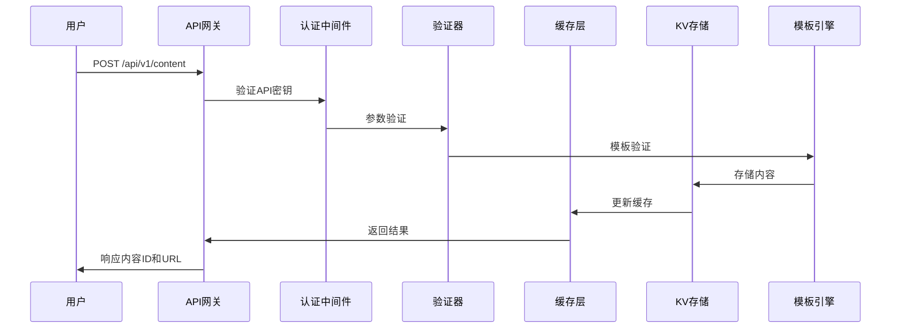
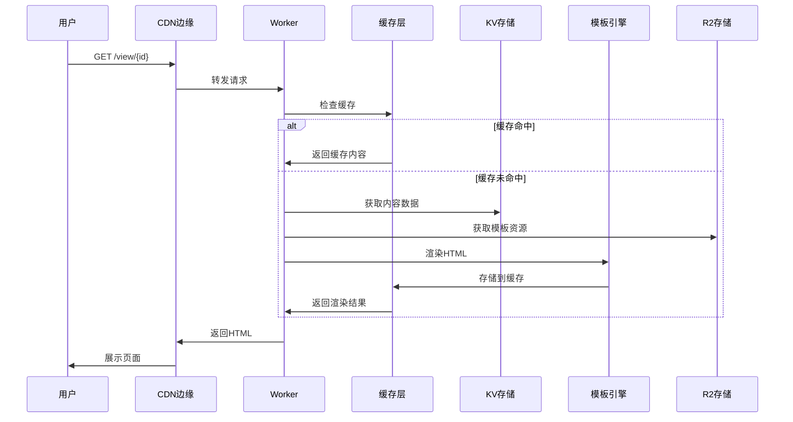
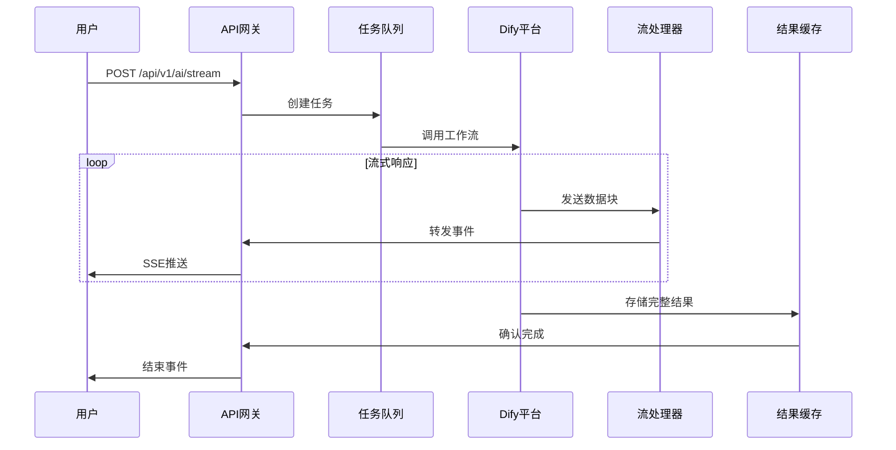
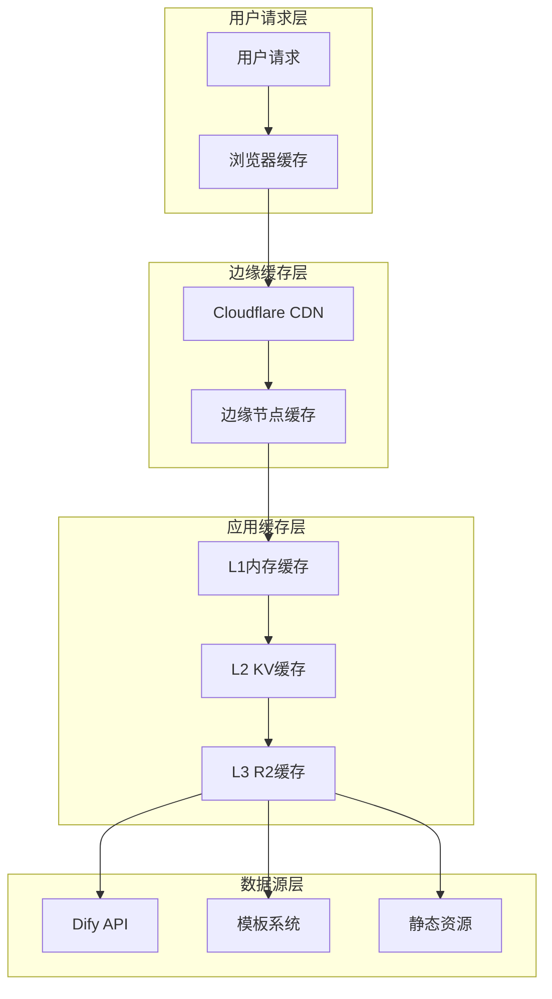
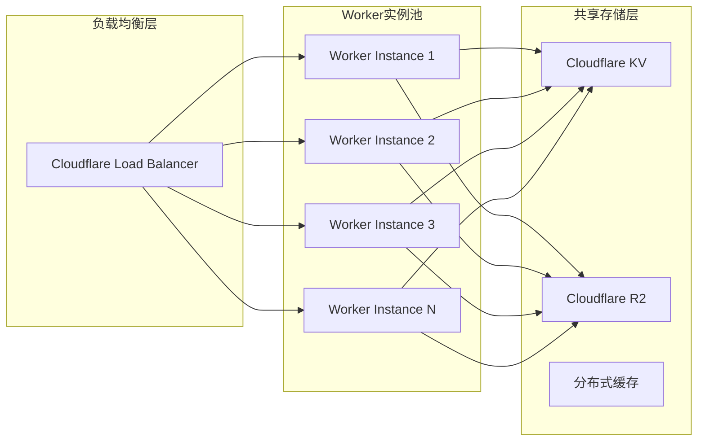
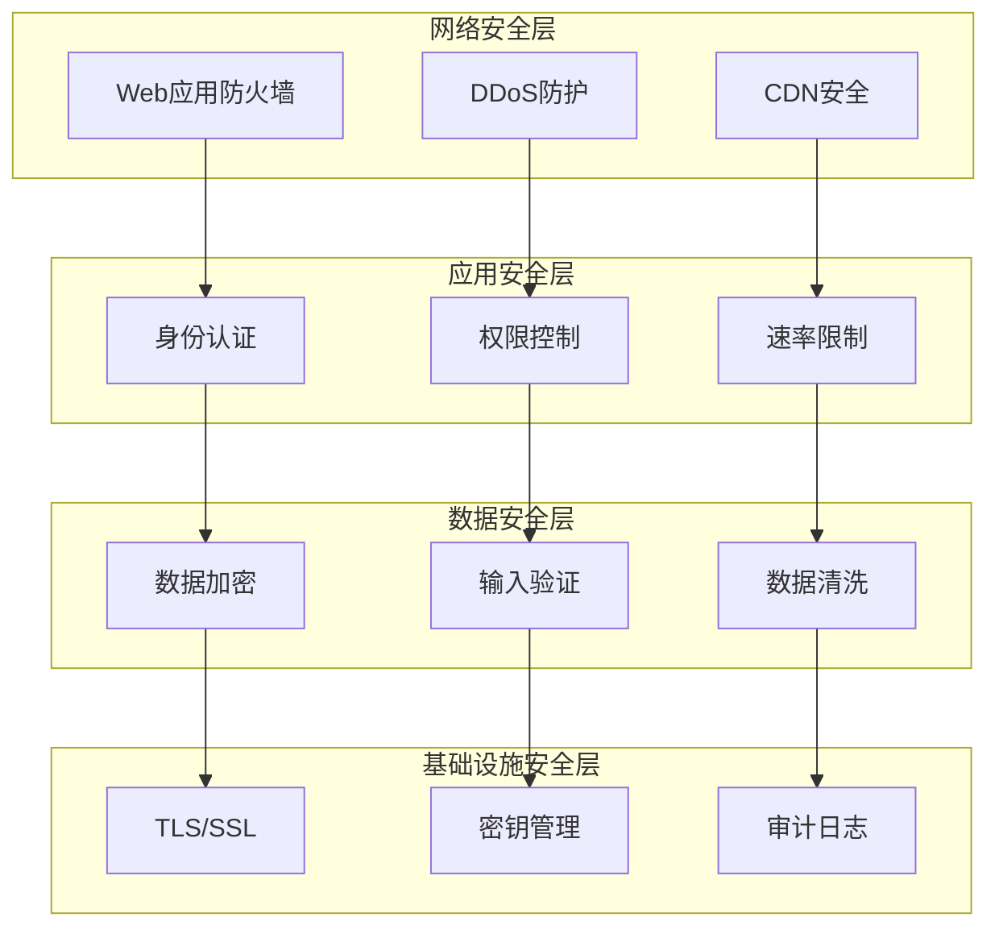
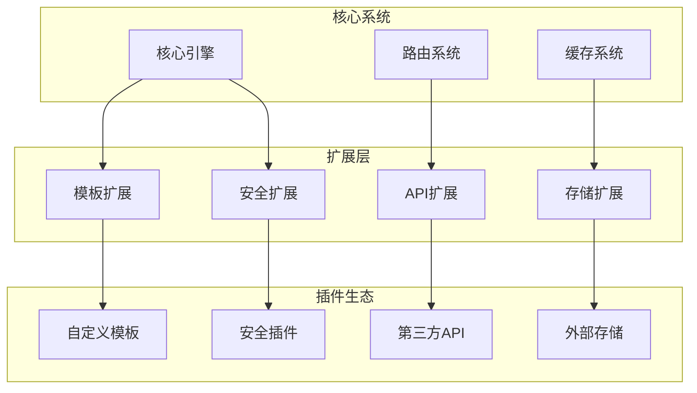
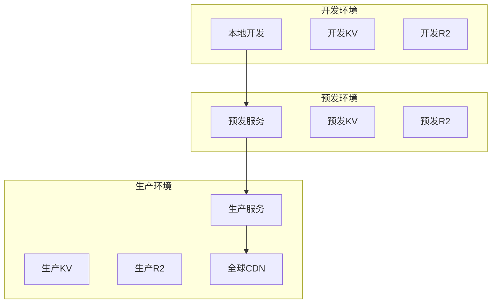

# AI驱动内容代理 - 整体架构设计

## 项目概述

AI驱动内容代理是一个基于Cloudflare Workers的现代化智能内容生成和渲染平台。该项目深度集成Dify AI工作流，提供多样化的模板样式和高性能的Markdown内容渲染服务，支持阻塞式和流式两种AI内容生成模式，为用户提供灵活、高效的内容创作体验。

### 核心价值
- **智能化内容生成**: 基于Dify AI平台的先进工作流引擎
- **边缘计算优势**: 利用Cloudflare Workers全球分布式架构
- **模板化渲染**: 提供专业级的内容展示模板
- **开发者友好**: 完整的API体系和扩展机制

## 系统架构

### 整体架构设计

本项目采用现代化的三层架构模式，充分利用Cloudflare生态系统的优势：

```
┌─────────────────────────────────────────────────────────────┐
│                 Cloudflare Workers 边缘计算层               │
├─────────────────────────────────────────────────────────────┤
│  ┌─────────────┐  ┌─────────────┐  ┌─────────────────────┐  │
│  │   前端UI    │  │  静态资源   │  │     API网关         │  │
│  │   服务层    │  │   CDN服务   │  │     路由处理        │  │
│  └─────────────┘  └─────────────┘  └─────────────────────┘  │
├─────────────────────────────────────────────────────────────┤
│  ┌─────────────┐  ┌─────────────┐  ┌─────────────────────┐  │
│  │ 模板引擎    │  │  AI服务     │  │   存储管理器        │  │
│  │ 渲染系统    │  │  集成层     │  │   缓存策略          │  │
│  └─────────────┘  └─────────────┘  └─────────────────────┘  │
└─────────────────────────────────────────────────────────────┘
                              │
                              ▼
┌─────────────────────────────────────────────────────────────┐
│                     外部服务集成层                          │
├─────────────────────────────────────────────────────────────┤
│  ┌─────────────┐  ┌─────────────┐  ┌─────────────────────┐  │
│  │ Dify AI     │  │ Cloudflare  │  │   第三方服务        │  │
│  │ 工作流平台  │  │ KV/R2存储   │  │   扩展接口          │  │
│  └─────────────┘  └─────────────┘  └─────────────────────┘  │
└─────────────────────────────────────────────────────────────┘
```

### 架构特点

1. **边缘优先**: 基于Cloudflare Workers的全球边缘计算网络
2. **服务分层**: 清晰的职责分离，便于维护和扩展
3. **高可用性**: 分布式架构，自动故障转移
4. **性能优化**: 多级缓存策略，最小化延迟

## 项目结构设计

### 目录架构

项目采用现代化的模块化目录结构，遵循关注点分离和单一职责原则：

```
ai_driven_content_agent/
├── src/                          # 核心源代码
│   ├── index.js                  # Worker入口点
│   ├── api/                      # API集成层
│   │   ├── dify.js              # Dify阻塞式API
│   │   └── difyArticle.js       # Dify流式API
│   ├── services/                # 业务服务层
│   │   ├── templateManager.js   # 模板管理器
│   │   ├── cacheManager.js      # 缓存管理器 (规划中)
│   │   └── errorHandler.js      # 错误处理器 (规划中)
│   ├── utils/                   # 工具函数库
│   │   ├── validators.js        # 数据验证
│   │   ├── formatters.js        # 格式化工具
│   │   └── constants.js         # 常量定义
│   └── middleware/              # 中间件层
│       ├── cors.js              # CORS处理
│       ├── auth.js              # 认证中间件
│       └── rateLimit.js         # 限流中间件
├── templates/                    # 模板系统
│   ├── base/                    # 基础模板
│   │   └── BaseTemplate.js      # 模板基类
│   ├── presets/                 # 预设模板
│   │   ├── general.js           # 通用模板
│   │   ├── tech_intro.js        # 技术介绍
│   │   ├── news_broad.js        # 新闻广播
│   │   ├── tech_interpre.js     # 技术解释
│   │   └── video_interpre.js    # 视频解释
│   ├── custom/                  # 自定义模板
│   └── index.js                 # 模板注册中心
├── public/                      # 前端资源
│   ├── index.html              # 主界面
│   ├── styles.css              # 样式表
│   ├── script.js               # 交互脚本
│   └── assets/                 # 静态资源
│       ├── icons/              # 图标文件
│       └── images/             # 图片资源
├── docs/                        # 项目文档
│   ├── architecture/           # 架构文档
│   │   ├── 整体规划设计.md      # 总体设计
│   │   ├── API服务设计.md       # API设计
│   │   └── 模板开发设计.md      # 模板设计
│   ├── deployment/             # 部署文档
│   │   ├── DEPLOYMENT.md       # 部署指南
│   │   └── OPERATIONS.md       # 运维手册
│   ├── development/            # 开发文档
│   │   ├── 前端界面设计.md      # 前端设计
│   │   └── 工作流集成设计.md    # 工作流集成
│   └── troubleshooting/        # 故障排除
│       └── 故障排障设计.md      # 故障处理
├── tests/                       # 测试套件
│   ├── unit/                   # 单元测试
│   ├── integration/            # 集成测试
│   └── e2e/                    # 端到端测试
├── scripts/                     # 构建脚本
│   ├── build.js                # 构建脚本
│   ├── deploy.sh               # 部署脚本
│   └── test.js                 # 测试脚本
└── config/                      # 配置文件
    ├── wrangler.toml           # Worker配置
    ├── package.json            # 项目配置
    └── .env.example            # 环境变量模板
```

### 设计原则

1. **模块化设计**: 每个模块职责单一，接口清晰
2. **分层架构**: API层、服务层、数据层清晰分离
3. **可扩展性**: 预留扩展点，支持功能增强
4. **可维护性**: 代码组织清晰，便于维护和调试
5. **文档驱动**: 完整的文档体系，支持团队协作
6. **测试友好**: 完善的测试结构，保证代码质量

## 核心组件设计

### 1. Worker入口层 (src/index.js)

**架构职责**:
- Cloudflare Worker运行时入口
- 请求路由与分发
- 中间件管道处理
- 全局错误捕获

**核心实现架构**:
```javascript
import { Router } from './utils/router.js';
import { corsMiddleware } from './middleware/cors.js';
import { authMiddleware } from './middleware/auth.js';
import { errorHandler } from './services/errorHandler.js';

export default {
  async fetch(request, env, ctx) {
    try {
      const router = new Router();
      
      // 中间件管道
      await corsMiddleware(request);
      await authMiddleware(request, env);
      
      // 路由处理
      return await router.handle(request, env, ctx);
    } catch (error) {
      return errorHandler.handle(error, request);
    }
  }
}
```

**重构改进**:
- 移除了重复的模板定义代码
- 使用TemplateManager统一管理模板
- 简化了代码结构，提高可维护性
- 引入中间件管道模式
- 统一错误处理机制

### 2. API集成层 (src/api/)

#### 2.1 Dify阻塞式集成 (dify.js)

**核心特性**:
- 同步工作流调用
- 智能重试策略
- 超时与熔断机制
- 响应数据验证

**实现架构**:
```javascript
export class DifyBlockingAPI {
  constructor(config) {
    this.config = config;
    this.retryPolicy = new RetryPolicy(config.retry);
  }
  
  async callWorkflow(inputs, options = {}) {
    return await this.retryPolicy.execute(async () => {
      const response = await this.makeRequest(inputs, options);
      return this.validateResponse(response);
    });
  }
  
  async makeRequest(inputs, options) {
    // HTTP请求实现
  }
  
  validateResponse(response) {
    // 响应验证逻辑
  }
}
```

**核心特性**:
- 重试机制: 默认2次重试，支持502/504/429状态码重试
- 超时控制: 60秒超时限制
- 错误处理: 多层级错误解析和处理
- 响应解析: 支持多种响应数据结构

#### 2.2 Dify流式集成 (difyArticle.js)

**核心特性**:
- 服务器发送事件(SSE)
- 实时数据流处理
- 连接状态管理
- 事件类型解析

**实现架构**:
```javascript
export class DifyStreamingAPI {
  constructor(config) {
    this.config = config;
    this.eventParser = new EventParser();
  }
  
  async *streamWorkflow(inputs, options = {}) {
    const stream = await this.createStream(inputs, options);
    
    for await (const chunk of stream) {
      const events = this.eventParser.parse(chunk);
      for (const event of events) {
        yield this.processEvent(event);
      }
    }
  }
  
  async createStream(inputs, options) {
    // 流式连接创建
  }
  
  processEvent(event) {
    // 事件处理逻辑
  }
}
```

**核心特性**:
- 流式处理: 支持分块数据接收和处理
- 回调系统: onStart/onProgress/onComplete/onError事件
- 超时控制: 5分钟超时限制
- 模拟数据: 网络错误时的降级处理

### 3. 业务服务层 (src/services/)

#### 3.1 模板管理器 (templateManager.js)

**核心职责**:
- 模板生命周期管理
- 动态模板加载
- 渲染引擎集成
- 模板缓存优化

**实现架构**:
```javascript
export class TemplateManager {
  constructor(cacheManager) {
    this.templates = new Map();
    this.cache = cacheManager;
    this.validator = new TemplateValidator();
  }
  
  async registerTemplate(template) {
    await this.validator.validate(template);
    this.templates.set(template.name, template);
    await this.cache.set(`template:${template.name}`, template);
  }
  
  async getTemplate(name) {
    // 缓存优先获取
    let template = await this.cache.get(`template:${name}`);
    if (!template) {
      template = this.templates.get(name);
      if (template) {
        await this.cache.set(`template:${name}`, template);
      }
    }
    return template;
  }
  
  async renderContent(templateName, data, options = {}) {
    const template = await this.getTemplate(templateName);
    if (!template) {
      throw new Error(`Template '${templateName}' not found`);
    }
    
    return await template.render(data, options);
  }
}
```

**API设计**:
```javascript
// 获取可用模板列表
getAvailableTemplates(): Array<TemplateInfo>

// 获取指定模板
getTemplate(name: string): Template

// 渲染模板
render(templateName: string, title: string, content: string): string

// 验证模板有效性
isValidTemplate(name: string): boolean
```

#### 3.2 缓存管理器 (cacheManager.js)

**核心特性**:
- 多级缓存策略
- 智能缓存失效
- 内存与KV存储结合
- 缓存性能监控

**实现架构**:
```javascript
export class CacheManager {
  constructor(kvStore) {
    this.memoryCache = new Map();
    this.kvStore = kvStore;
    this.metrics = new CacheMetrics();
  }
  
  async get(key) {
    // L1: 内存缓存
    if (this.memoryCache.has(key)) {
      this.metrics.recordHit('memory');
      return this.memoryCache.get(key);
    }
    
    // L2: KV存储
    const value = await this.kvStore.get(key);
    if (value) {
      this.metrics.recordHit('kv');
      this.memoryCache.set(key, value);
      return value;
    }
    
    this.metrics.recordMiss();
    return null;
  }
  
  async set(key, value, ttl = 3600) {
    this.memoryCache.set(key, value);
    await this.kvStore.put(key, value, { expirationTtl: ttl });
  }
}
```

#### 3.3 错误处理器 (errorHandler.js)

**核心特性**:
- 统一错误处理
- 错误分类与记录
- 优雅降级策略
- 监控集成

**实现架构**:
```javascript
export class ErrorHandler {
  constructor(logger, monitor) {
    this.logger = logger;
    this.monitor = monitor;
  }
  
  handle(error, request) {
    const errorInfo = this.classifyError(error);
    
    // 记录错误
    this.logger.error(errorInfo);
    this.monitor.recordError(errorInfo);
    
    // 返回用户友好的响应
    return this.createErrorResponse(errorInfo, request);
  }
  
  classifyError(error) {
    // 错误分类逻辑
  }
  
  createErrorResponse(errorInfo, request) {
    // 错误响应生成
  }
}
```

### 4. 模板系统架构 (templates/)

#### 4.1 模板系统设计

**架构特点**:
- 基于继承的模板体系
- 插件化扩展机制
- 类型安全的模板接口
- 动态样式系统

**基础模板类 (base/BaseTemplate.js)**:
```javascript
export class BaseTemplate {
  constructor(config) {
    this.name = config.name;
    this.displayName = config.displayName;
    this.description = config.description;
    this.version = config.version || '1.0.0';
    this.styles = new StyleManager(config.styles);
    this.validator = new ContentValidator(config.validation);
  }
  
  async render(content, options = {}) {
    // 内容验证
    await this.validator.validate(content);
    
    // 预处理
    const processedContent = await this.preprocess(content, options);
    
    // 核心渲染
    const rendered = await this.doRender(processedContent, options);
    
    // 后处理
    return await this.postprocess(rendered, options);
  }
  
  async preprocess(content, options) {
    // 内容预处理逻辑
    return content;
  }
  
  async doRender(content, options) {
    // 子类实现具体渲染逻辑
    throw new Error('doRender must be implemented by subclass');
  }
  
  async postprocess(rendered, options) {
    // 渲染后处理
    return rendered;
  }
  
  getMetadata() {
    return {
      name: this.name,
      displayName: this.displayName,
      description: this.description,
      version: this.version,
      capabilities: this.getCapabilities()
    };
  }
  
  getCapabilities() {
    return {
      responsive: true,
      themeable: true,
      customizable: true
    };
  }
}
```

#### 4.2 预设模板实现

**通用模板 (presets/general.js)**:
```javascript
import { BaseTemplate } from '../base/BaseTemplate.js';

export class GeneralTemplate extends BaseTemplate {
  constructor() {
    super({
      name: 'general',
      displayName: '通用模板',
      description: '适用于各种内容类型的通用模板',
      styles: {
        layout: 'clean',
        typography: 'readable',
        spacing: 'comfortable'
      },
      validation: {
        required: ['content'],
        optional: ['title', 'author', 'date']
      }
    });
  }
  
  async doRender(content, options) {
    const { title, author, date } = options;
    
    return `
      <article class="general-template">
        ${title ? `<header><h1>${title}</h1></header>` : ''}
        ${this.renderMetadata(author, date)}
        <main class="content">
          ${await this.renderMarkdown(content)}
        </main>
      </article>
    `;
  }
  
  renderMetadata(author, date) {
    if (!author && !date) return '';
    
    return `
      <div class="metadata">
        ${author ? `<span class="author">作者: ${author}</span>` : ''}
        ${date ? `<time class="date">${date}</time>` : ''}
      </div>
    `;
  }
}
```

**技术介绍模板 (presets/tech_intro.js)**:
```javascript
import { BaseTemplate } from '../base/BaseTemplate.js';

export class TechIntroTemplate extends BaseTemplate {
  constructor() {
    super({
      name: 'tech_intro',
      displayName: '技术介绍',
      description: '专为技术内容设计的介绍模板',
      styles: {
        layout: 'technical',
        codeHighlight: true,
        diagramSupport: true
      }
    });
  }
  
  async doRender(content, options) {
    const processedContent = await this.enhanceCodeBlocks(content);
    
    return `
      <article class="tech-intro-template">
        <div class="tech-header">
          <div class="tech-badge">技术介绍</div>
          ${options.difficulty ? `<div class="difficulty">${options.difficulty}</div>` : ''}
        </div>
        <main class="tech-content">
          ${await this.renderMarkdown(processedContent)}
        </main>
        ${this.renderTechFooter(options)}
      </article>
    `;
  }
  
  async enhanceCodeBlocks(content) {
    // 增强代码块显示
    return content.replace(/```(\w+)\n([\s\S]*?)```/g, (match, lang, code) => {
      return `<div class="code-block" data-language="${lang}">
        <div class="code-header">${lang}</div>
        <pre><code class="language-${lang}">${code}</code></pre>
      </div>`;
    });
  }
}
```

#### 4.3 模板注册中心 (index.js)

```javascript
import { TemplateRegistry } from './base/TemplateRegistry.js';
import { GeneralTemplate } from './presets/general.js';
import { TechIntroTemplate } from './presets/tech_intro.js';
import { NewsBroadTemplate } from './presets/news_broad.js';
import { TechInterpreTemplate } from './presets/tech_interpre.js';
import { VideoInterpreTemplate } from './presets/video_interpre.js';

export class TemplateSystem {
  constructor() {
    this.registry = new TemplateRegistry();
    this.initializePresets();
  }
  
  initializePresets() {
    // 注册预设模板
    this.registry.register(new GeneralTemplate());
    this.registry.register(new TechIntroTemplate());
    this.registry.register(new NewsBroadTemplate());
    this.registry.register(new TechInterpreTemplate());
    this.registry.register(new VideoInterpreTemplate());
  }
  
  getTemplate(name) {
    return this.registry.get(name);
  }
  
  listTemplates() {
    return this.registry.list();
  }
  
  async registerCustomTemplate(template) {
    await this.registry.register(template);
  }
}

// 导出单例实例
export const templateSystem = new TemplateSystem();
```

#### 4.4 模板特性

**响应式设计**:
- 移动优先的CSS设计
- 自适应布局系统
- 触摸友好的交互

**主题系统**:
- 亮色/暗色主题切换
- 自定义颜色方案
- 字体大小调节

**扩展能力**:
- 自定义CSS注入
- 插件式功能扩展
- 模板继承机制

**性能优化**:
- 模板缓存机制
- 懒加载支持
- 渲染性能监控

**可用模板**:
1. **通用模板 (general)**: 适用于各种场景的通用样式
2. **技术介绍 (tech_intro)**: 专为技术产品介绍设计
3. **新闻广播 (news_broad)**: 新闻和公告发布样式
4. **技术解释 (tech_interpre)**: 深入技术概念解释
5. **视频解释 (video_interpre)**: 视频内容讲解样式

## RESTful API架构设计

### API设计原则

1. **RESTful规范**: 遵循REST架构风格，资源导向设计
2. **版本控制**: 支持API版本管理，向后兼容
3. **统一响应**: 标准化响应格式，便于客户端处理
4. **错误处理**: 完善的错误码体系和错误信息
5. **安全机制**: API密钥认证，请求限流保护
6. **文档驱动**: 完整的API文档和示例

### API端点架构

| 端点 | 方法 | 功能描述 | 版本 | 状态 |
|------|------|----------|------|------|
| `/api/v1/status` | GET | 系统健康检查 | v1 | ✅ 生产就绪 |
| `/api/v1/templates` | GET | 模板资源列表 | v1 | ✅ 生产就绪 |
| `/api/v1/content` | POST | 内容资源创建 | v1 | ✅ 生产就绪 |
| `/api/v1/content/{id}` | GET | 内容资源获取 | v1 | ✅ 生产就绪 |
| `/api/v1/ai/generate` | POST | AI内容生成(阻塞) | v1 | ✅ 生产就绪 |
| `/api/v1/ai/stream` | POST | AI内容生成(流式) | v1 | ✅ 生产就绪 |
| `/view/{id}` | GET | 内容渲染展示 | - | ✅ 生产就绪 |
| `/` | GET | Web应用界面 | - | ✅ 生产就绪 |

### API详细规范

#### 1. 系统状态检查

```http
GET /api/v1/status
Accept: application/json
```

**功能**: 检查系统运行状态和健康指标

**响应格式**:
```json
{
  "status": "healthy",
  "timestamp": "2024-01-01T00:00:00.000Z",
  "version": "1.2.0",
  "environment": "production",
  "services": {
    "dify_api": "connected",
    "kv_storage": "operational",
    "template_engine": "ready"
  },
  "metrics": {
    "uptime": 86400,
    "requests_total": 12345,
    "cache_hit_rate": 0.85
  }
}
```

#### 2. 模板资源管理

```http
GET /api/v1/templates
Accept: application/json
```

**功能**: 获取可用模板列表和元数据

**查询参数**:
- `category`: 模板分类筛选
- `version`: 模板版本筛选
- `include_metadata`: 是否包含详细元数据

**响应格式**:
```json
{
  "success": true,
  "data": {
    "templates": [
      {
        "id": "general",
        "name": "general",
        "displayName": "通用模板",
        "description": "适用于各种内容类型的通用模板",
        "version": "1.0.0",
        "category": "general",
        "capabilities": {
          "responsive": true,
          "themeable": true,
          "customizable": true
        },
        "preview_url": "/templates/general/preview",
        "created_at": "2024-01-01T00:00:00.000Z",
        "updated_at": "2024-01-01T00:00:00.000Z"
      }
    ],
    "total": 5,
    "categories": ["general", "technical", "news", "video"]
  },
  "meta": {
    "request_id": "req_123456",
    "timestamp": "2024-01-01T00:00:00.000Z"
  }
}
```

#### 3. 内容资源创建

```http
POST /api/v1/content
Content-Type: application/json
Authorization: Bearer {api_key}

{
  "content": "# 文章标题\n\n这是文章内容...",
  "metadata": {
    "title": "自定义标题",
    "author": "作者名称",
    "tags": ["技术", "教程"],
    "template": "tech_intro"
  },
  "options": {
    "cache_ttl": 3600,
    "public": true,
    "expires_at": "2024-12-31T23:59:59.000Z"
  }
}
```

**功能**: 创建新的内容资源并存储

**响应格式**:
```json
{
  "success": true,
  "data": {
    "id": "content_abc123def456",
    "url": "/view/content_abc123def456",
    "api_url": "/api/v1/content/content_abc123def456",
    "preview_url": "/view/content_abc123def456?preview=true",
    "metadata": {
      "title": "自定义标题",
      "template": "tech_intro",
      "size": 1024,
      "word_count": 256
    },
    "created_at": "2024-01-01T00:00:00.000Z",
    "expires_at": "2024-12-31T23:59:59.000Z"
  },
  "meta": {
    "request_id": "req_789012",
    "processing_time": 150
  }
}
```

#### 4. 内容资源获取

```http
GET /api/v1/content/{id}
Accept: application/json
```

**功能**: 获取指定内容资源的原始数据

**查询参数**:
- `format`: 返回格式 (json|markdown|html)
- `include_metadata`: 是否包含元数据

**响应格式**:
```json
{
  "success": true,
  "data": {
    "id": "content_abc123def456",
    "content": "# 文章标题\n\n这是文章内容...",
    "metadata": {
      "title": "自定义标题",
      "author": "作者名称",
      "template": "tech_intro",
      "tags": ["技术", "教程"]
    },
    "stats": {
      "views": 42,
      "size": 1024,
      "word_count": 256
    },
    "created_at": "2024-01-01T00:00:00.000Z",
    "updated_at": "2024-01-01T00:00:00.000Z"
  }
}
```

#### 5. AI内容生成(阻塞式)

```http
POST /api/v1/ai/generate
Content-Type: application/json
Authorization: Bearer {dify_api_key}

{
  "workflow_id": "workflow_123",
  "inputs": {
    "query": "请介绍一下人工智能的发展历程",
    "style": "professional",
    "length": "medium"
  },
  "options": {
    "timeout": 30000,
    "temperature": 0.7,
    "max_tokens": 2000
  }
}
```

**功能**: 同步调用AI工作流生成内容

**响应格式**:
```json
{
  "success": true,
  "data": {
    "workflow_run_id": "run_abc123",
    "status": "completed",
    "result": {
      "content": "# 人工智能发展历程\n\n人工智能...",
      "metadata": {
        "word_count": 1500,
        "estimated_reading_time": "6分钟",
        "topics": ["AI历史", "技术发展", "未来趋势"]
      }
    },
    "usage": {
      "tokens_used": 1800,
      "processing_time": 15.5
    },
    "created_at": "2024-01-01T00:00:00.000Z",
    "completed_at": "2024-01-01T00:00:15.500Z"
  }
}
```

#### 6. AI内容生成(流式)

```http
POST /api/v1/ai/stream
Content-Type: application/json
Accept: text/event-stream
Authorization: Bearer {dify_api_key}

{
  "workflow_id": "workflow_123",
  "inputs": {
    "query": "请介绍一下人工智能的发展历程",
    "style": "professional"
  }
}
```

**功能**: 流式调用AI工作流，实时返回生成内容

**响应格式** (Server-Sent Events):
```
data: {"event": "workflow_started", "data": {"run_id": "run_abc123"}}

data: {"event": "node_started", "data": {"node_id": "llm_node", "node_type": "llm"}}

data: {"event": "text_chunk", "data": {"text": "# 人工智能发展历程\n\n"}}

data: {"event": "text_chunk", "data": {"text": "人工智能的发展可以追溯到..."}}

data: {"event": "workflow_finished", "data": {"status": "completed", "usage": {"tokens": 1800}}}
```

### 错误处理规范

**标准错误响应格式**:
```json
{
  "success": false,
  "error": {
    "code": "VALIDATION_ERROR",
    "message": "请求参数验证失败",
    "details": {
      "field": "content",
      "reason": "内容不能为空"
    },
    "request_id": "req_error_123",
    "timestamp": "2024-01-01T00:00:00.000Z"
  }
}
```

**错误码体系**:
- `400 BAD_REQUEST`: 请求参数错误
- `401 UNAUTHORIZED`: 认证失败
- `403 FORBIDDEN`: 权限不足
- `404 NOT_FOUND`: 资源不存在
- `429 RATE_LIMITED`: 请求频率超限
- `500 INTERNAL_ERROR`: 服务器内部错误
- `502 UPSTREAM_ERROR`: 上游服务错误
- `503 SERVICE_UNAVAILABLE`: 服务不可用

### 数据流架构设计

#### 1. 内容创建数据流



**关键步骤**:
1. **请求接收**: API网关接收并解析请求
2. **身份认证**: 验证API密钥有效性
3. **参数验证**: 检查内容格式和必需字段
4. **模板验证**: 确认指定模板存在且可用
5. **内容存储**: 生成唯一ID并存储到KV
6. **缓存更新**: 更新相关缓存条目
7. **响应返回**: 返回内容ID和访问URL

#### 2. 内容渲染数据流



**性能优化**:
- **多级缓存**: L1内存缓存 + L2 KV缓存
- **CDN加速**: 静态资源和页面缓存
- **懒加载**: 按需加载模板和资源
- **压缩传输**: Gzip/Brotli压缩

#### 3. AI工作流数据流



**流式处理特性**:
- **实时推送**: Server-Sent Events
- **断点续传**: 支持连接重建
- **错误恢复**: 自动重试机制
- **结果缓存**: 完整结果持久化

### 存储架构设计

#### KV存储架构

**命名空间设计**:
```javascript
// 内容数据命名空间
namespace: "content"
pattern: "content:{id}"
structure: {
  id: "content_abc123def456",
  content: "# 标题\n\n内容...",
  metadata: {
    title: "自定义标题",
    author: "作者",
    template: "tech_intro",
    tags: ["技术", "教程"],
    created_at: "2024-01-01T00:00:00.000Z",
    updated_at: "2024-01-01T00:00:00.000Z",
    expires_at: "2024-12-31T23:59:59.000Z"
  },
  stats: {
    views: 42,
    size: 1024,
    word_count: 256
  },
  options: {
    public: true,
    cache_ttl: 3600
  }
}

// 模板数据命名空间
namespace: "template"
pattern: "template:{name}:{version}"
structure: {
  id: "general",
  name: "general",
  version: "1.0.0",
  displayName: "通用模板",
  description: "适用于各种内容类型",
  category: "general",
  template_content: "<!DOCTYPE html>...",
  styles: {
    css: "body { margin: 0; }...",
    variables: {
      "--primary-color": "#007bff",
      "--font-family": "'Segoe UI', sans-serif"
    }
  },
  capabilities: {
    responsive: true,
    themeable: true,
    customizable: true
  },
  metadata: {
    created_at: "2024-01-01T00:00:00.000Z",
    updated_at: "2024-01-01T00:00:00.000Z",
    author: "system",
    usage_count: 1250
  }
}

// 缓存数据命名空间
namespace: "cache"
pattern: "cache:{type}:{key}"
examples: {
  "cache:rendered:content_abc123": "<html>渲染后的完整HTML</html>",
  "cache:template_list:v1": "[{模板列表数据}]",
  "cache:ai_result:workflow_123": "{AI生成结果}"
}

// 系统配置命名空间
namespace: "config"
pattern: "config:{section}:{key}"
examples: {
  "config:system:version": "1.2.0",
  "config:dify:default_workflow": "workflow_123",
  "config:cache:default_ttl": 3600
}
```

**数据生命周期管理**:
- **TTL策略**: 自动过期清理
- **版本控制**: 支持数据版本管理
- **备份机制**: 定期数据备份
- **清理策略**: 定期清理过期数据

#### R2存储架构

**目录结构设计**:
```
/ai-content-agent/
├── static/                     # 静态资源根目录
│   ├── css/                   # 样式文件
│   │   ├── base/              # 基础样式
│   │   │   ├── reset.css      # 样式重置
│   │   │   ├── typography.css # 字体排版
│   │   │   └── layout.css     # 布局样式
│   │   ├── components/        # 组件样式
│   │   │   ├── header.css     # 头部组件
│   │   │   ├── navigation.css # 导航组件
│   │   │   └── footer.css     # 底部组件
│   │   ├── themes/            # 主题样式
│   │   │   ├── light.css      # 亮色主题
│   │   │   ├── dark.css       # 暗色主题
│   │   │   └── auto.css       # 自动主题
│   │   └── templates/         # 模板专用样式
│   │       ├── general.css    # 通用模板样式
│   │       ├── tech_intro.css # 技术介绍样式
│   │       └── news_broad.css # 新闻播报样式
│   ├── js/                    # JavaScript文件
│   │   ├── core/              # 核心功能
│   │   │   ├── app.js         # 应用主文件
│   │   │   ├── api.js         # API通信
│   │   │   ├── router.js      # 路由管理
│   │   │   └── utils.js       # 工具函数
│   │   ├── components/        # 组件脚本
│   │   │   ├── template-selector.js # 模板选择器
│   │   │   ├── markdown-editor.js   # Markdown编辑器
│   │   │   ├── ai-generator.js      # AI生成器
│   │   │   └── theme-switcher.js    # 主题切换器
│   │   ├── modules/           # 功能模块
│   │   │   ├── dify-client.js # Dify客户端
│   │   │   ├── cache-manager.js # 缓存管理
│   │   │   └── error-handler.js # 错误处理
│   │   └── vendor/            # 第三方库
│   │       ├── marked.min.js  # Markdown解析
│   │       └── highlight.min.js # 代码高亮
│   ├── images/                # 图片资源
│   │   ├── icons/             # 图标文件
│   │   │   ├── favicon.ico    # 网站图标
│   │   │   ├── logo.svg       # 网站Logo
│   │   │   └── template-*.svg # 模板图标
│   │   ├── backgrounds/       # 背景图片
│   │   └── illustrations/     # 插图素材
│   └── fonts/                 # 字体文件
│       ├── inter/             # Inter字体族
│       └── source-code-pro/   # 代码字体
├── templates/                 # 模板文件
│   ├── base/                  # 基础模板
│   │   ├── layout.html        # 基础布局
│   │   ├── head.html          # 头部模板
│   │   └── footer.html        # 底部模板
│   ├── presets/               # 预设模板
│   │   ├── general.html       # 通用模板
│   │   ├── tech_intro.html    # 技术介绍
│   │   ├── news_broad.html    # 新闻播报
│   │   ├── tech_interpre.html # 技术解读
│   │   └── video_interpre.html # 视频解释
│   └── custom/                # 自定义模板
│       └── user-templates/    # 用户模板
├── assets/                    # 构建资源
│   ├── manifest.json          # 资源清单
│   ├── service-worker.js      # 服务工作者
│   └── app-config.json        # 应用配置
└── docs/                      # 文档资源
    ├── api/                   # API文档
    ├── guides/                # 使用指南
    └── examples/              # 示例文件
```

**存储优化策略**:
- **CDN集成**: 全球边缘节点缓存
- **压缩存储**: Gzip/Brotli压缩
- **版本管理**: 资源版本控制
- **缓存策略**: 合理的缓存头设置
- **懒加载**: 按需加载资源

**安全机制**:
- **访问控制**: 基于角色的权限管理
- **内容验证**: 文件类型和大小限制
- **防盗链**: Referer和Token验证
- **备份恢复**: 定期备份和恢复机制

## 技术栈架构

### 核心技术选型

#### 边缘计算平台

| 技术组件 | 版本/规格 | 核心功能 | 技术优势 | 应用场景 |
|----------|-----------|----------|----------|----------|
| **Cloudflare Workers** | Runtime V8 | 边缘计算执行环境 | • 全球300+节点<br>• 冷启动<10ms<br>• 自动扩展<br>• 零配置部署 | • API网关<br>• 业务逻辑处理<br>• 请求路由<br>• 中间件执行 |
| **Cloudflare KV** | 分布式存储 | 全球键值存储 | • 最终一致性<br>• 低延迟读取<br>• 无限扩展<br>• 边缘缓存 | • 内容存储<br>• 配置管理<br>• 缓存层<br>• 会话存储 |
| **Cloudflare R2** | 对象存储 | 静态资源存储 | • S3兼容API<br>• 零出站费用<br>• 11个9可用性<br>• 全球分发 | • 静态资源<br>• 模板文件<br>• 媒体资源<br>• 备份存储 |

#### AI集成平台

| 组件 | 版本 | 功能描述 | 集成优势 | 使用模式 |
|------|------|----------|----------|----------|
| **Dify Platform** | v0.6+ | AI工作流编排平台 | • 可视化编排<br>• 多模型支持<br>• 流式输出<br>• 企业级安全 | • 阻塞式调用<br>• 流式响应<br>• 工作流管理<br>• 结果缓存 |
| **OpenAI GPT** | GPT-4/3.5 | 大语言模型 | • 强大理解能力<br>• 多语言支持<br>• 上下文记忆<br>• 指令遵循 | • 内容生成<br>• 文本处理<br>• 智能问答<br>• 创意写作 |
| **Claude** | Claude-3 | 对话AI模型 | • 长文本处理<br>• 逻辑推理<br>• 安全可靠<br>• 多模态支持 | • 技术文档<br>• 代码解释<br>• 分析报告<br>• 教育内容 |

#### 前端技术栈

| 技术 | 版本 | 应用领域 | 实现特性 |
|------|------|----------|----------|
| **HTML5** | Living Standard | 页面结构 | • 语义化标签<br>• 无障碍支持<br>• SEO优化<br>• 现代API |
| **CSS3** | Level 4 | 样式设计 | • CSS Grid/Flexbox<br>• CSS变量<br>• 响应式设计<br>• 动画效果 |
| **JavaScript** | ES2023 | 交互逻辑 | • 模块化开发<br>• 异步编程<br>• 现代语法<br>• 类型安全 |
| **Web APIs** | Modern | 浏览器能力 | • Fetch API<br>• Web Workers<br>• Service Workers<br>• Storage APIs |

### 开发工具链

#### 核心开发工具

| 工具 | 版本 | 功能用途 | 配置要点 |
|------|------|----------|----------|
| **Wrangler CLI** | 3.0+ | Cloudflare开发工具 | • 本地开发服务器<br>• 部署管理<br>• 资源配置<br>• 日志查看 |
| **Node.js** | 18.0+ | JavaScript运行时 | • LTS版本<br>• npm包管理<br>• 构建脚本<br>• 开发服务器 |
| **Git** | 2.40+ | 版本控制系统 | • 分支策略<br>• 提交规范<br>• 钩子配置<br>• 协作流程 |

#### 开发环境配置

```javascript
// wrangler.toml - 开发配置
name = "ai-content-agent"
main = "src/index.js"
compatibility_date = "2024-01-01"
compatibility_flags = ["nodejs_compat"]

[env.development]
vars = {
  ENVIRONMENT = "development",
  DEBUG_MODE = "true",
  LOG_LEVEL = "debug"
}

[env.production]
vars = {
  ENVIRONMENT = "production",
  DEBUG_MODE = "false",
  LOG_LEVEL = "info"
}

[[kv_namespaces]]
binding = "CONTENT_KV"
id = "your-kv-namespace-id"
preview_id = "your-preview-kv-id"

[[r2_buckets]]
binding = "STATIC_ASSETS"
bucket_name = "ai-content-static"
preview_bucket_name = "ai-content-static-preview"
```

#### 质量保证工具

| 工具类型 | 工具名称 | 配置用途 | 质量标准 |
|----------|----------|----------|----------|
| **代码检查** | ESLint | JavaScript代码规范 | • Airbnb规范<br>• 自定义规则<br>• 自动修复<br>• CI集成 |
| **代码格式** | Prettier | 代码格式化 | • 统一风格<br>• 自动格式化<br>• 编辑器集成<br>• Git钩子 |
| **类型检查** | JSDoc/TypeScript | 类型安全 | • 类型注解<br>• 接口定义<br>• 编译检查<br>• IDE支持 |
| **测试框架** | Vitest | 单元测试 | • 快速执行<br>• 覆盖率报告<br>• 模拟功能<br>• 持续集成 |

### 第三方服务集成

#### 核心服务依赖

| 服务提供商 | 服务类型 | 集成方式 | 服务等级 |
|------------|----------|----------|----------|
| **Cloudflare** | 基础设施 | 原生集成 | • 99.99%可用性<br>• 全球CDN<br>• DDoS防护<br>• SSL/TLS |
| **Dify** | AI平台 | REST API | • API密钥认证<br>• 请求限流<br>• 错误重试<br>• 结果缓存 |
| **GitHub** | 代码托管 | Git协议 | • 私有仓库<br>• Actions CI/CD<br>• 问题跟踪<br>• 版本发布 |

## 性能优化架构

### 多级缓存体系

#### 缓存架构设计



#### 缓存策略配置

| 缓存层级 | 存储位置 | 缓存内容 | TTL策略 | 容量限制 | 更新策略 |
|----------|----------|----------|---------|----------|----------|
| **L1内存缓存** | Worker Runtime | • 热点API响应<br>• 模板元数据<br>• 配置信息 | • 5-15分钟<br>• 基于访问频率<br>• LRU淘汰 | 64MB | 被动失效 |
| **L2 KV缓存** | Cloudflare KV | • 生成内容<br>• 模板文件<br>• 用户配置 | • 1-24小时<br>• 基于内容类型<br>• 手动刷新 | 无限制 | 主动更新 |
| **L3 R2缓存** | Cloudflare R2 | • 静态资源<br>• 媒体文件<br>• 备份数据 | • 7-30天<br>• 版本控制<br>• 永久存储 | 无限制 | 版本管理 |
| **CDN缓存** | 全球边缘节点 | • 静态资源<br>• API响应<br>• 页面内容 | • 基于HTTP头<br>• 智能缓存<br>• 自动刷新 | 自动管理 | 智能更新 |

#### 缓存实现策略

```javascript
// src/utils/cache-manager.js - 缓存管理器
class CacheManager {
  constructor(env) {
    this.kv = env.CONTENT_KV;
    this.r2 = env.STATIC_ASSETS;
    this.memoryCache = new Map();
    this.maxMemorySize = 64 * 1024 * 1024; // 64MB
  }

  // L1内存缓存
  async getFromMemory(key) {
    const cached = this.memoryCache.get(key);
    if (cached && cached.expires > Date.now()) {
      return cached.data;
    }
    this.memoryCache.delete(key);
    return null;
  }

  async setToMemory(key, data, ttl = 300000) { // 5分钟默认TTL
    const expires = Date.now() + ttl;
    this.memoryCache.set(key, { data, expires });
    this.evictIfNeeded();
  }

  // L2 KV缓存
  async getFromKV(key) {
    try {
      const cached = await this.kv.get(key, { type: 'json' });
      if (cached && cached.expires > Date.now()) {
        return cached.data;
      }
      if (cached) {
        await this.kv.delete(key); // 清理过期数据
      }
      return null;
    } catch (error) {
      console.error('KV cache error:', error);
      return null;
    }
  }

  async setToKV(key, data, ttl = 3600000) { // 1小时默认TTL
    const expires = Date.now() + ttl;
    const cacheData = { data, expires, timestamp: Date.now() };
    await this.kv.put(key, JSON.stringify(cacheData));
  }

  // 智能缓存获取
  async get(key, options = {}) {
    const { useMemory = true, useKV = true, useR2 = false } = options;

    // L1内存缓存
    if (useMemory) {
      const memoryResult = await this.getFromMemory(key);
      if (memoryResult) return memoryResult;
    }

    // L2 KV缓存
    if (useKV) {
      const kvResult = await this.getFromKV(key);
      if (kvResult) {
        // 回填内存缓存
        if (useMemory) {
          await this.setToMemory(key, kvResult);
        }
        return kvResult;
      }
    }

    // L3 R2缓存（用于大文件）
    if (useR2) {
      return await this.getFromR2(key);
    }

    return null;
  }

  // 内存缓存淘汰策略
  evictIfNeeded() {
    const currentSize = this.getMemorySize();
    if (currentSize > this.maxMemorySize) {
      // LRU淘汰策略
      const entries = Array.from(this.memoryCache.entries())
        .sort((a, b) => a[1].lastAccess - b[1].lastAccess);
      
      while (this.getMemorySize() > this.maxMemorySize * 0.8) {
        const [key] = entries.shift();
        this.memoryCache.delete(key);
      }
    }
  }
}
```

### 性能优化策略

#### 代码层面优化

| 优化类型 | 实现技术 | 性能提升 | 实施复杂度 |
|----------|----------|----------|------------|
| **代码分割** | • 动态import()<br>• 模块懒加载<br>• 路由级分割 | 30-50% | 中等 |
| **Tree Shaking** | • ES6模块<br>• 死代码消除<br>• 依赖分析 | 20-40% | 低 |
| **代码压缩** | • Terser压缩<br>• Gzip/Brotli<br>• 资源优化 | 40-60% | 低 |
| **异步优化** | • Promise并发<br>• Worker线程<br>• 流式处理 | 50-80% | 高 |

#### 网络层面优化

```javascript
// src/utils/network-optimizer.js - 网络优化
class NetworkOptimizer {
  constructor() {
    this.connectionPool = new Map();
    this.requestQueue = [];
    this.maxConcurrent = 10;
  }

  // HTTP/2多路复用
  async optimizedFetch(url, options = {}) {
    const connection = this.getConnection(url);
    
    // 请求合并
    if (this.shouldBatch(url)) {
      return this.batchRequest(url, options);
    }

    // 并发控制
    if (this.requestQueue.length >= this.maxConcurrent) {
      await this.waitForSlot();
    }

    return this.executeRequest(url, options);
  }

  // 资源预加载
  preloadCriticalResources() {
    const criticalResources = [
      '/static/style.css',
      '/static/script.js',
      '/api/v1/templates'
    ];

    criticalResources.forEach(resource => {
      this.prefetch(resource);
    });
  }

  // 智能预取
  async prefetch(url) {
    try {
      const response = await fetch(url, {
        method: 'GET',
        headers: { 'X-Prefetch': 'true' }
      });
      
      // 预取结果存入缓存
      await this.cacheManager.set(url, response.clone());
    } catch (error) {
      console.warn('Prefetch failed:', url, error);
    }
  }
}
```

#### 渲染性能优化

| 优化策略 | 技术实现 | 性能指标 | 用户体验提升 |
|----------|----------|----------|-------------|
| **服务端渲染** | • 边缘计算渲染<br>• 模板预编译<br>• 静态生成 | • TTFB < 100ms<br>• FCP < 200ms | 显著提升 |
| **客户端优化** | • 虚拟滚动<br>• 懒加载<br>• 防抖节流 | • FID < 100ms<br>• CLS < 0.1 | 中等提升 |
| **资源优化** | • 图片压缩<br>• 字体优化<br>• CSS精简 | • LCP < 500ms<br>• 资源减少40% | 明显提升 |

### 扩展性架构设计

#### 水平扩展能力



**扩展特性**:

| 扩展维度 | 实现方式 | 扩展能力 | 成本效益 |
|----------|----------|----------|----------|
| **计算扩展** | • 自动实例扩展<br>• 负载均衡<br>• 弹性伸缩 | 无限扩展 | 按需付费 |
| **存储扩展** | • 分布式存储<br>• 数据分片<br>• 副本机制 | PB级存储 | 线性成本 |
| **网络扩展** | • 全球边缘节点<br>• 智能路由<br>• 就近访问 | 全球覆盖 | 固定成本 |

#### 垂直扩展优化

```javascript
// src/utils/performance-monitor.js - 性能监控
class PerformanceMonitor {
  constructor() {
    this.metrics = {
      responseTime: [],
      memoryUsage: [],
      cpuUsage: [],
      errorRate: []
    };
  }

  // 性能指标收集
  collectMetrics(requestStart, requestEnd, memoryUsage) {
    const responseTime = requestEnd - requestStart;
    
    this.metrics.responseTime.push({
      value: responseTime,
      timestamp: Date.now()
    });

    this.metrics.memoryUsage.push({
      value: memoryUsage,
      timestamp: Date.now()
    });

    // 性能告警
    if (responseTime > 1000) {
      this.triggerAlert('HIGH_RESPONSE_TIME', { responseTime });
    }

    if (memoryUsage > 50 * 1024 * 1024) { // 50MB
      this.triggerAlert('HIGH_MEMORY_USAGE', { memoryUsage });
    }
  }

  // 性能优化建议
  getOptimizationSuggestions() {
    const avgResponseTime = this.getAverageResponseTime();
    const avgMemoryUsage = this.getAverageMemoryUsage();
    
    const suggestions = [];
    
    if (avgResponseTime > 500) {
      suggestions.push({
        type: 'CACHE_OPTIMIZATION',
        description: '建议增加缓存策略以减少响应时间',
        priority: 'HIGH'
      });
    }
    
    if (avgMemoryUsage > 40 * 1024 * 1024) {
      suggestions.push({
        type: 'MEMORY_OPTIMIZATION', 
        description: '建议优化内存使用，清理无用对象',
        priority: 'MEDIUM'
      });
    }
    
    return suggestions;
  }
}
```

### 性能监控体系

#### 关键性能指标(KPI)

| 指标类别 | 具体指标 | 目标值 | 监控频率 | 告警阈值 |
|----------|----------|--------|----------|----------|
| **响应性能** | • 平均响应时间<br>• P95响应时间<br>• P99响应时间 | • <100ms<br>• <300ms<br>• <500ms | 实时 | • >200ms<br>• >500ms<br>• >1000ms |
| **吞吐量** | • QPS<br>• 并发用户数<br>• 数据传输量 | • >1000 QPS<br>• >500并发<br>• >10MB/s | 1分钟 | • <500 QPS<br>• <200并发<br>• <5MB/s |
| **可用性** | • 服务可用率<br>• 错误率<br>• 成功率 | • >99.9%<br>• <0.1%<br>• >99.9% | 实时 | • <99.5%<br>• >1%<br>• <99% |
| **资源使用** | • CPU使用率<br>• 内存使用率<br>• 存储使用率 | • <70%<br>• <80%<br>• <85% | 5分钟 | • >85%<br>• >90%<br>• >95% |

## 安全架构设计

### 多层安全防护

#### 安全架构模型



#### 输入验证与数据安全

```javascript
// src/utils/security-validator.js - 安全验证器
class SecurityValidator {
  constructor() {
    this.maxContentSize = 10 * 1024 * 1024; // 10MB
    this.allowedMimeTypes = ['text/markdown', 'text/plain'];
    this.dangerousPatterns = [
      /<script[^>]*>.*?<\/script>/gi,
      /javascript:/gi,
      /on\w+\s*=/gi,
      /<iframe[^>]*>.*?<\/iframe>/gi
    ];
  }

  // 输入参数验证
  validateInput(data) {
    const errors = [];

    // 内容大小检查
    if (data.content && data.content.length > this.maxContentSize) {
      errors.push({
        field: 'content',
        message: `内容大小超过限制 (${this.maxContentSize} bytes)`,
        code: 'CONTENT_TOO_LARGE'
      });
    }

    // Markdown内容安全检查
    if (data.content) {
      const securityIssues = this.scanForSecurityIssues(data.content);
      if (securityIssues.length > 0) {
        errors.push({
          field: 'content',
          message: '检测到潜在安全风险',
          issues: securityIssues,
          code: 'SECURITY_RISK'
        });
      }
    }

    // API密钥格式验证
    if (data.apiKey && !this.isValidApiKey(data.apiKey)) {
      errors.push({
        field: 'apiKey',
        message: 'API密钥格式无效',
        code: 'INVALID_API_KEY'
      });
    }

    return {
      isValid: errors.length === 0,
      errors
    };
  }

  // 安全风险扫描
  scanForSecurityIssues(content) {
    const issues = [];

    this.dangerousPatterns.forEach((pattern, index) => {
      const matches = content.match(pattern);
      if (matches) {
        issues.push({
          type: 'XSS_RISK',
          pattern: pattern.toString(),
          matches: matches.slice(0, 3), // 只显示前3个匹配
          severity: 'HIGH'
        });
      }
    });

    // 检查可疑URL
    const urlPattern = /https?:\/\/[^\s<>"]+/gi;
    const urls = content.match(urlPattern) || [];
    urls.forEach(url => {
      if (this.isSuspiciousUrl(url)) {
        issues.push({
          type: 'SUSPICIOUS_URL',
          url,
          severity: 'MEDIUM'
        });
      }
    });

    return issues;
  }

  // 数据清洗
  sanitizeContent(content) {
    // 移除危险脚本
    let sanitized = content;
    this.dangerousPatterns.forEach(pattern => {
      sanitized = sanitized.replace(pattern, '');
    });

    // HTML实体编码
    sanitized = sanitized
      .replace(/&/g, '&amp;')
      .replace(/</g, '&lt;')
      .replace(/>/g, '&gt;')
      .replace(/"/g, '&quot;')
      .replace(/'/g, '&#x27;');

    return sanitized;
  }
}
```

#### 访问控制与认证

| 安全机制 | 实现方式 | 安全级别 | 适用场景 |
|----------|----------|----------|----------|
| **API密钥认证** | • Bearer Token<br>• 请求签名<br>• 时间戳验证 | 中等 | • 公开API<br>• 第三方集成 |
| **速率限制** | • 滑动窗口<br>• 令牌桶算法<br>• IP级限制 | 高 | • 防止滥用<br>• DDoS防护 |
| **CORS策略** | • 白名单域名<br>• 预检请求<br>• 凭证控制 | 中等 | • 跨域访问<br>• 浏览器安全 |
| **内容安全策略** | • CSP头部<br>• 脚本白名单<br>• 资源限制 | 高 | • XSS防护<br>• 内容注入 |

#### 数据保护机制

```javascript
// src/utils/encryption.js - 数据加密
class DataProtection {
  constructor(env) {
    this.encryptionKey = env.ENCRYPTION_KEY;
    this.algorithm = 'AES-GCM';
  }

  // 敏感数据加密
  async encrypt(data) {
    const encoder = new TextEncoder();
    const dataBuffer = encoder.encode(JSON.stringify(data));
    
    const key = await crypto.subtle.importKey(
      'raw',
      encoder.encode(this.encryptionKey),
      { name: this.algorithm },
      false,
      ['encrypt']
    );

    const iv = crypto.getRandomValues(new Uint8Array(12));
    const encrypted = await crypto.subtle.encrypt(
      { name: this.algorithm, iv },
      key,
      dataBuffer
    );

    return {
      data: Array.from(new Uint8Array(encrypted)),
      iv: Array.from(iv),
      algorithm: this.algorithm
    };
  }

  // 数据解密
  async decrypt(encryptedData) {
    const encoder = new TextEncoder();
    const decoder = new TextDecoder();
    
    const key = await crypto.subtle.importKey(
      'raw',
      encoder.encode(this.encryptionKey),
      { name: this.algorithm },
      false,
      ['decrypt']
    );

    const decrypted = await crypto.subtle.decrypt(
      { 
        name: this.algorithm, 
        iv: new Uint8Array(encryptedData.iv) 
      },
      key,
      new Uint8Array(encryptedData.data)
    );

    return JSON.parse(decoder.decode(decrypted));
  }

  // 敏感信息脱敏
  maskSensitiveData(data) {
    const masked = { ...data };
    
    // API密钥脱敏
    if (masked.apiKey) {
      masked.apiKey = masked.apiKey.substring(0, 8) + '****';
    }

    // 邮箱脱敏
    if (masked.email) {
      const [username, domain] = masked.email.split('@');
      masked.email = username.substring(0, 2) + '***@' + domain;
    }

    return masked;
  }
}
```

### 安全监控与审计

#### 安全事件监控

| 监控类型 | 检测指标 | 告警条件 | 响应措施 |
|----------|----------|----------|----------|
| **异常访问** | • 高频请求<br>• 异常IP<br>• 可疑User-Agent | • >100 req/min<br>• 黑名单IP<br>• 爬虫特征 | • 自动封禁<br>• 人工审核<br>• 日志记录 |
| **安全攻击** | • SQL注入尝试<br>• XSS攻击<br>• 路径遍历 | • 恶意模式匹配<br>• 异常参数<br>• 非法访问 | • 立即阻断<br>• 安全告警<br>• 取证保存 |
| **数据泄露** | • 大量数据下载<br>• 敏感信息访问<br>• 权限异常 | • 下载量异常<br>• 未授权访问<br>• 权限提升 | • 访问限制<br>• 安全审计<br>• 事件上报 |

#### 审计日志系统

```javascript
// src/utils/audit-logger.js - 审计日志
class AuditLogger {
  constructor(env) {
    this.kv = env.AUDIT_KV;
    this.logLevel = env.AUDIT_LEVEL || 'INFO';
  }

  // 记录安全事件
  async logSecurityEvent(event) {
    const auditEntry = {
      id: crypto.randomUUID(),
      timestamp: new Date().toISOString(),
      type: 'SECURITY_EVENT',
      severity: event.severity || 'MEDIUM',
      source: event.source,
      action: event.action,
      target: event.target,
      result: event.result,
      metadata: {
        userAgent: event.userAgent,
        ip: event.ip,
        requestId: event.requestId,
        ...event.metadata
      }
    };

    // 存储审计日志
    await this.storeAuditLog(auditEntry);

    // 高危事件实时告警
    if (event.severity === 'HIGH' || event.severity === 'CRITICAL') {
      await this.triggerSecurityAlert(auditEntry);
    }
  }

  // 记录访问日志
  async logAccess(request, response) {
    const accessEntry = {
      id: crypto.randomUUID(),
      timestamp: new Date().toISOString(),
      type: 'ACCESS_LOG',
      method: request.method,
      url: request.url,
      status: response.status,
      responseTime: response.responseTime,
      userAgent: request.headers.get('User-Agent'),
      ip: request.headers.get('CF-Connecting-IP'),
      referer: request.headers.get('Referer')
    };

    await this.storeAuditLog(accessEntry);
  }

  // 安全告警
  async triggerSecurityAlert(auditEntry) {
    // 发送到安全监控系统
    // 例如: Slack, 邮件, SIEM系统
    console.error('SECURITY ALERT:', auditEntry);
  }
}
```

## 扩展性架构设计

### 模块化扩展体系

#### 插件化架构



#### 扩展接口设计

```javascript
// src/core/extension-manager.js - 扩展管理器
class ExtensionManager {
  constructor() {
    this.extensions = new Map();
    this.hooks = new Map();
    this.middleware = [];
  }

  // 注册扩展
  registerExtension(name, extension) {
    if (!this.validateExtension(extension)) {
      throw new Error(`Invalid extension: ${name}`);
    }

    this.extensions.set(name, extension);
    
    // 注册扩展的钩子
    if (extension.hooks) {
      Object.entries(extension.hooks).forEach(([hookName, handler]) => {
        this.registerHook(hookName, handler);
      });
    }

    // 注册中间件
    if (extension.middleware) {
      this.middleware.push(...extension.middleware);
    }
  }

  // 执行钩子
  async executeHook(hookName, context) {
    const handlers = this.hooks.get(hookName) || [];
    
    for (const handler of handlers) {
      try {
        context = await handler(context);
      } catch (error) {
        console.error(`Hook execution failed: ${hookName}`, error);
      }
    }
    
    return context;
  }

  // 扩展验证
  validateExtension(extension) {
    return (
      extension &&
      typeof extension.name === 'string' &&
      typeof extension.version === 'string' &&
      typeof extension.init === 'function'
    );
  }
}
```

### 版本管理与兼容性

#### API版本控制策略

| 版本类型 | 版本格式 | 兼容性策略 | 生命周期 |
|----------|----------|------------|----------|
| **主版本** | v1, v2, v3 | 不向后兼容 | 2年支持期 |
| **次版本** | v1.1, v1.2 | 向后兼容 | 1年支持期 |
| **修订版本** | v1.1.1, v1.1.2 | 完全兼容 | 6个月支持期 |
| **预发布版本** | v1.2.0-beta.1 | 测试专用 | 1个月支持期 |

#### 数据迁移策略

```javascript
// src/utils/migration-manager.js - 数据迁移管理
class MigrationManager {
  constructor(env) {
    this.kv = env.CONTENT_KV;
    this.currentVersion = '1.0.0';
  }

  // 执行数据迁移
  async migrate() {
    const currentDataVersion = await this.getCurrentDataVersion();
    
    if (this.needsMigration(currentDataVersion)) {
      const migrations = this.getMigrationPath(currentDataVersion);
      
      for (const migration of migrations) {
        await this.executeMigration(migration);
      }
      
      await this.updateDataVersion(this.currentVersion);
    }
  }

  // 获取迁移路径
  getMigrationPath(fromVersion) {
    const migrations = [
      {
        from: '0.9.0',
        to: '1.0.0',
        script: this.migrateToV1_0_0.bind(this)
      },
      {
        from: '1.0.0',
        to: '1.1.0',
        script: this.migrateToV1_1_0.bind(this)
      }
    ];

    return migrations.filter(m => 
      this.compareVersions(m.from, fromVersion) >= 0 &&
      this.compareVersions(m.to, this.currentVersion) <= 0
    );
  }

  // 具体迁移脚本
  async migrateToV1_0_0() {
    // 迁移模板格式
    const templates = await this.getAllTemplates();
    
    for (const template of templates) {
      const migratedTemplate = {
        ...template,
        version: '1.0.0',
        metadata: {
          ...template.metadata,
          migrated: true,
          migratedAt: new Date().toISOString()
        }
      };
      
      await this.kv.put(
        `template:${template.id}`,
        JSON.stringify(migratedTemplate)
      );
    }
  }
}
```

## 部署架构设计

### 环境架构

#### 多环境策略



**环境配置对比**:

| 环境 | 域名 | KV命名空间 | R2存储桶 | 监控级别 |
|------|------|------------|----------|----------|
| **开发** | localhost:8787 | dev-content-kv | dev-static-assets | 基础日志 |
| **预发** | staging.example.com | staging-content-kv | staging-static-assets | 详细监控 |
| **生产** | api.example.com | prod-content-kv | prod-static-assets | 全面监控 |

### 部署流水线

#### CI/CD流程设计

```yaml
# .github/workflows/deploy.yml
name: Deploy AI Content Agent

on:
  push:
    branches: [main, develop]
  pull_request:
    branches: [main]

jobs:
  test:
    runs-on: ubuntu-latest
    steps:
      - uses: actions/checkout@v4
      - uses: actions/setup-node@v4
        with:
          node-version: '18'
          cache: 'npm'
      
      - name: Install dependencies
        run: npm ci
      
      - name: Run tests
        run: npm run test
      
      - name: Run linting
        run: npm run lint
      
      - name: Check types
        run: npm run type-check

  deploy-staging:
    needs: test
    if: github.ref == 'refs/heads/develop'
    runs-on: ubuntu-latest
    environment: staging
    steps:
      - uses: actions/checkout@v4
      - name: Deploy to Staging
        run: |
          npm ci
          npx wrangler publish --env staging
        env:
          CLOUDFLARE_API_TOKEN: ${{ secrets.CLOUDFLARE_API_TOKEN }}

  deploy-production:
    needs: test
    if: github.ref == 'refs/heads/main'
    runs-on: ubuntu-latest
    environment: production
    steps:
      - uses: actions/checkout@v4
      - name: Deploy to Production
        run: |
          npm ci
          npm run build
          npx wrangler publish --env production
        env:
          CLOUDFLARE_API_TOKEN: ${{ secrets.CLOUDFLARE_API_TOKEN }}
```

#### 部署脚本自动化

```bash
#!/bin/bash
# scripts/deploy.sh - 部署脚本

set -e

ENVIRONMENT=${1:-staging}
echo "🚀 开始部署到 $ENVIRONMENT 环境"

# 1. 环境检查
echo "📋 检查部署环境..."
node scripts/check-environment.js $ENVIRONMENT

# 2. 依赖安装
echo "📦 安装项目依赖..."
npm ci

# 3. 代码质量检查
echo "🔍 执行代码质量检查..."
npm run lint
npm run type-check
npm run test

# 4. 构建项目
echo "🏗️ 构建项目资源..."
npm run build

# 5. 部署Worker
echo "☁️ 部署Cloudflare Worker..."
npx wrangler publish --env $ENVIRONMENT

# 6. 上传静态资源
echo "📁 上传静态资源..."
node scripts/upload-assets.js $ENVIRONMENT

# 7. 健康检查
echo "🏥 执行健康检查..."
node scripts/health-check.js $ENVIRONMENT

echo "✅ 部署完成！"
```

### 监控运维体系

#### 性能监控指标

| 监控维度 | 关键指标 | 告警阈值 | 监控工具 |
|----------|----------|----------|----------|
| **响应性能** | • 平均响应时间<br>• P95响应时间<br>• P99响应时间 | • <100ms<br>• <500ms<br>• <1000ms | Cloudflare Analytics |
| **可用性** | • 服务可用率<br>• 错误率<br>• 成功率 | • >99.9%<br>• <0.1%<br>• >99.9% | 自定义监控 |
| **资源使用** | • CPU使用率<br>• 内存使用率<br>• 请求并发数 | • <80%<br>• <80%<br>• <1000 | Worker Analytics |
| **业务指标** | • API调用量<br>• 内容生成数<br>• 用户活跃度 | 自定义阈值 | 业务监控 |

#### 日志管理策略

```javascript
// src/utils/logger.js - 日志管理
class Logger {
  constructor(environment) {
    this.environment = environment;
    this.logLevel = this.getLogLevel();
  }

  getLogLevel() {
    const levels = {
      development: 'debug',
      staging: 'info', 
      production: 'warn'
    };
    return levels[this.environment] || 'info';
  }

  log(level, message, metadata = {}) {
    const logEntry = {
      timestamp: new Date().toISOString(),
      level,
      message,
      environment: this.environment,
      request_id: metadata.requestId,
      user_id: metadata.userId,
      ...metadata
    };

    // 结构化日志输出
    console.log(JSON.stringify(logEntry));

    // 错误级别日志发送到监控系统
    if (level === 'error') {
      this.sendToMonitoring(logEntry);
    }
  }

  async sendToMonitoring(logEntry) {
    // 发送到外部监控系统
    // 例如: Sentry, DataDog, 自定义监控
  }
}
```

#### 告警通知机制

| 告警类型 | 触发条件 | 通知渠道 | 响应时间 |
|----------|----------|----------|----------|
| **严重故障** | • 服务完全不可用<br>• 错误率>5% | • 电话通知<br>• 短信通知<br>• 邮件通知 | 5分钟内 |
| **性能异常** | • 响应时间>1s<br>• 可用率<99% | • 邮件通知<br>• Slack通知 | 15分钟内 |
| **资源告警** | • 存储使用>80%<br>• 请求量异常 | • 邮件通知<br>• 监控面板 | 30分钟内 |
| **业务异常** | • AI调用失败<br>• 数据异常 | • 邮件通知<br>• 日报统计 | 1小时内 |

## 未来规划

### 短期目标
1. 完善错误处理和日志记录
2. 添加更多模板样式
3. 优化API性能和稳定性
4. 完善文档和测试用例

### 中期目标
1. 支持用户自定义模板
2. 添加内容管理功能
3. 集成更多AI服务提供商
4. 支持多语言国际化

### 长期目标
1. 构建完整的内容管理平台
2. 支持协作编辑功能
3. 添加数据分析和报表
4. 开发移动端应用

## 总结

本项目通过合理的架构设计和模块化开发，构建了一个高性能、可扩展的AI驱动内容代理平台。重构后的代码结构更加清晰，各组件职责明确，为后续的功能扩展和维护奠定了良好的基础。

通过采用现代化的技术栈和最佳实践，项目在性能、安全性和可维护性方面都达到了较高的标准。未来将继续优化和扩展功能，为用户提供更好的内容生成和管理体验。