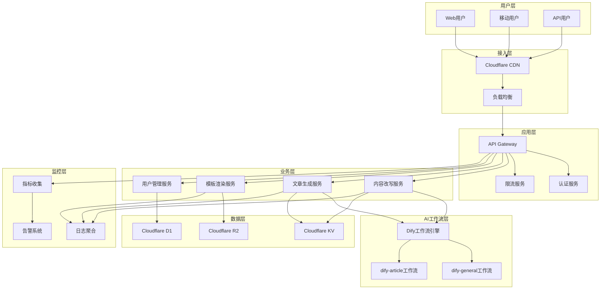

# AI驱动内容代理系统 - 系统概述

## 项目简介

**AI驱动内容代理系统**是一个基于人工智能的内容生成和管理平台，旨在为用户提供高质量、个性化的内容创作服务。系统集成了先进的AI工作流引擎、智能模板系统和高性能的云端部署架构。

### 核心价值主张

- **智能化内容生成**：基于Dify工作流的AI内容创作引擎
- **模板化快速部署**：预置6种专业模板，支持快速定制
- **云原生架构**：基于Cloudflare Workers的高性能部署
- **用户友好体验**：直观的界面设计和流畅的交互体验

## 系统架构

### 整体架构图

## 核心功能模块

### 1. AI内容生成引擎

**功能描述**：基于Dify工作流的智能内容生成系统

**核心组件**：
- `dify-general`：通用内容改写工作流
- `dify-article`：AI文章生成工作流
- 内容质量评估模块
- 多语言支持模块

**技术特性**：
- 支持多种内容类型（文章、摘要、标题等）
- 智能语言风格适配
- 实时内容质量评分
- 批量处理能力

### 2. 智能模板系统

**功能描述**：提供多样化的内容展示模板和自定义能力

**预置模板**：
1. **简约现代**：极简设计风格，适合个人博客
2. **商务专业**：正式商务风格，适合企业官网
3. **创意艺术**：创意设计风格，适合设计作品展示
4. **学术研究**：学术论文风格，适合研究报告
5. **新闻媒体**：新闻资讯风格，适合媒体平台
6. **社交媒体**：社交平台风格，适合内容分享

**技术实现**：
- 响应式设计支持
- 动态内容适配
- 主题色彩自定义
- 组件化模块设计

### 3. 用户管理系统

**功能描述**：完整的用户认证、授权和管理功能

**核心功能**：
- 用户注册/登录
- JWT令牌认证
- 角色权限管理
- 用户配置管理
- 使用统计分析

### 4. API服务层

**功能描述**：RESTful API接口服务

**主要接口**：
- `/api/content/rewrite` - 内容改写
- `/api/content/generate` - 文章生成
- `/api/templates/render` - 模板渲染
- `/api/users/profile` - 用户管理

## 技术栈

### 前端技术
- **框架**：React 18 + TypeScript
- **构建工具**：Vite
- **UI组件**：Tailwind CSS + Headless UI
- **状态管理**：Zustand
- **路由**：React Router v6

### 后端技术
- **运行时**：Cloudflare Workers
- **API框架**：Hono.js
- **数据库**：Cloudflare D1 (SQLite)
- **存储**：Cloudflare KV + R2
- **认证**：JWT + bcrypt

### AI工作流
- **平台**：Dify
- **模型**：GPT-4 / Claude-3
- **工作流**：可视化配置
- **API集成**：RESTful接口

### 开发工具
- **包管理**：pnpm
- **代码规范**：ESLint + Prettier
- **测试框架**：Vitest + Playwright
- **CI/CD**：GitHub Actions
- **监控**：Cloudflare Analytics

## 部署架构

### 生产环境
- **CDN**：Cloudflare全球CDN
- **计算**：Cloudflare Workers (边缘计算)
- **存储**：Cloudflare KV/R2/D1
- **域名**：自定义域名 + SSL证书
- **监控**：实时性能监控和告警

### 开发环境
- **本地开发**：Wrangler CLI
- **热重载**：Vite开发服务器
- **测试环境**：独立的Cloudflare环境
- **调试工具**：Chrome DevTools + Wrangler调试

## 性能指标

### 系统性能
- **响应时间**：< 200ms (全球平均)
- **可用性**：99.9% SLA
- **并发处理**：10,000+ 请求/秒
- **数据传输**：全球CDN加速

### AI处理性能
- **内容改写**：平均3-5秒
- **文章生成**：平均10-15秒
- **模板渲染**：< 100ms
- **质量评分**：> 85% 用户满意度

## 安全特性

### 数据安全
- **传输加密**：TLS 1.3
- **存储加密**：AES-256
- **访问控制**：RBAC权限模型
- **数据备份**：自动化备份策略

### 应用安全
- **输入验证**：严格的数据校验
- **SQL注入防护**：参数化查询
- **XSS防护**：内容安全策略
- **CSRF防护**：令牌验证
- **限流保护**：API调用频率限制

## 监控和运维

### 监控体系
- **应用监控**：实时性能指标
- **错误监控**：异常捕获和报告
- **用户行为**：使用统计分析
- **资源监控**：系统资源使用情况

### 运维自动化
- **自动部署**：CI/CD流水线
- **健康检查**：自动故障检测
- **弹性伸缩**：基于负载的自动扩容
- **日志管理**：结构化日志收集

## 项目规划

### 当前版本 (v1.0)
- ✅ 核心AI工作流集成
- ✅ 基础模板系统
- ✅ 用户认证系统
- ✅ API服务层
- ✅ 基础监控功能

### 下一版本 (v1.1)
- 🔄 高级模板编辑器
- 🔄 批量内容处理
- 🔄 多语言国际化
- 🔄 高级分析仪表板

### 未来规划 (v2.0)
- 📋 AI模型微调
- 📋 插件系统
- 📋 企业级功能
- 📋 移动端应用

## 开发团队

### 团队结构
- **项目经理**：项目规划和协调
- **前端开发**：用户界面和体验
- **后端开发**：API和业务逻辑
- **AI工程师**：工作流优化和调试
- **DevOps工程师**：部署和运维
- **测试工程师**：质量保证

### 开发流程
- **敏捷开发**：2周迭代周期
- **代码审查**：强制性同行评审
- **自动化测试**：单元测试 + 集成测试
- **持续集成**：自动化构建和部署

## 联系信息

- **项目仓库**：[GitHub Repository]
- **文档站点**：[Documentation Site]
- **问题反馈**：[Issue Tracker]
- **技术支持**：[Support Email]

---

*最后更新：2025年1月15日*
*文档版本：v1.0*