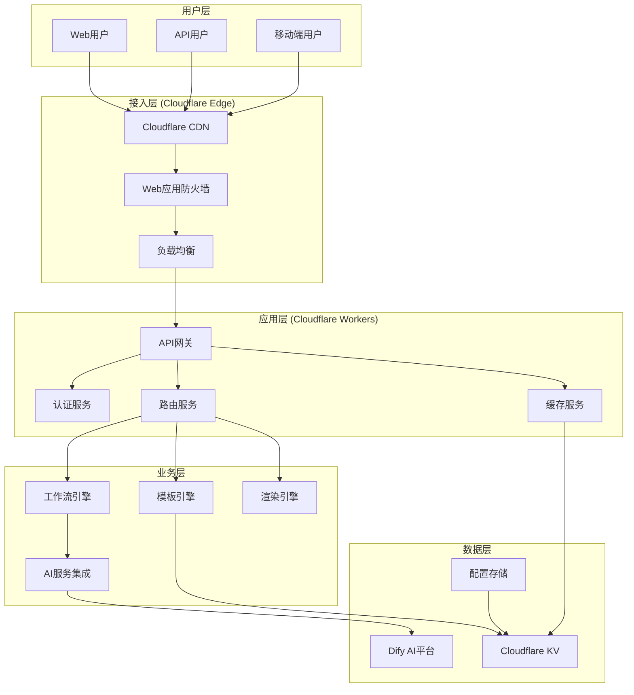
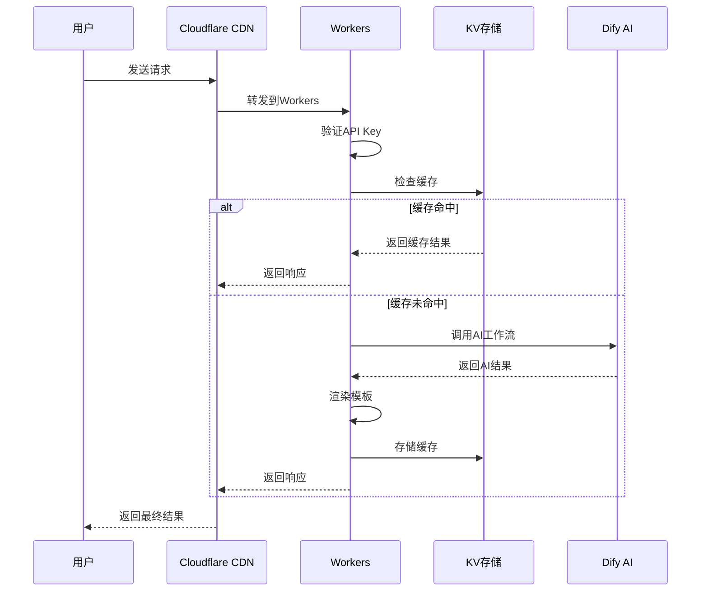
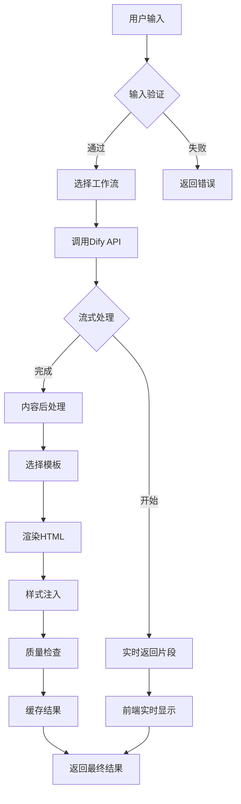

# AI驱动内容代理系统 - 项目架构概览

## 🏗️ 系统整体架构

### 架构设计原则

- **边缘优先**：基于Cloudflare Workers的边缘计算架构
- **AI驱动**：深度集成Dify AI工作流，实现智能内容生成
- **模块化设计**：松耦合的组件架构，支持独立开发和部署
- **高可用性**：多层容错机制，确保服务稳定性
- **可扩展性**：支持水平扩展和功能扩展

### 系统架构图



## 🧩 核心组件详解

### 1. 接入层 (Edge Layer)

#### Cloudflare CDN
- **功能**：全球内容分发网络
- **特性**：
  - 全球200+节点覆盖
  - 智能路由优化
  - 自动HTTPS加密
  - DDoS防护

#### Web应用防火墙 (WAF)
- **功能**：安全防护和访问控制
- **特性**：
  - SQL注入防护
  - XSS攻击防护
  - 速率限制
  - IP白名单/黑名单

### 2. 应用层 (Application Layer)

#### API网关
- **功能**：统一API入口和管理
- **特性**：
  - 请求路由
  - 参数验证
  - 响应格式化
  - 错误处理

#### 认证服务
- **功能**：用户身份验证和授权
- **特性**：
  - API Key验证
  - JWT Token支持
  - 权限控制
  - 访问日志

#### 缓存服务
- **功能**：多层缓存优化
- **特性**：
  - 内存缓存
  - KV存储缓存
  - CDN边缘缓存
  - 智能缓存策略

### 3. 业务层 (Business Layer)

#### 工作流引擎
- **功能**：AI工作流编排和执行
- **特性**：
  - 多工作流支持
  - 流式处理
  - 错误重试
  - 状态管理

#### 模板引擎
- **功能**：内容模板管理和渲染
- **特性**：
  - 6种预置模板
  - 自定义模板支持
  - 动态样式注入
  - 响应式适配

#### 渲染引擎
- **功能**：内容格式转换和渲染
- **特性**：
  - Markdown到HTML转换
  - 代码语法高亮
  - 图片优化处理
  - SEO优化

### 4. 数据层 (Data Layer)

#### Cloudflare KV
- **功能**：分布式键值存储
- **用途**：
  - 模板缓存
  - 配置存储
  - 用户会话
  - 渲染结果缓存

#### Dify AI平台
- **功能**：AI工作流平台
- **特性**：
  - 多模型支持
  - 工作流编排
  - 实时流式输出
  - API接口

## 🔧 技术栈详解

### 前端技术栈

| 技术 | 版本 | 用途 | 特性 |
|------|------|------|------|
| **HTML5** | Latest | 页面结构 | 语义化标签、可访问性 |
| **CSS3** | Latest | 样式设计 | Flexbox、Grid、动画 |
| **JavaScript** | ES2022 | 交互逻辑 | 模块化、异步处理 |
| **Web APIs** | Latest | 浏览器功能 | Fetch、WebSocket、Storage |

### 后端技术栈

| 技术 | 版本 | 用途 | 特性 |
|------|------|------|------|
| **Cloudflare Workers** | Latest | 运行环境 | 边缘计算、V8引擎 |
| **Node.js** | 18+ | 开发环境 | 包管理、构建工具 |
| **Wrangler** | 3.x | 部署工具 | 本地开发、生产部署 |
| **TypeScript** | 5.x | 类型系统 | 类型安全、开发体验 |

### AI集成技术

| 技术 | 版本 | 用途 | 特性 |
|------|------|------|------|
| **Dify API** | v1 | AI工作流 | 多模型、流式输出 |
| **OpenAI API** | v1 | 语言模型 | GPT系列模型 |
| **Custom Models** | - | 专用模型 | 领域优化、私有部署 |

## 🔄 数据流程

### 1. 用户请求流程



### 2. 内容生成流程



## 🚀 性能优化策略

### 1. 缓存策略

#### 多层缓存架构
- **L1缓存**：Workers内存缓存 (1分钟)
- **L2缓存**：KV存储缓存 (1小时)
- **L3缓存**：CDN边缘缓存 (24小时)
- **L4缓存**：浏览器缓存 (7天)

#### 缓存键策略
```javascript
// 缓存键生成规则
const cacheKey = `${workflow}_${hash(input)}_${template}_${version}`
```

### 2. 性能监控

#### 关键指标
- **响应时间**：P50 < 200ms, P95 < 500ms
- **可用性**：99.9%+
- **错误率**：< 0.1%
- **缓存命中率**：> 80%

#### 监控工具
- Cloudflare Analytics
- 自定义性能监控
- 实时告警系统

## 🔒 安全架构

### 1. 认证与授权

#### API密钥管理
- 密钥轮换机制
- 权限分级控制
- 使用频率限制
- 异常检测告警

#### 访问控制
- IP白名单机制
- 地理位置限制
- 时间窗口控制
- 并发连接限制

### 2. 数据安全

#### 传输安全
- 强制HTTPS加密
- TLS 1.3协议
- HSTS头部设置
- 证书透明度监控

#### 存储安全
- 数据加密存储
- 访问日志记录
- 定期安全审计
- 数据备份策略

## 🔧 可扩展性设计

### 1. 水平扩展

#### 无状态设计
- Workers无状态运行
- 会话数据外部存储
- 负载均衡支持
- 自动伸缩能力

#### 分布式架构
- 多区域部署
- 数据同步机制
- 故障转移支持
- 灾难恢复计划

### 2. 功能扩展

#### 插件化架构
- 模板插件系统
- 工作流插件支持
- 第三方集成接口
- 自定义处理器

#### API版本管理
- 向后兼容保证
- 渐进式升级
- 版本废弃策略
- 迁移指导文档

## 📊 系统容量规划

### 当前容量
- **并发请求**：1000 RPS
- **存储容量**：100GB (KV)
- **带宽**：10Gbps
- **AI调用**：10000次/天

### 扩展计划
- **短期目标**：5000 RPS
- **中期目标**：20000 RPS
- **长期目标**：100000 RPS

## 🔄 部署架构

### 环境划分
- **开发环境**：本地开发和测试
- **测试环境**：集成测试和性能测试
- **预发布环境**：生产前验证
- **生产环境**：正式服务环境

### 部署流程
1. 代码提交到Git仓库
2. 自动化测试执行
3. 构建生产版本
4. 部署到预发布环境
5. 自动化验证测试
6. 部署到生产环境
7. 健康检查和监控

---

*本架构概览为系统设计的核心指导文档，随着系统演进会持续更新和优化。*