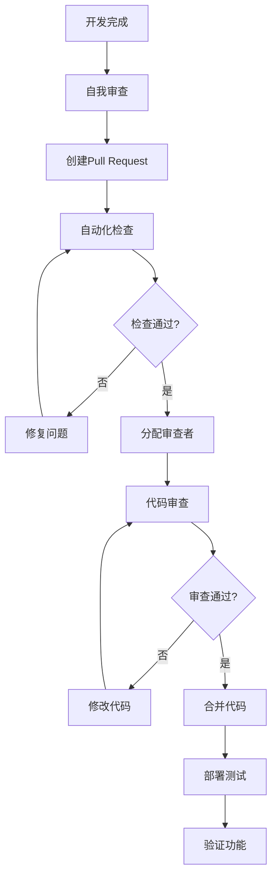
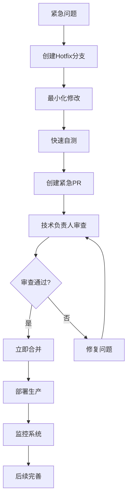

# 代码审查指南

## 概述

代码审查是确保代码质量、促进知识共享、减少缺陷的重要实践。本文档定义了AI驱动内容代理系统的代码审查流程、标准和最佳实践，帮助团队建立高效的代码审查文化。

## 代码审查目标

### 主要目标
1. **提高代码质量**：发现潜在的bug、性能问题和安全漏洞
2. **确保代码一致性**：维护统一的编码风格和架构模式
3. **促进知识共享**：团队成员相互学习和技能提升
4. **降低维护成本**：提高代码可读性和可维护性
5. **风险控制**：减少生产环境问题的发生

### 次要目标
1. **团队协作**：增进团队成员之间的技术交流
2. **最佳实践传播**：推广优秀的编程实践和设计模式
3. **新人培养**：帮助新团队成员快速成长
4. **技术债务管理**：识别和控制技术债务的积累

## 审查流程

### 代码提交流程



### 1. 提交前准备

#### 开发者自检清单
- [ ] 代码功能完整且正确
- [ ] 所有测试用例通过
- [ ] 代码符合团队编码规范
- [ ] 添加必要的注释和文档
- [ ] 移除调试代码和无用注释
- [ ] 检查是否有硬编码的配置
- [ ] 确认没有敏感信息泄露

#### Pull Request创建
```markdown
## 变更描述
简要描述本次变更的目的和内容

## 变更类型
- [ ] 新功能 (feature)
- [ ] 缺陷修复 (bugfix)
- [ ] 性能优化 (performance)
- [ ] 重构 (refactor)
- [ ] 文档更新 (docs)
- [ ] 测试相关 (test)

## 测试说明
- [ ] 单元测试已添加/更新
- [ ] 集成测试已验证
- [ ] 手动测试已完成

## 影响范围
描述本次变更可能影响的模块和功能

## 截图/演示
如果是UI变更，请提供截图或演示视频

## 检查清单
- [ ] 代码符合团队规范
- [ ] 已添加必要的测试
- [ ] 文档已更新
- [ ] 无安全风险
```

### 2. 审查者分配

#### 分配原则
- **主审查者**：具有相关模块经验的高级开发者
- **次审查者**：其他团队成员，用于知识共享
- **专业审查者**：针对特定领域（安全、性能）的专家

#### 分配策略
```typescript
// 审查者分配逻辑示例
interface ReviewerAssignment {
  primary: string;    // 主审查者
  secondary?: string; // 次审查者
  specialist?: string; // 专业审查者
}

function assignReviewers(
  pullRequest: PullRequest,
  teamMembers: TeamMember[]
): ReviewerAssignment {
  const assignment: ReviewerAssignment = {
    primary: selectPrimaryReviewer(pullRequest, teamMembers)
  };
  
  // 复杂变更需要多个审查者
  if (pullRequest.complexity === 'high') {
    assignment.secondary = selectSecondaryReviewer(teamMembers, assignment.primary);
  }
  
  // 安全相关变更需要安全专家审查
  if (pullRequest.tags.includes('security')) {
    assignment.specialist = selectSecurityExpert(teamMembers);
  }
  
  return assignment;
}
```

### 3. 审查执行

#### 审查时间要求
- **小型变更** (< 100行)：24小时内完成
- **中型变更** (100-500行)：48小时内完成
- **大型变更** (> 500行)：72小时内完成
- **紧急修复**：4小时内完成

#### 审查深度
- **表面审查**：代码风格、明显错误
- **功能审查**：业务逻辑、功能正确性
- **架构审查**：设计模式、系统架构
- **深度审查**：性能、安全、可维护性

## 审查标准

### 功能正确性

#### 业务逻辑检查
```typescript
// ❌ 错误示例：缺少边界条件检查
function calculateDiscount(price: number, discountRate: number): number {
  return price * discountRate;
}

// ✅ 正确示例：完整的边界条件检查
function calculateDiscount(price: number, discountRate: number): number {
  if (price < 0) {
    throw new Error('Price cannot be negative');
  }
  
  if (discountRate < 0 || discountRate > 1) {
    throw new Error('Discount rate must be between 0 and 1');
  }
  
  return price * (1 - discountRate);
}
```

#### 错误处理
```typescript
// ❌ 错误示例：未处理异常
async function fetchUserData(userId: string) {
  const response = await fetch(`/api/users/${userId}`);
  return response.json();
}

// ✅ 正确示例：完整的错误处理
async function fetchUserData(userId: string): Promise<User | null> {
  try {
    const response = await fetch(`/api/users/${userId}`);
    
    if (!response.ok) {
      if (response.status === 404) {
        return null;
      }
      throw new Error(`HTTP ${response.status}: ${response.statusText}`);
    }
    
    return await response.json();
  } catch (error) {
    console.error('Failed to fetch user data:', error);
    throw new Error('Unable to fetch user data');
  }
}
```

### 代码质量

#### 可读性检查
```typescript
// ❌ 错误示例：难以理解的代码
function p(u: any) {
  return u.n && u.e && u.e.includes('@') && u.a > 18;
}

// ✅ 正确示例：清晰易懂的代码
function isValidActiveUser(user: User): boolean {
  const hasName = Boolean(user.name);
  const hasValidEmail = Boolean(user.email && user.email.includes('@'));
  const isAdult = user.age > 18;
  
  return hasName && hasValidEmail && isAdult;
}
```

#### 函数设计
```typescript
// ❌ 错误示例：函数职责过多
function processUserRegistration(userData: any) {
  // 验证数据
  if (!userData.email || !userData.password) {
    throw new Error('Missing required fields');
  }
  
  // 加密密码
  const hashedPassword = bcrypt.hashSync(userData.password, 10);
  
  // 保存用户
  const user = database.users.create({
    ...userData,
    password: hashedPassword
  });
  
  // 发送欢迎邮件
  emailService.sendWelcomeEmail(user.email);
  
  // 记录日志
  logger.info(`User registered: ${user.id}`);
  
  return user;
}

// ✅ 正确示例：单一职责原则
class UserRegistrationService {
  async registerUser(userData: UserRegistrationData): Promise<User> {
    this.validateUserData(userData);
    
    const hashedPassword = await this.hashPassword(userData.password);
    const user = await this.createUser({ ...userData, password: hashedPassword });
    
    // 异步处理后续操作
    this.handlePostRegistration(user);
    
    return user;
  }
  
  private validateUserData(userData: UserRegistrationData): void {
    if (!userData.email || !userData.password) {
      throw new ValidationError('Missing required fields');
    }
  }
  
  private async hashPassword(password: string): Promise<string> {
    return bcrypt.hash(password, 10);
  }
  
  private async createUser(userData: UserData): Promise<User> {
    return this.userRepository.create(userData);
  }
  
  private async handlePostRegistration(user: User): Promise<void> {
    await Promise.all([
      this.emailService.sendWelcomeEmail(user.email),
      this.logService.logUserRegistration(user.id)
    ]);
  }
}
```

### 性能考虑

#### 算法复杂度
```typescript
// ❌ 错误示例：O(n²) 复杂度
function findDuplicates(arr: number[]): number[] {
  const duplicates: number[] = [];
  
  for (let i = 0; i < arr.length; i++) {
    for (let j = i + 1; j < arr.length; j++) {
      if (arr[i] === arr[j] && !duplicates.includes(arr[i])) {
        duplicates.push(arr[i]);
      }
    }
  }
  
  return duplicates;
}

// ✅ 正确示例：O(n) 复杂度
function findDuplicates(arr: number[]): number[] {
  const seen = new Set<number>();
  const duplicates = new Set<number>();
  
  for (const num of arr) {
    if (seen.has(num)) {
      duplicates.add(num);
    } else {
      seen.add(num);
    }
  }
  
  return Array.from(duplicates);
}
```

#### 内存使用
```typescript
// ❌ 错误示例：内存泄漏风险
class DataProcessor {
  private cache: Map<string, any> = new Map();
  
  processData(key: string, data: any) {
    // 缓存永远不会清理
    this.cache.set(key, data);
    return this.transformData(data);
  }
}

// ✅ 正确示例：合理的缓存管理
class DataProcessor {
  private cache: Map<string, { data: any; timestamp: number }> = new Map();
  private readonly CACHE_TTL = 5 * 60 * 1000; // 5分钟
  private readonly MAX_CACHE_SIZE = 1000;
  
  processData(key: string, data: any) {
    this.cleanExpiredCache();
    
    if (this.cache.size >= this.MAX_CACHE_SIZE) {
      this.evictOldestEntry();
    }
    
    this.cache.set(key, {
      data,
      timestamp: Date.now()
    });
    
    return this.transformData(data);
  }
  
  private cleanExpiredCache(): void {
    const now = Date.now();
    for (const [key, value] of this.cache.entries()) {
      if (now - value.timestamp > this.CACHE_TTL) {
        this.cache.delete(key);
      }
    }
  }
  
  private evictOldestEntry(): void {
    const firstKey = this.cache.keys().next().value;
    if (firstKey) {
      this.cache.delete(firstKey);
    }
  }
}
```

### 安全性检查

#### 输入验证
```typescript
// ❌ 错误示例：缺少输入验证
app.post('/api/users', (req, res) => {
  const user = req.body;
  database.users.create(user);
  res.json({ success: true });
});

// ✅ 正确示例：完整的输入验证
import { z } from 'zod';

const CreateUserSchema = z.object({
  name: z.string().min(1).max(100),
  email: z.string().email(),
  age: z.number().int().min(0).max(150),
  role: z.enum(['user', 'admin'])
});

app.post('/api/users', async (req, res) => {
  try {
    const userData = CreateUserSchema.parse(req.body);
    const user = await database.users.create(userData);
    res.json({ user: { id: user.id, name: user.name, email: user.email } });
  } catch (error) {
    if (error instanceof z.ZodError) {
      res.status(400).json({ error: 'Invalid input', details: error.errors });
    } else {
      res.status(500).json({ error: 'Internal server error' });
    }
  }
});
```

#### SQL注入防护
```typescript
// ❌ 错误示例：SQL注入风险
function getUserByEmail(email: string) {
  const query = `SELECT * FROM users WHERE email = '${email}'`;
  return database.query(query);
}

// ✅ 正确示例：参数化查询
function getUserByEmail(email: string) {
  const query = 'SELECT * FROM users WHERE email = ?';
  return database.query(query, [email]);
}

// 或使用ORM
function getUserByEmail(email: string) {
  return database.users.findFirst({
    where: { email }
  });
}
```

### 测试覆盖

#### 单元测试要求
```typescript
// 被测试的函数
export function calculateTotalPrice(
  items: CartItem[],
  discountRate: number = 0,
  taxRate: number = 0
): number {
  if (items.length === 0) {
    return 0;
  }
  
  const subtotal = items.reduce((sum, item) => {
    return sum + (item.price * item.quantity);
  }, 0);
  
  const discountAmount = subtotal * discountRate;
  const discountedTotal = subtotal - discountAmount;
  const taxAmount = discountedTotal * taxRate;
  
  return discountedTotal + taxAmount;
}

// 对应的测试用例
describe('calculateTotalPrice', () => {
  it('should return 0 for empty cart', () => {
    expect(calculateTotalPrice([])).toBe(0);
  });
  
  it('should calculate total without discount and tax', () => {
    const items = [
      { price: 10, quantity: 2 },
      { price: 5, quantity: 3 }
    ];
    expect(calculateTotalPrice(items)).toBe(35);
  });
  
  it('should apply discount correctly', () => {
    const items = [{ price: 100, quantity: 1 }];
    expect(calculateTotalPrice(items, 0.1)).toBe(90);
  });
  
  it('should apply tax after discount', () => {
    const items = [{ price: 100, quantity: 1 }];
    expect(calculateTotalPrice(items, 0.1, 0.1)).toBe(99);
  });
  
  it('should handle multiple items with discount and tax', () => {
    const items = [
      { price: 50, quantity: 2 },
      { price: 30, quantity: 1 }
    ];
    // subtotal: 130, discount: 13, after discount: 117, tax: 11.7, total: 128.7
    expect(calculateTotalPrice(items, 0.1, 0.1)).toBeCloseTo(128.7);
  });
});
```

## 审查反馈

### 反馈分类

#### 严重程度分级
1. **阻塞 (Blocker)**：必须修复才能合并
   - 功能错误
   - 安全漏洞
   - 性能问题
   - 破坏性变更

2. **主要 (Major)**：强烈建议修复
   - 代码质量问题
   - 设计缺陷
   - 测试不足
   - 文档缺失

3. **次要 (Minor)**：建议改进
   - 代码风格
   - 命名优化
   - 注释改进
   - 小的重构建议

4. **建议 (Suggestion)**：可选改进
   - 性能优化建议
   - 更好的实现方式
   - 学习资源推荐

### 反馈模板

#### 问题反馈模板
```markdown
**[严重程度] 问题描述**

**位置**：文件名:行号

**问题**：详细描述发现的问题

**影响**：说明问题可能造成的影响

**建议**：提供具体的修改建议

**示例**：如果可能，提供代码示例
```

#### 具体反馈示例
```markdown
**[Blocker] 潜在的空指针异常**

**位置**：src/services/userService.ts:45

**问题**：在访问 `user.profile.avatar` 之前没有检查 `user.profile` 是否存在

**影响**：当用户没有设置profile时会导致运行时错误

**建议**：添加空值检查或使用可选链操作符

**示例**：
```typescript
// 当前代码
const avatarUrl = user.profile.avatar;

// 建议修改
const avatarUrl = user.profile?.avatar || '/default-avatar.png';
```

**[Minor] 变量命名可以更清晰**

**位置**：src/utils/helpers.ts:12

**问题**：变量名 `temp` 不够描述性

**建议**：使用更具描述性的名称，如 `formattedDate` 或 `processedData`
```

### 反馈处理

#### 开发者响应
1. **及时回应**：收到反馈后24小时内回应
2. **积极态度**：以学习和改进的心态对待反馈
3. **充分讨论**：对于有争议的反馈进行充分讨论
4. **记录决策**：重要的设计决策要记录在PR中

#### 审查者跟进
1. **验证修改**：确认问题已经得到解决
2. **重新审查**：对于大的修改进行重新审查
3. **知识分享**：将有价值的讨论分享给团队

## 特殊情况处理

### 紧急修复

#### 快速审查流程


#### 紧急修复标准
- 修改范围最小化
- 必须有测试验证
- 技术负责人必须参与审查
- 部署后立即监控
- 事后进行完整的代码审查

### 大型重构

#### 分阶段审查
1. **架构设计审查**：先审查整体设计方案
2. **分模块实现**：将大型重构拆分为多个小的PR
3. **渐进式合并**：逐步合并，降低风险
4. **回归测试**：每个阶段都进行充分测试

#### 重构审查重点
- 向后兼容性
- 性能影响
- 测试覆盖
- 文档更新
- 迁移计划

### 新人代码审查

#### 指导原则
1. **教育为主**：重点在于帮助新人学习和成长
2. **详细解释**：提供详细的解释和学习资源
3. **正面鼓励**：肯定做得好的地方
4. **渐进提高**：逐步提高代码质量要求

#### 新人审查模板
```markdown
**欢迎提交你的第一个PR！** 👋

整体来说代码实现了预期功能，以下是一些建议帮助你进一步改进：

**做得好的地方：**
- ✅ 测试用例覆盖了主要场景
- ✅ 代码结构清晰易懂
- ✅ 遵循了团队的命名规范

**改进建议：**
- 📚 [Minor] 建议阅读我们的错误处理指南：[链接]
- 🔧 [Major] 这里可以使用更高效的算法，我来解释一下...

**学习资源：**
- [TypeScript最佳实践](链接)
- [React性能优化](链接)

有任何问题随时找我讨论！
```

## 工具和自动化

### 代码审查工具

#### GitHub/GitLab集成
```yaml
# .github/pull_request_template.md
name: Pull Request Template
description: Standard template for pull requests
body:
  - type: dropdown
    id: change-type
    attributes:
      label: Change Type
      options:
        - Feature
        - Bug Fix
        - Performance
        - Refactor
        - Documentation
        - Test
    validations:
      required: true
      
  - type: textarea
    id: description
    attributes:
      label: Description
      description: Describe your changes
    validations:
      required: true
      
  - type: checkboxes
    id: checklist
    attributes:
      label: Checklist
      options:
        - label: Tests added/updated
        - label: Documentation updated
        - label: No breaking changes
        - label: Security considerations reviewed
```

#### 自动化检查
```yaml
# .github/workflows/code-review.yml
name: Code Review Automation

on:
  pull_request:
    types: [opened, synchronize]

jobs:
  automated-checks:
    runs-on: ubuntu-latest
    steps:
      - uses: actions/checkout@v3
      
      - name: Setup Node.js
        uses: actions/setup-node@v3
        with:
          node-version: '18'
          cache: 'npm'
          
      - name: Install dependencies
        run: npm ci
        
      - name: Lint check
        run: npm run lint
        
      - name: Type check
        run: npm run type-check
        
      - name: Unit tests
        run: npm run test:unit
        
      - name: Security scan
        run: npm audit --audit-level moderate
        
      - name: Code coverage
        run: npm run test:coverage
        
      - name: Bundle size check
        run: npm run build:analyze
```

### 审查指标

#### 关键指标
```typescript
interface CodeReviewMetrics {
  // 效率指标
  averageReviewTime: number;        // 平均审查时间
  reviewThroughput: number;         // 审查吞吐量
  
  // 质量指标
  defectDetectionRate: number;      // 缺陷检出率
  postReleaseDefects: number;       // 发布后缺陷数
  
  // 参与度指标
  reviewParticipation: number;      // 审查参与度
  knowledgeSharing: number;         // 知识分享程度
  
  // 改进指标
  reworkRate: number;               // 返工率
  approvalRate: number;             // 一次通过率
}

// 指标收集和分析
class ReviewMetricsCollector {
  async collectMetrics(timeRange: DateRange): Promise<CodeReviewMetrics> {
    const pullRequests = await this.getPullRequests(timeRange);
    
    return {
      averageReviewTime: this.calculateAverageReviewTime(pullRequests),
      reviewThroughput: this.calculateThroughput(pullRequests),
      defectDetectionRate: this.calculateDefectDetectionRate(pullRequests),
      postReleaseDefects: await this.getPostReleaseDefects(timeRange),
      reviewParticipation: this.calculateParticipation(pullRequests),
      knowledgeSharing: this.calculateKnowledgeSharing(pullRequests),
      reworkRate: this.calculateReworkRate(pullRequests),
      approvalRate: this.calculateApprovalRate(pullRequests)
    };
  }
  
  private calculateAverageReviewTime(pullRequests: PullRequest[]): number {
    const reviewTimes = pullRequests.map(pr => {
      const created = new Date(pr.createdAt);
      const merged = new Date(pr.mergedAt);
      return merged.getTime() - created.getTime();
    });
    
    return reviewTimes.reduce((sum, time) => sum + time, 0) / reviewTimes.length;
  }
}
```

## 最佳实践

### 审查者最佳实践

#### 1. 准备充分
- 理解PR的背景和目标
- 查看相关的需求文档和设计
- 了解变更的影响范围
- 准备充足的时间进行审查

#### 2. 系统性审查
```typescript
// 审查检查清单
const REVIEW_CHECKLIST = {
  functionality: [
    '功能是否按需求正确实现',
    '边界条件是否正确处理',
    '错误情况是否妥善处理'
  ],
  
  codeQuality: [
    '代码是否清晰易读',
    '函数是否职责单一',
    '是否遵循SOLID原则'
  ],
  
  performance: [
    '算法复杂度是否合理',
    '是否存在性能瓶颈',
    '内存使用是否高效'
  ],
  
  security: [
    '输入是否经过验证',
    '是否存在安全漏洞',
    '敏感信息是否泄露'
  ],
  
  testing: [
    '测试覆盖率是否足够',
    '测试用例是否全面',
    '是否包含集成测试'
  ]
};
```

#### 3. 建设性反馈
```markdown
<!-- 好的反馈示例 -->
**建议优化算法复杂度**

当前的嵌套循环导致O(n²)的时间复杂度，对于大数据集可能存在性能问题。

建议使用Map来优化：
```typescript
// 当前实现
for (const item of items) {
  for (const category of categories) {
    if (item.categoryId === category.id) {
      // 处理逻辑
    }
  }
}

// 优化建议
const categoryMap = new Map(categories.map(c => [c.id, c]));
for (const item of items) {
  const category = categoryMap.get(item.categoryId);
  if (category) {
    // 处理逻辑
  }
}
```

这样可以将复杂度降低到O(n)。
```

### 开发者最佳实践

#### 1. 提交前自检
```bash
#!/bin/bash
# pre-commit-check.sh - 提交前检查脚本

echo "🔍 Running pre-commit checks..."

# 代码格式检查
echo "📝 Checking code format..."
npm run lint:check
if [ $? -ne 0 ]; then
  echo "❌ Linting failed. Please fix the issues."
  exit 1
fi

# 类型检查
echo "🔍 Type checking..."
npm run type-check
if [ $? -ne 0 ]; then
  echo "❌ Type check failed. Please fix the issues."
  exit 1
fi

# 运行测试
echo "🧪 Running tests..."
npm run test
if [ $? -ne 0 ]; then
  echo "❌ Tests failed. Please fix the issues."
  exit 1
fi

# 检查测试覆盖率
echo "📊 Checking test coverage..."
npm run test:coverage -- --passWithNoTests
COVERAGE=$(npm run test:coverage:report | grep "All files" | awk '{print $10}' | sed 's/%//')
if (( $(echo "$COVERAGE < 80" | bc -l) )); then
  echo "❌ Test coverage is below 80% ($COVERAGE%). Please add more tests."
  exit 1
fi

echo "✅ All checks passed! Ready to commit."
```

#### 2. 清晰的提交信息
```bash
# 提交信息格式
type(scope): subject

body

footer

# 示例
feat(auth): add OAuth2 integration

- Implement Google OAuth2 login flow
- Add user profile synchronization
- Update authentication middleware
- Add comprehensive test coverage

Closes #123
Breaking Change: Authentication API endpoints have changed
```

#### 3. 响应审查反馈
```markdown
<!-- 回应审查反馈的好例子 -->
> **[Major] 建议添加错误处理**
> 
> 在API调用时没有处理网络错误的情况。

感谢指出这个问题！我已经添加了完整的错误处理：

- ✅ 添加了网络错误捕获
- ✅ 实现了重试机制
- ✅ 添加了用户友好的错误提示
- ✅ 更新了相关测试用例

具体修改请查看最新的commit: abc123f
```

## 团队文化建设

### 建立审查文化

#### 1. 心理安全
- 营造学习和改进的氛围
- 鼓励提问和讨论
- 将错误视为学习机会
- 避免指责和批评

#### 2. 知识共享
- 定期分享审查中发现的好实践
- 组织代码审查经验交流会
- 建立团队知识库
- 鼓励跨团队学习

#### 3. 持续改进
```typescript
// 定期审查流程评估
interface ReviewProcessAssessment {
  strengths: string[];      // 做得好的地方
  weaknesses: string[];     // 需要改进的地方
  opportunities: string[];  // 改进机会
  threats: string[];        // 潜在风险
  actionItems: ActionItem[]; // 行动计划
}

interface ActionItem {
  description: string;
  owner: string;
  dueDate: Date;
  priority: 'high' | 'medium' | 'low';
}

// 每季度进行流程评估
class ReviewProcessImprovement {
  async conductQuarterlyAssessment(): Promise<ReviewProcessAssessment> {
    const metrics = await this.collectQuarterlyMetrics();
    const feedback = await this.collectTeamFeedback();
    
    return this.analyzeAndCreateActionPlan(metrics, feedback);
  }
  
  private async collectTeamFeedback(): Promise<TeamFeedback[]> {
    // 收集团队成员对审查流程的反馈
    return [
      {
        category: 'process',
        feedback: '审查时间过长，影响开发效率',
        suggestion: '可以考虑并行审查或分层审查'
      },
      {
        category: 'tools',
        feedback: '需要更好的代码审查工具',
        suggestion: '集成更多自动化检查工具'
      }
    ];
  }
}
```

### 激励机制

#### 1. 认可优秀审查者
- 月度最佳审查者评选
- 在团队会议中公开表扬
- 将审查质量纳入绩效考核
- 提供学习和发展机会

#### 2. 鼓励参与
- 新人导师制度
- 审查经验分享奖励
- 跨团队审查交流
- 技术博客写作鼓励

## 总结

代码审查是软件开发过程中的重要环节，通过建立完善的审查流程、明确的质量标准和积极的团队文化，我们能够：

1. **提高代码质量**：通过多人审查发现潜在问题
2. **促进知识共享**：团队成员相互学习和成长
3. **降低维护成本**：提前发现和解决问题
4. **建立团队标准**：统一代码风格和最佳实践
5. **培养团队文化**：营造学习和改进的氛围

所有团队成员都应该积极参与代码审查，将其视为提高个人技能和团队整体水平的重要机会。通过持续的实践和改进，我们能够建立高效、高质量的代码审查文化。