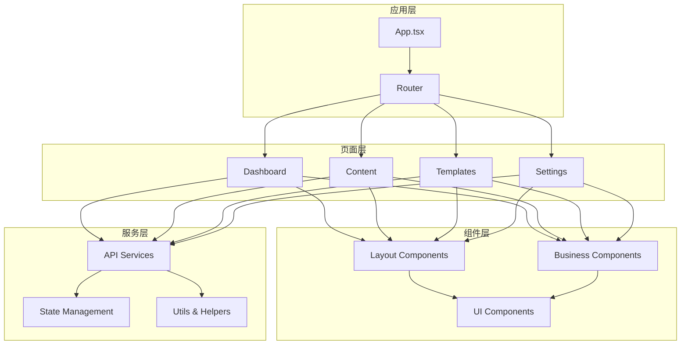
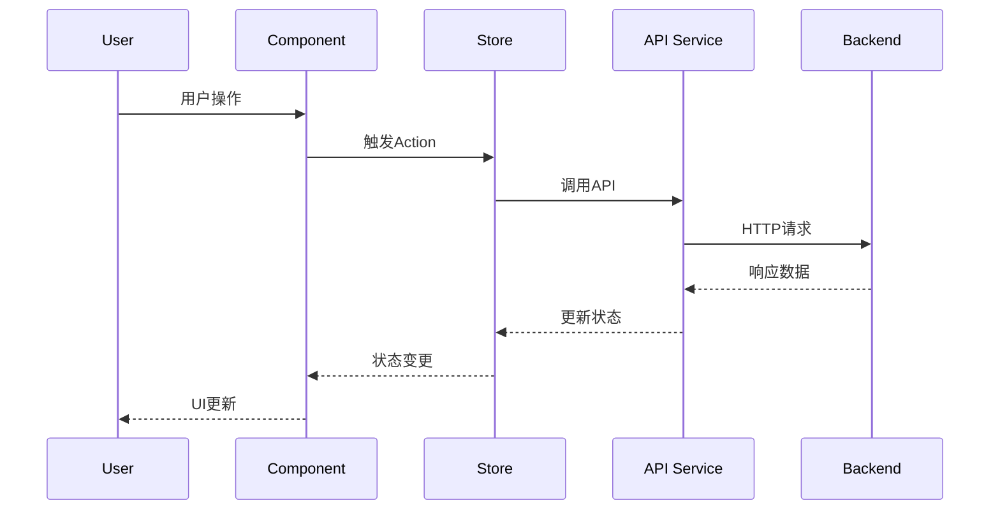

# AI驱动内容代理系统 - 前端开发指南

## 概述

本文档详细描述AI驱动内容代理系统前端开发的技术栈、架构设计、组件规范、状态管理、样式指南和最佳实践。

### 技术栈

- **框架**: React 18 + TypeScript
- **构建工具**: Vite
- **路由**: React Router v6
- **状态管理**: Zustand + React Query
- **UI组件库**: Ant Design + Tailwind CSS
- **图标**: Lucide React
- **表单**: React Hook Form + Zod
- **图表**: Recharts
- **代码编辑器**: Monaco Editor
- **国际化**: React i18next
- **测试**: Vitest + React Testing Library
- **代码质量**: ESLint + Prettier + Husky

### 项目结构

```
src/
├── components/          # 通用组件
│   ├── ui/             # 基础UI组件
│   ├── forms/          # 表单组件
│   ├── charts/         # 图表组件
│   └── layout/         # 布局组件
├── pages/              # 页面组件
│   ├── auth/           # 认证页面
│   ├── dashboard/      # 仪表板
│   ├── content/        # 内容管理
│   ├── templates/      # 模板管理
│   └── settings/       # 设置页面
├── hooks/              # 自定义Hooks
├── stores/             # 状态管理
├── services/           # API服务
├── utils/              # 工具函数
├── types/              # TypeScript类型定义
├── constants/          # 常量定义
├── styles/             # 样式文件
├── locales/            # 国际化文件
└── tests/              # 测试文件
```

## 架构设计

### 组件架构



### 数据流架构



## 核心组件设计

### 1. 布局组件

#### AppLayout 主布局

```tsx
// src/components/layout/AppLayout.tsx
import React from 'react';
import { Layout, Menu, Avatar, Dropdown } from 'antd';
import { Outlet, useNavigate, useLocation } from 'react-router-dom';
import { useAuthStore } from '@/stores/authStore';
import { menuItems } from '@/constants/navigation';

const { Header, Sider, Content } = Layout;

interface AppLayoutProps {
  children?: React.ReactNode;
}

export const AppLayout: React.FC<AppLayoutProps> = ({ children }) => {
  const navigate = useNavigate();
  const location = useLocation();
  const { user, logout } = useAuthStore();
  const [collapsed, setCollapsed] = React.useState(false);

  const handleMenuClick = (key: string) => {
    navigate(key);
  };

  const handleLogout = async () => {
    await logout();
    navigate('/login');
  };

  const userMenuItems = [
    {
      key: 'profile',
      label: '个人资料',
      onClick: () => navigate('/settings/profile'),
    },
    {
      key: 'settings',
      label: '系统设置',
      onClick: () => navigate('/settings'),
    },
    {
      type: 'divider' as const,
    },
    {
      key: 'logout',
      label: '退出登录',
      onClick: handleLogout,
    },
  ];

  return (
    <Layout className="min-h-screen">
      <Sider
        collapsible
        collapsed={collapsed}
        onCollapse={setCollapsed}
        className="bg-white shadow-sm"
      >
        <div className="h-16 flex items-center justify-center border-b">
          <h1 className={`font-bold text-lg ${collapsed ? 'hidden' : 'block'}`}>
            AI Content Agent
          </h1>
        </div>
        <Menu
          mode="inline"
          selectedKeys={[location.pathname]}
          items={menuItems}
          onClick={({ key }) => handleMenuClick(key)}
          className="border-r-0"
        />
      </Sider>
      
      <Layout>
        <Header className="bg-white shadow-sm px-6 flex items-center justify-between">
          <div className="flex items-center space-x-4">
            <h2 className="text-lg font-medium text-gray-800">
              {getPageTitle(location.pathname)}
            </h2>
          </div>
          
          <div className="flex items-center space-x-4">
            <Dropdown menu={{ items: userMenuItems }} placement="bottomRight">
              <div className="flex items-center space-x-2 cursor-pointer hover:bg-gray-50 px-3 py-2 rounded">
                <Avatar src={user?.avatar} size="small">
                  {user?.name?.charAt(0)}
                </Avatar>
                <span className="text-sm font-medium">{user?.name}</span>
              </div>
            </Dropdown>
          </div>
        </Header>
        
        <Content className="p-6 bg-gray-50">
          {children || <Outlet />}
        </Content>
      </Layout>
    </Layout>
  );
};

const getPageTitle = (pathname: string): string => {
  const titleMap: Record<string, string> = {
    '/dashboard': '仪表板',
    '/content': '内容管理',
    '/content/rewrite': '内容改写',
    '/content/generate': 'AI文章生成',
    '/templates': '模板管理',
    '/settings': '系统设置',
  };
  
  return titleMap[pathname] || '首页';
};
```

#### PageHeader 页面头部

```tsx
// src/components/layout/PageHeader.tsx
import React from 'react';
import { Breadcrumb, Button, Space } from 'antd';
import { ArrowLeft } from 'lucide-react';
import { useNavigate } from 'react-router-dom';

interface PageHeaderProps {
  title: string;
  subtitle?: string;
  breadcrumbs?: Array<{
    title: string;
    path?: string;
  }>;
  actions?: React.ReactNode;
  showBack?: boolean;
  onBack?: () => void;
}

export const PageHeader: React.FC<PageHeaderProps> = ({
  title,
  subtitle,
  breadcrumbs,
  actions,
  showBack = false,
  onBack,
}) => {
  const navigate = useNavigate();

  const handleBack = () => {
    if (onBack) {
      onBack();
    } else {
      navigate(-1);
    }
  };

  return (
    <div className="bg-white p-6 rounded-lg shadow-sm mb-6">
      {breadcrumbs && (
        <Breadcrumb className="mb-4">
          {breadcrumbs.map((item, index) => (
            <Breadcrumb.Item key={index}>
              {item.path ? (
                <a onClick={() => navigate(item.path!)}>{item.title}</a>
              ) : (
                item.title
              )}
            </Breadcrumb.Item>
          ))}
        </Breadcrumb>
      )}
      
      <div className="flex items-center justify-between">
        <div className="flex items-center space-x-4">
          {showBack && (
            <Button
              type="text"
              icon={<ArrowLeft size={16} />}
              onClick={handleBack}
              className="p-0"
            />
          )}
          <div>
            <h1 className="text-2xl font-bold text-gray-900">{title}</h1>
            {subtitle && (
              <p className="text-gray-600 mt-1">{subtitle}</p>
            )}
          </div>
        </div>
        
        {actions && (
          <Space>{actions}</Space>
        )}
      </div>
    </div>
  );
};
```

### 2. 业务组件

#### ContentEditor 内容编辑器

```tsx
// src/components/content/ContentEditor.tsx
import React from 'react';
import { Card, Button, Space, Select, Slider, Switch } from 'antd';
import { Editor } from '@monaco-editor/react';
import { Save, RefreshCw, Eye, Settings } from 'lucide-react';
import { useContentStore } from '@/stores/contentStore';
import { ContentType, RewriteOptions } from '@/types/content';

interface ContentEditorProps {
  contentId?: string;
  type: ContentType;
  onSave?: (content: string) => void;
  onPreview?: () => void;
}

export const ContentEditor: React.FC<ContentEditorProps> = ({
  contentId,
  type,
  onSave,
  onPreview,
}) => {
  const [content, setContent] = React.useState('');
  const [options, setOptions] = React.useState<RewriteOptions>({
    style: 'professional',
    creativity: 5,
    preserveStructure: true,
    language: 'zh-CN',
  });
  const [isProcessing, setIsProcessing] = React.useState(false);
  
  const { processContent } = useContentStore();

  const handleProcess = async () => {
    if (!content.trim()) return;
    
    setIsProcessing(true);
    try {
      const result = await processContent({
        content,
        type,
        options,
      });
      
      if (result.success) {
        setContent(result.processedContent);
      }
    } catch (error) {
      console.error('Content processing failed:', error);
    } finally {
      setIsProcessing(false);
    }
  };

  const handleSave = () => {
    onSave?.(content);
  };

  return (
    <div className="grid grid-cols-1 lg:grid-cols-4 gap-6">
      {/* 编辑器主体 */}
      <div className="lg:col-span-3">
        <Card
          title="内容编辑器"
          extra={
            <Space>
              <Button
                icon={<RefreshCw size={16} />}
                onClick={handleProcess}
                loading={isProcessing}
                type="primary"
              >
                {type === 'rewrite' ? '改写' : '生成'}
              </Button>
              <Button
                icon={<Eye size={16} />}
                onClick={onPreview}
              >
                预览
              </Button>
              <Button
                icon={<Save size={16} />}
                onClick={handleSave}
              >
                保存
              </Button>
            </Space>
          }
        >
          <Editor
            height="600px"
            defaultLanguage="markdown"
            value={content}
            onChange={(value) => setContent(value || '')}
            options={{
              minimap: { enabled: false },
              wordWrap: 'on',
              lineNumbers: 'on',
              fontSize: 14,
              fontFamily: 'Monaco, Consolas, monospace',
            }}
            theme="vs-light"
          />
        </Card>
      </div>
      
      {/* 设置面板 */}
      <div className="lg:col-span-1">
        <Card
          title={
            <div className="flex items-center space-x-2">
              <Settings size={16} />
              <span>处理选项</span>
            </div>
          }
          size="small"
        >
          <div className="space-y-4">
            <div>
              <label className="block text-sm font-medium mb-2">
                写作风格
              </label>
              <Select
                value={options.style}
                onChange={(value) => setOptions({ ...options, style: value })}
                className="w-full"
                options={[
                  { label: '专业', value: 'professional' },
                  { label: '友好', value: 'friendly' },
                  { label: '正式', value: 'formal' },
                  { label: '创意', value: 'creative' },
                  { label: '简洁', value: 'concise' },
                ]}
              />
            </div>
            
            <div>
              <label className="block text-sm font-medium mb-2">
                创意程度: {options.creativity}
              </label>
              <Slider
                min={1}
                max={10}
                value={options.creativity}
                onChange={(value) => setOptions({ ...options, creativity: value })}
                marks={{
                  1: '保守',
                  5: '平衡',
                  10: '创新',
                }}
              />
            </div>
            
            <div>
              <label className="block text-sm font-medium mb-2">
                语言
              </label>
              <Select
                value={options.language}
                onChange={(value) => setOptions({ ...options, language: value })}
                className="w-full"
                options={[
                  { label: '中文', value: 'zh-CN' },
                  { label: 'English', value: 'en-US' },
                  { label: '日本語', value: 'ja-JP' },
                  { label: '한국어', value: 'ko-KR' },
                ]}
              />
            </div>
            
            <div className="flex items-center justify-between">
              <label className="text-sm font-medium">
                保持结构
              </label>
              <Switch
                checked={options.preserveStructure}
                onChange={(checked) => setOptions({ ...options, preserveStructure: checked })}
              />
            </div>
            
            <div className="flex items-center justify-between">
              <label className="text-sm font-medium">
                保持格式
              </label>
              <Switch
                checked={options.preserveFormatting}
                onChange={(checked) => setOptions({ ...options, preserveFormatting: checked })}
              />
            </div>
          </div>
        </Card>
        
        {/* 统计信息 */}
        <Card title="统计信息" size="small" className="mt-4">
          <div className="space-y-2 text-sm">
            <div className="flex justify-between">
              <span>字符数:</span>
              <span>{content.length}</span>
            </div>
            <div className="flex justify-between">
              <span>单词数:</span>
              <span>{content.split(/\s+/).filter(Boolean).length}</span>
            </div>
            <div className="flex justify-between">
              <span>段落数:</span>
              <span>{content.split('\n\n').filter(Boolean).length}</span>
            </div>
          </div>
        </Card>
      </div>
    </div>
  );
};
```

#### TemplateRenderer 模板渲染器

```tsx
// src/components/templates/TemplateRenderer.tsx
import React from 'react';
import { Card, Form, Input, Select, Button, Space, Spin } from 'antd';
import { Download, Eye, Share2 } from 'lucide-react';
import { useTemplateStore } from '@/stores/templateStore';
import { Template, RenderOptions } from '@/types/template';

interface TemplateRendererProps {
  template: Template;
  onRender?: (result: string) => void;
  onDownload?: (format: string) => void;
}

export const TemplateRenderer: React.FC<TemplateRendererProps> = ({
  template,
  onRender,
  onDownload,
}) => {
  const [form] = Form.useForm();
  const [isRendering, setIsRendering] = React.useState(false);
  const [renderedContent, setRenderedContent] = React.useState('');
  const [outputFormat, setOutputFormat] = React.useState<'html' | 'pdf' | 'image'>('html');
  
  const { renderTemplate } = useTemplateStore();

  const handleRender = async () => {
    try {
      const values = await form.validateFields();
      setIsRendering(true);
      
      const result = await renderTemplate({
        templateId: template.id,
        data: values,
        options: {
          format: outputFormat,
          quality: 'high',
        },
      });
      
      if (result.success) {
        setRenderedContent(result.content);
        onRender?.(result.content);
      }
    } catch (error) {
      console.error('Template rendering failed:', error);
    } finally {
      setIsRendering(false);
    }
  };

  const handleDownload = () => {
    onDownload?.(outputFormat);
  };

  const renderFormField = (field: any) => {
    const { name, type, label, required, options, placeholder } = field;
    
    switch (type) {
      case 'text':
        return (
          <Form.Item
            key={name}
            name={name}
            label={label}
            rules={[{ required, message: `请输入${label}` }]}
          >
            <Input placeholder={placeholder} />
          </Form.Item>
        );
        
      case 'textarea':
        return (
          <Form.Item
            key={name}
            name={name}
            label={label}
            rules={[{ required, message: `请输入${label}` }]}
          >
            <Input.TextArea rows={4} placeholder={placeholder} />
          </Form.Item>
        );
        
      case 'select':
        return (
          <Form.Item
            key={name}
            name={name}
            label={label}
            rules={[{ required, message: `请选择${label}` }]}
          >
            <Select placeholder={placeholder}>
              {options?.map((option: any) => (
                <Select.Option key={option.value} value={option.value}>
                  {option.label}
                </Select.Option>
              ))}
            </Select>
          </Form.Item>
        );
        
      default:
        return null;
    }
  };

  return (
    <div className="grid grid-cols-1 lg:grid-cols-2 gap-6">
      {/* 配置面板 */}
      <div>
        <Card
          title="模板配置"
          extra={
            <Space>
              <Select
                value={outputFormat}
                onChange={setOutputFormat}
                options={[
                  { label: 'HTML', value: 'html' },
                  { label: 'PDF', value: 'pdf' },
                  { label: '图片', value: 'image' },
                ]}
              />
              <Button
                type="primary"
                onClick={handleRender}
                loading={isRendering}
                icon={<Eye size={16} />}
              >
                渲染
              </Button>
            </Space>
          }
        >
          <Form
            form={form}
            layout="vertical"
            initialValues={template.defaultConfig}
          >
            {template.configSchema?.fields?.map(renderFormField)}
          </Form>
        </Card>
      </div>
      
      {/* 预览面板 */}
      <div>
        <Card
          title="预览"
          extra={
            renderedContent && (
              <Space>
                <Button
                  icon={<Download size={16} />}
                  onClick={handleDownload}
                >
                  下载
                </Button>
                <Button
                  icon={<Share2 size={16} />}
                >
                  分享
                </Button>
              </Space>
            )
          }
        >
          {isRendering ? (
            <div className="flex items-center justify-center h-96">
              <Spin size="large" tip="正在渲染..." />
            </div>
          ) : renderedContent ? (
            <div
              className="border rounded p-4 bg-white min-h-96"
              dangerouslySetInnerHTML={{ __html: renderedContent }}
            />
          ) : (
            <div className="flex items-center justify-center h-96 text-gray-500">
              点击渲染按钮生成预览
            </div>
          )}
        </Card>
      </div>
    </div>
  );
};
```

### 3. UI组件

#### LoadingSpinner 加载组件

```tsx
// src/components/ui/LoadingSpinner.tsx
import React from 'react';
import { Spin } from 'antd';
import { Loader2 } from 'lucide-react';

interface LoadingSpinnerProps {
  size?: 'small' | 'default' | 'large';
  tip?: string;
  spinning?: boolean;
  children?: React.ReactNode;
}

export const LoadingSpinner: React.FC<LoadingSpinnerProps> = ({
  size = 'default',
  tip,
  spinning = true,
  children,
}) => {
  if (children) {
    return (
      <Spin spinning={spinning} tip={tip} size={size}>
        {children}
      </Spin>
    );
  }

  return (
    <div className="flex items-center justify-center p-8">
      <Spin
        spinning={spinning}
        tip={tip}
        size={size}
        indicator={<Loader2 className="animate-spin" size={24} />}
      />
    </div>
  );
};
```

#### ErrorBoundary 错误边界

```tsx
// src/components/ui/ErrorBoundary.tsx
import React from 'react';
import { Result, Button } from 'antd';
import { AlertTriangle, RefreshCw } from 'lucide-react';

interface ErrorBoundaryState {
  hasError: boolean;
  error?: Error;
}

interface ErrorBoundaryProps {
  children: React.ReactNode;
  fallback?: React.ComponentType<{ error?: Error; retry: () => void }>;
}

export class ErrorBoundary extends React.Component<
  ErrorBoundaryProps,
  ErrorBoundaryState
> {
  constructor(props: ErrorBoundaryProps) {
    super(props);
    this.state = { hasError: false };
  }

  static getDerivedStateFromError(error: Error): ErrorBoundaryState {
    return { hasError: true, error };
  }

  componentDidCatch(error: Error, errorInfo: React.ErrorInfo) {
    console.error('ErrorBoundary caught an error:', error, errorInfo);
  }

  handleRetry = () => {
    this.setState({ hasError: false, error: undefined });
  };

  render() {
    if (this.state.hasError) {
      const FallbackComponent = this.props.fallback;
      
      if (FallbackComponent) {
        return (
          <FallbackComponent
            error={this.state.error}
            retry={this.handleRetry}
          />
        );
      }

      return (
        <Result
          status="error"
          icon={<AlertTriangle size={48} className="text-red-500" />}
          title="出现了一些问题"
          subTitle={this.state.error?.message || '页面加载失败，请稍后重试'}
          extra={
            <Button
              type="primary"
              icon={<RefreshCw size={16} />}
              onClick={this.handleRetry}
            >
              重新加载
            </Button>
          }
        />
      );
    }

    return this.props.children;
  }
}
```

## 状态管理

### Zustand Store 设计

#### AuthStore 认证状态

```tsx
// src/stores/authStore.ts
import { create } from 'zustand';
import { persist } from 'zustand/middleware';
import { authService } from '@/services/authService';
import { User, LoginCredentials, RegisterData } from '@/types/auth';

interface AuthState {
  user: User | null;
  token: string | null;
  isAuthenticated: boolean;
  isLoading: boolean;
  error: string | null;
}

interface AuthActions {
  login: (credentials: LoginCredentials) => Promise<void>;
  register: (data: RegisterData) => Promise<void>;
  logout: () => Promise<void>;
  refreshToken: () => Promise<void>;
  updateProfile: (data: Partial<User>) => Promise<void>;
  clearError: () => void;
}

export const useAuthStore = create<AuthState & AuthActions>()()
  persist(
    (set, get) => ({
      // State
      user: null,
      token: null,
      isAuthenticated: false,
      isLoading: false,
      error: null,

      // Actions
      login: async (credentials) => {
        set({ isLoading: true, error: null });
        try {
          const response = await authService.login(credentials);
          set({
            user: response.user,
            token: response.token,
            isAuthenticated: true,
            isLoading: false,
          });
        } catch (error) {
          set({
            error: error instanceof Error ? error.message : '登录失败',
            isLoading: false,
          });
          throw error;
        }
      },

      register: async (data) => {
        set({ isLoading: true, error: null });
        try {
          const response = await authService.register(data);
          set({
            user: response.user,
            token: response.token,
            isAuthenticated: true,
            isLoading: false,
          });
        } catch (error) {
          set({
            error: error instanceof Error ? error.message : '注册失败',
            isLoading: false,
          });
          throw error;
        }
      },

      logout: async () => {
        try {
          await authService.logout();
        } catch (error) {
          console.error('Logout error:', error);
        } finally {
          set({
            user: null,
            token: null,
            isAuthenticated: false,
            error: null,
          });
        }
      },

      refreshToken: async () => {
        const { token } = get();
        if (!token) return;

        try {
          const response = await authService.refreshToken(token);
          set({
            token: response.token,
            user: response.user,
          });
        } catch (error) {
          set({
            user: null,
            token: null,
            isAuthenticated: false,
          });
          throw error;
        }
      },

      updateProfile: async (data) => {
        const { user } = get();
        if (!user) return;

        set({ isLoading: true });
        try {
          const updatedUser = await authService.updateProfile(data);
          set({
            user: updatedUser,
            isLoading: false,
          });
        } catch (error) {
          set({
            error: error instanceof Error ? error.message : '更新失败',
            isLoading: false,
          });
          throw error;
        }
      },

      clearError: () => set({ error: null }),
    }),
    {
      name: 'auth-storage',
      partialize: (state) => ({
        user: state.user,
        token: state.token,
        isAuthenticated: state.isAuthenticated,
      }),
    }
  );
```

#### ContentStore 内容状态

```tsx
// src/stores/contentStore.ts
import { create } from 'zustand';
import { contentService } from '@/services/contentService';
import { Content, ContentType, ProcessContentRequest } from '@/types/content';

interface ContentState {
  contents: Content[];
  currentContent: Content | null;
  isLoading: boolean;
  isProcessing: boolean;
  error: string | null;
  pagination: {
    current: number;
    pageSize: number;
    total: number;
  };
}

interface ContentActions {
  fetchContents: (params?: any) => Promise<void>;
  fetchContent: (id: string) => Promise<void>;
  processContent: (request: ProcessContentRequest) => Promise<any>;
  saveContent: (content: Partial<Content>) => Promise<void>;
  deleteContent: (id: string) => Promise<void>;
  clearError: () => void;
}

export const useContentStore = create<ContentState & ContentActions>()(
  (set, get) => ({
    // State
    contents: [],
    currentContent: null,
    isLoading: false,
    isProcessing: false,
    error: null,
    pagination: {
      current: 1,
      pageSize: 20,
      total: 0,
    },

    // Actions
    fetchContents: async (params = {}) => {
      set({ isLoading: true, error: null });
      try {
        const response = await contentService.getContents({
          page: get().pagination.current,
          pageSize: get().pagination.pageSize,
          ...params,
        });
        
        set({
          contents: response.data,
          pagination: {
            ...get().pagination,
            total: response.total,
          },
          isLoading: false,
        });
      } catch (error) {
        set({
          error: error instanceof Error ? error.message : '获取内容失败',
          isLoading: false,
        });
      }
    },

    fetchContent: async (id) => {
      set({ isLoading: true, error: null });
      try {
        const content = await contentService.getContent(id);
        set({
          currentContent: content,
          isLoading: false,
        });
      } catch (error) {
        set({
          error: error instanceof Error ? error.message : '获取内容失败',
          isLoading: false,
        });
      }
    },

    processContent: async (request) => {
      set({ isProcessing: true, error: null });
      try {
        const result = await contentService.processContent(request);
        set({ isProcessing: false });
        return result;
      } catch (error) {
        set({
          error: error instanceof Error ? error.message : '处理内容失败',
          isProcessing: false,
        });
        throw error;
      }
    },

    saveContent: async (content) => {
      set({ isLoading: true, error: null });
      try {
        const savedContent = content.id
          ? await contentService.updateContent(content.id, content)
          : await contentService.createContent(content);
        
        const { contents } = get();
        const updatedContents = content.id
          ? contents.map(c => c.id === content.id ? savedContent : c)
          : [savedContent, ...contents];
        
        set({
          contents: updatedContents,
          currentContent: savedContent,
          isLoading: false,
        });
      } catch (error) {
        set({
          error: error instanceof Error ? error.message : '保存内容失败',
          isLoading: false,
        });
        throw error;
      }
    },

    deleteContent: async (id) => {
      set({ isLoading: true, error: null });
      try {
        await contentService.deleteContent(id);
        const { contents } = get();
        set({
          contents: contents.filter(c => c.id !== id),
          isLoading: false,
        });
      } catch (error) {
        set({
          error: error instanceof Error ? error.message : '删除内容失败',
          isLoading: false,
        });
        throw error;
      }
    },

    clearError: () => set({ error: null }),
  })
);
```

### React Query 集成

```tsx
// src/hooks/useContents.ts
import { useQuery, useMutation, useQueryClient } from '@tanstack/react-query';
import { contentService } from '@/services/contentService';
import { Content, ProcessContentRequest } from '@/types/content';

export const useContents = (params?: any) => {
  return useQuery({
    queryKey: ['contents', params],
    queryFn: () => contentService.getContents(params),
    staleTime: 5 * 60 * 1000, // 5分钟
  });
};

export const useContent = (id: string) => {
  return useQuery({
    queryKey: ['content', id],
    queryFn: () => contentService.getContent(id),
    enabled: !!id,
  });
};

export const useProcessContent = () => {
  const queryClient = useQueryClient();
  
  return useMutation({
    mutationFn: (request: ProcessContentRequest) => 
      contentService.processContent(request),
    onSuccess: () => {
      queryClient.invalidateQueries({ queryKey: ['contents'] });
    },
  });
};

export const useSaveContent = () => {
  const queryClient = useQueryClient();
  
  return useMutation({
    mutationFn: (content: Partial<Content>) => {
      return content.id
        ? contentService.updateContent(content.id, content)
        : contentService.createContent(content);
    },
    onSuccess: () => {
      queryClient.invalidateQueries({ queryKey: ['contents'] });
    },
  });
};
```

## 样式指南

### Tailwind CSS 配置

```javascript
// tailwind.config.js
module.exports = {
  content: [
    './index.html',
    './src/**/*.{js,ts,jsx,tsx}',
  ],
  theme: {
    extend: {
      colors: {
        primary: {
          50: '#f0f9ff',
          100: '#e0f2fe',
          500: '#0ea5e9',
          600: '#0284c7',
          700: '#0369a1',
        },
        gray: {
          50: '#f9fafb',
          100: '#f3f4f6',
          200: '#e5e7eb',
          300: '#d1d5db',
          400: '#9ca3af',
          500: '#6b7280',
          600: '#4b5563',
          700: '#374151',
          800: '#1f2937',
          900: '#111827',
        },
      },
      fontFamily: {
        sans: ['Inter', 'system-ui', 'sans-serif'],
        mono: ['Monaco', 'Consolas', 'monospace'],
      },
      spacing: {
        '18': '4.5rem',
        '88': '22rem',
      },
      animation: {
        'fade-in': 'fadeIn 0.5s ease-in-out',
        'slide-up': 'slideUp 0.3s ease-out',
      },
    },
  },
  plugins: [
    require('@tailwindcss/forms'),
    require('@tailwindcss/typography'),
  ],
};
```

### CSS 变量和主题

```css
/* src/styles/globals.css */
@tailwind base;
@tailwind components;
@tailwind utilities;

:root {
  /* 颜色变量 */
  --color-primary: #0ea5e9;
  --color-primary-dark: #0284c7;
  --color-success: #10b981;
  --color-warning: #f59e0b;
  --color-error: #ef4444;
  
  /* 间距变量 */
  --spacing-xs: 0.25rem;
  --spacing-sm: 0.5rem;
  --spacing-md: 1rem;
  --spacing-lg: 1.5rem;
  --spacing-xl: 2rem;
  
  /* 字体变量 */
  --font-size-xs: 0.75rem;
  --font-size-sm: 0.875rem;
  --font-size-base: 1rem;
  --font-size-lg: 1.125rem;
  --font-size-xl: 1.25rem;
  
  /* 阴影变量 */
  --shadow-sm: 0 1px 2px 0 rgb(0 0 0 / 0.05);
  --shadow-md: 0 4px 6px -1px rgb(0 0 0 / 0.1);
  --shadow-lg: 0 10px 15px -3px rgb(0 0 0 / 0.1);
}

/* 深色主题 */
[data-theme='dark'] {
  --color-bg: #1f2937;
  --color-surface: #374151;
  --color-text: #f9fafb;
  --color-text-secondary: #d1d5db;
}

/* 组件样式 */
@layer components {
  .btn-primary {
    @apply bg-primary-500 hover:bg-primary-600 text-white font-medium py-2 px-4 rounded-lg transition-colors;
  }
  
  .card {
    @apply bg-white rounded-lg shadow-md p-6;
  }
  
  .input {
    @apply border border-gray-300 rounded-lg px-3 py-2 focus:outline-none focus:ring-2 focus:ring-primary-500 focus:border-transparent;
  }
}

/* 动画 */
@keyframes fadeIn {
  from { opacity: 0; }
  to { opacity: 1; }
}

@keyframes slideUp {
  from {
    opacity: 0;
    transform: translateY(10px);
  }
  to {
    opacity: 1;
    transform: translateY(0);
  }
}

/* 响应式断点 */
@media (max-width: 640px) {
  .container {
    @apply px-4;
  }
}

@media (max-width: 768px) {
  .grid-responsive {
    @apply grid-cols-1;
  }
}

@media (min-width: 1024px) {
  .grid-responsive {
    @apply grid-cols-3;
  }
}
```

## 路由配置

### React Router 设置

```tsx
// src/router/index.tsx
import React from 'react';
import { createBrowserRouter, Navigate } from 'react-router-dom';
import { AppLayout } from '@/components/layout/AppLayout';
import { AuthGuard } from '@/components/auth/AuthGuard';
import { ErrorBoundary } from '@/components/ui/ErrorBoundary';

// 懒加载页面组件
const Dashboard = React.lazy(() => import('@/pages/Dashboard'));
const ContentList = React.lazy(() => import('@/pages/content/ContentList'));
const ContentRewrite = React.lazy(() => import('@/pages/content/ContentRewrite'));
const ContentGenerate = React.lazy(() => import('@/pages/content/ContentGenerate'));
const TemplateList = React.lazy(() => import('@/pages/templates/TemplateList'));
const TemplateDetail = React.lazy(() => import('@/pages/templates/TemplateDetail'));
const Settings = React.lazy(() => import('@/pages/Settings'));
const Login = React.lazy(() => import('@/pages/auth/Login'));
const Register = React.lazy(() => import('@/pages/auth/Register'));

// 路由配置
export const router = createBrowserRouter([
  {
    path: '/login',
    element: (
      <React.Suspense fallback={<div>Loading...</div>}>
        <Login />
      </React.Suspense>
    ),
  },
  {
    path: '/register',
    element: (
      <React.Suspense fallback={<div>Loading...</div>}>
        <Register />
      </React.Suspense>
    ),
  },
  {
    path: '/',
    element: (
      <AuthGuard>
        <ErrorBoundary>
          <AppLayout />
        </ErrorBoundary>
      </AuthGuard>
    ),
    children: [
      {
        index: true,
        element: <Navigate to="/dashboard" replace />,
      },
      {
        path: 'dashboard',
        element: (
          <React.Suspense fallback={<div>Loading...</div>}>
            <Dashboard />
          </React.Suspense>
        ),
      },
      {
        path: 'content',
        children: [
          {
            index: true,
            element: (
              <React.Suspense fallback={<div>Loading...</div>}>
                <ContentList />
              </React.Suspense>
            ),
          },
          {
            path: 'rewrite',
            element: (
              <React.Suspense fallback={<div>Loading...</div>}>
                <ContentRewrite />
              </React.Suspense>
            ),
          },
          {
            path: 'generate',
            element: (
              <React.Suspense fallback={<div>Loading...</div>}>
                <ContentGenerate />
              </React.Suspense>
            ),
          },
        ],
      },
      {
        path: 'templates',
        children: [
          {
            index: true,
            element: (
              <React.Suspense fallback={<div>Loading...</div>}>
                <TemplateList />
              </React.Suspense>
            ),
          },
          {
            path: ':id',
            element: (
              <React.Suspense fallback={<div>Loading...</div>}>
                <TemplateDetail />
              </React.Suspense>
            ),
          },
        ],
      },
      {
        path: 'settings',
        element: (
          <React.Suspense fallback={<div>Loading...</div>}>
            <Settings />
          </React.Suspense>
        ),
      },
    ],
  },
  {
    path: '*',
    element: <Navigate to="/dashboard" replace />,
  },
]);
```

### 路由守卫

```tsx
// src/components/auth/AuthGuard.tsx
import React from 'react';
import { Navigate, useLocation } from 'react-router-dom';
import { useAuthStore } from '@/stores/authStore';
import { LoadingSpinner } from '@/components/ui/LoadingSpinner';

interface AuthGuardProps {
  children: React.ReactNode;
}

export const AuthGuard: React.FC<AuthGuardProps> = ({ children }) => {
  const location = useLocation();
  const { isAuthenticated, isLoading, user } = useAuthStore();

  // 检查认证状态
  React.useEffect(() => {
    const checkAuth = async () => {
      const token = localStorage.getItem('auth-token');
      if (token && !user) {
        try {
          await useAuthStore.getState().refreshToken();
        } catch (error) {
          console.error('Token refresh failed:', error);
        }
      }
    };

    checkAuth();
  }, [user]);

  if (isLoading) {
    return <LoadingSpinner tip="验证身份中..." />;
  }

  if (!isAuthenticated) {
    return (
      <Navigate
        to="/login"
        state={{ from: location }}
        replace
      />
    );
  }

  return <>{children}</>;
};
```

## 国际化配置

### i18next 设置

```typescript
// src/i18n/index.ts
import i18n from 'i18next';
import { initReactI18next } from 'react-i18next';
import LanguageDetector from 'i18next-browser-languagedetector';

// 导入语言文件
import zhCN from './locales/zh-CN.json';
import enUS from './locales/en-US.json';

const resources = {
  'zh-CN': {
    translation: zhCN,
  },
  'en-US': {
    translation: enUS,
  },
};

i18n
  .use(LanguageDetector)
  .use(initReactI18next)
  .init({
    resources,
    fallbackLng: 'zh-CN',
    debug: process.env.NODE_ENV === 'development',
    
    interpolation: {
      escapeValue: false,
    },
    
    detection: {
      order: ['localStorage', 'navigator', 'htmlTag'],
      caches: ['localStorage'],
    },
  });

export default i18n;
```

### 语言文件

```json
// src/i18n/locales/zh-CN.json
{
  "common": {
    "save": "保存",
    "cancel": "取消",
    "delete": "删除",
    "edit": "编辑",
    "create": "创建",
    "search": "搜索",
    "loading": "加载中...",
    "error": "错误",
    "success": "成功"
  },
  "nav": {
    "dashboard": "仪表板",
    "content": "内容管理",
    "templates": "模板管理",
    "settings": "设置"
  },
  "content": {
    "rewrite": "内容改写",
    "generate": "AI文章生成",
    "title": "标题",
    "content": "内容",
    "status": "状态",
    "createdAt": "创建时间"
  },
  "template": {
    "name": "模板名称",
    "category": "分类",
    "description": "描述",
    "render": "渲染",
    "download": "下载"
  },
  "auth": {
    "login": "登录",
    "register": "注册",
    "logout": "退出",
    "email": "邮箱",
    "password": "密码",
    "confirmPassword": "确认密码"
  }
}
```

## 测试策略

### 单元测试

```tsx
// src/components/__tests__/ContentEditor.test.tsx
import React from 'react';
import { render, screen, fireEvent, waitFor } from '@testing-library/react';
import { QueryClient, QueryClientProvider } from '@tanstack/react-query';
import { ContentEditor } from '../content/ContentEditor';
import { contentService } from '@/services/contentService';

// Mock服务
jest.mock('@/services/contentService');
const mockContentService = contentService as jest.Mocked<typeof contentService>;

// 测试工具函数
const renderWithProviders = (component: React.ReactElement) => {
  const queryClient = new QueryClient({
    defaultOptions: {
      queries: { retry: false },
      mutations: { retry: false },
    },
  });
  
  return render(
    <QueryClientProvider client={queryClient}>
      {component}
    </QueryClientProvider>
  );
};

describe('ContentEditor', () => {
  beforeEach(() => {
    jest.clearAllMocks();
  });

  it('should render editor with default options', () => {
    renderWithProviders(
      <ContentEditor type="rewrite" />
    );
    
    expect(screen.getByText('内容编辑器')).toBeInTheDocument();
    expect(screen.getByText('处理选项')).toBeInTheDocument();
  });

  it('should process content when button clicked', async () => {
    mockContentService.processContent.mockResolvedValue({
      success: true,
      processedContent: '处理后的内容',
    });

    renderWithProviders(
      <ContentEditor type="rewrite" />
    );
    
    const processButton = screen.getByText('改写');
    fireEvent.click(processButton);
    
    await waitFor(() => {
      expect(mockContentService.processContent).toHaveBeenCalled();
    });
  });

  it('should handle processing error', async () => {
    mockContentService.processContent.mockRejectedValue(
      new Error('处理失败')
    );

    renderWithProviders(
      <ContentEditor type="rewrite" />
    );
    
    const processButton = screen.getByText('改写');
    fireEvent.click(processButton);
    
    await waitFor(() => {
      expect(screen.getByText('处理失败')).toBeInTheDocument();
    });
  });
});
```

### 集成测试

```tsx
// src/pages/__tests__/ContentRewrite.integration.test.tsx
import React from 'react';
import { render, screen, fireEvent, waitFor } from '@testing-library/react';
import { BrowserRouter } from 'react-router-dom';
import { QueryClient, QueryClientProvider } from '@tanstack/react-query';
import ContentRewrite from '../content/ContentRewrite';
import { server } from '@/tests/mocks/server';

// 启动MSW服务器
beforeAll(() => server.listen());
afterEach(() => server.resetHandlers());
afterAll(() => server.close());

const renderPage = () => {
  const queryClient = new QueryClient({
    defaultOptions: {
      queries: { retry: false },
      mutations: { retry: false },
    },
  });
  
  return render(
    <BrowserRouter>
      <QueryClientProvider client={queryClient}>
        <ContentRewrite />
      </QueryClientProvider>
    </BrowserRouter>
  );
};

describe('ContentRewrite Integration', () => {
  it('should complete full rewrite workflow', async () => {
    renderPage();
    
    // 输入原始内容
    const editor = screen.getByRole('textbox');
    fireEvent.change(editor, {
      target: { value: '这是原始内容' }
    });
    
    // 选择写作风格
    const styleSelect = screen.getByLabelText('写作风格');
    fireEvent.change(styleSelect, { target: { value: 'professional' } });
    
    // 点击改写按钮
    const rewriteButton = screen.getByText('改写');
    fireEvent.click(rewriteButton);
    
    // 等待处理完成
    await waitFor(() => {
      expect(screen.getByText('改写完成')).toBeInTheDocument();
    });
    
    // 验证结果显示
    expect(screen.getByText('这是改写后的内容')).toBeInTheDocument();
  });
});
```

## 性能优化

### 代码分割

```tsx
// src/utils/lazyImport.ts
import React from 'react';

export const lazyImport = <T extends React.ComponentType<any>>(
  factory: () => Promise<{ default: T }>
) => {
  const LazyComponent = React.lazy(factory);
  
  return (props: React.ComponentProps<T>) => (
    <React.Suspense fallback={<div>Loading...</div>}>
      <LazyComponent {...props} />
    </React.Suspense>
  );
};

// 使用示例
export const Dashboard = lazyImport(() => import('@/pages/Dashboard'));
export const ContentList = lazyImport(() => import('@/pages/content/ContentList'));
```

### 虚拟滚动

```tsx
// src/components/ui/VirtualList.tsx
import React from 'react';
import { FixedSizeList as List } from 'react-window';

interface VirtualListProps<T> {
  items: T[];
  height: number;
  itemHeight: number;
  renderItem: (props: { index: number; style: React.CSSProperties; data: T }) => React.ReactNode;
}

export const VirtualList = <T,>({
  items,
  height,
  itemHeight,
  renderItem,
}: VirtualListProps<T>) => {
  const Row = ({ index, style }: { index: number; style: React.CSSProperties }) => (
    <div style={style}>
      {renderItem({ index, style, data: items[index] })}
    </div>
  );

  return (
    <List
      height={height}
      itemCount={items.length}
      itemSize={itemHeight}
      itemData={items}
    >
      {Row}
    </List>
  );
};
```

### 图片懒加载

```tsx
// src/components/ui/LazyImage.tsx
import React from 'react';
import { useIntersectionObserver } from '@/hooks/useIntersectionObserver';

interface LazyImageProps {
  src: string;
  alt: string;
  placeholder?: string;
  className?: string;
}

export const LazyImage: React.FC<LazyImageProps> = ({
  src,
  alt,
  placeholder = '/placeholder.jpg',
  className,
}) => {
  const [imageSrc, setImageSrc] = React.useState(placeholder);
  const [imageRef, isIntersecting] = useIntersectionObserver({
    threshold: 0.1,
  });

  React.useEffect(() => {
    if (isIntersecting) {
      setImageSrc(src);
    }
  }, [isIntersecting, src]);

  return (
    
  );
};
```

### 缓存策略

```tsx
// src/utils/cache.ts
class CacheManager {
  private cache = new Map<string, { data: any; timestamp: number; ttl: number }>();

  set(key: string, data: any, ttl: number = 5 * 60 * 1000) {
    this.cache.set(key, {
      data,
      timestamp: Date.now(),
      ttl,
    });
  }

  get(key: string) {
    const item = this.cache.get(key);
    if (!item) return null;

    if (Date.now() - item.timestamp > item.ttl) {
      this.cache.delete(key);
      return null;
    }

    return item.data;
  }

  clear() {
    this.cache.clear();
  }

  delete(key: string) {
    this.cache.delete(key);
  }
}

export const cacheManager = new CacheManager();
```

## 部署配置

### Vite 构建配置

```typescript
// vite.config.ts
import { defineConfig } from 'vite';
import react from '@vitejs/plugin-react';
import { resolve } from 'path';
import { visualizer } from 'rollup-plugin-visualizer';

export default defineConfig({
  plugins: [
    react(),
    visualizer({
      filename: 'dist/stats.html',
      open: true,
      gzipSize: true,
    }),
  ],
  resolve: {
    alias: {
      '@': resolve(__dirname, 'src'),
    },
  },
  build: {
    target: 'es2015',
    outDir: 'dist',
    assetsDir: 'assets',
    sourcemap: false,
    minify: 'terser',
    terserOptions: {
      compress: {
        drop_console: true,
        drop_debugger: true,
      },
    },
    rollupOptions: {
      output: {
        manualChunks: {
          vendor: ['react', 'react-dom'],
          antd: ['antd'],
          router: ['react-router-dom'],
          utils: ['lodash', 'dayjs'],
        },
      },
    },
    chunkSizeWarningLimit: 1000,
  },
  server: {
    port: 3000,
    host: true,
    proxy: {
      '/api': {
        target: 'http://localhost:8000',
        changeOrigin: true,
        rewrite: (path) => path.replace(/^\/api/, ''),
      },
    },
  },
});
```

### Docker 配置

```dockerfile
# Dockerfile
FROM node:18-alpine as builder

WORKDIR /app

# 复制依赖文件
COPY package*.json ./
RUN npm ci --only=production

# 复制源代码
COPY . .

# 构建应用
RUN npm run build

# 生产环境
FROM nginx:alpine

# 复制构建产物
COPY --from=builder /app/dist /usr/share/nginx/html

# 复制nginx配置
COPY nginx.conf /etc/nginx/nginx.conf

EXPOSE 80

CMD ["nginx", "-g", "daemon off;"]
```

### Nginx 配置

```nginx
# nginx.conf
user nginx;
worker_processes auto;

events {
    worker_connections 1024;
}

http {
    include /etc/nginx/mime.types;
    default_type application/octet-stream;
    
    # Gzip压缩
    gzip on;
    gzip_vary on;
    gzip_min_length 1024;
    gzip_types text/plain text/css text/xml text/javascript application/javascript application/xml+rss application/json;
    
    # 缓存配置
    location ~* \.(js|css|png|jpg|jpeg|gif|ico|svg)$ {
        expires 1y;
        add_header Cache-Control "public, immutable";
    }
    
    server {
        listen 80;
        server_name localhost;
        root /usr/share/nginx/html;
        index index.html;
        
        # SPA路由支持
        location / {
            try_files $uri $uri/ /index.html;
        }
        
        # API代理
        location /api/ {
            proxy_pass http://backend:8000/;
            proxy_set_header Host $host;
            proxy_set_header X-Real-IP $remote_addr;
            proxy_set_header X-Forwarded-For $proxy_add_x_forwarded_for;
        }
        
        # 安全头
        add_header X-Frame-Options "SAMEORIGIN" always;
        add_header X-Content-Type-Options "nosniff" always;
        add_header X-XSS-Protection "1; mode=block" always;
    }
}
```

## 最佳实践

### 1. 代码规范

#### ESLint 配置

```json
// .eslintrc.json
{
  "extends": [
    "eslint:recommended",
    "@typescript-eslint/recommended",
    "plugin:react/recommended",
    "plugin:react-hooks/recommended"
  ],
  "parser": "@typescript-eslint/parser",
  "parserOptions": {
    "ecmaVersion": "latest",
    "sourceType": "module",
    "ecmaFeatures": {
      "jsx": true
    }
  },
  "plugins": ["@typescript-eslint", "react", "react-hooks"],
  "rules": {
    "react/react-in-jsx-scope": "off",
    "@typescript-eslint/no-unused-vars": "error",
    "@typescript-eslint/explicit-function-return-type": "warn",
    "react-hooks/rules-of-hooks": "error",
    "react-hooks/exhaustive-deps": "warn"
  },
  "settings": {
    "react": {
      "version": "detect"
    }
  }
}
```

#### Prettier 配置

```json
// .prettierrc
{
  "semi": true,
  "trailingComma": "es5",
  "singleQuote": true,
  "printWidth": 80,
  "tabWidth": 2,
  "useTabs": false
}
```

### 2. 性能监控

```tsx
// src/utils/performance.ts
export class PerformanceMonitor {
  private static instance: PerformanceMonitor;
  private metrics: Map<string, number> = new Map();

  static getInstance(): PerformanceMonitor {
    if (!PerformanceMonitor.instance) {
      PerformanceMonitor.instance = new PerformanceMonitor();
    }
    return PerformanceMonitor.instance;
  }

  startTiming(name: string): void {
    this.metrics.set(name, performance.now());
  }

  endTiming(name: string): number {
    const startTime = this.metrics.get(name);
    if (!startTime) return 0;
    
    const duration = performance.now() - startTime;
    this.metrics.delete(name);
    
    // 发送到监控服务
    this.sendMetric(name, duration);
    
    return duration;
  }

  private sendMetric(name: string, duration: number): void {
    // 发送性能指标到监控服务
    if (process.env.NODE_ENV === 'production') {
      fetch('/api/metrics', {
        method: 'POST',
        headers: { 'Content-Type': 'application/json' },
        body: JSON.stringify({ name, duration, timestamp: Date.now() }),
      }).catch(console.error);
    }
  }
}

// 使用示例
const monitor = PerformanceMonitor.getInstance();
monitor.startTiming('content-processing');
// ... 执行操作
monitor.endTiming('content-processing');
```

### 3. 错误处理

```tsx
// src/utils/errorHandler.ts
export class ErrorHandler {
  static handleError(error: Error, context?: string): void {
    console.error(`Error in ${context}:`, error);
    
    // 发送错误到监控服务
    if (process.env.NODE_ENV === 'production') {
      this.reportError(error, context);
    }
  }

  private static reportError(error: Error, context?: string): void {
    fetch('/api/errors', {
      method: 'POST',
      headers: { 'Content-Type': 'application/json' },
      body: JSON.stringify({
        message: error.message,
        stack: error.stack,
        context,
        timestamp: Date.now(),
        userAgent: navigator.userAgent,
        url: window.location.href,
      }),
    }).catch(console.error);
  }
}
```

### 4. 安全最佳实践

```tsx
// src/utils/security.ts
export const sanitizeHtml = (html: string): string => {
  const div = document.createElement('div');
  div.textContent = html;
  return div.innerHTML;
};

export const validateInput = (input: string, type: 'email' | 'url' | 'text'): boolean => {
  const patterns = {
    email: /^[^\s@]+@[^\s@]+\.[^\s@]+$/,
    url: /^https?:\/\/.+/,
    text: /^[\w\s\u4e00-\u9fa5]+$/,
  };
  
  return patterns[type].test(input);
};

export const escapeXSS = (str: string): string => {
  const div = document.createElement('div');
  div.appendChild(document.createTextNode(str));
  return div.innerHTML;
};
```

## 总结

本前端开发指南涵盖了AI驱动内容代理系统前端开发的各个方面：

1. **技术栈选择**: 采用现代化的React生态系统
2. **架构设计**: 清晰的分层架构和组件设计
3. **状态管理**: Zustand + React Query的组合方案
4. **UI设计**: Ant Design + Tailwind CSS的设计系统
5. **性能优化**: 代码分割、懒加载、缓存等策略
6. **测试策略**: 单元测试和集成测试的完整覆盖
7. **部署配置**: Docker化部署和Nginx优化
8. **最佳实践**: 代码规范、性能监控、错误处理

遵循本指南可以确保前端代码的质量、性能和可维护性，为用户提供优秀的使用体验。