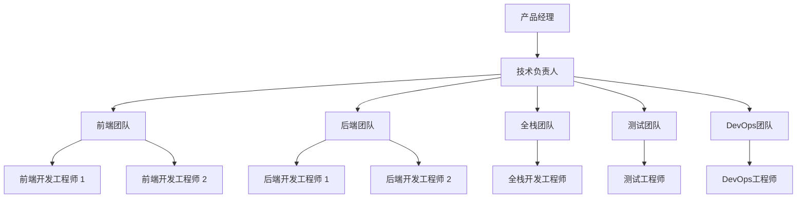
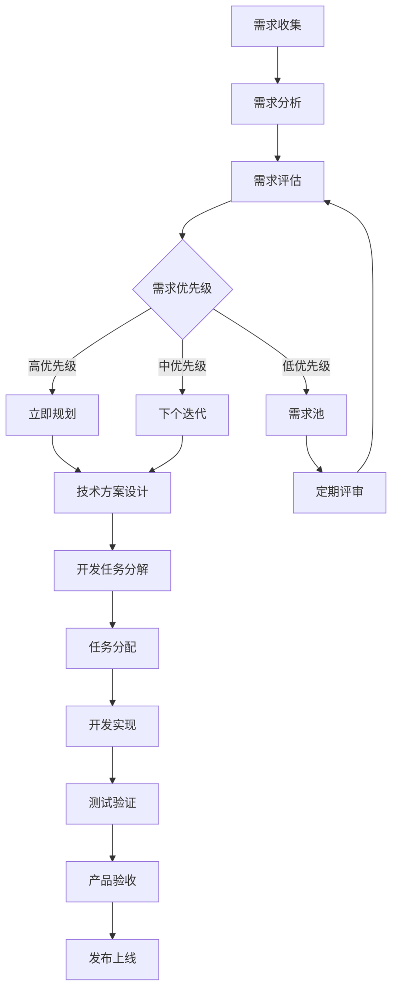
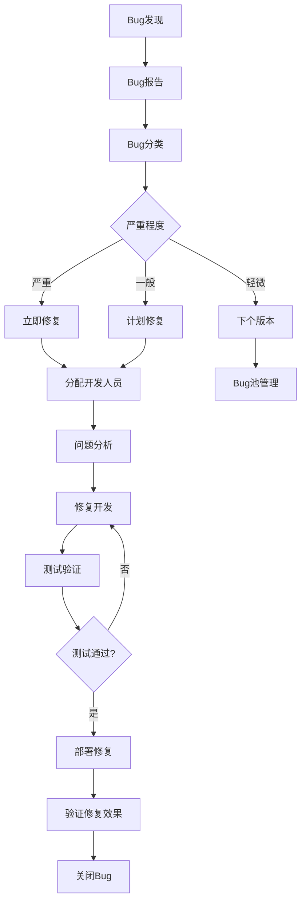

# 团队协作指南

## 概述

本文档定义了AI驱动内容代理系统开发团队的协作流程、沟通规范和最佳实践，旨在提高团队效率、确保项目质量并促进团队成员之间的有效协作。

## 团队结构

### 核心角色

#### 产品经理 (Product Manager)
- **职责**：产品规划、需求管理、用户体验设计
- **工作内容**：
  - 制定产品路线图和功能优先级
  - 收集和分析用户反馈
  - 协调跨部门合作
  - 监控产品指标和用户满意度

#### 技术负责人 (Tech Lead)
- **职责**：技术架构设计、代码审查、技术决策
- **工作内容**：
  - 设计系统架构和技术方案
  - 指导团队技术实现
  - 进行关键代码审查
  - 解决技术难题和瓶颈

#### 前端开发工程师 (Frontend Developer)
- **职责**：用户界面开发、用户体验实现
- **工作内容**：
  - 实现响应式用户界面
  - 优化前端性能和用户体验
  - 集成API和后端服务
  - 编写前端测试用例

#### 后端开发工程师 (Backend Developer)
- **职责**：服务端开发、API设计、数据库管理
- **工作内容**：
  - 开发RESTful API和GraphQL接口
  - 设计和优化数据库结构
  - 实现业务逻辑和数据处理
  - 确保系统安全性和性能

#### 全栈开发工程师 (Full-Stack Developer)
- **职责**：前后端开发、系统集成
- **工作内容**：
  - 跨栈开发和问题解决
  - 系统集成和端到端测试
  - 技术栈维护和升级
  - 协助其他开发人员解决问题

#### 测试工程师 (QA Engineer)
- **职责**：质量保证、测试自动化
- **工作内容**：
  - 设计和执行测试计划
  - 开发自动化测试脚本
  - 性能测试和安全测试
  - 缺陷跟踪和质量报告

#### DevOps工程师 (DevOps Engineer)
- **职责**：部署自动化、基础设施管理
- **工作内容**：
  - 设计和维护CI/CD流水线
  - 管理云基础设施
  - 监控系统性能和可用性
  - 安全配置和合规管理

### 团队组织架构



## 沟通规范

### 沟通渠道

#### 即时通讯
- **工具**：Slack / Microsoft Teams / 钉钉
- **用途**：日常沟通、快速问题解决、非正式讨论
- **规范**：
  - 工作时间内保持在线状态
  - 紧急问题使用@mention功能
  - 使用相应的频道进行分类讨论
  - 重要决定需要在项目管理工具中记录

#### 邮件沟通
- **用途**：正式通知、周报月报、外部沟通
- **规范**：
  - 主题明确，包含项目名称和关键信息
  - 内容结构化，使用要点和编号
  - 重要邮件需要确认回复
  - 抄送相关人员，避免信息孤岛

#### 视频会议
- **工具**：Zoom / Google Meet / 腾讯会议
- **用途**：团队会议、技术讨论、代码审查
- **规范**：
  - 提前发送会议议程
  - 准时参加，提前5分钟进入会议室
  - 会议记录需要共享给所有参与者
  - 录制重要会议供后续回顾

### 沟通频率

#### 日常沟通
- **每日站会**：每天上午9:30，15分钟
- **技术讨论**：根据需要，随时进行
- **问题反馈**：发现问题后立即沟通

#### 定期沟通
- **周会**：每周五下午，回顾本周工作和计划下周任务
- **月度回顾**：每月最后一个工作日，总结月度成果
- **季度规划**：每季度初，制定季度目标和计划

## 协作流程

### 需求管理流程



### 开发协作流程

#### 1. 任务接收
- 开发人员从项目管理工具中接收任务
- 仔细阅读需求文档和验收标准
- 如有疑问，及时与产品经理或技术负责人沟通
- 评估任务复杂度和所需时间

#### 2. 技术设计
- 对于复杂任务，先进行技术设计
- 与技术负责人讨论设计方案
- 考虑系统架构和性能影响
- 文档化设计决策和实现方案

#### 3. 代码开发
- 创建功能分支进行开发
- 遵循代码规范和最佳实践
- 编写单元测试和集成测试
- 定期提交代码，保持小而频繁的提交

#### 4. 代码审查
- 创建Pull Request并请求代码审查
- 审查者检查代码质量、逻辑正确性和安全性
- 开发者根据反馈修改代码
- 审查通过后合并到主分支

#### 5. 测试验证
- 测试工程师进行功能测试
- 开发人员配合解决发现的问题
- 进行回归测试确保系统稳定性
- 性能测试和安全测试

#### 6. 部署发布
- DevOps工程师执行部署流程
- 监控系统运行状态
- 产品经理进行最终验收
- 收集用户反馈并持续改进

### 问题解决流程

#### Bug处理流程



#### 技术问题升级机制

1. **一级支持**：开发人员自行解决（2小时内）
2. **二级支持**：团队内部讨论解决（4小时内）
3. **三级支持**：技术负责人介入（8小时内）
4. **四级支持**：外部专家或厂商支持（24小时内）

## 会议管理

### 会议类型

#### 每日站会 (Daily Standup)
- **时间**：每工作日上午9:30，15分钟
- **参与者**：全体开发团队成员
- **议程**：
  - 昨天完成的工作
  - 今天计划的工作
  - 遇到的问题和阻碍
- **规则**：
  - 每人发言时间不超过2分钟
  - 只讨论工作进展，不深入技术细节
  - 问题和阻碍会后单独讨论

#### 迭代规划会议 (Sprint Planning)
- **时间**：每个迭代开始前，2小时
- **参与者**：产品经理、技术负责人、开发团队
- **议程**：
  - 回顾上个迭代成果
  - 确定本迭代目标和范围
  - 任务分解和工作量估算
  - 任务分配和时间规划

#### 迭代回顾会议 (Sprint Retrospective)
- **时间**：每个迭代结束后，1.5小时
- **参与者**：全体团队成员
- **议程**：
  - 回顾迭代目标达成情况
  - 分析做得好的地方
  - 识别需要改进的问题
  - 制定下个迭代的改进计划

#### 技术分享会议 (Tech Talk)
- **时间**：每两周一次，1小时
- **参与者**：技术团队成员
- **议程**：
  - 新技术介绍和分享
  - 项目经验总结
  - 最佳实践讨论
  - 技术难题解决方案

### 会议最佳实践

#### 会议准备
- 提前发送会议邀请和议程
- 准备相关文档和材料
- 确认参与者的时间安排
- 预订会议室或准备在线会议链接

#### 会议进行
- 准时开始和结束
- 控制会议节奏和讨论方向
- 鼓励所有人参与讨论
- 记录重要决定和行动项

#### 会议跟进
- 会议结束后24小时内发送会议纪要
- 明确行动项的负责人和截止时间
- 跟踪行动项的执行进度
- 在下次会议中回顾上次的行动项

## 文档管理

### 文档分类

#### 需求文档
- **产品需求文档 (PRD)**：详细的功能需求和业务逻辑
- **用户故事 (User Stories)**：从用户角度描述的功能需求
- **验收标准 (Acceptance Criteria)**：功能完成的标准和测试用例

#### 技术文档
- **系统架构文档**：整体架构设计和技术选型
- **API文档**：接口定义、参数说明和示例
- **数据库设计文档**：数据模型和表结构设计
- **部署文档**：环境配置和部署流程

#### 流程文档
- **开发流程文档**：代码开发和审查流程
- **测试流程文档**：测试策略和执行流程
- **发布流程文档**：版本发布和回滚流程

#### 运维文档
- **监控文档**：系统监控和告警配置
- **故障处理文档**：常见问题和解决方案
- **备份恢复文档**：数据备份和恢复流程

### 文档规范

#### 文档结构
```markdown
# 文档标题

## 概述
- 文档目的和范围
- 目标读者
- 相关文档链接

## 详细内容
- 使用清晰的标题层次
- 包含必要的图表和示例
- 提供代码示例和配置

## 附录
- 术语表
- 参考资料
- 更新历史
```

#### 文档维护
- 文档创建后及时更新到文档管理系统
- 定期审查和更新文档内容
- 文档变更需要通知相关人员
- 保持文档版本控制和历史记录

### 知识管理

#### 知识库建设
- **技术知识库**：技术方案、最佳实践、问题解决方案
- **业务知识库**：业务流程、产品功能、用户反馈
- **流程知识库**：工作流程、规范标准、模板文档

#### 知识分享
- 定期组织技术分享会
- 鼓励团队成员写技术博客
- 建立内部技术论坛或讨论组
- 参加外部技术会议和培训

## 质量保证

### 代码质量

#### 代码审查
- 所有代码必须经过同行审查
- 审查重点：功能正确性、代码质量、安全性
- 使用代码审查清单确保审查质量
- 审查反馈要具体和建设性

#### 自动化检查
- 代码风格检查（ESLint、Prettier）
- 类型检查（TypeScript）
- 单元测试覆盖率检查
- 安全漏洞扫描

### 测试质量

#### 测试策略
- 单元测试：覆盖率不低于80%
- 集成测试：覆盖主要业务流程
- 端到端测试：覆盖关键用户场景
- 性能测试：确保系统性能指标

#### 测试自动化
- 自动化测试脚本开发和维护
- 持续集成中集成自动化测试
- 测试结果报告和分析
- 测试环境管理和维护

### 发布质量

#### 发布检查清单
- [ ] 代码审查完成
- [ ] 所有测试通过
- [ ] 性能测试达标
- [ ] 安全检查通过
- [ ] 文档更新完成
- [ ] 发布计划确认
- [ ] 回滚方案准备

#### 发布监控
- 发布后系统监控
- 用户反馈收集
- 性能指标跟踪
- 错误日志分析

## 持续改进

### 改进机制

#### 定期回顾
- 每月团队回顾会议
- 季度流程改进评估
- 年度团队建设规划

#### 改进实施
- 识别改进机会和问题
- 制定改进计划和目标
- 实施改进措施
- 评估改进效果

### 学习发展

#### 技能提升
- 制定个人学习计划
- 参加技术培训和认证
- 内部技术分享和交流
- 外部技术社区参与

#### 团队建设
- 定期团队建设活动
- 跨部门协作项目
- 导师制度和知识传承
- 团队文化建设

## 工具和平台

### 项目管理工具
- **Jira**：任务管理、缺陷跟踪、项目规划
- **Confluence**：文档管理、知识分享
- **Trello**：简单任务管理和看板

### 开发工具
- **Git**：版本控制和代码管理
- **GitHub/GitLab**：代码托管和协作
- **VS Code**：统一开发环境
- **Docker**：容器化开发和部署

### 沟通工具
- **Slack/Teams**：即时通讯和团队协作
- **Zoom/Meet**：视频会议和远程协作
- **Miro/Figma**：设计协作和原型制作

### 监控工具
- **Cloudflare Analytics**：性能监控和分析
- **Sentry**：错误监控和日志管理
- **Grafana**：指标可视化和告警

## 总结

有效的团队协作是项目成功的关键因素。通过建立清晰的角色分工、规范的沟通流程、高效的协作机制和持续的改进文化，我们能够：

1. **提高开发效率**：减少沟通成本，避免重复工作
2. **确保项目质量**：通过规范的流程和质量检查
3. **促进知识共享**：建立学习型团队文化
4. **增强团队凝聚力**：通过有效协作和共同目标
5. **支持持续改进**：通过定期回顾和优化流程

所有团队成员都应该认真学习并遵循本协作指南，共同为项目的成功贡献力量。