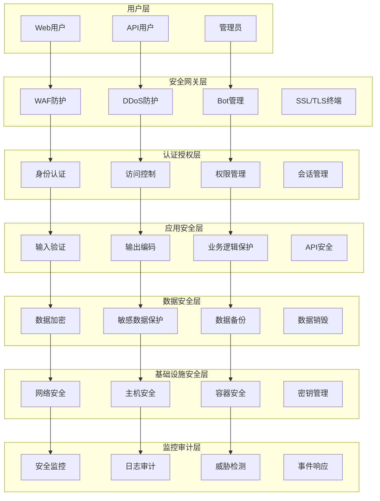

# AI驱动内容代理系统 - 安全设计文档

## 概述

本文档详细描述了AI驱动内容代理系统的安全架构设计、安全控制措施、威胁模型分析和安全最佳实践，确保系统在各个层面都具备完善的安全防护能力。

## 安全架构设计

### 整体安全架构



### 安全分层防护

#### 1. 网络层安全
- **Cloudflare WAF**: Web应用防火墙保护
- **DDoS防护**: 分布式拒绝服务攻击防护
- **IP白名单**: 管理接口IP访问控制
- **地理位置过滤**: 基于地理位置的访问控制

#### 2. 传输层安全
- **TLS 1.3**: 强制使用最新的TLS协议
- **HSTS**: HTTP严格传输安全
- **证书固定**: 防止中间人攻击
- **完美前向保密**: PFS支持

#### 3. 应用层安全
- **身份认证**: 多因素认证支持
- **访问控制**: 基于角色的权限控制
- **输入验证**: 严格的输入数据验证
- **输出编码**: 防止XSS攻击

## 威胁模型分析

### STRIDE威胁分析

#### 1. 欺骗 (Spoofing)

**威胁场景**:
- 攻击者伪造用户身份
- API密钥被盗用
- 会话劫持攻击

**防护措施**:
```javascript
// JWT Token验证
export async function verifyJWTToken(token, secret) {
  try {
    const payload = await jwt.verify(token, secret, {
      algorithms: ['HS256'],
      issuer: 'ai-content-agent',
      audience: 'api-users'
    });
    
    // 检查token是否在黑名单中
    const isBlacklisted = await checkTokenBlacklist(payload.jti);
    if (isBlacklisted) {
      throw new Error('Token has been revoked');
    }
    
    return payload;
  } catch (error) {
    throw new Error('Invalid token');
  }
}

// 会话固定防护
export function regenerateSessionId(c) {
  const newSessionId = generateSecureId();
  c.set('sessionId', newSessionId);
  
  // 设置安全的Cookie属性
  c.cookie('session_id', newSessionId, {
    httpOnly: true,
    secure: true,
    sameSite: 'strict',
    maxAge: 3600
  });
  
  return newSessionId;
}
```

#### 2. 篡改 (Tampering)

**威胁场景**:
- 请求参数被恶意修改
- 数据库数据被篡改
- 配置文件被修改

**防护措施**:
```javascript
// 请求完整性验证
export function verifyRequestIntegrity(c) {
  const signature = c.req.header('X-Signature');
  const timestamp = c.req.header('X-Timestamp');
  const body = c.req.body;
  
  // 检查时间戳防重放攻击
  const now = Date.now();
  if (Math.abs(now - parseInt(timestamp)) > 300000) { // 5分钟
    throw new Error('Request timestamp expired');
  }
  
  // 验证签名
  const expectedSignature = generateHMAC(body + timestamp, c.env.API_SECRET);
  if (!constantTimeCompare(signature, expectedSignature)) {
    throw new Error('Invalid request signature');
  }
}

// 数据完整性保护
export async function saveWithIntegrity(db, table, data) {
  const dataString = JSON.stringify(data);
  const checksum = await generateSHA256(dataString);
  
  await db.prepare(`
    INSERT INTO ${table} (data, checksum, created_at) 
    VALUES (?, ?, ?)
  `).bind(dataString, checksum, new Date().toISOString()).run();
}
```

#### 3. 否认 (Repudiation)

**威胁场景**:
- 用户否认执行了某项操作
- 管理员否认进行了配置更改
- 系统操作缺乏审计记录

**防护措施**:
```javascript
// 操作审计日志
export class AuditLogger {
  constructor(db) {
    this.db = db;
  }

  async logOperation(userId, operation, resource, details = {}) {
    const auditRecord = {
      id: generateUUID(),
      user_id: userId,
      operation,
      resource,
      details: JSON.stringify(details),
      ip_address: details.ipAddress,
      user_agent: details.userAgent,
      timestamp: new Date().toISOString(),
      signature: null
    };
    
    // 生成审计记录签名
    const recordString = JSON.stringify(auditRecord);
    auditRecord.signature = await generateHMAC(recordString, process.env.AUDIT_SECRET);
    
    await this.db.prepare(`
      INSERT INTO audit_logs 
      (id, user_id, operation, resource, details, ip_address, user_agent, timestamp, signature)
      VALUES (?, ?, ?, ?, ?, ?, ?, ?, ?)
    `).bind(
      auditRecord.id,
      auditRecord.user_id,
      auditRecord.operation,
      auditRecord.resource,
      auditRecord.details,
      auditRecord.ip_address,
      auditRecord.user_agent,
      auditRecord.timestamp,
      auditRecord.signature
    ).run();
  }

  async verifyAuditIntegrity(recordId) {
    const record = await this.db.prepare(
      'SELECT * FROM audit_logs WHERE id = ?'
    ).bind(recordId).first();
    
    if (!record) return false;
    
    const { signature, ...recordData } = record;
    const recordString = JSON.stringify(recordData);
    const expectedSignature = await generateHMAC(recordString, process.env.AUDIT_SECRET);
    
    return constantTimeCompare(signature, expectedSignature);
  }
}
```

#### 4. 信息泄露 (Information Disclosure)

**威胁场景**:
- 敏感数据未加密存储
- 错误信息泄露系统信息
- 日志包含敏感信息

**防护措施**:
```javascript
// 敏感数据加密
export class DataEncryption {
  constructor(encryptionKey) {
    this.key = encryptionKey;
  }

  async encryptSensitiveData(data) {
    const encoder = new TextEncoder();
    const dataBuffer = encoder.encode(JSON.stringify(data));
    
    const key = await crypto.subtle.importKey(
      'raw',
      encoder.encode(this.key.slice(0, 32)),
      { name: 'AES-GCM' },
      false,
      ['encrypt']
    );
    
    const iv = crypto.getRandomValues(new Uint8Array(12));
    const encrypted = await crypto.subtle.encrypt(
      { name: 'AES-GCM', iv },
      key,
      dataBuffer
    );
    
    return {
      data: Array.from(new Uint8Array(encrypted)),
      iv: Array.from(iv)
    };
  }

  async decryptSensitiveData(encryptedData) {
    const encoder = new TextEncoder();
    const decoder = new TextDecoder();
    
    const key = await crypto.subtle.importKey(
      'raw',
      encoder.encode(this.key.slice(0, 32)),
      { name: 'AES-GCM' },
      false,
      ['decrypt']
    );
    
    const decrypted = await crypto.subtle.decrypt(
      { name: 'AES-GCM', iv: new Uint8Array(encryptedData.iv) },
      key,
      new Uint8Array(encryptedData.data)
    );
    
    return JSON.parse(decoder.decode(decrypted));
  }
}

// 安全错误处理
export function handleSecureError(error, c) {
  const logger = c.get('logger');
  
  // 记录详细错误信息（仅内部）
  logger.error('Application error', {
    error: error.message,
    stack: error.stack,
    requestId: c.get('requestId')
  });
  
  // 返回通用错误信息（对外）
  const isProduction = c.env.ENVIRONMENT === 'production';
  const errorResponse = {
    error: 'Internal server error',
    requestId: c.get('requestId')
  };
  
  if (!isProduction && error.expose) {
    errorResponse.details = error.message;
  }
  
  return c.json(errorResponse, 500);
}
```

#### 5. 拒绝服务 (Denial of Service)

**威胁场景**:
- 大量请求导致服务不可用
- 资源耗尽攻击
- 慢速攻击

**防护措施**:
```javascript
// 速率限制
export class RateLimiter {
  constructor(kv) {
    this.kv = kv;
  }

  async checkRateLimit(identifier, limit, window) {
    const key = `rate_limit:${identifier}`;
    const now = Date.now();
    const windowStart = now - (window * 1000);
    
    // 获取当前计数
    const current = await this.kv.get(key, 'json') || { count: 0, resetTime: now + (window * 1000) };
    
    // 检查是否需要重置窗口
    if (now >= current.resetTime) {
      current.count = 0;
      current.resetTime = now + (window * 1000);
    }
    
    // 检查是否超过限制
    if (current.count >= limit) {
      return {
        allowed: false,
        remaining: 0,
        resetTime: current.resetTime
      };
    }
    
    // 增加计数
    current.count++;
    await this.kv.put(key, JSON.stringify(current), {
      expirationTtl: window
    });
    
    return {
      allowed: true,
      remaining: limit - current.count,
      resetTime: current.resetTime
    };
  }
}

// 资源使用监控
export function resourceMonitoringMiddleware() {
  return async (c, next) => {
    const startTime = Date.now();
    const startMemory = process.memoryUsage();
    
    try {
      await next();
    } finally {
      const duration = Date.now() - startTime;
      const endMemory = process.memoryUsage();
      const memoryUsed = endMemory.heapUsed - startMemory.heapUsed;
      
      // 检查资源使用是否异常
      if (duration > 30000) { // 30秒
        c.get('logger').warn('Long running request detected', {
          duration,
          path: c.req.path,
          method: c.req.method
        });
      }
      
      if (memoryUsed > 50 * 1024 * 1024) { // 50MB
        c.get('logger').warn('High memory usage detected', {
          memoryUsed,
          path: c.req.path,
          method: c.req.method
        });
      }
    }
  };
}
```

#### 6. 权限提升 (Elevation of Privilege)

**威胁场景**:
- 普通用户获得管理员权限
- 水平权限提升
- 垂直权限提升

**防护措施**:
```javascript
// 基于角色的访问控制 (RBAC)
export class RBACManager {
  constructor(db) {
    this.db = db;
  }

  async checkPermission(userId, resource, action) {
    // 获取用户角色
    const userRoles = await this.db.prepare(`
      SELECT r.name as role_name, r.permissions
      FROM user_roles ur
      JOIN roles r ON ur.role_id = r.id
      WHERE ur.user_id = ? AND ur.is_active = 1
    `).bind(userId).all();
    
    if (!userRoles.length) {
      return false;
    }
    
    // 检查权限
    for (const role of userRoles) {
      const permissions = JSON.parse(role.permissions || '[]');
      
      for (const permission of permissions) {
        if (this.matchPermission(permission, resource, action)) {
          return true;
        }
      }
    }
    
    return false;
  }

  matchPermission(permission, resource, action) {
    const [permResource, permAction] = permission.split(':');
    
    // 支持通配符
    const resourceMatch = permResource === '*' || permResource === resource;
    const actionMatch = permAction === '*' || permAction === action;
    
    return resourceMatch && actionMatch;
  }

  async grantRole(userId, roleId, grantedBy) {
    // 检查授权者是否有权限
    const canGrant = await this.checkPermission(grantedBy, 'roles', 'grant');
    if (!canGrant) {
      throw new Error('Insufficient permissions to grant role');
    }
    
    // 记录角色授权
    await this.db.prepare(`
      INSERT INTO user_roles (user_id, role_id, granted_by, granted_at, is_active)
      VALUES (?, ?, ?, ?, 1)
    `).bind(userId, roleId, grantedBy, new Date().toISOString()).run();
    
    // 审计日志
    const auditLogger = new AuditLogger(this.db);
    await auditLogger.logOperation(grantedBy, 'GRANT_ROLE', `user:${userId}`, {
      roleId,
      targetUser: userId
    });
  }
}

// 权限检查中间件
export function requirePermission(resource, action) {
  return async (c, next) => {
    const user = c.get('user');
    if (!user) {
      return c.json({ error: 'Authentication required' }, 401);
    }
    
    const rbac = new RBACManager(c.env.DB);
    const hasPermission = await rbac.checkPermission(user.id, resource, action);
    
    if (!hasPermission) {
      // 记录未授权访问尝试
      const auditLogger = new AuditLogger(c.env.DB);
      await auditLogger.logOperation(user.id, 'UNAUTHORIZED_ACCESS', resource, {
        action,
        ipAddress: c.req.header('CF-Connecting-IP'),
        userAgent: c.req.header('User-Agent')
      });
      
      return c.json({ error: 'Insufficient permissions' }, 403);
    }
    
    await next();
  };
}
```

## 身份认证与授权

### 多因素认证 (MFA)

```javascript
// TOTP实现
export class TOTPManager {
  constructor() {
    this.window = 1; // 允许前后1个时间窗口
    this.step = 30; // 30秒时间步长
  }

  generateSecret() {
    const buffer = new Uint8Array(20);
    crypto.getRandomValues(buffer);
    return this.base32Encode(buffer);
  }

  generateTOTP(secret, timestamp = Date.now()) {
    const time = Math.floor(timestamp / 1000 / this.step);
    const timeBuffer = new ArrayBuffer(8);
    const timeView = new DataView(timeBuffer);
    timeView.setUint32(4, time, false);
    
    return this.hmacSHA1(this.base32Decode(secret), new Uint8Array(timeBuffer))
      .then(hmac => {
        const offset = hmac[19] & 0xf;
        const code = (
          ((hmac[offset] & 0x7f) << 24) |
          ((hmac[offset + 1] & 0xff) << 16) |
          ((hmac[offset + 2] & 0xff) << 8) |
          (hmac[offset + 3] & 0xff)
        ) % 1000000;
        
        return code.toString().padStart(6, '0');
      });
  }

  async verifyTOTP(secret, token, timestamp = Date.now()) {
    for (let i = -this.window; i <= this.window; i++) {
      const testTime = timestamp + (i * this.step * 1000);
      const expectedToken = await this.generateTOTP(secret, testTime);
      
      if (constantTimeCompare(token, expectedToken)) {
        return true;
      }
    }
    
    return false;
  }
}

// MFA认证流程
export async function authenticateWithMFA(c) {
  const { username, password, totpToken } = await c.req.json();
  
  // 第一步：用户名密码验证
  const user = await verifyCredentials(c.env.DB, username, password);
  if (!user) {
    return c.json({ error: 'Invalid credentials' }, 401);
  }
  
  // 第二步：TOTP验证
  if (user.mfa_enabled) {
    if (!totpToken) {
      return c.json({ error: 'TOTP token required' }, 401);
    }
    
    const totpManager = new TOTPManager();
    const isValidTOTP = await totpManager.verifyTOTP(user.totp_secret, totpToken);
    
    if (!isValidTOTP) {
      // 记录MFA失败
      const auditLogger = new AuditLogger(c.env.DB);
      await auditLogger.logOperation(user.id, 'MFA_FAILED', 'authentication', {
        ipAddress: c.req.header('CF-Connecting-IP'),
        userAgent: c.req.header('User-Agent')
      });
      
      return c.json({ error: 'Invalid TOTP token' }, 401);
    }
  }
  
  // 生成JWT令牌
  const token = await generateJWTToken(user, c.env.JWT_SECRET);
  
  // 记录成功登录
  const auditLogger = new AuditLogger(c.env.DB);
  await auditLogger.logOperation(user.id, 'LOGIN_SUCCESS', 'authentication', {
    ipAddress: c.req.header('CF-Connecting-IP'),
    userAgent: c.req.header('User-Agent')
  });
  
  return c.json({ token, user: sanitizeUser(user) });
}
```

### OAuth 2.0 集成

```javascript
// OAuth 2.0 Provider集成
export class OAuthProvider {
  constructor(config) {
    this.clientId = config.clientId;
    this.clientSecret = config.clientSecret;
    this.redirectUri = config.redirectUri;
    this.authUrl = config.authUrl;
    this.tokenUrl = config.tokenUrl;
    this.userInfoUrl = config.userInfoUrl;
  }

  generateAuthUrl(state) {
    const params = new URLSearchParams({
      client_id: this.clientId,
      redirect_uri: this.redirectUri,
      response_type: 'code',
      scope: 'openid profile email',
      state
    });
    
    return `${this.authUrl}?${params.toString()}`;
  }

  async exchangeCodeForToken(code, state) {
    const response = await fetch(this.tokenUrl, {
      method: 'POST',
      headers: {
        'Content-Type': 'application/x-www-form-urlencoded',
        'Accept': 'application/json'
      },
      body: new URLSearchParams({
        grant_type: 'authorization_code',
        client_id: this.clientId,
        client_secret: this.clientSecret,
        code,
        redirect_uri: this.redirectUri
      })
    });
    
    if (!response.ok) {
      throw new Error('Failed to exchange code for token');
    }
    
    return await response.json();
  }

  async getUserInfo(accessToken) {
    const response = await fetch(this.userInfoUrl, {
      headers: {
        'Authorization': `Bearer ${accessToken}`,
        'Accept': 'application/json'
      }
    });
    
    if (!response.ok) {
      throw new Error('Failed to fetch user info');
    }
    
    return await response.json();
  }
}
```

## 数据安全

### 数据分类与保护

```javascript
// 数据分类枚举
export const DataClassification = {
  PUBLIC: 'public',
  INTERNAL: 'internal',
  CONFIDENTIAL: 'confidential',
  RESTRICTED: 'restricted'
};

// 数据保护策略
export class DataProtectionManager {
  constructor(encryptionService) {
    this.encryption = encryptionService;
  }

  async protectData(data, classification) {
    switch (classification) {
      case DataClassification.PUBLIC:
        return data; // 无需加密
        
      case DataClassification.INTERNAL:
        return await this.encryption.encryptSensitiveData(data);
        
      case DataClassification.CONFIDENTIAL:
        const encrypted = await this.encryption.encryptSensitiveData(data);
        return {
          ...encrypted,
          accessLog: true, // 启用访问日志
          retentionPeriod: 365 // 保留期限（天）
        };
        
      case DataClassification.RESTRICTED:
        const restrictedEncrypted = await this.encryption.encryptSensitiveData(data);
        return {
          ...restrictedEncrypted,
          accessLog: true,
          approvalRequired: true, // 需要审批
          retentionPeriod: 90,
          accessRestrictions: ['mfa_required', 'ip_whitelist']
        };
        
      default:
        throw new Error('Unknown data classification');
    }
  }

  async accessData(protectedData, user, context) {
    // 检查访问权限
    if (protectedData.approvalRequired) {
      const hasApproval = await this.checkDataAccessApproval(user.id, context.resourceId);
      if (!hasApproval) {
        throw new Error('Data access requires approval');
      }
    }
    
    // 检查访问限制
    if (protectedData.accessRestrictions) {
      await this.enforceAccessRestrictions(protectedData.accessRestrictions, user, context);
    }
    
    // 记录访问日志
    if (protectedData.accessLog) {
      await this.logDataAccess(user, context, protectedData);
    }
    
    // 解密数据
    return await this.encryption.decryptSensitiveData(protectedData);
  }

  async enforceAccessRestrictions(restrictions, user, context) {
    for (const restriction of restrictions) {
      switch (restriction) {
        case 'mfa_required':
          if (!user.mfa_verified) {
            throw new Error('MFA verification required');
          }
          break;
          
        case 'ip_whitelist':
          const allowedIPs = await this.getAllowedIPs(user.id);
          if (!allowedIPs.includes(context.ipAddress)) {
            throw new Error('IP address not whitelisted');
          }
          break;
          
        case 'time_restricted':
          const currentHour = new Date().getHours();
          if (currentHour < 9 || currentHour > 17) {
            throw new Error('Data access restricted to business hours');
          }
          break;
      }
    }
  }
}
```

### 个人信息保护 (GDPR/CCPA)

```javascript
// 个人信息保护管理
export class PrivacyManager {
  constructor(db) {
    this.db = db;
  }

  async recordConsent(userId, consentType, granted, ipAddress) {
    await this.db.prepare(`
      INSERT INTO user_consents (user_id, consent_type, granted, ip_address, timestamp)
      VALUES (?, ?, ?, ?, ?)
    `).bind(userId, consentType, granted, ipAddress, new Date().toISOString()).run();
  }

  async checkConsent(userId, consentType) {
    const consent = await this.db.prepare(`
      SELECT granted FROM user_consents 
      WHERE user_id = ? AND consent_type = ? 
      ORDER BY timestamp DESC LIMIT 1
    `).bind(userId, consentType).first();
    
    return consent?.granted || false;
  }

  async exportUserData(userId) {
    // 收集用户所有数据
    const userData = {
      profile: await this.getUserProfile(userId),
      content: await this.getUserContent(userId),
      activities: await this.getUserActivities(userId),
      preferences: await this.getUserPreferences(userId)
    };
    
    // 记录数据导出请求
    const auditLogger = new AuditLogger(this.db);
    await auditLogger.logOperation(userId, 'DATA_EXPORT', 'privacy', {
      dataTypes: Object.keys(userData)
    });
    
    return userData;
  }

  async deleteUserData(userId, deletionType = 'full') {
    const transaction = this.db.transaction(async () => {
      switch (deletionType) {
        case 'full':
          // 完全删除用户数据
          await this.db.prepare('DELETE FROM users WHERE id = ?').bind(userId).run();
          await this.db.prepare('DELETE FROM user_content WHERE user_id = ?').bind(userId).run();
          await this.db.prepare('DELETE FROM user_activities WHERE user_id = ?').bind(userId).run();
          await this.db.prepare('DELETE FROM user_preferences WHERE user_id = ?').bind(userId).run();
          break;
          
        case 'anonymize':
          // 匿名化用户数据
          const anonymousId = `anon_${generateUUID()}`;
          await this.db.prepare(`
            UPDATE users SET 
              username = ?, email = ?, name = ?, 
              phone = NULL, address = NULL, 
              deleted_at = ?
            WHERE id = ?
          `).bind(anonymousId, `${anonymousId}@deleted.local`, 'Deleted User', 
                  new Date().toISOString(), userId).run();
          break;
      }
    });
    
    await transaction();
    
    // 记录删除操作
    const auditLogger = new AuditLogger(this.db);
    await auditLogger.logOperation(userId, 'DATA_DELETION', 'privacy', {
      deletionType
    });
  }

  async handleDataPortabilityRequest(userId, format = 'json') {
    const userData = await this.exportUserData(userId);
    
    switch (format) {
      case 'json':
        return JSON.stringify(userData, null, 2);
        
      case 'csv':
        return this.convertToCSV(userData);
        
      case 'xml':
        return this.convertToXML(userData);
        
      default:
        throw new Error('Unsupported export format');
    }
  }
}
```

## 安全监控与响应

### 安全事件检测

```javascript
// 安全事件检测引擎
export class SecurityEventDetector {
  constructor(db, alertManager) {
    this.db = db;
    this.alertManager = alertManager;
    this.rules = new Map();
    this.initializeRules();
  }

  initializeRules() {
    // 暴力破解检测
    this.rules.set('brute_force', {
      condition: (events) => {
        const failedLogins = events.filter(e => 
          e.operation === 'LOGIN_FAILED' && 
          Date.now() - new Date(e.timestamp).getTime() < 300000 // 5分钟内
        );
        return failedLogins.length >= 5;
      },
      severity: 'high',
      action: 'block_ip'
    });
    
    // 异常访问模式检测
    this.rules.set('unusual_access', {
      condition: (events) => {
        const accessEvents = events.filter(e => e.operation.startsWith('ACCESS_'));
        const uniqueIPs = new Set(accessEvents.map(e => e.ip_address));
        const uniqueLocations = new Set(accessEvents.map(e => e.location));
        
        // 短时间内从多个IP或地理位置访问
        return uniqueIPs.size > 3 || uniqueLocations.size > 2;
      },
      severity: 'medium',
      action: 'require_mfa'
    });
    
    // 权限提升尝试检测
    this.rules.set('privilege_escalation', {
      condition: (events) => {
        const unauthorizedAttempts = events.filter(e => 
          e.operation === 'UNAUTHORIZED_ACCESS'
        );
        return unauthorizedAttempts.length >= 3;
      },
      severity: 'critical',
      action: 'suspend_account'
    });
  }

  async analyzeEvents(userId, timeWindow = 3600000) { // 1小时
    const events = await this.db.prepare(`
      SELECT * FROM audit_logs 
      WHERE user_id = ? AND timestamp > ?
      ORDER BY timestamp DESC
    `).bind(userId, new Date(Date.now() - timeWindow).toISOString()).all();
    
    const detectedThreats = [];
    
    for (const [ruleName, rule] of this.rules) {
      if (rule.condition(events)) {
        const threat = {
          rule: ruleName,
          severity: rule.severity,
          action: rule.action,
          userId,
          events: events.length,
          timestamp: new Date().toISOString()
        };
        
        detectedThreats.push(threat);
        await this.handleThreat(threat);
      }
    }
    
    return detectedThreats;
  }

  async handleThreat(threat) {
    // 记录安全事件
    await this.db.prepare(`
      INSERT INTO security_events (id, rule_name, severity, user_id, details, timestamp)
      VALUES (?, ?, ?, ?, ?, ?)
    `).bind(
      generateUUID(),
      threat.rule,
      threat.severity,
      threat.userId,
      JSON.stringify(threat),
      threat.timestamp
    ).run();
    
    // 执行响应动作
    switch (threat.action) {
      case 'block_ip':
        await this.blockIP(threat.userId);
        break;
        
      case 'require_mfa':
        await this.requireMFA(threat.userId);
        break;
        
      case 'suspend_account':
        await this.suspendAccount(threat.userId);
        break;
    }
    
    // 发送告警
    await this.alertManager.sendSecurityAlert(threat);
  }

  async blockIP(userId) {
    // 获取用户最近的IP地址
    const recentIPs = await this.db.prepare(`
      SELECT DISTINCT ip_address FROM audit_logs 
      WHERE user_id = ? AND timestamp > ?
    `).bind(userId, new Date(Date.now() - 3600000).toISOString()).all();
    
    // 添加到IP黑名单
    for (const { ip_address } of recentIPs) {
      await this.db.prepare(`
        INSERT OR REPLACE INTO ip_blacklist (ip_address, reason, created_at, expires_at)
        VALUES (?, ?, ?, ?)
      `).bind(
        ip_address,
        'Automated security response - brute force detected',
        new Date().toISOString(),
        new Date(Date.now() + 86400000).toISOString() // 24小时
      ).run();
    }
  }

  async requireMFA(userId) {
    await this.db.prepare(`
      UPDATE users SET mfa_required = 1, mfa_required_reason = ?
      WHERE id = ?
    `).bind('Security policy - unusual access pattern detected', userId).run();
  }

  async suspendAccount(userId) {
    await this.db.prepare(`
      UPDATE users SET 
        status = 'suspended', 
        suspended_at = ?, 
        suspension_reason = ?
      WHERE id = ?
    `).bind(
      new Date().toISOString(),
      'Automated security response - privilege escalation attempts',
      userId
    ).run();
  }
}
```

### 安全告警管理

```javascript
// 安全告警管理器
export class SecurityAlertManager {
  constructor(config) {
    this.config = config;
    this.channels = new Map();
    this.initializeChannels();
  }

  initializeChannels() {
    // Slack通知
    if (this.config.slack?.webhookUrl) {
      this.channels.set('slack', {
        send: this.sendSlackAlert.bind(this),
        severityFilter: ['medium', 'high', 'critical']
      });
    }
    
    // 邮件通知
    if (this.config.email?.webhookUrl) {
      this.channels.set('email', {
        send: this.sendEmailAlert.bind(this),
        severityFilter: ['high', 'critical']
      });
    }
    
    // SMS通知（仅关键告警）
    if (this.config.sms?.apiKey) {
      this.channels.set('sms', {
        send: this.sendSMSAlert.bind(this),
        severityFilter: ['critical']
      });
    }
  }

  async sendSecurityAlert(threat) {
    for (const [channelName, channel] of this.channels) {
      if (channel.severityFilter.includes(threat.severity)) {
        try {
          await channel.send(threat);
        } catch (error) {
          console.error(`Failed to send alert via ${channelName}:`, error);
        }
      }
    }
  }

  async sendSlackAlert(threat) {
    const color = this.getSeverityColor(threat.severity);
    const emoji = this.getSeverityEmoji(threat.severity);
    
    const payload = {
      attachments: [{
        color,
        title: `${emoji} Security Alert: ${threat.rule.toUpperCase()}`,
        fields: [
          {
            title: 'Severity',
            value: threat.severity.toUpperCase(),
            short: true
          },
          {
            title: 'User ID',
            value: threat.userId,
            short: true
          },
          {
            title: 'Action Taken',
            value: threat.action.replace('_', ' ').toUpperCase(),
            short: true
          },
          {
            title: 'Time',
            value: threat.timestamp,
            short: true
          }
        ],
        footer: 'AI Content Agent Security System',
        ts: Math.floor(new Date(threat.timestamp).getTime() / 1000)
      }]
    };
    
    await fetch(this.config.slack.webhookUrl, {
      method: 'POST',
      headers: { 'Content-Type': 'application/json' },
      body: JSON.stringify(payload)
    });
  }

  getSeverityColor(severity) {
    const colors = {
      low: '#36a64f',
      medium: '#ff9500',
      high: '#ff0000',
      critical: '#8b0000'
    };
    return colors[severity] || '#808080';
  }

  getSeverityEmoji(severity) {
    const emojis = {
      low: '🟢',
      medium: '🟡',
      high: '🔴',
      critical: '🚨'
    };
    return emojis[severity] || '⚪';
  }
}
```

## 安全测试

### 自动化安全测试

```javascript
// 安全测试套件
export class SecurityTestSuite {
  constructor(baseUrl, apiKey) {
    this.baseUrl = baseUrl;
    this.apiKey = apiKey;
    this.results = [];
  }

  async runAllTests() {
    console.log('🔒 Starting security test suite...');
    
    await this.testAuthentication();
    await this.testAuthorization();
    await this.testInputValidation();
    await this.testRateLimiting();
    await this.testDataProtection();
    
    return this.generateReport();
  }

  async testAuthentication() {
    console.log('Testing authentication...');
    
    // 测试无效凭据
    const invalidCredTest = await this.testInvalidCredentials();
    this.results.push({
      category: 'Authentication',
      test: 'Invalid Credentials',
      passed: invalidCredTest.status === 401,
      details: invalidCredTest
    });
    
    // 测试JWT令牌验证
    const jwtTest = await this.testJWTValidation();
    this.results.push({
      category: 'Authentication',
      test: 'JWT Validation',
      passed: jwtTest.passed,
      details: jwtTest
    });
    
    // 测试会话管理
    const sessionTest = await this.testSessionManagement();
    this.results.push({
      category: 'Authentication',
      test: 'Session Management',
      passed: sessionTest.passed,
      details: sessionTest
    });
  }

  async testInvalidCredentials() {
    try {
      const response = await fetch(`${this.baseUrl}/auth/login`, {
        method: 'POST',
        headers: { 'Content-Type': 'application/json' },
        body: JSON.stringify({
          username: 'invalid_user',
          password: 'invalid_password'
        })
      });
      
      return {
        status: response.status,
        body: await response.text()
      };
    } catch (error) {
      return { error: error.message };
    }
  }

  async testInputValidation() {
    console.log('Testing input validation...');
    
    const payloads = [
      // XSS测试
      '<script>alert("xss")</script>',
      '"><script>alert("xss")</script>',
      'javascript:alert("xss")',
      
      // SQL注入测试
      "'; DROP TABLE users; --",
      "' OR '1'='1",
      "1' UNION SELECT * FROM users--",
      
      // 命令注入测试
      '; ls -la',
      '| cat /etc/passwd',
      '&& whoami',
      
      // 路径遍历测试
      '../../../etc/passwd',
      '..\\..\\..\\windows\\system32\\config\\sam',
      
      // 大数据测试
      'A'.repeat(10000),
      
      // 特殊字符测试
      '\x00\x01\x02\x03',
      '\u0000\u0001\u0002\u0003'
    ];
    
    for (const payload of payloads) {
      const result = await this.testPayload(payload);
      this.results.push({
        category: 'Input Validation',
        test: `Payload: ${payload.substring(0, 50)}...`,
        passed: result.blocked,
        details: result
      });
    }
  }

  async testPayload(payload) {
    try {
      const response = await fetch(`${this.baseUrl}/api/content/rewrite`, {
        method: 'POST',
        headers: {
          'Content-Type': 'application/json',
          'Authorization': `Bearer ${this.apiKey}`
        },
        body: JSON.stringify({
          content: payload,
          style: 'professional'
        })
      });
      
      const body = await response.text();
      
      // 检查是否包含原始payload（表示未过滤）
      const blocked = !body.includes(payload) || response.status >= 400;
      
      return {
        blocked,
        status: response.status,
        response: body.substring(0, 200)
      };
    } catch (error) {
      return {
        blocked: true,
        error: error.message
      };
    }
  }

  async testRateLimiting() {
    console.log('Testing rate limiting...');
    
    const requests = [];
    const startTime = Date.now();
    
    // 发送大量并发请求
    for (let i = 0; i < 100; i++) {
      requests.push(
        fetch(`${this.baseUrl}/api/health`, {
          headers: { 'Authorization': `Bearer ${this.apiKey}` }
        })
      );
    }
    
    const responses = await Promise.allSettled(requests);
    const rateLimited = responses.some(r => 
      r.status === 'fulfilled' && r.value.status === 429
    );
    
    this.results.push({
      category: 'Rate Limiting',
      test: 'Concurrent Requests',
      passed: rateLimited,
      details: {
        totalRequests: requests.length,
        rateLimitedCount: responses.filter(r => 
          r.status === 'fulfilled' && r.value.status === 429
        ).length,
        duration: Date.now() - startTime
      }
    });
  }

  generateReport() {
    const totalTests = this.results.length;
    const passedTests = this.results.filter(r => r.passed).length;
    const failedTests = totalTests - passedTests;
    
    const report = {
      summary: {
        total: totalTests,
        passed: passedTests,
        failed: failedTests,
        passRate: ((passedTests / totalTests) * 100).toFixed(2) + '%'
      },
      categories: {},
      details: this.results
    };
    
    // 按类别分组
    for (const result of this.results) {
      if (!report.categories[result.category]) {
        report.categories[result.category] = {
          total: 0,
          passed: 0,
          failed: 0
        };
      }
      
      report.categories[result.category].total++;
      if (result.passed) {
        report.categories[result.category].passed++;
      } else {
        report.categories[result.category].failed++;
      }
    }
    
    return report;
  }
}
```

## 合规性要求

### GDPR合规

```javascript
// GDPR合规管理
export class GDPRComplianceManager {
  constructor(db, privacyManager) {
    this.db = db;
    this.privacyManager = privacyManager;
  }

  async handleDataSubjectRequest(requestType, userId, details = {}) {
    const requestId = generateUUID();
    
    // 记录请求
    await this.db.prepare(`
      INSERT INTO gdpr_requests (id, user_id, request_type, details, status, created_at)
      VALUES (?, ?, ?, ?, 'pending', ?)
    `).bind(
      requestId,
      userId,
      requestType,
      JSON.stringify(details),
      new Date().toISOString()
    ).run();
    
    switch (requestType) {
      case 'access':
        return await this.handleAccessRequest(requestId, userId);
        
      case 'rectification':
        return await this.handleRectificationRequest(requestId, userId, details);
        
      case 'erasure':
        return await this.handleErasureRequest(requestId, userId);
        
      case 'portability':
        return await this.handlePortabilityRequest(requestId, userId, details.format);
        
      case 'restriction':
        return await this.handleRestrictionRequest(requestId, userId);
        
      case 'objection':
        return await this.handleObjectionRequest(requestId, userId, details);
        
      default:
        throw new Error('Unknown request type');
    }
  }

  async handleAccessRequest(requestId, userId) {
    try {
      const userData = await this.privacyManager.exportUserData(userId);
      
      // 更新请求状态
      await this.db.prepare(`
        UPDATE gdpr_requests 
        SET status = 'completed', completed_at = ?, response_data = ?
        WHERE id = ?
      `).bind(
        new Date().toISOString(),
        JSON.stringify(userData),
        requestId
      ).run();
      
      return {
        requestId,
        status: 'completed',
        data: userData
      };
    } catch (error) {
      await this.db.prepare(`
        UPDATE gdpr_requests 
        SET status = 'failed', error_message = ?
        WHERE id = ?
      `).bind(error.message, requestId).run();
      
      throw error;
    }
  }

  async handleErasureRequest(requestId, userId) {
    try {
      // 检查是否有法律义务保留数据
      const retentionCheck = await this.checkRetentionRequirements(userId);
      
      if (retentionCheck.mustRetain) {
        await this.db.prepare(`
          UPDATE gdpr_requests 
          SET status = 'rejected', rejection_reason = ?
          WHERE id = ?
        `).bind(retentionCheck.reason, requestId).run();
        
        return {
          requestId,
          status: 'rejected',
          reason: retentionCheck.reason
        };
      }
      
      // 执行数据删除
      await this.privacyManager.deleteUserData(userId, 'full');
      
      await this.db.prepare(`
        UPDATE gdpr_requests 
        SET status = 'completed', completed_at = ?
        WHERE id = ?
      `).bind(new Date().toISOString(), requestId).run();
      
      return {
        requestId,
        status: 'completed'
      };
    } catch (error) {
      await this.db.prepare(`
        UPDATE gdpr_requests 
        SET status = 'failed', error_message = ?
        WHERE id = ?
      `).bind(error.message, requestId).run();
      
      throw error;
    }
  }

  async checkRetentionRequirements(userId) {
    // 检查是否有活跃的法律程序
    const legalHolds = await this.db.prepare(`
      SELECT * FROM legal_holds WHERE user_id = ? AND status = 'active'
    `).bind(userId).all();
    
    if (legalHolds.length > 0) {
      return {
        mustRetain: true,
        reason: 'Data subject to legal hold'
      };
    }
    
    // 检查财务记录保留要求
    const financialRecords = await this.db.prepare(`
      SELECT * FROM financial_transactions 
      WHERE user_id = ? AND created_at > ?
    `).bind(userId, new Date(Date.now() - 7 * 365 * 24 * 60 * 60 * 1000).toISOString()).all();
    
    if (financialRecords.length > 0) {
      return {
        mustRetain: true,
        reason: 'Financial records must be retained for 7 years'
      };
    }
    
    return { mustRetain: false };
  }
}
```

## 安全配置清单

### 部署前安全检查

```bash
#!/bin/bash
# security-checklist.sh

echo "🔒 Security Configuration Checklist"
echo "==================================="

# 检查环境变量
echo "✓ Checking environment variables..."
if [ -z "$JWT_SECRET" ]; then
  echo "❌ JWT_SECRET not set"
  exit 1
fi

if [ -z "$API_KEY_SECRET" ]; then
  echo "❌ API_KEY_SECRET not set"
  exit 1
fi

if [ -z "$ENCRYPTION_KEY" ]; then
  echo "❌ ENCRYPTION_KEY not set"
  exit 1
fi

# 检查密钥强度
echo "✓ Checking key strength..."
if [ ${#JWT_SECRET} -lt 32 ]; then
  echo "❌ JWT_SECRET too short (minimum 32 characters)"
  exit 1
fi

# 检查HTTPS配置
echo "✓ Checking HTTPS configuration..."
curl -I https://your-domain.com | grep -q "HTTP/2 200" || {
  echo "❌ HTTPS not properly configured"
  exit 1
}

# 检查安全头
echo "✓ Checking security headers..."
HEADERS=$(curl -I https://your-domain.com 2>/dev/null)

echo "$HEADERS" | grep -q "X-Content-Type-Options: nosniff" || {
  echo "❌ X-Content-Type-Options header missing"
  exit 1
}

echo "$HEADERS" | grep -q "X-Frame-Options: DENY" || {
  echo "❌ X-Frame-Options header missing"
  exit 1
}

echo "$HEADERS" | grep -q "X-XSS-Protection: 1" || {
  echo "❌ X-XSS-Protection header missing"
  exit 1
}

# 检查数据库权限
echo "✓ Checking database permissions..."
# 这里添加数据库权限检查逻辑

# 检查API端点安全
echo "✓ Checking API endpoint security..."
# 测试未授权访问
STATUS=$(curl -s -o /dev/null -w "%{http_code}" https://your-domain.com/api/admin/users)
if [ "$STATUS" != "401" ] && [ "$STATUS" != "403" ]; then
  echo "❌ Admin endpoints not properly protected"
  exit 1
fi

echo "✅ All security checks passed!"
```

### 安全最佳实践总结

1. **认证与授权**
   - 实施多因素认证 (MFA)
   - 使用强密码策略
   - 实施基于角色的访问控制 (RBAC)
   - 定期轮换密钥和令牌

2. **数据保护**
   - 加密传输中和静态数据
   - 实施数据分类和保护策略
   - 遵循GDPR/CCPA等隐私法规
   - 定期备份和测试恢复

3. **网络安全**
   - 使用WAF和DDoS防护
   - 实施IP白名单和地理过滤
   - 启用HTTPS和HSTS
   - 配置安全头

4. **应用安全**
   - 严格输入验证和输出编码
   - 实施速率限制
   - 定期安全测试和代码审查
   - 及时更新依赖包

5. **监控与响应**
   - 实施安全事件监控
   - 建立事件响应流程
   - 定期安全审计
   - 维护安全日志

## 总结

本安全设计文档全面覆盖了AI驱动内容代理系统的安全架构、威胁防护、合规要求和最佳实践。通过实施这些安全措施，系统能够有效防范各类安全威胁，保护用户数据和业务资产，确保系统的安全可靠运行。

安全是一个持续的过程，需要定期评估、更新和改进安全措施，以应对不断演变的威胁环境。