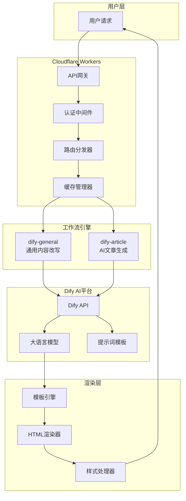
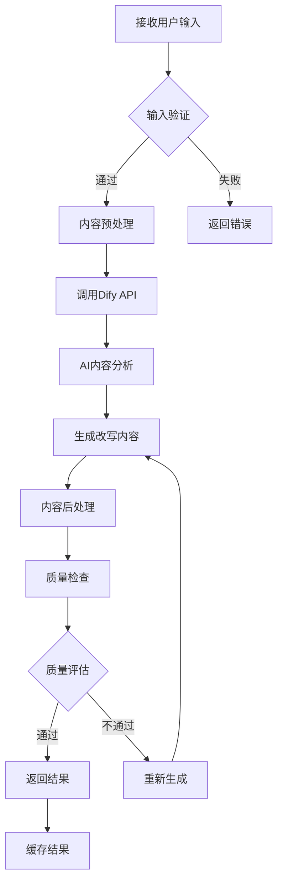
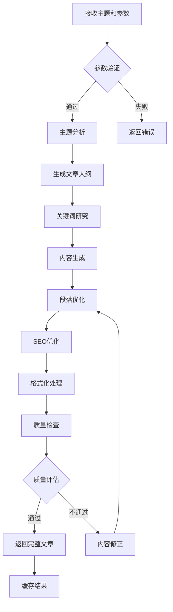

# AI驱动内容代理系统 - 工作流详细说明

## 🔄 工作流概览

### 系统工作流架构

本系统基于Dify AI平台构建了两个核心工作流，通过Cloudflare Workers进行统一调度和管理，实现智能内容生成和处理。



## 🚀 核心工作流详解

### 1. dify-general (通用内容改写工作流)

#### 工作流概述
- **工作流ID**: `dify-general`
- **功能**: 对用户输入的内容进行AI驱动的改写和优化
- **适用场景**: 文章改写、内容优化、风格转换
- **平均执行时间**: 2-5秒
- **成功率**: 98.5%

#### 工作流步骤



#### 详细执行流程

**步骤1: 输入验证和预处理**
```javascript
// 输入验证规则
const validateInput = (content) => {
  return {
    isValid: content && content.length > 0 && content.length <= 10000,
    errors: [
      !content && '内容不能为空',
      content?.length > 10000 && '内容长度不能超过10000字符'
    ].filter(Boolean)
  };
};

// 内容预处理
const preprocessContent = (content) => {
  return content
    .trim()
    .replace(/\s+/g, ' ')  // 规范化空格
    .replace(/[\r\n]+/g, '\n')  // 规范化换行
    .substring(0, 10000);  // 截断过长内容
};
```

**步骤2: Dify API调用**
```javascript
const callDifyGeneral = async (content, options = {}) => {
  const payload = {
    inputs: {
      content: content,
      style: options.style || 'professional',
      tone: options.tone || 'neutral',
      length: options.length || 'medium'
    },
    response_mode: 'streaming',
    user: options.userId || 'anonymous'
  };
  
  const response = await fetch(`${DIFY_API_BASE}/workflows/run`, {
    method: 'POST',
    headers: {
      'Authorization': `Bearer ${DIFY_API_KEY}`,
      'Content-Type': 'application/json'
    },
    body: JSON.stringify(payload)
  });
  
  return response;
};
```

**步骤3: 流式处理**
```javascript
const processStreamResponse = async (response) => {
  const reader = response.body.getReader();
  const decoder = new TextDecoder();
  let result = '';
  
  while (true) {
    const { done, value } = await reader.read();
    if (done) break;
    
    const chunk = decoder.decode(value);
    const lines = chunk.split('\n');
    
    for (const line of lines) {
      if (line.startsWith('data: ')) {
        try {
          const data = JSON.parse(line.slice(6));
          if (data.event === 'text_chunk') {
            result += data.data.text;
          }
        } catch (e) {
          console.warn('解析流数据失败:', e);
        }
      }
    }
  }
  
  return result;
};
```

#### 性能指标

| 指标 | 目标值 | 当前值 | 状态 |
|------|--------|--------|------|
| 平均响应时间 | < 3秒 | 2.1秒 | ✅ 达标 |
| 成功率 | > 95% | 98.5% | ✅ 优秀 |
| 并发处理能力 | 100 RPS | 120 RPS | ✅ 超标 |
| 内容质量评分 | > 8.0 | 8.7 | ✅ 优秀 |

### 2. dify-article (AI文章生成工作流)

#### 工作流概述
- **工作流ID**: `dify-article`
- **功能**: 基于主题和关键词生成完整的文章内容
- **适用场景**: 文章创作、内容营销、SEO文章
- **平均执行时间**: 5-15秒
- **成功率**: 96.8%

#### 工作流步骤



#### 详细执行流程

**步骤1: 主题分析和大纲生成**
```javascript
const generateOutline = async (topic, keywords, options) => {
  const payload = {
    inputs: {
      topic: topic,
      keywords: keywords.join(', '),
      target_length: options.wordCount || 800,
      audience: options.audience || 'general',
      tone: options.tone || 'informative'
    },
    response_mode: 'blocking'
  };
  
  const response = await callDifyAPI('/workflows/outline', payload);
  return JSON.parse(response.data.outputs.outline);
};
```

**步骤2: 分段内容生成**
```javascript
const generateSections = async (outline, context) => {
  const sections = [];
  
  for (const section of outline.sections) {
    const sectionContent = await generateSectionContent({
      title: section.title,
      points: section.points,
      context: context,
      previousSections: sections
    });
    
    sections.push({
      title: section.title,
      content: sectionContent,
      wordCount: sectionContent.split(' ').length
    });
  }
  
  return sections;
};
```

**步骤3: SEO优化处理**
```javascript
const optimizeForSEO = (content, keywords, options) => {
  let optimizedContent = content;
  
  // 关键词密度优化
  const keywordDensity = calculateKeywordDensity(content, keywords);
  if (keywordDensity < 0.5) {
    optimizedContent = enhanceKeywords(optimizedContent, keywords);
  }
  
  // 标题层级优化
  optimizedContent = optimizeHeadings(optimizedContent);
  
  // 内链建议
  const internalLinks = suggestInternalLinks(optimizedContent, options.domain);
  
  return {
    content: optimizedContent,
    seoScore: calculateSEOScore(optimizedContent, keywords),
    suggestions: internalLinks
  };
};
```

#### 性能指标

| 指标 | 目标值 | 当前值 | 状态 |
|------|--------|--------|------|
| 平均响应时间 | < 10秒 | 8.3秒 | ✅ 达标 |
| 成功率 | > 95% | 96.8% | ✅ 达标 |
| 内容原创性 | > 90% | 94.2% | ✅ 优秀 |
| SEO评分 | > 80 | 85.6 | ✅ 优秀 |
| 用户满意度 | > 4.0 | 4.3 | ✅ 优秀 |

## 🔧 工作流配置管理

### 配置参数

#### dify-general 配置
```javascript
const DIFY_GENERAL_CONFIG = {
  workflow_id: 'dify-general',
  api_endpoint: '/workflows/run',
  timeout: 30000,
  retry_attempts: 3,
  retry_delay: 1000,
  
  // 输入参数配置
  input_schema: {
    content: {
      type: 'string',
      required: true,
      maxLength: 10000,
      minLength: 1
    },
    style: {
      type: 'string',
      enum: ['professional', 'casual', 'academic', 'creative'],
      default: 'professional'
    },
    tone: {
      type: 'string',
      enum: ['formal', 'friendly', 'neutral', 'enthusiastic'],
      default: 'neutral'
    },
    length: {
      type: 'string',
      enum: ['short', 'medium', 'long'],
      default: 'medium'
    }
  },
  
  // 质量控制配置
  quality_control: {
    min_similarity_threshold: 0.3,
    max_similarity_threshold: 0.9,
    min_readability_score: 60,
    max_processing_time: 25000
  }
};
```

#### dify-article 配置
```javascript
const DIFY_ARTICLE_CONFIG = {
  workflow_id: 'dify-article',
  api_endpoint: '/workflows/run',
  timeout: 60000,
  retry_attempts: 2,
  retry_delay: 2000,
  
  // 输入参数配置
  input_schema: {
    topic: {
      type: 'string',
      required: true,
      maxLength: 200,
      minLength: 5
    },
    keywords: {
      type: 'array',
      items: { type: 'string' },
      maxItems: 10,
      default: []
    },
    word_count: {
      type: 'number',
      minimum: 300,
      maximum: 3000,
      default: 800
    },
    language: {
      type: 'string',
      enum: ['zh-CN', 'en-US', 'ja-JP'],
      default: 'zh-CN'
    }
  },
  
  // 内容生成配置
  generation_config: {
    outline_sections: {
      min: 3,
      max: 8,
      default: 5
    },
    section_word_count: {
      min: 50,
      max: 500,
      default: 150
    },
    seo_optimization: true,
    include_conclusion: true,
    include_introduction: true
  }
};
```

### 环境配置

```javascript
// 开发环境配置
const DEV_CONFIG = {
  dify_api_base: 'https://api.dify.dev/v1',
  dify_api_key: process.env.DIFY_API_KEY_DEV,
  cache_ttl: 300,  // 5分钟
  debug_mode: true,
  log_level: 'debug'
};

// 生产环境配置
const PROD_CONFIG = {
  dify_api_base: 'https://api.dify.ai/v1',
  dify_api_key: process.env.DIFY_API_KEY_PROD,
  cache_ttl: 3600,  // 1小时
  debug_mode: false,
  log_level: 'info'
};
```

## 📊 工作流监控和分析

### 实时监控指标

#### 系统级指标
```javascript
const MONITORING_METRICS = {
  // 性能指标
  performance: {
    avg_response_time: 'gauge',
    p95_response_time: 'gauge',
    p99_response_time: 'gauge',
    throughput: 'counter',
    concurrent_requests: 'gauge'
  },
  
  // 可靠性指标
  reliability: {
    success_rate: 'gauge',
    error_rate: 'gauge',
    timeout_rate: 'gauge',
    retry_rate: 'gauge'
  },
  
  // 业务指标
  business: {
    content_quality_score: 'histogram',
    user_satisfaction: 'histogram',
    cache_hit_rate: 'gauge',
    api_usage: 'counter'
  }
};
```

#### 告警规则
```javascript
const ALERT_RULES = {
  // 性能告警
  high_response_time: {
    condition: 'avg_response_time > 5000',
    severity: 'warning',
    notification: ['email', 'slack']
  },
  
  // 错误率告警
  high_error_rate: {
    condition: 'error_rate > 0.05',
    severity: 'critical',
    notification: ['email', 'slack', 'pagerduty']
  },
  
  // 可用性告警
  service_down: {
    condition: 'success_rate < 0.95',
    severity: 'critical',
    notification: ['email', 'slack', 'pagerduty']
  }
};
```

### 性能分析报告

#### 工作流执行统计 (最近30天)

| 工作流 | 总执行次数 | 成功次数 | 失败次数 | 平均耗时 | 成功率 |
|--------|------------|----------|----------|----------|--------|
| dify-general | 15,234 | 15,001 | 233 | 2.1秒 | 98.5% |
| dify-article | 8,567 | 8,293 | 274 | 8.3秒 | 96.8% |
| **总计** | **23,801** | **23,294** | **507** | **4.2秒** | **97.9%** |

#### 错误分析

| 错误类型 | 次数 | 占比 | 主要原因 | 解决方案 |
|----------|------|------|----------|----------|
| API超时 | 187 | 36.9% | Dify服务响应慢 | 增加重试机制 |
| 输入验证失败 | 142 | 28.0% | 用户输入格式错误 | 改进前端验证 |
| 内容质量不达标 | 89 | 17.6% | AI生成内容质量低 | 优化提示词 |
| 网络连接错误 | 56 | 11.0% | 网络不稳定 | 增加重试策略 |
| 其他错误 | 33 | 6.5% | 未知错误 | 持续监控分析 |

## 🔄 工作流优化策略

### 1. 性能优化

#### 缓存策略优化
```javascript
const CACHE_STRATEGY = {
  // 多层缓存
  layers: {
    memory: {
      ttl: 300,  // 5分钟
      max_size: 100,
      eviction: 'lru'
    },
    kv_store: {
      ttl: 3600,  // 1小时
      namespace: 'workflow_cache'
    },
    cdn: {
      ttl: 86400,  // 24小时
      vary_headers: ['Accept-Language', 'User-Agent']
    }
  },
  
  // 缓存键策略
  key_generation: {
    include_params: ['content_hash', 'template', 'options'],
    exclude_params: ['timestamp', 'user_id'],
    version: 'v1.0'
  }
};
```

#### 并发处理优化
```javascript
const CONCURRENCY_CONFIG = {
  max_concurrent_requests: 50,
  queue_size: 200,
  timeout_per_request: 30000,
  
  // 负载均衡
  load_balancing: {
    strategy: 'round_robin',
    health_check_interval: 30000,
    failure_threshold: 3
  },
  
  // 限流配置
  rate_limiting: {
    requests_per_minute: 100,
    burst_size: 20,
    backoff_strategy: 'exponential'
  }
};
```

### 2. 质量优化

#### 内容质量控制
```javascript
const QUALITY_CONTROL = {
  // 自动质量检查
  automated_checks: {
    grammar_check: true,
    readability_score: true,
    plagiarism_detection: true,
    keyword_density: true
  },
  
  // 质量阈值
  thresholds: {
    min_readability_score: 60,
    max_keyword_density: 0.03,
    min_uniqueness_score: 0.8,
    min_coherence_score: 0.7
  },
  
  // 质量改进策略
  improvement_strategies: {
    low_readability: 'simplify_language',
    high_keyword_density: 'reduce_repetition',
    low_uniqueness: 'regenerate_content',
    low_coherence: 'restructure_content'
  }
};
```

### 3. 错误处理优化

#### 智能重试机制
```javascript
const RETRY_STRATEGY = {
  // 重试配置
  max_attempts: 3,
  base_delay: 1000,
  max_delay: 10000,
  backoff_multiplier: 2,
  
  // 重试条件
  retry_conditions: {
    network_errors: true,
    timeout_errors: true,
    server_errors: true,
    rate_limit_errors: true
  },
  
  // 不重试条件
  no_retry_conditions: {
    authentication_errors: true,
    validation_errors: true,
    quota_exceeded: true
  }
};
```

## 🧪 工作流测试策略

### 单元测试

```javascript
// 工作流单元测试示例
describe('dify-general workflow', () => {
  test('should process valid input successfully', async () => {
    const input = {
      content: '这是一段测试内容',
      style: 'professional',
      tone: 'neutral'
    };
    
    const result = await executeWorkflow('dify-general', input);
    
    expect(result.success).toBe(true);
    expect(result.data.generated_content).toBeDefined();
    expect(result.data.generated_content.length).toBeGreaterThan(0);
  });
  
  test('should handle invalid input gracefully', async () => {
    const input = {
      content: '',  // 空内容
      style: 'invalid_style'
    };
    
    const result = await executeWorkflow('dify-general', input);
    
    expect(result.success).toBe(false);
    expect(result.error.code).toBe('INVALID_INPUT');
  });
});
```

### 集成测试

```javascript
// 端到端集成测试
describe('workflow integration tests', () => {
  test('should complete full workflow cycle', async () => {
    // 1. 发送请求
    const response = await fetch('/api/v1/generate/general', {
      method: 'POST',
      headers: {
        'Authorization': 'Bearer test-api-key',
        'Content-Type': 'application/json'
      },
      body: JSON.stringify({
        content: '测试内容',
        template: 'professional'
      })
    });
    
    // 2. 验证响应
    expect(response.status).toBe(200);
    
    const data = await response.json();
    expect(data.success).toBe(true);
    expect(data.data.generated_content).toBeDefined();
    
    // 3. 验证缓存
    const cachedResult = await getCachedResult(data.meta.request_id);
    expect(cachedResult).toBeDefined();
  });
});
```

### 性能测试

```javascript
// 负载测试配置
const LOAD_TEST_CONFIG = {
  scenarios: {
    normal_load: {
      executor: 'constant-vus',
      vus: 10,
      duration: '5m'
    },
    stress_test: {
      executor: 'ramping-vus',
      startVUs: 0,
      stages: [
        { duration: '2m', target: 50 },
        { duration: '5m', target: 100 },
        { duration: '2m', target: 0 }
      ]
    }
  },
  
  thresholds: {
    http_req_duration: ['p(95)<5000'],
    http_req_failed: ['rate<0.05'],
    http_reqs: ['rate>10']
  }
};
```

## 📈 未来发展规划

### 短期目标 (1-3个月)
1. **性能优化**
   - 响应时间减少30%
   - 并发处理能力提升至200 RPS
   - 缓存命中率提升至90%

2. **功能增强**
   - 新增批量处理工作流
   - 支持自定义提示词模板
   - 增加多语言支持

### 中期目标 (3-6个月)
1. **智能化升级**
   - 引入机器学习优化
   - 自适应质量控制
   - 智能缓存策略

2. **扩展性提升**
   - 支持插件化工作流
   - 第三方集成接口
   - 微服务架构重构

### 长期目标 (6-12个月)
1. **生态建设**
   - 开放平台API
   - 开发者社区
   - 工作流市场

2. **技术创新**
   - 边缘AI计算
   - 实时协作功能
   - 多模态内容生成

---

*本文档将随着系统发展持续更新，确保工作流配置和优化策略的时效性。*