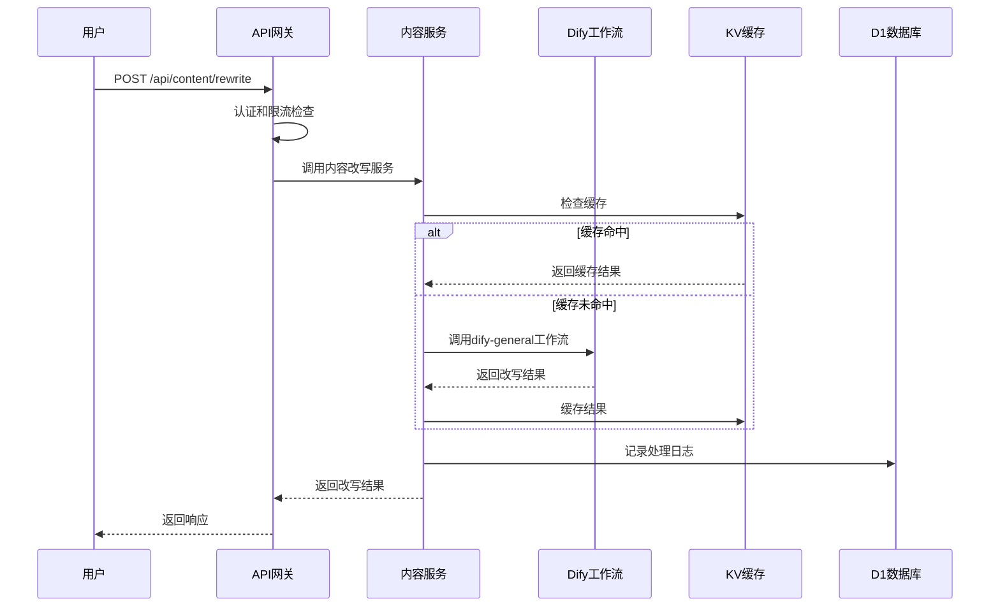
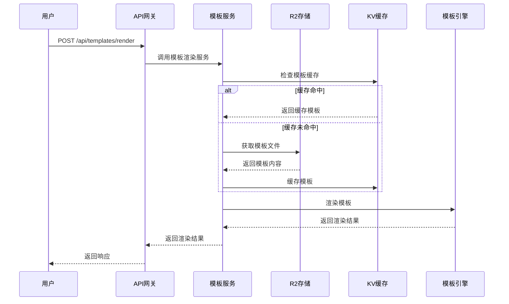

# AI驱动内容代理系统 - 技术架构详解

## 架构概述

本文档详细描述AI驱动内容代理系统的技术架构设计，包括系统分层、核心组件、数据流向、技术选型和架构决策。

## 系统分层架构

### 1. 用户接入层 (User Access Layer)

**职责**：处理用户请求接入和流量分发

**核心组件**：
- **Cloudflare CDN**：全球内容分发网络
- **负载均衡器**：智能流量分发
- **DDoS防护**：安全防护机制

**技术实现**：
```javascript
// Cloudflare Worker 入口点
export default {
  async fetch(request, env, ctx) {
    const url = new URL(request.url);
    
    // 路由分发
    if (url.pathname.startsWith('/api/')) {
      return handleAPI(request, env);
    } else {
      return handleStatic(request, env);
    }
  }
};
```

### 2. API网关层 (API Gateway Layer)

**职责**：API请求处理、认证、限流和路由

**核心组件**：
- **Hono.js框架**：轻量级Web框架
- **JWT认证中间件**：用户身份验证
- **限流中间件**：API调用频率控制
- **CORS中间件**：跨域请求处理

**技术实现**：
```typescript
import { Hono } from 'hono';
import { jwt } from 'hono/jwt';
import { cors } from 'hono/cors';
import { rateLimiter } from './middleware/rateLimiter';

const app = new Hono();

// 全局中间件
app.use('*', cors());
app.use('/api/*', rateLimiter({ max: 100, window: 60000 }));
app.use('/api/protected/*', jwt({ secret: 'your-secret' }));

// 路由定义
app.route('/api/content', contentRouter);
app.route('/api/users', userRouter);
app.route('/api/templates', templateRouter);
```

### 3. 业务服务层 (Business Service Layer)

**职责**：核心业务逻辑处理

#### 3.1 内容服务 (Content Service)

**功能**：AI内容生成和处理

```typescript
class ContentService {
  private difyClient: DifyClient;
  
  constructor(apiKey: string, baseUrl: string) {
    this.difyClient = new DifyClient(apiKey, baseUrl);
  }
  
  async rewriteContent(params: RewriteParams): Promise<RewriteResult> {
    const workflow = 'dify-general';
    const inputs = {
      original_content: params.content,
      target_style: params.style,
      target_length: params.length
    };
    
    const result = await this.difyClient.runWorkflow(workflow, inputs);
    return this.processResult(result);
  }
  
  async generateArticle(params: ArticleParams): Promise<ArticleResult> {
    const workflow = 'dify-article';
    const inputs = {
      topic: params.topic,
      keywords: params.keywords,
      target_audience: params.audience,
      article_length: params.length
    };
    
    const result = await this.difyClient.runWorkflow(workflow, inputs);
    return this.processArticleResult(result);
  }
}
```

#### 3.2 模板服务 (Template Service)

**功能**：模板渲染和管理

```typescript
class TemplateService {
  private templateEngine: TemplateEngine;
  private r2Storage: R2Bucket;
  
  async renderTemplate(templateId: string, data: any): Promise<string> {
    // 从R2存储获取模板
    const template = await this.getTemplate(templateId);
    
    // 数据预处理
    const processedData = await this.preprocessData(data);
    
    // 渲染模板
    const rendered = await this.templateEngine.render(template, processedData);
    
    // 响应式优化
    return this.optimizeForResponsive(rendered);
  }
  
  private async getTemplate(templateId: string): Promise<Template> {
    const cacheKey = `template:${templateId}`;
    
    // 尝试从KV缓存获取
    let template = await this.kvCache.get(cacheKey);
    
    if (!template) {
      // 从R2存储获取
      const object = await this.r2Storage.get(`templates/${templateId}.json`);
      template = await object?.json();
      
      // 缓存到KV
      await this.kvCache.put(cacheKey, JSON.stringify(template), {
        expirationTtl: 3600 // 1小时缓存
      });
    }
    
    return JSON.parse(template);
  }
}
```

#### 3.3 用户服务 (User Service)

**功能**：用户管理和认证

```typescript
class UserService {
  private db: D1Database;
  private jwtSecret: string;
  
  async register(userData: RegisterData): Promise<User> {
    // 密码加密
    const hashedPassword = await bcrypt.hash(userData.password, 10);
    
    // 插入用户数据
    const result = await this.db.prepare(`
      INSERT INTO users (email, password_hash, username, created_at)
      VALUES (?, ?, ?, ?)
    `).bind(
      userData.email,
      hashedPassword,
      userData.username,
      new Date().toISOString()
    ).run();
    
    return this.getUserById(result.meta.last_row_id);
  }
  
  async authenticate(email: string, password: string): Promise<AuthResult> {
    const user = await this.getUserByEmail(email);
    
    if (!user || !await bcrypt.compare(password, user.password_hash)) {
      throw new Error('Invalid credentials');
    }
    
    const token = await this.generateJWT(user);
    return { user, token };
  }
}
```

### 4. AI工作流层 (AI Workflow Layer)

**职责**：AI模型调用和工作流管理

#### 4.1 Dify工作流集成

```typescript
class DifyClient {
  private apiKey: string;
  private baseUrl: string;
  
  constructor(apiKey: string, baseUrl: string) {
    this.apiKey = apiKey;
    this.baseUrl = baseUrl;
  }
  
  async runWorkflow(workflowId: string, inputs: Record<string, any>): Promise<WorkflowResult> {
    const response = await fetch(`${this.baseUrl}/v1/workflows/run`, {
      method: 'POST',
      headers: {
        'Authorization': `Bearer ${this.apiKey}`,
        'Content-Type': 'application/json'
      },
      body: JSON.stringify({
        inputs,
        response_mode: 'blocking',
        user: 'system'
      })
    });
    
    if (!response.ok) {
      throw new Error(`Dify API error: ${response.statusText}`);
    }
    
    return await response.json();
  }
  
  async getWorkflowStatus(taskId: string): Promise<WorkflowStatus> {
    const response = await fetch(`${this.baseUrl}/v1/workflows/${taskId}/status`, {
      headers: {
        'Authorization': `Bearer ${this.apiKey}`
      }
    });
    
    return await response.json();
  }
}
```

#### 4.2 工作流配置管理

```typescript
interface WorkflowConfig {
  id: string;
  name: string;
  description: string;
  inputs: InputSchema[];
  outputs: OutputSchema[];
  timeout: number;
  retryPolicy: RetryPolicy;
}

class WorkflowManager {
  private configs: Map<string, WorkflowConfig> = new Map();
  
  constructor() {
    this.loadConfigs();
  }
  
  private loadConfigs() {
    // dify-general 工作流配置
    this.configs.set('dify-general', {
      id: 'dify-general',
      name: '通用内容改写',
      description: '对输入内容进行风格化改写',
      inputs: [
        { name: 'original_content', type: 'string', required: true },
        { name: 'target_style', type: 'string', required: true },
        { name: 'target_length', type: 'number', required: false }
      ],
      outputs: [
        { name: 'rewritten_content', type: 'string' },
        { name: 'quality_score', type: 'number' }
      ],
      timeout: 30000,
      retryPolicy: { maxRetries: 3, backoffMs: 1000 }
    });
    
    // dify-article 工作流配置
    this.configs.set('dify-article', {
      id: 'dify-article',
      name: 'AI文章生成',
      description: '基于主题和关键词生成完整文章',
      inputs: [
        { name: 'topic', type: 'string', required: true },
        { name: 'keywords', type: 'array', required: true },
        { name: 'target_audience', type: 'string', required: false },
        { name: 'article_length', type: 'number', required: false }
      ],
      outputs: [
        { name: 'article_content', type: 'string' },
        { name: 'title', type: 'string' },
        { name: 'summary', type: 'string' },
        { name: 'tags', type: 'array' }
      ],
      timeout: 60000,
      retryPolicy: { maxRetries: 2, backoffMs: 2000 }
    });
  }
}
```

### 5. 数据存储层 (Data Storage Layer)

**职责**：数据持久化和缓存

#### 5.1 Cloudflare D1 (关系型数据库)

**用途**：用户数据、配置信息、审计日志

```sql
-- 用户表
CREATE TABLE users (
  id INTEGER PRIMARY KEY AUTOINCREMENT,
  email TEXT UNIQUE NOT NULL,
  username TEXT UNIQUE NOT NULL,
  password_hash TEXT NOT NULL,
  role TEXT DEFAULT 'user',
  created_at DATETIME DEFAULT CURRENT_TIMESTAMP,
  updated_at DATETIME DEFAULT CURRENT_TIMESTAMP
);

-- 内容处理记录表
CREATE TABLE content_jobs (
  id INTEGER PRIMARY KEY AUTOINCREMENT,
  user_id INTEGER NOT NULL,
  job_type TEXT NOT NULL, -- 'rewrite' | 'generate'
  status TEXT DEFAULT 'pending', -- 'pending' | 'processing' | 'completed' | 'failed'
  input_data TEXT NOT NULL,
  output_data TEXT,
  error_message TEXT,
  processing_time INTEGER,
  created_at DATETIME DEFAULT CURRENT_TIMESTAMP,
  completed_at DATETIME,
  FOREIGN KEY (user_id) REFERENCES users(id)
);

-- 模板使用统计表
CREATE TABLE template_usage (
  id INTEGER PRIMARY KEY AUTOINCREMENT,
  template_id TEXT NOT NULL,
  user_id INTEGER,
  usage_count INTEGER DEFAULT 1,
  last_used_at DATETIME DEFAULT CURRENT_TIMESTAMP,
  FOREIGN KEY (user_id) REFERENCES users(id)
);
```

#### 5.2 Cloudflare KV (键值存储)

**用途**：缓存、会话存储、配置管理

```typescript
class KVService {
  private kv: KVNamespace;
  
  constructor(kv: KVNamespace) {
    this.kv = kv;
  }
  
  // 缓存管理
  async setCache(key: string, value: any, ttl: number = 3600): Promise<void> {
    await this.kv.put(`cache:${key}`, JSON.stringify(value), {
      expirationTtl: ttl
    });
  }
  
  async getCache(key: string): Promise<any> {
    const value = await this.kv.get(`cache:${key}`);
    return value ? JSON.parse(value) : null;
  }
  
  // 会话管理
  async setSession(sessionId: string, data: SessionData): Promise<void> {
    await this.kv.put(`session:${sessionId}`, JSON.stringify(data), {
      expirationTtl: 86400 // 24小时
    });
  }
  
  // 配置管理
  async getConfig(key: string): Promise<any> {
    const value = await this.kv.get(`config:${key}`);
    return value ? JSON.parse(value) : null;
  }
}
```

#### 5.3 Cloudflare R2 (对象存储)

**用途**：模板文件、静态资源、用户上传文件

```typescript
class R2Service {
  private bucket: R2Bucket;
  
  constructor(bucket: R2Bucket) {
    this.bucket = bucket;
  }
  
  // 模板文件管理
  async uploadTemplate(templateId: string, content: string): Promise<void> {
    await this.bucket.put(`templates/${templateId}.json`, content, {
      httpMetadata: {
        contentType: 'application/json',
        cacheControl: 'public, max-age=3600'
      }
    });
  }
  
  async getTemplate(templateId: string): Promise<string | null> {
    const object = await this.bucket.get(`templates/${templateId}.json`);
    return object ? await object.text() : null;
  }
  
  // 静态资源管理
  async uploadAsset(path: string, content: ArrayBuffer, contentType: string): Promise<void> {
    await this.bucket.put(`assets/${path}`, content, {
      httpMetadata: {
        contentType,
        cacheControl: 'public, max-age=31536000' // 1年缓存
      }
    });
  }
}
```

### 6. 监控和日志层 (Monitoring & Logging Layer)

**职责**：系统监控、日志收集、性能分析

#### 6.1 指标收集

```typescript
class MetricsCollector {
  private analytics: AnalyticsEngineDataset;
  
  constructor(analytics: AnalyticsEngineDataset) {
    this.analytics = analytics;
  }
  
  async recordAPICall(endpoint: string, method: string, statusCode: number, duration: number): Promise<void> {
    await this.analytics.writeDataPoint({
      blobs: [endpoint, method],
      doubles: [duration],
      indexes: [statusCode.toString()]
    });
  }
  
  async recordWorkflowExecution(workflowId: string, success: boolean, duration: number): Promise<void> {
    await this.analytics.writeDataPoint({
      blobs: [workflowId, success ? 'success' : 'failure'],
      doubles: [duration],
      indexes: ['workflow_execution']
    });
  }
  
  async recordUserAction(userId: string, action: string, metadata?: Record<string, any>): Promise<void> {
    await this.analytics.writeDataPoint({
      blobs: [userId, action, JSON.stringify(metadata || {})],
      doubles: [Date.now()],
      indexes: ['user_action']
    });
  }
}
```

#### 6.2 结构化日志

```typescript
class Logger {
  private level: LogLevel;
  
  constructor(level: LogLevel = 'info') {
    this.level = level;
  }
  
  info(message: string, context?: Record<string, any>): void {
    this.log('info', message, context);
  }
  
  error(message: string, error?: Error, context?: Record<string, any>): void {
    this.log('error', message, { ...context, error: error?.stack });
  }
  
  warn(message: string, context?: Record<string, any>): void {
    this.log('warn', message, context);
  }
  
  private log(level: LogLevel, message: string, context?: Record<string, any>): void {
    const logEntry = {
      timestamp: new Date().toISOString(),
      level,
      message,
      context: context || {},
      requestId: this.getRequestId()
    };
    
    console.log(JSON.stringify(logEntry));
  }
  
  private getRequestId(): string {
    // 从请求上下文获取ID
    return crypto.randomUUID();
  }
}
```

## 数据流架构

### 内容改写流程



### 模板渲染流程



## 技术选型决策

### 1. 运行时选择：Cloudflare Workers

**选择理由**：
- **全球边缘计算**：低延迟响应
- **无服务器架构**：自动扩缩容
- **成本效益**：按使用量付费
- **生态集成**：与Cloudflare服务深度集成

**技术对比**：
| 特性 | Cloudflare Workers | AWS Lambda | Vercel Functions |
|------|-------------------|------------|------------------|
| 冷启动时间 | <1ms | 100-1000ms | 100-500ms |
| 全球分布 | 200+ 边缘节点 | 区域性 | 全球CDN |
| 并发限制 | 1000/请求 | 1000/函数 | 1000/函数 |
| 执行时间 | 30s | 15min | 10s |
| 成本 | $0.50/百万请求 | $0.20/百万请求 | $0.40/百万请求 |

### 2. Web框架选择：Hono.js

**选择理由**：
- **轻量级**：适合边缘计算环境
- **TypeScript原生支持**：类型安全
- **中间件生态**：丰富的插件系统
- **性能优异**：基准测试表现优秀

### 3. 数据库选择：Cloudflare D1

**选择理由**：
- **SQLite兼容**：熟悉的SQL语法
- **全球复制**：数据就近访问
- **事务支持**：ACID特性保证
- **成本低廉**：免费额度充足

### 4. AI平台选择：Dify

**选择理由**：
- **可视化工作流**：易于配置和调试
- **多模型支持**：支持GPT、Claude等
- **API友好**：RESTful接口集成
- **企业级特性**：监控、日志、版本管理

## 架构约束和限制

### 1. Cloudflare Workers限制
- **CPU时间**：最大30秒执行时间
- **内存使用**：128MB内存限制
- **请求大小**：100MB请求体限制
- **并发连接**：1000个子请求限制

### 2. 数据存储限制
- **D1数据库**：10GB存储限制
- **KV存储**：25MB单个值限制
- **R2存储**：5TB对象大小限制

### 3. 网络限制
- **出站请求**：50个并发子请求
- **WebSocket**：不支持长连接
- **文件上传**：通过R2预签名URL处理

## 性能优化策略

### 1. 缓存策略

```typescript
class CacheStrategy {
  // 多层缓存架构
  private l1Cache: Map<string, any> = new Map(); // 内存缓存
  private l2Cache: KVNamespace; // KV缓存
  private l3Cache: R2Bucket; // R2存储
  
  async get(key: string): Promise<any> {
    // L1缓存检查
    if (this.l1Cache.has(key)) {
      return this.l1Cache.get(key);
    }
    
    // L2缓存检查
    const l2Value = await this.l2Cache.get(key);
    if (l2Value) {
      const parsed = JSON.parse(l2Value);
      this.l1Cache.set(key, parsed);
      return parsed;
    }
    
    // L3缓存检查
    const l3Object = await this.l3Cache.get(key);
    if (l3Object) {
      const value = await l3Object.json();
      await this.l2Cache.put(key, JSON.stringify(value), { expirationTtl: 3600 });
      this.l1Cache.set(key, value);
      return value;
    }
    
    return null;
  }
}
```

### 2. 数据库优化

```sql
-- 索引优化
CREATE INDEX idx_users_email ON users(email);
CREATE INDEX idx_content_jobs_user_status ON content_jobs(user_id, status);
CREATE INDEX idx_content_jobs_created_at ON content_jobs(created_at);

-- 分区策略（按时间分区）
CREATE TABLE content_jobs_2025_01 AS SELECT * FROM content_jobs WHERE created_at >= '2025-01-01' AND created_at < '2025-02-01';
```

### 3. API优化

```typescript
// 请求合并
class RequestBatcher {
  private batches: Map<string, Promise<any>> = new Map();
  
  async batchRequest(key: string, requestFn: () => Promise<any>): Promise<any> {
    if (this.batches.has(key)) {
      return this.batches.get(key);
    }
    
    const promise = requestFn();
    this.batches.set(key, promise);
    
    // 清理完成的批次
    promise.finally(() => {
      this.batches.delete(key);
    });
    
    return promise;
  }
}

// 响应压缩
app.use('*', async (c, next) => {
  await next();
  
  const acceptEncoding = c.req.header('accept-encoding');
  if (acceptEncoding?.includes('gzip')) {
    const response = c.res;
    const compressed = await gzip(await response.arrayBuffer());
    
    return new Response(compressed, {
      status: response.status,
      headers: {
        ...response.headers,
        'content-encoding': 'gzip',
        'content-length': compressed.byteLength.toString()
      }
    });
  }
});
```

## 安全架构

### 1. 认证和授权

```typescript
// JWT中间件
const jwtMiddleware = jwt({
  secret: env.JWT_SECRET,
  cookie: 'auth-token',
  alg: 'HS256'
});

// RBAC权限检查
const rbacMiddleware = (requiredRole: string) => {
  return async (c: Context, next: Next) => {
    const payload = c.get('jwtPayload');
    const userRole = payload.role;
    
    if (!hasPermission(userRole, requiredRole)) {
      return c.json({ error: 'Insufficient permissions' }, 403);
    }
    
    await next();
  };
};

// 使用示例
app.get('/api/admin/*', jwtMiddleware, rbacMiddleware('admin'));
```

### 2. 输入验证

```typescript
import { z } from 'zod';

// 请求验证中间件
const validateRequest = (schema: z.ZodSchema) => {
  return async (c: Context, next: Next) => {
    try {
      const body = await c.req.json();
      const validated = schema.parse(body);
      c.set('validatedData', validated);
      await next();
    } catch (error) {
      return c.json({ error: 'Invalid request data', details: error.errors }, 400);
    }
  };
};

// 内容改写请求验证
const rewriteSchema = z.object({
  content: z.string().min(1).max(10000),
  style: z.enum(['formal', 'casual', 'academic', 'creative']),
  length: z.number().min(50).max(5000).optional()
});

app.post('/api/content/rewrite', validateRequest(rewriteSchema), async (c) => {
  const data = c.get('validatedData');
  // 处理逻辑
});
```

### 3. 限流和防护

```typescript
class RateLimiter {
  private kv: KVNamespace;
  
  async checkLimit(key: string, limit: number, window: number): Promise<boolean> {
    const now = Date.now();
    const windowStart = now - window;
    
    // 获取当前计数
    const current = await this.kv.get(`rate:${key}`);
    const requests = current ? JSON.parse(current) : [];
    
    // 清理过期请求
    const validRequests = requests.filter((timestamp: number) => timestamp > windowStart);
    
    // 检查是否超限
    if (validRequests.length >= limit) {
      return false;
    }
    
    // 记录新请求
    validRequests.push(now);
    await this.kv.put(`rate:${key}`, JSON.stringify(validRequests), {
      expirationTtl: Math.ceil(window / 1000)
    });
    
    return true;
  }
}
```

## 监控和可观测性

### 1. 健康检查

```typescript
app.get('/health', async (c) => {
  const checks = await Promise.allSettled([
    checkDatabase(c.env.DB),
    checkKVStore(c.env.KV),
    checkR2Bucket(c.env.R2),
    checkDifyAPI(c.env.DIFY_API_KEY)
  ]);
  
  const results = checks.map((check, index) => ({
    service: ['database', 'kv', 'r2', 'dify'][index],
    status: check.status === 'fulfilled' ? 'healthy' : 'unhealthy',
    error: check.status === 'rejected' ? check.reason.message : null
  }));
  
  const overallStatus = results.every(r => r.status === 'healthy') ? 'healthy' : 'unhealthy';
  
  return c.json({
    status: overallStatus,
    timestamp: new Date().toISOString(),
    checks: results
  }, overallStatus === 'healthy' ? 200 : 503);
});
```

### 2. 性能监控

```typescript
class PerformanceMonitor {
  private analytics: AnalyticsEngineDataset;
  
  async trackRequest(request: Request, response: Response, duration: number): Promise<void> {
    const url = new URL(request.url);
    
    await this.analytics.writeDataPoint({
      blobs: [
        request.method,
        url.pathname,
        response.status.toString(),
        request.headers.get('user-agent') || 'unknown'
      ],
      doubles: [duration, response.headers.get('content-length') ? parseInt(response.headers.get('content-length')!) : 0],
      indexes: ['api_request']
    });
  }
  
  async trackWorkflow(workflowId: string, duration: number, success: boolean): Promise<void> {
    await this.analytics.writeDataPoint({
      blobs: [workflowId, success ? 'success' : 'failure'],
      doubles: [duration],
      indexes: ['workflow_execution']
    });
  }
}
```

## 部署和运维

### 1. 环境配置

```toml
# wrangler.toml
name = "ai-content-agent"
main = "src/index.ts"
compatibility_date = "2024-01-01"
compatibility_flags = ["nodejs_compat"]

[env.production]
name = "ai-content-agent-prod"
vars = { ENVIRONMENT = "production" }

[env.staging]
name = "ai-content-agent-staging"
vars = { ENVIRONMENT = "staging" }

[[env.production.kv_namespaces]]
binding = "KV"
id = "your-production-kv-id"

[[env.production.r2_buckets]]
binding = "R2"
bucket_name = "ai-content-agent-prod"

[[env.production.d1_databases]]
binding = "DB"
database_name = "ai-content-agent-prod"
database_id = "your-production-db-id"

[[env.production.analytics_engine_datasets]]
binding = "ANALYTICS"
dataset = "ai_content_metrics"
```

### 2. CI/CD流水线

```yaml
# .github/workflows/deploy.yml
name: Deploy to Cloudflare Workers

on:
  push:
    branches: [main, staging]
  pull_request:
    branches: [main]

jobs:
  test:
    runs-on: ubuntu-latest
    steps:
      - uses: actions/checkout@v4
      - uses: actions/setup-node@v4
        with:
          node-version: '18'
          cache: 'pnpm'
      
      - run: pnpm install
      - run: pnpm test
      - run: pnpm build
  
  deploy-staging:
    if: github.ref == 'refs/heads/staging'
    needs: test
    runs-on: ubuntu-latest
    steps:
      - uses: actions/checkout@v4
      - uses: actions/setup-node@v4
        with:
          node-version: '18'
          cache: 'pnpm'
      
      - run: pnpm install
      - run: pnpm build
      
      - name: Deploy to Staging
        uses: cloudflare/wrangler-action@v3
        with:
          apiToken: ${{ secrets.CLOUDFLARE_API_TOKEN }}
          environment: 'staging'
  
  deploy-production:
    if: github.ref == 'refs/heads/main'
    needs: test
    runs-on: ubuntu-latest
    steps:
      - uses: actions/checkout@v4
      - uses: actions/setup-node@v4
        with:
          node-version: '18'
          cache: 'pnpm'
      
      - run: pnpm install
      - run: pnpm build
      
      - name: Deploy to Production
        uses: cloudflare/wrangler-action@v3
        with:
          apiToken: ${{ secrets.CLOUDFLARE_API_TOKEN }}
          environment: 'production'
```

## 总结

本技术架构文档详细描述了AI驱动内容代理系统的技术实现方案，包括：

1. **分层架构设计**：清晰的职责分离和模块化设计
2. **技术选型决策**：基于性能、成本和可维护性的技术选择
3. **数据流设计**：高效的数据处理和存储策略
4. **性能优化**：多层缓存和数据库优化策略
5. **安全架构**：全面的安全防护机制
6. **监控体系**：完整的可观测性解决方案
7. **部署运维**：自动化的CI/CD流水线

该架构设计充分利用了Cloudflare平台的优势，实现了高性能、高可用、低成本的AI内容生成服务。

---

*最后更新：2025年1月15日*
*文档版本：v2.0*