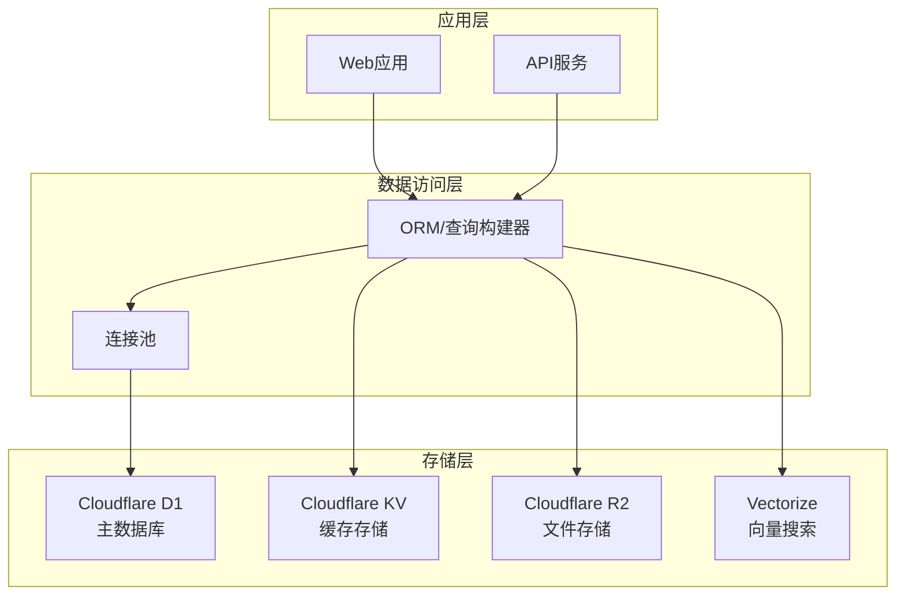
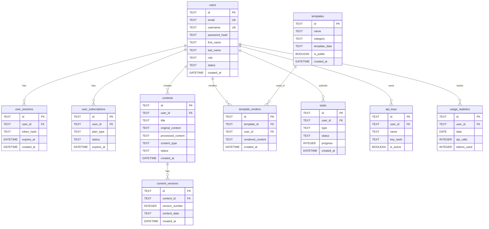

# AI驱动内容代理系统 - 数据库设计文档

## 概述

本文档详细描述AI驱动内容代理系统的数据库设计，包括数据模型、表结构、索引策略、数据关系和存储优化方案。

### 技术选型

- **主数据库**: Cloudflare D1 (SQLite)
- **缓存层**: Cloudflare KV
- **文件存储**: Cloudflare R2
- **搜索引擎**: Cloudflare Vectorize (向量搜索)

### 设计原则

1. **数据一致性**: 确保数据的完整性和一致性
2. **性能优化**: 合理的索引设计和查询优化
3. **扩展性**: 支持水平扩展和垂直扩展
4. **安全性**: 数据加密和访问控制
5. **备份恢复**: 完整的备份和恢复策略

## 数据库架构



## 核心数据模型

### 1. 用户管理模块

#### users 表

```sql
CREATE TABLE users (
    id TEXT PRIMARY KEY,
    email TEXT UNIQUE NOT NULL,
    username TEXT UNIQUE NOT NULL,
    password_hash TEXT NOT NULL,
    first_name TEXT,
    last_name TEXT,
    avatar_url TEXT,
    role TEXT DEFAULT 'user' CHECK (role IN ('user', 'admin', 'moderator')),
    status TEXT DEFAULT 'active' CHECK (status IN ('active', 'inactive', 'suspended')),
    email_verified BOOLEAN DEFAULT FALSE,
    preferences TEXT, -- JSON格式存储用户偏好
    created_at DATETIME DEFAULT CURRENT_TIMESTAMP,
    updated_at DATETIME DEFAULT CURRENT_TIMESTAMP,
    last_login_at DATETIME,
    deleted_at DATETIME
);

-- 索引
CREATE INDEX idx_users_email ON users(email);
CREATE INDEX idx_users_username ON users(username);
CREATE INDEX idx_users_status ON users(status);
CREATE INDEX idx_users_created_at ON users(created_at);
```

#### user_sessions 表

```sql
CREATE TABLE user_sessions (
    id TEXT PRIMARY KEY,
    user_id TEXT NOT NULL,
    token_hash TEXT NOT NULL,
    refresh_token_hash TEXT,
    expires_at DATETIME NOT NULL,
    created_at DATETIME DEFAULT CURRENT_TIMESTAMP,
    last_used_at DATETIME DEFAULT CURRENT_TIMESTAMP,
    ip_address TEXT,
    user_agent TEXT,
    is_active BOOLEAN DEFAULT TRUE,
    FOREIGN KEY (user_id) REFERENCES users(id) ON DELETE CASCADE
);

-- 索引
CREATE INDEX idx_sessions_user_id ON user_sessions(user_id);
CREATE INDEX idx_sessions_token_hash ON user_sessions(token_hash);
CREATE INDEX idx_sessions_expires_at ON user_sessions(expires_at);
```

#### user_subscriptions 表

```sql
CREATE TABLE user_subscriptions (
    id TEXT PRIMARY KEY,
    user_id TEXT NOT NULL,
    plan_type TEXT NOT NULL CHECK (plan_type IN ('free', 'basic', 'pro', 'enterprise')),
    status TEXT DEFAULT 'active' CHECK (status IN ('active', 'cancelled', 'expired', 'suspended')),
    starts_at DATETIME NOT NULL,
    expires_at DATETIME,
    auto_renew BOOLEAN DEFAULT TRUE,
    payment_method TEXT,
    limits TEXT, -- JSON格式存储配额限制
    created_at DATETIME DEFAULT CURRENT_TIMESTAMP,
    updated_at DATETIME DEFAULT CURRENT_TIMESTAMP,
    FOREIGN KEY (user_id) REFERENCES users(id) ON DELETE CASCADE
);

-- 索引
CREATE INDEX idx_subscriptions_user_id ON user_subscriptions(user_id);
CREATE INDEX idx_subscriptions_status ON user_subscriptions(status);
CREATE INDEX idx_subscriptions_expires_at ON user_subscriptions(expires_at);
```

### 2. 内容管理模块

#### contents 表

```sql
CREATE TABLE contents (
    id TEXT PRIMARY KEY,
    user_id TEXT NOT NULL,
    title TEXT,
    original_content TEXT NOT NULL,
    processed_content TEXT,
    content_type TEXT NOT NULL CHECK (content_type IN ('rewrite', 'generate', 'analyze')),
    status TEXT DEFAULT 'pending' CHECK (status IN ('pending', 'processing', 'completed', 'failed')),
    language TEXT DEFAULT 'zh-CN',
    word_count INTEGER,
    quality_score REAL,
    processing_time REAL,
    metadata TEXT, -- JSON格式存储处理参数和结果
    tags TEXT, -- JSON数组格式
    created_at DATETIME DEFAULT CURRENT_TIMESTAMP,
    updated_at DATETIME DEFAULT CURRENT_TIMESTAMP,
    completed_at DATETIME,
    FOREIGN KEY (user_id) REFERENCES users(id) ON DELETE CASCADE
);

-- 索引
CREATE INDEX idx_contents_user_id ON contents(user_id);
CREATE INDEX idx_contents_type ON contents(content_type);
CREATE INDEX idx_contents_status ON contents(status);
CREATE INDEX idx_contents_created_at ON contents(created_at);
CREATE INDEX idx_contents_language ON contents(language);
```

#### content_versions 表

```sql
CREATE TABLE content_versions (
    id TEXT PRIMARY KEY,
    content_id TEXT NOT NULL,
    version_number INTEGER NOT NULL,
    content_data TEXT NOT NULL,
    change_summary TEXT,
    created_by TEXT NOT NULL,
    created_at DATETIME DEFAULT CURRENT_TIMESTAMP,
    FOREIGN KEY (content_id) REFERENCES contents(id) ON DELETE CASCADE,
    FOREIGN KEY (created_by) REFERENCES users(id),
    UNIQUE(content_id, version_number)
);

-- 索引
CREATE INDEX idx_versions_content_id ON content_versions(content_id);
CREATE INDEX idx_versions_created_at ON content_versions(created_at);
```

#### content_analytics 表

```sql
CREATE TABLE content_analytics (
    id TEXT PRIMARY KEY,
    content_id TEXT NOT NULL,
    analysis_type TEXT NOT NULL CHECK (analysis_type IN ('quality', 'readability', 'seo', 'sentiment')),
    score REAL,
    details TEXT, -- JSON格式存储详细分析结果
    analyzed_at DATETIME DEFAULT CURRENT_TIMESTAMP,
    FOREIGN KEY (content_id) REFERENCES contents(id) ON DELETE CASCADE
);

-- 索引
CREATE INDEX idx_analytics_content_id ON content_analytics(content_id);
CREATE INDEX idx_analytics_type ON content_analytics(analysis_type);
CREATE INDEX idx_analytics_analyzed_at ON content_analytics(analyzed_at);
```

### 3. 模板管理模块

#### templates 表

```sql
CREATE TABLE templates (
    id TEXT PRIMARY KEY,
    name TEXT NOT NULL,
    description TEXT,
    category TEXT NOT NULL,
    preview_url TEXT,
    template_data TEXT NOT NULL, -- JSON格式存储模板结构
    config_schema TEXT, -- JSON Schema定义可配置项
    default_config TEXT, -- JSON格式默认配置
    features TEXT, -- JSON数组格式
    is_public BOOLEAN DEFAULT TRUE,
    is_active BOOLEAN DEFAULT TRUE,
    created_by TEXT,
    version TEXT DEFAULT '1.0.0',
    download_count INTEGER DEFAULT 0,
    rating REAL DEFAULT 0.0,
    created_at DATETIME DEFAULT CURRENT_TIMESTAMP,
    updated_at DATETIME DEFAULT CURRENT_TIMESTAMP,
    FOREIGN KEY (created_by) REFERENCES users(id)
);

-- 索引
CREATE INDEX idx_templates_category ON templates(category);
CREATE INDEX idx_templates_public ON templates(is_public);
CREATE INDEX idx_templates_active ON templates(is_active);
CREATE INDEX idx_templates_created_at ON templates(created_at);
CREATE INDEX idx_templates_rating ON templates(rating);
```

#### template_renders 表

```sql
CREATE TABLE template_renders (
    id TEXT PRIMARY KEY,
    template_id TEXT NOT NULL,
    user_id TEXT NOT NULL,
    content_data TEXT NOT NULL, -- JSON格式输入数据
    custom_config TEXT, -- JSON格式自定义配置
    rendered_content TEXT NOT NULL,
    output_format TEXT DEFAULT 'html' CHECK (output_format IN ('html', 'pdf', 'image')),
    file_size INTEGER,
    render_time REAL,
    status TEXT DEFAULT 'completed' CHECK (status IN ('pending', 'processing', 'completed', 'failed')),
    error_message TEXT,
    created_at DATETIME DEFAULT CURRENT_TIMESTAMP,
    FOREIGN KEY (template_id) REFERENCES templates(id),
    FOREIGN KEY (user_id) REFERENCES users(id) ON DELETE CASCADE
);

-- 索引
CREATE INDEX idx_renders_template_id ON template_renders(template_id);
CREATE INDEX idx_renders_user_id ON template_renders(user_id);
CREATE INDEX idx_renders_status ON template_renders(status);
CREATE INDEX idx_renders_created_at ON template_renders(created_at);
```

#### template_ratings 表

```sql
CREATE TABLE template_ratings (
    id TEXT PRIMARY KEY,
    template_id TEXT NOT NULL,
    user_id TEXT NOT NULL,
    rating INTEGER NOT NULL CHECK (rating >= 1 AND rating <= 5),
    review TEXT,
    created_at DATETIME DEFAULT CURRENT_TIMESTAMP,
    updated_at DATETIME DEFAULT CURRENT_TIMESTAMP,
    FOREIGN KEY (template_id) REFERENCES templates(id) ON DELETE CASCADE,
    FOREIGN KEY (user_id) REFERENCES users(id) ON DELETE CASCADE,
    UNIQUE(template_id, user_id)
);

-- 索引
CREATE INDEX idx_ratings_template_id ON template_ratings(template_id);
CREATE INDEX idx_ratings_user_id ON template_ratings(user_id);
CREATE INDEX idx_ratings_rating ON template_ratings(rating);
```

### 4. 任务管理模块

#### tasks 表

```sql
CREATE TABLE tasks (
    id TEXT PRIMARY KEY,
    user_id TEXT NOT NULL,
    type TEXT NOT NULL CHECK (type IN ('batch_rewrite', 'batch_generate', 'batch_render', 'export')),
    status TEXT DEFAULT 'pending' CHECK (status IN ('pending', 'processing', 'completed', 'failed', 'cancelled')),
    priority INTEGER DEFAULT 5 CHECK (priority >= 1 AND priority <= 10),
    progress INTEGER DEFAULT 0 CHECK (progress >= 0 AND progress <= 100),
    input_data TEXT NOT NULL, -- JSON格式输入数据
    result_data TEXT, -- JSON格式结果数据
    error_message TEXT,
    estimated_duration INTEGER, -- 预估执行时间(秒)
    actual_duration INTEGER, -- 实际执行时间(秒)
    retry_count INTEGER DEFAULT 0,
    max_retries INTEGER DEFAULT 3,
    scheduled_at DATETIME,
    started_at DATETIME,
    completed_at DATETIME,
    created_at DATETIME DEFAULT CURRENT_TIMESTAMP,
    updated_at DATETIME DEFAULT CURRENT_TIMESTAMP,
    FOREIGN KEY (user_id) REFERENCES users(id) ON DELETE CASCADE
);

-- 索引
CREATE INDEX idx_tasks_user_id ON tasks(user_id);
CREATE INDEX idx_tasks_type ON tasks(type);
CREATE INDEX idx_tasks_status ON tasks(status);
CREATE INDEX idx_tasks_priority ON tasks(priority);
CREATE INDEX idx_tasks_scheduled_at ON tasks(scheduled_at);
CREATE INDEX idx_tasks_created_at ON tasks(created_at);
```

#### task_logs 表

```sql
CREATE TABLE task_logs (
    id TEXT PRIMARY KEY,
    task_id TEXT NOT NULL,
    level TEXT NOT NULL CHECK (level IN ('debug', 'info', 'warn', 'error')),
    message TEXT NOT NULL,
    details TEXT, -- JSON格式详细信息
    created_at DATETIME DEFAULT CURRENT_TIMESTAMP,
    FOREIGN KEY (task_id) REFERENCES tasks(id) ON DELETE CASCADE
);

-- 索引
CREATE INDEX idx_task_logs_task_id ON task_logs(task_id);
CREATE INDEX idx_task_logs_level ON task_logs(level);
CREATE INDEX idx_task_logs_created_at ON task_logs(created_at);
```

### 5. 系统管理模块

#### api_keys 表

```sql
CREATE TABLE api_keys (
    id TEXT PRIMARY KEY,
    user_id TEXT NOT NULL,
    name TEXT NOT NULL,
    key_hash TEXT NOT NULL UNIQUE,
    key_prefix TEXT NOT NULL, -- 显示用的前缀
    permissions TEXT, -- JSON数组格式权限列表
    rate_limit INTEGER DEFAULT 1000, -- 每小时请求限制
    is_active BOOLEAN DEFAULT TRUE,
    last_used_at DATETIME,
    expires_at DATETIME,
    created_at DATETIME DEFAULT CURRENT_TIMESTAMP,
    updated_at DATETIME DEFAULT CURRENT_TIMESTAMP,
    FOREIGN KEY (user_id) REFERENCES users(id) ON DELETE CASCADE
);

-- 索引
CREATE INDEX idx_api_keys_user_id ON api_keys(user_id);
CREATE INDEX idx_api_keys_hash ON api_keys(key_hash);
CREATE INDEX idx_api_keys_active ON api_keys(is_active);
CREATE INDEX idx_api_keys_expires_at ON api_keys(expires_at);
```

#### usage_statistics 表

```sql
CREATE TABLE usage_statistics (
    id TEXT PRIMARY KEY,
    user_id TEXT NOT NULL,
    date DATE NOT NULL,
    api_calls INTEGER DEFAULT 0,
    tokens_used INTEGER DEFAULT 0,
    articles_generated INTEGER DEFAULT 0,
    content_rewritten INTEGER DEFAULT 0,
    templates_rendered INTEGER DEFAULT 0,
    storage_used INTEGER DEFAULT 0, -- 字节数
    bandwidth_used INTEGER DEFAULT 0, -- 字节数
    created_at DATETIME DEFAULT CURRENT_TIMESTAMP,
    updated_at DATETIME DEFAULT CURRENT_TIMESTAMP,
    FOREIGN KEY (user_id) REFERENCES users(id) ON DELETE CASCADE,
    UNIQUE(user_id, date)
);

-- 索引
CREATE INDEX idx_usage_user_id ON usage_statistics(user_id);
CREATE INDEX idx_usage_date ON usage_statistics(date);
CREATE INDEX idx_usage_created_at ON usage_statistics(created_at);
```

#### system_logs 表

```sql
CREATE TABLE system_logs (
    id TEXT PRIMARY KEY,
    level TEXT NOT NULL CHECK (level IN ('debug', 'info', 'warn', 'error', 'fatal')),
    category TEXT NOT NULL, -- 日志分类：auth, api, task, system等
    message TEXT NOT NULL,
    details TEXT, -- JSON格式详细信息
    user_id TEXT,
    ip_address TEXT,
    user_agent TEXT,
    request_id TEXT,
    created_at DATETIME DEFAULT CURRENT_TIMESTAMP,
    FOREIGN KEY (user_id) REFERENCES users(id)
);

-- 索引
CREATE INDEX idx_system_logs_level ON system_logs(level);
CREATE INDEX idx_system_logs_category ON system_logs(category);
CREATE INDEX idx_system_logs_user_id ON system_logs(user_id);
CREATE INDEX idx_system_logs_created_at ON system_logs(created_at);
CREATE INDEX idx_system_logs_request_id ON system_logs(request_id);
```

## 数据关系图



## 缓存策略

### Cloudflare KV 缓存设计

#### 1. 用户会话缓存

```typescript
// 键格式: session:{token_hash}
// 值: 用户会话信息
// TTL: 24小时
interface SessionCache {
  userId: string;
  email: string;
  role: string;
  permissions: string[];
  expiresAt: string;
}
```

#### 2. 用户配额缓存

```typescript
// 键格式: quota:{user_id}:{date}
// 值: 当日使用统计
// TTL: 25小时
interface QuotaCache {
  apiCalls: number;
  tokensUsed: number;
  articlesGenerated: number;
  lastUpdated: string;
}
```

#### 3. 模板缓存

```typescript
// 键格式: template:{template_id}
// 值: 模板详细信息
// TTL: 1小时
interface TemplateCache {
  id: string;
  name: string;
  templateData: object;
  configSchema: object;
  defaultConfig: object;
}
```

#### 4. 内容缓存

```typescript
// 键格式: content:{content_id}
// 值: 处理后的内容
// TTL: 30分钟
interface ContentCache {
  id: string;
  processedContent: string;
  qualityScore: number;
  metadata: object;
}
```

### 缓存更新策略

1. **写入时更新**: 数据修改时同步更新缓存
2. **定时刷新**: 定期刷新热点数据
3. **懒加载**: 缓存未命中时从数据库加载
4. **版本控制**: 使用版本号避免缓存不一致

## 文件存储设计

### Cloudflare R2 存储结构

```
bucket: ai-content-agent-storage/
├── users/
│   ├── {user_id}/
│   │   ├── avatar.jpg
│   │   ├── documents/
│   │   └── exports/
├── templates/
│   ├── {template_id}/
│   │   ├── preview.jpg
│   │   ├── assets/
│   │   └── versions/
├── renders/
│   ├── {render_id}/
│   │   ├── output.html
│   │   ├── output.pdf
│   │   └── assets/
└── system/
    ├── backups/
    └── logs/
```

### 文件命名规范

- **用户头像**: `users/{user_id}/avatar.{ext}`
- **模板预览**: `templates/{template_id}/preview.{ext}`
- **渲染输出**: `renders/{render_id}/output.{ext}`
- **系统备份**: `system/backups/{date}/database.sql`

## 向量搜索设计

### Cloudflare Vectorize 配置

```typescript
// 向量索引配置
interface VectorConfig {
  dimensions: 1536; // OpenAI embedding维度
  metric: 'cosine'; // 相似度计算方法
  description: 'Content embeddings for semantic search';
}

// 向量数据结构
interface ContentVector {
  id: string; // content_id
  values: number[]; // 向量值
  metadata: {
    contentType: string;
    language: string;
    title: string;
    tags: string[];
    userId: string;
    createdAt: string;
  };
}
```

### 搜索索引策略

1. **内容向量化**: 对所有文本内容生成向量
2. **增量更新**: 新内容实时添加到向量索引
3. **相似度搜索**: 基于向量相似度进行内容推荐
4. **混合搜索**: 结合关键词和向量搜索

## 数据迁移策略

### 版本控制

```sql
-- 数据库版本表
CREATE TABLE schema_migrations (
    version TEXT PRIMARY KEY,
    description TEXT,
    applied_at DATETIME DEFAULT CURRENT_TIMESTAMP
);
```

### 迁移脚本示例

```sql
-- Migration: 001_create_users_table.sql
BEGIN TRANSACTION;

CREATE TABLE users (
    id TEXT PRIMARY KEY,
    email TEXT UNIQUE NOT NULL,
    -- ... 其他字段
);

INSERT INTO schema_migrations (version, description) 
VALUES ('001', 'Create users table');

COMMIT;
```

### 数据迁移工具

```typescript
class DatabaseMigrator {
  async migrate(): Promise<void> {
    const pendingMigrations = await this.getPendingMigrations();
    
    for (const migration of pendingMigrations) {
      await this.runMigration(migration);
      await this.recordMigration(migration);
    }
  }
  
  async rollback(version: string): Promise<void> {
    // 回滚到指定版本
  }
}
```

## 备份和恢复

### 备份策略

1. **全量备份**: 每日凌晨进行完整数据库备份
2. **增量备份**: 每小时备份变更数据
3. **实时同步**: 关键数据实时同步到备份库
4. **多地备份**: 备份文件存储在多个地理位置

### 备份脚本

```bash
#!/bin/bash
# 数据库备份脚本

DATE=$(date +%Y%m%d_%H%M%S)
BACKUP_DIR="/backups/database"
BACKUP_FILE="$BACKUP_DIR/backup_$DATE.sql"

# 创建备份目录
mkdir -p $BACKUP_DIR

# 执行备份
sqlite3 database.db ".dump" > $BACKUP_FILE

# 压缩备份文件
gzip $BACKUP_FILE

# 上传到云存储
aws s3 cp $BACKUP_FILE.gz s3://backups/database/

# 清理旧备份（保留30天）
find $BACKUP_DIR -name "*.gz" -mtime +30 -delete
```

### 恢复流程

```bash
#!/bin/bash
# 数据库恢复脚本

BACKUP_FILE=$1

if [ -z "$BACKUP_FILE" ]; then
    echo "Usage: $0 <backup_file>"
    exit 1
fi

# 停止应用服务
systemctl stop ai-content-agent

# 备份当前数据库
cp database.db database.db.backup

# 恢复数据库
zcat $BACKUP_FILE | sqlite3 database_restored.db

# 验证恢复结果
if sqlite3 database_restored.db "SELECT COUNT(*) FROM users;" > /dev/null 2>&1; then
    mv database_restored.db database.db
    echo "Database restored successfully"
else
    echo "Database restore failed"
    mv database.db.backup database.db
    exit 1
fi

# 启动应用服务
systemctl start ai-content-agent
```

## 性能优化

### 查询优化

1. **索引优化**: 为常用查询字段创建合适的索引
2. **查询重写**: 优化复杂查询的执行计划
3. **分页优化**: 使用游标分页替代OFFSET
4. **连接优化**: 减少不必要的表连接

### 示例优化查询

```sql
-- 优化前：使用OFFSET分页
SELECT * FROM contents 
WHERE user_id = ? 
ORDER BY created_at DESC 
LIMIT 20 OFFSET 100;

-- 优化后：使用游标分页
SELECT * FROM contents 
WHERE user_id = ? AND created_at < ?
ORDER BY created_at DESC 
LIMIT 20;
```

### 连接池配置

```typescript
interface DatabaseConfig {
  maxConnections: 20;
  minConnections: 5;
  acquireTimeoutMillis: 30000;
  idleTimeoutMillis: 600000;
  reapIntervalMillis: 1000;
  createRetryIntervalMillis: 200;
}
```

## 监控和告警

### 关键指标

1. **连接数**: 数据库连接池使用情况
2. **查询性能**: 慢查询监控和优化
3. **存储空间**: 数据库大小和增长趋势
4. **错误率**: 数据库操作错误统计
5. **缓存命中率**: KV缓存效果监控

### 监控查询

```sql
-- 慢查询监控
SELECT 
    sql,
    COUNT(*) as execution_count,
    AVG(execution_time) as avg_time,
    MAX(execution_time) as max_time
FROM query_logs 
WHERE execution_time > 1000 -- 超过1秒的查询
GROUP BY sql
ORDER BY avg_time DESC;

-- 表大小监控
SELECT 
    name as table_name,
    COUNT(*) as row_count
FROM sqlite_master 
WHERE type = 'table'
ORDER BY row_count DESC;
```

### 告警规则

```yaml
# 数据库告警配置
alerts:
  - name: "数据库连接数过高"
    condition: "connection_count > 15"
    severity: "warning"
    
  - name: "慢查询过多"
    condition: "slow_query_count > 10"
    severity: "critical"
    
  - name: "存储空间不足"
    condition: "disk_usage > 80%"
    severity: "warning"
    
  - name: "缓存命中率过低"
    condition: "cache_hit_rate < 70%"
    severity: "info"
```

## 安全措施

### 数据加密

1. **传输加密**: 所有数据库连接使用TLS
2. **存储加密**: 敏感字段使用AES-256加密
3. **密钥管理**: 使用Cloudflare Workers KV存储加密密钥
4. **访问控制**: 基于角色的数据访问权限

### 敏感数据处理

```typescript
class DataEncryption {
  private key: string;
  
  constructor(key: string) {
    this.key = key;
  }
  
  encrypt(data: string): string {
    // 使用AES-256-GCM加密
    return crypto.encrypt(data, this.key);
  }
  
  decrypt(encryptedData: string): string {
    // 解密数据
    return crypto.decrypt(encryptedData, this.key);
  }
}

// 使用示例
const encryption = new DataEncryption(process.env.ENCRYPTION_KEY);
const encryptedPassword = encryption.encrypt(plainPassword);
```

### SQL注入防护

```typescript
// 使用参数化查询
const getUserById = async (id: string) => {
  const query = 'SELECT * FROM users WHERE id = ?';
  return await db.prepare(query).bind(id).first();
};

// 输入验证
const validateInput = (input: string): boolean => {
  // 检查SQL注入模式
  const sqlInjectionPattern = /('|(\-\-)|(;)|(\||\|)|(\*|\*))/i;
  return !sqlInjectionPattern.test(input);
};
```

## 最佳实践

### 1. 数据建模

- 遵循第三范式，避免数据冗余
- 合理使用外键约束保证数据完整性
- 为经常查询的字段创建索引
- 使用适当的数据类型节省存储空间

### 2. 查询优化

- 避免SELECT *，只查询需要的字段
- 使用LIMIT限制返回结果数量
- 合理使用JOIN，避免笛卡尔积
- 定期分析查询执行计划

### 3. 事务管理

- 保持事务简短，减少锁定时间
- 合理设置事务隔离级别
- 处理事务异常和回滚
- 避免长时间运行的事务

### 4. 缓存策略

- 缓存热点数据和查询结果
- 设置合理的缓存过期时间
- 实现缓存预热和更新机制
- 监控缓存命中率和性能

### 5. 数据安全

- 定期备份数据库
- 加密敏感数据
- 实施访问控制
- 审计数据库操作

---

*最后更新：2025年1月15日*
*文档版本：v1.0*