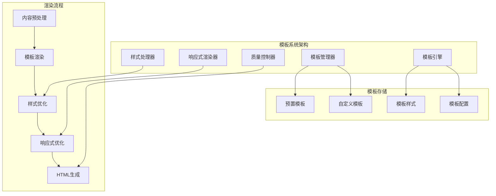

# AI驱动内容代理系统 - 模板系统文档

## 🎨 模板系统概览

### 系统架构

模板系统是AI驱动内容代理的核心组件之一，负责将AI生成的内容转换为美观、响应式的HTML页面。系统采用模块化设计，支持多种预置模板和自定义扩展。



## 📋 预置模板详解

### 1. 简约现代模板 (modern-minimal)

#### 设计特点
- **设计风格**: 极简主义，注重内容可读性
- **色彩方案**: 黑白灰为主，蓝色点缀
- **字体选择**: 系统字体栈，优秀的跨平台兼容性
- **布局特点**: 单栏布局，宽松的行间距

#### 技术规格
```css
/* 核心样式变量 */
:root {
  --primary-color: #2563eb;
  --text-color: #1f2937;
  --bg-color: #ffffff;
  --border-color: #e5e7eb;
  --font-family: -apple-system, BlinkMacSystemFont, 'Segoe UI', Roboto, sans-serif;
  --max-width: 800px;
  --line-height: 1.7;
}

/* 响应式断点 */
@media (max-width: 768px) {
  .container {
    padding: 1rem;
    font-size: 16px;
  }
}
```

#### 适用场景
- 技术博客文章
- 产品文档
- 学术论文
- 新闻报道

### 2. 商务专业模板 (business-professional)

#### 设计特点
- **设计风格**: 正式商务风格，体现专业性
- **色彩方案**: 深蓝色主色调，金色点缀
- **字体选择**: 衬线字体，增强正式感
- **布局特点**: 结构化布局，清晰的层次

#### 技术规格
```css
:root {
  --primary-color: #1e40af;
  --secondary-color: #f59e0b;
  --text-color: #374151;
  --bg-color: #f9fafb;
  --font-family: Georgia, 'Times New Roman', serif;
  --max-width: 900px;
  --section-spacing: 2.5rem;
}

/* 商务元素样式 */
.business-header {
  background: linear-gradient(135deg, var(--primary-color), #3b82f6);
  color: white;
  padding: 2rem;
  text-align: center;
}
```

#### 适用场景
- 企业报告
- 商业计划书
- 市场分析
- 投资建议书

### 3. 创意艺术模板 (creative-artistic)

#### 设计特点
- **设计风格**: 创意十足，视觉冲击力强
- **色彩方案**: 渐变色彩，丰富的视觉层次
- **字体选择**: 现代无衬线字体，支持多种字重
- **布局特点**: 非对称布局，动态视觉效果

#### 技术规格
```css
:root {
  --primary-gradient: linear-gradient(45deg, #ff6b6b, #4ecdc4);
  --secondary-gradient: linear-gradient(135deg, #667eea, #764ba2);
  --text-color: #2d3748;
  --font-family: 'Inter', -apple-system, sans-serif;
  --border-radius: 12px;
  --shadow: 0 10px 25px rgba(0,0,0,0.1);
}

/* 创意元素 */
.creative-card {
  background: var(--primary-gradient);
  border-radius: var(--border-radius);
  box-shadow: var(--shadow);
  transform: translateY(0);
  transition: transform 0.3s ease;
}
```

#### 适用场景
- 设计作品展示
- 创意文案
- 艺术评论
- 品牌故事

### 4. 学术研究模板 (academic-research)

#### 设计特点
- **设计风格**: 严谨学术风格，注重信息密度
- **色彩方案**: 保守色彩，突出内容
- **字体选择**: 易读性优先，支持数学公式
- **布局特点**: 双栏布局，丰富的引用样式

#### 技术规格
```css
:root {
  --primary-color: #1a365d;
  --accent-color: #2b6cb0;
  --text-color: #2d3748;
  --bg-color: #ffffff;
  --font-family: 'Crimson Text', Georgia, serif;
  --code-font: 'Fira Code', 'Courier New', monospace;
  --column-gap: 2rem;
}

/* 学术元素 */
.citation {
  border-left: 3px solid var(--accent-color);
  padding-left: 1rem;
  font-style: italic;
  margin: 1.5rem 0;
}

.footnote {
  font-size: 0.875rem;
  color: #718096;
  border-top: 1px solid #e2e8f0;
  padding-top: 1rem;
  margin-top: 2rem;
}
```

#### 适用场景
- 学术论文
- 研究报告
- 文献综述
- 技术白皮书

### 5. 新闻媒体模板 (news-media)

#### 设计特点
- **设计风格**: 新闻媒体风格，信息传达高效
- **色彩方案**: 经典黑白红配色
- **字体选择**: 新闻字体，快速阅读优化
- **布局特点**: 多栏布局，信息层次清晰

#### 技术规格
```css
:root {
  --primary-color: #dc2626;
  --text-color: #111827;
  --secondary-text: #6b7280;
  --bg-color: #ffffff;
  --font-family: 'Roboto', Arial, sans-serif;
  --headline-font: 'Roboto Slab', serif;
  --column-count: 2;
}

/* 新闻元素 */
.news-headline {
  font-family: var(--headline-font);
  font-weight: 700;
  font-size: 2.25rem;
  line-height: 1.2;
  margin-bottom: 0.5rem;
}

.news-byline {
  color: var(--secondary-text);
  font-size: 0.875rem;
  margin-bottom: 1.5rem;
}
```

#### 适用场景
- 新闻报道
- 时事评论
- 媒体发布
- 公告通知

### 6. 社交媒体模板 (social-media)

#### 设计特点
- **设计风格**: 现代社交媒体风格，视觉友好
- **色彩方案**: 明亮活泼，符合社交媒体审美
- **字体选择**: 现代字体，移动端优化
- **布局特点**: 卡片式布局，适合分享

#### 技术规格
```css
:root {
  --primary-color: #8b5cf6;
  --secondary-color: #06b6d4;
  --accent-color: #f59e0b;
  --text-color: #1f2937;
  --bg-color: #f8fafc;
  --font-family: 'Inter', system-ui, sans-serif;
  --card-radius: 16px;
  --card-shadow: 0 4px 6px -1px rgba(0, 0, 0, 0.1);
}

/* 社交媒体元素 */
.social-card {
  background: white;
  border-radius: var(--card-radius);
  box-shadow: var(--card-shadow);
  padding: 1.5rem;
  margin-bottom: 1rem;
}

.social-meta {
  display: flex;
  align-items: center;
  gap: 0.75rem;
  margin-bottom: 1rem;
}
```

#### 适用场景
- 社交媒体内容
- 营销文案
- 产品介绍
- 活动宣传

## 🔧 模板引擎技术实现

### 核心渲染引擎

```javascript
class TemplateEngine {
  constructor(config = {}) {
    this.templates = new Map();
    this.cache = new Map();
    this.config = {
      cacheEnabled: true,
      cacheTTL: 3600000, // 1小时
      minifyHTML: true,
      optimizeCSS: true,
      ...config
    };
  }
  
  // 注册模板
  registerTemplate(id, template) {
    this.templates.set(id, {
      ...template,
      compiledTemplate: this.compileTemplate(template.html),
      optimizedCSS: this.optimizeCSS(template.css)
    });
  }
  
  // 渲染模板
  async render(templateId, data, options = {}) {
    const cacheKey = this.generateCacheKey(templateId, data, options);
    
    // 检查缓存
    if (this.config.cacheEnabled && this.cache.has(cacheKey)) {
      const cached = this.cache.get(cacheKey);
      if (Date.now() - cached.timestamp < this.config.cacheTTL) {
        return cached.result;
      }
    }
    
    const template = this.templates.get(templateId);
    if (!template) {
      throw new Error(`Template '${templateId}' not found`);
    }
    
    // 渲染过程
    const result = await this.performRender(template, data, options);
    
    // 缓存结果
    if (this.config.cacheEnabled) {
      this.cache.set(cacheKey, {
        result,
        timestamp: Date.now()
      });
    }
    
    return result;
  }
  
  // 执行渲染
  async performRender(template, data, options) {
    // 1. 预处理数据
    const processedData = await this.preprocessData(data, options);
    
    // 2. 渲染HTML
    const html = template.compiledTemplate(processedData);
    
    // 3. 处理CSS
    const css = this.processCSSVariables(template.optimizedCSS, processedData);
    
    // 4. 响应式优化
    const responsiveHTML = this.applyResponsiveOptimizations(html, options);
    
    // 5. 最终优化
    const optimizedHTML = this.config.minifyHTML 
      ? this.minifyHTML(responsiveHTML) 
      : responsiveHTML;
    
    return {
      html: optimizedHTML,
      css: css,
      metadata: {
        templateId: template.id,
        renderTime: Date.now(),
        dataHash: this.hashData(processedData)
      }
    };
  }
}
```

### 数据预处理器

```javascript
class DataPreprocessor {
  static async preprocess(data, options = {}) {
    const processors = [
      this.sanitizeContent,
      this.extractMetadata,
      this.processMarkdown,
      this.optimizeImages,
      this.generateTOC,
      this.addSEOData
    ];
    
    let processedData = { ...data };
    
    for (const processor of processors) {
      processedData = await processor(processedData, options);
    }
    
    return processedData;
  }
  
  // 内容清理
  static sanitizeContent(data, options) {
    if (data.content) {
      data.content = DOMPurify.sanitize(data.content, {
        ALLOWED_TAGS: ['p', 'br', 'strong', 'em', 'u', 'h1', 'h2', 'h3', 'h4', 'h5', 'h6', 'ul', 'ol', 'li', 'blockquote', 'code', 'pre'],
        ALLOWED_ATTR: ['class', 'id']
      });
    }
    return data;
  }
  
  // 提取元数据
  static extractMetadata(data, options) {
    const metadata = {
      wordCount: data.content ? data.content.split(/\s+/).length : 0,
      readingTime: Math.ceil((data.content?.split(/\s+/).length || 0) / 200),
      headings: this.extractHeadings(data.content),
      images: this.extractImages(data.content),
      links: this.extractLinks(data.content)
    };
    
    return { ...data, metadata };
  }
  
  // Markdown处理
  static processMarkdown(data, options) {
    if (data.content && options.markdown) {
      const renderer = new marked.Renderer();
      
      // 自定义渲染器
      renderer.heading = (text, level) => {
        const id = text.toLowerCase().replace(/[^\w]+/g, '-');
        return `<h${level} id="${id}" class="heading-${level}">${text}</h${level}>`;
      };
      
      renderer.code = (code, language) => {
        return `<pre class="code-block"><code class="language-${language}">${code}</code></pre>`;
      };
      
      data.content = marked(data.content, { renderer });
    }
    
    return data;
  }
}
```

### 响应式优化器

```javascript
class ResponsiveOptimizer {
  static optimize(html, css, options = {}) {
    const breakpoints = {
      mobile: '(max-width: 767px)',
      tablet: '(min-width: 768px) and (max-width: 1023px)',
      desktop: '(min-width: 1024px)'
    };
    
    // 1. 图片响应式处理
    html = this.optimizeImages(html, options);
    
    // 2. 字体大小调整
    css = this.adjustFontSizes(css, breakpoints);
    
    // 3. 布局优化
    css = this.optimizeLayout(css, breakpoints);
    
    // 4. 交互元素优化
    html = this.optimizeInteractiveElements(html, options);
    
    return { html, css };
  }
  
  static optimizeImages(html, options) {
    return html.replace(/]+)>/g, (match, attrs) => {
      // 添加响应式属性
      if (!attrs.includes('loading=')) {
        attrs += ' loading="lazy"';
      }
      
      if (!attrs.includes('style=') && !attrs.includes('class=')) {
        attrs += ' style="max-width: 100%; height: auto;"';
      }
      
      return ``;
    });
  }
  
  static adjustFontSizes(css, breakpoints) {
    const fontSizeRules = {
      'h1': { mobile: '1.75rem', tablet: '2rem', desktop: '2.25rem' },
      'h2': { mobile: '1.5rem', tablet: '1.75rem', desktop: '2rem' },
      'h3': { mobile: '1.25rem', tablet: '1.5rem', desktop: '1.75rem' },
      'p': { mobile: '0.875rem', tablet: '1rem', desktop: '1rem' }
    };
    
    let responsiveCSS = css;
    
    Object.entries(breakpoints).forEach(([device, query]) => {
      let mediaQuery = `@media ${query} {\n`;
      
      Object.entries(fontSizeRules).forEach(([selector, sizes]) => {
        if (sizes[device]) {
          mediaQuery += `  ${selector} { font-size: ${sizes[device]}; }\n`;
        }
      });
      
      mediaQuery += '}\n';
      responsiveCSS += mediaQuery;
    });
    
    return responsiveCSS;
  }
}
```

## 🎯 模板设计最佳实践

### 1. 设计原则

#### 可访问性优先
```css
/* 确保足够的颜色对比度 */
:root {
  --text-contrast-ratio: 4.5; /* WCAG AA标准 */
}

/* 支持屏幕阅读器 */
.sr-only {
  position: absolute;
  width: 1px;
  height: 1px;
  padding: 0;
  margin: -1px;
  overflow: hidden;
  clip: rect(0, 0, 0, 0);
  white-space: nowrap;
  border: 0;
}

/* 焦点指示器 */
a:focus, button:focus {
  outline: 2px solid var(--primary-color);
  outline-offset: 2px;
}
```

#### 性能优化
```css
/* 使用CSS变量减少重复 */
:root {
  --primary-color: #2563eb;
  --font-stack: system-ui, -apple-system, sans-serif;
}

/* 优化动画性能 */
.animated-element {
  will-change: transform;
  transform: translateZ(0); /* 启用硬件加速 */
}

/* 减少重绘和回流 */
.layout-element {
  contain: layout style paint;
}
```

#### 移动端优先
```css
/* 移动端基础样式 */
.container {
  padding: 1rem;
  font-size: 16px; /* 防止iOS缩放 */
}

/* 渐进增强到桌面端 */
@media (min-width: 768px) {
  .container {
    padding: 2rem;
    max-width: 800px;
    margin: 0 auto;
  }
}
```

### 2. 内容适配策略

#### 动态内容处理
```javascript
class ContentAdapter {
  static adaptContent(content, template, platform) {
    const adapters = {
      'wechat': this.adaptForWeChat,
      'web': this.adaptForWeb,
      'mobile': this.adaptForMobile
    };
    
    const adapter = adapters[platform] || adapters['web'];
    return adapter(content, template);
  }
  
  // 微信公众号适配
  static adaptForWeChat(content, template) {
    return {
      ...content,
      // 移除不支持的HTML标签
      content: content.content.replace(/<(script|iframe|object|embed)[^>]*>.*?<\/\1>/gi, ''),
      // 调整图片大小
      content: content.content.replace(/]+)>/g, (match, attrs) => {
        return ``;
      }),
      // 添加微信特定样式
      styles: template.css + this.getWeChatSpecificStyles()
    };
  }
  
  // Web平台适配
  static adaptForWeb(content, template) {
    return {
      ...content,
      // 添加SEO元数据
      meta: {
        ...content.meta,
        description: this.generateDescription(content.content),
        keywords: this.extractKeywords(content.content)
      },
      // 添加结构化数据
      structuredData: this.generateStructuredData(content)
    };
  }
}
```

#### 多语言支持
```javascript
class I18nTemplateEngine {
  constructor() {
    this.translations = new Map();
    this.rtlLanguages = ['ar', 'he', 'fa', 'ur'];
  }
  
  // 加载翻译
  loadTranslations(locale, translations) {
    this.translations.set(locale, translations);
  }
  
  // 渲染多语言模板
  renderI18n(templateId, data, locale = 'en') {
    const template = this.getTemplate(templateId);
    const translations = this.translations.get(locale) || {};
    
    // 处理RTL语言
    const isRTL = this.rtlLanguages.includes(locale.split('-')[0]);
    if (isRTL) {
      template.css += this.getRTLStyles();
    }
    
    // 替换翻译文本
    const localizedData = this.localizeData(data, translations);
    
    return this.render(template, localizedData, { locale, isRTL });
  }
  
  getRTLStyles() {
    return `
      body { direction: rtl; }
      .text-align-left { text-align: right; }
      .text-align-right { text-align: left; }
      .margin-left { margin-right: var(--value); margin-left: 0; }
      .margin-right { margin-left: var(--value); margin-right: 0; }
    `;
  }
}
```

### 3. 质量控制

#### 自动化测试
```javascript
// 模板质量测试套件
class TemplateQualityTester {
  static async runTests(templateId, testData) {
    const tests = [
      this.testAccessibility,
      this.testPerformance,
      this.testResponsiveness,
      this.testCrossBrowser,
      this.testSEO
    ];
    
    const results = [];
    
    for (const test of tests) {
      try {
        const result = await test(templateId, testData);
        results.push({ test: test.name, ...result });
      } catch (error) {
        results.push({ test: test.name, passed: false, error: error.message });
      }
    }
    
    return {
      templateId,
      overallScore: this.calculateOverallScore(results),
      results
    };
  }
  
  // 可访问性测试
  static async testAccessibility(templateId, testData) {
    const rendered = await templateEngine.render(templateId, testData);
    const axeResults = await axe.run(rendered.html);
    
    return {
      passed: axeResults.violations.length === 0,
      score: Math.max(0, 100 - axeResults.violations.length * 10),
      violations: axeResults.violations
    };
  }
  
  // 性能测试
  static async testPerformance(templateId, testData) {
    const startTime = performance.now();
    const rendered = await templateEngine.render(templateId, testData);
    const renderTime = performance.now() - startTime;
    
    const htmlSize = new Blob([rendered.html]).size;
    const cssSize = new Blob([rendered.css]).size;
    
    return {
      passed: renderTime < 1000 && htmlSize < 100000,
      score: Math.max(0, 100 - Math.floor(renderTime / 10) - Math.floor(htmlSize / 1000)),
      metrics: {
        renderTime,
        htmlSize,
        cssSize,
        totalSize: htmlSize + cssSize
      }
    };
  }
}
```

## 📊 模板性能监控

### 关键指标

```javascript
const TEMPLATE_METRICS = {
  // 渲染性能
  renderTime: {
    target: '<1000ms',
    warning: '>500ms',
    critical: '>2000ms'
  },
  
  // 文件大小
  htmlSize: {
    target: '<50KB',
    warning: '>100KB',
    critical: '>200KB'
  },
  
  // 可访问性
  accessibilityScore: {
    target: '>95',
    warning: '<90',
    critical: '<80'
  },
  
  // 移动端性能
  mobileScore: {
    target: '>90',
    warning: '<80',
    critical: '<70'
  }
};
```

### 监控仪表板

```javascript
class TemplateMonitor {
  constructor() {
    this.metrics = new Map();
    this.alerts = [];
  }
  
  // 记录模板使用
  recordUsage(templateId, renderTime, size, userAgent) {
    const key = `${templateId}_${Date.now()}`;
    this.metrics.set(key, {
      templateId,
      renderTime,
      size,
      userAgent,
      timestamp: Date.now()
    });
    
    // 检查性能阈值
    this.checkThresholds(templateId, renderTime, size);
  }
  
  // 生成性能报告
  generateReport(templateId, timeRange = 24 * 60 * 60 * 1000) {
    const now = Date.now();
    const metrics = Array.from(this.metrics.values())
      .filter(m => m.templateId === templateId && (now - m.timestamp) < timeRange);
    
    if (metrics.length === 0) return null;
    
    const renderTimes = metrics.map(m => m.renderTime);
    const sizes = metrics.map(m => m.size);
    
    return {
      templateId,
      period: timeRange,
      usage: {
        totalRenders: metrics.length,
        avgRenderTime: renderTimes.reduce((a, b) => a + b, 0) / renderTimes.length,
        p95RenderTime: this.percentile(renderTimes, 95),
        avgSize: sizes.reduce((a, b) => a + b, 0) / sizes.length,
        maxSize: Math.max(...sizes)
      },
      devices: this.analyzeDevices(metrics),
      trends: this.analyzeTrends(metrics)
    };
  }
}
```

## 🚀 未来发展规划

### 短期目标 (1-3个月)
1. **模板扩展**
   - 新增5个行业特定模板
   - 支持自定义CSS变量
   - 增加暗色模式支持

2. **性能优化**
   - 模板预编译
   - CSS压缩优化
   - 图片自动优化

### 中期目标 (3-6个月)
1. **智能化功能**
   - AI驱动的模板推荐
   - 自动样式优化
   - 智能响应式调整

2. **开发者工具**
   - 可视化模板编辑器
   - 实时预览功能
   - 模板调试工具

### 长期目标 (6-12个月)
1. **生态建设**
   - 模板市场平台
   - 社区贡献机制
   - 第三方插件支持

2. **技术创新**
   - WebAssembly渲染引擎
   - 实时协作编辑
   - 多媒体模板支持

---

*模板系统将持续演进，为用户提供更丰富、更高质量的内容展示体验。*