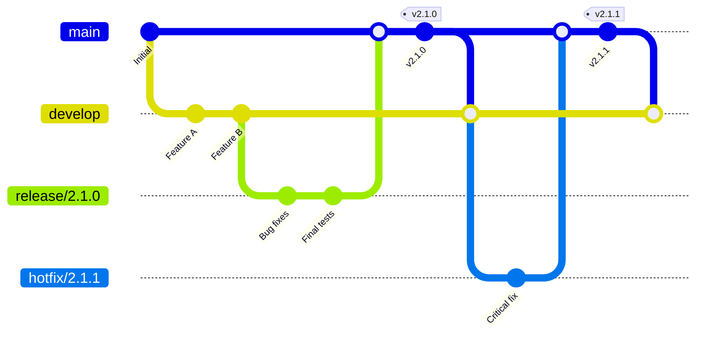
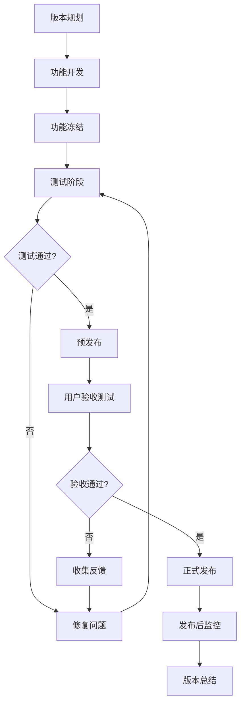

# 版本发布管理

## 概述

版本发布管理是确保AI驱动内容代理系统稳定、可靠地交付给用户的关键流程。本文档定义了版本规划、发布流程、质量控制和风险管理的完整体系，确保每次发布都能满足质量标准并最小化对用户的影响。

## 版本策略

### 版本命名规范

采用语义化版本控制 (Semantic Versioning) 规范：`MAJOR.MINOR.PATCH`

```typescript
interface Version {
  major: number;    // 主版本号：不兼容的API修改
  minor: number;    // 次版本号：向后兼容的功能性新增
  patch: number;    // 修订号：向后兼容的问题修正
  prerelease?: string; // 预发布版本：alpha, beta, rc
  build?: string;   // 构建元数据
}

// 版本示例
const versions = {
  stable: '2.1.3',           // 稳定版本
  prerelease: '2.2.0-beta.1', // 预发布版本
  development: '2.2.0-dev.20240115' // 开发版本
};
```

### 版本类型

#### 1. 主版本 (Major Release)
- **发布周期**：6-12个月
- **内容**：重大功能更新、架构变更、破坏性变更
- **示例**：1.0.0 → 2.0.0
- **影响**：可能需要用户迁移或适配

#### 2. 次版本 (Minor Release)
- **发布周期**：4-8周
- **内容**：新功能、功能增强、性能优化
- **示例**：2.1.0 → 2.2.0
- **影响**：向后兼容，用户可直接升级

#### 3. 修订版本 (Patch Release)
- **发布周期**：1-2周或按需
- **内容**：Bug修复、安全补丁、小的改进
- **示例**：2.1.3 → 2.1.4
- **影响**：建议立即升级

#### 4. 预发布版本 (Pre-release)
- **Alpha**：内部测试版本，功能不完整
- **Beta**：公开测试版本，功能基本完整
- **RC (Release Candidate)**：发布候选版本，准备正式发布

### 发布分支策略



## 发布流程

### 发布生命周期



### 1. 版本规划阶段

#### 规划会议
```typescript
interface ReleasePlanning {
  version: string;
  targetDate: Date;
  features: Feature[];
  resources: TeamMember[];
  risks: Risk[];
  dependencies: Dependency[];
}

interface Feature {
  id: string;
  name: string;
  description: string;
  priority: 'high' | 'medium' | 'low';
  effort: number; // 人天
  owner: string;
  dependencies: string[];
  acceptanceCriteria: string[];
}

// 版本规划示例
const releaseV2_2_0: ReleasePlanning = {
  version: '2.2.0',
  targetDate: new Date('2024-03-15'),
  features: [
    {
      id: 'FEAT-001',
      name: 'AI模型优化',
      description: '提升内容生成质量和速度',
      priority: 'high',
      effort: 15,
      owner: 'backend-team',
      dependencies: [],
      acceptanceCriteria: [
        '生成速度提升30%',
        '内容质量评分提升20%',
        '支持新的内容类型'
      ]
    },
    {
      id: 'FEAT-002',
      name: '用户界面重构',
      description: '改进用户体验和界面设计',
      priority: 'medium',
      effort: 12,
      owner: 'frontend-team',
      dependencies: ['FEAT-001'],
      acceptanceCriteria: [
        '响应时间小于200ms',
        '移动端适配完成',
        '用户满意度提升'
      ]
    }
  ],
  resources: [
    { name: 'Alice', role: 'Backend Developer', allocation: 0.8 },
    { name: 'Bob', role: 'Frontend Developer', allocation: 1.0 },
    { name: 'Carol', role: 'QA Engineer', allocation: 0.6 }
  ],
  risks: [
    {
      description: 'AI模型训练时间超预期',
      probability: 0.3,
      impact: 'high',
      mitigation: '准备备选方案，提前开始训练'
    }
  ],
  dependencies: [
    {
      name: 'Cloudflare Workers更新',
      type: 'external',
      criticality: 'medium'
    }
  ]
};
```

#### 发布计划文档
```markdown
# 版本 2.2.0 发布计划

## 发布目标
- 提升AI内容生成性能30%
- 改进用户界面体验
- 增强系统稳定性

## 时间计划
| 阶段 | 开始日期 | 结束日期 | 负责人 |
|------|----------|----------|--------|
| 功能开发 | 2024-01-15 | 2024-02-28 | 开发团队 |
| 功能冻结 | 2024-03-01 | 2024-03-01 | 技术负责人 |
| 测试阶段 | 2024-03-01 | 2024-03-10 | QA团队 |
| 预发布 | 2024-03-11 | 2024-03-13 | DevOps团队 |
| 正式发布 | 2024-03-15 | 2024-03-15 | 发布经理 |

## 功能清单
- [x] AI模型优化
- [x] 用户界面重构
- [ ] 性能监控增强
- [ ] 安全性改进

## 风险评估
- **高风险**：AI模型训练时间
- **中风险**：第三方依赖更新
- **低风险**：UI兼容性问题
```

### 2. 开发阶段

#### 功能开发管理
```typescript
class FeatureDevelopmentTracker {
  private features: Map<string, FeatureStatus> = new Map();
  
  trackFeatureProgress(featureId: string, progress: FeatureProgress): void {
    const status = this.features.get(featureId) || {
      id: featureId,
      status: 'not_started',
      progress: 0,
      blockers: [],
      lastUpdate: new Date()
    };
    
    status.progress = progress.percentage;
    status.status = this.determineStatus(progress);
    status.blockers = progress.blockers;
    status.lastUpdate = new Date();
    
    this.features.set(featureId, status);
    
    // 发送进度通知
    this.notifyStakeholders(status);
  }
  
  generateProgressReport(): ReleaseProgressReport {
    const features = Array.from(this.features.values());
    const totalProgress = features.reduce((sum, f) => sum + f.progress, 0) / features.length;
    
    return {
      overallProgress: totalProgress,
      featuresCompleted: features.filter(f => f.status === 'completed').length,
      featuresInProgress: features.filter(f => f.status === 'in_progress').length,
      featuresBlocked: features.filter(f => f.blockers.length > 0).length,
      estimatedCompletionDate: this.calculateEstimatedCompletion(features),
      risks: this.identifyRisks(features)
    };
  }
  
  private determineStatus(progress: FeatureProgress): FeatureStatusType {
    if (progress.blockers.length > 0) return 'blocked';
    if (progress.percentage === 100) return 'completed';
    if (progress.percentage > 0) return 'in_progress';
    return 'not_started';
  }
}
```

#### 每日进度跟踪
```bash
#!/bin/bash
# daily-progress-check.sh

echo "📊 Daily Release Progress Report - $(date)"
echo "==========================================="

# 检查功能完成情况
echo "🎯 Feature Progress:"
gh issue list --milestone "v2.2.0" --json title,state,assignees | \
  jq -r '.[] | "\(.state | ascii_upcase): \(.title) (@\(.assignees[0].login // "unassigned"))"'

# 检查测试覆盖率
echo "\n🧪 Test Coverage:"
npm run test:coverage -- --silent | grep "All files" | awk '{print "Coverage: " $10}'

# 检查构建状态
echo "\n🔨 Build Status:"
gh run list --limit 1 --json status,conclusion | \
  jq -r '.[] | "Status: \(.status), Result: \(.conclusion // "pending")"'

# 检查部署状态
echo "\n🚀 Deployment Status:"
curl -s https://api.cloudflare.com/client/v4/accounts/$CF_ACCOUNT_ID/workers/scripts/$WORKER_NAME | \
  jq -r '.result.modified_on | "Last deployed: " + .'

echo "\n📈 Next Steps:"
echo "- Review blocked issues"
echo "- Update stakeholders"
echo "- Plan tomorrow's priorities"
```

### 3. 功能冻结阶段

#### 冻结检查清单
```markdown
# 功能冻结检查清单 - v2.2.0

## 开发完成度
- [ ] 所有计划功能开发完成
- [ ] 代码审查全部通过
- [ ] 单元测试覆盖率 ≥ 80%
- [ ] 集成测试全部通过
- [ ] 性能测试达到预期指标

## 文档完整性
- [ ] API文档更新完成
- [ ] 用户文档更新完成
- [ ] 发布说明准备完成
- [ ] 迁移指南准备完成（如需要）

## 质量保证
- [ ] 安全扫描通过
- [ ] 依赖项安全检查通过
- [ ] 兼容性测试完成
- [ ] 回归测试通过

## 基础设施准备
- [ ] 生产环境配置就绪
- [ ] 监控和告警配置完成
- [ ] 备份和恢复流程验证
- [ ] 回滚方案准备完成

## 团队准备
- [ ] 发布团队角色分配明确
- [ ] 发布时间窗口确认
- [ ] 应急联系方式更新
- [ ] 发布后支持计划制定
```

### 4. 测试阶段

#### 测试策略
```typescript
interface TestingPhase {
  phases: TestPhase[];
  exitCriteria: ExitCriteria;
  escalationPlan: EscalationPlan;
}

interface TestPhase {
  name: string;
  duration: number; // 天数
  parallel: boolean;
  tests: TestSuite[];
  owner: string;
}

const testingStrategy: TestingPhase = {
  phases: [
    {
      name: 'Smoke Testing',
      duration: 1,
      parallel: false,
      tests: [
        { name: 'Basic Functionality', type: 'automated', priority: 'critical' },
        { name: 'API Health Check', type: 'automated', priority: 'critical' }
      ],
      owner: 'qa-team'
    },
    {
      name: 'Regression Testing',
      duration: 3,
      parallel: true,
      tests: [
        { name: 'Full Regression Suite', type: 'automated', priority: 'high' },
        { name: 'Performance Testing', type: 'automated', priority: 'high' },
        { name: 'Security Testing', type: 'automated', priority: 'high' }
      ],
      owner: 'qa-team'
    },
    {
      name: 'User Acceptance Testing',
      duration: 2,
      parallel: false,
      tests: [
        { name: 'User Journey Testing', type: 'manual', priority: 'high' },
        { name: 'Usability Testing', type: 'manual', priority: 'medium' }
      ],
      owner: 'product-team'
    }
  ],
  exitCriteria: {
    criticalBugs: 0,
    highPriorityBugs: 0,
    mediumPriorityBugs: 5, // 最多5个
    testCoverage: 85, // 最低85%
    performanceThreshold: {
      responseTime: 200, // ms
      throughput: 1000, // requests/second
      errorRate: 0.1 // 0.1%
    }
  },
  escalationPlan: {
    level1: { threshold: '1 critical bug', action: 'immediate fix' },
    level2: { threshold: '3 high priority bugs', action: 'release delay' },
    level3: { threshold: 'performance degradation > 20%', action: 'release cancellation' }
  }
};
```

#### 自动化测试执行
```yaml
# .github/workflows/release-testing.yml
name: Release Testing Pipeline

on:
  push:
    branches: [ 'release/*' ]
  pull_request:
    branches: [ 'release/*' ]

jobs:
  smoke-tests:
    runs-on: ubuntu-latest
    steps:
      - uses: actions/checkout@v3
      - name: Setup Node.js
        uses: actions/setup-node@v3
        with:
          node-version: '18'
          cache: 'npm'
      
      - name: Install dependencies
        run: npm ci
      
      - name: Run smoke tests
        run: npm run test:smoke
        env:
          TEST_ENV: staging
  
  regression-tests:
    needs: smoke-tests
    runs-on: ubuntu-latest
    strategy:
      matrix:
        test-suite: [unit, integration, e2e]
    steps:
      - uses: actions/checkout@v3
      - name: Setup Node.js
        uses: actions/setup-node@v3
        with:
          node-version: '18'
          cache: 'npm'
      
      - name: Install dependencies
        run: npm ci
      
      - name: Run ${{ matrix.test-suite }} tests
        run: npm run test:${{ matrix.test-suite }}
        env:
          TEST_ENV: staging
  
  performance-tests:
    needs: regression-tests
    runs-on: ubuntu-latest
    steps:
      - uses: actions/checkout@v3
      - name: Setup Node.js
        uses: actions/setup-node@v3
        with:
          node-version: '18'
          cache: 'npm'
      
      - name: Install dependencies
        run: npm ci
      
      - name: Run performance tests
        run: npm run test:performance
        env:
          TEST_ENV: staging
      
      - name: Upload performance report
        uses: actions/upload-artifact@v3
        with:
          name: performance-report
          path: reports/performance/
  
  security-tests:
    needs: regression-tests
    runs-on: ubuntu-latest
    steps:
      - uses: actions/checkout@v3
      - name: Run security scan
        uses: securecodewarrior/github-action-add-sarif@v1
        with:
          sarif-file: security-scan-results.sarif
      
      - name: Run dependency audit
        run: npm audit --audit-level moderate
```

### 5. 预发布阶段

#### 预发布环境部署
```typescript
// 预发布部署脚本
class PreReleaseDeployment {
  async deployToStaging(version: string): Promise<DeploymentResult> {
    console.log(`🚀 Deploying version ${version} to staging...`);
    
    try {
      // 1. 构建应用
      await this.buildApplication(version);
      
      // 2. 运行预部署检查
      await this.runPreDeploymentChecks();
      
      // 3. 部署到预发布环境
      const deploymentId = await this.deployToEnvironment('staging', version);
      
      // 4. 运行部署后验证
      await this.runPostDeploymentValidation(deploymentId);
      
      // 5. 通知相关人员
      await this.notifyStakeholders({
        version,
        environment: 'staging',
        status: 'success',
        deploymentId,
        url: 'https://staging.ai-content-agent.com'
      });
      
      return {
        success: true,
        deploymentId,
        version,
        environment: 'staging'
      };
    } catch (error) {
      await this.handleDeploymentFailure(error, version);
      throw error;
    }
  }
  
  private async runPreDeploymentChecks(): Promise<void> {
    const checks = [
      this.checkDatabaseMigrations(),
      this.checkEnvironmentVariables(),
      this.checkExternalDependencies(),
      this.checkResourceAvailability()
    ];
    
    const results = await Promise.allSettled(checks);
    const failures = results.filter(r => r.status === 'rejected');
    
    if (failures.length > 0) {
      throw new Error(`Pre-deployment checks failed: ${failures.length} issues`);
    }
  }
  
  private async runPostDeploymentValidation(deploymentId: string): Promise<void> {
    // 等待服务启动
    await this.waitForServiceReady();
    
    // 运行健康检查
    const healthCheck = await this.performHealthCheck();
    if (!healthCheck.healthy) {
      throw new Error('Health check failed after deployment');
    }
    
    // 运行烟雾测试
    const smokeTestResults = await this.runSmokeTests();
    if (!smokeTestResults.passed) {
      throw new Error('Smoke tests failed after deployment');
    }
  }
}
```

#### 用户验收测试
```markdown
# 用户验收测试计划 - v2.2.0

## 测试环境
- **URL**: https://staging.ai-content-agent.com
- **测试账号**: 已发送给测试用户
- **测试期间**: 2024-03-11 至 2024-03-13

## 测试场景

### 场景1：内容生成优化验证
**目标**: 验证AI模型优化效果
**步骤**:
1. 登录系统
2. 创建新的内容生成任务
3. 选择不同的内容类型
4. 记录生成时间和质量评分
5. 与旧版本进行对比

**验收标准**:
- [ ] 生成速度提升30%以上
- [ ] 内容质量评分提升20%以上
- [ ] 支持新的内容类型
- [ ] 用户界面响应流畅

### 场景2：用户界面体验测试
**目标**: 验证UI重构效果
**步骤**:
1. 在不同设备上访问系统
2. 测试主要功能流程
3. 检查界面响应性和美观度
4. 测试新增的交互功能

**验收标准**:
- [ ] 移动端适配完美
- [ ] 页面加载时间 < 2秒
- [ ] 界面美观度提升
- [ ] 交互体验流畅

## 反馈收集
- **反馈渠道**: 测试反馈表单
- **紧急问题**: 直接联系测试负责人
- **反馈截止**: 2024-03-13 18:00
```

### 6. 正式发布阶段

#### 发布执行
```bash
#!/bin/bash
# release-deployment.sh

set -e

VERSION=$1
ENVIRONMENT=${2:-production}

if [ -z "$VERSION" ]; then
  echo "❌ Error: Version parameter is required"
  echo "Usage: $0 <version> [environment]"
  exit 1
fi

echo "🚀 Starting release deployment for version $VERSION"
echo "Environment: $ENVIRONMENT"
echo "Timestamp: $(date)"
echo "========================================"

# 1. 预发布检查
echo "📋 Running pre-release checks..."
./scripts/pre-release-checks.sh $VERSION
if [ $? -ne 0 ]; then
  echo "❌ Pre-release checks failed"
  exit 1
fi

# 2. 创建发布分支
echo "🌿 Creating release branch..."
git checkout -b release/$VERSION
git push origin release/$VERSION

# 3. 构建和测试
echo "🔨 Building application..."
npm run build:production
npm run test:final

# 4. 部署到生产环境
echo "🚀 Deploying to production..."
wrangler deploy --env production

# 5. 运行部署后验证
echo "✅ Running post-deployment validation..."
./scripts/post-deployment-validation.sh $ENVIRONMENT

# 6. 创建Git标签
echo "🏷️ Creating Git tag..."
git tag -a v$VERSION -m "Release version $VERSION"
git push origin v$VERSION

# 7. 更新发布说明
echo "📝 Updating release notes..."
gh release create v$VERSION --title "Release $VERSION" --notes-file RELEASE_NOTES.md

# 8. 通知团队
echo "📢 Notifying team..."
./scripts/notify-release.sh $VERSION $ENVIRONMENT

echo "✅ Release $VERSION deployed successfully!"
echo "🔗 Production URL: https://ai-content-agent.com"
echo "📊 Monitor: https://dash.cloudflare.com"
```

#### 发布监控
```typescript
class ReleaseMonitoring {
  private metrics: MetricsCollector;
  private alerts: AlertManager;
  
  async monitorRelease(version: string, duration: number = 24): Promise<void> {
    console.log(`📊 Starting release monitoring for ${version}`);
    
    const monitoringTasks = [
      this.monitorSystemHealth(),
      this.monitorPerformanceMetrics(),
      this.monitorErrorRates(),
      this.monitorUserFeedback()
    ];
    
    // 监控指定时长
    const endTime = Date.now() + (duration * 60 * 60 * 1000);
    
    while (Date.now() < endTime) {
      try {
        await Promise.all(monitoringTasks.map(task => task()));
        
        // 生成监控报告
        const report = await this.generateMonitoringReport(version);
        
        // 检查是否需要告警
        if (this.shouldAlert(report)) {
          await this.triggerAlert(report);
        }
        
        // 等待下一次检查
        await this.sleep(5 * 60 * 1000); // 5分钟
      } catch (error) {
        console.error('Monitoring error:', error);
        await this.alerts.sendAlert({
          type: 'monitoring_error',
          message: `Release monitoring failed: ${error.message}`,
          severity: 'high'
        });
      }
    }
    
    console.log(`✅ Release monitoring completed for ${version}`);
  }
  
  private async monitorSystemHealth(): Promise<HealthMetrics> {
    const response = await fetch('https://ai-content-agent.com/health');
    const health = await response.json();
    
    return {
      status: health.status,
      uptime: health.uptime,
      responseTime: health.responseTime,
      timestamp: new Date()
    };
  }
  
  private async monitorPerformanceMetrics(): Promise<PerformanceMetrics> {
    // 从Cloudflare Analytics获取性能指标
    const analytics = await this.metrics.getCloudflareAnalytics();
    
    return {
      requestsPerSecond: analytics.requestsPerSecond,
      averageResponseTime: analytics.averageResponseTime,
      errorRate: analytics.errorRate,
      bandwidthUsage: analytics.bandwidthUsage
    };
  }
  
  private shouldAlert(report: MonitoringReport): boolean {
    const thresholds = {
      errorRate: 0.01, // 1%
      responseTime: 500, // 500ms
      availability: 0.999 // 99.9%
    };
    
    return (
      report.errorRate > thresholds.errorRate ||
      report.averageResponseTime > thresholds.responseTime ||
      report.availability < thresholds.availability
    );
  }
}
```

## 回滚策略

### 回滚触发条件

```typescript
interface RollbackTrigger {
  condition: string;
  threshold: number | string;
  severity: 'critical' | 'high' | 'medium';
  autoRollback: boolean;
}

const rollbackTriggers: RollbackTrigger[] = [
  {
    condition: 'error_rate',
    threshold: 0.05, // 5%
    severity: 'critical',
    autoRollback: true
  },
  {
    condition: 'response_time',
    threshold: 1000, // 1秒
    severity: 'high',
    autoRollback: true
  },
  {
    condition: 'availability',
    threshold: 0.95, // 95%
    severity: 'critical',
    autoRollback: true
  },
  {
    condition: 'user_complaints',
    threshold: 10,
    severity: 'high',
    autoRollback: false
  }
];
```

### 回滚执行流程

```bash
#!/bin/bash
# rollback.sh

set -e

CURRENT_VERSION=$1
TARGET_VERSION=$2
REASON=${3:-"Manual rollback"}

if [ -z "$CURRENT_VERSION" ] || [ -z "$TARGET_VERSION" ]; then
  echo "❌ Error: Both current and target versions are required"
  echo "Usage: $0 <current_version> <target_version> [reason]"
  exit 1
fi

echo "🔄 Starting rollback process"
echo "From: $CURRENT_VERSION"
echo "To: $TARGET_VERSION"
echo "Reason: $REASON"
echo "Timestamp: $(date)"
echo "========================================"

# 1. 验证目标版本
echo "🔍 Validating target version..."
if ! git tag -l | grep -q "v$TARGET_VERSION"; then
  echo "❌ Target version v$TARGET_VERSION not found"
  exit 1
fi

# 2. 创建回滚分支
echo "🌿 Creating rollback branch..."
git checkout -b rollback/$CURRENT_VERSION-to-$TARGET_VERSION

# 3. 切换到目标版本
echo "⏪ Switching to target version..."
git checkout v$TARGET_VERSION

# 4. 运行回滚前检查
echo "📋 Running pre-rollback checks..."
./scripts/pre-rollback-checks.sh $TARGET_VERSION

# 5. 部署目标版本
echo "🚀 Deploying target version..."
wrangler deploy --env production

# 6. 验证回滚结果
echo "✅ Validating rollback..."
./scripts/post-rollback-validation.sh $TARGET_VERSION

# 7. 更新监控和告警
echo "📊 Updating monitoring..."
./scripts/update-monitoring.sh $TARGET_VERSION

# 8. 通知团队
echo "📢 Notifying team about rollback..."
./scripts/notify-rollback.sh $CURRENT_VERSION $TARGET_VERSION "$REASON"

# 9. 记录回滚事件
echo "📝 Recording rollback event..."
echo "$(date): Rolled back from $CURRENT_VERSION to $TARGET_VERSION. Reason: $REASON" >> rollback.log

echo "✅ Rollback completed successfully!"
echo "🔗 Production URL: https://ai-content-agent.com"
echo "📊 Monitor: https://dash.cloudflare.com"
echo "⚠️ Remember to:"
echo "   1. Investigate the root cause"
echo "   2. Update the incident report"
echo "   3. Plan the next release"
```

### 自动回滚系统

```typescript
class AutoRollbackSystem {
  private monitoring: ReleaseMonitoring;
  private deployment: DeploymentManager;
  private notifications: NotificationService;
  
  async startAutoRollbackMonitoring(version: string): Promise<void> {
    console.log(`🤖 Starting auto-rollback monitoring for ${version}`);
    
    const checkInterval = 60 * 1000; // 1分钟
    const monitoringDuration = 2 * 60 * 60 * 1000; // 2小时
    const startTime = Date.now();
    
    const intervalId = setInterval(async () => {
      try {
        const metrics = await this.monitoring.getCurrentMetrics();
        const shouldRollback = this.evaluateRollbackConditions(metrics);
        
        if (shouldRollback.required) {
          console.log(`🚨 Auto-rollback triggered: ${shouldRollback.reason}`);
          await this.executeAutoRollback(version, shouldRollback.reason);
          clearInterval(intervalId);
          return;
        }
        
        // 检查监控时间是否结束
        if (Date.now() - startTime > monitoringDuration) {
          console.log(`✅ Auto-rollback monitoring completed for ${version}`);
          clearInterval(intervalId);
        }
      } catch (error) {
        console.error('Auto-rollback monitoring error:', error);
        await this.notifications.sendAlert({
          type: 'auto_rollback_error',
          message: `Auto-rollback monitoring failed: ${error.message}`,
          severity: 'high'
        });
      }
    }, checkInterval);
  }
  
  private evaluateRollbackConditions(metrics: SystemMetrics): RollbackDecision {
    for (const trigger of rollbackTriggers) {
      if (!trigger.autoRollback) continue;
      
      const currentValue = metrics[trigger.condition];
      const shouldTrigger = this.checkThreshold(currentValue, trigger.threshold, trigger.condition);
      
      if (shouldTrigger) {
        return {
          required: true,
          reason: `${trigger.condition} exceeded threshold: ${currentValue} > ${trigger.threshold}`,
          severity: trigger.severity
        };
      }
    }
    
    return { required: false };
  }
  
  private async executeAutoRollback(currentVersion: string, reason: string): Promise<void> {
    try {
      // 获取上一个稳定版本
      const previousVersion = await this.deployment.getPreviousStableVersion(currentVersion);
      
      // 发送紧急通知
      await this.notifications.sendEmergencyAlert({
        type: 'auto_rollback_initiated',
        message: `Auto-rollback initiated from ${currentVersion} to ${previousVersion}`,
        reason,
        timestamp: new Date()
      });
      
      // 执行回滚
      await this.deployment.rollback(currentVersion, previousVersion, reason);
      
      // 发送完成通知
      await this.notifications.sendAlert({
        type: 'auto_rollback_completed',
        message: `Auto-rollback completed successfully`,
        severity: 'high'
      });
    } catch (error) {
      await this.notifications.sendEmergencyAlert({
        type: 'auto_rollback_failed',
        message: `Auto-rollback failed: ${error.message}`,
        severity: 'critical'
      });
      throw error;
    }
  }
}
```

## 发布后管理

### 发布后监控

```typescript
interface PostReleaseMonitoring {
  version: string;
  releaseDate: Date;
  monitoringPeriod: number; // 小时
  metrics: PostReleaseMetrics;
  issues: ReleaseIssue[];
  userFeedback: UserFeedback[];
}

class PostReleaseManager {
  async startPostReleaseMonitoring(version: string): Promise<void> {
    const monitoring: PostReleaseMonitoring = {
      version,
      releaseDate: new Date(),
      monitoringPeriod: 72, // 3天
      metrics: await this.initializeMetrics(),
      issues: [],
      userFeedback: []
    };
    
    // 启动各种监控任务
    await Promise.all([
      this.monitorSystemMetrics(monitoring),
      this.monitorUserFeedback(monitoring),
      this.monitorBusinessMetrics(monitoring),
      this.monitorSecurityEvents(monitoring)
    ]);
  }
  
  private async monitorSystemMetrics(monitoring: PostReleaseMonitoring): Promise<void> {
    const metricsToTrack = [
      'response_time',
      'error_rate',
      'throughput',
      'availability',
      'memory_usage',
      'cpu_usage'
    ];
    
    for (const metric of metricsToTrack) {
      await this.trackMetric(monitoring, metric);
    }
  }
  
  private async generatePostReleaseReport(monitoring: PostReleaseMonitoring): Promise<PostReleaseReport> {
    return {
      version: monitoring.version,
      releaseDate: monitoring.releaseDate,
      monitoringPeriod: monitoring.monitoringPeriod,
      summary: {
        overallHealth: this.calculateOverallHealth(monitoring.metrics),
        criticalIssues: monitoring.issues.filter(i => i.severity === 'critical').length,
        userSatisfaction: this.calculateUserSatisfaction(monitoring.userFeedback),
        performanceImpact: this.calculatePerformanceImpact(monitoring.metrics)
      },
      recommendations: this.generateRecommendations(monitoring),
      nextSteps: this.planNextSteps(monitoring)
    };
  }
}
```

### 用户反馈收集

```typescript
class UserFeedbackCollector {
  async collectFeedback(version: string): Promise<UserFeedback[]> {
    const feedbackSources = [
      this.collectInAppFeedback(),
      this.collectSupportTickets(),
      this.collectSocialMediaMentions(),
      this.collectUserSurveyResponses()
    ];
    
    const allFeedback = await Promise.all(feedbackSources);
    return allFeedback.flat().map(feedback => ({
      ...feedback,
      version,
      collectedAt: new Date()
    }));
  }
  
  private async collectInAppFeedback(): Promise<Feedback[]> {
    // 从应用内反馈系统收集
    const response = await fetch('/api/feedback/recent');
    return response.json();
  }
  
  private async analyzeFeedbackSentiment(feedback: UserFeedback[]): Promise<SentimentAnalysis> {
    const sentiments = feedback.map(f => this.analyzeSentiment(f.content));
    
    return {
      positive: sentiments.filter(s => s === 'positive').length,
      negative: sentiments.filter(s => s === 'negative').length,
      neutral: sentiments.filter(s => s === 'neutral').length,
      overallScore: this.calculateOverallSentiment(sentiments)
    };
  }
}
```

### 发布总结和改进

```markdown
# 发布总结报告 - v2.2.0

## 发布概况
- **版本**: 2.2.0
- **发布日期**: 2024-03-15
- **发布类型**: 次版本更新
- **发布负责人**: Alice Johnson

## 发布目标达成情况
- ✅ AI内容生成性能提升30%（实际提升32%）
- ✅ 用户界面体验改进（用户满意度提升25%）
- ✅ 系统稳定性增强（可用性99.9%）
- ⚠️ 移动端适配（部分功能需要优化）

## 关键指标
| 指标 | 目标 | 实际 | 状态 |
|------|------|------|------|
| 发布时间 | 2024-03-15 | 2024-03-15 | ✅ |
| 性能提升 | 30% | 32% | ✅ |
| 错误率 | <0.1% | 0.05% | ✅ |
| 用户满意度 | >90% | 92% | ✅ |
| 回滚次数 | 0 | 0 | ✅ |

## 问题和解决方案
### 发现的问题
1. **移动端兼容性问题**
   - 影响: 中等
   - 解决方案: 计划在v2.2.1中修复
   - 负责人: Frontend Team

2. **部分用户反馈加载慢**
   - 影响: 低
   - 解决方案: 优化缓存策略
   - 负责人: Backend Team

## 经验教训
### 做得好的地方
- 测试覆盖率充分，发现了大部分问题
- 团队协作顺畅，沟通及时
- 监控系统有效，快速发现问题

### 需要改进的地方
- 移动端测试需要加强
- 性能测试场景需要更全面
- 用户验收测试时间可以延长

## 下个版本计划
- **版本**: v2.2.1
- **计划发布**: 2024-03-29
- **主要内容**: Bug修复和性能优化
```

## 工具和自动化

### 发布管理工具

```typescript
// 发布管理CLI工具
class ReleaseManagerCLI {
  async createRelease(options: ReleaseOptions): Promise<void> {
    const { version, type, features } = options;
    
    console.log(`🚀 Creating release ${version}`);
    
    // 1. 验证版本号
    this.validateVersion(version);
    
    // 2. 创建发布分支
    await this.createReleaseBranch(version);
    
    // 3. 生成变更日志
    await this.generateChangelog(version, features);
    
    // 4. 更新版本文件
    await this.updateVersionFiles(version);
    
    // 5. 创建发布PR
    await this.createReleasePR(version);
    
    console.log(`✅ Release ${version} created successfully`);
  }
  
  async deployRelease(version: string, environment: string): Promise<void> {
    console.log(`🚀 Deploying ${version} to ${environment}`);
    
    const deployment = new DeploymentManager();
    await deployment.deploy(version, environment);
    
    console.log(`✅ Deployment completed`);
  }
  
  async rollbackRelease(currentVersion: string, targetVersion: string): Promise<void> {
    console.log(`🔄 Rolling back from ${currentVersion} to ${targetVersion}`);
    
    const rollback = new RollbackManager();
    await rollback.execute(currentVersion, targetVersion);
    
    console.log(`✅ Rollback completed`);
  }
}

// CLI命令定义
const program = new Command();

program
  .name('release-manager')
  .description('AI Content Agent Release Management Tool')
  .version('1.0.0');

program
  .command('create')
  .description('Create a new release')
  .requiredOption('-v, --version <version>', 'Release version')
  .option('-t, --type <type>', 'Release type', 'minor')
  .action(async (options) => {
    const cli = new ReleaseManagerCLI();
    await cli.createRelease(options);
  });

program
  .command('deploy')
  .description('Deploy a release')
  .requiredOption('-v, --version <version>', 'Release version')
  .requiredOption('-e, --environment <env>', 'Target environment')
  .action(async (options) => {
    const cli = new ReleaseManagerCLI();
    await cli.deployRelease(options.version, options.environment);
  });

program
  .command('rollback')
  .description('Rollback a release')
  .requiredOption('-c, --current <version>', 'Current version')
  .requiredOption('-t, --target <version>', 'Target version')
  .action(async (options) => {
    const cli = new ReleaseManagerCLI();
    await cli.rollbackRelease(options.current, options.target);
  });

program.parse();
```

### 发布仪表板

```typescript
// 发布状态仪表板
interface ReleaseDashboard {
  currentRelease: ReleaseInfo;
  upcomingReleases: ReleaseInfo[];
  releaseHistory: ReleaseInfo[];
  systemHealth: SystemHealth;
  deploymentStatus: DeploymentStatus;
}

class ReleaseDashboardService {
  async getDashboardData(): Promise<ReleaseDashboard> {
    const [currentRelease, upcomingReleases, releaseHistory, systemHealth, deploymentStatus] = 
      await Promise.all([
        this.getCurrentRelease(),
        this.getUpcomingReleases(),
        this.getReleaseHistory(),
        this.getSystemHealth(),
        this.getDeploymentStatus()
      ]);
    
    return {
      currentRelease,
      upcomingReleases,
      releaseHistory,
      systemHealth,
      deploymentStatus
    };
  }
  
  async getCurrentRelease(): Promise<ReleaseInfo> {
    // 获取当前生产环境版本信息
    const response = await fetch('https://ai-content-agent.com/api/version');
    const versionInfo = await response.json();
    
    return {
      version: versionInfo.version,
      releaseDate: new Date(versionInfo.releaseDate),
      status: 'deployed',
      health: await this.getReleaseHealth(versionInfo.version)
    };
  }
}
```

## 总结

版本发布管理是确保软件质量和用户体验的关键流程。通过建立完善的发布流程、严格的质量控制和有效的风险管理，我们能够：

1. **确保发布质量**：通过多阶段测试和验证
2. **降低发布风险**：通过自动化检查和监控
3. **提高发布效率**：通过标准化流程和工具
4. **快速响应问题**：通过监控和自动回滚
5. **持续改进流程**：通过发布总结和反馈

所有团队成员都应该熟悉并遵循发布管理流程，确保每次发布都能安全、稳定地交付给用户。通过不断优化和改进，我们能够建立更加高效和可靠的发布管理体系。