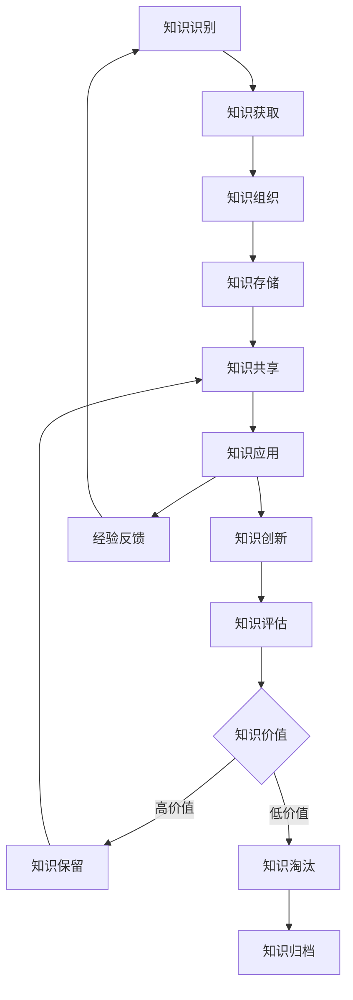

# 知识管理文档

## 概述

知识管理是AI驱动内容代理系统项目的核心竞争力之一。本文档建立了系统化的知识管理框架，包括知识的识别、获取、组织、存储、共享、应用和创新机制，旨在提升团队的学习能力、创新能力和问题解决能力。

## 知识管理框架

### 知识管理生命周期



### 知识分类体系

```typescript
interface KnowledgeCategory {
  category: string;
  subcategories: string[];
  description: string;
  examples: string[];
  accessLevel: AccessLevel;
  retentionPeriod: string;
}

enum AccessLevel {
  Public = "公开",
  Internal = "内部",
  Confidential = "机密",
  Restricted = "限制"
}

const knowledgeCategories: KnowledgeCategory[] = [
  {
    category: "技术知识",
    subcategories: [
      "架构设计",
      "编程技术",
      "工具使用",
      "最佳实践",
      "故障排除",
      "性能优化"
    ],
    description: "与技术实现、工具使用、问题解决相关的知识",
    examples: [
      "React最佳实践指南",
      "数据库优化技巧",
      "CI/CD配置模板",
      "常见错误解决方案"
    ],
    accessLevel: AccessLevel.Internal,
    retentionPeriod: "长期保留"
  },
  {
    category: "业务知识",
    subcategories: [
      "需求分析",
      "用户研究",
      "市场分析",
      "产品策略",
      "业务流程",
      "行业洞察"
    ],
    description: "与业务理解、用户需求、市场环境相关的知识",
    examples: [
      "用户画像分析报告",
      "竞品分析文档",
      "业务流程图",
      "市场趋势报告"
    ],
    accessLevel: AccessLevel.Internal,
    retentionPeriod: "中期保留"
  },
  {
    category: "项目知识",
    subcategories: [
      "项目经验",
      "团队协作",
      "风险管理",
      "质量控制",
      "沟通技巧",
      "决策记录"
    ],
    description: "与项目管理、团队协作、决策过程相关的知识",
    examples: [
      "项目复盘报告",
      "团队协作指南",
      "决策记录模板",
      "风险应对案例"
    ],
    accessLevel: AccessLevel.Internal,
    retentionPeriod: "长期保留"
  },
  {
    category: "组织知识",
    subcategories: [
      "企业文化",
      "制度流程",
      "人员信息",
      "资源配置",
      "历史沿革",
      "战略规划"
    ],
    description: "与组织结构、企业文化、制度流程相关的知识",
    examples: [
      "员工手册",
      "组织架构图",
      "工作流程文档",
      "企业发展历程"
    ],
    accessLevel: AccessLevel.Confidential,
    retentionPeriod: "永久保留"
  },
  {
    category: "外部知识",
    subcategories: [
      "行业动态",
      "技术趋势",
      "法规政策",
      "合作伙伴",
      "供应商信息",
      "客户反馈"
    ],
    description: "来自外部环境的相关知识",
    examples: [
      "行业报告",
      "技术白皮书",
      "法规更新通知",
      "客户满意度调研"
    ],
    accessLevel: AccessLevel.Public,
    retentionPeriod: "按需保留"
  }
];
```

## 知识获取与创建

### 知识获取渠道

```typescript
class KnowledgeAcquisitionSystem {
  private acquisitionChannels: AcquisitionChannel[] = [
    {
      name: "内部创造",
      type: "internal",
      sources: [
        "项目实践",
        "问题解决",
        "创新实验",
        "经验总结",
        "培训学习"
      ],
      priority: "high",
      frequency: "持续"
    },
    {
      name: "外部学习",
      type: "external",
      sources: [
        "技术会议",
        "在线课程",
        "技术博客",
        "开源项目",
        "专业书籍"
      ],
      priority: "medium",
      frequency: "定期"
    },
    {
      name: "协作交流",
      type: "collaborative",
      sources: [
        "团队分享",
        "跨部门交流",
        "外部合作",
        "社区参与",
        "专家咨询"
      ],
      priority: "high",
      frequency: "定期"
    },
    {
      name: "客户反馈",
      type: "feedback",
      sources: [
        "用户调研",
        "客户访谈",
        "支持工单",
        "产品评价",
        "使用数据"
      ],
      priority: "high",
      frequency: "持续"
    }
  ];
  
  async acquireKnowledge(channel: string, source: string): Promise<Knowledge> {
    const acquisitionMethod = this.getAcquisitionMethod(channel, source);
    const rawKnowledge = await acquisitionMethod.acquire();
    
    // 知识预处理
    const processedKnowledge = await this.preprocessKnowledge(rawKnowledge);
    
    // 知识验证
    const validatedKnowledge = await this.validateKnowledge(processedKnowledge);
    
    // 知识分类
    const categorizedKnowledge = await this.categorizeKnowledge(validatedKnowledge);
    
    return categorizedKnowledge;
  }
  
  private async preprocessKnowledge(rawKnowledge: RawKnowledge): Promise<ProcessedKnowledge> {
    return {
      id: generateId(),
      title: this.extractTitle(rawKnowledge),
      content: this.cleanContent(rawKnowledge.content),
      summary: await this.generateSummary(rawKnowledge.content),
      keywords: await this.extractKeywords(rawKnowledge.content),
      metadata: {
        source: rawKnowledge.source,
        author: rawKnowledge.author,
        createdAt: new Date(),
        format: rawKnowledge.format,
        language: this.detectLanguage(rawKnowledge.content)
      }
    };
  }
  
  private async validateKnowledge(knowledge: ProcessedKnowledge): Promise<ValidatedKnowledge> {
    const validationResults = await Promise.all([
      this.validateAccuracy(knowledge),
      this.validateRelevance(knowledge),
      this.validateCompleteness(knowledge),
      this.validateUniqueness(knowledge)
    ]);
    
    const isValid = validationResults.every(result => result.isValid);
    const validationScore = validationResults.reduce((sum, result) => sum + result.score, 0) / validationResults.length;
    
    return {
      ...knowledge,
      validation: {
        isValid,
        score: validationScore,
        results: validationResults,
        validatedAt: new Date(),
        validator: "system"
      }
    };
  }
}
```

### 知识创建工作流

```typescript
class KnowledgeCreationWorkflow {
  async createKnowledge(request: KnowledgeCreationRequest): Promise<Knowledge> {
    // 1. 需求分析
    const requirements = await this.analyzeRequirements(request);
    
    // 2. 资源准备
    const resources = await this.prepareResources(requirements);
    
    // 3. 内容创建
    const content = await this.createContent(requirements, resources);
    
    // 4. 质量审查
    const reviewedContent = await this.reviewContent(content);
    
    // 5. 格式化和标准化
    const formattedKnowledge = await this.formatKnowledge(reviewedContent);
    
    // 6. 元数据添加
    const enrichedKnowledge = await this.addMetadata(formattedKnowledge);
    
    // 7. 发布准备
    const publishableKnowledge = await this.prepareForPublication(enrichedKnowledge);
    
    return publishableKnowledge;
  }
  
  private async createContent(requirements: Requirements, resources: Resources): Promise<Content> {
    const contentTypes = {
      'documentation': () => this.createDocumentation(requirements, resources),
      'tutorial': () => this.createTutorial(requirements, resources),
      'best-practice': () => this.createBestPractice(requirements, resources),
      'troubleshooting': () => this.createTroubleshooting(requirements, resources),
      'case-study': () => this.createCaseStudy(requirements, resources)
    };
    
    const contentCreator = contentTypes[requirements.type];
    if (!contentCreator) {
      throw new Error(`Unsupported content type: ${requirements.type}`);
    }
    
    return await contentCreator();
  }
  
  private async createDocumentation(requirements: Requirements, resources: Resources): Promise<Content> {
    const template = await this.getDocumentationTemplate(requirements.subtype);
    
    const sections = [
      {
        title: "概述",
        content: await this.generateOverview(requirements, resources)
      },
      {
        title: "详细说明",
        content: await this.generateDetailedDescription(requirements, resources)
      },
      {
        title: "使用示例",
        content: await this.generateExamples(requirements, resources)
      },
      {
        title: "注意事项",
        content: await this.generateCautions(requirements, resources)
      },
      {
        title: "相关资源",
        content: await this.generateRelatedResources(requirements, resources)
      }
    ];
    
    return {
      type: 'documentation',
      template,
      sections,
      metadata: {
        createdBy: requirements.author,
        createdAt: new Date(),
        version: '1.0.0',
        status: 'draft'
      }
    };
  }
  
  private async reviewContent(content: Content): Promise<ReviewedContent> {
    const reviewers = await this.assignReviewers(content);
    const reviews: Review[] = [];
    
    for (const reviewer of reviewers) {
      const review = await this.conductReview(content, reviewer);
      reviews.push(review);
    }
    
    const consolidatedFeedback = this.consolidateReviews(reviews);
    const revisedContent = await this.reviseContent(content, consolidatedFeedback);
    
    return {
      ...revisedContent,
      reviews,
      reviewStatus: this.determineReviewStatus(reviews),
      reviewedAt: new Date()
    };
  }
}
```

## 知识组织与存储

### 知识库架构

```typescript
interface KnowledgeRepository {
  structure: RepositoryStructure;
  storage: StorageSystem;
  indexing: IndexingSystem;
  search: SearchSystem;
  versioning: VersioningSystem;
  backup: BackupSystem;
}

class KnowledgeRepositoryManager {
  private repository: KnowledgeRepository;
  
  constructor() {
    this.repository = {
      structure: this.initializeStructure(),
      storage: new DistributedStorageSystem(),
      indexing: new ElasticsearchIndexingSystem(),
      search: new IntelligentSearchSystem(),
      versioning: new GitBasedVersioningSystem(),
      backup: new CloudBackupSystem()
    };
  }
  
  private initializeStructure(): RepositoryStructure {
    return {
      collections: [
        {
          name: "技术文档",
          path: "/technical",
          categories: [
            "架构设计",
            "开发指南",
            "API文档",
            "部署运维",
            "故障排除"
          ],
          accessControl: {
            read: ["developer", "architect", "devops"],
            write: ["tech-lead", "architect"],
            admin: ["cto"]
          }
        },
        {
          name: "项目知识",
          path: "/project",
          categories: [
            "需求分析",
            "设计决策",
            "会议记录",
            "项目复盘",
            "经验教训"
          ],
          accessControl: {
            read: ["team-member"],
            write: ["project-manager", "team-lead"],
            admin: ["project-manager"]
          }
        },
        {
          name: "最佳实践",
          path: "/best-practices",
          categories: [
            "编码规范",
            "设计模式",
            "工具使用",
            "流程优化",
            "质量保证"
          ],
          accessControl: {
            read: ["all"],
            write: ["senior-developer", "architect"],
            admin: ["tech-lead"]
          }
        },
        {
          name: "学习资源",
          path: "/learning",
          categories: [
            "技术教程",
            "培训材料",
            "外部资源",
            "认证指南",
            "职业发展"
          ],
          accessControl: {
            read: ["all"],
            write: ["hr", "tech-lead"],
            admin: ["hr-manager"]
          }
        }
      ],
      metadata: {
        createdAt: new Date(),
        version: "1.0.0",
        maintainer: "knowledge-team"
      }
    };
  }
  
  async storeKnowledge(knowledge: Knowledge): Promise<StorageResult> {
    // 1. 验证知识格式
    await this.validateKnowledgeFormat(knowledge);
    
    // 2. 分配存储位置
    const storagePath = await this.determineStoragePath(knowledge);
    
    // 3. 存储知识内容
    const storageResult = await this.repository.storage.store(knowledge, storagePath);
    
    // 4. 创建索引
    await this.repository.indexing.index(knowledge, storageResult.id);
    
    // 5. 更新版本控制
    await this.repository.versioning.commit(knowledge, storageResult.id);
    
    // 6. 创建备份
    await this.repository.backup.backup(storageResult.id);
    
    // 7. 更新关联关系
    await this.updateRelationships(knowledge, storageResult.id);
    
    return storageResult;
  }
  
  private async updateRelationships(knowledge: Knowledge, id: string): Promise<void> {
    // 分析知识内容，识别相关知识
    const relatedKnowledge = await this.findRelatedKnowledge(knowledge);
    
    // 创建双向关联
    for (const related of relatedKnowledge) {
      await this.createRelationship(id, related.id, {
        type: this.determineRelationshipType(knowledge, related),
        strength: this.calculateRelationshipStrength(knowledge, related),
        createdAt: new Date()
      });
    }
    
    // 更新知识图谱
    await this.updateKnowledgeGraph(id, relatedKnowledge);
  }
}
```

### 知识标签和分类

```typescript
class KnowledgeTaggingSystem {
  private tagTaxonomy: TagTaxonomy;
  private autoTaggingEngine: AutoTaggingEngine;
  
  constructor() {
    this.tagTaxonomy = this.initializeTagTaxonomy();
    this.autoTaggingEngine = new AutoTaggingEngine();
  }
  
  async tagKnowledge(knowledge: Knowledge): Promise<TaggedKnowledge> {
    // 1. 自动标签生成
    const autoTags = await this.autoTaggingEngine.generateTags(knowledge);
    
    // 2. 手动标签验证
    const validatedTags = await this.validateTags(autoTags, knowledge);
    
    // 3. 标签标准化
    const standardizedTags = await this.standardizeTags(validatedTags);
    
    // 4. 标签层次化
    const hierarchicalTags = await this.hierarchizeTags(standardizedTags);
    
    return {
      ...knowledge,
      tags: {
        auto: autoTags,
        validated: validatedTags,
        standardized: standardizedTags,
        hierarchical: hierarchicalTags,
        taggedAt: new Date(),
        taggedBy: 'system'
      }
    };
  }
  
  private initializeTagTaxonomy(): TagTaxonomy {
    return {
      categories: [
        {
          name: "技术栈",
          tags: [
            { name: "React", aliases: ["ReactJS", "React.js"], weight: 1.0 },
            { name: "TypeScript", aliases: ["TS"], weight: 1.0 },
            { name: "Node.js", aliases: ["NodeJS", "Node"], weight: 1.0 },
            { name: "PostgreSQL", aliases: ["Postgres", "PG"], weight: 1.0 },
            { name: "Redis", aliases: [], weight: 0.8 },
            { name: "Docker", aliases: [], weight: 0.9 },
            { name: "Kubernetes", aliases: ["K8s"], weight: 0.7 }
          ]
        },
        {
          name: "开发阶段",
          tags: [
            { name: "需求分析", aliases: ["需求", "分析"], weight: 1.0 },
            { name: "设计", aliases: ["架构设计", "系统设计"], weight: 1.0 },
            { name: "开发", aliases: ["编码", "实现"], weight: 1.0 },
            { name: "测试", aliases: ["QA", "质量保证"], weight: 1.0 },
            { name: "部署", aliases: ["发布", "上线"], weight: 1.0 },
            { name: "维护", aliases: ["运维", "监控"], weight: 0.9 }
          ]
        },
        {
          name: "知识类型",
          tags: [
            { name: "教程", aliases: ["指南", "教学"], weight: 1.0 },
            { name: "文档", aliases: ["说明书", "手册"], weight: 1.0 },
            { name: "最佳实践", aliases: ["经验", "实践"], weight: 1.0 },
            { name: "故障排除", aliases: ["问题解决", "调试"], weight: 1.0 },
            { name: "案例研究", aliases: ["案例", "实例"], weight: 0.8 }
          ]
        },
        {
          name: "难度等级",
          tags: [
            { name: "初级", aliases: ["入门", "基础"], weight: 1.0 },
            { name: "中级", aliases: ["进阶"], weight: 1.0 },
            { name: "高级", aliases: ["专家", "深入"], weight: 1.0 }
          ]
        }
      ],
      relationships: [
        { parent: "React", child: "JSX", type: "contains" },
        { parent: "React", child: "Hooks", type: "contains" },
        { parent: "TypeScript", child: "类型定义", type: "contains" },
        { parent: "Node.js", child: "Express", type: "framework" },
        { parent: "测试", child: "单元测试", type: "subcategory" },
        { parent: "测试", child: "集成测试", type: "subcategory" }
      ]
    };
  }
}
```

## 知识共享与协作

### 知识共享平台

```typescript
class KnowledgeSharingPlatform {
  private sharingChannels: SharingChannel[];
  private collaborationTools: CollaborationTool[];
  private incentiveSystem: IncentiveSystem;
  
  constructor() {
    this.sharingChannels = this.initializeSharingChannels();
    this.collaborationTools = this.initializeCollaborationTools();
    this.incentiveSystem = new IncentiveSystem();
  }
  
  private initializeSharingChannels(): SharingChannel[] {
    return [
      {
        name: "技术分享会",
        type: "presentation",
        frequency: "weekly",
        duration: 60, // 分钟
        participants: ["all-developers"],
        format: "hybrid", // 线上线下结合
        topics: [
          "新技术介绍",
          "项目经验分享",
          "问题解决案例",
          "工具使用技巧"
        ],
        schedule: {
          dayOfWeek: "Friday",
          time: "15:00-16:00",
          timezone: "Asia/Shanghai"
        }
      },
      {
        name: "知识库贡献",
        type: "documentation",
        frequency: "continuous",
        participants: ["all-team-members"],
        format: "online",
        incentives: [
          "贡献积分",
          "月度表彰",
          "职业发展加分"
        ]
      },
      {
        name: "代码审查",
        type: "peer-review",
        frequency: "continuous",
        participants: ["developers"],
        format: "online",
        tools: ["GitHub", "GitLab"],
        guidelines: [
          "知识传递优先",
          "建设性反馈",
          "最佳实践推广"
        ]
      },
      {
        name: "导师制度",
        type: "mentoring",
        frequency: "ongoing",
        participants: ["senior-junior-pairs"],
        format: "one-on-one",
        activities: [
          "技能指导",
          "项目辅导",
          "职业规划",
          "知识传承"
        ]
      }
    ];
  }
  
  async facilitateKnowledgeSharing(event: SharingEvent): Promise<SharingResult> {
    // 1. 准备阶段
    const preparation = await this.prepareSharing(event);
    
    // 2. 执行阶段
    const execution = await this.executeSharing(event, preparation);
    
    // 3. 跟进阶段
    const followUp = await this.followUpSharing(event, execution);
    
    // 4. 评估阶段
    const evaluation = await this.evaluateSharing(event, followUp);
    
    return {
      event,
      preparation,
      execution,
      followUp,
      evaluation,
      completedAt: new Date()
    };
  }
  
  private async prepareSharing(event: SharingEvent): Promise<SharingPreparation> {
    return {
      materials: await this.prepareMaterials(event),
      participants: await this.inviteParticipants(event),
      logistics: await this.arrangeLogistics(event),
      agenda: await this.createAgenda(event),
      tools: await this.setupTools(event)
    };
  }
  
  private async executeSharing(event: SharingEvent, preparation: SharingPreparation): Promise<SharingExecution> {
    const session = await this.startSharingSession(event, preparation);
    
    // 记录分享过程
    const recording = await this.recordSession(session);
    
    // 收集实时反馈
    const feedback = await this.collectRealTimeFeedback(session);
    
    // 促进互动
    const interactions = await this.facilitateInteractions(session);
    
    return {
      session,
      recording,
      feedback,
      interactions,
      duration: session.endTime - session.startTime
    };
  }
  
  private async followUpSharing(event: SharingEvent, execution: SharingExecution): Promise<SharingFollowUp> {
    // 整理分享内容
    const organizedContent = await this.organizeSharedContent(execution);
    
    // 创建知识条目
    const knowledgeEntries = await this.createKnowledgeEntries(organizedContent);
    
    // 分发资料
    const distribution = await this.distributeResources(knowledgeEntries);
    
    // 安排后续行动
    const actionItems = await this.scheduleFollowUpActions(event, execution);
    
    return {
      organizedContent,
      knowledgeEntries,
      distribution,
      actionItems,
      completedAt: new Date()
    };
  }
}
```

### 协作知识创建

```typescript
class CollaborativeKnowledgeCreation {
  async createCollaborativeDocument(request: CollaborationRequest): Promise<CollaborativeDocument> {
    // 1. 初始化协作环境
    const workspace = await this.initializeWorkspace(request);
    
    // 2. 邀请协作者
    const collaborators = await this.inviteCollaborators(request.participants);
    
    // 3. 设置协作规则
    const rules = await this.establishCollaborationRules(request);
    
    // 4. 创建文档框架
    const framework = await this.createDocumentFramework(request);
    
    // 5. 启动协作流程
    const process = await this.startCollaborationProcess(workspace, collaborators, rules, framework);
    
    return {
      id: generateId(),
      workspace,
      collaborators,
      rules,
      framework,
      process,
      status: 'active',
      createdAt: new Date()
    };
  }
  
  private async establishCollaborationRules(request: CollaborationRequest): Promise<CollaborationRules> {
    return {
      editingRules: {
        simultaneousEditing: true,
        conflictResolution: 'last-writer-wins',
        lockingStrategy: 'section-level',
        versionControl: 'automatic'
      },
      reviewRules: {
        requiredReviewers: Math.min(2, request.participants.length - 1),
        reviewCriteria: [
          'accuracy',
          'completeness',
          'clarity',
          'consistency'
        ],
        approvalThreshold: 0.8
      },
      communicationRules: {
        commentingEnabled: true,
        suggestionsEnabled: true,
        realTimeChat: true,
        notificationSettings: {
          email: true,
          inApp: true,
          frequency: 'immediate'
        }
      },
      qualityRules: {
        minimumWordCount: 500,
        requiredSections: request.requiredSections || [],
        styleGuide: 'company-standard',
        citationRequired: true
      }
    };
  }
  
  async manageCollaborationProcess(documentId: string): Promise<ProcessStatus> {
    const document = await this.getCollaborativeDocument(documentId);
    
    // 监控协作进度
    const progress = await this.monitorProgress(document);
    
    // 处理冲突
    const conflicts = await this.resolveConflicts(document);
    
    // 质量检查
    const qualityCheck = await this.performQualityCheck(document);
    
    // 协调协作者
    const coordination = await this.coordinateCollaborators(document);
    
    return {
      documentId,
      progress,
      conflicts,
      qualityCheck,
      coordination,
      lastUpdated: new Date()
    };
  }
}
```

## 知识应用与创新

### 智能知识推荐

```typescript
class IntelligentKnowledgeRecommendation {
  private recommendationEngine: RecommendationEngine;
  private userProfileManager: UserProfileManager;
  private contextAnalyzer: ContextAnalyzer;
  
  constructor() {
    this.recommendationEngine = new RecommendationEngine();
    this.userProfileManager = new UserProfileManager();
    this.contextAnalyzer = new ContextAnalyzer();
  }
  
  async recommendKnowledge(userId: string, context: RecommendationContext): Promise<KnowledgeRecommendation[]> {
    // 1. 分析用户画像
    const userProfile = await this.userProfileManager.getUserProfile(userId);
    
    // 2. 分析当前上下文
    const contextAnalysis = await this.contextAnalyzer.analyze(context);
    
    // 3. 生成推荐
    const recommendations = await this.recommendationEngine.generate({
      userProfile,
      context: contextAnalysis,
      preferences: await this.getUserPreferences(userId),
      history: await this.getUserKnowledgeHistory(userId)
    });
    
    // 4. 排序和过滤
    const rankedRecommendations = await this.rankRecommendations(recommendations, userProfile);
    
    // 5. 个性化调整
    const personalizedRecommendations = await this.personalizeRecommendations(rankedRecommendations, userProfile);
    
    return personalizedRecommendations;
  }
  
  private async generateRecommendations(input: RecommendationInput): Promise<KnowledgeRecommendation[]> {
    const strategies = [
      new ContentBasedRecommendation(),
      new CollaborativeFilteringRecommendation(),
      new ContextAwareRecommendation(),
      new SemanticRecommendation(),
      new TrendBasedRecommendation()
    ];
    
    const recommendations: KnowledgeRecommendation[] = [];
    
    for (const strategy of strategies) {
      const strategyRecommendations = await strategy.recommend(input);
      recommendations.push(...strategyRecommendations);
    }
    
    // 去重和合并
    const uniqueRecommendations = this.deduplicateRecommendations(recommendations);
    
    return uniqueRecommendations;
  }
  
  private async rankRecommendations(recommendations: KnowledgeRecommendation[], userProfile: UserProfile): Promise<KnowledgeRecommendation[]> {
    const rankingFactors = {
      relevance: 0.3,
      quality: 0.25,
      recency: 0.15,
      popularity: 0.1,
      userPreference: 0.2
    };
    
    for (const recommendation of recommendations) {
      const scores = {
        relevance: await this.calculateRelevanceScore(recommendation, userProfile),
        quality: await this.calculateQualityScore(recommendation),
        recency: await this.calculateRecencyScore(recommendation),
        popularity: await this.calculatePopularityScore(recommendation),
        userPreference: await this.calculateUserPreferenceScore(recommendation, userProfile)
      };
      
      recommendation.score = Object.entries(rankingFactors).reduce(
        (total, [factor, weight]) => total + scores[factor] * weight,
        0
      );
      
      recommendation.scoreBreakdown = scores;
    }
    
    return recommendations.sort((a, b) => b.score - a.score);
  }
}
```

### 知识创新支持

```typescript
class KnowledgeInnovationSupport {
  async facilitateInnovation(innovationRequest: InnovationRequest): Promise<InnovationResult> {
    // 1. 创新需求分析
    const needsAnalysis = await this.analyzeInnovationNeeds(innovationRequest);
    
    // 2. 知识差距识别
    const knowledgeGaps = await this.identifyKnowledgeGaps(needsAnalysis);
    
    // 3. 创新资源整合
    const resources = await this.integrateInnovationResources(knowledgeGaps);
    
    // 4. 创新方案生成
    const solutions = await this.generateInnovativeSolutions(resources);
    
    // 5. 方案评估和优化
    const evaluatedSolutions = await this.evaluateAndOptimizeSolutions(solutions);
    
    // 6. 实施支持
    const implementationSupport = await this.provideImplementationSupport(evaluatedSolutions);
    
    return {
      request: innovationRequest,
      needsAnalysis,
      knowledgeGaps,
      resources,
      solutions: evaluatedSolutions,
      implementationSupport,
      createdAt: new Date()
    };
  }
  
  private async generateInnovativeSolutions(resources: InnovationResources): Promise<InnovativeSolution[]> {
    const generationMethods = [
      new BrainstormingMethod(),
      new AnalogicalReasoningMethod(),
      new CombinationalCreativityMethod(),
      new ConstraintBasedMethod(),
      new BiomimeticMethod()
    ];
    
    const solutions: InnovativeSolution[] = [];
    
    for (const method of generationMethods) {
      const methodSolutions = await method.generate(resources);
      solutions.push(...methodSolutions);
    }
    
    // 解决方案融合
    const fusedSolutions = await this.fuseSolutions(solutions);
    
    // 创新性评估
    const innovativeSolutions = await this.assessInnovativeness(fusedSolutions);
    
    return innovativeSolutions;
  }
  
  private async assessInnovativeness(solutions: InnovativeSolution[]): Promise<InnovativeSolution[]> {
    for (const solution of solutions) {
      const assessment = {
        novelty: await this.assessNovelty(solution),
        usefulness: await this.assessUsefulness(solution),
        feasibility: await this.assessFeasibility(solution),
        impact: await this.assessPotentialImpact(solution),
        creativity: await this.assessCreativity(solution)
      };
      
      solution.innovationScore = this.calculateInnovationScore(assessment);
      solution.assessment = assessment;
    }
    
    return solutions.filter(s => s.innovationScore > 0.6).sort((a, b) => b.innovationScore - a.innovationScore);
  }
}
```

## 知识质量管理

### 质量评估体系

```typescript
class KnowledgeQualityAssessment {
  private qualityMetrics: QualityMetric[];
  private assessmentCriteria: AssessmentCriteria;
  
  constructor() {
    this.qualityMetrics = this.initializeQualityMetrics();
    this.assessmentCriteria = this.initializeAssessmentCriteria();
  }
  
  async assessKnowledgeQuality(knowledge: Knowledge): Promise<QualityAssessment> {
    const assessments = await Promise.all([
      this.assessAccuracy(knowledge),
      this.assessCompleteness(knowledge),
      this.assessClarity(knowledge),
      this.assessRelevance(knowledge),
      this.assessTimeliness(knowledge),
      this.assessUsability(knowledge),
      this.assessReliability(knowledge)
    ]);
    
    const overallScore = this.calculateOverallQualityScore(assessments);
    const qualityLevel = this.determineQualityLevel(overallScore);
    const recommendations = await this.generateImprovementRecommendations(assessments);
    
    return {
      knowledgeId: knowledge.id,
      assessments,
      overallScore,
      qualityLevel,
      recommendations,
      assessedAt: new Date(),
      assessedBy: 'quality-system'
    };
  }
  
  private async assessAccuracy(knowledge: Knowledge): Promise<QualityDimension> {
    const checks = [
      await this.checkFactualAccuracy(knowledge),
      await this.checkTechnicalAccuracy(knowledge),
      await this.checkSourceCredibility(knowledge),
      await this.checkConsistency(knowledge)
    ];
    
    const score = checks.reduce((sum, check) => sum + check.score, 0) / checks.length;
    
    return {
      dimension: 'accuracy',
      score,
      checks,
      issues: checks.filter(c => c.score < 0.7).map(c => c.issue),
      recommendations: this.generateAccuracyRecommendations(checks)
    };
  }
  
  private async assessCompleteness(knowledge: Knowledge): Promise<QualityDimension> {
    const requiredElements = await this.getRequiredElements(knowledge.type);
    const presentElements = await this.identifyPresentElements(knowledge);
    
    const completenessScore = presentElements.length / requiredElements.length;
    const missingElements = requiredElements.filter(e => !presentElements.includes(e));
    
    return {
      dimension: 'completeness',
      score: completenessScore,
      details: {
        required: requiredElements,
        present: presentElements,
        missing: missingElements
      },
      recommendations: this.generateCompletenessRecommendations(missingElements)
    };
  }
  
  private async assessUsability(knowledge: Knowledge): Promise<QualityDimension> {
    const usabilityFactors = {
      readability: await this.assessReadability(knowledge),
      structure: await this.assessStructure(knowledge),
      navigation: await this.assessNavigation(knowledge),
      searchability: await this.assessSearchability(knowledge),
      accessibility: await this.assessAccessibility(knowledge)
    };
    
    const score = Object.values(usabilityFactors).reduce((sum, factor) => sum + factor.score, 0) / Object.keys(usabilityFactors).length;
    
    return {
      dimension: 'usability',
      score,
      factors: usabilityFactors,
      recommendations: this.generateUsabilityRecommendations(usabilityFactors)
    };
  }
}
```

### 持续改进机制

```typescript
class KnowledgeImprovementSystem {
  async implementContinuousImprovement(): Promise<void> {
    // 1. 定期质量审查
    await this.scheduleQualityReviews();
    
    // 2. 用户反馈收集
    await this.collectUserFeedback();
    
    // 3. 使用数据分析
    await this.analyzeUsageData();
    
    // 4. 改进计划制定
    await this.developImprovementPlans();
    
    // 5. 改进措施实施
    await this.implementImprovements();
    
    // 6. 效果评估
    await this.evaluateImprovementEffectiveness();
  }
  
  private async collectUserFeedback(): Promise<UserFeedback[]> {
    const feedbackChannels = [
      new RatingSystem(),
      new CommentSystem(),
      new SurveySystem(),
      new UsabilityTestingSystem(),
      new InterviewSystem()
    ];
    
    const feedback: UserFeedback[] = [];
    
    for (const channel of feedbackChannels) {
      const channelFeedback = await channel.collect();
      feedback.push(...channelFeedback);
    }
    
    return this.consolidateFeedback(feedback);
  }
  
  private async analyzeUsageData(): Promise<UsageAnalysis> {
    const metrics = [
      'page_views',
      'time_spent',
      'bounce_rate',
      'search_queries',
      'download_counts',
      'sharing_frequency',
      'user_paths',
      'exit_points'
    ];
    
    const analysis: UsageAnalysis = {
      metrics: new Map(),
      trends: new Map(),
      patterns: [],
      insights: []
    };
    
    for (const metric of metrics) {
      const data = await this.getMetricData(metric);
      analysis.metrics.set(metric, data);
      
      const trend = await this.analyzeTrend(data);
      analysis.trends.set(metric, trend);
    }
    
    analysis.patterns = await this.identifyUsagePatterns(analysis.metrics);
    analysis.insights = await this.generateUsageInsights(analysis);
    
    return analysis;
  }
  
  private async developImprovementPlans(): Promise<ImprovementPlan[]> {
    const issues = await this.identifyImprovementOpportunities();
    const plans: ImprovementPlan[] = [];
    
    for (const issue of issues) {
      const plan = await this.createImprovementPlan(issue);
      plans.push(plan);
    }
    
    // 优先级排序
    const prioritizedPlans = this.prioritizeImprovementPlans(plans);
    
    return prioritizedPlans;
  }
}
```

## 知识管理指标与评估

### 关键绩效指标

```typescript
interface KnowledgeManagementKPIs {
  contentMetrics: ContentMetrics;
  usageMetrics: UsageMetrics;
  qualityMetrics: QualityMetrics;
  collaborationMetrics: CollaborationMetrics;
  innovationMetrics: InnovationMetrics;
  businessImpactMetrics: BusinessImpactMetrics;
}

class KnowledgeMetricsCollector {
  async collectKPIs(): Promise<KnowledgeManagementKPIs> {
    return {
      contentMetrics: await this.collectContentMetrics(),
      usageMetrics: await this.collectUsageMetrics(),
      qualityMetrics: await this.collectQualityMetrics(),
      collaborationMetrics: await this.collectCollaborationMetrics(),
      innovationMetrics: await this.collectInnovationMetrics(),
      businessImpactMetrics: await this.collectBusinessImpactMetrics()
    };
  }
  
  private async collectContentMetrics(): Promise<ContentMetrics> {
    return {
      totalKnowledgeItems: await this.countTotalKnowledgeItems(),
      newItemsThisMonth: await this.countNewItems('month'),
      updatedItemsThisMonth: await this.countUpdatedItems('month'),
      contentGrowthRate: await this.calculateContentGrowthRate(),
      contentByCategory: await this.getContentDistributionByCategory(),
      contentByType: await this.getContentDistributionByType(),
      averageContentAge: await this.calculateAverageContentAge(),
      outdatedContentPercentage: await this.calculateOutdatedContentPercentage()
    };
  }
  
  private async collectUsageMetrics(): Promise<UsageMetrics> {
    return {
      totalViews: await this.getTotalViews(),
      uniqueUsers: await this.getUniqueUsers(),
      averageSessionDuration: await this.getAverageSessionDuration(),
      searchQueries: await this.getSearchQueries(),
      downloadCounts: await this.getDownloadCounts(),
      sharingFrequency: await this.getSharingFrequency(),
      userEngagementRate: await this.calculateUserEngagementRate(),
      contentUtilizationRate: await this.calculateContentUtilizationRate(),
      mostPopularContent: await this.getMostPopularContent(),
      leastUsedContent: await this.getLeastUsedContent()
    };
  }
  
  private async collectQualityMetrics(): Promise<QualityMetrics> {
    return {
      averageQualityScore: await this.getAverageQualityScore(),
      qualityDistribution: await this.getQualityDistribution(),
      accuracyRate: await this.getAccuracyRate(),
      completenessRate: await this.getCompletenessRate(),
      userSatisfactionScore: await this.getUserSatisfactionScore(),
      expertReviewScore: await this.getExpertReviewScore(),
      errorReportRate: await this.getErrorReportRate(),
      correctionRate: await this.getCorrectionRate()
    };
  }
  
  private async collectInnovationMetrics(): Promise<InnovationMetrics> {
    return {
      innovativeIdeasGenerated: await this.countInnovativeIdeas(),
      implementedInnovations: await this.countImplementedInnovations(),
      innovationSuccessRate: await this.calculateInnovationSuccessRate(),
      timeToImplementation: await this.getAverageTimeToImplementation(),
      innovationImpactScore: await this.getInnovationImpactScore(),
      crossFunctionalCollaborations: await this.countCrossFunctionalCollaborations(),
      knowledgeRecombinations: await this.countKnowledgeRecombinations()
    };
  }
}
```

## 总结

知识管理是AI驱动内容代理系统项目成功的重要基础设施。通过建立完善的知识管理体系，我们能够：

### 关键成果

1. **系统化知识体系**：建立完整的知识分类、存储、检索体系
2. **高效知识流转**：实现知识的快速获取、共享和应用
3. **持续知识创新**：促进知识的重组、创新和价值创造
4. **质量保证机制**：确保知识的准确性、完整性和实用性
5. **数据驱动优化**：基于使用数据持续优化知识管理流程

### 最佳实践

1. **全员参与**：知识管理是全团队的共同责任
2. **持续更新**：保持知识的时效性和准确性
3. **易于使用**：优化用户体验，降低使用门槛
4. **激励机制**：建立有效的知识贡献激励体系
5. **技术支持**：利用先进技术提升知识管理效率

### 成功指标

- 知识利用率 >= 80%
- 用户满意度 >= 4.2/5.0
- 知识质量分数 >= 4.0/5.0
- 创新想法实施率 >= 30%
- 问题解决时间缩短 >= 40%

通过有效的知识管理，我们能够构建学习型组织，提升团队的整体能力，加速项目交付，并为未来的创新发展奠定坚实基础。