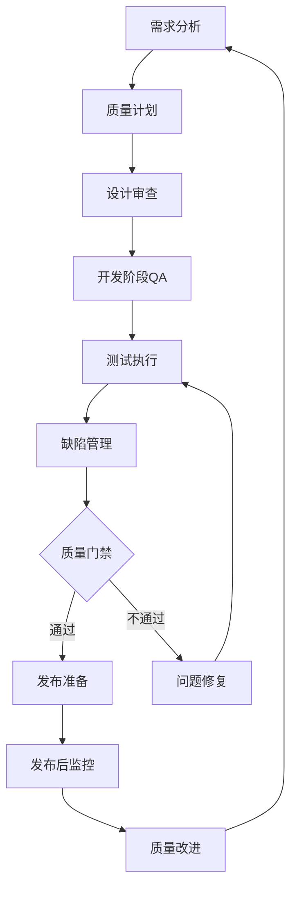
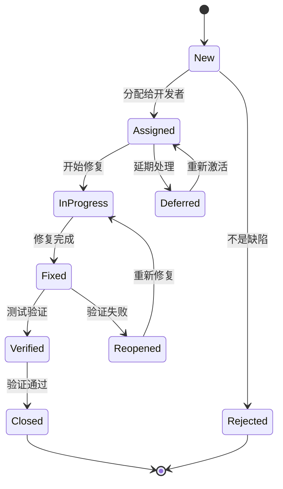

# 质量保证体系

## 概述

质量保证体系是确保AI驱动内容代理系统达到高质量标准的完整框架。本文档定义了质量标准、测试策略、代码审查流程、缺陷管理和持续改进机制，确保产品在功能性、可靠性、性能、安全性和用户体验等方面都能满足预期要求。

## 质量标准

### 功能质量标准

```typescript
interface FunctionalQualityStandards {
  correctness: CorrectnessStandard;
  completeness: CompletenessStandard;
  consistency: ConsistencyStandard;
  usability: UsabilityStandard;
}

interface CorrectnessStandard {
  // 功能正确性标准
  requirements: {
    coverage: number; // 需求覆盖率 >= 95%
    traceability: boolean; // 需求可追溯性
    validation: boolean; // 需求验证完成
  };
  
  implementation: {
    codeReview: boolean; // 代码审查通过
    unitTestCoverage: number; // 单元测试覆盖率 >= 80%
    integrationTestPass: boolean; // 集成测试通过
  };
  
  acceptance: {
    userAcceptanceTest: boolean; // 用户验收测试通过
    businessRuleValidation: boolean; // 业务规则验证
    edgeCaseHandling: boolean; // 边界情况处理
  };
}

// 质量标准配置
const qualityStandards: FunctionalQualityStandards = {
  correctness: {
    requirements: {
      coverage: 0.95,
      traceability: true,
      validation: true
    },
    implementation: {
      codeReview: true,
      unitTestCoverage: 0.80,
      integrationTestPass: true
    },
    acceptance: {
      userAcceptanceTest: true,
      businessRuleValidation: true,
      edgeCaseHandling: true
    }
  },
  completeness: {
    featureCompleteness: 1.0, // 100%功能完整性
    documentationCompleteness: 0.95, // 95%文档完整性
    testCaseCompleteness: 0.90 // 90%测试用例完整性
  },
  consistency: {
    uiConsistency: true, // UI一致性
    apiConsistency: true, // API一致性
    dataConsistency: true, // 数据一致性
    behaviorConsistency: true // 行为一致性
  },
  usability: {
    userExperienceScore: 4.0, // 用户体验评分 >= 4.0/5.0
    accessibilityCompliance: true, // 可访问性合规
    responsiveDesign: true, // 响应式设计
    performanceStandard: {
      pageLoadTime: 2000, // 页面加载时间 <= 2秒
      apiResponseTime: 500, // API响应时间 <= 500ms
      userInteractionDelay: 100 // 用户交互延迟 <= 100ms
    }
  }
};
```

### 非功能质量标准

```typescript
interface NonFunctionalQualityStandards {
  performance: PerformanceStandard;
  reliability: ReliabilityStandard;
  security: SecurityStandard;
  maintainability: MaintainabilityStandard;
  scalability: ScalabilityStandard;
}

interface PerformanceStandard {
  responseTime: {
    api: number; // API响应时间 <= 500ms
    pageLoad: number; // 页面加载时间 <= 2s
    aiGeneration: number; // AI生成时间 <= 10s
  };
  
  throughput: {
    requestsPerSecond: number; // >= 1000 RPS
    concurrentUsers: number; // >= 10000 并发用户
    dataProcessingRate: number; // 数据处理速率
  };
  
  resourceUsage: {
    cpuUtilization: number; // CPU使用率 <= 70%
    memoryUsage: number; // 内存使用率 <= 80%
    diskUsage: number; // 磁盘使用率 <= 85%
    networkBandwidth: number; // 网络带宽使用率
  };
}

interface ReliabilityStandard {
  availability: number; // 可用性 >= 99.9%
  mtbf: number; // 平均故障间隔时间 >= 720小时
  mttr: number; // 平均恢复时间 <= 4小时
  errorRate: number; // 错误率 <= 0.1%
  dataIntegrity: boolean; // 数据完整性保证
  faultTolerance: boolean; // 容错能力
}

interface SecurityStandard {
  authentication: {
    multiFactorAuth: boolean; // 多因素认证
    passwordPolicy: boolean; // 密码策略
    sessionManagement: boolean; // 会话管理
  };
  
  authorization: {
    roleBasedAccess: boolean; // 基于角色的访问控制
    principleOfLeastPrivilege: boolean; // 最小权限原则
    accessAuditTrail: boolean; // 访问审计跟踪
  };
  
  dataProtection: {
    encryptionAtRest: boolean; // 静态数据加密
    encryptionInTransit: boolean; // 传输数据加密
    dataAnonymization: boolean; // 数据匿名化
    gdprCompliance: boolean; // GDPR合规
  };
  
  vulnerabilityManagement: {
    regularSecurityScans: boolean; // 定期安全扫描
    penetrationTesting: boolean; // 渗透测试
    dependencyAudit: boolean; // 依赖项审计
    securityIncidentResponse: boolean; // 安全事件响应
  };
}
```

## 质量保证流程

### 质量保证生命周期



### 1. 需求阶段质量保证

```typescript
class RequirementsQualityAssurance {
  async reviewRequirements(requirements: Requirement[]): Promise<QualityReview> {
    const review: QualityReview = {
      reviewId: generateId(),
      reviewDate: new Date(),
      reviewType: 'requirements',
      findings: [],
      overallScore: 0,
      recommendations: []
    };
    
    // 需求完整性检查
    const completenessCheck = await this.checkCompleteness(requirements);
    if (completenessCheck.score < 0.9) {
      review.findings.push({
        type: 'completeness',
        severity: 'high',
        description: '需求完整性不足',
        details: completenessCheck.missingAreas
      });
    }
    
    // 需求一致性检查
    const consistencyCheck = await this.checkConsistency(requirements);
    if (consistencyCheck.conflicts.length > 0) {
      review.findings.push({
        type: 'consistency',
        severity: 'medium',
        description: '需求存在冲突',
        details: consistencyCheck.conflicts
      });
    }
    
    // 需求可测试性检查
    const testabilityCheck = await this.checkTestability(requirements);
    if (testabilityCheck.score < 0.8) {
      review.findings.push({
        type: 'testability',
        severity: 'medium',
        description: '需求可测试性不足',
        details: testabilityCheck.issues
      });
    }
    
    // 计算总体评分
    review.overallScore = this.calculateOverallScore([
      completenessCheck.score,
      consistencyCheck.score,
      testabilityCheck.score
    ]);
    
    // 生成改进建议
    review.recommendations = this.generateRecommendations(review.findings);
    
    return review;
  }
  
  private async checkCompleteness(requirements: Requirement[]): Promise<CompletenessCheck> {
    const requiredAreas = [
      'functional_requirements',
      'non_functional_requirements',
      'user_interface_requirements',
      'security_requirements',
      'performance_requirements',
      'integration_requirements'
    ];
    
    const coveredAreas = new Set(requirements.map(r => r.category));
    const missingAreas = requiredAreas.filter(area => !coveredAreas.has(area));
    
    return {
      score: (requiredAreas.length - missingAreas.length) / requiredAreas.length,
      missingAreas,
      totalAreas: requiredAreas.length,
      coveredAreas: coveredAreas.size
    };
  }
}
```

### 2. 设计阶段质量保证

```typescript
class DesignQualityAssurance {
  async reviewArchitecturalDesign(design: ArchitecturalDesign): Promise<DesignReview> {
    const review: DesignReview = {
      reviewId: generateId(),
      designVersion: design.version,
      reviewDate: new Date(),
      reviewers: [],
      findings: [],
      approvalStatus: 'pending'
    };
    
    // 架构原则检查
    const principlesCheck = await this.checkArchitecturalPrinciples(design);
    review.findings.push(...principlesCheck.violations);
    
    // 设计模式检查
    const patternsCheck = await this.checkDesignPatterns(design);
    review.findings.push(...patternsCheck.issues);
    
    // 可扩展性检查
    const scalabilityCheck = await this.checkScalability(design);
    review.findings.push(...scalabilityCheck.concerns);
    
    // 安全性检查
    const securityCheck = await this.checkSecurityDesign(design);
    review.findings.push(...securityCheck.vulnerabilities);
    
    // 确定审批状态
    review.approvalStatus = this.determineApprovalStatus(review.findings);
    
    return review;
  }
  
  private async checkArchitecturalPrinciples(design: ArchitecturalDesign): Promise<PrinciplesCheck> {
    const principles = [
      'single_responsibility',
      'open_closed',
      'liskov_substitution',
      'interface_segregation',
      'dependency_inversion',
      'separation_of_concerns',
      'loose_coupling',
      'high_cohesion'
    ];
    
    const violations: DesignViolation[] = [];
    
    for (const principle of principles) {
      const check = await this.checkPrinciple(design, principle);
      if (!check.compliant) {
        violations.push({
          principle,
          severity: check.severity,
          description: check.description,
          affectedComponents: check.affectedComponents,
          recommendations: check.recommendations
        });
      }
    }
    
    return {
      totalPrinciples: principles.length,
      violations,
      complianceScore: (principles.length - violations.length) / principles.length
    };
  }
}
```

### 3. 开发阶段质量保证

```typescript
class DevelopmentQualityAssurance {
  async performContinuousQA(codeChanges: CodeChange[]): Promise<ContinuousQAResult> {
    const qaResult: ContinuousQAResult = {
      timestamp: new Date(),
      codeChanges: codeChanges.length,
      checks: [],
      overallStatus: 'pending'
    };
    
    // 并行执行各种质量检查
    const checks = await Promise.allSettled([
      this.runStaticCodeAnalysis(codeChanges),
      this.runCodeStyleCheck(codeChanges),
      this.runSecurityScan(codeChanges),
      this.runDependencyAudit(codeChanges),
      this.runUnitTests(codeChanges),
      this.checkTestCoverage(codeChanges)
    ]);
    
    // 处理检查结果
    checks.forEach((check, index) => {
      if (check.status === 'fulfilled') {
        qaResult.checks.push(check.value);
      } else {
        qaResult.checks.push({
          type: this.getCheckType(index),
          status: 'failed',
          error: check.reason.message
        });
      }
    });
    
    // 确定总体状态
    qaResult.overallStatus = this.determineOverallStatus(qaResult.checks);
    
    // 如果有严重问题，阻止合并
    if (qaResult.overallStatus === 'failed') {
      await this.blockMerge(codeChanges, qaResult);
    }
    
    return qaResult;
  }
  
  private async runStaticCodeAnalysis(codeChanges: CodeChange[]): Promise<QACheck> {
    const analysis = await this.staticAnalyzer.analyze(codeChanges);
    
    return {
      type: 'static_analysis',
      status: analysis.issues.length === 0 ? 'passed' : 'failed',
      issues: analysis.issues.map(issue => ({
        severity: issue.severity,
        message: issue.message,
        file: issue.file,
        line: issue.line,
        rule: issue.rule
      })),
      metrics: {
        codeComplexity: analysis.complexity,
        maintainabilityIndex: analysis.maintainability,
        technicalDebt: analysis.technicalDebt
      }
    };
  }
  
  private async runSecurityScan(codeChanges: CodeChange[]): Promise<QACheck> {
    const scan = await this.securityScanner.scan(codeChanges);
    
    return {
      type: 'security_scan',
      status: scan.vulnerabilities.length === 0 ? 'passed' : 'failed',
      vulnerabilities: scan.vulnerabilities.map(vuln => ({
        severity: vuln.severity,
        type: vuln.type,
        description: vuln.description,
        file: vuln.file,
        line: vuln.line,
        cwe: vuln.cwe,
        recommendation: vuln.recommendation
      })),
      securityScore: scan.securityScore
    };
  }
}
```

### 4. 测试阶段质量保证

```typescript
class TestingQualityAssurance {
  async executeTestStrategy(testPlan: TestPlan): Promise<TestExecutionResult> {
    const execution: TestExecutionResult = {
      testPlanId: testPlan.id,
      startTime: new Date(),
      endTime: null,
      testSuites: [],
      overallStatus: 'running',
      metrics: {
        totalTests: 0,
        passedTests: 0,
        failedTests: 0,
        skippedTests: 0,
        testCoverage: 0
      }
    };
    
    try {
      // 按优先级执行测试套件
      for (const suite of testPlan.testSuites.sort((a, b) => a.priority - b.priority)) {
        const suiteResult = await this.executeTestSuite(suite);
        execution.testSuites.push(suiteResult);
        
        // 更新指标
        this.updateMetrics(execution.metrics, suiteResult);
        
        // 如果关键测试失败，停止执行
        if (suite.critical && suiteResult.status === 'failed') {
          execution.overallStatus = 'failed';
          break;
        }
      }
      
      // 生成测试报告
      const report = await this.generateTestReport(execution);
      
      // 评估质量门禁
      const qualityGate = await this.evaluateQualityGate(execution);
      
      execution.endTime = new Date();
      execution.overallStatus = qualityGate.passed ? 'passed' : 'failed';
      execution.qualityGate = qualityGate;
      execution.report = report;
      
    } catch (error) {
      execution.overallStatus = 'error';
      execution.error = error.message;
    }
    
    return execution;
  }
  
  private async executeTestSuite(suite: TestSuite): Promise<TestSuiteResult> {
    const result: TestSuiteResult = {
      suiteId: suite.id,
      suiteName: suite.name,
      startTime: new Date(),
      endTime: null,
      status: 'running',
      testCases: []
    };
    
    try {
      // 设置测试环境
      await this.setupTestEnvironment(suite.environment);
      
      // 执行测试用例
      for (const testCase of suite.testCases) {
        const caseResult = await this.executeTestCase(testCase);
        result.testCases.push(caseResult);
        
        // 记录测试执行日志
        await this.logTestExecution(testCase, caseResult);
      }
      
      // 清理测试环境
      await this.cleanupTestEnvironment(suite.environment);
      
      result.status = this.calculateSuiteStatus(result.testCases);
      
    } catch (error) {
      result.status = 'error';
      result.error = error.message;
    } finally {
      result.endTime = new Date();
    }
    
    return result;
  }
  
  private async evaluateQualityGate(execution: TestExecutionResult): Promise<QualityGate> {
    const gate: QualityGate = {
      criteria: [],
      passed: true,
      score: 0
    };
    
    // 测试通过率检查
    const passRate = execution.metrics.passedTests / execution.metrics.totalTests;
    gate.criteria.push({
      name: 'test_pass_rate',
      threshold: 0.95,
      actual: passRate,
      passed: passRate >= 0.95
    });
    
    // 代码覆盖率检查
    gate.criteria.push({
      name: 'code_coverage',
      threshold: 0.80,
      actual: execution.metrics.testCoverage,
      passed: execution.metrics.testCoverage >= 0.80
    });
    
    // 性能测试检查
    const performanceTests = execution.testSuites.find(s => s.suiteName === 'performance');
    if (performanceTests) {
      const performancePassed = performanceTests.status === 'passed';
      gate.criteria.push({
        name: 'performance_tests',
        threshold: 1,
        actual: performancePassed ? 1 : 0,
        passed: performancePassed
      });
    }
    
    // 安全测试检查
    const securityTests = execution.testSuites.find(s => s.suiteName === 'security');
    if (securityTests) {
      const securityPassed = securityTests.status === 'passed';
      gate.criteria.push({
        name: 'security_tests',
        threshold: 1,
        actual: securityPassed ? 1 : 0,
        passed: securityPassed
      });
    }
    
    // 计算总体通过状态
    gate.passed = gate.criteria.every(c => c.passed);
    gate.score = gate.criteria.reduce((sum, c) => sum + (c.passed ? 1 : 0), 0) / gate.criteria.length;
    
    return gate;
  }
}
```

## 缺陷管理

### 缺陷生命周期



### 缺陷管理系统

```typescript
class DefectManagementSystem {
  async createDefect(defectData: DefectCreationData): Promise<Defect> {
    // 自动分类和优先级评估
    const classification = await this.classifyDefect(defectData);
    const priority = await this.calculatePriority(defectData, classification);
    
    const defect: Defect = {
      id: generateDefectId(),
      title: defectData.title,
      description: defectData.description,
      severity: classification.severity,
      priority: priority,
      category: classification.category,
      status: 'new',
      reporter: defectData.reporter,
      assignee: null,
      createdAt: new Date(),
      updatedAt: new Date(),
      environment: defectData.environment,
      version: defectData.version,
      stepsToReproduce: defectData.stepsToReproduce,
      expectedResult: defectData.expectedResult,
      actualResult: defectData.actualResult,
      attachments: defectData.attachments || [],
      tags: classification.tags,
      relatedDefects: [],
      comments: []
    };
    
    // 保存缺陷
    await this.saveDefect(defect);
    
    // 自动分配
    await this.autoAssignDefect(defect);
    
    // 发送通知
    await this.notifyStakeholders(defect, 'created');
    
    return defect;
  }
  
  private async classifyDefect(defectData: DefectCreationData): Promise<DefectClassification> {
    // 使用机器学习模型进行自动分类
    const mlClassification = await this.mlClassifier.classify({
      title: defectData.title,
      description: defectData.description,
      stepsToReproduce: defectData.stepsToReproduce
    });
    
    // 基于关键词的规则分类
    const ruleBasedClassification = this.ruleBasedClassifier.classify(defectData);
    
    // 合并分类结果
    return {
      severity: this.determineSeverity(mlClassification, ruleBasedClassification),
      category: this.determineCategory(mlClassification, ruleBasedClassification),
      tags: [...mlClassification.tags, ...ruleBasedClassification.tags],
      confidence: Math.min(mlClassification.confidence, ruleBasedClassification.confidence)
    };
  }
  
  private async calculatePriority(defectData: DefectCreationData, classification: DefectClassification): Promise<DefectPriority> {
    const factors = {
      severity: this.getSeverityWeight(classification.severity),
      userImpact: this.calculateUserImpact(defectData),
      businessImpact: this.calculateBusinessImpact(defectData),
      frequency: this.calculateFrequency(defectData),
      fixComplexity: await this.estimateFixComplexity(defectData)
    };
    
    const priorityScore = (
      factors.severity * 0.3 +
      factors.userImpact * 0.25 +
      factors.businessImpact * 0.25 +
      factors.frequency * 0.15 +
      (1 - factors.fixComplexity) * 0.05
    );
    
    if (priorityScore >= 0.8) return 'critical';
    if (priorityScore >= 0.6) return 'high';
    if (priorityScore >= 0.4) return 'medium';
    return 'low';
  }
  
  async trackDefectMetrics(): Promise<DefectMetrics> {
    const metrics = await this.calculateDefectMetrics();
    
    return {
      totalDefects: metrics.total,
      openDefects: metrics.open,
      resolvedDefects: metrics.resolved,
      defectsByPriority: metrics.byPriority,
      defectsBySeverity: metrics.bySeverity,
      defectsByCategory: metrics.byCategory,
      averageResolutionTime: metrics.avgResolutionTime,
      defectEscapeRate: metrics.escapeRate,
      defectRemovalEfficiency: metrics.removalEfficiency,
      trends: {
        weeklyDefectCreation: metrics.weeklyCreation,
        weeklyDefectResolution: metrics.weeklyResolution,
        defectAging: metrics.aging
      }
    };
  }
}
```

### 缺陷分析和报告

```typescript
class DefectAnalytics {
  async generateDefectReport(period: DateRange): Promise<DefectReport> {
    const defects = await this.getDefectsInPeriod(period);
    
    const report: DefectReport = {
      period,
      summary: await this.generateSummary(defects),
      trends: await this.analyzeTrends(defects),
      rootCauseAnalysis: await this.performRootCauseAnalysis(defects),
      qualityMetrics: await this.calculateQualityMetrics(defects),
      recommendations: await this.generateRecommendations(defects)
    };
    
    return report;
  }
  
  private async performRootCauseAnalysis(defects: Defect[]): Promise<RootCauseAnalysis> {
    const analysis: RootCauseAnalysis = {
      categories: new Map(),
      patterns: [],
      hotspots: []
    };
    
    // 按根本原因分类
    for (const defect of defects) {
      if (defect.rootCause) {
        const category = defect.rootCause.category;
        if (!analysis.categories.has(category)) {
          analysis.categories.set(category, []);
        }
        analysis.categories.get(category)!.push(defect);
      }
    }
    
    // 识别模式
    analysis.patterns = await this.identifyDefectPatterns(defects);
    
    // 识别热点区域
    analysis.hotspots = await this.identifyDefectHotspots(defects);
    
    return analysis;
  }
  
  private async identifyDefectPatterns(defects: Defect[]): Promise<DefectPattern[]> {
    const patterns: DefectPattern[] = [];
    
    // 时间模式分析
    const timePatterns = this.analyzeTimePatterns(defects);
    patterns.push(...timePatterns);
    
    // 组件模式分析
    const componentPatterns = this.analyzeComponentPatterns(defects);
    patterns.push(...componentPatterns);
    
    // 用户行为模式分析
    const behaviorPatterns = this.analyzeBehaviorPatterns(defects);
    patterns.push(...behaviorPatterns);
    
    return patterns;
  }
}
```

## 持续改进

### 质量改进流程

```typescript
class QualityImprovementProcess {
  async initiateImprovementCycle(): Promise<ImprovementCycle> {
    const cycle: ImprovementCycle = {
      id: generateId(),
      startDate: new Date(),
      phase: 'assessment',
      objectives: [],
      initiatives: [],
      metrics: [],
      status: 'active'
    };
    
    // 1. 质量评估
    const assessment = await this.conductQualityAssessment();
    cycle.assessment = assessment;
    
    // 2. 识别改进机会
    const opportunities = await this.identifyImprovementOpportunities(assessment);
    cycle.opportunities = opportunities;
    
    // 3. 制定改进目标
    cycle.objectives = await this.defineImprovementObjectives(opportunities);
    
    // 4. 规划改进举措
    cycle.initiatives = await this.planImprovementInitiatives(cycle.objectives);
    
    // 5. 定义成功指标
    cycle.metrics = await this.defineSuccessMetrics(cycle.objectives);
    
    return cycle;
  }
  
  private async conductQualityAssessment(): Promise<QualityAssessment> {
    const assessment: QualityAssessment = {
      timestamp: new Date(),
      areas: []
    };
    
    // 评估各个质量领域
    const areas = [
      'requirements_quality',
      'design_quality',
      'code_quality',
      'test_quality',
      'process_quality',
      'product_quality'
    ];
    
    for (const area of areas) {
      const areaAssessment = await this.assessQualityArea(area);
      assessment.areas.push(areaAssessment);
    }
    
    // 计算总体质量分数
    assessment.overallScore = this.calculateOverallQualityScore(assessment.areas);
    
    return assessment;
  }
  
  private async identifyImprovementOpportunities(assessment: QualityAssessment): Promise<ImprovementOpportunity[]> {
    const opportunities: ImprovementOpportunity[] = [];
    
    // 基于评估结果识别机会
    for (const area of assessment.areas) {
      if (area.score < 0.7) { // 低于70%的领域需要改进
        opportunities.push({
          area: area.name,
          currentScore: area.score,
          targetScore: Math.min(area.score + 0.2, 1.0),
          impact: this.calculateImpact(area),
          effort: this.estimateEffort(area),
          priority: this.calculatePriority(area)
        });
      }
    }
    
    // 按优先级排序
    opportunities.sort((a, b) => b.priority - a.priority);
    
    return opportunities;
  }
  
  async trackImprovementProgress(cycleId: string): Promise<ImprovementProgress> {
    const cycle = await this.getImprovementCycle(cycleId);
    const progress: ImprovementProgress = {
      cycleId,
      overallProgress: 0,
      initiativeProgress: [],
      metricProgress: [],
      milestones: []
    };
    
    // 跟踪各项举措进度
    for (const initiative of cycle.initiatives) {
      const initiativeProgress = await this.trackInitiativeProgress(initiative);
      progress.initiativeProgress.push(initiativeProgress);
    }
    
    // 跟踪指标进度
    for (const metric of cycle.metrics) {
      const metricProgress = await this.trackMetricProgress(metric);
      progress.metricProgress.push(metricProgress);
    }
    
    // 计算总体进度
    progress.overallProgress = this.calculateOverallProgress(progress);
    
    return progress;
  }
}
```

### 质量文化建设

```typescript
class QualityCultureBuilder {
  async buildQualityCulture(): Promise<CultureInitiative[]> {
    const initiatives: CultureInitiative[] = [
      {
        name: 'Quality Champions Program',
        description: '培养质量倡导者',
        activities: [
          '选拔质量倡导者',
          '提供质量培训',
          '建立质量社区',
          '分享最佳实践'
        ],
        timeline: '6个月',
        expectedOutcome: '提升团队质量意识'
      },
      {
        name: 'Quality Metrics Dashboard',
        description: '建立质量指标仪表板',
        activities: [
          '定义关键质量指标',
          '建立数据收集机制',
          '开发可视化仪表板',
          '定期质量回顾会议'
        ],
        timeline: '3个月',
        expectedOutcome: '提高质量透明度'
      },
      {
        name: 'Continuous Learning Program',
        description: '持续学习计划',
        activities: [
          '技术培训课程',
          '质量工具培训',
          '行业最佳实践分享',
          '内部技术分享会'
        ],
        timeline: '持续进行',
        expectedOutcome: '提升团队技能水平'
      }
    ];
    
    return initiatives;
  }
  
  async measureCultureMaturity(): Promise<CultureMaturity> {
    const survey = await this.conductCultureSurvey();
    const behaviors = await this.observeQualityBehaviors();
    const practices = await this.assessQualityPractices();
    
    return {
      level: this.determineCultureLevel(survey, behaviors, practices),
      strengths: this.identifyStrengths(survey, behaviors, practices),
      improvementAreas: this.identifyImprovementAreas(survey, behaviors, practices),
      recommendations: this.generateCultureRecommendations(survey, behaviors, practices)
    };
  }
}
```

## 质量指标和监控

### 关键质量指标 (KQIs)

```typescript
interface QualityMetrics {
  // 产品质量指标
  productQuality: {
    defectDensity: number; // 缺陷密度 (缺陷数/KLOC)
    customerSatisfaction: number; // 客户满意度 (1-5分)
    systemAvailability: number; // 系统可用性 (%)
    performanceIndex: number; // 性能指数
    securityScore: number; // 安全评分
  };
  
  // 过程质量指标
  processQuality: {
    defectEscapeRate: number; // 缺陷逃逸率 (%)
    testCoverage: number; // 测试覆盖率 (%)
    codeReviewCoverage: number; // 代码审查覆盖率 (%)
    automationRate: number; // 自动化率 (%)
    cycleTime: number; // 周期时间 (天)
  };
  
  // 团队质量指标
  teamQuality: {
    skillMaturity: number; // 技能成熟度 (1-5级)
    qualityAwareness: number; // 质量意识 (1-5分)
    processAdherence: number; // 流程遵循度 (%)
    continuousImprovement: number; // 持续改进参与度 (%)
  };
}

class QualityMetricsCollector {
  async collectMetrics(): Promise<QualityMetrics> {
    const [productMetrics, processMetrics, teamMetrics] = await Promise.all([
      this.collectProductQualityMetrics(),
      this.collectProcessQualityMetrics(),
      this.collectTeamQualityMetrics()
    ]);
    
    return {
      productQuality: productMetrics,
      processQuality: processMetrics,
      teamQuality: teamMetrics
    };
  }
  
  private async collectProductQualityMetrics(): Promise<ProductQualityMetrics> {
    const defects = await this.getDefectsInPeriod(this.getCurrentPeriod());
    const codeLines = await this.getCodeLinesCount();
    const customerFeedback = await this.getCustomerFeedback();
    const systemMetrics = await this.getSystemMetrics();
    
    return {
      defectDensity: (defects.length / codeLines) * 1000,
      customerSatisfaction: this.calculateAverageRating(customerFeedback),
      systemAvailability: systemMetrics.availability,
      performanceIndex: this.calculatePerformanceIndex(systemMetrics),
      securityScore: await this.getSecurityScore()
    };
  }
  
  async generateQualityReport(): Promise<QualityReport> {
    const metrics = await this.collectMetrics();
    const trends = await this.analyzeTrends(metrics);
    const benchmarks = await this.compareToBenchmarks(metrics);
    
    return {
      reportDate: new Date(),
      metrics,
      trends,
      benchmarks,
      insights: this.generateInsights(metrics, trends, benchmarks),
      recommendations: this.generateRecommendations(metrics, trends, benchmarks)
    };
  }
}
```

### 质量监控仪表板

```typescript
class QualityDashboard {
  async createDashboard(): Promise<DashboardConfig> {
    return {
      title: 'AI Content Agent - Quality Dashboard',
      refreshInterval: 300, // 5分钟
      widgets: [
        {
          type: 'metric_card',
          title: '系统可用性',
          metric: 'system_availability',
          target: 99.9,
          format: 'percentage'
        },
        {
          type: 'metric_card',
          title: '缺陷密度',
          metric: 'defect_density',
          target: 2.0,
          format: 'number'
        },
        {
          type: 'chart',
          title: '缺陷趋势',
          chartType: 'line',
          metrics: ['new_defects', 'resolved_defects'],
          timeRange: '30d'
        },
        {
          type: 'chart',
          title: '测试覆盖率',
          chartType: 'gauge',
          metric: 'test_coverage',
          target: 80
        },
        {
          type: 'table',
          title: '高优先级缺陷',
          query: 'defects.priority:high AND defects.status:open',
          columns: ['id', 'title', 'assignee', 'age']
        }
      ],
      alerts: [
        {
          condition: 'system_availability < 99.5',
          severity: 'critical',
          message: '系统可用性低于阈值'
        },
        {
          condition: 'defect_density > 5.0',
          severity: 'high',
          message: '缺陷密度过高'
        }
      ]
    };
  }
}
```

## 总结

质量保证体系是确保AI驱动内容代理系统高质量交付的基础。通过建立完善的质量标准、实施全面的质量保证流程、有效的缺陷管理和持续改进机制，我们能够：

1. **确保产品质量**：通过多层次的质量检查和验证
2. **提高开发效率**：通过自动化质量检查和早期缺陷发现
3. **降低维护成本**：通过预防性质量措施
4. **提升用户满意度**：通过持续的质量改进
5. **建立质量文化**：通过团队培训和质量意识提升

所有团队成员都应该理解并践行质量保证的理念，将质量作为每个开发阶段的重要考量因素，共同构建高质量的软件产品。