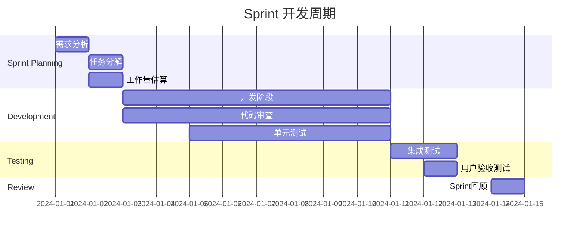
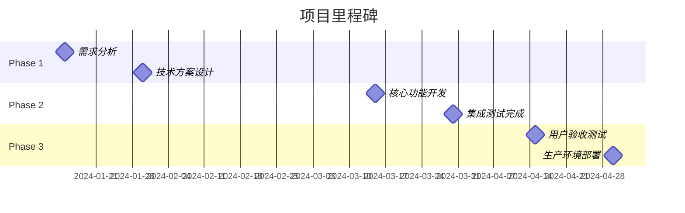
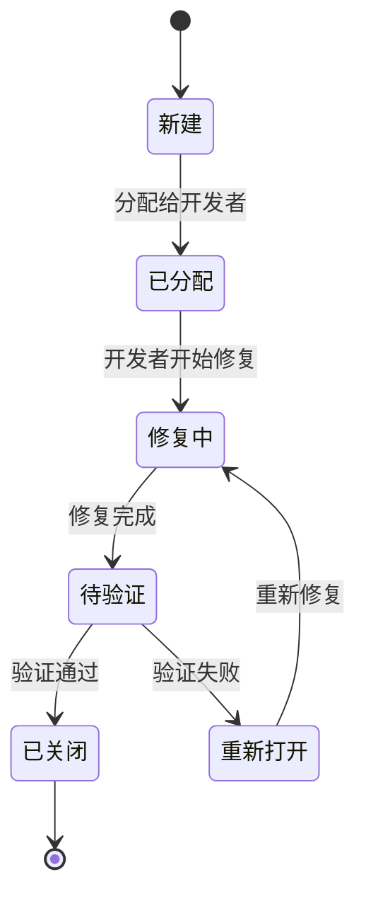

# AI驱动内容代理系统 - 项目管理文档

## 概述

本文档详细描述了AI驱动内容代理系统的项目管理流程、开发规范、团队协作方式和质量控制标准，确保项目的高效执行和成功交付。

## 项目组织结构

### 团队角色

| 角色 | 职责 | 技能要求 |
|------|------|----------|
| 项目经理 | 项目规划、进度管理、风险控制 | 项目管理、沟通协调 |
| 技术负责人 | 技术架构、代码审查、技术决策 | 全栈开发、架构设计 |
| 前端开发工程师 | 前端功能开发、UI实现 | React、TypeScript、CSS |
| 后端开发工程师 | 后端API开发、数据库设计 | Node.js、Cloudflare Workers |
| AI工程师 | AI模型集成、算法优化 | 机器学习、NLP、API集成 |
| 测试工程师 | 测试用例设计、自动化测试 | 测试框架、自动化工具 |
| DevOps工程师 | CI/CD、部署、监控 | Docker、云服务、监控工具 |
| UI/UX设计师 | 界面设计、用户体验优化 | 设计工具、用户研究 |

### 组织架构图

```
项目经理
├── 技术负责人
│   ├── 前端开发团队
│   │   ├── 前端开发工程师 1
│   │   └── 前端开发工程师 2
│   ├── 后端开发团队
│   │   ├── 后端开发工程师 1
│   │   └── AI工程师
│   └── 测试团队
│       ├── 测试工程师
│       └── DevOps工程师
└── 设计团队
    └── UI/UX设计师
```

## 开发流程

### 敏捷开发流程

我们采用Scrum敏捷开发方法，以2周为一个Sprint周期。

#### Sprint规划



#### 每日站会

**时间**：每天上午9:30-9:45
**参与者**：所有开发团队成员
**内容**：
1. 昨天完成了什么
2. 今天计划做什么
3. 遇到了什么阻碍

**站会模板**：
```markdown
## 每日站会 - [日期]

### [姓名]
- **昨天完成**：
  - [ ] 任务1描述
  - [ ] 任务2描述
- **今天计划**：
  - [ ] 任务1描述
  - [ ] 任务2描述
- **遇到阻碍**：
  - 问题描述及需要的帮助
```

### Git工作流

我们采用Git Flow工作流模型：

```
main (生产分支)
├── develop (开发分支)
│   ├── feature/user-auth (功能分支)
│   ├── feature/content-editor (功能分支)
│   └── feature/ai-integration (功能分支)
├── release/v1.0.0 (发布分支)
└── hotfix/critical-bug (热修复分支)
```

#### 分支命名规范

| 分支类型 | 命名格式 | 示例 |
|----------|----------|------|
| 功能分支 | `feature/功能名称` | `feature/user-authentication` |
| 修复分支 | `bugfix/问题描述` | `bugfix/login-error` |
| 热修复分支 | `hotfix/问题描述` | `hotfix/security-patch` |
| 发布分支 | `release/版本号` | `release/v1.0.0` |

#### 提交信息规范

我们使用Conventional Commits规范：

```
<type>[optional scope]: <description>

[optional body]

[optional footer(s)]
```

**类型说明**：
- `feat`: 新功能
- `fix`: 修复bug
- `docs`: 文档更新
- `style`: 代码格式调整
- `refactor`: 代码重构
- `test`: 测试相关
- `chore`: 构建过程或辅助工具的变动

**示例**：
```
feat(auth): add user registration functionality

- Add registration form component
- Implement user validation
- Add email verification

Closes #123
```

### 代码审查流程

#### Pull Request规范

**PR标题格式**：
```
[类型] 简短描述 (#Issue号)
```

**PR描述模板**：
```markdown
## 变更描述
简要描述本次变更的内容和目的

## 变更类型
- [ ] 新功能
- [ ] Bug修复
- [ ] 文档更新
- [ ] 代码重构
- [ ] 性能优化
- [ ] 其他

## 测试
- [ ] 单元测试已通过
- [ ] 集成测试已通过
- [ ] 手动测试已完成

## 检查清单
- [ ] 代码符合项目规范
- [ ] 已添加必要的测试
- [ ] 文档已更新
- [ ] 无安全漏洞
- [ ] 性能影响已评估

## 相关Issue
Closes #[issue号]

## 截图（如适用）
[添加相关截图]
```

#### 代码审查标准

**必须检查项**：
1. **功能正确性**：代码是否实现了预期功能
2. **代码质量**：是否遵循编码规范和最佳实践
3. **安全性**：是否存在安全漏洞
4. **性能**：是否有性能问题
5. **测试覆盖**：是否有足够的测试覆盖
6. **文档**：是否有必要的注释和文档

**审查流程**：
1. 开发者创建PR
2. 自动化检查（CI/CD）
3. 至少2名团队成员审查
4. 技术负责人最终审批
5. 合并到目标分支

## 需求管理

### 需求收集

#### 需求来源
- 产品经理需求
- 用户反馈
- 技术债务
- 性能优化
- 安全加固

#### 需求文档模板

```markdown
# 需求文档 - [功能名称]

## 基本信息
- **需求ID**：REQ-001
- **优先级**：高/中/低
- **预估工作量**：X人天
- **负责人**：[姓名]
- **截止日期**：[日期]

## 需求描述
### 背景
描述需求的背景和原因

### 目标
明确需求要达到的目标

### 用户故事
作为[角色]，我希望[功能]，以便[价值]

## 功能规格
### 功能点
1. 功能点1描述
2. 功能点2描述

### 验收标准
- [ ] 标准1
- [ ] 标准2

### 非功能性需求
- 性能要求
- 安全要求
- 兼容性要求

## 技术方案
### 架构设计
描述技术实现方案

### 接口设计
定义相关API接口

### 数据库设计
描述数据模型变更

## 测试计划
### 测试用例
列出主要测试场景

### 测试环境
描述测试环境要求

## 风险评估
### 技术风险
- 风险1及应对措施
- 风险2及应对措施

### 时间风险
- 风险描述及应对措施

## 上线计划
### 发布策略
描述发布方式和步骤

### 回滚方案
描述出现问题时的回滚策略
```

### 需求优先级管理

#### 优先级矩阵

| 优先级 | 紧急程度 | 重要程度 | 处理策略 |
|--------|----------|----------|----------|
| P0 | 高 | 高 | 立即处理 |
| P1 | 高 | 中 | 优先处理 |
| P2 | 中 | 高 | 计划处理 |
| P3 | 中 | 中 | 正常处理 |
| P4 | 低 | 低 | 延后处理 |

#### 需求评估标准

**业务价值评估**：
- 用户影响范围
- 商业价值
- 战略重要性

**技术复杂度评估**：
- 开发工作量
- 技术难度
- 依赖关系

**风险评估**：
- 技术风险
- 时间风险
- 资源风险

## 项目计划与跟踪

### 里程碑规划



### 任务管理

#### 任务分解结构（WBS）

```
1. AI驱动内容代理系统
   1.1 用户认证模块
       1.1.1 用户注册功能
       1.1.2 用户登录功能
       1.1.3 密码重置功能
   1.2 内容处理模块
       1.2.1 内容重写功能
       1.2.2 AI文章生成功能
       1.2.3 内容分析功能
   1.3 模板管理模块
       1.3.1 模板创建功能
       1.3.2 模板编辑功能
       1.3.3 模板渲染功能
   1.4 系统管理模块
       1.4.1 用户管理功能
       1.4.2 系统监控功能
       1.4.3 日志管理功能
```

#### 任务跟踪表

| 任务ID | 任务名称 | 负责人 | 状态 | 开始日期 | 结束日期 | 进度 | 备注 |
|--------|----------|--------|------|----------|----------|------|------|
| T001 | 用户注册API | 张三 | 进行中 | 2024-01-01 | 2024-01-05 | 60% | 无 |
| T002 | 登录界面开发 | 李四 | 已完成 | 2024-01-02 | 2024-01-04 | 100% | 已测试 |
| T003 | 内容重写功能 | 王五 | 待开始 | 2024-01-06 | 2024-01-10 | 0% | 等待API |

### 进度监控

#### 燃尽图

```javascript
// 燃尽图数据示例
const burndownData = {
  labels: ['Day 1', 'Day 2', 'Day 3', 'Day 4', 'Day 5', 'Day 6', 'Day 7'],
  datasets: [
    {
      label: '理想燃尽线',
      data: [100, 85, 70, 55, 40, 25, 0],
      borderColor: 'blue',
      backgroundColor: 'transparent'
    },
    {
      label: '实际燃尽线',
      data: [100, 90, 75, 65, 45, 30, 10],
      borderColor: 'red',
      backgroundColor: 'transparent'
    }
  ]
};
```

#### 关键指标监控

**开发效率指标**：
- 代码提交频率
- 功能完成率
- Bug修复率
- 代码审查通过率

**质量指标**：
- 代码覆盖率
- Bug密度
- 性能指标
- 用户满意度

**团队指标**：
- 团队速度（Story Points/Sprint）
- 任务完成率
- 加班时间
- 团队满意度

## 质量管理

### 代码质量标准

#### 编码规范

**JavaScript/TypeScript规范**：
```javascript
// 好的示例
interface UserProfile {
  id: string;
  name: string;
  email: string;
  createdAt: Date;
}

class UserService {
  private readonly apiClient: ApiClient;

  constructor(apiClient: ApiClient) {
    this.apiClient = apiClient;
  }

  async getUserProfile(userId: string): Promise<UserProfile> {
    try {
      const response = await this.apiClient.get(`/users/${userId}`);
      return response.data;
    } catch (error) {
      logger.error('Failed to fetch user profile', { userId, error });
      throw new Error('Unable to fetch user profile');
    }
  }
}
```

**React组件规范**：
```tsx
// 好的示例
interface ContentEditorProps {
  initialContent?: string;
  onSave: (content: string) => void;
  isLoading?: boolean;
}

const ContentEditor: React.FC<ContentEditorProps> = ({
  initialContent = '',
  onSave,
  isLoading = false
}) => {
  const [content, setContent] = useState(initialContent);

  const handleSave = useCallback(() => {
    if (content.trim()) {
      onSave(content);
    }
  }, [content, onSave]);

  return (
    <div className="content-editor">
      <textarea
        value={content}
        onChange={(e) => setContent(e.target.value)}
        disabled={isLoading}
        data-testid="content-textarea"
      />
      <button
        onClick={handleSave}
        disabled={isLoading || !content.trim()}
        data-testid="save-button"
      >
        {isLoading ? '保存中...' : '保存'}
      </button>
    </div>
  );
};

export default ContentEditor;
```

#### 代码审查清单

**功能性检查**：
- [ ] 代码实现了需求规格中的所有功能
- [ ] 边界条件处理正确
- [ ] 错误处理完善
- [ ] 输入验证充分

**代码质量检查**：
- [ ] 代码结构清晰，逻辑合理
- [ ] 变量和函数命名有意义
- [ ] 代码复用性好，避免重复
- [ ] 注释充分且准确

**性能检查**：
- [ ] 算法效率合理
- [ ] 内存使用优化
- [ ] 数据库查询优化
- [ ] 缓存策略合理

**安全检查**：
- [ ] 输入数据验证和清理
- [ ] 权限控制正确
- [ ] 敏感信息保护
- [ ] SQL注入防护

**测试检查**：
- [ ] 单元测试覆盖充分
- [ ] 测试用例设计合理
- [ ] 集成测试通过
- [ ] 性能测试满足要求

### 缺陷管理

#### Bug生命周期



#### Bug报告模板

```markdown
# Bug报告 - [Bug标题]

## 基本信息
- **Bug ID**：BUG-001
- **严重程度**：严重/一般/轻微
- **优先级**：高/中/低
- **发现人**：[姓名]
- **发现时间**：[日期时间]
- **环境**：开发/测试/生产

## Bug描述
### 问题概述
简要描述问题

### 重现步骤
1. 步骤1
2. 步骤2
3. 步骤3

### 预期结果
描述预期的正确行为

### 实际结果
描述实际发生的错误行为

## 环境信息
- **操作系统**：
- **浏览器**：
- **版本号**：
- **设备信息**：

## 附加信息
### 错误日志
```
[粘贴相关错误日志]
```

### 截图
[添加相关截图]

### 其他说明
[其他相关信息]
```

#### Bug优先级定义

| 严重程度 | 描述 | 响应时间 | 修复时间 |
|----------|------|----------|----------|
| 严重 | 系统崩溃、数据丢失、安全漏洞 | 2小时 | 24小时 |
| 一般 | 功能异常、性能问题 | 1天 | 3天 |
| 轻微 | 界面问题、文字错误 | 3天 | 1周 |

## 风险管理

### 风险识别

#### 技术风险

| 风险 | 概率 | 影响 | 风险等级 | 应对措施 |
|------|------|------|----------|----------|
| AI API不稳定 | 中 | 高 | 高 | 实现多个AI服务商备选方案 |
| 性能瓶颈 | 中 | 中 | 中 | 提前进行性能测试和优化 |
| 第三方依赖更新 | 低 | 中 | 低 | 定期更新依赖，做好兼容性测试 |

#### 项目风险

| 风险 | 概率 | 影响 | 风险等级 | 应对措施 |
|------|------|------|----------|----------|
| 需求变更频繁 | 高 | 中 | 高 | 建立需求变更控制流程 |
| 人员流失 | 低 | 高 | 中 | 知识文档化，交叉培训 |
| 时间延期 | 中 | 高 | 高 | 合理估算工期，预留缓冲时间 |

### 风险应对策略

#### 风险监控

**每周风险评估**：
- 识别新风险
- 评估现有风险状态
- 更新应对措施
- 上报重大风险

**风险指标监控**：
- 项目进度偏差
- 质量指标异常
- 团队满意度下降
- 技术债务积累

#### 应急预案

**技术故障应急预案**：
1. 立即评估影响范围
2. 启动应急响应团队
3. 实施临时解决方案
4. 通知相关干系人
5. 制定根本解决方案
6. 总结经验教训

**人员应急预案**：
1. 评估人员缺失影响
2. 重新分配任务
3. 寻找替代人员
4. 调整项目计划
5. 加强知识传递

## 沟通管理

### 沟通计划

#### 定期会议

| 会议类型 | 频率 | 参与者 | 时长 | 目的 |
|----------|------|--------|------|------|
| 每日站会 | 每日 | 开发团队 | 15分钟 | 同步进度，识别阻碍 |
| Sprint规划会 | 每2周 | 全团队 | 2小时 | 规划Sprint任务 |
| Sprint回顾会 | 每2周 | 全团队 | 1小时 | 总结经验，改进流程 |
| 技术评审会 | 按需 | 技术团队 | 1小时 | 技术方案评审 |
| 项目周报会 | 每周 | 项目组 | 30分钟 | 项目状态汇报 |

#### 沟通渠道

**即时沟通**：
- Slack/钉钉群组
- 紧急事件处理
- 日常技术讨论

**正式沟通**：
- 邮件通知
- 项目文档
- 会议纪要

**协作工具**：
- Jira（任务管理）
- Confluence（文档协作）
- GitHub（代码协作）
- Figma（设计协作）

### 文档管理

#### 文档分类

**项目文档**：
- 项目计划
- 需求文档
- 技术方案
- 测试计划

**技术文档**：
- API文档
- 数据库设计
- 部署指南
- 运维手册

**过程文档**：
- 会议纪要
- 决策记录
- 变更日志
- 经验总结

#### 文档规范

**文档命名规范**：
```
[项目名称]_[文档类型]_[版本号]_[日期].md

示例：
AI_Content_Agent_需求文档_v1.0_20240101.md
AI_Content_Agent_API文档_v2.1_20240115.md
```

**版本控制**：
- 使用语义化版本号（Major.Minor.Patch）
- 重大变更增加Major版本
- 功能增加增加Minor版本
- 错误修复增加Patch版本

**文档审查**：
- 技术文档需要技术负责人审查
- 需求文档需要产品经理审查
- 所有文档需要项目经理最终确认

## 持续改进

### 回顾与总结

#### Sprint回顾会议

**会议结构**：
1. **回顾上个Sprint**（15分钟）
   - 完成的任务
   - 遇到的问题
   - 学到的经验

2. **识别改进点**（20分钟）
   - 做得好的地方
   - 需要改进的地方
   - 具体改进建议

3. **制定行动计划**（10分钟）
   - 确定改进措施
   - 分配责任人
   - 设定完成时间

**回顾模板**：
```markdown
# Sprint回顾 - Sprint [编号]

## 基本信息
- **Sprint周期**：[开始日期] - [结束日期]
- **参与人员**：[列出参与人员]
- **会议时间**：[日期时间]

## Sprint总结
### 完成情况
- **计划Story Points**：[数量]
- **完成Story Points**：[数量]
- **完成率**：[百分比]

### 主要成就
- [成就1]
- [成就2]

### 遇到的挑战
- [挑战1及解决方案]
- [挑战2及解决方案]

## 团队反馈
### 做得好的地方
- [反馈1]
- [反馈2]

### 需要改进的地方
- [改进点1]
- [改进点2]

## 行动计划
| 改进措施 | 负责人 | 完成时间 | 状态 |
|----------|--------|----------|------|
| [措施1] | [姓名] | [日期] | 待开始 |
| [措施2] | [姓名] | [日期] | 待开始 |

## 下个Sprint计划
- [计划1]
- [计划2]
```

### 流程优化

#### 持续改进循环

```mermaid
cycle
    title 持续改进循环
    Plan --> Do
    Do --> Check
    Check --> Act
    Act --> Plan
```

**Plan（计划）**：
- 识别改进机会
- 制定改进计划
- 设定成功指标

**Do（执行）**：
- 实施改进措施
- 收集数据
- 记录过程

**Check（检查）**：
- 分析结果
- 对比目标
- 识别偏差

**Act（行动）**：
- 标准化成功做法
- 调整失败措施
- 规划下一轮改进

#### 改进指标

**效率指标**：
- 开发速度提升
- 缺陷修复时间缩短
- 部署频率增加
- 代码审查时间减少

**质量指标**：
- 缺陷密度降低
- 代码覆盖率提高
- 用户满意度提升
- 系统稳定性增强

**团队指标**：
- 团队满意度提高
- 知识共享增加
- 技能提升
- 协作效率改善

## 工具与平台

### 项目管理工具

#### Jira配置

**项目设置**：
```json
{
  "projectKey": "ACA",
  "projectName": "AI Content Agent",
  "projectType": "Scrum",
  "issueTypes": [
    "Epic",
    "Story",
    "Task",
    "Bug",
    "Sub-task"
  ],
  "workflows": {
    "development": [
      "To Do",
      "In Progress",
      "Code Review",
      "Testing",
      "Done"
    ]
  }
}
```

**自定义字段**：
- Story Points（故事点）
- Sprint（冲刺）
- Epic Link（史诗链接）
- Labels（标签）
- Components（组件）

#### 看板配置

**开发看板**：
```
待办事项 | 进行中 | 代码审查 | 测试中 | 已完成
   📋    |   🔄   |   👀    |   🧪   |   ✅
```

**Bug跟踪看板**：
```
新建 | 已分配 | 修复中 | 待验证 | 已关闭
 🆕  |   👤   |   🔧   |   🔍   |   ✅
```

### 开发工具集成

#### CI/CD集成

**GitHub Actions配置**：
```yaml
# .github/workflows/project-automation.yml
name: Project Automation

on:
  issues:
    types: [opened, closed]
  pull_request:
    types: [opened, closed, merged]

jobs:
  update-jira:
    runs-on: ubuntu-latest
    steps:
      - name: Update Jira Issue
        uses: atlassian/gajira-transition@v2
        with:
          issue: ${{ github.event.issue.number }}
          transition: "In Progress"
        env:
          JIRA_BASE_URL: ${{ secrets.JIRA_BASE_URL }}
          JIRA_USER_EMAIL: ${{ secrets.JIRA_USER_EMAIL }}
          JIRA_API_TOKEN: ${{ secrets.JIRA_API_TOKEN }}
```

#### 通知集成

**Slack通知配置**：
```javascript
// slack-notifications.js
const { WebClient } = require('@slack/web-api');

const slack = new WebClient(process.env.SLACK_TOKEN);

class SlackNotifier {
  async notifyDeployment(environment, version, status) {
    const message = {
      channel: '#deployments',
      text: `部署通知`,
      blocks: [
        {
          type: 'section',
          text: {
            type: 'mrkdwn',
            text: `*部署状态*: ${status === 'success' ? '✅ 成功' : '❌ 失败'}\n*环境*: ${environment}\n*版本*: ${version}`
          }
        }
      ]
    };
    
    await slack.chat.postMessage(message);
  }
  
  async notifyBugReport(bugId, severity, assignee) {
    const message = {
      channel: '#bugs',
      text: `新Bug报告`,
      blocks: [
        {
          type: 'section',
          text: {
            type: 'mrkdwn',
            text: `*Bug ID*: ${bugId}\n*严重程度*: ${severity}\n*分配给*: <@${assignee}>`
          }
        },
        {
          type: 'actions',
          elements: [
            {
              type: 'button',
              text: {
                type: 'plain_text',
                text: '查看详情'
              },
              url: `https://jira.company.com/browse/${bugId}`
            }
          ]
        }
      ]
    };
    
    await slack.chat.postMessage(message);
  }
}

module.exports = SlackNotifier;
```

## 总结

本项目管理文档建立了完整的项目管理体系，涵盖了团队组织、开发流程、质量管理、风险控制等各个方面。通过规范化的流程和工具，确保项目能够高效、有序地进行，最终交付高质量的产品。

项目管理是一个持续改进的过程，需要根据项目实际情况和团队反馈不断优化和调整。通过定期的回顾和总结，团队能够不断提升协作效率和交付质量，实现项目的成功。