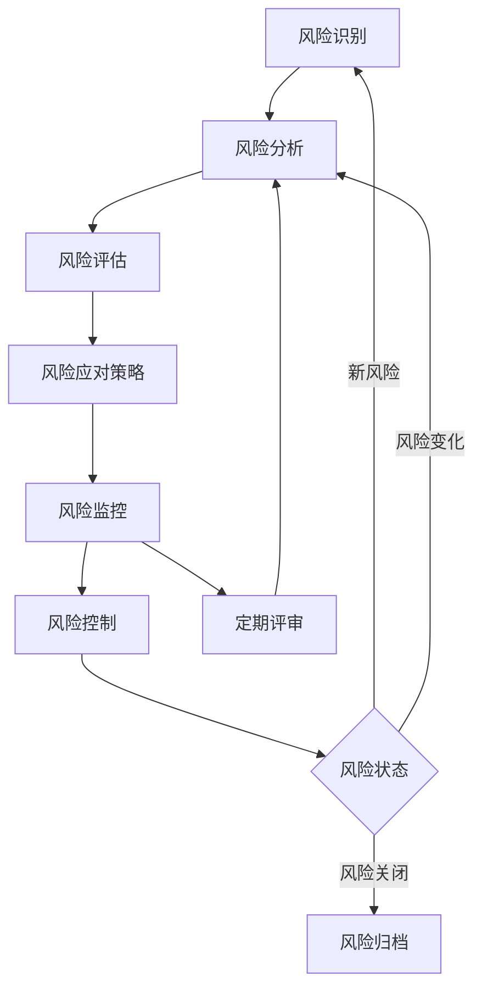

# 风险管理文档

## 概述

风险管理是AI驱动内容代理系统项目成功的关键要素。本文档建立了系统化的风险管理框架，包括风险识别、评估、应对策略制定、监控和控制机制，确保项目能够在可控的风险环境下顺利进行。

## 风险管理框架

### 风险管理流程



### 风险管理组织架构

```typescript
interface RiskManagementStructure {
  riskCommittee: {
    chair: string; // 项目经理
    members: string[]; // 技术负责人、产品经理、质量经理
    responsibilities: string[];
    meetingFrequency: string; // 每周
  };
  
  riskOwners: {
    role: string;
    responsibilities: string[];
    reportingTo: string;
  }[];
  
  riskCoordinators: {
    department: string;
    coordinator: string;
    responsibilities: string[];
  }[];
}

const riskManagementStructure: RiskManagementStructure = {
  riskCommittee: {
    chair: "项目经理",
    members: ["技术负责人", "产品经理", "质量经理", "安全专家"],
    responsibilities: [
      "制定风险管理策略",
      "审批重大风险应对方案",
      "监督风险管理执行",
      "定期评审风险状态"
    ],
    meetingFrequency: "每周"
  },
  riskOwners: [
    {
      role: "技术风险负责人",
      responsibilities: [
        "识别技术风险",
        "制定技术风险应对策略",
        "监控技术风险状态",
        "报告风险变化"
      ],
      reportingTo: "项目经理"
    },
    {
      role: "业务风险负责人",
      responsibilities: [
        "识别业务风险",
        "评估业务影响",
        "制定业务连续性计划",
        "协调业务相关风险应对"
      ],
      reportingTo: "产品经理"
    }
  ],
  riskCoordinators: [
    {
      department: "开发团队",
      coordinator: "技术负责人",
      responsibilities: ["收集开发风险", "执行技术风险应对措施"]
    },
    {
      department: "测试团队",
      coordinator: "测试经理",
      responsibilities: ["识别质量风险", "执行质量风险控制"]
    }
  ]
};
```

## 风险识别

### 风险分类体系

```typescript
interface RiskCategory {
  category: string;
  subcategories: string[];
  description: string;
  commonRisks: string[];
}

const riskCategories: RiskCategory[] = [
  {
    category: "技术风险",
    subcategories: ["架构风险", "开发风险", "集成风险", "性能风险", "安全风险"],
    description: "与技术实现、架构设计、开发过程相关的风险",
    commonRisks: [
      "技术选型不当",
      "架构设计缺陷",
      "第三方依赖风险",
      "性能瓶颈",
      "安全漏洞",
      "数据丢失",
      "系统集成失败"
    ]
  },
  {
    category: "项目管理风险",
    subcategories: ["进度风险", "资源风险", "沟通风险", "范围风险"],
    description: "与项目管理过程、资源配置、进度控制相关的风险",
    commonRisks: [
      "进度延期",
      "资源不足",
      "需求变更",
      "团队成员离职",
      "沟通不畅",
      "范围蔓延",
      "预算超支"
    ]
  },
  {
    category: "业务风险",
    subcategories: ["市场风险", "竞争风险", "合规风险", "用户风险"],
    description: "与业务目标、市场环境、用户需求相关的风险",
    commonRisks: [
      "市场需求变化",
      "竞争对手威胁",
      "法规政策变化",
      "用户接受度低",
      "商业模式不可行",
      "合作伙伴风险"
    ]
  },
  {
    category: "运营风险",
    subcategories: ["基础设施风险", "服务风险", "维护风险", "扩展风险"],
    description: "与系统运营、维护、扩展相关的风险",
    commonRisks: [
      "系统宕机",
      "服务中断",
      "数据中心故障",
      "网络攻击",
      "容量不足",
      "维护困难",
      "扩展性问题"
    ]
  },
  {
    category: "外部风险",
    subcategories: ["供应商风险", "环境风险", "政策风险", "经济风险"],
    description: "来自外部环境的不可控风险",
    commonRisks: [
      "供应商服务中断",
      "自然灾害",
      "政策法规变化",
      "经济环境恶化",
      "汇率波动",
      "地缘政治风险"
    ]
  }
];
```

### 风险识别方法

```typescript
class RiskIdentificationSystem {
  async identifyRisks(): Promise<Risk[]> {
    const risks: Risk[] = [];
    
    // 1. 专家判断法
    const expertRisks = await this.expertJudgmentMethod();
    risks.push(...expertRisks);
    
    // 2. 检查表法
    const checklistRisks = await this.checklistMethod();
    risks.push(...checklistRisks);
    
    // 3. 头脑风暴法
    const brainstormRisks = await this.brainstormingMethod();
    risks.push(...brainstormRisks);
    
    // 4. 历史数据分析
    const historicalRisks = await this.historicalAnalysisMethod();
    risks.push(...historicalRisks);
    
    // 5. SWOT分析
    const swotRisks = await this.swotAnalysisMethod();
    risks.push(...swotRisks);
    
    // 6. 根本原因分析
    const rootCauseRisks = await this.rootCauseAnalysisMethod();
    risks.push(...rootCauseRisks);
    
    // 去重和合并相似风险
    const uniqueRisks = this.deduplicateRisks(risks);
    
    return uniqueRisks;
  }
  
  private async expertJudgmentMethod(): Promise<Risk[]> {
    const experts = [
      { name: "技术架构师", expertise: ["技术风险", "架构风险"] },
      { name: "项目经理", expertise: ["项目管理风险", "资源风险"] },
      { name: "产品经理", expertise: ["业务风险", "市场风险"] },
      { name: "安全专家", expertise: ["安全风险", "合规风险"] },
      { name: "运维专家", expertise: ["运营风险", "基础设施风险"] }
    ];
    
    const risks: Risk[] = [];
    
    for (const expert of experts) {
      const expertRisks = await this.consultExpert(expert);
      risks.push(...expertRisks);
    }
    
    return risks;
  }
  
  private async checklistMethod(): Promise<Risk[]> {
    const checklist = [
      {
        category: "技术风险",
        items: [
          "是否存在未经验证的新技术？",
          "第三方依赖是否稳定可靠？",
          "系统架构是否能支持预期负载？",
          "是否有足够的安全防护措施？",
          "数据备份和恢复机制是否完善？"
        ]
      },
      {
        category: "项目管理风险",
        items: [
          "项目时间安排是否合理？",
          "团队技能是否匹配项目需求？",
          "资源配置是否充足？",
          "沟通机制是否有效？",
          "变更管理流程是否完善？"
        ]
      },
      {
        category: "业务风险",
        items: [
          "市场需求是否明确？",
          "竞争环境是否激烈？",
          "法规要求是否清楚？",
          "用户接受度如何？",
          "商业模式是否可行？"
        ]
      }
    ];
    
    const risks: Risk[] = [];
    
    for (const category of checklist) {
      for (const item of category.items) {
        const assessment = await this.assessChecklistItem(category.category, item);
        if (assessment.isRisk) {
          risks.push(assessment.risk);
        }
      }
    }
    
    return risks;
  }
  
  private async brainstormingMethod(): Promise<Risk[]> {
    const sessions = [
      {
        topic: "技术实现风险",
        participants: ["开发团队", "架构师", "技术负责人"],
        duration: 60 // 分钟
      },
      {
        topic: "项目执行风险",
        participants: ["项目经理", "团队负责人", "产品经理"],
        duration: 45
      },
      {
        topic: "业务和市场风险",
        participants: ["产品经理", "业务分析师", "市场专家"],
        duration: 45
      }
    ];
    
    const risks: Risk[] = [];
    
    for (const session of sessions) {
      const sessionRisks = await this.conductBrainstormingSession(session);
      risks.push(...sessionRisks);
    }
    
    return risks;
  }
}
```

## 风险分析与评估

### 风险评估矩阵

```typescript
interface RiskAssessment {
  riskId: string;
  probability: RiskProbability; // 发生概率
  impact: RiskImpact; // 影响程度
  riskLevel: RiskLevel; // 风险等级
  riskScore: number; // 风险分数
  assessmentDate: Date;
  assessor: string;
}

enum RiskProbability {
  VeryLow = 1,    // 0-10%
  Low = 2,        // 11-30%
  Medium = 3,     // 31-50%
  High = 4,       // 51-80%
  VeryHigh = 5    // 81-100%
}

enum RiskImpact {
  Negligible = 1, // 可忽略
  Minor = 2,      // 轻微
  Moderate = 3,   // 中等
  Major = 4,      // 严重
  Severe = 5      // 极严重
}

enum RiskLevel {
  Low = "低风险",
  Medium = "中风险",
  High = "高风险",
  Critical = "极高风险"
}

class RiskAssessmentEngine {
  assessRisk(risk: Risk): RiskAssessment {
    const probability = this.assessProbability(risk);
    const impact = this.assessImpact(risk);
    const riskScore = probability * impact;
    const riskLevel = this.determineRiskLevel(riskScore);
    
    return {
      riskId: risk.id,
      probability,
      impact,
      riskLevel,
      riskScore,
      assessmentDate: new Date(),
      assessor: risk.assessor
    };
  }
  
  private assessProbability(risk: Risk): RiskProbability {
    // 基于历史数据、专家判断、当前条件等因素评估概率
    const factors = {
      historicalFrequency: this.getHistoricalFrequency(risk.type),
      currentConditions: this.assessCurrentConditions(risk),
      preventiveMeasures: this.assessPreventiveMeasures(risk),
      expertJudgment: this.getExpertJudgment(risk)
    };
    
    const probabilityScore = (
      factors.historicalFrequency * 0.3 +
      factors.currentConditions * 0.3 +
      (1 - factors.preventiveMeasures) * 0.2 +
      factors.expertJudgment * 0.2
    );
    
    if (probabilityScore >= 0.8) return RiskProbability.VeryHigh;
    if (probabilityScore >= 0.6) return RiskProbability.High;
    if (probabilityScore >= 0.4) return RiskProbability.Medium;
    if (probabilityScore >= 0.2) return RiskProbability.Low;
    return RiskProbability.VeryLow;
  }
  
  private assessImpact(risk: Risk): RiskImpact {
    const impacts = {
      schedule: this.assessScheduleImpact(risk),
      cost: this.assessCostImpact(risk),
      quality: this.assessQualityImpact(risk),
      scope: this.assessScopeImpact(risk),
      reputation: this.assessReputationImpact(risk)
    };
    
    // 取最大影响作为总体影响
    const maxImpact = Math.max(...Object.values(impacts));
    
    if (maxImpact >= 4.5) return RiskImpact.Severe;
    if (maxImpact >= 3.5) return RiskImpact.Major;
    if (maxImpact >= 2.5) return RiskImpact.Moderate;
    if (maxImpact >= 1.5) return RiskImpact.Minor;
    return RiskImpact.Negligible;
  }
  
  private determineRiskLevel(riskScore: number): RiskLevel {
    if (riskScore >= 20) return RiskLevel.Critical;
    if (riskScore >= 12) return RiskLevel.High;
    if (riskScore >= 6) return RiskLevel.Medium;
    return RiskLevel.Low;
  }
  
  // 风险评估矩阵
  getRiskMatrix(): RiskMatrix {
    return {
      matrix: [
        [1, 2, 3, 4, 5],   // 概率很低
        [2, 4, 6, 8, 10],  // 概率低
        [3, 6, 9, 12, 15], // 概率中等
        [4, 8, 12, 16, 20], // 概率高
        [5, 10, 15, 20, 25] // 概率很高
      ],
      levels: {
        low: { min: 1, max: 5, color: 'green' },
        medium: { min: 6, max: 11, color: 'yellow' },
        high: { min: 12, max: 19, color: 'orange' },
        critical: { min: 20, max: 25, color: 'red' }
      }
    };
  }
}
```

### 定量风险分析

```typescript
class QuantitativeRiskAnalysis {
  async performMonteCarloSimulation(risks: Risk[], iterations: number = 10000): Promise<SimulationResult> {
    const results: SimulationResult = {
      iterations,
      outcomes: [],
      statistics: {
        mean: 0,
        median: 0,
        standardDeviation: 0,
        percentiles: new Map()
      },
      riskContributions: new Map()
    };
    
    for (let i = 0; i < iterations; i++) {
      const outcome = this.simulateIteration(risks);
      results.outcomes.push(outcome);
    }
    
    // 计算统计指标
    results.statistics = this.calculateStatistics(results.outcomes);
    
    // 计算风险贡献度
    results.riskContributions = this.calculateRiskContributions(risks, results.outcomes);
    
    return results;
  }
  
  private simulateIteration(risks: Risk[]): IterationOutcome {
    const outcome: IterationOutcome = {
      totalCost: 0,
      totalDelay: 0,
      triggeredRisks: [],
      impactBreakdown: new Map()
    };
    
    for (const risk of risks) {
      const isTriggered = this.isRiskTriggered(risk);
      
      if (isTriggered) {
        const impact = this.simulateRiskImpact(risk);
        outcome.triggeredRisks.push(risk.id);
        outcome.totalCost += impact.cost;
        outcome.totalDelay += impact.delay;
        outcome.impactBreakdown.set(risk.id, impact);
      }
    }
    
    return outcome;
  }
  
  private isRiskTriggered(risk: Risk): boolean {
    const randomValue = Math.random();
    const triggerProbability = this.getRiskProbability(risk);
    return randomValue < triggerProbability;
  }
  
  private simulateRiskImpact(risk: Risk): RiskImpactSimulation {
    // 使用三角分布模拟影响
    const costImpact = this.triangularDistribution(
      risk.minCostImpact,
      risk.mostLikelyCostImpact,
      risk.maxCostImpact
    );
    
    const delayImpact = this.triangularDistribution(
      risk.minDelayImpact,
      risk.mostLikelyDelayImpact,
      risk.maxDelayImpact
    );
    
    return {
      cost: costImpact,
      delay: delayImpact,
      qualityImpact: this.simulateQualityImpact(risk),
      scopeImpact: this.simulateScopeImpact(risk)
    };
  }
  
  private triangularDistribution(min: number, mode: number, max: number): number {
    const u = Math.random();
    const c = (mode - min) / (max - min);
    
    if (u < c) {
      return min + Math.sqrt(u * (max - min) * (mode - min));
    } else {
      return max - Math.sqrt((1 - u) * (max - min) * (max - mode));
    }
  }
}
```

## 风险应对策略

### 风险应对方法

```typescript
enum RiskResponseStrategy {
  Avoid = "规避",      // 消除风险或其影响
  Mitigate = "减轻",   // 降低概率或影响
  Transfer = "转移",   // 转移给第三方
  Accept = "接受"      // 接受风险
}

interface RiskResponse {
  riskId: string;
  strategy: RiskResponseStrategy;
  actions: RiskAction[];
  owner: string;
  timeline: string;
  budget: number;
  successCriteria: string[];
  contingencyPlan?: ContingencyPlan;
}

interface RiskAction {
  id: string;
  description: string;
  type: ActionType;
  priority: Priority;
  startDate: Date;
  endDate: Date;
  status: ActionStatus;
  assignee: string;
  resources: Resource[];
  dependencies: string[];
}

class RiskResponsePlanner {
  async developResponsePlan(risk: Risk, assessment: RiskAssessment): Promise<RiskResponse> {
    const strategy = this.selectOptimalStrategy(risk, assessment);
    const actions = await this.planActions(risk, strategy);
    const owner = this.assignOwner(risk, strategy);
    const timeline = this.estimateTimeline(actions);
    const budget = this.estimateBudget(actions);
    
    const response: RiskResponse = {
      riskId: risk.id,
      strategy,
      actions,
      owner,
      timeline,
      budget,
      successCriteria: this.defineSuccessCriteria(risk, strategy)
    };
    
    // 为高风险制定应急计划
    if (assessment.riskLevel === RiskLevel.High || assessment.riskLevel === RiskLevel.Critical) {
      response.contingencyPlan = await this.developContingencyPlan(risk);
    }
    
    return response;
  }
  
  private selectOptimalStrategy(risk: Risk, assessment: RiskAssessment): RiskResponseStrategy {
    const factors = {
      riskLevel: assessment.riskLevel,
      controllability: this.assessControllability(risk),
      costOfResponse: this.estimateResponseCost(risk),
      organizationalCapability: this.assessCapability(risk),
      timeConstraints: this.assessTimeConstraints(risk)
    };
    
    // 决策矩阵
    if (factors.riskLevel === RiskLevel.Critical) {
      if (factors.controllability > 0.7) {
        return RiskResponseStrategy.Avoid;
      } else {
        return RiskResponseStrategy.Transfer;
      }
    }
    
    if (factors.riskLevel === RiskLevel.High) {
      if (factors.costOfResponse < risk.potentialImpact * 0.3) {
        return RiskResponseStrategy.Mitigate;
      } else if (factors.controllability < 0.3) {
        return RiskResponseStrategy.Transfer;
      } else {
        return RiskResponseStrategy.Mitigate;
      }
    }
    
    if (factors.riskLevel === RiskLevel.Medium) {
      if (factors.costOfResponse < risk.potentialImpact * 0.2) {
        return RiskResponseStrategy.Mitigate;
      } else {
        return RiskResponseStrategy.Accept;
      }
    }
    
    return RiskResponseStrategy.Accept;
  }
  
  private async planActions(risk: Risk, strategy: RiskResponseStrategy): Promise<RiskAction[]> {
    const actions: RiskAction[] = [];
    
    switch (strategy) {
      case RiskResponseStrategy.Avoid:
        actions.push(...await this.planAvoidanceActions(risk));
        break;
        
      case RiskResponseStrategy.Mitigate:
        actions.push(...await this.planMitigationActions(risk));
        break;
        
      case RiskResponseStrategy.Transfer:
        actions.push(...await this.planTransferActions(risk));
        break;
        
      case RiskResponseStrategy.Accept:
        actions.push(...await this.planAcceptanceActions(risk));
        break;
    }
    
    return actions;
  }
  
  private async planMitigationActions(risk: Risk): Promise<RiskAction[]> {
    const actions: RiskAction[] = [];
    
    // 根据风险类型制定具体的减轻措施
    switch (risk.category) {
      case "技术风险":
        actions.push(...this.planTechnicalMitigationActions(risk));
        break;
        
      case "项目管理风险":
        actions.push(...this.planProjectMitigationActions(risk));
        break;
        
      case "业务风险":
        actions.push(...this.planBusinessMitigationActions(risk));
        break;
        
      case "运营风险":
        actions.push(...this.planOperationalMitigationActions(risk));
        break;
    }
    
    return actions;
  }
  
  private planTechnicalMitigationActions(risk: Risk): RiskAction[] {
    const actions: RiskAction[] = [];
    
    if (risk.type === "架构风险") {
      actions.push({
        id: generateId(),
        description: "进行架构评审和优化",
        type: ActionType.Preventive,
        priority: Priority.High,
        startDate: new Date(),
        endDate: addDays(new Date(), 14),
        status: ActionStatus.Planned,
        assignee: "架构师",
        resources: [{ type: "人力", amount: 40, unit: "小时" }],
        dependencies: []
      });
      
      actions.push({
        id: generateId(),
        description: "建立架构原型验证",
        type: ActionType.Preventive,
        priority: Priority.Medium,
        startDate: addDays(new Date(), 7),
        endDate: addDays(new Date(), 21),
        status: ActionStatus.Planned,
        assignee: "高级开发工程师",
        resources: [{ type: "人力", amount: 60, unit: "小时" }],
        dependencies: []
      });
    }
    
    if (risk.type === "性能风险") {
      actions.push({
        id: generateId(),
        description: "建立性能测试环境",
        type: ActionType.Preventive,
        priority: Priority.High,
        startDate: new Date(),
        endDate: addDays(new Date(), 10),
        status: ActionStatus.Planned,
        assignee: "性能测试工程师",
        resources: [
          { type: "人力", amount: 30, unit: "小时" },
          { type: "基础设施", amount: 5000, unit: "元" }
        ],
        dependencies: []
      });
      
      actions.push({
        id: generateId(),
        description: "实施持续性能监控",
        type: ActionType.Detective,
        priority: Priority.Medium,
        startDate: addDays(new Date(), 5),
        endDate: addDays(new Date(), 15),
        status: ActionStatus.Planned,
        assignee: "运维工程师",
        resources: [{ type: "工具", amount: 2000, unit: "元/月" }],
        dependencies: []
      });
    }
    
    return actions;
  }
}
```

### 应急计划

```typescript
interface ContingencyPlan {
  riskId: string;
  triggerConditions: TriggerCondition[];
  responseTeam: ResponseTeam;
  escalationProcedure: EscalationLevel[];
  communicationPlan: CommunicationPlan;
  recoveryActions: RecoveryAction[];
  resourceRequirements: Resource[];
  testingSchedule: TestingSchedule;
}

class ContingencyPlanner {
  async developContingencyPlan(risk: Risk): Promise<ContingencyPlan> {
    const plan: ContingencyPlan = {
      riskId: risk.id,
      triggerConditions: this.defineTriggerConditions(risk),
      responseTeam: this.assembleResponseTeam(risk),
      escalationProcedure: this.defineEscalationProcedure(risk),
      communicationPlan: this.developCommunicationPlan(risk),
      recoveryActions: await this.planRecoveryActions(risk),
      resourceRequirements: this.identifyResourceRequirements(risk),
      testingSchedule: this.planTestingSchedule(risk)
    };
    
    return plan;
  }
  
  private defineTriggerConditions(risk: Risk): TriggerCondition[] {
    const conditions: TriggerCondition[] = [];
    
    switch (risk.type) {
      case "系统性能风险":
        conditions.push({
          metric: "response_time",
          threshold: 5000, // 5秒
          operator: ">",
          duration: 300, // 5分钟
          description: "API响应时间超过5秒持续5分钟"
        });
        
        conditions.push({
          metric: "error_rate",
          threshold: 0.05, // 5%
          operator: ">",
          duration: 180, // 3分钟
          description: "错误率超过5%持续3分钟"
        });
        break;
        
      case "数据安全风险":
        conditions.push({
          metric: "failed_login_attempts",
          threshold: 100,
          operator: ">",
          duration: 60, // 1分钟
          description: "1分钟内失败登录尝试超过100次"
        });
        
        conditions.push({
          metric: "data_access_anomaly",
          threshold: 1,
          operator: ">=",
          duration: 0,
          description: "检测到异常数据访问模式"
        });
        break;
        
      case "关键人员风险":
        conditions.push({
          metric: "key_personnel_unavailable",
          threshold: 1,
          operator: ">=",
          duration: 0,
          description: "关键人员突然不可用"
        });
        break;
    }
    
    return conditions;
  }
  
  private async planRecoveryActions(risk: Risk): Promise<RecoveryAction[]> {
    const actions: RecoveryAction[] = [];
    
    switch (risk.category) {
      case "技术风险":
        actions.push(...await this.planTechnicalRecoveryActions(risk));
        break;
        
      case "运营风险":
        actions.push(...await this.planOperationalRecoveryActions(risk));
        break;
        
      case "业务风险":
        actions.push(...await this.planBusinessRecoveryActions(risk));
        break;
    }
    
    return actions;
  }
  
  private async planTechnicalRecoveryActions(risk: Risk): Promise<RecoveryAction[]> {
    const actions: RecoveryAction[] = [];
    
    if (risk.type === "系统故障") {
      actions.push({
        id: generateId(),
        sequence: 1,
        description: "激活备用系统",
        type: "immediate",
        estimatedTime: 15, // 分钟
        assignee: "运维团队负责人",
        prerequisites: ["备用系统状态正常"],
        successCriteria: ["备用系统成功启动", "流量切换完成"]
      });
      
      actions.push({
        id: generateId(),
        sequence: 2,
        description: "诊断主系统故障原因",
        type: "investigation",
        estimatedTime: 60,
        assignee: "技术专家团队",
        prerequisites: ["备用系统运行稳定"],
        successCriteria: ["故障原因确定", "修复方案制定"]
      });
      
      actions.push({
        id: generateId(),
        sequence: 3,
        description: "修复主系统并恢复服务",
        type: "recovery",
        estimatedTime: 120,
        assignee: "开发和运维团队",
        prerequisites: ["故障原因明确", "修复方案验证"],
        successCriteria: ["主系统恢复正常", "服务质量达标"]
      });
    }
    
    return actions;
  }
}
```

## 风险监控与控制

### 风险监控系统

```typescript
class RiskMonitoringSystem {
  private monitoringInterval: number = 3600000; // 1小时
  private alertThresholds: Map<string, AlertThreshold> = new Map();
  
  async startMonitoring(): Promise<void> {
    // 启动定期监控
    setInterval(async () => {
      await this.performRiskAssessment();
    }, this.monitoringInterval);
    
    // 启动实时监控
    await this.startRealTimeMonitoring();
  }
  
  private async performRiskAssessment(): Promise<void> {
    const activeRisks = await this.getActiveRisks();
    
    for (const risk of activeRisks) {
      const currentStatus = await this.assessCurrentRiskStatus(risk);
      const previousStatus = await this.getPreviousRiskStatus(risk.id);
      
      // 检查风险状态变化
      if (this.hasSignificantChange(currentStatus, previousStatus)) {
        await this.handleRiskStatusChange(risk, currentStatus, previousStatus);
      }
      
      // 更新风险状态
      await this.updateRiskStatus(risk.id, currentStatus);
      
      // 检查触发条件
      await this.checkTriggerConditions(risk, currentStatus);
    }
  }
  
  private async startRealTimeMonitoring(): Promise<void> {
    // 监控系统指标
    this.monitorSystemMetrics();
    
    // 监控业务指标
    this.monitorBusinessMetrics();
    
    // 监控项目指标
    this.monitorProjectMetrics();
    
    // 监控外部环境
    this.monitorExternalEnvironment();
  }
  
  private async monitorSystemMetrics(): Promise<void> {
    const metrics = [
      'cpu_utilization',
      'memory_usage',
      'disk_usage',
      'network_latency',
      'error_rate',
      'response_time',
      'throughput',
      'availability'
    ];
    
    for (const metric of metrics) {
      this.setupMetricMonitoring(metric, {
        checkInterval: 60000, // 1分钟
        alertThreshold: this.getAlertThreshold(metric),
        callback: async (value, threshold) => {
          if (this.exceedsThreshold(value, threshold)) {
            await this.triggerAlert(metric, value, threshold);
          }
        }
      });
    }
  }
  
  private async checkTriggerConditions(risk: Risk, status: RiskStatus): Promise<void> {
    const contingencyPlan = await this.getContingencyPlan(risk.id);
    
    if (contingencyPlan) {
      for (const condition of contingencyPlan.triggerConditions) {
        const isTriggered = await this.evaluateTriggerCondition(condition, status);
        
        if (isTriggered) {
          await this.activateContingencyPlan(risk, contingencyPlan);
          break;
        }
      }
    }
  }
  
  private async activateContingencyPlan(risk: Risk, plan: ContingencyPlan): Promise<void> {
    console.log(`激活应急计划: ${risk.title}`);
    
    // 通知响应团队
    await this.notifyResponseTeam(plan.responseTeam, risk);
    
    // 执行即时响应行动
    const immediateActions = plan.recoveryActions.filter(a => a.type === 'immediate');
    for (const action of immediateActions) {
      await this.executeRecoveryAction(action);
    }
    
    // 启动升级程序
    await this.initiateEscalation(plan.escalationProcedure[0], risk);
    
    // 记录事件
    await this.logContingencyActivation(risk, plan);
  }
}
```

### 风险报告和仪表板

```typescript
class RiskReportingSystem {
  async generateRiskDashboard(): Promise<RiskDashboard> {
    const dashboard: RiskDashboard = {
      lastUpdated: new Date(),
      summary: await this.generateRiskSummary(),
      topRisks: await this.getTopRisks(10),
      riskTrends: await this.analyzeRiskTrends(),
      riskByCategory: await this.getRisksByCategory(),
      actionItems: await this.getActionItems(),
      kpis: await this.calculateRiskKPIs()
    };
    
    return dashboard;
  }
  
  private async generateRiskSummary(): Promise<RiskSummary> {
    const risks = await this.getAllActiveRisks();
    
    return {
      totalRisks: risks.length,
      criticalRisks: risks.filter(r => r.level === RiskLevel.Critical).length,
      highRisks: risks.filter(r => r.level === RiskLevel.High).length,
      mediumRisks: risks.filter(r => r.level === RiskLevel.Medium).length,
      lowRisks: risks.filter(r => r.level === RiskLevel.Low).length,
      newRisksThisWeek: risks.filter(r => this.isThisWeek(r.createdDate)).length,
      resolvedRisksThisWeek: await this.getResolvedRisksThisWeek(),
      overallRiskScore: this.calculateOverallRiskScore(risks)
    };
  }
  
  async generateWeeklyRiskReport(): Promise<WeeklyRiskReport> {
    const report: WeeklyRiskReport = {
      reportPeriod: this.getCurrentWeek(),
      executiveSummary: await this.generateExecutiveSummary(),
      riskHighlights: await this.getRiskHighlights(),
      newRisks: await this.getNewRisks(),
      resolvedRisks: await this.getResolvedRisks(),
      riskTrends: await this.analyzeWeeklyTrends(),
      actionItemsStatus: await this.getActionItemsStatus(),
      upcomingMilestones: await this.getUpcomingMilestones(),
      recommendations: await this.generateRecommendations()
    };
    
    return report;
  }
  
  private async generateExecutiveSummary(): Promise<string> {
    const risks = await this.getAllActiveRisks();
    const criticalRisks = risks.filter(r => r.level === RiskLevel.Critical);
    const highRisks = risks.filter(r => r.level === RiskLevel.High);
    
    let summary = `本周风险管理概况：\n`;
    summary += `- 当前活跃风险总数：${risks.length}\n`;
    summary += `- 极高风险：${criticalRisks.length}个\n`;
    summary += `- 高风险：${highRisks.length}个\n`;
    
    if (criticalRisks.length > 0) {
      summary += `\n重点关注的极高风险：\n`;
      criticalRisks.forEach(risk => {
        summary += `- ${risk.title}：${risk.description}\n`;
      });
    }
    
    const newRisks = await this.getNewRisks();
    if (newRisks.length > 0) {
      summary += `\n本周新识别风险：${newRisks.length}个\n`;
    }
    
    const resolvedRisks = await this.getResolvedRisks();
    if (resolvedRisks.length > 0) {
      summary += `本周已解决风险：${resolvedRisks.length}个\n`;
    }
    
    return summary;
  }
}
```

## 风险管理工具和技术

### 风险管理平台

```typescript
class RiskManagementPlatform {
  private riskRepository: RiskRepository;
  private assessmentEngine: RiskAssessmentEngine;
  private monitoringSystem: RiskMonitoringSystem;
  private reportingSystem: RiskReportingSystem;
  
  constructor() {
    this.riskRepository = new RiskRepository();
    this.assessmentEngine = new RiskAssessmentEngine();
    this.monitoringSystem = new RiskMonitoringSystem();
    this.reportingSystem = new RiskReportingSystem();
  }
  
  async initializePlatform(): Promise<void> {
    // 初始化数据库
    await this.riskRepository.initialize();
    
    // 启动监控系统
    await this.monitoringSystem.startMonitoring();
    
    // 设置定期报告
    this.scheduleReports();
    
    // 配置集成
    await this.setupIntegrations();
  }
  
  private async setupIntegrations(): Promise<void> {
    // 集成项目管理工具
    await this.integrateWithProjectManagement();
    
    // 集成监控工具
    await this.integrateWithMonitoringTools();
    
    // 集成通信工具
    await this.integrateWithCommunicationTools();
    
    // 集成文档系统
    await this.integrateWithDocumentationSystem();
  }
  
  private async integrateWithProjectManagement(): Promise<void> {
    // 与Jira集成
    const jiraIntegration = new JiraIntegration({
      baseUrl: process.env.JIRA_BASE_URL,
      username: process.env.JIRA_USERNAME,
      apiToken: process.env.JIRA_API_TOKEN
    });
    
    // 同步风险作为Jira问题
    jiraIntegration.onRiskCreated(async (risk) => {
      await jiraIntegration.createIssue({
        project: 'RISK',
        issueType: 'Risk',
        summary: risk.title,
        description: risk.description,
        priority: this.mapRiskLevelToPriority(risk.level),
        assignee: risk.owner
      });
    });
    
    // 与GitHub集成
    const githubIntegration = new GitHubIntegration({
      token: process.env.GITHUB_TOKEN,
      repository: process.env.GITHUB_REPOSITORY
    });
    
    // 为技术风险创建GitHub Issues
    githubIntegration.onTechnicalRiskCreated(async (risk) => {
      await githubIntegration.createIssue({
        title: `[RISK] ${risk.title}`,
        body: this.formatRiskForGitHub(risk),
        labels: ['risk', risk.category.toLowerCase()],
        assignees: [risk.owner]
      });
    });
  }
}
```

### 风险分析工具

```typescript
class RiskAnalyticsEngine {
  async performAdvancedAnalytics(risks: Risk[]): Promise<AnalyticsResult> {
    const result: AnalyticsResult = {
      correlationAnalysis: await this.performCorrelationAnalysis(risks),
      trendAnalysis: await this.performTrendAnalysis(risks),
      predictiveAnalysis: await this.performPredictiveAnalysis(risks),
      scenarioAnalysis: await this.performScenarioAnalysis(risks),
      sensitivityAnalysis: await this.performSensitivityAnalysis(risks)
    };
    
    return result;
  }
  
  private async performCorrelationAnalysis(risks: Risk[]): Promise<CorrelationAnalysis> {
    const correlations: RiskCorrelation[] = [];
    
    // 分析风险之间的相关性
    for (let i = 0; i < risks.length; i++) {
      for (let j = i + 1; j < risks.length; j++) {
        const correlation = await this.calculateRiskCorrelation(risks[i], risks[j]);
        
        if (Math.abs(correlation.coefficient) > 0.3) { // 相关性阈值
          correlations.push({
            risk1: risks[i].id,
            risk2: risks[j].id,
            coefficient: correlation.coefficient,
            significance: correlation.significance,
            type: this.determineCorrelationType(correlation.coefficient)
          });
        }
      }
    }
    
    return {
      correlations,
      strongCorrelations: correlations.filter(c => Math.abs(c.coefficient) > 0.7),
      riskClusters: this.identifyRiskClusters(correlations)
    };
  }
  
  private async performPredictiveAnalysis(risks: Risk[]): Promise<PredictiveAnalysis> {
    const predictions: RiskPrediction[] = [];
    
    for (const risk of risks) {
      const historicalData = await this.getHistoricalRiskData(risk.type);
      const prediction = await this.predictRiskEvolution(risk, historicalData);
      predictions.push(prediction);
    }
    
    return {
      predictions,
      emergingRisks: await this.identifyEmergingRisks(),
      riskForecasts: await this.generateRiskForecasts(risks)
    };
  }
  
  private async performScenarioAnalysis(risks: Risk[]): Promise<ScenarioAnalysis> {
    const scenarios = [
      { name: "最佳情况", probability: 0.1 },
      { name: "最可能情况", probability: 0.6 },
      { name: "最坏情况", probability: 0.3 }
    ];
    
    const scenarioResults: ScenarioResult[] = [];
    
    for (const scenario of scenarios) {
      const result = await this.simulateScenario(risks, scenario);
      scenarioResults.push(result);
    }
    
    return {
      scenarios: scenarioResults,
      expectedValue: this.calculateExpectedValue(scenarioResults),
      riskExposure: this.calculateRiskExposure(scenarioResults)
    };
  }
}
```

## 总结

风险管理是AI驱动内容代理系统项目成功的重要保障。通过建立完善的风险管理体系，我们能够：

### 关键成果

1. **系统化风险识别**：建立多维度、多方法的风险识别机制
2. **科学风险评估**：采用定性和定量相结合的评估方法
3. **有效应对策略**：制定针对性的风险应对和应急计划
4. **持续监控控制**：实施实时监控和预警机制
5. **数据驱动决策**：基于风险分析和预测进行决策

### 最佳实践

1. **全员参与**：风险管理是全团队的责任
2. **持续改进**：定期评审和优化风险管理流程
3. **文档化管理**：完整记录风险管理过程和决策
4. **工具支持**：利用专业工具提高风险管理效率
5. **经验积累**：建立风险知识库和最佳实践库

### 成功指标

- 风险识别覆盖率 >= 90%
- 高风险应对及时率 >= 95%
- 风险预测准确率 >= 80%
- 应急计划激活时间 <= 15分钟
- 风险管理满意度 >= 4.0/5.0

通过有效的风险管理，我们能够最大化项目成功的可能性，最小化不确定性对项目的负面影响，确保AI驱动内容代理系统的顺利交付和稳定运行。