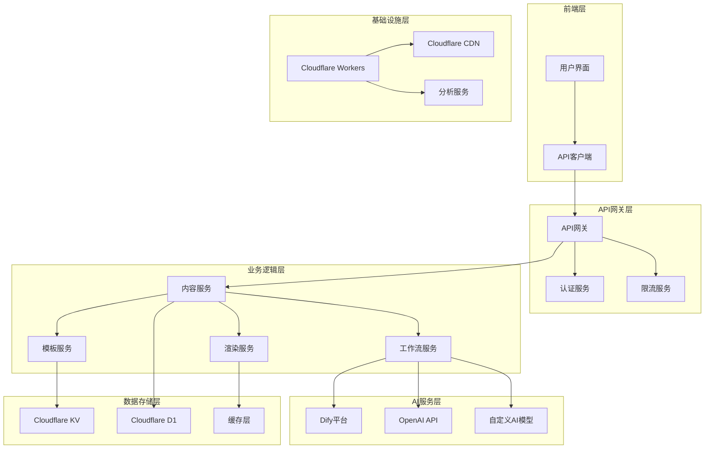
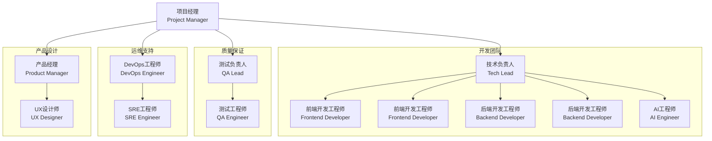
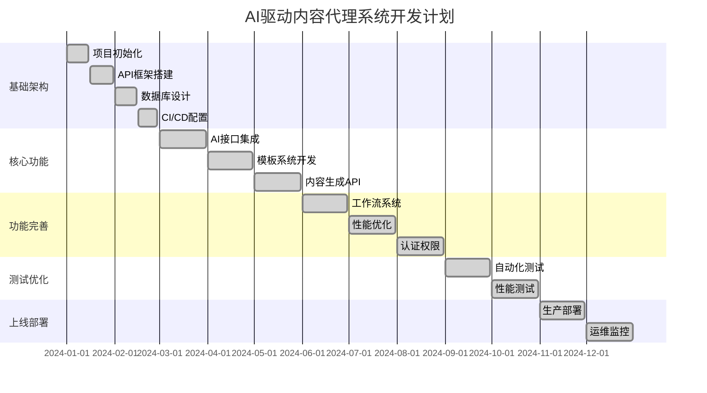
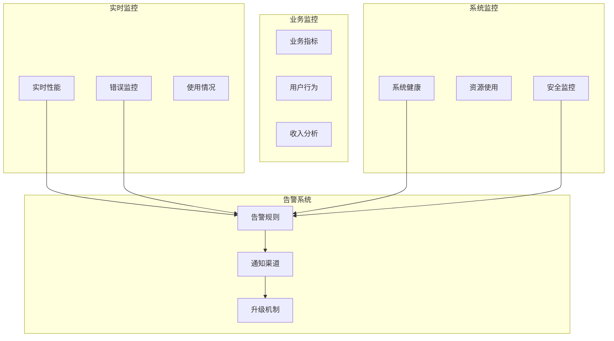
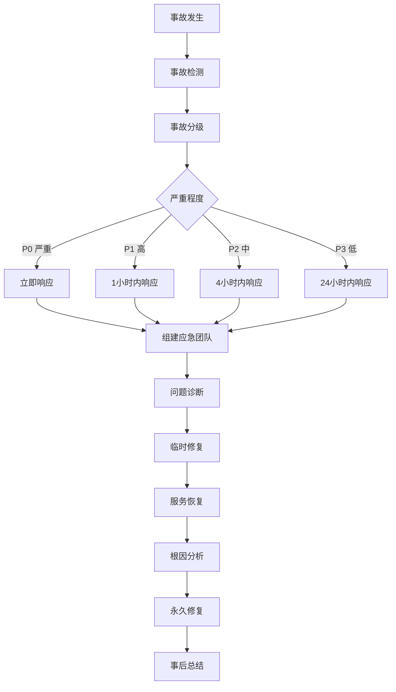
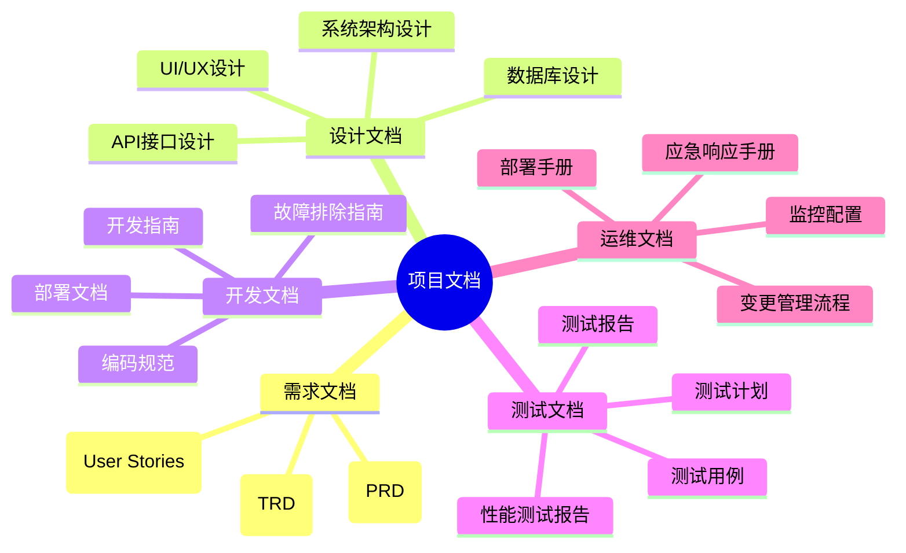

# AI驱动内容代理系统 - 项目管理指南

## 📋 项目概览

### 项目基本信息

| 项目属性 | 详细信息 |
|---------|----------|
| **项目名称** | AI驱动内容代理系统 |
| **项目代号** | ContentAgent |
| **版本** | v1.0.0 |
| **开发周期** | 2024年1月 - 2024年12月 |
| **团队规模** | 8-12人 |
| **技术栈** | Node.js, Cloudflare Workers, Dify, Vitest |
| **部署平台** | Cloudflare Workers |

### 项目目标

#### 主要目标
1. **智能内容生成**: 基于AI技术实现高质量内容自动生成
2. **多模板支持**: 提供6种预置模板，满足不同场景需求
3. **高性能渲染**: 实现毫秒级内容渲染和响应
4. **易用性**: 提供简洁的API接口和友好的用户体验
5. **可扩展性**: 支持自定义模板和工作流扩展

#### 成功指标
- **性能指标**: API响应时间 < 500ms
- **质量指标**: 内容生成准确率 > 95%
- **可用性**: 系统可用性 > 99.9%
- **用户满意度**: NPS评分 > 8.0

## 🏗️ 项目架构

### 技术架构图



### 模块划分

#### 核心模块
1. **内容生成模块** (`src/modules/content/`)
   - 内容生成逻辑
   - AI接口集成
   - 内容质量控制

2. **模板管理模块** (`src/modules/templates/`)
   - 模板存储和管理
   - 模板渲染引擎
   - 自定义模板支持

3. **工作流模块** (`src/modules/workflows/`)
   - 工作流定义和执行
   - 任务调度
   - 状态管理

4. **API模块** (`src/modules/api/`)
   - RESTful API实现
   - 请求验证
   - 响应格式化

#### 支撑模块
1. **认证授权模块** (`src/modules/auth/`)
2. **缓存模块** (`src/modules/cache/`)
3. **日志模块** (`src/modules/logging/`)
4. **监控模块** (`src/modules/monitoring/`)
5. **配置模块** (`src/modules/config/`)

## 👥 团队组织

### 团队结构



### 角色职责

#### 项目经理 (Project Manager)
- **主要职责**:
  - 项目整体规划和进度管理
  - 资源协调和风险控制
  - 跨团队沟通协调
  - 项目交付质量保证

- **关键活动**:
  - 每日站会主持
  - 周度项目回顾
  - 里程碑评审
  - 风险识别和应对

#### 技术负责人 (Tech Lead)
- **主要职责**:
  - 技术架构设计和评审
  - 代码质量把控
  - 技术难点攻关
  - 团队技术能力提升

- **关键活动**:
  - 架构设计评审
  - 代码审查
  - 技术分享
  - 技术选型决策

#### 开发工程师 (Developers)
- **主要职责**:
  - 功能模块开发
  - 单元测试编写
  - 代码文档维护
  - Bug修复和优化

- **关键活动**:
  - 需求分析和评估
  - 代码开发和测试
  - 代码审查参与
  - 技术文档编写

## 📅 项目计划

### 开发里程碑

#### Phase 1: 基础架构 (2024年1月-2月)
- **目标**: 搭建基础技术架构
- **交付物**:
  - [x] 项目初始化和环境搭建
  - [x] 基础API框架
  - [x] 数据库设计和初始化
  - [x] CI/CD流水线搭建

#### Phase 2: 核心功能 (2024年3月-5月)
- **目标**: 实现核心内容生成功能
- **交付物**:
  - [x] AI接口集成 (Dify)
  - [x] 模板系统实现
  - [x] 内容生成API
  - [x] 基础模板开发 (6个)

#### Phase 3: 功能完善 (2024年6月-8月)
- **目标**: 完善功能特性和用户体验
- **交付物**:
  - [x] 工作流系统
  - [x] 缓存和性能优化
  - [x] 用户认证和权限
  - [x] 监控和日志系统

#### Phase 4: 测试优化 (2024年9月-10月)
- **目标**: 全面测试和性能优化
- **交付物**:
  - [x] 自动化测试套件
  - [x] 性能测试和优化
  - [x] 安全测试和加固
  - [x] 文档完善

#### Phase 5: 上线部署 (2024年11月-12月)
- **目标**: 生产环境部署和运维
- **交付物**:
  - [x] 生产环境部署
  - [x] 监控告警配置
  - [x] 用户培训和支持
  - [x] 项目总结和交接

### 详细时间计划



## 🔄 开发流程

### Git工作流

#### 分支策略

```mermaid
gitgraph
    commit id: "Initial"
    branch develop
    checkout develop
    commit id: "Setup"
    
    branch feature/auth
    checkout feature/auth
    commit id: "Auth API"
    commit id: "Auth Tests"
    
    checkout develop
    merge feature/auth
    commit id: "Merge Auth"
    
    branch feature/templates
    checkout feature/templates
    commit id: "Template Engine"
    commit id: "Template Tests"
    
    checkout develop
    merge feature/templates
    commit id: "Merge Templates"
    
    checkout main
    merge develop
    commit id: "Release v1.0"
    
    branch hotfix/critical-bug
    checkout hotfix/critical-bug
    commit id: "Fix Bug"
    
    checkout main
    merge hotfix/critical-bug
    commit id: "Hotfix v1.0.1"
    
    checkout develop
    merge hotfix/critical-bug
    commit id: "Sync Hotfix"
```

#### 分支命名规范

```bash
# 功能分支
feature/功能名称
feature/user-authentication
feature/template-system
feature/content-generation

# 修复分支
fix/问题描述
fix/api-response-format
fix/template-rendering-bug

# 热修复分支
hotfix/紧急问题
hotfix/security-vulnerability
hotfix/critical-performance-issue

# 发布分支
release/版本号
release/v1.0.0
release/v1.1.0
```

### 代码审查流程

#### Pull Request 模板

```markdown
## 📝 变更描述

### 变更类型
- [ ] 新功能 (feature)
- [ ] Bug修复 (fix)
- [ ] 文档更新 (docs)
- [ ] 代码重构 (refactor)
- [ ] 性能优化 (perf)
- [ ] 测试相关 (test)
- [ ] 构建相关 (build)

### 变更内容
简要描述本次变更的内容和目的...

### 相关Issue
- Closes #123
- Related to #456

## 🧪 测试

### 测试用例
- [ ] 单元测试已通过
- [ ] 集成测试已通过
- [ ] 手动测试已完成

### 测试覆盖率
- 新增代码覆盖率: XX%
- 整体覆盖率: XX%

## 📋 检查清单

### 代码质量
- [ ] 代码符合项目编码规范
- [ ] 已添加必要的注释和文档
- [ ] 没有遗留的调试代码
- [ ] 没有硬编码的配置信息

### 安全性
- [ ] 没有暴露敏感信息
- [ ] 输入验证已实现
- [ ] 权限检查已实现

### 性能
- [ ] 没有明显的性能问题
- [ ] 数据库查询已优化
- [ ] 缓存策略已考虑

## 📸 截图/演示

如果涉及UI变更，请提供截图或演示视频...

## 🔗 相关链接

- 设计文档: [链接]
- API文档: [链接]
- 测试报告: [链接]
```

#### 代码审查标准

```javascript
// 代码审查检查点
const CODE_REVIEW_CHECKLIST = {
  // 功能性
  functionality: {
    requirements: '是否满足需求规格',
    edgeCases: '是否处理边界情况',
    errorHandling: '是否有适当的错误处理',
    testing: '是否有充分的测试覆盖'
  },
  
  // 代码质量
  codeQuality: {
    readability: '代码是否易读易懂',
    maintainability: '代码是否易于维护',
    reusability: '是否有重复代码',
    naming: '命名是否清晰准确'
  },
  
  // 性能
  performance: {
    efficiency: '算法效率是否合理',
    memory: '内存使用是否优化',
    database: '数据库查询是否优化',
    caching: '缓存策略是否合理'
  },
  
  // 安全性
  security: {
    authentication: '认证机制是否正确',
    authorization: '权限控制是否完善',
    inputValidation: '输入验证是否充分',
    dataProtection: '敏感数据是否保护'
  }
};
```

### 发布流程

#### 版本号规范

```bash
# 语义化版本控制 (Semantic Versioning)
# 格式: MAJOR.MINOR.PATCH

# 主版本号 (MAJOR): 不兼容的API变更
v1.0.0 -> v2.0.0

# 次版本号 (MINOR): 向后兼容的功能新增
v1.0.0 -> v1.1.0

# 修订号 (PATCH): 向后兼容的问题修正
v1.0.0 -> v1.0.1

# 预发布版本
v1.0.0-alpha.1
v1.0.0-beta.1
v1.0.0-rc.1
```

#### 发布检查清单

```markdown
## 🚀 发布前检查清单

### 代码质量
- [ ] 所有测试通过 (单元测试、集成测试、E2E测试)
- [ ] 代码覆盖率达标 (>80%)
- [ ] 静态代码分析通过
- [ ] 安全扫描通过

### 功能验证
- [ ] 核心功能正常工作
- [ ] API接口响应正确
- [ ] 性能指标达标
- [ ] 兼容性测试通过

### 文档更新
- [ ] API文档已更新
- [ ] 用户文档已更新
- [ ] 变更日志已更新
- [ ] 部署文档已更新

### 环境准备
- [ ] 生产环境配置正确
- [ ] 数据库迁移脚本准备
- [ ] 监控告警配置
- [ ] 回滚方案准备

### 发布执行
- [ ] 创建发布分支
- [ ] 构建生产版本
- [ ] 部署到预发布环境
- [ ] 预发布环境验证
- [ ] 部署到生产环境
- [ ] 生产环境验证
- [ ] 发布公告
```

## 📊 项目监控

### 关键指标 (KPIs)

#### 技术指标
```javascript
const TECHNICAL_KPIS = {
  // 性能指标
  performance: {
    apiResponseTime: {
      target: '<500ms',
      warning: '>1000ms',
      critical: '>2000ms'
    },
    throughput: {
      target: '>1000 req/min',
      warning: '<500 req/min',
      critical: '<100 req/min'
    },
    errorRate: {
      target: '<1%',
      warning: '>2%',
      critical: '>5%'
    }
  },
  
  // 可用性指标
  availability: {
    uptime: {
      target: '>99.9%',
      warning: '<99.5%',
      critical: '<99%'
    },
    mttr: {
      target: '<30min',
      warning: '>1hour',
      critical: '>4hours'
    }
  },
  
  // 质量指标
  quality: {
    codeCoverage: {
      target: '>80%',
      warning: '<70%',
      critical: '<60%'
    },
    bugDensity: {
      target: '<0.1 bugs/KLOC',
      warning: '>0.2 bugs/KLOC',
      critical: '>0.5 bugs/KLOC'
    }
  }
};
```

#### 业务指标
```javascript
const BUSINESS_KPIS = {
  // 用户指标
  user: {
    activeUsers: {
      daily: 'DAU',
      monthly: 'MAU',
      retention: '用户留存率'
    },
    satisfaction: {
      nps: 'Net Promoter Score',
      csat: 'Customer Satisfaction',
      feedback: '用户反馈评分'
    }
  },
  
  // 使用指标
  usage: {
    contentGeneration: '内容生成次数',
    templateUsage: '模板使用分布',
    apiCalls: 'API调用量',
    dataVolume: '数据处理量'
  },
  
  // 商业指标
  business: {
    revenue: '收入增长',
    cost: '运营成本',
    roi: '投资回报率',
    marketShare: '市场份额'
  }
};
```

### 监控仪表板



### 报告机制

#### 日报模板
```markdown
# 项目日报 - YYYY-MM-DD

## 📊 关键指标
- **API调用量**: XXX次 (↑XX%)
- **平均响应时间**: XXXms (↓XX%)
- **错误率**: X.X% (↓XX%)
- **系统可用性**: XX.X%

## ✅ 今日完成
- [ ] 功能开发: XXX
- [ ] Bug修复: XXX
- [ ] 测试用例: XXX
- [ ] 文档更新: XXX

## 🚧 进行中
- [ ] 功能开发: XXX (进度XX%)
- [ ] 性能优化: XXX (进度XX%)
- [ ] 集成测试: XXX (进度XX%)

## ⚠️ 风险和问题
- **高风险**: XXX (影响: XXX, 应对: XXX)
- **中风险**: XXX (影响: XXX, 应对: XXX)

## 📅 明日计划
- [ ] 完成XXX功能开发
- [ ] 修复XXX问题
- [ ] 进行XXX测试

## 👥 团队状态
- **在岗人数**: X/X
- **请假**: XXX (原因)
- **加班**: XXX (原因)
```

#### 周报模板
```markdown
# 项目周报 - 第XX周 (YYYY-MM-DD ~ YYYY-MM-DD)

## 📈 本周概览
- **里程碑进度**: XX% (计划XX%)
- **代码提交**: XXX次
- **功能完成**: XX个
- **Bug修复**: XX个

## 🎯 目标达成情况
| 目标 | 计划 | 实际 | 达成率 | 备注 |
|------|------|------|--------|------|
| 功能开发 | XX个 | XX个 | XX% | XXX |
| Bug修复 | XX个 | XX个 | XX% | XXX |
| 测试覆盖率 | XX% | XX% | XX% | XXX |

## 📊 质量指标
- **代码覆盖率**: XX% (目标XX%)
- **代码审查通过率**: XX%
- **自动化测试通过率**: XX%
- **性能测试结果**: 响应时间XXXms

## 🔥 重点成果
1. **XXX功能上线**: 描述和影响
2. **性能优化**: 具体改进和效果
3. **技术债务清理**: 清理内容和收益

## ⚠️ 风险管控
- **已解决风险**: XXX
- **当前风险**: XXX (应对措施)
- **新识别风险**: XXX (评估和计划)

## 📅 下周计划
- **主要目标**: XXX
- **关键任务**: XXX
- **资源需求**: XXX
```

## 🎯 质量保证

### 测试策略

#### 测试金字塔
```mermaid
pyramid
    title 测试金字塔
    
    "E2E测试" : 10
    "集成测试" : 20  
    "单元测试" : 70
```

#### 测试类型和覆盖率要求

```javascript
const TEST_REQUIREMENTS = {
  // 单元测试 (70%)
  unit: {
    coverage: '>80%',
    scope: '函数、类、模块',
    tools: ['Vitest', 'Jest'],
    automation: '100%'
  },
  
  // 集成测试 (20%)
  integration: {
    coverage: '>60%',
    scope: 'API、数据库、外部服务',
    tools: ['Supertest', 'TestContainers'],
    automation: '100%'
  },
  
  // E2E测试 (10%)
  e2e: {
    coverage: '核心用户流程',
    scope: '完整业务场景',
    tools: ['Playwright', 'Cypress'],
    automation: '80%'
  },
  
  // 性能测试
  performance: {
    load: '正常负载测试',
    stress: '压力测试',
    spike: '峰值测试',
    tools: ['Artillery', 'K6']
  },
  
  // 安全测试
  security: {
    sast: '静态应用安全测试',
    dast: '动态应用安全测试',
    dependency: '依赖安全扫描',
    tools: ['Snyk', 'OWASP ZAP']
  }
};
```

### 代码质量标准

#### ESLint 配置
```javascript
// .eslintrc.js
module.exports = {
  extends: [
    'eslint:recommended',
    '@typescript-eslint/recommended',
    'prettier'
  ],
  rules: {
    // 代码复杂度
    'complexity': ['error', 10],
    'max-depth': ['error', 4],
    'max-lines-per-function': ['error', 50],
    'max-params': ['error', 4],
    
    // 代码风格
    'prefer-const': 'error',
    'no-var': 'error',
    'no-unused-vars': 'error',
    'no-console': 'warn',
    
    // TypeScript 特定
    '@typescript-eslint/no-explicit-any': 'error',
    '@typescript-eslint/explicit-function-return-type': 'warn',
    '@typescript-eslint/no-unused-vars': 'error'
  }
};
```

#### SonarQube 质量门禁
```yaml
# sonar-project.properties
sonar.projectKey=ai-content-agent
sonar.projectName=AI驱动内容代理系统
sonar.projectVersion=1.0.0

# 质量门禁标准
sonar.qualitygate.wait=true

# 覆盖率要求
sonar.coverage.exclusions=**/*.test.js,**/*.spec.js
sonar.javascript.lcov.reportPaths=coverage/lcov.info

# 代码重复率
sonar.cpd.exclusions=**/*.test.js,**/*.spec.js

# 技术债务
sonar.technicalDebt.ratingGrid=0.05,0.1,0.2,0.5
```

## 🚨 风险管理

### 风险识别矩阵

| 风险类别 | 风险描述 | 概率 | 影响 | 风险等级 | 应对策略 |
|---------|----------|------|------|----------|----------|
| **技术风险** | AI API不稳定 | 中 | 高 | 高 | 多供应商备份 |
| **技术风险** | 性能瓶颈 | 中 | 中 | 中 | 性能监控和优化 |
| **人员风险** | 核心人员离职 | 低 | 高 | 中 | 知识文档化 |
| **外部风险** | 第三方服务中断 | 低 | 高 | 中 | 服务降级方案 |
| **安全风险** | 数据泄露 | 低 | 高 | 中 | 安全审计和加固 |
| **业务风险** | 需求变更 | 高 | 中 | 中 | 敏捷开发方法 |

### 应急响应计划

#### 生产事故响应流程



#### 事故等级定义

```javascript
const INCIDENT_LEVELS = {
  P0: {
    name: '严重事故',
    description: '系统完全不可用，影响所有用户',
    responseTime: '立即',
    escalation: '15分钟',
    examples: ['系统宕机', '数据丢失', '安全漏洞']
  },
  
  P1: {
    name: '高级事故',
    description: '核心功能不可用，影响大部分用户',
    responseTime: '1小时',
    escalation: '2小时',
    examples: ['API大面积故障', '性能严重下降']
  },
  
  P2: {
    name: '中级事故',
    description: '部分功能不可用，影响部分用户',
    responseTime: '4小时',
    escalation: '8小时',
    examples: ['单个功能故障', '性能轻微下降']
  },
  
  P3: {
    name: '低级事故',
    description: '轻微问题，不影响核心功能',
    responseTime: '24小时',
    escalation: '48小时',
    examples: ['UI显示问题', '非关键功能异常']
  }
};
```

## 📚 知识管理

### 文档体系



### 知识分享机制

#### 技术分享会
- **频率**: 每周一次
- **时长**: 30-60分钟
- **形式**: 技术演讲、代码审查、案例分析
- **主题**: 新技术、最佳实践、问题解决

#### 文档维护
- **责任人**: 每个模块指定文档负责人
- **更新频率**: 代码变更时同步更新
- **审查机制**: 定期文档审查和更新
- **版本控制**: 文档版本化管理

---

*项目管理是确保项目成功的关键，需要团队所有成员的共同努力和持续改进。*