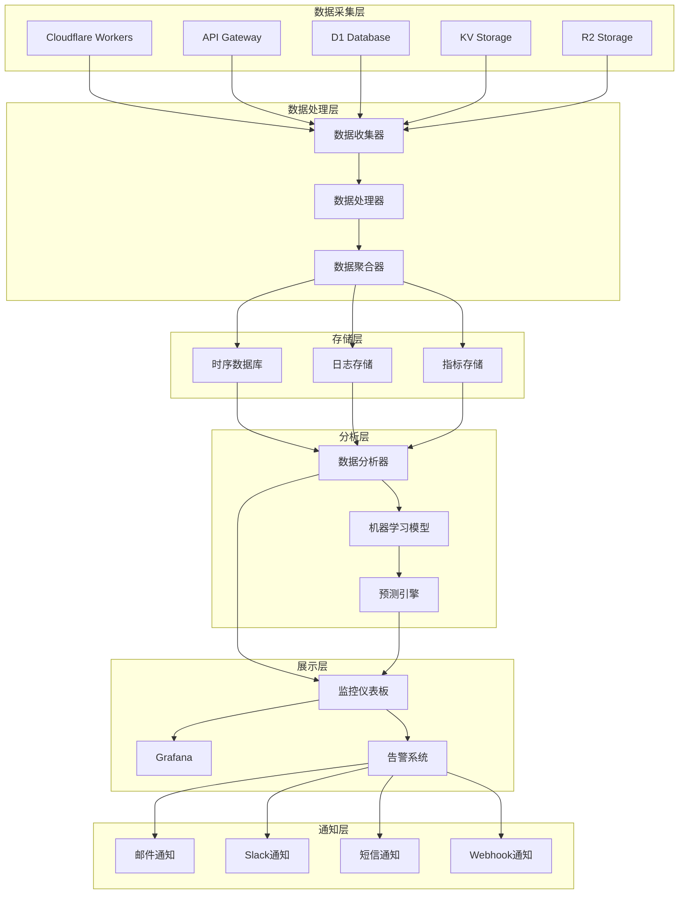

# AI驱动内容代理系统 - 监控配置

## 📋 概述

本文档详细介绍了AI驱动内容代理系统的监控配置，包括系统监控、应用监控、性能监控、日志管理和告警配置等方面。

## 🎯 监控架构

### 监控体系架构图


### 监控层级

| 层级 | 监控对象 | 关键指标 | 监控工具 | 告警阈值 |
|------|----------|----------|----------|----------|
| 基础设施 | Cloudflare服务 | 可用性、延迟、错误率 | Cloudflare Analytics | 99.9% |
| 应用层 | Workers运行时 | CPU、内存、请求数 | Workers Analytics | 80% |
| 业务层 | API接口 | 响应时间、成功率、QPS | 自定义监控 | 95% |
| 数据层 | 数据库、存储 | 连接数、查询时间、存储使用 | D1/KV/R2 指标 | 90% |
| 用户层 | 用户体验 | 页面加载时间、错误率 | RUM监控 | 2s |

## 🔧 监控配置

### 1. Cloudflare Analytics 配置

#### 1.1 Workers Analytics
```javascript
// src/monitoring/cloudflare-analytics.js
export class CloudflareAnalytics {
  constructor(env) {
    this.accountId = env.CLOUDFLARE_ACCOUNT_ID;
    this.apiToken = env.CLOUDFLARE_API_TOKEN;
    this.zoneId = env.CLOUDFLARE_ZONE_ID;
  }
  
  // 获取 Workers 分析数据
  async getWorkersAnalytics(since, until) {
    const query = `
      query {
        viewer {
          accounts(filter: {accountTag: "${this.accountId}"}) {
            workersInvocationsAdaptiveGroups(
              filter: {
                datetime_geq: "${since}"
                datetime_leq: "${until}"
              }
              limit: 1000
            ) {
              count
              sum {
                requests
                errors
                subrequests
                cpuTime
                duration
              }
              dimensions {
                datetime
                scriptName
                status
              }
            }
          }
        }
      }
    `;
    
    const response = await fetch('https://api.cloudflare.com/client/v4/graphql', {
      method: 'POST',
      headers: {
        'Authorization': `Bearer ${this.apiToken}`,
        'Content-Type': 'application/json'
      },
      body: JSON.stringify({ query })
    });
    
    return await response.json();
  }
  
  // 获取 Zone 分析数据
  async getZoneAnalytics(since, until) {
    const response = await fetch(
      `https://api.cloudflare.com/client/v4/zones/${this.zoneId}/analytics/dashboard?since=${since}&until=${until}`,
      {
        headers: {
          'Authorization': `Bearer ${this.apiToken}`,
          'Content-Type': 'application/json'
        }
      }
    );
    
    return await response.json();
  }
  
  // 获取实时指标
  async getRealTimeMetrics() {
    const now = new Date();
    const fiveMinutesAgo = new Date(now.getTime() - 5 * 60 * 1000);
    
    return await this.getWorkersAnalytics(
      fiveMinutesAgo.toISOString(),
      now.toISOString()
    );
  }
}
```

#### 1.2 自定义指标收集
```javascript
// src/monitoring/custom-metrics.js
export class CustomMetrics {
  constructor(env) {
    this.env = env;
    this.metrics = new Map();
    this.startTime = Date.now();
  }
  
  // 记录请求指标
  recordRequest(request, response, startTime) {
    const endTime = Date.now();
    const duration = endTime - startTime;
    const url = new URL(request.url);
    
    const metric = {
      timestamp: endTime,
      method: request.method,
      path: url.pathname,
      status: response.status,
      duration,
      userAgent: request.headers.get('User-Agent'),
      ip: request.headers.get('CF-Connecting-IP'),
      country: request.cf?.country,
      colo: request.cf?.colo
    };
    
    // 存储到 KV 用于后续分析
    this.storeMetric(metric);
    
    // 实时指标更新
    this.updateRealTimeMetrics(metric);
  }
  
  // 存储指标到 KV
  async storeMetric(metric) {
    try {
      const key = `metrics:${Date.now()}:${Math.random().toString(36).substr(2, 9)}`;
      await this.env.CONTENT_CACHE.put(key, JSON.stringify(metric), {
        expirationTtl: 86400 // 24小时
      });
    } catch (error) {
      console.error('Failed to store metric:', error);
    }
  }
  
  // 更新实时指标
  updateRealTimeMetrics(metric) {
    const key = `${metric.method}_${metric.path}`;
    const current = this.metrics.get(key) || {
      count: 0,
      totalDuration: 0,
      errors: 0,
      lastUpdate: Date.now()
    };
    
    current.count++;
    current.totalDuration += metric.duration;
    current.avgDuration = current.totalDuration / current.count;
    
    if (metric.status >= 400) {
      current.errors++;
    }
    
    current.errorRate = (current.errors / current.count) * 100;
    current.lastUpdate = Date.now();
    
    this.metrics.set(key, current);
  }
  
  // 获取实时指标摘要
  getRealTimeMetrics() {
    const summary = {
      uptime: Date.now() - this.startTime,
      totalRequests: 0,
      totalErrors: 0,
      avgResponseTime: 0,
      endpoints: {}
    };
    
    let totalDuration = 0;
    
    for (const [endpoint, metrics] of this.metrics.entries()) {
      summary.totalRequests += metrics.count;
      summary.totalErrors += metrics.errors;
      totalDuration += metrics.totalDuration;
      
      summary.endpoints[endpoint] = {
        requests: metrics.count,
        errors: metrics.errors,
        errorRate: metrics.errorRate.toFixed(2) + '%',
        avgResponseTime: metrics.avgDuration.toFixed(2) + 'ms',
        lastUpdate: new Date(metrics.lastUpdate).toISOString()
      };
    }
    
    summary.avgResponseTime = summary.totalRequests > 0 
      ? (totalDuration / summary.totalRequests).toFixed(2) + 'ms'
      : '0ms';
    
    summary.errorRate = summary.totalRequests > 0
      ? ((summary.totalErrors / summary.totalRequests) * 100).toFixed(2) + '%'
      : '0%';
    
    return summary;
  }
}
```

### 2. 应用性能监控 (APM)

#### 2.1 性能监控中间件
```javascript
// src/middleware/performance-monitor.js
export class PerformanceMonitor {
  constructor(env) {
    this.env = env;
    this.thresholds = {
      responseTime: 1000, // 1秒
      errorRate: 5, // 5%
      memoryUsage: 80 // 80%
    };
  }
  
  // 性能监控中间件
  async monitor(request, next) {
    const startTime = Date.now();
    const startMemory = this.getMemoryUsage();
    
    try {
      const response = await next(request);
      const endTime = Date.now();
      const endMemory = this.getMemoryUsage();
      
      // 记录性能指标
      await this.recordPerformance({
        request,
        response,
        startTime,
        endTime,
        duration: endTime - startTime,
        memoryUsed: endMemory - startMemory,
        success: response.status < 400
      });
      
      return response;
    } catch (error) {
      const endTime = Date.now();
      
      // 记录错误指标
      await this.recordError({
        request,
        error,
        startTime,
        endTime,
        duration: endTime - startTime
      });
      
      throw error;
    }
  }
  
  // 获取内存使用情况
  getMemoryUsage() {
    // Workers 环境中的内存监控
    if (typeof performance !== 'undefined' && performance.memory) {
      return performance.memory.usedJSHeapSize;
    }
    return 0;
  }
  
  // 记录性能指标
  async recordPerformance(metrics) {
    const performanceData = {
      timestamp: metrics.endTime,
      url: metrics.request.url,
      method: metrics.request.method,
      status: metrics.response.status,
      duration: metrics.duration,
      memoryUsed: metrics.memoryUsed,
      success: metrics.success,
      userAgent: metrics.request.headers.get('User-Agent'),
      ip: metrics.request.headers.get('CF-Connecting-IP'),
      country: metrics.request.cf?.country,
      colo: metrics.request.cf?.colo
    };
    
    // 检查性能阈值
    await this.checkThresholds(performanceData);
    
    // 存储性能数据
    await this.storePerformanceData(performanceData);
  }
  
  // 记录错误指标
  async recordError(metrics) {
    const errorData = {
      timestamp: metrics.endTime,
      url: metrics.request.url,
      method: metrics.request.method,
      duration: metrics.duration,
      error: {
        message: metrics.error.message,
        stack: metrics.error.stack,
        name: metrics.error.name
      },
      userAgent: metrics.request.headers.get('User-Agent'),
      ip: metrics.request.headers.get('CF-Connecting-IP'),
      country: metrics.request.cf?.country,
      colo: metrics.request.cf?.colo
    };
    
    // 发送错误告警
    await this.sendErrorAlert(errorData);
    
    // 存储错误数据
    await this.storeErrorData(errorData);
  }
  
  // 检查性能阈值
  async checkThresholds(data) {
    const alerts = [];
    
    // 响应时间检查
    if (data.duration > this.thresholds.responseTime) {
      alerts.push({
        type: 'performance',
        severity: 'warning',
        message: `响应时间超过阈值: ${data.duration}ms > ${this.thresholds.responseTime}ms`,
        url: data.url,
        timestamp: data.timestamp
      });
    }
    
    // 发送告警
    for (const alert of alerts) {
      await this.sendAlert(alert);
    }
  }
  
  // 存储性能数据
  async storePerformanceData(data) {
    try {
      const key = `perf:${data.timestamp}:${Math.random().toString(36).substr(2, 9)}`;
      await this.env.CONTENT_CACHE.put(key, JSON.stringify(data), {
        expirationTtl: 86400 // 24小时
      });
    } catch (error) {
      console.error('Failed to store performance data:', error);
    }
  }
  
  // 存储错误数据
  async storeErrorData(data) {
    try {
      const key = `error:${data.timestamp}:${Math.random().toString(36).substr(2, 9)}`;
      await this.env.CONTENT_CACHE.put(key, JSON.stringify(data), {
        expirationTtl: 604800 // 7天
      });
    } catch (error) {
      console.error('Failed to store error data:', error);
    }
  }
  
  // 发送告警
  async sendAlert(alert) {
    try {
      // 发送到 Slack
      if (this.env.SLACK_WEBHOOK_URL) {
        await this.sendSlackAlert(alert);
      }
      
      // 发送邮件
      if (this.env.EMAIL_API_KEY) {
        await this.sendEmailAlert(alert);
      }
    } catch (error) {
      console.error('Failed to send alert:', error);
    }
  }
  
  // 发送错误告警
  async sendErrorAlert(errorData) {
    const alert = {
      type: 'error',
      severity: 'critical',
      message: `应用错误: ${errorData.error.message}`,
      url: errorData.url,
      timestamp: errorData.timestamp,
      details: errorData
    };
    
    await this.sendAlert(alert);
  }
  
  // 发送 Slack 告警
  async sendSlackAlert(alert) {
    const color = alert.severity === 'critical' ? 'danger' : 'warning';
    const payload = {
      attachments: [{
        color,
        title: `🚨 ${alert.type.toUpperCase()} 告警`,
        text: alert.message,
        fields: [
          {
            title: 'URL',
            value: alert.url,
            short: true
          },
          {
            title: '时间',
            value: new Date(alert.timestamp).toLocaleString('zh-CN'),
            short: true
          },
          {
            title: '严重程度',
            value: alert.severity,
            short: true
          }
        ],
        timestamp: Math.floor(alert.timestamp / 1000)
      }]
    };
    
    await fetch(this.env.SLACK_WEBHOOK_URL, {
      method: 'POST',
      headers: { 'Content-Type': 'application/json' },
      body: JSON.stringify(payload)
    });
  }
  
  // 发送邮件告警
  async sendEmailAlert(alert) {
    const emailData = {
      to: this.env.ALERT_EMAIL,
      subject: `[${alert.severity.toUpperCase()}] ${alert.type} 告警`,
      html: `
        <h2>系统告警通知</h2>
        <p><strong>告警类型:</strong> ${alert.type}</p>
        <p><strong>严重程度:</strong> ${alert.severity}</p>
        <p><strong>告警信息:</strong> ${alert.message}</p>
        <p><strong>URL:</strong> ${alert.url}</p>
        <p><strong>时间:</strong> ${new Date(alert.timestamp).toLocaleString('zh-CN')}</p>
        ${alert.details ? `<pre>${JSON.stringify(alert.details, null, 2)}</pre>` : ''}
      `
    };
    
    // 使用邮件服务发送（如 SendGrid, Mailgun 等）
    await this.sendEmail(emailData);
  }
  
  // 发送邮件（示例使用 SendGrid）
  async sendEmail(emailData) {
    const response = await fetch('https://api.sendgrid.com/v3/mail/send', {
      method: 'POST',
      headers: {
        'Authorization': `Bearer ${this.env.SENDGRID_API_KEY}`,
        'Content-Type': 'application/json'
      },
      body: JSON.stringify({
        personalizations: [{
          to: [{ email: emailData.to }]
        }],
        from: { email: this.env.FROM_EMAIL },
        subject: emailData.subject,
        content: [{
          type: 'text/html',
          value: emailData.html
        }]
      })
    });
    
    if (!response.ok) {
      throw new Error(`Failed to send email: ${response.statusText}`);
    }
  }
}
```

### 3. 日志管理

#### 3.1 结构化日志
```javascript
// src/utils/structured-logger.js
export class StructuredLogger {
  constructor(env) {
    this.env = env;
    this.level = env.LOG_LEVEL || 'info';
    this.levels = {
      debug: 0,
      info: 1,
      warn: 2,
      error: 3,
      fatal: 4
    };
  }
  
  // 创建日志条目
  createLogEntry(level, message, meta = {}) {
    return {
      timestamp: new Date().toISOString(),
      level: level.toUpperCase(),
      message,
      service: 'content-agent',
      version: this.env.APP_VERSION || '1.0.0',
      environment: this.env.NODE_ENV || 'production',
      requestId: meta.requestId,
      userId: meta.userId,
      ip: meta.ip,
      userAgent: meta.userAgent,
      country: meta.country,
      colo: meta.colo,
      ...meta
    };
  }
  
  // 记录日志
  log(level, message, meta = {}) {
    if (this.levels[level] >= this.levels[this.level]) {
      const logEntry = this.createLogEntry(level, message, meta);
      
      // 输出到控制台
      console.log(JSON.stringify(logEntry));
      
      // 发送到外部日志服务
      this.sendToExternalService(logEntry);
    }
  }
  
  // 发送到外部日志服务
  async sendToExternalService(logEntry) {
    try {
      // 发送到 Datadog
      if (this.env.DATADOG_API_KEY) {
        await this.sendToDatadog(logEntry);
      }
      
      // 发送到 Elasticsearch
      if (this.env.ELASTICSEARCH_URL) {
        await this.sendToElasticsearch(logEntry);
      }
      
      // 存储到 KV（用于短期查询）
      if (logEntry.level === 'ERROR' || logEntry.level === 'FATAL') {
        await this.storeErrorLog(logEntry);
      }
    } catch (error) {
      console.error('Failed to send log to external service:', error);
    }
  }
  
  // 发送到 Datadog
  async sendToDatadog(logEntry) {
    const payload = {
      ddsource: 'cloudflare-workers',
      ddtags: `env:${logEntry.environment},service:${logEntry.service},version:${logEntry.version}`,
      hostname: logEntry.colo || 'unknown',
      message: logEntry.message,
      level: logEntry.level,
      timestamp: logEntry.timestamp,
      attributes: logEntry
    };
    
    await fetch(`https://http-intake.logs.datadoghq.com/v1/input/${this.env.DATADOG_API_KEY}`, {
      method: 'POST',
      headers: {
        'Content-Type': 'application/json'
      },
      body: JSON.stringify(payload)
    });
  }
  
  // 发送到 Elasticsearch
  async sendToElasticsearch(logEntry) {
    const index = `content-agent-logs-${new Date().toISOString().slice(0, 7)}`; // 按月分索引
    
    await fetch(`${this.env.ELASTICSEARCH_URL}/${index}/_doc`, {
      method: 'POST',
      headers: {
        'Content-Type': 'application/json',
        'Authorization': `Basic ${btoa(`${this.env.ELASTICSEARCH_USER}:${this.env.ELASTICSEARCH_PASSWORD}`)}`
      },
      body: JSON.stringify(logEntry)
    });
  }
  
  // 存储错误日志到 KV
  async storeErrorLog(logEntry) {
    try {
      const key = `error_log:${logEntry.timestamp}:${Math.random().toString(36).substr(2, 9)}`;
      await this.env.CONTENT_CACHE.put(key, JSON.stringify(logEntry), {
        expirationTtl: 604800 // 7天
      });
    } catch (error) {
      console.error('Failed to store error log:', error);
    }
  }
  
  // 便捷方法
  debug(message, meta) { this.log('debug', message, meta); }
  info(message, meta) { this.log('info', message, meta); }
  warn(message, meta) { this.log('warn', message, meta); }
  error(message, meta) { this.log('error', message, meta); }
  fatal(message, meta) { this.log('fatal', message, meta); }
  
  // 创建请求日志记录器
  createRequestLogger(request) {
    const requestId = crypto.randomUUID();
    const meta = {
      requestId,
      ip: request.headers.get('CF-Connecting-IP'),
      userAgent: request.headers.get('User-Agent'),
      country: request.cf?.country,
      colo: request.cf?.colo,
      method: request.method,
      url: request.url
    };
    
    return {
      requestId,
      debug: (message, additionalMeta = {}) => this.debug(message, { ...meta, ...additionalMeta }),
      info: (message, additionalMeta = {}) => this.info(message, { ...meta, ...additionalMeta }),
      warn: (message, additionalMeta = {}) => this.warn(message, { ...meta, ...additionalMeta }),
      error: (message, additionalMeta = {}) => this.error(message, { ...meta, ...additionalMeta }),
      fatal: (message, additionalMeta = {}) => this.fatal(message, { ...meta, ...additionalMeta })
    };
  }
}
```

### 4. 健康检查

#### 4.1 健康检查端点
```javascript
// src/routes/health.js
export class HealthCheck {
  constructor(env) {
    this.env = env;
    this.checks = new Map();
    this.initializeChecks();
  }
  
  // 初始化健康检查项
  initializeChecks() {
    this.checks.set('database', () => this.checkDatabase());
    this.checks.set('kv_storage', () => this.checkKVStorage());
    this.checks.set('r2_storage', () => this.checkR2Storage());
    this.checks.set('dify_api', () => this.checkDifyAPI());
    this.checks.set('external_apis', () => this.checkExternalAPIs());
  }
  
  // 执行所有健康检查
  async performHealthCheck() {
    const startTime = Date.now();
    const results = {
      status: 'healthy',
      timestamp: new Date().toISOString(),
      version: this.env.APP_VERSION || '1.0.0',
      environment: this.env.NODE_ENV || 'production',
      uptime: Date.now() - startTime,
      checks: {}
    };
    
    let overallHealthy = true;
    
    // 并行执行所有检查
    const checkPromises = Array.from(this.checks.entries()).map(async ([name, checkFn]) => {
      try {
        const checkStart = Date.now();
        const result = await Promise.race([
          checkFn(),
          new Promise((_, reject) => 
            setTimeout(() => reject(new Error('Health check timeout')), 5000)
          )
        ]);
        
        return {
          name,
          status: 'healthy',
          responseTime: Date.now() - checkStart,
          details: result
        };
      } catch (error) {
        overallHealthy = false;
        return {
          name,
          status: 'unhealthy',
          responseTime: Date.now() - checkStart,
          error: error.message
        };
      }
    });
    
    const checkResults = await Promise.all(checkPromises);
    
    // 整理检查结果
    for (const result of checkResults) {
      results.checks[result.name] = {
        status: result.status,
        responseTime: `${result.responseTime}ms`,
        ...(result.details && { details: result.details }),
        ...(result.error && { error: result.error })
      };
    }
    
    results.status = overallHealthy ? 'healthy' : 'unhealthy';
    results.responseTime = `${Date.now() - startTime}ms`;
    
    return results;
  }
  
  // 检查数据库连接
  async checkDatabase() {
    const result = await this.env.DB.prepare('SELECT 1 as test').first();
    if (result?.test !== 1) {
      throw new Error('Database query failed');
    }
    return { connection: 'ok', query: 'ok' };
  }
  
  // 检查 KV 存储
  async checkKVStorage() {
    const testKey = 'health_check_' + Date.now();
    const testValue = 'ok';
    
    // 写入测试
    await this.env.CONTENT_CACHE.put(testKey, testValue, { expirationTtl: 60 });
    
    // 读取测试
    const retrievedValue = await this.env.CONTENT_CACHE.get(testKey);
    if (retrievedValue !== testValue) {
      throw new Error('KV storage read/write test failed');
    }
    
    // 清理测试数据
    await this.env.CONTENT_CACHE.delete(testKey);
    
    return { read: 'ok', write: 'ok', delete: 'ok' };
  }
  
  // 检查 R2 存储
  async checkR2Storage() {
    try {
      // 尝试列出存储桶内容（限制1个对象）
      const objects = await this.env.ASSETS.list({ limit: 1 });
      return { 
        connection: 'ok',
        objectCount: objects.objects.length,
        truncated: objects.truncated
      };
    } catch (error) {
      throw new Error(`R2 storage check failed: ${error.message}`);
    }
  }
  
  // 检查 Dify API
  async checkDifyAPI() {
    try {
      const response = await fetch(`${this.env.DIFY_API_URL}/workflows`, {
        method: 'GET',
        headers: {
          'Authorization': `Bearer ${this.env.DIFY_API_KEY}`,
          'Content-Type': 'application/json'
        }
      });
      
      if (!response.ok) {
        throw new Error(`Dify API returned ${response.status}`);
      }
      
      const data = await response.json();
      return {
        status: 'ok',
        responseStatus: response.status,
        workflowCount: data.data?.length || 0
      };
    } catch (error) {
      throw new Error(`Dify API check failed: ${error.message}`);
    }
  }
  
  // 检查外部 API
  async checkExternalAPIs() {
    const apis = [
      { name: 'cloudflare', url: 'https://api.cloudflare.com/client/v4/user/tokens/verify' },
      // 可以添加更多外部 API 检查
    ];
    
    const results = {};
    
    for (const api of apis) {
      try {
        const response = await fetch(api.url, {
          method: 'GET',
          headers: {
            'Authorization': `Bearer ${this.env.CLOUDFLARE_API_TOKEN}`
          }
        });
        
        results[api.name] = {
          status: response.ok ? 'ok' : 'error',
          responseStatus: response.status
        };
      } catch (error) {
        results[api.name] = {
          status: 'error',
          error: error.message
        };
      }
    }
    
    return results;
  }
  
  // 简单健康检查（快速响应）
  async performSimpleHealthCheck() {
    return {
      status: 'healthy',
      timestamp: new Date().toISOString(),
      version: this.env.APP_VERSION || '1.0.0',
      environment: this.env.NODE_ENV || 'production'
    };
  }
}
```

### 5. 监控仪表板

#### 5.1 监控数据 API
```javascript
// src/routes/monitoring.js
export class MonitoringAPI {
  constructor(env) {
    this.env = env;
  }
  
  // 获取系统概览
  async getSystemOverview() {
    const now = Date.now();
    const oneHourAgo = now - 60 * 60 * 1000;
    
    // 获取最近一小时的指标
    const metrics = await this.getMetricsInRange(oneHourAgo, now);
    
    return {
      timestamp: new Date().toISOString(),
      period: '1h',
      summary: {
        totalRequests: metrics.totalRequests,
        errorRate: metrics.errorRate,
        avgResponseTime: metrics.avgResponseTime,
        uptime: '99.9%', // 从实际监控数据计算
        activeUsers: metrics.activeUsers
      },
      performance: {
        cpu: metrics.cpuUsage,
        memory: metrics.memoryUsage,
        storage: metrics.storageUsage
      },
      endpoints: metrics.endpointStats,
      alerts: await this.getActiveAlerts()
    };
  }
  
  // 获取指定时间范围的指标
  async getMetricsInRange(startTime, endTime) {
    const keys = await this.env.CONTENT_CACHE.list({
      prefix: 'metrics:',
      limit: 1000
    });
    
    const metrics = {
      totalRequests: 0,
      totalErrors: 0,
      totalDuration: 0,
      activeUsers: new Set(),
      endpointStats: {},
      cpuUsage: 0,
      memoryUsage: 0,
      storageUsage: 0
    };
    
    for (const key of keys.keys) {
      try {
        const data = await this.env.CONTENT_CACHE.get(key.name, 'json');
        if (data && data.timestamp >= startTime && data.timestamp <= endTime) {
          metrics.totalRequests++;
          metrics.totalDuration += data.duration;
          
          if (data.status >= 400) {
            metrics.totalErrors++;
          }
          
          if (data.ip) {
            metrics.activeUsers.add(data.ip);
          }
          
          // 统计端点数据
          const endpoint = `${data.method} ${new URL(data.url).pathname}`;
          if (!metrics.endpointStats[endpoint]) {
            metrics.endpointStats[endpoint] = {
              requests: 0,
              errors: 0,
              totalDuration: 0
            };
          }
          
          metrics.endpointStats[endpoint].requests++;
          metrics.endpointStats[endpoint].totalDuration += data.duration;
          
          if (data.status >= 400) {
            metrics.endpointStats[endpoint].errors++;
          }
        }
      } catch (error) {
        console.error('Error processing metric:', error);
      }
    }
    
    // 计算平均值和比率
    metrics.errorRate = metrics.totalRequests > 0 
      ? (metrics.totalErrors / metrics.totalRequests * 100).toFixed(2)
      : 0;
    
    metrics.avgResponseTime = metrics.totalRequests > 0
      ? (metrics.totalDuration / metrics.totalRequests).toFixed(2)
      : 0;
    
    metrics.activeUsers = metrics.activeUsers.size;
    
    // 处理端点统计
    for (const [endpoint, stats] of Object.entries(metrics.endpointStats)) {
      stats.errorRate = stats.requests > 0 
        ? (stats.errors / stats.requests * 100).toFixed(2)
        : 0;
      
      stats.avgResponseTime = stats.requests > 0
        ? (stats.totalDuration / stats.requests).toFixed(2)
        : 0;
      
      delete stats.totalDuration; // 清理临时数据
    }
    
    return metrics;
  }
  
  // 获取活跃告警
  async getActiveAlerts() {
    const keys = await this.env.CONTENT_CACHE.list({
      prefix: 'alert:',
      limit: 100
    });
    
    const alerts = [];
    const now = Date.now();
    const oneHourAgo = now - 60 * 60 * 1000;
    
    for (const key of keys.keys) {
      try {
        const alert = await this.env.CONTENT_CACHE.get(key.name, 'json');
        if (alert && alert.timestamp >= oneHourAgo && !alert.resolved) {
          alerts.push(alert);
        }
      } catch (error) {
        console.error('Error processing alert:', error);
      }
    }
    
    return alerts.sort((a, b) => b.timestamp - a.timestamp);
  }
  
  // 获取性能趋势
  async getPerformanceTrends(period = '24h') {
    const now = Date.now();
    let startTime;
    let interval;
    
    switch (period) {
      case '1h':
        startTime = now - 60 * 60 * 1000;
        interval = 5 * 60 * 1000; // 5分钟间隔
        break;
      case '24h':
        startTime = now - 24 * 60 * 60 * 1000;
        interval = 60 * 60 * 1000; // 1小时间隔
        break;
      case '7d':
        startTime = now - 7 * 24 * 60 * 60 * 1000;
        interval = 6 * 60 * 60 * 1000; // 6小时间隔
        break;
      default:
        startTime = now - 24 * 60 * 60 * 1000;
        interval = 60 * 60 * 1000;
    }
    
    const trends = {
      responseTime: [],
      errorRate: [],
      requestCount: [],
      timestamps: []
    };
    
    // 生成时间点
    for (let time = startTime; time <= now; time += interval) {
      const endTime = Math.min(time + interval, now);
      const metrics = await this.getMetricsInRange(time, endTime);
      
      trends.timestamps.push(new Date(time).toISOString());
      trends.responseTime.push(parseFloat(metrics.avgResponseTime));
      trends.errorRate.push(parseFloat(metrics.errorRate));
      trends.requestCount.push(metrics.totalRequests);
    }
    
    return trends;
  }
}
```

### 6. 告警规则配置

#### 6.1 告警规则定义
```javascript
// src/monitoring/alert-rules.js
export const ALERT_RULES = {
  // 响应时间告警
  response_time: {
    name: '响应时间过高',
    condition: (metrics) => metrics.avgResponseTime > 2000,
    severity: 'warning',
    threshold: 2000,
    unit: 'ms',
    description: '平均响应时间超过2秒'
  },
  
  // 错误率告警
  error_rate: {
    name: '错误率过高',
    condition: (metrics) => metrics.errorRate > 5,
    severity: 'critical',
    threshold: 5,
    unit: '%',
    description: '错误率超过5%'
  },
  
  // 请求量异常
  request_spike: {
    name: '请求量异常增长',
    condition: (current, baseline) => current.totalRequests > baseline.totalRequests * 2,
    severity: 'warning',
    description: '请求量比基线增长超过100%'
  },
  
  // 数据库连接失败
  database_connection: {
    name: '数据库连接失败',
    condition: (healthCheck) => healthCheck.checks.database?.status !== 'healthy',
    severity: 'critical',
    description: '数据库健康检查失败'
  },
  
  // KV 存储异常
  kv_storage: {
    name: 'KV存储异常',
    condition: (healthCheck) => healthCheck.checks.kv_storage?.status !== 'healthy',
    severity: 'critical',
    description: 'KV存储健康检查失败'
  },
  
  // AI 服务异常
  ai_service: {
    name: 'AI服务异常',
    condition: (healthCheck) => healthCheck.checks.dify_api?.status !== 'healthy',
    severity: 'critical',
    description: 'Dify AI服务健康检查失败'
  }
};

// 告警管理器
export class AlertManager {
  constructor(env) {
    this.env = env;
    this.rules = ALERT_RULES;
    this.activeAlerts = new Map();
  }
  
  // 评估告警规则
  async evaluateRules(metrics, healthCheck, baseline) {
    const newAlerts = [];
    const resolvedAlerts = [];
    
    for (const [ruleId, rule] of Object.entries(this.rules)) {
      try {
        let triggered = false;
        
        // 评估条件
        if (rule.condition.length === 1) {
          triggered = rule.condition(metrics);
        } else if (rule.condition.length === 2) {
          triggered = rule.condition(metrics, baseline);
        } else if (rule.condition.length === 3) {
          triggered = rule.condition(metrics, healthCheck, baseline);
        }
        
        const existingAlert = this.activeAlerts.get(ruleId);
        
        if (triggered && !existingAlert) {
          // 新告警
          const alert = {
            id: ruleId,
            name: rule.name,
            severity: rule.severity,
            description: rule.description,
            threshold: rule.threshold,
            unit: rule.unit,
            timestamp: Date.now(),
            resolved: false,
            metrics: metrics
          };
          
          this.activeAlerts.set(ruleId, alert);
          newAlerts.push(alert);
          
          // 存储告警
          await this.storeAlert(alert);
          
        } else if (!triggered && existingAlert) {
          // 告警恢复
          existingAlert.resolved = true;
          existingAlert.resolvedAt = Date.now();
          
          resolvedAlerts.push(existingAlert);
          this.activeAlerts.delete(ruleId);
          
          // 更新存储的告警
          await this.updateAlert(existingAlert);
        }
      } catch (error) {
        console.error(`Error evaluating rule ${ruleId}:`, error);
      }
    }
    
    return { newAlerts, resolvedAlerts };
  }
  
  // 存储告警
  async storeAlert(alert) {
    try {
      const key = `alert:${alert.id}:${alert.timestamp}`;
      await this.env.CONTENT_CACHE.put(key, JSON.stringify(alert), {
        expirationTtl: 7 * 24 * 60 * 60 // 7天
      });
    } catch (error) {
      console.error('Failed to store alert:', error);
    }
  }
  
  // 更新告警
  async updateAlert(alert) {
    try {
      const key = `alert:${alert.id}:${alert.timestamp}`;
      await this.env.CONTENT_CACHE.put(key, JSON.stringify(alert), {
        expirationTtl: 7 * 24 * 60 * 60 // 7天
      });
    } catch (error) {
      console.error('Failed to update alert:', error);
    }
  }
  
  // 获取活跃告警
  getActiveAlerts() {
    return Array.from(this.activeAlerts.values());
  }
  
  // 手动解决告警
  async resolveAlert(alertId, reason) {
    const alert = this.activeAlerts.get(alertId);
    if (alert) {
      alert.resolved = true;
      alert.resolvedAt = Date.now();
      alert.resolvedBy = 'manual';
      alert.resolveReason = reason;
      
      this.activeAlerts.delete(alertId);
      await this.updateAlert(alert);
      
      return alert;
    }
    return null;
  }
}
```

## 📊 监控最佳实践

### 1. 关键指标 (KPIs)

#### 系统可用性指标
- **可用性**: 目标 99.9%
- **平均故障时间 (MTBF)**: > 720小时
- **平均恢复时间 (MTTR)**: < 15分钟
- **故障影响范围**: < 1%用户

#### 性能指标
- **响应时间**: P95 < 1秒, P99 < 2秒
- **吞吐量**: > 1000 RPS
- **错误率**: < 0.1%
- **并发用户数**: > 10000

#### 业务指标
- **API 调用成功率**: > 99.5%
- **内容生成成功率**: > 98%
- **用户满意度**: > 4.5/5
- **功能使用率**: 各功能 > 60%

### 2. 告警策略

#### 告警级别
- **Critical**: 影响核心功能，需要立即处理
- **Warning**: 可能影响性能，需要关注
- **Info**: 信息性告警，用于趋势分析

#### 告警通知
- **Critical**: 立即通知（电话、短信、邮件、Slack）
- **Warning**: 5分钟内通知（邮件、Slack）
- **Info**: 每日汇总报告

### 3. 监控数据保留

| 数据类型 | 详细程度 | 保留时间 | 存储位置 |
|----------|----------|----------|----------|
| 实时指标 | 1分钟粒度 | 24小时 | KV Storage |
| 小时指标 | 1小时粒度 | 30天 | D1 Database |
| 日指标 | 1天粒度 | 1年 | R2 Storage |
| 错误日志 | 完整详情 | 30天 | 外部日志服务 |
| 审计日志 | 完整详情 | 1年 | 合规存储 |

---

*监控配置文档提供了全面的系统监控解决方案，确保系统运行状态的实时可见性和问题的快速响应。*