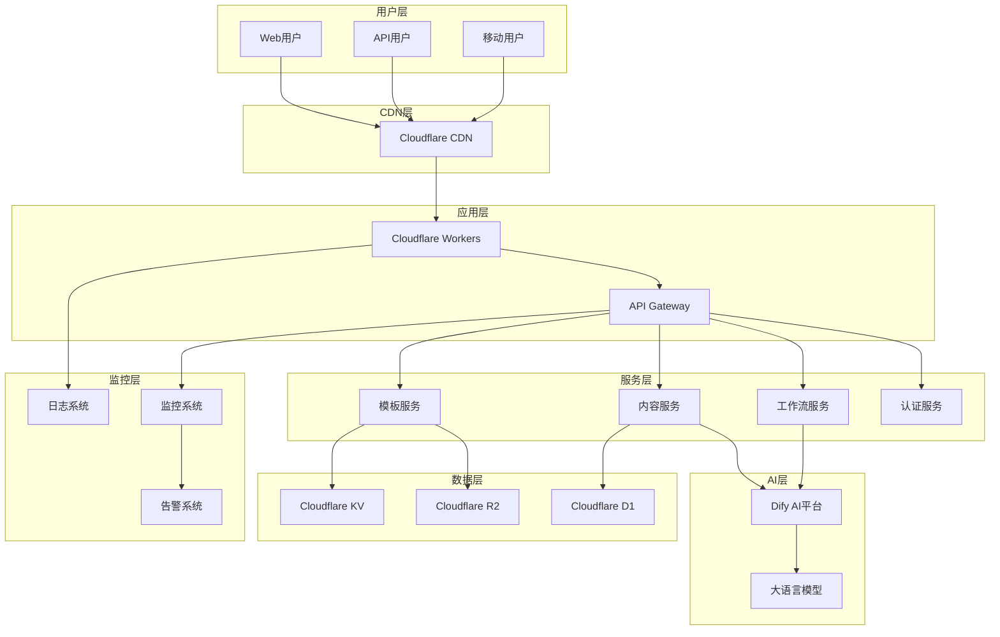

# AI驱动内容代理系统 - 部署指南

## 📋 概述

本文档详细介绍了AI驱动内容代理系统在不同环境下的部署方法，包括本地开发环境、测试环境和生产环境的部署配置。

## 🎯 部署架构

### 系统架构图


### 部署环境

| 环境 | 用途 | 域名 | 数据库 | 缓存 |
|------|------|------|--------|------|
| 开发环境 | 本地开发调试 | localhost:8787 | 本地SQLite | 内存缓存 |
| 测试环境 | 功能测试验证 | test.content-agent.com | Cloudflare D1 | Cloudflare KV |
| 预生产环境 | 性能测试 | staging.content-agent.com | Cloudflare D1 | Cloudflare KV |
| 生产环境 | 正式服务 | api.content-agent.com | Cloudflare D1 | Cloudflare KV |

## 🚀 快速部署

### 前置要求

#### 系统要求
- Node.js >= 18.0.0
- npm >= 8.0.0 或 yarn >= 1.22.0
- Git >= 2.30.0

#### 账户要求
- Cloudflare 账户（免费版即可开始）
- Dify AI 平台账户
- GitHub 账户（用于代码管理）

#### 工具安装
```bash
# 安装 Wrangler CLI
npm install -g wrangler

# 验证安装
wrangler --version

# 登录 Cloudflare
wrangler auth login
```

### 一键部署脚本

```bash
#!/bin/bash
# deploy.sh - 一键部署脚本

set -e

echo "🚀 开始部署 AI驱动内容代理系统..."

# 检查环境
echo "📋 检查部署环境..."
if ! command -v node &> /dev/null; then
    echo "❌ Node.js 未安装，请先安装 Node.js >= 18.0.0"
    exit 1
fi

if ! command -v wrangler &> /dev/null; then
    echo "❌ Wrangler CLI 未安装，正在安装..."
    npm install -g wrangler
fi

# 克隆项目
echo "📦 克隆项目代码..."
if [ ! -d "ai_driven_content_agent" ]; then
    git clone https://github.com/your-org/ai_driven_content_agent.git
    cd ai_driven_content_agent
else
    cd ai_driven_content_agent
    git pull origin main
fi

# 安装依赖
echo "📚 安装项目依赖..."
npm install

# 环境配置
echo "⚙️ 配置环境变量..."
if [ ! -f ".env" ]; then
    cp .env.example .env
    echo "请编辑 .env 文件，配置必要的环境变量"
    echo "配置完成后，请重新运行此脚本"
    exit 1
fi

# 创建 Cloudflare 资源
echo "☁️ 创建 Cloudflare 资源..."

# 创建 KV 命名空间
echo "创建 KV 命名空间..."
KV_ID=$(wrangler kv:namespace create "CONTENT_CACHE" --preview false | grep -o 'id = "[^"]*"' | cut -d'"' -f2)
echo "KV_NAMESPACE_ID=$KV_ID" >> .env

# 创建 D1 数据库
echo "创建 D1 数据库..."
DB_ID=$(wrangler d1 create content-agent-db | grep -o 'database_id = "[^"]*"' | cut -d'"' -f2)
echo "D1_DATABASE_ID=$DB_ID" >> .env

# 创建 R2 存储桶
echo "创建 R2 存储桶..."
wrangler r2 bucket create content-assets

# 数据库迁移
echo "🗄️ 执行数据库迁移..."
wrangler d1 execute content-agent-db --file=./migrations/001_initial.sql

# 构建项目
echo "🔨 构建项目..."
npm run build

# 部署到 Cloudflare Workers
echo "🚀 部署到 Cloudflare Workers..."
wrangler deploy

# 配置域名（可选）
read -p "是否配置自定义域名？(y/n): " -n 1 -r
echo
if [[ $REPLY =~ ^[Yy]$ ]]; then
    read -p "请输入域名: " DOMAIN
    wrangler route add "$DOMAIN/*" content-agent-worker
fi

echo "✅ 部署完成！"
echo "🌐 访问地址: https://your-worker.your-subdomain.workers.dev"
echo "📚 查看文档: https://github.com/your-org/ai_driven_content_agent"
```

## 🔧 详细部署步骤

### 1. 环境准备

#### 1.1 创建项目目录
```bash
# 创建项目目录
mkdir ai-content-agent-deploy
cd ai-content-agent-deploy

# 克隆代码
git clone https://github.com/your-org/ai_driven_content_agent.git .

# 安装依赖
npm install
```

#### 1.2 环境变量配置
```bash
# 复制环境变量模板
cp .env.example .env

# 编辑环境变量
vim .env
```

```bash
# .env 配置示例
# 基础配置
NODE_ENV=production
APP_NAME=AI驱动内容代理系统
APP_VERSION=1.0.0
APP_URL=https://api.content-agent.com

# Cloudflare 配置
CLOUDFLARE_ACCOUNT_ID=your_account_id
CLOUDFLARE_API_TOKEN=your_api_token
CLOUDFLARE_ZONE_ID=your_zone_id

# Workers 配置
WORKER_NAME=content-agent-worker
WORKER_ROUTE=api.content-agent.com/*

# 数据库配置
D1_DATABASE_NAME=content-agent-db
D1_DATABASE_ID=your_database_id

# KV 存储配置
KV_NAMESPACE_NAME=CONTENT_CACHE
KV_NAMESPACE_ID=your_kv_namespace_id

# R2 存储配置
R2_BUCKET_NAME=content-assets
R2_PUBLIC_URL=https://assets.content-agent.com

# Dify AI 配置
DIFY_API_URL=https://api.dify.ai/v1
DIFY_API_KEY=your_dify_api_key
DIFY_GENERAL_WORKFLOW_ID=your_general_workflow_id
DIFY_ARTICLE_WORKFLOW_ID=your_article_workflow_id

# 认证配置
JWT_SECRET=your_jwt_secret_key
API_KEY_SALT=your_api_key_salt

# 监控配置
LOG_LEVEL=info
SENTRY_DSN=your_sentry_dsn
ANALYTICS_ID=your_analytics_id

# 缓存配置
CACHE_TTL=3600
CACHE_MAX_SIZE=1000

# 限流配置
RATE_LIMIT_REQUESTS=100
RATE_LIMIT_WINDOW=60

# CORS 配置
CORS_ORIGINS=https://app.content-agent.com,https://dashboard.content-agent.com
CORS_METHODS=GET,POST,PUT,DELETE,OPTIONS
CORS_HEADERS=Content-Type,Authorization,X-API-Key
```

### 2. Cloudflare 资源创建

#### 2.1 创建 KV 命名空间
```bash
# 创建生产环境 KV 命名空间
wrangler kv:namespace create "CONTENT_CACHE"

# 创建预览环境 KV 命名空间
wrangler kv:namespace create "CONTENT_CACHE" --preview

# 输出示例:
# 🌀 Creating namespace with title "content-agent-worker-CONTENT_CACHE"
# ✨ Success!
# Add the following to your configuration file in your kv_namespaces array:
# { binding = "CONTENT_CACHE", id = "your_kv_namespace_id" }
```

#### 2.2 创建 D1 数据库
```bash
# 创建 D1 数据库
wrangler d1 create content-agent-db

# 输出示例:
# ✅ Successfully created DB 'content-agent-db'!
# Add the following to your wrangler.toml:
# [[d1_databases]]
# binding = "DB"
# database_name = "content-agent-db"
# database_id = "your_database_id"
```

#### 2.3 创建 R2 存储桶
```bash
# 创建 R2 存储桶
wrangler r2 bucket create content-assets

# 配置 CORS（如果需要前端直接访问）
wrangler r2 bucket cors put content-assets --file=cors.json
```

```json
// cors.json
[
  {
    "AllowedOrigins": ["https://app.content-agent.com"],
    "AllowedMethods": ["GET", "PUT", "POST", "DELETE"],
    "AllowedHeaders": ["*"],
    "ExposeHeaders": ["ETag"],
    "MaxAgeSeconds": 3600
  }
]
```

### 3. 配置文件设置

#### 3.1 wrangler.toml 配置
```toml
# wrangler.toml
name = "content-agent-worker"
main = "src/index.js"
compatibility_date = "2024-01-01"
compatibility_flags = ["nodejs_compat"]

# 环境变量
[vars]
NODE_ENV = "production"
APP_NAME = "AI驱动内容代理系统"
APP_VERSION = "1.0.0"
LOG_LEVEL = "info"
CACHE_TTL = "3600"
RATE_LIMIT_REQUESTS = "100"
RATE_LIMIT_WINDOW = "60"

# KV 命名空间
[[kv_namespaces]]
binding = "CONTENT_CACHE"
id = "your_kv_namespace_id"
preview_id = "your_preview_kv_namespace_id"

# D1 数据库
[[d1_databases]]
binding = "DB"
database_name = "content-agent-db"
database_id = "your_database_id"

# R2 存储桶
[[r2_buckets]]
binding = "ASSETS"
bucket_name = "content-assets"

# 自定义域名路由
[[routes]]
pattern = "api.content-agent.com/*"
zone_name = "content-agent.com"

# 环境特定配置
[env.staging]
name = "content-agent-worker-staging"
vars = { NODE_ENV = "staging" }

[[env.staging.routes]]
pattern = "staging.content-agent.com/*"
zone_name = "content-agent.com"

[env.development]
name = "content-agent-worker-dev"
vars = { NODE_ENV = "development", LOG_LEVEL = "debug" }
```

#### 3.2 数据库迁移文件
```sql
-- migrations/001_initial.sql
-- 创建用户表
CREATE TABLE IF NOT EXISTS users (
    id TEXT PRIMARY KEY,
    name TEXT NOT NULL,
    email TEXT UNIQUE NOT NULL,
    role TEXT NOT NULL DEFAULT 'user',
    api_key TEXT UNIQUE,
    is_active BOOLEAN DEFAULT true,
    created_at DATETIME DEFAULT CURRENT_TIMESTAMP,
    updated_at DATETIME DEFAULT CURRENT_TIMESTAMP
);

-- 创建内容表
CREATE TABLE IF NOT EXISTS contents (
    id TEXT PRIMARY KEY,
    title TEXT NOT NULL,
    body TEXT NOT NULL,
    template_id TEXT,
    author_id TEXT NOT NULL,
    status TEXT DEFAULT 'draft',
    metadata TEXT, -- JSON 格式
    created_at DATETIME DEFAULT CURRENT_TIMESTAMP,
    updated_at DATETIME DEFAULT CURRENT_TIMESTAMP,
    FOREIGN KEY (author_id) REFERENCES users(id)
);

-- 创建模板表
CREATE TABLE IF NOT EXISTS templates (
    id TEXT PRIMARY KEY,
    name TEXT NOT NULL,
    description TEXT,
    type TEXT NOT NULL,
    config TEXT NOT NULL, -- JSON 格式
    is_active BOOLEAN DEFAULT true,
    created_at DATETIME DEFAULT CURRENT_TIMESTAMP,
    updated_at DATETIME DEFAULT CURRENT_TIMESTAMP
);

-- 创建工作流执行记录表
CREATE TABLE IF NOT EXISTS workflow_executions (
    id TEXT PRIMARY KEY,
    workflow_id TEXT NOT NULL,
    user_id TEXT NOT NULL,
    input_data TEXT NOT NULL, -- JSON 格式
    output_data TEXT, -- JSON 格式
    status TEXT DEFAULT 'pending',
    error_message TEXT,
    execution_time INTEGER, -- 毫秒
    created_at DATETIME DEFAULT CURRENT_TIMESTAMP,
    completed_at DATETIME,
    FOREIGN KEY (user_id) REFERENCES users(id)
);

-- 创建 API 使用统计表
CREATE TABLE IF NOT EXISTS api_usage (
    id TEXT PRIMARY KEY,
    user_id TEXT NOT NULL,
    endpoint TEXT NOT NULL,
    method TEXT NOT NULL,
    status_code INTEGER NOT NULL,
    response_time INTEGER, -- 毫秒
    request_size INTEGER, -- 字节
    response_size INTEGER, -- 字节
    created_at DATETIME DEFAULT CURRENT_TIMESTAMP,
    FOREIGN KEY (user_id) REFERENCES users(id)
);

-- 创建索引
CREATE INDEX IF NOT EXISTS idx_contents_author_id ON contents(author_id);
CREATE INDEX IF NOT EXISTS idx_contents_status ON contents(status);
CREATE INDEX IF NOT EXISTS idx_contents_created_at ON contents(created_at);
CREATE INDEX IF NOT EXISTS idx_workflow_executions_user_id ON workflow_executions(user_id);
CREATE INDEX IF NOT EXISTS idx_workflow_executions_status ON workflow_executions(status);
CREATE INDEX IF NOT EXISTS idx_api_usage_user_id ON api_usage(user_id);
CREATE INDEX IF NOT EXISTS idx_api_usage_created_at ON api_usage(created_at);

-- 插入默认模板数据
INSERT OR IGNORE INTO templates (id, name, description, type, config) VALUES
('template-simple', '简约现代', '简洁现代的设计风格，适合商务和专业内容', 'article', '{"style":"modern","colors":{"primary":"#007bff","secondary":"#6c757d"},"fonts":{"heading":"Arial, sans-serif","body":"Georgia, serif"}}'),
('template-business', '商务专业', '专业的商务风格，适合企业和正式场合', 'article', '{"style":"business","colors":{"primary":"#2c3e50","secondary":"#34495e"},"fonts":{"heading":"Helvetica, sans-serif","body":"Times New Roman, serif"}}'),
('template-creative', '创意艺术', '富有创意的艺术风格，适合创意和设计内容', 'article', '{"style":"creative","colors":{"primary":"#e74c3c","secondary":"#f39c12"},"fonts":{"heading":"Impact, sans-serif","body":"Comic Sans MS, cursive"}}'),
('template-academic', '学术研究', '严谨的学术风格，适合研究和教育内容', 'article', '{"style":"academic","colors":{"primary":"#2c3e50","secondary":"#7f8c8d"},"fonts":{"heading":"Times New Roman, serif","body":"Times New Roman, serif"}}'),
('template-news', '新闻媒体', '新闻媒体风格，适合新闻和资讯内容', 'article', '{"style":"news","colors":{"primary":"#c0392b","secondary":"#2c3e50"},"fonts":{"heading":"Arial Black, sans-serif","body":"Arial, sans-serif"}}'),
('template-social', '社交媒体', '社交媒体风格，适合社交平台内容', 'social', '{"style":"social","colors":{"primary":"#3498db","secondary":"#9b59b6"},"fonts":{"heading":"Roboto, sans-serif","body":"Open Sans, sans-serif"}}');

-- 插入默认管理员用户
INSERT OR IGNORE INTO users (id, name, email, role, api_key) VALUES
('admin-001', '系统管理员', 'admin@content-agent.com', 'admin', 'ca_admin_' || hex(randomblob(16)));
```

### 4. 构建和部署

#### 4.1 本地构建测试
```bash
# 安装依赖
npm install

# 运行代码检查
npm run lint

# 运行测试
npm run test

# 构建项目
npm run build

# 本地开发服务器
npm run dev

# 或使用 wrangler
wrangler dev
```

#### 4.2 数据库迁移
```bash
# 执行数据库迁移
wrangler d1 execute content-agent-db --file=./migrations/001_initial.sql

# 验证数据库结构
wrangler d1 execute content-agent-db --command=".schema"

# 查看表数据
wrangler d1 execute content-agent-db --command="SELECT * FROM users LIMIT 5;"
```

#### 4.3 部署到 Cloudflare Workers
```bash
# 部署到生产环境
wrangler deploy

# 部署到测试环境
wrangler deploy --env staging

# 部署到开发环境
wrangler deploy --env development

# 查看部署状态
wrangler deployments list

# 查看实时日志
wrangler tail
```

### 5. 域名和 SSL 配置

#### 5.1 添加自定义域名
```bash
# 添加路由
wrangler route add "api.content-agent.com/*" content-agent-worker

# 验证路由
wrangler route list
```

#### 5.2 SSL 证书配置
```bash
# Cloudflare 会自动提供 SSL 证书
# 确保 SSL/TLS 设置为 "Full (strict)"

# 可以通过 Cloudflare Dashboard 配置:
# 1. 登录 Cloudflare Dashboard
# 2. 选择域名
# 3. 进入 SSL/TLS 设置
# 4. 选择 "Full (strict)" 模式
```

## 🔍 部署验证

### 健康检查脚本
```bash
#!/bin/bash
# health-check.sh

API_URL="https://api.content-agent.com"
API_KEY="your_api_key"

echo "🔍 开始健康检查..."

# 检查基础连通性
echo "检查基础连通性..."
if curl -f -s "$API_URL/health" > /dev/null; then
    echo "✅ 基础连通性正常"
else
    echo "❌ 基础连通性失败"
    exit 1
fi

# 检查 API 认证
echo "检查 API 认证..."
if curl -f -s -H "X-API-Key: $API_KEY" "$API_URL/api/v1/user/profile" > /dev/null; then
    echo "✅ API 认证正常"
else
    echo "❌ API 认证失败"
    exit 1
fi

# 检查数据库连接
echo "检查数据库连接..."
if curl -f -s -H "X-API-Key: $API_KEY" "$API_URL/api/v1/templates" > /dev/null; then
    echo "✅ 数据库连接正常"
else
    echo "❌ 数据库连接失败"
    exit 1
fi

# 检查 AI 服务
echo "检查 AI 服务..."
RESPONSE=$(curl -s -H "X-API-Key: $API_KEY" -H "Content-Type: application/json" \
    -d '{"content":"测试内容","template":"simple"}' \
    "$API_URL/api/v1/content/generate")

if echo "$RESPONSE" | grep -q '"success":true'; then
    echo "✅ AI 服务正常"
else
    echo "❌ AI 服务异常"
    echo "响应: $RESPONSE"
    exit 1
fi

# 检查缓存服务
echo "检查缓存服务..."
if curl -f -s -H "X-API-Key: $API_KEY" "$API_URL/api/v1/cache/stats" > /dev/null; then
    echo "✅ 缓存服务正常"
else
    echo "❌ 缓存服务异常"
fi

echo "🎉 健康检查完成！所有服务运行正常。"
```

### 性能测试脚本
```bash
#!/bin/bash
# performance-test.sh

API_URL="https://api.content-agent.com"
API_KEY="your_api_key"
CONCURRENCY=10
REQUESTS=100

echo "🚀 开始性能测试..."
echo "并发数: $CONCURRENCY"
echo "请求数: $REQUESTS"

# 使用 Apache Bench 进行性能测试
ab -n $REQUESTS -c $CONCURRENCY \
   -H "X-API-Key: $API_KEY" \
   -H "Content-Type: application/json" \
   -p test-data.json \
   "$API_URL/api/v1/content/generate"

echo "📊 性能测试完成！"
```

```json
// test-data.json
{
  "content": "这是一个性能测试的示例内容，用于验证系统在高并发情况下的响应能力。",
  "template": "simple",
  "options": {
    "optimize": true,
    "cache": true
  }
}
```

## 📊 监控和日志

### 监控配置
```javascript
// src/monitoring/metrics.js
export class MetricsCollector {
  constructor(env) {
    this.env = env;
    this.metrics = new Map();
  }
  
  // 记录请求指标
  recordRequest(endpoint, method, statusCode, responseTime) {
    const key = `${method}_${endpoint}_${statusCode}`;
    const current = this.metrics.get(key) || { count: 0, totalTime: 0 };
    
    this.metrics.set(key, {
      count: current.count + 1,
      totalTime: current.totalTime + responseTime,
      avgTime: (current.totalTime + responseTime) / (current.count + 1)
    });
  }
  
  // 记录错误
  recordError(error, context) {
    console.error('Application Error:', {
      message: error.message,
      stack: error.stack,
      context,
      timestamp: new Date().toISOString()
    });
    
    // 发送到外部监控服务
    if (this.env.SENTRY_DSN) {
      this.sendToSentry(error, context);
    }
  }
  
  // 获取指标摘要
  getMetricsSummary() {
    const summary = {};
    for (const [key, value] of this.metrics.entries()) {
      summary[key] = value;
    }
    return summary;
  }
  
  // 发送到 Sentry
  async sendToSentry(error, context) {
    try {
      const payload = {
        message: error.message,
        level: 'error',
        extra: context,
        timestamp: Date.now() / 1000
      };
      
      await fetch(`https://sentry.io/api/projects/${this.env.SENTRY_PROJECT_ID}/store/`, {
        method: 'POST',
        headers: {
          'Content-Type': 'application/json',
          'X-Sentry-Auth': `Sentry sentry_version=7, sentry_key=${this.env.SENTRY_KEY}`
        },
        body: JSON.stringify(payload)
      });
    } catch (err) {
      console.error('Failed to send error to Sentry:', err);
    }
  }
}
```

### 日志配置
```javascript
// src/utils/logger.js
export class Logger {
  constructor(level = 'info') {
    this.level = level;
    this.levels = {
      debug: 0,
      info: 1,
      warn: 2,
      error: 3
    };
  }
  
  log(level, message, meta = {}) {
    if (this.levels[level] >= this.levels[this.level]) {
      const logEntry = {
        timestamp: new Date().toISOString(),
        level: level.toUpperCase(),
        message,
        ...meta
      };
      
      console.log(JSON.stringify(logEntry));
    }
  }
  
  debug(message, meta) {
    this.log('debug', message, meta);
  }
  
  info(message, meta) {
    this.log('info', message, meta);
  }
  
  warn(message, meta) {
    this.log('warn', message, meta);
  }
  
  error(message, meta) {
    this.log('error', message, meta);
  }
}
```

## 🔄 CI/CD 配置

### GitHub Actions 工作流
```yaml
# .github/workflows/deploy.yml
name: Deploy to Cloudflare Workers

on:
  push:
    branches: [main, staging, develop]
  pull_request:
    branches: [main]

jobs:
  test:
    runs-on: ubuntu-latest
    steps:
      - uses: actions/checkout@v3
      
      - name: Setup Node.js
        uses: actions/setup-node@v3
        with:
          node-version: '18'
          cache: 'npm'
      
      - name: Install dependencies
        run: npm ci
      
      - name: Run linting
        run: npm run lint
      
      - name: Run tests
        run: npm run test:ci
      
      - name: Build project
        run: npm run build
  
  deploy-staging:
    needs: test
    runs-on: ubuntu-latest
    if: github.ref == 'refs/heads/staging'
    environment: staging
    
    steps:
      - uses: actions/checkout@v3
      
      - name: Setup Node.js
        uses: actions/setup-node@v3
        with:
          node-version: '18'
          cache: 'npm'
      
      - name: Install dependencies
        run: npm ci
      
      - name: Build project
        run: npm run build
      
      - name: Deploy to Cloudflare Workers (Staging)
        uses: cloudflare/wrangler-action@v3
        with:
          apiToken: ${{ secrets.CLOUDFLARE_API_TOKEN }}
          accountId: ${{ secrets.CLOUDFLARE_ACCOUNT_ID }}
          command: deploy --env staging
      
      - name: Run health check
        run: |
          sleep 30
          curl -f https://staging.content-agent.com/health
  
  deploy-production:
    needs: test
    runs-on: ubuntu-latest
    if: github.ref == 'refs/heads/main'
    environment: production
    
    steps:
      - uses: actions/checkout@v3
      
      - name: Setup Node.js
        uses: actions/setup-node@v3
        with:
          node-version: '18'
          cache: 'npm'
      
      - name: Install dependencies
        run: npm ci
      
      - name: Build project
        run: npm run build
      
      - name: Deploy to Cloudflare Workers (Production)
        uses: cloudflare/wrangler-action@v3
        with:
          apiToken: ${{ secrets.CLOUDFLARE_API_TOKEN }}
          accountId: ${{ secrets.CLOUDFLARE_ACCOUNT_ID }}
          command: deploy
      
      - name: Run health check
        run: |
          sleep 30
          curl -f https://api.content-agent.com/health
      
      - name: Notify deployment
        if: success()
        run: |
          curl -X POST ${{ secrets.SLACK_WEBHOOK_URL }} \
            -H 'Content-type: application/json' \
            --data '{"text":"🚀 AI驱动内容代理系统已成功部署到生产环境！"}'
```

## 🚨 故障排除

### 常见问题

#### 1. 部署失败
```bash
# 检查 wrangler 配置
wrangler whoami
wrangler kv:namespace list
wrangler d1 list

# 检查环境变量
wrangler secret list

# 重新部署
wrangler deploy --force
```

#### 2. 数据库连接问题
```bash
# 检查数据库状态
wrangler d1 info content-agent-db

# 测试数据库连接
wrangler d1 execute content-agent-db --command="SELECT 1;"

# 重新执行迁移
wrangler d1 execute content-agent-db --file=./migrations/001_initial.sql
```

#### 3. KV 存储问题
```bash
# 检查 KV 命名空间
wrangler kv:namespace list

# 测试 KV 读写
wrangler kv:key put --binding=CONTENT_CACHE "test" "value"
wrangler kv:key get --binding=CONTENT_CACHE "test"
```

#### 4. 域名解析问题
```bash
# 检查 DNS 记录
nslookup api.content-agent.com

# 检查路由配置
wrangler route list

# 测试 SSL 证书
curl -I https://api.content-agent.com/health
```

### 日志分析
```bash
# 查看实时日志
wrangler tail

# 过滤错误日志
wrangler tail --format=pretty | grep ERROR

# 查看特定时间段的日志
wrangler tail --since="2024-01-01T00:00:00Z"
```

## 📈 性能优化

### 缓存策略
```javascript
// src/middleware/cache.js
export class CacheManager {
  constructor(kv, ttl = 3600) {
    this.kv = kv;
    this.ttl = ttl;
  }
  
  // 生成缓存键
  generateKey(prefix, params) {
    const paramString = JSON.stringify(params);
    const hash = this.hash(paramString);
    return `${prefix}:${hash}`;
  }
  
  // 获取缓存
  async get(key) {
    try {
      const cached = await this.kv.get(key, 'json');
      if (cached && cached.expires > Date.now()) {
        return cached.data;
      }
      return null;
    } catch (error) {
      console.warn('Cache get error:', error);
      return null;
    }
  }
  
  // 设置缓存
  async set(key, data, customTtl) {
    try {
      const ttl = customTtl || this.ttl;
      const cacheData = {
        data,
        expires: Date.now() + (ttl * 1000),
        cached_at: Date.now()
      };
      
      await this.kv.put(key, JSON.stringify(cacheData), {
        expirationTtl: ttl
      });
    } catch (error) {
      console.warn('Cache set error:', error);
    }
  }
  
  // 删除缓存
  async delete(key) {
    try {
      await this.kv.delete(key);
    } catch (error) {
      console.warn('Cache delete error:', error);
    }
  }
  
  // 简单哈希函数
  hash(str) {
    let hash = 0;
    for (let i = 0; i < str.length; i++) {
      const char = str.charCodeAt(i);
      hash = ((hash << 5) - hash) + char;
      hash = hash & hash; // 转换为32位整数
    }
    return Math.abs(hash).toString(36);
  }
}
```

### 限流配置
```javascript
// src/middleware/rate-limit.js
export class RateLimiter {
  constructor(kv, options = {}) {
    this.kv = kv;
    this.windowMs = options.windowMs || 60000; // 1分钟
    this.maxRequests = options.maxRequests || 100;
    this.keyPrefix = options.keyPrefix || 'rate_limit';
  }
  
  async checkLimit(identifier) {
    const key = `${this.keyPrefix}:${identifier}`;
    const now = Date.now();
    const windowStart = now - this.windowMs;
    
    try {
      // 获取当前计数
      const current = await this.kv.get(key, 'json') || {
        count: 0,
        resetTime: now + this.windowMs
      };
      
      // 检查是否需要重置窗口
      if (now >= current.resetTime) {
        current.count = 0;
        current.resetTime = now + this.windowMs;
      }
      
      // 检查是否超过限制
      if (current.count >= this.maxRequests) {
        return {
          allowed: false,
          remaining: 0,
          resetTime: current.resetTime,
          retryAfter: Math.ceil((current.resetTime - now) / 1000)
        };
      }
      
      // 增加计数
      current.count++;
      await this.kv.put(key, JSON.stringify(current), {
        expirationTtl: Math.ceil(this.windowMs / 1000)
      });
      
      return {
        allowed: true,
        remaining: this.maxRequests - current.count,
        resetTime: current.resetTime,
        retryAfter: 0
      };
    } catch (error) {
      console.error('Rate limit check error:', error);
      // 出错时允许请求通过
      return {
        allowed: true,
        remaining: this.maxRequests,
        resetTime: now + this.windowMs,
        retryAfter: 0
      };
    }
  }
}
```

---

*部署指南涵盖了从环境准备到生产部署的完整流程，确保系统能够稳定、高效地运行。*