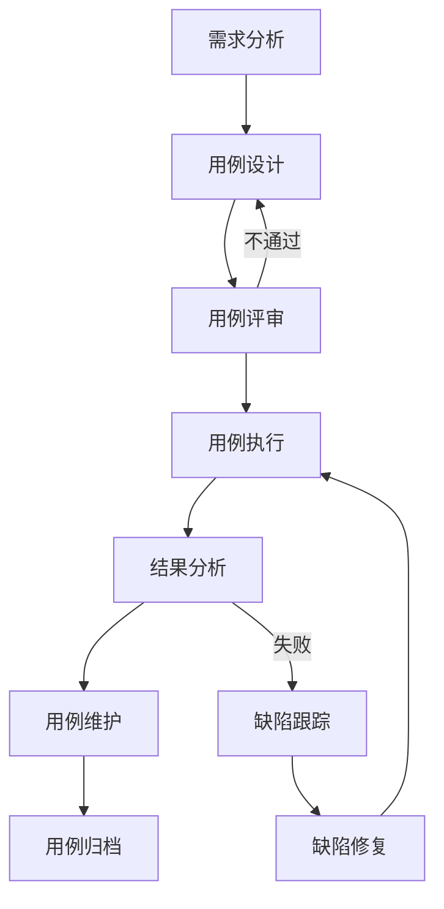

# AI驱动内容代理系统 - 测试用例管理

## 📋 概述

本文档详细定义了AI驱动内容代理系统的测试用例管理体系，包括功能测试用例、性能测试用例、安全测试用例和用户体验测试用例的设计、执行和维护标准。

## 🎯 测试用例分类体系

### 测试用例层级结构

```
测试用例体系
├── 功能测试用例 (60%)
│   ├── 核心功能测试
│   ├── 边界条件测试
│   └── 异常处理测试
├── 集成测试用例 (20%)
│   ├── API集成测试
│   ├── 数据库集成测试
│   └── 第三方服务集成测试
├── 性能测试用例 (10%)
│   ├── 负载测试
│   ├── 压力测试
│   └── 稳定性测试
├── 安全测试用例 (5%)
│   ├── 认证授权测试
│   ├── 数据安全测试
│   └── 输入验证测试
└── 用户体验测试用例 (5%)
    ├── 界面交互测试
    ├── 响应时间测试
    └── 可访问性测试
```

## 🔧 功能测试用例

### 内容改写功能测试

#### TC-001: 基础内容改写测试

**测试目标**: 验证系统能够正确改写输入的文本内容

**前置条件**:
- 系统已启动并运行正常
- API密钥配置正确
- 测试用户已登录

**测试步骤**:
1. 访问内容改写页面
2. 在输入框中输入测试文本："人工智能正在改变我们的生活方式"
3. 选择改写风格："正式"
4. 点击"开始改写"按钮
5. 等待改写完成

**预期结果**:
- 系统成功接收输入内容
- 改写过程显示进度指示器
- 改写完成后显示结果
- 改写结果与原文意思相近但表达方式不同
- 改写结果符合选定的风格要求

**验收标准**:
- 改写成功率 ≥ 95%
- 改写时间 ≤ 10秒
- 改写结果质量评分 ≥ 4.0/5.0
- 语法错误率 ≤ 1%

**测试数据**:
```json
{
  "input": "人工智能正在改变我们的生活方式",
  "style": "formal",
  "expectedKeywords": ["人工智能", "改变", "生活"],
  "minLength": 10,
  "maxLength": 100
}
```

#### TC-002: 长文本改写测试

**测试目标**: 验证系统处理长文本内容的改写能力

**前置条件**:
- 系统已启动并运行正常
- 准备长度超过1000字的测试文本

**测试步骤**:
1. 输入长度为1500字的测试文章
2. 选择改写风格："学术"
3. 启动改写过程
4. 监控改写进度和系统性能

**预期结果**:
- 系统能够处理长文本输入
- 改写过程稳定，无中断
- 改写结果保持原文结构和逻辑
- 系统资源使用在合理范围内

**验收标准**:
- 支持最大文本长度 ≥ 5000字
- 长文本改写时间 ≤ 60秒
- 内存使用增长 ≤ 100MB
- 改写完整性 ≥ 98%

#### TC-003: 多语言内容改写测试

**测试目标**: 验证系统对不同语言内容的改写支持

**测试步骤**:
1. 分别输入中文、英文、日文测试内容
2. 对每种语言执行改写操作
3. 验证改写结果的语言一致性

**预期结果**:
- 正确识别输入语言
- 改写结果保持原语言
- 语法和表达符合目标语言习惯

**测试数据**:
```json
{
  "chinese": "科技发展推动社会进步",
  "english": "Technology drives social progress",
  "japanese": "技術の発展が社会の進歩を推進する"
}
```

### 文章生成功能测试

#### TC-101: 基础文章生成测试

**测试目标**: 验证系统根据主题生成完整文章的能力

**前置条件**:
- 文章生成服务正常运行
- 模板库已加载

**测试步骤**:
1. 访问文章生成页面
2. 输入文章主题："人工智能在教育领域的应用"
3. 选择文章类型："技术分析"
4. 设置文章长度："中等（800-1200字）"
5. 点击"生成文章"按钮

**预期结果**:
- 生成的文章结构完整（标题、引言、正文、结论）
- 内容与主题高度相关
- 文章长度符合设定要求
- 语言表达流畅自然

**验收标准**:
- 文章生成成功率 ≥ 90%
- 主题相关性评分 ≥ 4.5/5.0
- 文章结构完整性 ≥ 95%
- 生成时间 ≤ 30秒

#### TC-102: 自定义模板文章生成测试

**测试目标**: 验证使用自定义模板生成文章的功能

**测试步骤**:
1. 创建自定义文章模板
2. 设置模板参数和样式
3. 使用模板生成文章
4. 验证生成结果符合模板要求

**预期结果**:
- 文章格式符合自定义模板
- 样式和结构按模板要求生成
- 内容填充完整准确

### 工作流管理测试

#### TC-201: 工作流选择测试

**测试目标**: 验证用户能够正确选择和切换工作流

**测试步骤**:
1. 访问工作流选择页面
2. 查看可用工作流列表
3. 选择"通用内容生成"工作流
4. 验证工作流激活状态
5. 切换到"专业文章写作"工作流

**预期结果**:
- 工作流列表正确显示
- 选择操作响应及时
- 工作流状态正确更新
- 界面反馈清晰明确

**验收标准**:
- 工作流加载时间 ≤ 3秒
- 切换响应时间 ≤ 1秒
- 状态同步准确率 100%

#### TC-202: 工作流执行测试

**测试目标**: 验证选定工作流的完整执行过程

**测试步骤**:
1. 选择"技术文档生成"工作流
2. 按工作流要求输入参数
3. 启动工作流执行
4. 监控执行进度
5. 验证最终输出结果

**预期结果**:
- 工作流按预定步骤执行
- 每个步骤状态正确更新
- 最终结果符合工作流定义
- 执行过程可追踪和监控

## 🔗 集成测试用例

### API集成测试

#### TC-301: 内容渲染API集成测试

**测试目标**: 验证前端与内容渲染API的集成

**测试步骤**:
```javascript
// 测试代码示例
describe('内容渲染API集成测试', () => {
  test('应该成功调用渲染API', async () => {
    const response = await fetch('/api/v1/render', {
      method: 'POST',
      headers: {
        'Content-Type': 'application/json',
        'Authorization': 'Bearer test-token'
      },
      body: JSON.stringify({
        content: '测试内容',
        template: 'article_wechat',
        options: {
          style: 'modern',
          color: 'blue'
        }
      })
    });
    
    expect(response.status).toBe(200);
    const result = await response.json();
    expect(result.success).toBe(true);
    expect(result.renderedContent).toBeDefined();
  });
});
```

**验收标准**:
- API响应时间 ≤ 5秒
- 成功率 ≥ 99%
- 错误处理完整
- 数据格式正确

#### TC-302: 数据库集成测试

**测试目标**: 验证应用与数据库的数据交互

**测试步骤**:
1. 创建测试数据
2. 执行CRUD操作
3. 验证数据一致性
4. 测试事务处理
5. 清理测试数据

**预期结果**:
- 数据操作成功执行
- 数据完整性保持
- 事务正确提交或回滚
- 并发操作处理正确

### 第三方服务集成测试

#### TC-303: AI服务集成测试

**测试目标**: 验证与外部AI服务的集成稳定性

**测试步骤**:
1. 配置AI服务连接参数
2. 发送测试请求到AI服务
3. 处理AI服务响应
4. 验证结果格式和质量
5. 测试错误恢复机制

**预期结果**:
- AI服务调用成功
- 响应数据格式正确
- 错误处理机制有效
- 服务降级策略生效

## ⚡ 性能测试用例

### 负载测试

#### TC-401: 并发用户负载测试

**测试目标**: 验证系统在多用户并发访问下的性能表现

**测试配置**:
- 并发用户数：100
- 测试持续时间：10分钟
- 请求间隔：1-3秒随机

**测试脚本**:
```javascript
// K6负载测试脚本
import http from 'k6/http';
import { check, sleep } from 'k6';

export let options = {
  stages: [
    { duration: '2m', target: 20 },  // 2分钟内增加到20用户
    { duration: '5m', target: 100 }, // 5分钟内增加到100用户
    { duration: '2m', target: 100 }, // 保持100用户2分钟
    { duration: '1m', target: 0 },   // 1分钟内减少到0用户
  ],
};

export default function() {
  let response = http.post('http://localhost:8787/api/v1/render', {
    content: '测试内容',
    template: 'article_wechat'
  });
  
  check(response, {
    '状态码为200': (r) => r.status === 200,
    '响应时间小于10秒': (r) => r.timings.duration < 10000,
    '返回成功标识': (r) => JSON.parse(r.body).success === true,
  });
  
  sleep(Math.random() * 2 + 1); // 1-3秒随机等待
}
```

**验收标准**:
- 平均响应时间 ≤ 5秒
- 95%请求响应时间 ≤ 10秒
- 错误率 ≤ 1%
- 系统资源使用率 ≤ 80%

#### TC-402: 大数据量处理测试

**测试目标**: 验证系统处理大量数据的能力

**测试步骤**:
1. 准备大量测试数据（10MB文本文件）
2. 批量提交处理请求
3. 监控系统资源使用
4. 验证处理结果完整性

**验收标准**:
- 单次处理数据量 ≥ 10MB
- 批量处理成功率 ≥ 95%
- 内存使用峰值 ≤ 2GB
- 处理时间线性增长

### 压力测试

#### TC-403: 系统极限压力测试

**测试目标**: 确定系统的性能极限和崩溃点

**测试方法**:
- 逐步增加负载直到系统响应异常
- 记录系统崩溃时的负载水平
- 验证系统恢复能力

**关键指标**:
- 最大并发用户数
- 最大吞吐量（TPS）
- 系统恢复时间
- 数据完整性保持

## 🔒 安全测试用例

### 认证授权测试

#### TC-501: API认证测试

**测试目标**: 验证API访问的认证机制

**测试步骤**:
1. 使用无效API密钥访问接口
2. 使用过期API密钥访问接口
3. 使用有效API密钥访问接口
4. 测试API密钥权限范围

**预期结果**:
- 无效密钥返回401错误
- 过期密钥返回403错误
- 有效密钥正常访问
- 权限控制准确生效

#### TC-502: 输入验证测试

**测试目标**: 验证系统对恶意输入的防护能力

**测试用例**:
```javascript
const maliciousInputs = [
  '<script>alert("XSS")</script>',
  'SELECT * FROM users WHERE 1=1',
  '../../../etc/passwd',
  'javascript:alert(1)',
  '{{7*7}}', // 模板注入
  'A'.repeat(10000), // 超长输入
];

maliciousInputs.forEach(input => {
  test(`应该正确处理恶意输入: ${input.substring(0, 20)}...`, async () => {
    const response = await submitContent(input);
    expect(response.status).not.toBe(500);
    expect(response.body).not.toContain('<script>');
  });
});
```

**验收标准**:
- XSS攻击防护有效
- SQL注入防护有效
- 路径遍历防护有效
- 输入长度限制生效

### 数据安全测试

#### TC-503: 敏感数据保护测试

**测试目标**: 验证敏感数据的加密和保护机制

**测试步骤**:
1. 提交包含敏感信息的内容
2. 检查数据库存储格式
3. 验证日志文件内容
4. 测试数据传输加密

**预期结果**:
- 敏感数据加密存储
- 日志不包含明文敏感信息
- 数据传输使用HTTPS
- 访问控制严格执行

## 🎨 用户体验测试用例

### 界面交互测试

#### TC-601: 响应式设计测试

**测试目标**: 验证界面在不同设备上的显示效果

**测试设备**:
- 桌面端：1920x1080, 1366x768
- 平板端：768x1024, 1024x768
- 移动端：375x667, 414x896

**测试步骤**:
1. 在不同分辨率下访问应用
2. 测试界面元素布局
3. 验证交互功能可用性
4. 检查文字和图片显示

**验收标准**:
- 界面元素正确适配
- 功能完全可用
- 文字清晰可读
- 交互响应及时

#### TC-602: 可访问性测试

**测试目标**: 验证应用的无障碍访问支持

**测试工具**: axe-core, WAVE, Lighthouse

**测试项目**:
- 键盘导航支持
- 屏幕阅读器兼容性
- 颜色对比度检查
- 焦点管理
- ARIA标签使用

**验收标准**:
- WCAG 2.1 AA级别合规
- 键盘可完全操作
- 屏幕阅读器正确朗读
- 颜色对比度 ≥ 4.5:1

### 性能体验测试

#### TC-603: 页面加载性能测试

**测试目标**: 验证页面加载速度和用户体验

**测试工具**: Lighthouse, WebPageTest

**关键指标**:
- First Contentful Paint (FCP) ≤ 2秒
- Largest Contentful Paint (LCP) ≤ 4秒
- First Input Delay (FID) ≤ 100ms
- Cumulative Layout Shift (CLS) ≤ 0.1

**测试脚本**:
```javascript
// Lighthouse性能测试
const lighthouse = require('lighthouse');
const chromeLauncher = require('chrome-launcher');

async function runPerformanceTest() {
  const chrome = await chromeLauncher.launch({chromeFlags: ['--headless']});
  const options = {logLevel: 'info', output: 'html', port: chrome.port};
  const runnerResult = await lighthouse('http://localhost:8787', options);
  
  const scores = runnerResult.lhr.categories;
  
  expect(scores.performance.score).toBeGreaterThan(0.9);
  expect(scores.accessibility.score).toBeGreaterThan(0.9);
  expect(scores['best-practices'].score).toBeGreaterThan(0.9);
  
  await chrome.kill();
}
```

## 📊 测试用例管理流程

### 测试用例生命周期



### 测试用例设计原则

1. **完整性**: 覆盖所有功能点和业务场景
2. **独立性**: 每个用例独立执行，不依赖其他用例
3. **可重复性**: 用例执行结果一致可重现
4. **可维护性**: 用例易于理解和修改
5. **有效性**: 能够发现系统缺陷

### 测试用例模板

```markdown
## TC-XXX: [测试用例标题]

**优先级**: [高/中/低]
**测试类型**: [功能/性能/安全/兼容性]
**执行方式**: [手动/自动]
**预计执行时间**: [X分钟]

**测试目标**: 
[描述测试用例要验证的功能或特性]

**前置条件**:
- [列出执行测试前需要满足的条件]
- [包括环境配置、数据准备等]

**测试步骤**:
1. [详细的操作步骤]
2. [每个步骤应该清晰明确]
3. [包括输入数据和操作方法]

**预期结果**:
- [每个步骤的预期输出]
- [最终的验证点]

**验收标准**:
- [量化的成功标准]
- [性能指标要求]

**测试数据**:
```json
{
  "input": "测试输入数据",
  "expected": "预期输出结果"
}
```

**备注**:
[其他需要说明的信息]
```

### 测试用例执行跟踪

#### 执行状态定义

| 状态 | 描述 | 后续动作 |
|------|------|----------|
| **未执行** | 用例尚未开始执行 | 安排执行计划 |
| **执行中** | 用例正在执行过程中 | 继续执行或暂停 |
| **通过** | 用例执行成功，结果符合预期 | 标记完成 |
| **失败** | 用例执行失败，发现缺陷 | 创建缺陷报告 |
| **阻塞** | 由于环境或依赖问题无法执行 | 解决阻塞问题 |
| **跳过** | 由于某些原因跳过执行 | 记录跳过原因 |

#### 执行记录模板

```json
{
  "testCaseId": "TC-001",
  "executionId": "EXE-001-20241219",
  "executor": "测试工程师姓名",
  "executionDate": "2024-12-19T10:00:00Z",
  "environment": "测试环境",
  "status": "通过",
  "actualResult": "实际执行结果描述",
  "defects": [],
  "executionTime": "5分钟",
  "notes": "执行过程中的备注信息"
}
```

## 🔄 测试用例维护

### 定期维护任务

#### 月度维护检查清单

- [ ] 检查失效的测试用例
- [ ] 更新过时的测试数据
- [ ] 优化执行时间过长的用例
- [ ] 合并重复的测试场景
- [ ] 补充新功能的测试用例
- [ ] 更新自动化测试脚本
- [ ] 检查测试环境配置
- [ ] 分析测试覆盖率报告

#### 版本发布前维护

```bash
#!/bin/bash
# scripts/test-case-maintenance.sh

echo "🔧 开始测试用例维护..."

# 1. 检查过时的测试用例
echo "检查过时的测试用例..."
node scripts/check-outdated-tests.js

# 2. 验证测试数据有效性
echo "验证测试数据..."
node scripts/validate-test-data.js

# 3. 更新自动化测试脚本
echo "更新自动化测试脚本..."
npm run test:update-snapshots

# 4. 生成测试覆盖率报告
echo "生成覆盖率报告..."
npm run test:coverage

# 5. 检查测试用例完整性
echo "检查测试用例完整性..."
node scripts/check-test-completeness.js

echo "✅ 测试用例维护完成"
```

### 测试用例质量评估

#### 质量指标

| 指标 | 计算方法 | 目标值 |
|------|----------|--------|
| **用例覆盖率** | (已覆盖功能点 / 总功能点) × 100% | ≥ 90% |
| **用例通过率** | (通过用例数 / 执行用例数) × 100% | ≥ 95% |
| **缺陷发现率** | (发现缺陷数 / 执行用例数) × 100% | 5-15% |
| **用例执行效率** | 平均每个用例执行时间 | ≤ 5分钟 |
| **自动化覆盖率** | (自动化用例数 / 总用例数) × 100% | ≥ 70% |

#### 质量评估脚本

```javascript
// scripts/test-case-quality-assessment.js
class TestCaseQualityAssessment {
  constructor() {
    this.metrics = {
      coverage: 0,
      passRate: 0,
      defectDiscoveryRate: 0,
      executionEfficiency: 0,
      automationCoverage: 0
    };
  }
  
  async assessQuality() {
    const testCases = await this.loadTestCases();
    const executionResults = await this.loadExecutionResults();
    
    this.calculateCoverage(testCases);
    this.calculatePassRate(executionResults);
    this.calculateDefectDiscoveryRate(executionResults);
    this.calculateExecutionEfficiency(executionResults);
    this.calculateAutomationCoverage(testCases);
    
    return this.generateQualityReport();
  }
  
  calculateCoverage(testCases) {
    const totalFeatures = this.getTotalFeatures();
    const coveredFeatures = new Set();
    
    testCases.forEach(testCase => {
      testCase.coveredFeatures.forEach(feature => {
        coveredFeatures.add(feature);
      });
    });
    
    this.metrics.coverage = (coveredFeatures.size / totalFeatures) * 100;
  }
  
  generateQualityReport() {
    const report = {
      timestamp: new Date().toISOString(),
      metrics: this.metrics,
      recommendations: this.generateRecommendations(),
      overallScore: this.calculateOverallScore()
    };
    
    console.log('测试用例质量评估报告:');
    console.log(`覆盖率: ${this.metrics.coverage.toFixed(2)}%`);
    console.log(`通过率: ${this.metrics.passRate.toFixed(2)}%`);
    console.log(`自动化覆盖率: ${this.metrics.automationCoverage.toFixed(2)}%`);
    console.log(`总体评分: ${report.overallScore}/100`);
    
    return report;
  }
}

// 运行质量评估
const assessment = new TestCaseQualityAssessment();
assessment.assessQuality().then(report => {
  console.log('质量评估完成');
});
```

## 📈 测试度量与报告

### 关键测试指标

#### 执行指标
- 测试用例总数
- 执行用例数
- 通过用例数
- 失败用例数
- 阻塞用例数
- 跳过用例数

#### 质量指标
- 缺陷发现数
- 缺陷密度
- 缺陷修复率
- 回归缺陷数
- 测试覆盖率

#### 效率指标
- 平均执行时间
- 自动化执行比例
- 测试环境可用率
- 测试数据准备时间

### 测试报告模板

```markdown
# 测试执行报告

## 执行概要

**测试周期**: 2024-12-19 至 2024-12-20
**测试版本**: v1.2.0
**测试环境**: 测试环境A
**执行人员**: 测试团队

## 执行统计

| 指标 | 数量 | 百分比 |
|------|------|--------|
| 计划执行用例 | 150 | 100% |
| 实际执行用例 | 148 | 98.7% |
| 通过用例 | 142 | 95.9% |
| 失败用例 | 6 | 4.1% |
| 阻塞用例 | 2 | 1.3% |

## 缺陷统计

| 严重程度 | 发现数量 | 修复数量 | 待修复 |
|----------|----------|----------|--------|
| 严重 | 2 | 2 | 0 |
| 一般 | 8 | 6 | 2 |
| 轻微 | 5 | 3 | 2 |
| **总计** | **15** | **11** | **4** |

## 测试覆盖率

- 功能覆盖率: 92%
- 代码覆盖率: 85%
- 分支覆盖率: 78%
- 条件覆盖率: 82%

## 风险评估

### 高风险项
- [ ] 支付功能存在2个严重缺陷（已修复）
- [ ] 数据导出功能性能不达标

### 中风险项
- [ ] 部分界面在移动端显示异常
- [ ] 批量操作功能稳定性待提升

## 建议与结论

1. **发布建议**: 建议延期发布，待修复剩余4个缺陷
2. **质量评估**: 整体质量良好，核心功能稳定
3. **改进建议**: 加强移动端测试，提升自动化覆盖率

---
**报告生成时间**: 2024-12-19 18:00:00
**报告生成人**: 测试负责人
```

## 🎯 未来改进计划

### 短期目标 (1-3个月)
- [ ] 提升自动化测试覆盖率至80%
- [ ] 建立测试用例自动生成机制
- [ ] 优化测试执行效率，减少50%执行时间
- [ ] 实现测试结果自动分析和报告生成

### 中期目标 (3-6个月)
- [ ] 建立基于AI的智能测试用例推荐系统
- [ ] 实现跨平台自动化测试
- [ ] 建立性能基准测试数据库
- [ ] 集成安全测试到CI/CD流程

### 长期目标 (6-12个月)
- [ ] 实现测试用例自适应优化
- [ ] 建立预测性质量分析模型
- [ ] 实现全链路自动化测试
- [ ] 建立测试知识库和最佳实践库

---

**文档版本**: v1.0.0  
**最后更新**: 2024-12-19  
**维护者**: AI驱动内容代理系统测试团队  
**审核者**: 质量保证负责人