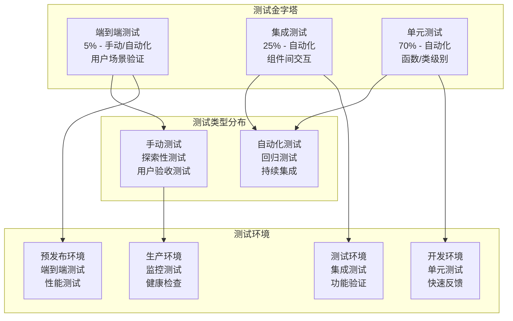

# AI驱动内容代理系统 - 测试策略

## 📋 概述

本文档定义了AI驱动内容代理系统的全面测试策略，包括测试金字塔、测试类型、测试环境、自动化策略和质量保证流程。

## 🎯 测试目标

### 主要目标
- **功能正确性**: 确保所有功能按预期工作
- **性能稳定性**: 验证系统在各种负载下的表现
- **安全可靠性**: 确保系统安全性和数据保护
- **用户体验**: 保证良好的用户交互体验
- **兼容性**: 验证跨平台和跨浏览器兼容性

### 质量指标
- **代码覆盖率**: ≥ 80%
- **测试通过率**: ≥ 95%
- **缺陷逃逸率**: ≤ 2%
- **自动化覆盖率**: ≥ 70%
- **测试执行效率**: 完整测试套件 ≤ 30分钟

## 🏗️ 测试金字塔

### 测试金字塔架构图


### 测试层级详解

#### 1. 单元测试 (70%)
- **范围**: 函数、类、模块级别
- **工具**: Vitest, Jest
- **执行**: 开发过程中持续执行
- **目标**: 快速反馈，确保代码逻辑正确

#### 2. 集成测试 (25%)
- **范围**: 组件间交互、API集成
- **工具**: Supertest, Playwright
- **执行**: CI/CD 流水线
- **目标**: 验证组件协作和数据流

#### 3. 端到端测试 (5%)
- **范围**: 完整用户场景
- **工具**: Playwright, Cypress
- **执行**: 发布前和定期执行
- **目标**: 验证用户体验和业务流程

## 🧪 测试类型

### 1. 功能测试

#### 1.1 API 功能测试
```javascript
// tests/api/content-generation.test.js
import { describe, it, expect, beforeAll, afterAll } from 'vitest';
import { ContentAgent } from '../../src/core/content-agent.js';
import { MockDifyClient } from '../mocks/dify-client.js';

describe('内容生成 API 测试', () => {
  let contentAgent;
  let mockDifyClient;
  
  beforeAll(() => {
    mockDifyClient = new MockDifyClient();
    contentAgent = new ContentAgent({
      DIFY_API_URL: 'https://mock-dify.com',
      DIFY_API_KEY: 'mock-key',
      difyClient: mockDifyClient
    });
  });
  
  describe('通用内容改写', () => {
    it('应该成功改写文本内容', async () => {
      // 准备测试数据
      const input = {
        content: '这是一段需要改写的原始内容',
        style: 'professional',
        length: 'medium'
      };
      
      // 模拟 Dify 响应
      mockDifyClient.mockResponse({
        data: {
          outputs: {
            rewritten_content: '这是经过专业改写的内容，表达更加准确和规范。'
          }
        }
      });
      
      // 执行测试
      const result = await contentAgent.rewriteContent(input);
      
      // 验证结果
      expect(result).toBeDefined();
      expect(result.content).toContain('专业改写');
      expect(result.metadata.style).toBe('professional');
      expect(mockDifyClient.getLastRequest()).toMatchObject({
        inputs: {
          original_content: input.content,
          target_style: input.style,
          target_length: input.length
        }
      });
    });
    
    it('应该处理空内容输入', async () => {
      const input = { content: '', style: 'casual' };
      
      await expect(contentAgent.rewriteContent(input))
        .rejects
        .toThrow('内容不能为空');
    });
    
    it('应该处理 API 错误', async () => {
      const input = {
        content: '测试内容',
        style: 'professional'
      };
      
      mockDifyClient.mockError(new Error('API 服务不可用'));
      
      await expect(contentAgent.rewriteContent(input))
        .rejects
        .toThrow('内容生成服务暂时不可用');
    });
  });
  
  describe('AI 文章生成', () => {
    it('应该根据主题生成文章', async () => {
      const input = {
        topic: '人工智能的发展趋势',
        length: 'long',
        tone: 'informative',
        keywords: ['AI', '机器学习', '深度学习']
      };
      
      mockDifyClient.mockResponse({
        data: {
          outputs: {
            article_title: '人工智能发展的新纪元：技术革新与未来展望',
            article_content: '人工智能作为21世纪最重要的技术革命...',
            article_summary: '本文探讨了人工智能的最新发展趋势...'
          }
        }
      });
      
      const result = await contentAgent.generateArticle(input);
      
      expect(result).toBeDefined();
      expect(result.title).toContain('人工智能');
      expect(result.content).toContain('技术革命');
      expect(result.summary).toBeDefined();
      expect(result.metadata.keywords).toEqual(input.keywords);
    });
    
    it('应该验证必需参数', async () => {
      const input = { length: 'short' }; // 缺少 topic
      
      await expect(contentAgent.generateArticle(input))
        .rejects
        .toThrow('主题是必需的');
    });
  });
});
```

#### 1.2 模板渲染测试
```javascript
// tests/templates/template-renderer.test.js
import { describe, it, expect } from 'vitest';
import { TemplateRenderer } from '../../src/templates/template-renderer.js';
import { TEMPLATE_CONFIGS } from '../../src/templates/template-configs.js';

describe('模板渲染器测试', () => {
  let renderer;
  
  beforeEach(() => {
    renderer = new TemplateRenderer();
  });
  
  describe('简约现代模板', () => {
    it('应该正确渲染基本内容', () => {
      const content = {
        title: '测试标题',
        content: '测试内容',
        author: '测试作者'
      };
      
      const result = renderer.render('modern-minimal', content);
      
      expect(result).toContain('<h1>测试标题</h1>');
      expect(result).toContain('<p>测试内容</p>');
      expect(result).toContain('测试作者');
      expect(result).toContain('modern-minimal');
    });
    
    it('应该处理缺失的可选字段', () => {
      const content = {
        title: '测试标题',
        content: '测试内容'
        // 缺少 author
      };
      
      const result = renderer.render('modern-minimal', content);
      
      expect(result).toContain('<h1>测试标题</h1>');
      expect(result).toContain('<p>测试内容</p>');
      expect(result).not.toContain('undefined');
    });
    
    it('应该应用响应式样式', () => {
      const content = { title: '测试', content: '内容' };
      const result = renderer.render('modern-minimal', content);
      
      expect(result).toContain('@media');
      expect(result).toContain('max-width');
      expect(result).toContain('flex');
    });
  });
  
  describe('商务专业模板', () => {
    it('应该包含商务样式元素', () => {
      const content = {
        title: '商务报告',
        content: '报告内容',
        company: '测试公司'
      };
      
      const result = renderer.render('business-professional', content);
      
      expect(result).toContain('business-professional');
      expect(result).toContain('测试公司');
      expect(result).toContain('serif'); // 商务字体
    });
  });
  
  describe('错误处理', () => {
    it('应该处理不存在的模板', () => {
      const content = { title: '测试' };
      
      expect(() => renderer.render('non-existent', content))
        .toThrow('模板不存在: non-existent');
    });
    
    it('应该处理空内容', () => {
      expect(() => renderer.render('modern-minimal', null))
        .toThrow('内容不能为空');
    });
  });
});
```

### 2. 性能测试

#### 2.1 负载测试
```javascript
// tests/performance/load-test.js
import { describe, it, expect } from 'vitest';
import { performance } from 'perf_hooks';

describe('性能测试', () => {
  describe('API 响应时间', () => {
    it('内容生成 API 应在 2 秒内响应', async () => {
      const startTime = performance.now();
      
      const response = await fetch('/api/content/rewrite', {
        method: 'POST',
        headers: { 'Content-Type': 'application/json' },
        body: JSON.stringify({
          content: '测试内容',
          style: 'professional'
        })
      });
      
      const endTime = performance.now();
      const responseTime = endTime - startTime;
      
      expect(response.ok).toBe(true);
      expect(responseTime).toBeLessThan(2000); // 2秒
    });
    
    it('模板渲染应在 500ms 内完成', async () => {
      const startTime = performance.now();
      
      const response = await fetch('/api/render/modern-minimal', {
        method: 'POST',
        headers: { 'Content-Type': 'application/json' },
        body: JSON.stringify({
          title: '性能测试',
          content: '这是一个性能测试的内容'.repeat(100)
        })
      });
      
      const endTime = performance.now();
      const responseTime = endTime - startTime;
      
      expect(response.ok).toBe(true);
      expect(responseTime).toBeLessThan(500); // 500ms
    });
  });
  
  describe('并发测试', () => {
    it('应该处理 100 个并发请求', async () => {
      const concurrentRequests = 100;
      const requests = [];
      
      for (let i = 0; i < concurrentRequests; i++) {
        requests.push(
          fetch('/api/content/rewrite', {
            method: 'POST',
            headers: { 'Content-Type': 'application/json' },
            body: JSON.stringify({
              content: `测试内容 ${i}`,
              style: 'casual'
            })
          })
        );
      }
      
      const startTime = performance.now();
      const responses = await Promise.all(requests);
      const endTime = performance.now();
      
      const successfulResponses = responses.filter(r => r.ok);
      const successRate = (successfulResponses.length / concurrentRequests) * 100;
      const totalTime = endTime - startTime;
      
      expect(successRate).toBeGreaterThan(95); // 95% 成功率
      expect(totalTime).toBeLessThan(10000); // 10秒内完成
    });
  });
  
  describe('内存使用测试', () => {
    it('大量数据处理不应导致内存泄漏', async () => {
      const initialMemory = process.memoryUsage().heapUsed;
      
      // 处理大量数据
      for (let i = 0; i < 1000; i++) {
        const largeContent = 'x'.repeat(10000);
        await fetch('/api/content/rewrite', {
          method: 'POST',
          headers: { 'Content-Type': 'application/json' },
          body: JSON.stringify({
            content: largeContent,
            style: 'professional'
          })
        });
      }
      
      // 强制垃圾回收
      if (global.gc) {
        global.gc();
      }
      
      const finalMemory = process.memoryUsage().heapUsed;
      const memoryIncrease = finalMemory - initialMemory;
      const memoryIncreasePercent = (memoryIncrease / initialMemory) * 100;
      
      expect(memoryIncreasePercent).toBeLessThan(50); // 内存增长不超过50%
    });
  });
});
```

### 3. 安全测试

#### 3.1 输入验证测试
```javascript
// tests/security/input-validation.test.js
import { describe, it, expect } from 'vitest';
import { InputValidator } from '../../src/utils/input-validator.js';

describe('输入验证安全测试', () => {
  let validator;
  
  beforeEach(() => {
    validator = new InputValidator();
  });
  
  describe('XSS 防护', () => {
    it('应该过滤恶意脚本', () => {
      const maliciousInputs = [
        '<iframe src="javascript:alert(1)"></iframe>'
      ];
      
      maliciousInputs.forEach(input => {
        const sanitized = validator.sanitizeInput(input);
        expect(sanitized).not.toContain('<script>');
        expect(sanitized).not.toContain('javascript:');
        expect(sanitized).not.toContain('onerror');
        expect(sanitized).not.toContain('onload');
      });
    });
    
    it('应该保留安全的HTML标签', () => {
      const safeInputs = [
        '<p>这是安全的段落</p>',
        '<strong>粗体文本</strong>',
        '<em>斜体文本</em>',
        '<ul><li>列表项</li></ul>'
      ];
      
      safeInputs.forEach(input => {
        const sanitized = validator.sanitizeInput(input);
        expect(sanitized).toBe(input);
      });
    });
  });
  
  describe('SQL 注入防护', () => {
    it('应该过滤SQL注入尝试', () => {
      const sqlInjectionInputs = [
        "'; DROP TABLE users; --",
        "1' OR '1'='1",
        "UNION SELECT * FROM admin",
        "<script>alert('XSS')</script>"
      ];
      
      sqlInjectionInputs.forEach(input => {
        const sanitized = validator.sanitizeInput(input);
        expect(sanitized).not.toContain('DROP');
        expect(sanitized).not.toContain('UNION');
        expect(sanitized).not.toContain('SELECT');
        expect(sanitized).not.toContain("'");
      });
    });
  });
  
  describe('输入长度限制', () => {
    it('应该限制输入长度', () => {
      const longInput = 'x'.repeat(10000);
      const result = validator.validateContentLength(longInput, 5000);
      
      expect(result.isValid).toBe(false);
      expect(result.error).toContain('内容长度超出限制');
    });
    
    it('应该接受合理长度的输入', () => {
      const normalInput = 'x'.repeat(1000);
      const result = validator.validateContentLength(normalInput, 5000);
      
      expect(result.isValid).toBe(true);
      expect(result.error).toBeNull();
    });
  });
  
  describe('API密钥验证', () => {
    it('应该验证API密钥格式', () => {
      const validKeys = [
        'sk-1234567890abcdef1234567890abcdef',
        'dify-key-abcdef123456'
      ];
      
      const invalidKeys = [
        'invalid-key',
        '',
        'sk-short',
        null,
        undefined
      ];
      
      validKeys.forEach(key => {
        expect(validator.validateApiKey(key)).toBe(true);
      });
      
      invalidKeys.forEach(key => {
        expect(validator.validateApiKey(key)).toBe(false);
      });
    });
  });
});
```

#### 3.2 认证和授权测试
```javascript
// tests/security/auth.test.js
import { describe, it, expect, beforeEach } from 'vitest';
import { AuthService } from '../../src/services/auth-service.js';
import { JWTManager } from '../../src/utils/jwt-manager.js';

describe('认证和授权安全测试', () => {
  let authService;
  let jwtManager;
  
  beforeEach(() => {
    authService = new AuthService();
    jwtManager = new JWTManager();
  });
  
  describe('JWT Token 安全', () => {
    it('应该生成安全的JWT Token', () => {
      const payload = { userId: '123', role: 'user' };
      const token = jwtManager.generateToken(payload);
      
      expect(token).toBeDefined();
      expect(token.split('.').length).toBe(3); // header.payload.signature
      
      const decoded = jwtManager.verifyToken(token);
      expect(decoded.userId).toBe('123');
      expect(decoded.role).toBe('user');
    });
    
    it('应该拒绝过期的Token', () => {
      const payload = { userId: '123', exp: Math.floor(Date.now() / 1000) - 3600 };
      const expiredToken = jwtManager.generateToken(payload);
      
      expect(() => jwtManager.verifyToken(expiredToken))
        .toThrow('Token已过期');
    });
    
    it('应该拒绝被篡改的Token', () => {
      const payload = { userId: '123', role: 'user' };
      const token = jwtManager.generateToken(payload);
      const tamperedToken = token.slice(0, -5) + 'xxxxx';
      
      expect(() => jwtManager.verifyToken(tamperedToken))
        .toThrow('Token验证失败');
    });
  });
  
  describe('权限控制', () => {
    it('应该正确验证用户权限', () => {
      const userPermissions = ['read:content', 'write:content'];
      const adminPermissions = ['read:content', 'write:content', 'admin:system'];
      
      expect(authService.hasPermission(userPermissions, 'read:content')).toBe(true);
      expect(authService.hasPermission(userPermissions, 'admin:system')).toBe(false);
      expect(authService.hasPermission(adminPermissions, 'admin:system')).toBe(true);
    });
    
    it('应该防止权限提升攻击', () => {
      const maliciousPayload = {
        userId: '123',
        role: 'admin', // 尝试提升权限
        permissions: ['admin:system']
      };
      
      // 应该从数据库验证权限，而不是信任Token中的权限
      const actualPermissions = authService.getUserPermissions('123');
      expect(actualPermissions).not.toContain('admin:system');
    });
  });
  
  describe('会话管理', () => {
    it('应该正确管理用户会话', () => {
      const sessionId = authService.createSession('user123');
      expect(sessionId).toBeDefined();
      
      const session = authService.getSession(sessionId);
      expect(session.userId).toBe('user123');
      expect(session.createdAt).toBeDefined();
    });
    
    it('应该自动清理过期会话', () => {
      const sessionId = authService.createSession('user123');
      
      // 模拟会话过期
      authService.expireSession(sessionId);
      
      const session = authService.getSession(sessionId);
      expect(session).toBeNull();
    });
  });
});
```

### 4. 集成测试

#### 4.1 API 集成测试
```javascript
// tests/integration/api-integration.test.js
import { describe, it, expect, beforeAll, afterAll } from 'vitest';
import { TestEnvironment } from '../utils/test-environment.js';
import { MockDifyService } from '../mocks/dify-service.js';

describe('API 集成测试', () => {
  let testEnv;
  let mockDifyService;
  
  beforeAll(async () => {
    testEnv = new TestEnvironment();
    await testEnv.setup();
    
    mockDifyService = new MockDifyService();
    await mockDifyService.start();
  });
  
  afterAll(async () => {
    await mockDifyService.stop();
    await testEnv.cleanup();
  });
  
  describe('Dify 工作流集成', () => {
    it('应该成功调用 Dify 工作流', async () => {
      // 1. 创建内容生成请求
      const createResponse = await fetch(`${testEnv.baseUrl}/api/content/generate`, {
        method: 'POST',
        headers: {
          'Content-Type': 'application/json',
          'Authorization': `Bearer ${testEnv.apiKey}`
        },
        body: JSON.stringify({
          workflow: 'dify-article',
          inputs: {
            topic: '人工智能在教育中的应用',
            length: 'medium',
            tone: 'informative'
          }
        })
      });
      
      expect(createResponse.ok).toBe(true);
      const createResult = await createResponse.json();
      expect(createResult.task_id).toBeDefined();
      
      // 2. 轮询任务状态
      let taskStatus = 'running';
      let attempts = 0;
      const maxAttempts = 30;
      
      while (taskStatus === 'running' && attempts < maxAttempts) {
        await new Promise(resolve => setTimeout(resolve, 1000));
        
        const statusResponse = await fetch(`${testEnv.baseUrl}/api/tasks/${createResult.task_id}`, {
          headers: {
            'Authorization': `Bearer ${testEnv.apiKey}`
          }
        });
        
        expect(statusResponse.ok).toBe(true);
        const statusResult = await statusResponse.json();
        taskStatus = statusResult.status;
        attempts++;
      }
      
      expect(taskStatus).toBe('completed');
      
      // 3. 获取生成结果
      const resultResponse = await fetch(`${testEnv.baseUrl}/api/tasks/${createResult.task_id}/result`, {
        headers: {
          'Authorization': `Bearer ${testEnv.apiKey}`
        }
      });
      
      expect(resultResponse.ok).toBe(true);
      const result = await resultResponse.json();
      
      expect(result.content).toBeDefined();
      expect(result.content.title).toContain('人工智能');
      expect(result.content.article).toContain('教育');
      expect(result.metadata.word_count).toBeGreaterThan(200);
    });
    
    it('应该处理工作流错误', async () => {
      const response = await fetch(`${testEnv.baseUrl}/api/content/generate`, {
        method: 'POST',
        headers: {
          'Content-Type': 'application/json',
          'Authorization': `Bearer ${testEnv.apiKey}`
        },
        body: JSON.stringify({
          workflow: 'invalid-workflow',
          inputs: {}
        })
      });
      
      expect(response.status).toBe(400);
      const error = await response.json();
      expect(error.message).toContain('工作流不存在');
    });
  });
  
  describe('模板渲染集成', () => {
    it('应该完成内容生成和模板渲染的完整流程', async () => {
      // 1. 生成内容
      const contentResponse = await fetch(`${testEnv.baseUrl}/api/content/rewrite`, {
        method: 'POST',
        headers: {
          'Content-Type': 'application/json',
          'Authorization': `Bearer ${testEnv.apiKey}`
        },
        body: JSON.stringify({
          content: '这是需要改写的原始内容',
          style: 'professional'
        })
      });
      
      expect(contentResponse.ok).toBe(true);
      const contentResult = await contentResponse.json();
      
      // 2. 渲染模板
      const renderResponse = await fetch(`${testEnv.baseUrl}/api/render/business-professional`, {
        method: 'POST',
        headers: {
          'Content-Type': 'application/json',
          'Authorization': `Bearer ${testEnv.apiKey}`
        },
        body: JSON.stringify({
          title: '专业文档',
          content: contentResult.content,
          author: '测试用户',
          company: '测试公司'
        })
      });
      
      expect(renderResponse.ok).toBe(true);
      const renderResult = await renderResponse.json();
      
      expect(renderResult.html).toContain('<!DOCTYPE html>');
      expect(renderResult.html).toContain('专业文档');
      expect(renderResult.html).toContain('测试公司');
      expect(renderResult.html).toContain('business-professional');
    });
  });
});
```

### 5. 端到端测试

#### 5.1 用户场景测试
```javascript
// tests/e2e/user-scenarios.spec.js
import { test, expect } from '@playwright/test';

test.describe('用户场景端到端测试', () => {
  test.beforeEach(async ({ page }) => {
    await page.goto('/');
  });
  
  test('用户应该能够完成内容改写流程', async ({ page }) => {
    // 1. 导航到内容改写页面
    await page.click('[data-testid="rewrite-tab"]');
    await expect(page.locator('h2')).toContainText('内容改写');
    
    // 2. 输入原始内容
    const originalContent = '这是一段需要改写的测试内容，用于验证系统的改写功能是否正常工作。';
    await page.fill('[data-testid="content-input"]', originalContent);
    
    // 3. 选择改写风格
    await page.selectOption('[data-testid="style-select"]', 'professional');
    
    // 4. 选择内容长度
    await page.selectOption('[data-testid="length-select"]', 'medium');
    
    // 5. 点击改写按钮
    await page.click('[data-testid="rewrite-button"]');
    
    // 6. 等待加载完成
    await expect(page.locator('[data-testid="loading-spinner"]')).toBeVisible();
    await expect(page.locator('[data-testid="loading-spinner"]')).toBeHidden({ timeout: 30000 });
    
    // 7. 验证改写结果
    const rewrittenContent = await page.locator('[data-testid="rewritten-content"]').textContent();
    expect(rewrittenContent).toBeTruthy();
    expect(rewrittenContent).not.toBe(originalContent);
    expect(rewrittenContent.length).toBeGreaterThan(50);
    
    // 8. 验证元数据显示
    await expect(page.locator('[data-testid="word-count"]')).toBeVisible();
    await expect(page.locator('[data-testid="style-info"]')).toContainText('专业');
    
    // 9. 测试复制功能
    await page.click('[data-testid="copy-button"]');
    await expect(page.locator('[data-testid="copy-success"]')).toBeVisible();
  });
  
  test('用户应该能够生成和预览文章', async ({ page }) => {
    // 1. 导航到文章生成页面
    await page.click('[data-testid="article-tab"]');
    await expect(page.locator('h2')).toContainText('AI 文章生成');
    
    // 2. 输入文章主题
    await page.fill('[data-testid="topic-input"]', '可持续发展的重要性');
    
    // 3. 设置文章参数
    await page.selectOption('[data-testid="length-select"]', 'long');
    await page.selectOption('[data-testid="tone-select"]', 'informative');
    
    // 4. 添加关键词
    await page.fill('[data-testid="keywords-input"]', '环保, 可持续, 绿色发展');
    
    // 5. 生成文章
    await page.click('[data-testid="generate-button"]');
    
    // 6. 等待生成完成
    await expect(page.locator('[data-testid="progress-bar"]')).toBeVisible();
    await expect(page.locator('[data-testid="article-result"]')).toBeVisible({ timeout: 60000 });
    
    // 7. 验证文章内容
    const articleTitle = await page.locator('[data-testid="article-title"]').textContent();
    const articleContent = await page.locator('[data-testid="article-content"]').textContent();
    
    expect(articleTitle).toContain('可持续');
    expect(articleContent).toContain('环保');
    expect(articleContent.length).toBeGreaterThan(500);
    
    // 8. 测试模板预览
    await page.click('[data-testid="preview-button"]');
    await expect(page.locator('[data-testid="template-modal"]')).toBeVisible();
    
    // 9. 选择模板
    await page.click('[data-testid="template-modern-minimal"]');
    await page.click('[data-testid="apply-template"]');
    
    // 10. 验证预览结果
    await expect(page.locator('[data-testid="preview-iframe"]')).toBeVisible();
    
    const iframe = page.frameLocator('[data-testid="preview-iframe"]');
    await expect(iframe.locator('h1')).toContainText('可持续');
  });
  
  test('用户应该能够处理错误情况', async ({ page }) => {
    // 1. 测试空内容提交
    await page.click('[data-testid="rewrite-tab"]');
    await page.click('[data-testid="rewrite-button"]');
    
    await expect(page.locator('[data-testid="error-message"]')).toBeVisible();
    await expect(page.locator('[data-testid="error-message"]')).toContainText('内容不能为空');
    
    // 2. 测试网络错误处理
    await page.route('**/api/content/rewrite', route => {
      route.abort('failed');
    });
    
    await page.fill('[data-testid="content-input"]', '测试内容');
    await page.click('[data-testid="rewrite-button"]');
    
    await expect(page.locator('[data-testid="error-message"]')).toBeVisible();
    await expect(page.locator('[data-testid="error-message"]')).toContainText('网络错误');
    
    // 3. 测试重试功能
    await page.unroute('**/api/content/rewrite');
    await page.click('[data-testid="retry-button"]');
    
    await expect(page.locator('[data-testid="loading-spinner"]')).toBeVisible();
  });
});
```

## 🔧 测试工具和框架

### 测试技术栈
- **单元测试**: Vitest + @testing-library
- **集成测试**: Supertest + Vitest
- **端到端测试**: Playwright
- **性能测试**: Artillery + K6
- **安全测试**: OWASP ZAP + Custom Scripts
- **API 测试**: Postman + Newman

### 测试环境配置
```javascript
// vitest.config.js
import { defineConfig } from 'vitest/config';
import path from 'path';

export default defineConfig({
  test: {
    globals: true,
    environment: 'node',
    setupFiles: ['./tests/setup.js'],
    coverage: {
      provider: 'v8',
      reporter: ['text', 'json', 'html'],
      exclude: [
        'node_modules/',
        'tests/',
        '**/*.config.js',
        'dist/'
      ],
      thresholds: {
        global: {
          branches: 80,
          functions: 80,
          lines: 80,
          statements: 80
        }
      }
    },
    testTimeout: 30000,
    hookTimeout: 10000
  },
  resolve: {
    alias: {
      '@': path.resolve(__dirname, './src')
    }
  }
});
```

### Playwright 配置
```javascript
// playwright.config.js
import { defineConfig, devices } from '@playwright/test';

export default defineConfig({
  testDir: './tests/e2e',
  fullyParallel: true,
  forbidOnly: !!process.env.CI,
  retries: process.env.CI ? 2 : 0,
  workers: process.env.CI ? 1 : undefined,
  reporter: [
    ['html'],
    ['json', { outputFile: 'test-results/results.json' }]
  ],
  use: {
    baseURL: process.env.BASE_URL || 'http://localhost:3000',
    trace: 'on-first-retry',
    screenshot: 'only-on-failure',
    video: 'retain-on-failure'
  },
  projects: [
    {
      name: 'chromium',
      use: { ...devices['Desktop Chrome'] }
    },
    {
      name: 'firefox',
      use: { ...devices['Desktop Firefox'] }
    },
    {
      name: 'webkit',
      use: { ...devices['Desktop Safari'] }
    },
    {
      name: 'Mobile Chrome',
      use: { ...devices['Pixel 5'] }
    },
    {
      name: 'Mobile Safari',
      use: { ...devices['iPhone 12'] }
    }
  ],
  webServer: {
    command: 'npm run dev',
    port: 3000,
    reuseExistingServer: !process.env.CI
  }
});
```

## 📊 测试报告和监控

### 测试指标收集
```javascript
// tests/utils/metrics-collector.js
export class TestMetricsCollector {
  constructor() {
    this.metrics = {
      testResults: [],
      performance: [],
      coverage: {},
      errors: []
    };
  }
  
  recordTestResult(testName, status, duration, error = null) {
    this.metrics.testResults.push({
      name: testName,
      status,
      duration,
      error,
      timestamp: new Date().toISOString()
    });
  }
  
  recordPerformanceMetric(operation, duration, metadata = {}) {
    this.metrics.performance.push({
      operation,
      duration,
      metadata,
      timestamp: new Date().toISOString()
    });
  }
  
  recordError(error, context = {}) {
    this.metrics.errors.push({
      message: error.message,
      stack: error.stack,
      context,
      timestamp: new Date().toISOString()
    });
  }
  
  generateReport() {
    const totalTests = this.metrics.testResults.length;
    const passedTests = this.metrics.testResults.filter(t => t.status === 'passed').length;
    const failedTests = this.metrics.testResults.filter(t => t.status === 'failed').length;
    const avgDuration = this.metrics.testResults.reduce((sum, t) => sum + t.duration, 0) / totalTests;
    
    return {
      summary: {
        total: totalTests,
        passed: passedTests,
        failed: failedTests,
        passRate: (passedTests / totalTests) * 100,
        avgDuration
      },
      performance: this.analyzePerformance(),
      errors: this.metrics.errors,
      coverage: this.metrics.coverage
    };
  }
  
  analyzePerformance() {
    const performanceByOperation = {};
    
    this.metrics.performance.forEach(metric => {
      if (!performanceByOperation[metric.operation]) {
        performanceByOperation[metric.operation] = [];
      }
      performanceByOperation[metric.operation].push(metric.duration);
    });
    
    const analysis = {};
    Object.keys(performanceByOperation).forEach(operation => {
      const durations = performanceByOperation[operation];
      analysis[operation] = {
        count: durations.length,
        avg: durations.reduce((sum, d) => sum + d, 0) / durations.length,
        min: Math.min(...durations),
        max: Math.max(...durations),
        p95: this.percentile(durations, 95)
      };
    });
    
    return analysis;
  }
  
  percentile(arr, p) {
    const sorted = arr.sort((a, b) => a - b);
    const index = Math.ceil((p / 100) * sorted.length) - 1;
    return sorted[index];
  }
}
```

## 🚀 CI/CD 集成

### GitHub Actions 工作流
```yaml
# .github/workflows/test.yml
name: 测试流水线

on:
  push:
    branches: [ main, develop ]
  pull_request:
    branches: [ main ]

jobs:
  unit-tests:
    runs-on: ubuntu-latest
    steps:
      - uses: actions/checkout@v3
      
      - name: 设置 Node.js
        uses: actions/setup-node@v3
        with:
          node-version: '18'
          cache: 'npm'
      
      - name: 安装依赖
        run: npm ci
      
      - name: 运行单元测试
        run: npm run test:unit
      
      - name: 生成覆盖率报告
        run: npm run test:coverage
      
      - name: 上传覆盖率报告
        uses: codecov/codecov-action@v3
        with:
          file: ./coverage/lcov.info
  
  integration-tests:
    runs-on: ubuntu-latest
    needs: unit-tests
    steps:
      - uses: actions/checkout@v3
      
      - name: 设置 Node.js
        uses: actions/setup-node@v3
        with:
          node-version: '18'
          cache: 'npm'
      
      - name: 安装依赖
        run: npm ci
      
      - name: 启动测试服务
        run: |
          npm run build
          npm run start:test &
          sleep 10
      
      - name: 运行集成测试
        run: npm run test:integration
  
  e2e-tests:
    runs-on: ubuntu-latest
    needs: integration-tests
    steps:
      - uses: actions/checkout@v3
      
      - name: 设置 Node.js
        uses: actions/setup-node@v3
        with:
          node-version: '18'
          cache: 'npm'
      
      - name: 安装依赖
        run: npm ci
      
      - name: 安装 Playwright
        run: npx playwright install --with-deps
      
      - name: 构建应用
        run: npm run build
      
      - name: 运行 E2E 测试
        run: npm run test:e2e
      
      - name: 上传测试报告
        uses: actions/upload-artifact@v3
        if: always()
        with:
          name: playwright-report
          path: playwright-report/
          retention-days: 30
  
  performance-tests:
    runs-on: ubuntu-latest
    if: github.event_name == 'push' && github.ref == 'refs/heads/main'
    steps:
      - uses: actions/checkout@v3
      
      - name: 设置 Node.js
        uses: actions/setup-node@v3
        with:
          node-version: '18'
          cache: 'npm'
      
      - name: 安装依赖
        run: npm ci
      
      - name: 运行性能测试
        run: npm run test:performance
      
      - name: 分析性能报告
        run: npm run analyze:performance
```

## 📈 测试最佳实践

### 1. 测试设计原则
- **独立性**: 每个测试应该独立运行，不依赖其他测试
- **可重复性**: 测试结果应该一致和可预测
- **快速反馈**: 单元测试应该快速执行
- **清晰性**: 测试代码应该易于理解和维护
- **覆盖性**: 测试应该覆盖关键功能和边界情况

### 2. 测试数据管理
- 使用测试数据工厂创建一致的测试数据
- 在测试之间清理数据状态
- 使用模拟数据避免外部依赖
- 保护敏感数据不出现在测试中

### 3. 测试维护策略
- 定期审查和更新测试用例
- 删除过时和重复的测试
- 重构测试代码以提高可维护性
- 监控测试执行时间和稳定性

### 4. 错误处理测试
- 测试各种错误场景和边界条件
- 验证错误消息的准确性和有用性
- 测试系统的恢复能力
- 确保错误不会泄露敏感信息

## 🎯 质量门禁

### 代码提交门禁
- 所有单元测试必须通过
- 代码覆盖率不低于 80%
- 静态代码分析无严重问题
- 代码风格检查通过

### 发布门禁
- 所有测试套件通过
- 性能测试满足基准要求
- 安全扫描无高危漏洞
- 端到端测试覆盖主要用户场景

## 📚 测试文档和培训

### 测试文档
- 测试计划和策略文档
- 测试用例设计文档
- 测试环境配置指南
- 测试工具使用手册

### 团队培训
- 测试驱动开发 (TDD) 培训
- 自动化测试工具培训
- 性能测试和优化培训
- 安全测试最佳实践培训

---

**文档版本**: v1.0.0  
**最后更新**: 2024-12-19  
**维护者**: AI驱动内容代理系统开发团队<script>alert("XSS")</script>',
        '',
        'javascript:alert("XSS")',
        '<svg onload="alert(1)">',
        '