# 工作流程图

## 📋 概述

本文档包含AI驱动内容代理系统的各种工作流程图，详细展示了系统的业务流程、操作流程、数据处理流程和用户交互流程。这些流程图有助于理解系统的工作机制，指导开发和运维工作。

## 🔄 核心业务流程

### 1. 用户注册和认证流程

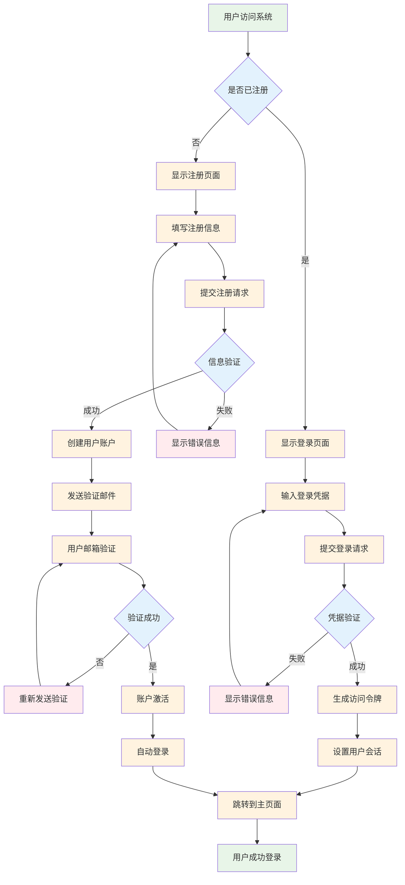

### 2. 内容改写完整流程

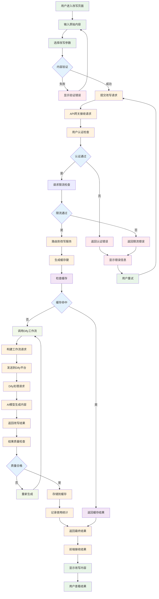

### 3. AI文章生成流程

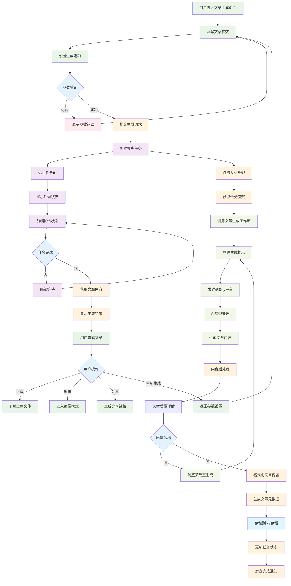

### 4. 模板渲染流程

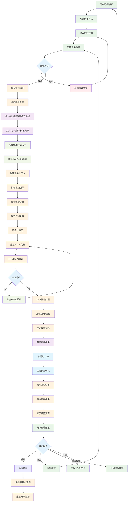

## 🔧 系统管理流程

### 5. 用户管理流程

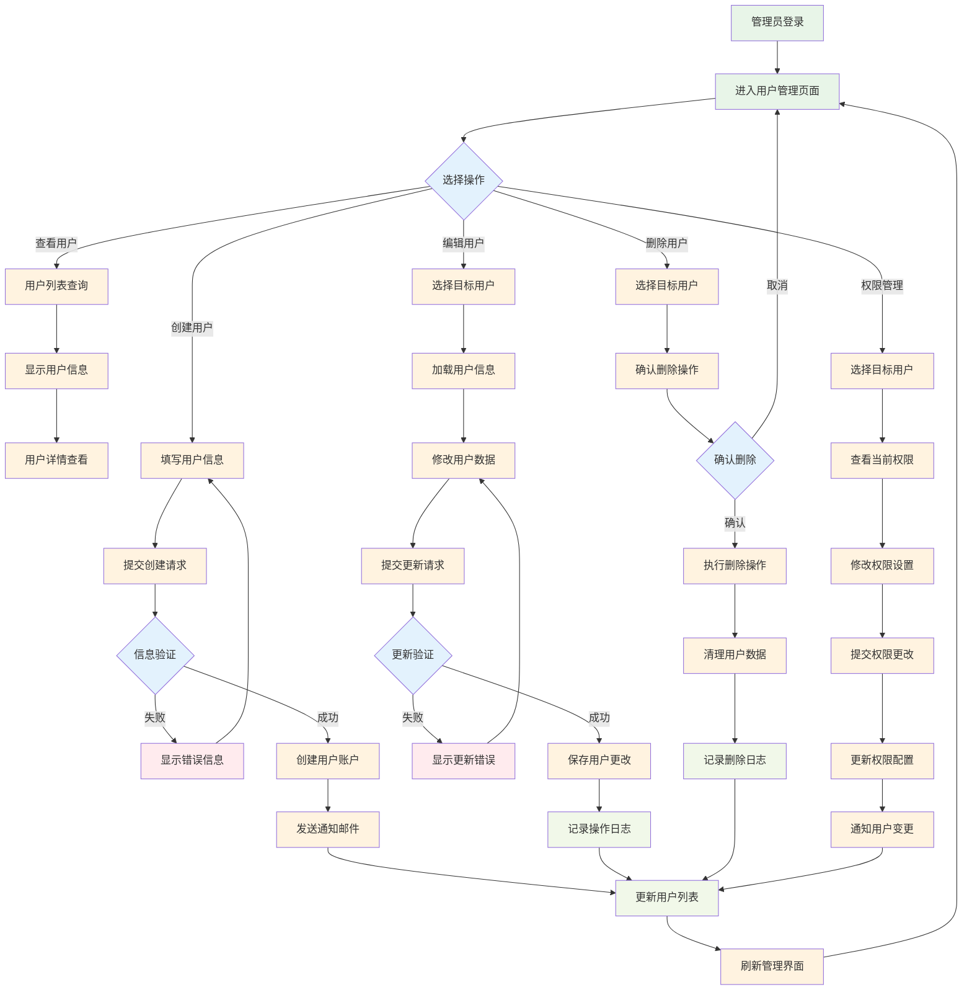

### 6. 系统配置管理流程

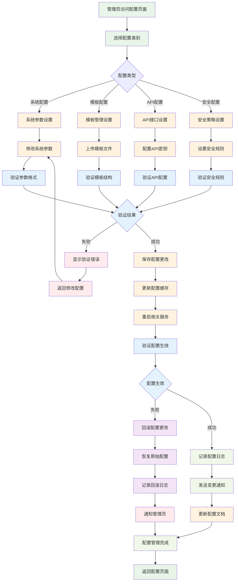

## 📊 数据处理流程

### 7. 数据备份流程

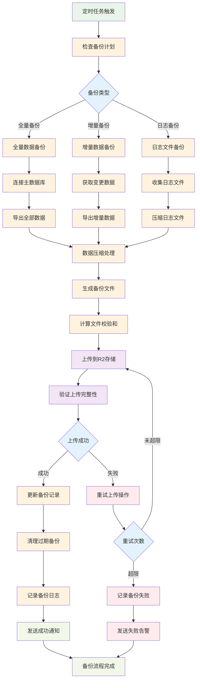

### 8. 数据同步流程

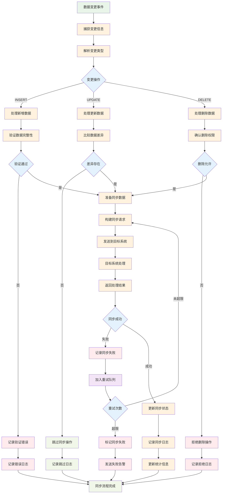

## 🚀 部署发布流程

### 9. CI/CD部署流程

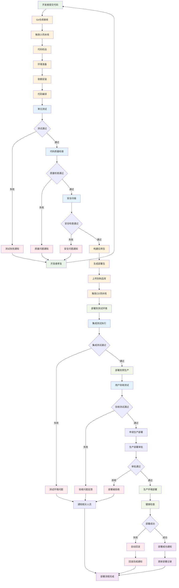

### 10. 版本发布流程

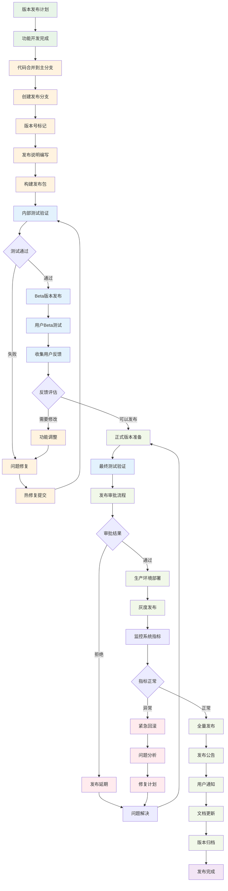

## 🔍 监控告警流程

### 11. 系统监控流程

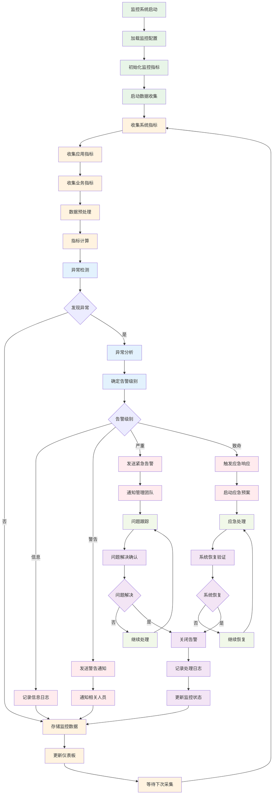

### 12. 故障处理流程

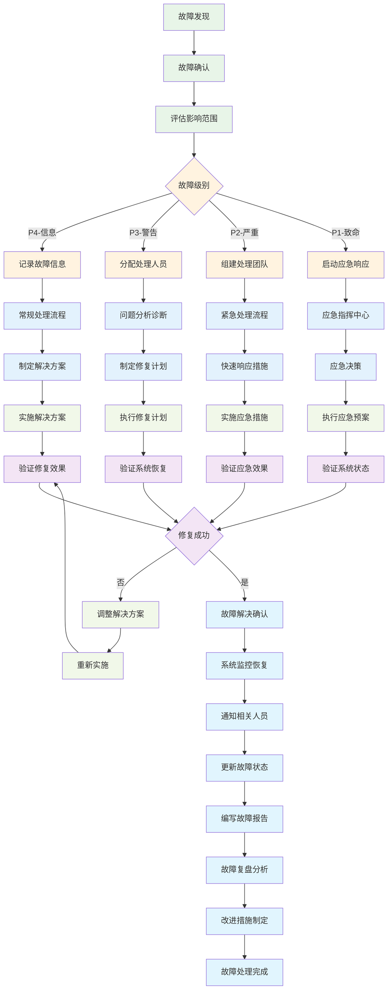

## 📈 性能优化流程

### 13. 性能监控和优化流程

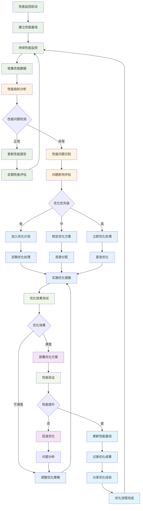

## 📋 流程管理规范

### 流程执行原则

1. **标准化**: 所有流程都应遵循标准化的执行步骤
2. **可追溯**: 每个流程步骤都应有详细的执行记录
3. **可回滚**: 关键流程应支持回滚操作
4. **监控**: 重要流程应有实时监控和告警
5. **持续改进**: 定期评估和优化流程效率

### 流程文档维护

1. **版本控制**: 流程图应进行版本控制管理
2. **定期更新**: 根据系统变更及时更新流程图
3. **审核机制**: 流程变更需要经过审核批准
4. **培训推广**: 新流程需要进行团队培训
5. **反馈收集**: 收集执行过程中的问题和建议

### 流程质量指标

| 指标类别 | 指标名称 | 目标值 | 监控频率 |
|----------|----------|--------|----------|
| 效率指标 | 流程执行时间 | ≤ 预期时间的120% | 实时 |
| 质量指标 | 流程执行成功率 | ≥ 95% | 每日 |
| 稳定性指标 | 流程异常率 | ≤ 5% | 每日 |
| 用户体验 | 用户满意度 | ≥ 4.0/5.0 | 每周 |

---

**文档版本**: v1.0.0  
**最后更新**: 2024-12-19  
**维护者**: AI驱动内容代理系统流程管理团队  
**审核者**: 系统架构师