# 系统架构图

## 📋 概述

本文档包含AI驱动内容代理系统的各种架构图表，通过可视化的方式展示系统的整体架构、组件关系、数据流向和部署结构。这些图表有助于开发团队理解系统设计，便于维护和扩展。

## 🏗️ 整体系统架构

### 系统架构总览

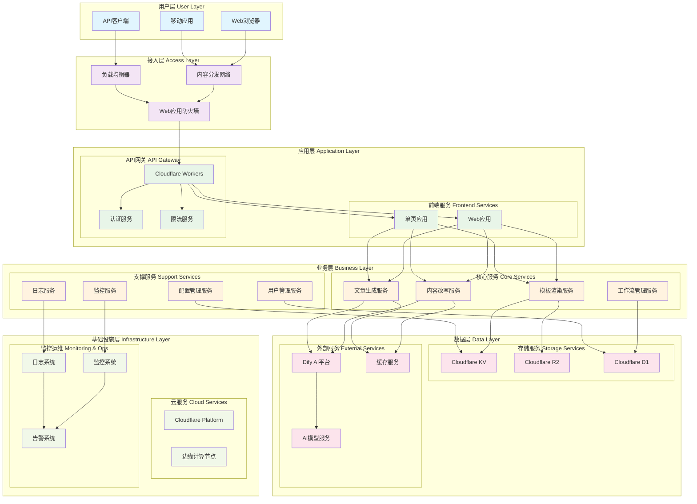

### 架构层次说明

#### 1. 用户层 (User Layer)
- **Web浏览器**: 桌面和移动端浏览器访问
- **移动应用**: 原生移动应用（未来扩展）
- **API客户端**: 第三方集成和开发者工具

#### 2. 接入层 (Access Layer)
- **负载均衡器**: 分发用户请求，提供高可用性
- **内容分发网络**: 静态资源缓存和加速
- **Web应用防火墙**: 安全防护和攻击过滤

#### 3. 应用层 (Application Layer)
- **前端服务**: Web应用和单页应用
- **API网关**: 统一入口，认证和限流

#### 4. 业务层 (Business Layer)
- **核心服务**: 主要业务功能实现
- **支撑服务**: 辅助功能和系统管理

#### 5. 数据层 (Data Layer)
- **存储服务**: 数据持久化和缓存
- **外部服务**: AI服务和第三方集成

#### 6. 基础设施层 (Infrastructure Layer)
- **云服务**: Cloudflare平台服务
- **监控运维**: 系统监控和运维管理

## 🔄 核心业务流程架构

### 内容改写流程架构

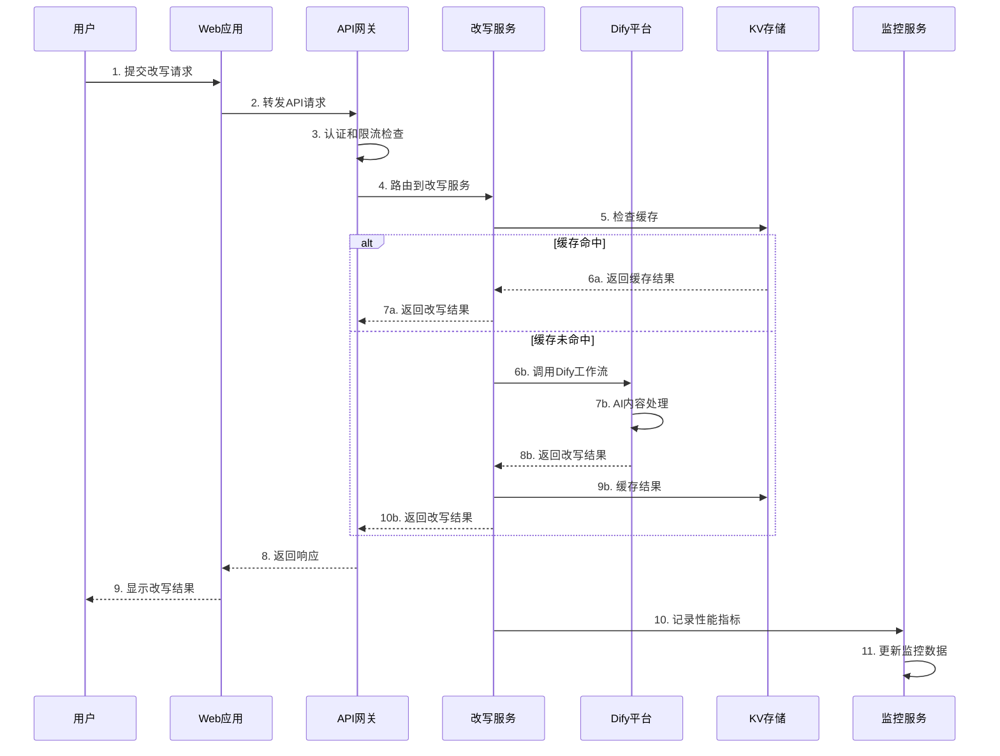

### 文章生成流程架构

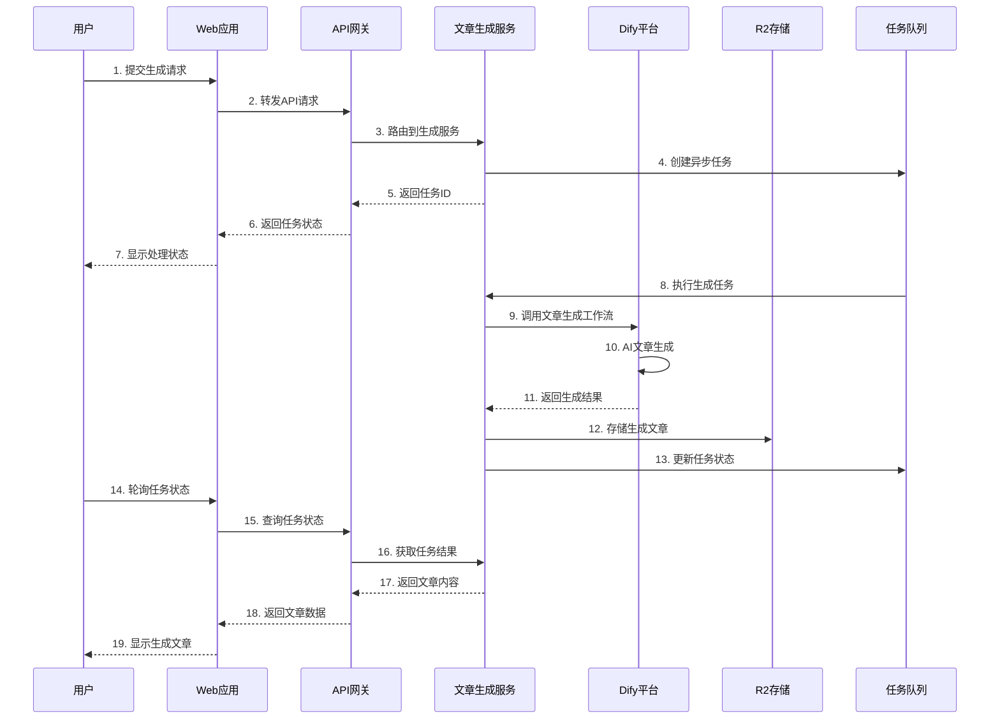

### 模板渲染流程架构

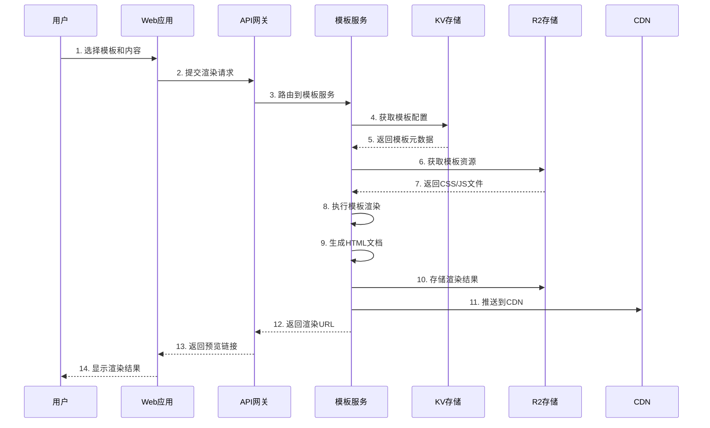

## 🗄️ 数据架构设计

### 数据存储架构

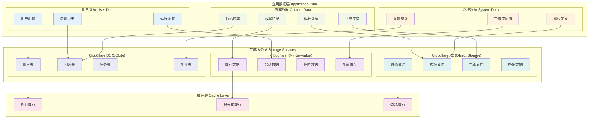

### 数据流向图

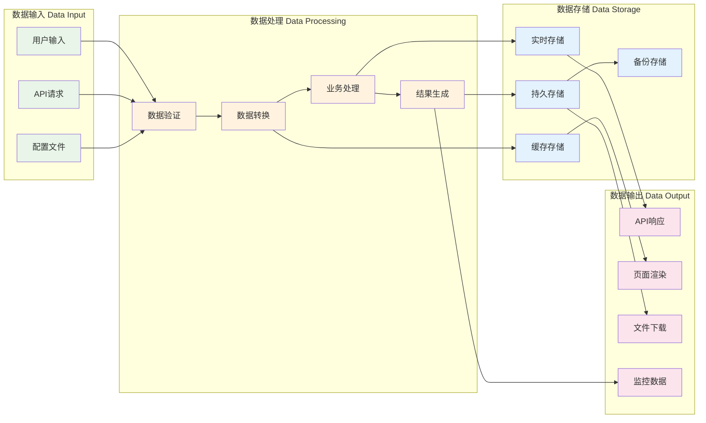

## 🚀 部署架构设计

### Cloudflare部署架构

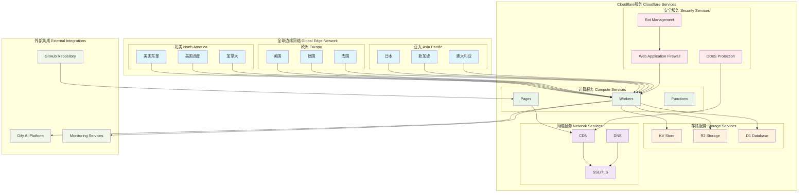

### 环境部署架构

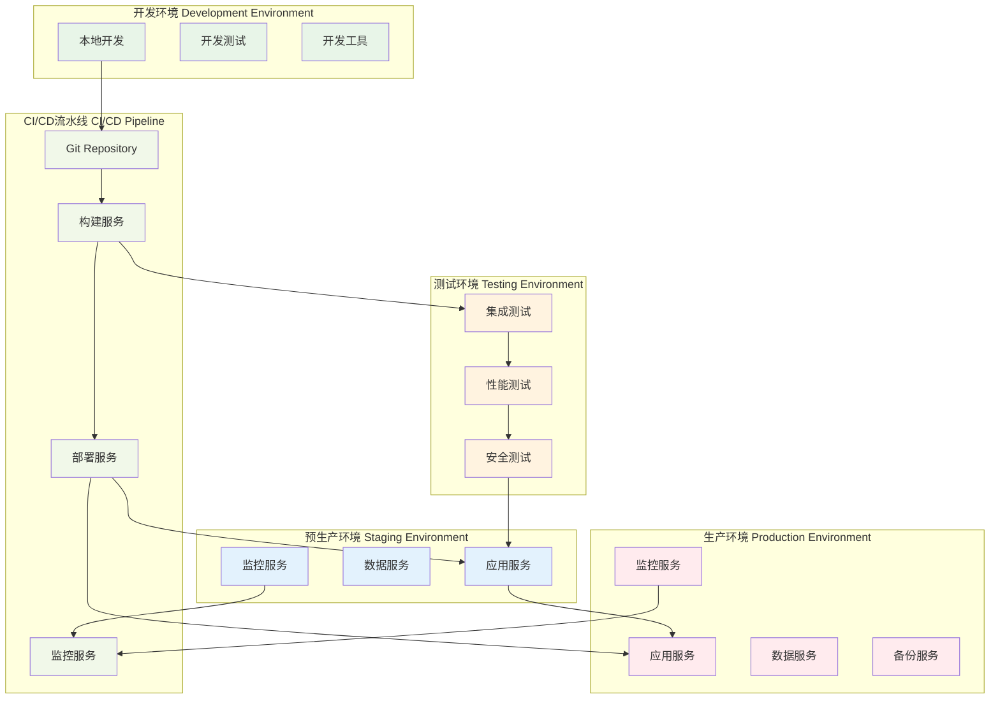

## 🔐 安全架构设计

### 安全防护架构

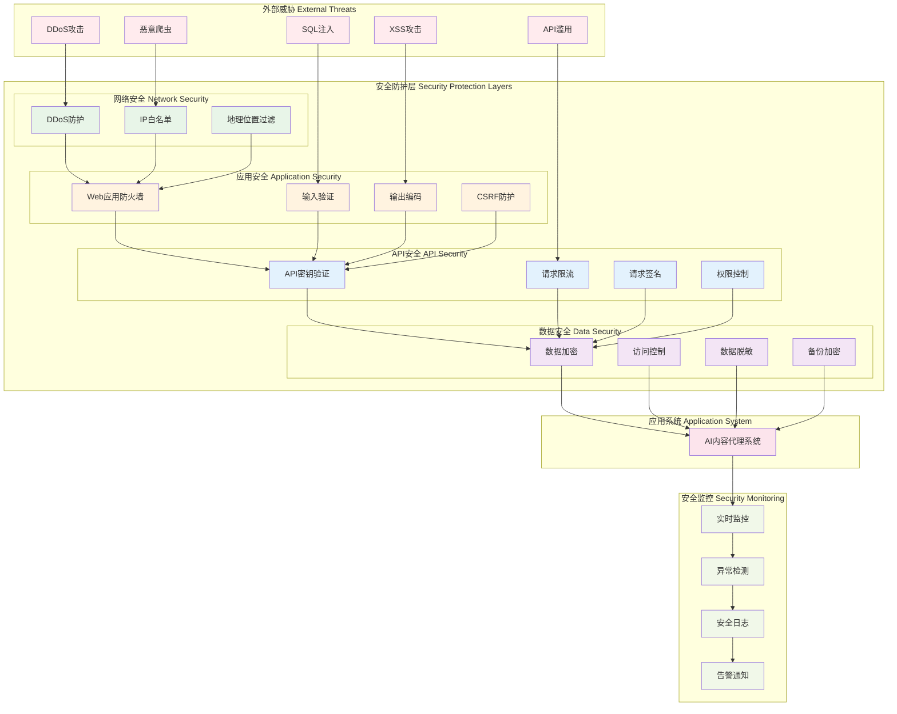

### 认证授权架构

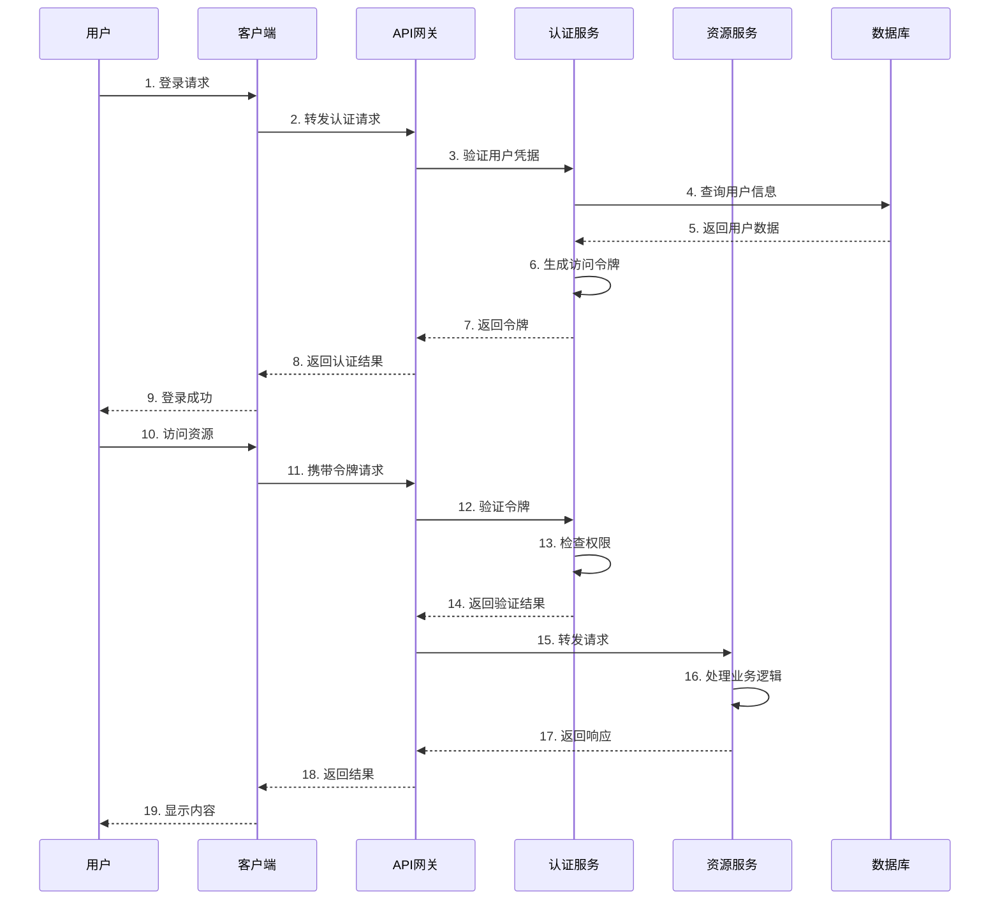

## 📊 监控架构设计

### 监控体系架构

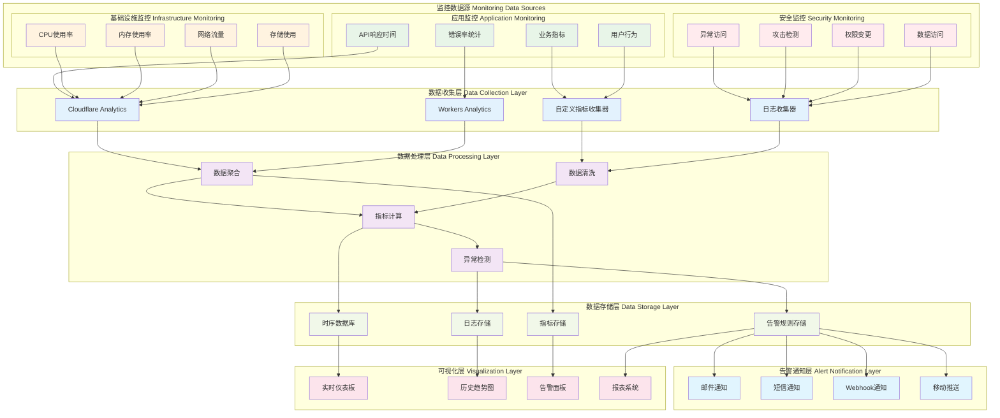

## 🔄 扩展性架构设计

### 水平扩展架构

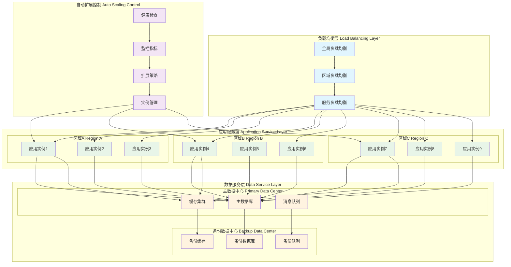

## 📋 架构决策记录

### 技术选型决策

| 决策项 | 选择方案 | 替代方案 | 决策理由 |
|--------|----------|----------|----------|
| 云平台 | Cloudflare | AWS/Azure | 边缘计算优势，成本效益 |
| 前端框架 | React | Vue/Angular | 生态丰富，团队熟悉 |
| 状态管理 | Zustand | Redux/MobX | 轻量级，易于使用 |
| 样式方案 | Tailwind CSS | Styled Components | 原子化CSS，开发效率 |
| 数据库 | Cloudflare D1 | PostgreSQL | 边缘数据库，低延迟 |
| 缓存方案 | Cloudflare KV | Redis | 全球分布，高可用 |
| AI平台 | Dify | OpenAI API | 工作流管理，成本控制 |

### 架构原则

1. **高可用性**: 系统设计支持99.9%以上的可用性
2. **可扩展性**: 支持水平扩展，应对业务增长
3. **安全性**: 多层安全防护，保护用户数据
4. **性能优化**: 边缘计算，全球低延迟访问
5. **成本效益**: 合理的资源使用和成本控制
6. **可维护性**: 模块化设计，便于维护和升级

### 架构约束

1. **技术约束**: 基于Cloudflare平台的技术栈
2. **性能约束**: API响应时间不超过10秒
3. **安全约束**: 符合数据保护法规要求
4. **成本约束**: 月度运营成本控制在预算范围内
5. **合规约束**: 遵循相关行业标准和规范

---

**文档版本**: v1.0.0  
**最后更新**: 2024-12-19  
**维护者**: AI驱动内容代理系统架构团队  
**审核者**: 技术委员会