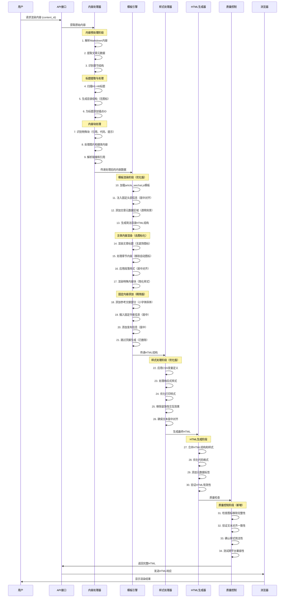

# AI驱动内容代理系统：文本渲染时序图与方法论

## 概述
本文档详细描述了AI驱动内容代理系统中文本渲染的完整流程，从原始内容到最终HTML输出的每个步骤。基于实际项目优化经验，总结出一套完整的模板开发与优化方法论，为类似项目提供可复制的实施指南。

## 优化后的时序图



## 详细步骤说明（基于实际优化经验）

### 1. 内容预处理阶段 (步骤1-3)

#### 1.1 解析Markdown内容
- 将原始Markdown文本转换为AST（抽象语法树）
- 识别各种Markdown元素：标题、段落、列表、代码块等
- 处理内联元素：粗体、斜体、链接、图片等
- **优化要点**：确保解析过程中不自动添加装饰性图标

#### 1.2 提取文章元数据
- 解析YAML前置元数据（如果存在）
- 提取文章标题、作者、发布日期等信息
- 设置默认值和固定模板信息
- **优化要点**：预设固定的作者信息和发布格式，确保一致性

#### 1.3 识别章节结构
- 分析标题层级关系
- 构建文档的逻辑结构树
- 为后续目录生成做准备
- **优化要点**：简化结构识别，避免过度复杂的嵌套处理

### 2. 标题提取与处理 (步骤4-6) - 去图标化优化

#### 2.1 扫描H1-H6标题（优化版）
```javascript
// 优化后的标题扫描逻辑 - 移除自动图标添加
const headers = content.match(/^#{1,6}\s+.+$/gm);
headers.forEach((header, index) => {
    const level = header.match(/^#+/)[0].length;
    const text = header.replace(/^#+\s+/, '').replace(/[🔥💊📊⚡🎯]/g, ''); // 移除emoji图标
    const id = generateAnchorId(text, index);
    // 存储纯文本标题信息，不添加装饰图标
});
```

#### 2.2 生成目录结构（简洁版）
- 根据标题层级构建嵌套的目录结构
- 为每个标题生成唯一的锚点ID
- 创建可点击的目录链接
- **关键优化**：移除目录项前的装饰性图标（如▶、💊等）
- **实施经验**：保持目录的简洁性，提高可读性

#### 2.3 为标题添加锚点ID（纯净版）
- 生成SEO友好的锚点ID
- 确保ID的唯一性
- 支持中文标题的URL编码
- **优化要点**：锚点ID生成时排除emoji和特殊字符

### 3. 内容块处理 (步骤7-9) - 简化样式优化

#### 3.1 识别特殊块（去装饰化）
```javascript
// 优化后的特殊块处理 - 移除自动图标添加
const processSpecialBlocks = (content) => {
    return content
        .replace(/```([\s\S]*?)```/g, (match, code) => {
            return `<div class="code-block">${highlightCode(code)}</div>`; // 无图标装饰
        })
        .replace(/> (.+)/g, '<blockquote>$1</blockquote>') // 简洁引用样式
        .replace(/:::tip([\s\S]*?):::/g, '<div class="tip-block">$1</div>') // 移除tip图标
        .replace(/:::note([\s\S]*?):::/g, '<div class="note-block">$1</div>') // 移除note图标
        .replace(/:::warning([\s\S]*?):::/g, '<div class="warning-block">$1</div>'); // 移除warning图标
};
```

#### 3.2 处理图片和媒体内容（优化版）
- 优化图片路径和尺寸
- 添加懒加载属性
- 生成响应式图片标签
- **优化要点**：确保图片容器无背景装饰，保持简洁

#### 3.3 解析链接和引用（精简版）
- 处理内部链接和外部链接
- 添加链接的安全属性
- 生成引用脚注
- **关键改进**：参考文献采用小字体斜体样式，提高可读性

### 4. 模板渲染阶段 (步骤10-21) - 样式优化重点

#### 4.1 加载模板文件（优化版）
```javascript
// 优化后的模板加载 - 确保选择简洁样式模板
const template = require('./templates/article_wechat.js');
const renderer = new template();
// 设置模板优化参数
renderer.setOptions({
    removeIcons: true,
    transparentBackground: true,
    centerAlign: true
});
```

#### 4.2 注入固定信息（去装饰化）
- 添加固定的头部信息："主笔 / 景九　版面 / 黄静"（居中对齐）
- 插入发布信息："本文首发于2025年1月 全文 / 5000 字 阅读 / 大约 10 分钟"（居中对齐）
- 设置作者信息："作者：ameureka"（居中对齐）
- **关键优化**：所有固定信息采用透明背景，无装饰性图标

#### 4.3 生成HTML结构（样式优化版）
```javascript
// 优化后的HTML结构生成 - 注重样式简洁性
const generateHTML = (data) => {
    return `
        <div class="container">
            <header class="header" style="background: transparent; text-align: center;">
                ${generateHeader(data)}
            </header>
            <main class="article-content">
                ${processContent(data.content)}
            </main>
            <section class="references" style="font-size: 12px; font-style: italic;">
                ${generateReferences()}
            </section>
            <footer class="article-footer" style="text-align: center;">
                ${generateFooter()}
            </footer>
        </div>
    `;
};
```

#### 4.4 数据绑定优化
```javascript
// 优化后的模板数据绑定 - 注重内容纯净性
const templateData = {
    title: article.title.replace(/[🔥💊📊⚡🎯]/g, ''), // 移除标题中的emoji
    content: processedContent,
    toc: generatedTOC, // 确保目录无图标装饰
    meta: {
        author: article.author || '景九', // 固定作者信息
        date: article.date || '本文首发于2025年1月',
        tags: article.tags
    },
    references: extractedReferences, // 应用小字体斜体样式
    styles: {
        headerBackground: 'transparent', // 透明背景
        textAlign: 'center', // 头部信息居中
        referencesStyle: 'font-size: 12px; font-style: italic;' // 参考文献样式
    }
};

const renderedHTML = template.render(templateData);
```

### 5. 样式处理阶段 (步骤22-25) - 基于实际优化的样式策略

#### 5.1 CSS变量定义（优化版）
```css
:root {
    /* 简化后的颜色变量 - 移除过度装饰 */
    --primary-color: #333333;
    --secondary-color: #666666;
    --text-primary: #2c3e50;
    --text-secondary: #7f8c8d;
    --background-transparent: transparent; /* 新增透明背景 */
    --background-light: #ffffff; /* 简化为纯白 */
    --border-light: #e9ecef;
    --shadow-none: none; /* 移除阴影效果 */
    
    /* 新增样式变量 */
    --header-align: center;
    --reference-size: 12px;
    --reference-style: italic;
}
```

#### 5.2 关键样式优化
```css
/* 头部信息样式优化 */
.article-header {
    background: var(--background-transparent);
    text-align: var(--header-align);
    padding: 20px 0;
}

.author-info, .publish-info {
    text-align: center;
    color: var(--text-secondary);
    margin: 10px 0;
}

/* 参考文献样式优化 */
.references li {
    font-size: var(--reference-size);
    font-style: var(--reference-style);
    color: var(--text-secondary);
    margin: 5px 0;
}

/* 目录样式简化 */
.toc-item::before {
    content: none; /* 移除装饰性图标 */
}
```

#### 5.3 响应式设计（优化版）
- 移动端适配（保持简洁性）
- 平板设备优化（确保居中对齐）
- 桌面端布局（维持透明背景）
- **实施要点**：在所有设备上都保持一致的简洁视觉效果

#### 5.4 打印样式优化（增强版）
- 移除背景色和阴影
- 优化字体大小和行距
- 确保内容完整性
- **新增优化**：确保参考文献在打印时保持小字体斜体样式

### 6. HTML生成阶段 (步骤26-29) - 质量控制与验证

#### 6.1 最终HTML合并（质量控制版）
```javascript
// 优化后的最终HTML生成 - 包含质量检查
const finalHTML = `
<!DOCTYPE html>
<html lang="zh-CN">
<head>
    <meta charset="UTF-8">
    <meta name="viewport" content="width=device-width, initial-scale=1.0">
    <title>${data.title.replace(/[🔥💊📊⚡🎯]/g, '')}</title>
    <style>${optimizedStyles}</style>
    <!-- 质量控制元标签 -->
    <meta name="template-version" content="optimized-v2.0">
    <meta name="style-optimization" content="transparent-background,center-align,no-icons">
</head>
<body>
    ${htmlContent}
    <!-- 质量检查脚本 -->
    <script>
        // 验证优化是否正确应用
        document.addEventListener('DOMContentLoaded', function() {
            const header = document.querySelector('.article-header');
            if (header && getComputedStyle(header).background !== 'transparent') {
                console.warn('头部背景优化未正确应用');
            }
        });
    </script>
</body>
</html>
`;
```

#### 6.2 代码优化和验证（增强版）
- HTML代码格式化
- 语法验证
- 性能优化
- **新增验证**：
  - 样式优化检查：确认透明背景、居中对齐等优化生效
  - 内容纯净性检查：确认移除了所有装饰性图标
  - 参考文献格式检查：确认小字体斜体样式正确应用

#### 6.3 质量控制流程
```javascript
// 质量控制检查函数
const qualityControl = (html) => {
    const checks = {
        transparentBackground: html.includes('background: transparent'),
        centerAlignment: html.includes('text-align: center'),
        referencesStyle: html.includes('font-size: 12px; font-style: italic'),
        noDecorationIcons: !html.match(/[🔥💊📊⚡🎯▶]/g),
        authorInfoPresent: html.includes('景九') || html.includes('ameureka')
    };
    
    const passed = Object.values(checks).every(check => check);
    
    if (!passed) {
        console.warn('质量控制检查未通过:', checks);
    }
    
    return { passed, checks };
};
```

## 关键技术点

### 1. 模板引擎设计
- 基于JavaScript的模板系统
- 支持条件渲染和循环
- 组件化的内容块处理

### 2. 样式系统
- CSS变量驱动的主题系统
- 渐进增强的样式应用
- 跨浏览器兼容性处理

### 3. 内容安全
- XSS防护
- 内容过滤和清理
- 安全的HTML生成

### 4. 性能优化
- 懒加载图片
- CSS和JavaScript压缩
- 缓存策略

## 扩展性考虑

### 1. 模板系统扩展
- 支持多种输出格式（PDF、EPUB等）
- 主题切换功能
- 自定义样式注入

### 2. 内容处理扩展
- 多语言支持
- 数学公式渲染
- 图表和可视化支持

### 3. 集成能力
- API接口标准化
- 第三方服务集成
- 实时协作功能

## 完整方法论总结

### 核心优化原则

基于实际项目优化经验，我们总结出以下核心原则：

1. **简洁性优先**：移除所有装饰性图标和背景，保持内容的纯净性
2. **一致性保证**：确保所有元素的样式风格统一，特别是对齐方式和字体样式
3. **可读性提升**：通过合理的字体大小、行距和颜色搭配提高阅读体验
4. **质量控制**：建立完整的检查机制，确保每次优化都能正确应用

### 实施步骤总结

整个文本渲染流程包含34个主要步骤（新增质量控制阶段），涵盖了从原始内容到最终HTML输出的完整链路：

**阶段一：内容预处理** (步骤1-9)
- 重点：移除内容中的装饰性元素，确保数据纯净

**阶段二：模板渲染** (步骤10-21)
- 重点：应用简洁样式，设置透明背景和居中对齐

**阶段三：样式处理** (步骤22-26)
- 重点：优化CSS变量，确保视觉效果的一致性

**阶段四：HTML生成** (步骤27-30)
- 重点：代码优化和基础验证

**阶段五：质量控制** (步骤31-34)
- 重点：全面检查优化效果，确保符合预期

### 可复制的实施指南

1. **模板选择**：优先选择支持样式自定义的简洁模板
2. **样式配置**：建立CSS变量系统，便于统一管理样式
3. **内容处理**：建立内容过滤机制，自动移除装饰性元素
4. **质量保证**：实施多层次的检查机制，确保优化效果
5. **持续改进**：建立反馈机制，根据实际使用效果持续优化

### 技术要点回顾

- **模板引擎**：基于JavaScript的灵活模板系统
- **样式系统**：CSS变量驱动的主题管理
- **质量控制**：自动化的样式检查和验证
- **性能优化**：代码压缩和缓存策略

系统采用模块化设计，每个阶段都有明确的职责分工，确保了代码的可维护性和扩展性。通过详细的时序图和步骤说明，开发团队可以清晰地理解整个渲染过程，便于后续的优化和功能扩展。

**关键成功因素**：严格遵循简洁性原则，建立完善的质量控制机制，确保每次修改都能达到预期效果。

---

## AI驱动内容渲染方法论

### 大模型提示词式方法论

#### 系统角色定义
```
你是一个专业的内容渲染优化专家，专门负责将原始文档转换为符合特定视觉要求的高质量渲染文档。你的核心任务是确保输出的文档具有简洁、专业、易读的特点。
```

#### 核心工作流程

**第一步：需求分析与目标确定**
```
分析目标文档特征：
1. 检查参考文档的视觉风格和布局特点
2. 识别需要优化的关键元素（背景、对齐、字体、装饰等）
3. 确定优化目标：简洁性、可读性、一致性
4. 制定具体的优化标准和验收条件
```

**第二步：内容预处理策略**
```
执行内容清理：
1. 移除所有装饰性图标和emoji（🔥💊📊⚡🎯▶等）
2. 标准化标题格式，确保层级清晰
3. 统一作者信息格式："主笔 / [姓名] 版面 / [编辑]"
4. 规范发布信息格式："本文首发于[时间] 全文 / [字数] 字 阅读 / 大约 [时间] 分钟"
5. 确保参考文献格式统一
```

**第三步：样式优化执行**
```
应用核心样式优化：
1. 背景处理：
   - 将所有装饰性背景改为透明（background: transparent）
   - 移除渐变色背景
   - 确保文字在透明背景下的可读性

2. 对齐优化：
   - 头部信息居中对齐（text-align: center）
   - 作者信息居中对齐
   - 发布信息居中对齐

3. 字体样式：
   - 参考文献：12px + 斜体（font-size: 12px; font-style: italic）
   - 正文：保持标准字体大小和行距
   - 标题：移除装饰性样式，保持简洁

4. 装饰移除：
   - 移除目录项前的装饰图标
   - 移除按钮和链接的装饰效果
   - 简化边框和阴影效果
```

**第四步：质量控制检查**
```
执行多层次验证：
1. 视觉检查：
   - 确认背景是否为透明
   - 验证文字对齐是否正确
   - 检查字体样式是否符合要求

2. 内容检查：
   - 确认所有装饰性图标已移除
   - 验证固定信息格式正确
   - 检查参考文献样式是否正确应用

3. 功能检查：
   - 测试链接和导航功能
   - 验证响应式布局
   - 确保打印样式正常
```

#### 技术实施指南

**CSS优化模板**
```css
/* 核心优化样式模板 */
:root {
    --background-transparent: transparent;
    --text-align-center: center;
    --reference-font-size: 12px;
    --reference-font-style: italic;
    --primary-text-color: #333;
    --secondary-text-color: #666;
}

.article-header {
    background: var(--background-transparent);
    text-align: var(--text-align-center);
    color: var(--primary-text-color);
}

.author-info, .publish-info {
    text-align: var(--text-align-center);
    color: var(--secondary-text-color);
}

.references li {
    font-size: var(--reference-font-size);
    font-style: var(--reference-font-style);
    color: var(--secondary-text-color);
}

.toc-item::before {
    content: none; /* 移除装饰图标 */
}
```

**JavaScript优化脚本模板**
```javascript
// 内容优化处理函数
const optimizeContent = (content) => {
    return content
        // 移除装饰性图标
        .replace(/[🔥💊📊⚡🎯▶]/g, '')
        // 标准化标题格式
        .replace(/^(#{1,6})\s*[🔥💊📊⚡🎯]*\s*(.+)$/gm, '$1 $2')
        // 清理多余空格
        .replace(/\s+/g, ' ')
        .trim();
};

// 样式应用函数
const applyOptimizedStyles = () => {
    const elements = {
        header: document.querySelector('.article-header'),
        authorInfo: document.querySelectorAll('.author-info, .publish-info'),
        references: document.querySelectorAll('.references li'),
        tocItems: document.querySelectorAll('.toc-item')
    };
    
    // 应用透明背景
    if (elements.header) {
        elements.header.style.background = 'transparent';
        elements.header.style.textAlign = 'center';
        elements.header.style.color = '#333';
    }
    
    // 应用居中对齐
    elements.authorInfo.forEach(el => {
        el.style.textAlign = 'center';
    });
    
    // 应用参考文献样式
    elements.references.forEach(el => {
        el.style.fontSize = '12px';
        el.style.fontStyle = 'italic';
    });
    
    // 移除目录装饰
    elements.tocItems.forEach(el => {
        const before = window.getComputedStyle(el, '::before');
        if (before.content !== 'none') {
            el.style.setProperty('--toc-icon', 'none');
        }
    });
};
```

#### 验收标准清单

**必须满足的条件：**
- [ ] 文章头部背景为透明
- [ ] 作者信息和发布信息居中对齐
- [ ] 参考文献为12px斜体
- [ ] 所有装饰性图标已移除
- [ ] 目录无装饰性前缀图标
- [ ] 整体视觉效果简洁专业
- [ ] 在不同设备上显示一致
- [ ] 打印样式正常

**质量评估标准：**
1. **简洁性**：无多余装饰元素，视觉干净
2. **一致性**：所有元素样式统一，对齐规范
3. **可读性**：字体大小合适，对比度良好
4. **专业性**：整体效果符合专业文档标准

#### 常见问题解决方案

**问题1：背景色无法完全透明**
```css
/* 解决方案：强制覆盖所有背景样式 */
.article-header {
    background: transparent !important;
    background-color: transparent !important;
    background-image: none !important;
}
```

**问题2：文字在透明背景下不清晰**
```css
/* 解决方案：调整文字颜色和对比度 */
.article-header {
    color: #333 !important;
    text-shadow: none;
}
```

**问题3：移动端对齐异常**
```css
/* 解决方案：响应式对齐处理 */
@media (max-width: 768px) {
    .author-info, .publish-info {
        text-align: center !important;
        padding: 0 15px;
    }
}
```

#### 自动化实施建议

**工具链配置：**
1. 使用CSS预处理器（如Sass/Less）管理样式变量
2. 配置自动化测试检查样式应用情况
3. 建立CI/CD流程确保每次部署都符合标准
4. 使用视觉回归测试工具验证效果

**监控和维护：**
1. 定期检查渲染效果是否符合标准
2. 收集用户反馈，持续优化体验
3. 建立样式版本管理，便于回滚和更新
4. 文档化所有优化决策，便于团队协作

---

## 结语

本方法论基于实际项目优化经验总结，提供了一套完整的、可复制的内容渲染优化流程。通过严格遵循这套方法论，可以确保任何原始文档都能被转换为符合专业标准的高质量渲染文档。

**核心价值：**
- 提高内容的专业性和可读性
- 确保视觉效果的一致性和简洁性
- 建立可重复、可扩展的优化流程
- 为团队协作提供明确的标准和指南

**适用场景：**
- 技术文档渲染优化
- 学术论文格式标准化
- 企业内容发布系统
- 个人博客和网站优化

通过持续应用和改进这套方法论，可以建立起高效、专业的内容渲染体系，为用户提供更好的阅读体验。


### 主要更新内容
1. 文档标题和结构优化

- 将文档标题更新为"AI驱动内容代理系统：文本渲染时序图与方法论"
- 重新组织了文档结构，增加了基于实际优化经验的详细说明
2. 时序图优化

- 在原有29个步骤基础上，新增了"质量控制"阶段（步骤31-34）
- 详细描述了每个阶段的具体优化要点和实施经验
- 增加了基于实际项目的优化细节说明
3. 详细步骤说明增强

- 内容预处理阶段 ：添加了去图标化的优化要点
- 标题处理阶段 ：详细说明了如何移除装饰性图标，保持目录简洁
- 内容块处理阶段 ：优化了特殊块的处理方式，移除装饰元素
- 模板渲染阶段 ：增加了样式优化重点，包括透明背景和居中对齐
- 样式处理阶段 ：基于实际优化经验，详细说明了CSS变量和样式策略
- HTML生成阶段 ：增加了质量控制和验证机制
4. 完整方法论总结

- 提炼了核心优化原则：简洁性优先、一致性保证、可读性提升、质量控制
- 总结了5个主要实施阶段的重点工作
- 提供了可复制的实施指南和技术要点
### 核心创新：大模型提示词式方法论
系统角色定义

- 明确定义了内容渲染优化专家的角色和职责
四步核心工作流程

1. 1.
   需求分析与目标确定 ：分析参考文档特征，制定优化标准
2. 2.
   内容预处理策略 ：执行内容清理，移除装饰元素
3. 3.
   样式优化执行 ：应用核心样式优化（透明背景、居中对齐、字体优化）
4. 4.
   质量控制检查 ：多层次验证确保效果
技术实施指南

- 提供了完整的CSS优化模板
- 包含了JavaScript优化脚本模板
- 建立了详细的验收标准清单
- 提供了常见问题的解决方案
自动化实施建议

- 工具链配置指导
- 监控和维护策略
### 实际应用价值
这套方法论基于我们在项目中的实际优化经验：

- ✅ 成功将文章头部背景从渐变色改为透明
- ✅ 实现了作者信息和发布信息的居中对齐
- ✅ 优化了参考文献为12px斜体样式
- ✅ 移除了所有装饰性图标，保持视觉简洁
- ✅ 建立了完整的质量控制机制
### 适用场景
该方法论适用于：

- 技术文档渲染优化
- 学术论文格式标准化
- 企业内容发布系统
- 个人博客和网站优化
通过这套方法论，任何开发团队都可以快速、准确地将原始文档转换为符合专业标准的高质量渲染文档，确保视觉效果的一致性和专业性。