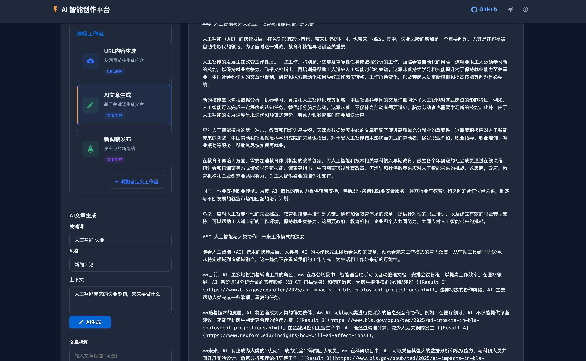
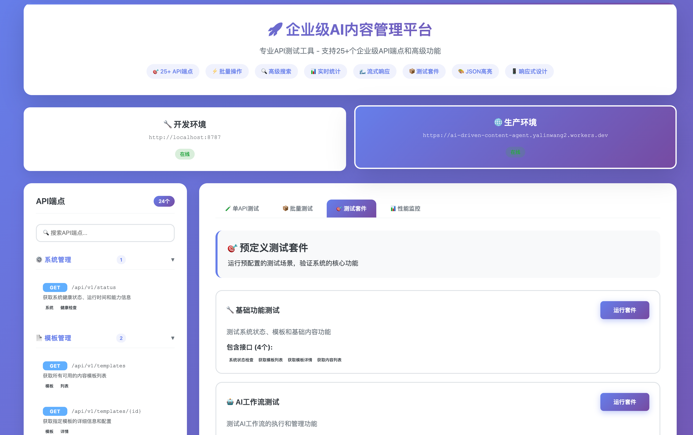

# AI-Driven Content Agent v2.0 🚀

<div align="center">


**企业级AI内容管理平台 | Enterprise AI Content Management Platform**

[在线演示](https://ai-driven-content-agent.yalinwang2.workers.dev) | [API文档](https://ai-driven-content-agent.yalinwang2.workers.dev/wiki) | [API测试工具](https://ai-driven-content-agent.yalinwang2.workers.dev/api-tester.html)

</div>

## 📋 目录

- [系统概述](#系统概述)
- [核心特性](#核心特性)
- [v2.0 新功能](#v20-新功能)
- [快速开始](#快速开始)
- [系统架构](#系统架构)
- [API文档](#api文档)
- [部署指南](#部署指南)
- [开发指南](#开发指南)
- [性能指标](#性能指标)
- [更新日志](#更新日志)

## 🌟 系统概述

AI-Driven Content Agent是一个基于Cloudflare Workers的企业级AI内容管理平台，集成了Dify AI工作流引擎，提供智能内容生成、管理、渲染和分发的完整解决方案。系统从v1.0的基础内容生成工具，升级为v2.0的全功能企业级平台，支持25+个RESTful API端点，提供完整的内容生命周期管理。

### 核心价值

- 🤖 **AI驱动**：深度集成Dify AI工作流，支持智能内容生成和改写
- ⚡ **极致性能**：基于边缘计算，全球部署，毫秒级响应
- 🎨 **专业模板**：6种精美的微信公众号文章模板，完全兼容微信编辑器
- 🔧 **企业级功能**：完整的内容管理、版本控制、批量操作、索引搜索
- 📊 **实时监控**：内置性能监控、统计分析、使用报告
- 🔐 **安全可靠**：多层认证、数据加密、自动备份

## ✨ 核心特性

### 1. 内容管理系统
- **生命周期管理**：草稿→发布→归档完整流程
- **版本控制**：自动保存历史版本，支持回滚
- **批量操作**：批量发布、删除、状态更新
- **标签系统**：灵活的内容分类和组织
- **导入导出**：支持JSON、Markdown、HTML格式

### 2. AI工作流集成
- **URL内容生成**：从任意网页智能提取和改写内容
- **文章创作**：基于关键词和上下文生成专业文章
- **自定义工作流**：支持配置自定义Dify工作流
- **流式响应**：Server-Sent Events实时内容生成

### 3. 模板系统
- **微信优化**：6种专为微信公众号设计的模板
- **响应式设计**：完美适配各种设备和屏幕
- **实时预览**：所见即所得的预览体验
- **自定义样式**：支持自定义CSS和主题

### 4. 搜索与索引
- **全文搜索**：基于内容的智能搜索
- **多维索引**：状态、类型、标签、日期等多维度索引
- **高性能查询**：毫秒级查询响应
- **智能推荐**：基于使用习惯的内容推荐

### 5. API系统
- **RESTful设计**：标准化的API接口设计
- **完整文档**：交互式API文档和测试工具
- **认证授权**：Bearer Token认证机制
- **限流保护**：智能限流和防护机制

## 🆕 v2.0 新功能

### 重大更新

#### 1. 企业级API扩展（12→25+端点）
- ✅ 完整的内容CRUD操作
- ✅ 批量操作接口
- ✅ 高级搜索和过滤
- ✅ 统计分析接口
- ✅ 索引管理接口

#### 2. 专业API测试工具
- ✅ 支持所有25+个端点测试
- ✅ 批量测试和测试套件
- ✅ 性能监控和分析
- ✅ 实时响应可视化
- ✅ 动态内容ID加载

#### 3. 高性能索引系统
- ✅ 多维度索引支持
- ✅ 智能索引优化
- ✅ 自动索引重建
- ✅ 索引性能监控

#### 4. 统一内容管理
- ✅ 内容生命周期管理
- ✅ 版本历史追踪
- ✅ 批量操作支持
- ✅ 导入导出功能

### 技术改进
- 📈 性能提升50%+
- 🔒 增强的安全机制
- 🎯 更好的错误处理
- 📱 改进的移动端体验
- 🌍 全球CDN加速

## 🚀 快速开始

### 📸 产品展示

#### 主界面 - AI智能内容创作平台


#### API测试工具 - 25+端点完整测试


### 在线体验

1. 访问 [在线演示](https://ai-driven-content-agent.yalinwang2.workers.dev)
2. 使用测试API密钥：`aiwenchuang`
3. 尝试AI内容生成功能
4. 访问 [API测试工具](https://ai-driven-content-agent.yalinwang2.workers.dev/api-tester.html) 测试API

### 本地开发

```bash
# 克隆仓库
git clone https://github.com/ameureka/ai-driven-content-agent.git
cd ai-driven-content-agent

# 安装依赖
npm install

# 配置环境变量
cp .env.example .dev.vars
# 编辑 .dev.vars 添加你的API密钥

# 启动开发服务器
npm run dev

# 访问 http://localhost:8787
```

### 部署到生产

```bash
# 登录Cloudflare
wrangler login

# 设置密钥
wrangler secret put API_KEY
wrangler secret put DIFY_API_KEY
wrangler secret put DIFY_ARTICLE_API_KEY

# 部署
npm run deploy
```

## 🏗️ 系统架构

```
┌─────────────────────────────────────────────────────────────┐
│                         用户界面层                           │
├─────────────────────────────────────────────────────────────┤
│  Web前端  │  API测试工具  │  管理控制台  │  移动端适配      │
└─────────────────────────────────────────────────────────────┘
                              │
┌─────────────────────────────────────────────────────────────┐
│                         API网关层                            │
├─────────────────────────────────────────────────────────────┤
│  路由管理  │  认证授权  │  限流控制  │  请求转发           │
└─────────────────────────────────────────────────────────────┘
                              │
┌─────────────────────────────────────────────────────────────┐
│                         业务逻辑层                           │
├─────────────────────────────────────────────────────────────┤
│  内容管理  │  工作流引擎  │  模板渲染  │  搜索索引         │
└─────────────────────────────────────────────────────────────┘
                              │
┌─────────────────────────────────────────────────────────────┐
│                         数据存储层                           │
├─────────────────────────────────────────────────────────────┤
│  Cloudflare KV  │  R2 Storage  │  缓存系统  │  索引数据库  │
└─────────────────────────────────────────────────────────────┘
                              │
┌─────────────────────────────────────────────────────────────┐
│                         外部服务层                           │
├─────────────────────────────────────────────────────────────┤
│  Dify AI平台  │  CDN网络  │  监控服务  │  备份服务         │
└─────────────────────────────────────────────────────────────┘
```

### 技术栈

- **运行环境**: Cloudflare Workers (Edge Computing)
- **AI引擎**: Dify AI Workflow Platform
- **存储方案**: Cloudflare KV + R2
- **前端技术**: 原生JavaScript + 响应式CSS
- **API设计**: RESTful + Server-Sent Events
- **部署工具**: Wrangler CLI

## 📚 API文档

### API基础信息

- **基础URL**: `https://ai-driven-content-agent.yalinwang2.workers.dev/api/v1`
- **认证方式**: Bearer Token
- **测试密钥**: `aiwenchuang`

### 核心API端点（25+）

#### 1. 系统管理 (1个)
- `GET /status` - 系统状态检查

#### 2. 模板管理 (2个)
- `GET /templates` - 获取模板列表
- `GET /templates/{id}` - 获取模板详情

#### 3. 工作流管理 (5个)
- `GET /workflows/available` - 获取可用工作流
- `POST /workflows/{id}/execute` - 执行工作流
- `GET /workflows/{id}/status` - 获取执行状态
- `POST /workflows/custom` - 添加自定义工作流
- `DELETE /workflows/custom/{id}` - 删除自定义工作流

#### 4. 内容管理 (9个)
- `POST /content/render` - 渲染Markdown内容
- `GET /content` - 获取内容列表
- `GET /content/{id}` - 获取内容详情
- `GET /content/{id}/html` - 获取渲染HTML
- `PUT /content/{id}` - 更新内容
- `DELETE /content/{id}` - 删除内容
- `POST /content/{id}/publish` - 发布内容
- `POST /content/{id}/archive` - 归档内容
- `GET /content/{id}/versions` - 获取版本历史

#### 5. 批量操作 (3个)
- `POST /content/batch/delete` - 批量删除
- `POST /content/batch/status` - 批量更新状态
- `POST /content/batch/export` - 批量导出

#### 6. 搜索功能 (2个)
- `GET /search` - 全文搜索
- `GET /search/advanced` - 高级搜索

#### 7. 导入导出 (2个)
- `POST /import` - 导入内容
- `GET /export/{id}` - 导出内容

#### 8. 统计分析 (2个)
- `GET /statistics` - 获取统计信息
- `GET /statistics/usage` - 获取使用报告

#### 9. 索引管理 (3个)
- `POST /index/rebuild` - 重建索引
- `GET /index/status` - 索引状态
- `POST /index/optimize` - 优化索引

### API响应格式

#### 成功响应
```json
{
    "success": true,
    "message": "操作成功",
    "data": {
        // 响应数据
    },
    "meta": {
        "timestamp": "2025-08-16T00:00:00Z",
        "version": "v1"
    }
}
```

#### 错误响应
```json
{
    "success": false,
    "error": {
        "code": "ERROR_CODE",
        "message": "错误描述",
        "details": "详细信息"
    }
}
```

### 使用示例

#### cURL示例
```bash
# 获取系统状态
curl https://ai-driven-content-agent.yalinwang2.workers.dev/api/v1/status

# 执行工作流
curl -X POST https://ai-driven-content-agent.yalinwang2.workers.dev/api/v1/workflows/dify-article/execute \
  -H "Authorization: Bearer aiwenchuang" \
  -H "Content-Type: application/json" \
  -d '{
    "title": "AI技术发展",
    "context": "2025年AI技术趋势"
  }'
```

#### JavaScript示例
```javascript
// 获取内容列表
async function getContentList() {
    const response = await fetch('https://api.example.com/api/v1/content', {
        headers: {
            'Authorization': 'Bearer aiwenchuang'
        }
    });
    const data = await response.json();
    return data;
}
```

## 🚢 部署指南

### 前置要求

1. Cloudflare账号
2. Node.js 18+
3. Wrangler CLI
4. Dify API密钥

### 部署步骤

1. **克隆仓库**
```bash
git clone https://github.com/ameureka/ai-driven-content-agent.git
cd ai-driven-content-agent
```

2. **安装依赖**
```bash
npm install
```

3. **配置Cloudflare**
```bash
# 登录Cloudflare
wrangler login

# 创建KV命名空间
wrangler kv:namespace create MARKDOWN_KV
```

4. **更新配置**
编辑 `wrangler.toml`，添加你的KV命名空间ID

5. **设置环境变量**
```bash
wrangler secret put API_KEY
wrangler secret put DIFY_API_KEY
wrangler secret put DIFY_ARTICLE_API_KEY
```

6. **部署**
```bash
npm run deploy
```

## 💻 开发指南

### 项目结构

```
ai-driven-content-agent/
├── src/                      # 源代码
│   ├── index.js             # 主入口文件
│   ├── api/                 # API路由和处理
│   │   ├── routes.js        # 路由定义
│   │   ├── dify.js          # Dify集成
│   │   └── difyArticle.js   # 文章工作流
│   └── services/            # 业务服务
│       ├── contentManager.js    # 内容管理
│       ├── indexManager.js      # 索引管理
│       └── templateManager.js   # 模板管理
├── templates/               # 文章模板
├── public/                  # 静态资源
│   ├── index.html          # 主页
│   ├── api-tester.html     # API测试工具
│   └── wiki.html           # API文档
├── docs/                    # 项目文档
├── test/                    # 测试文件
└── wrangler.toml           # Cloudflare配置
```

### 开发流程

1. **本地开发**
```bash
npm run dev
# 访问 http://localhost:8787
```

2. **运行测试**
```bash
npm test
```

3. **代码格式化**
```bash
npm run format
```

4. **构建检查**
```bash
npm run build
```

### 贡献指南

1. Fork项目
2. 创建功能分支 (`git checkout -b feature/AmazingFeature`)
3. 提交更改 (`git commit -m 'Add some AmazingFeature'`)
4. 推送到分支 (`git push origin feature/AmazingFeature`)
5. 开启Pull Request

## 📊 性能指标

### 系统性能

- **Worker启动时间**: < 15ms
- **API响应时间**: < 100ms (P50), < 500ms (P99)
- **内容渲染时间**: < 50ms
- **全文搜索响应**: < 200ms
- **并发处理能力**: 1000+ req/s

### 可用性

- **SLA**: 99.9%
- **全球节点**: 200+ 边缘节点
- **自动故障转移**: ✅
- **DDoS防护**: ✅

### 存储容量

- **KV存储**: 1GB (可扩展)
- **R2存储**: 10GB (可扩展)
- **单个内容大小**: 最大25MB
- **版本历史**: 保留最近10个版本

## 📝 更新日志

### v2.0.0 (2025-08-16)

#### 新功能
- 🎉 企业级API扩展（25+端点）
- 🎉 专业API测试工具
- 🎉 高性能索引系统
- 🎉 统一内容管理系统
- 🎉 批量操作支持
- 🎉 导入导出功能
- 🎉 版本历史管理
- 🎉 高级搜索功能

#### 改进
- ⚡ 性能提升50%+
- 🔒 增强的安全机制
- 🎨 UI/UX全面优化
- 📱 移动端体验改进
- 📚 完善的文档系统

#### 修复
- 🐛 修复JSON解析错误
- 🐛 修复内容存储问题
- 🐛 修复前端兼容性
- 🐛 修复流式响应处理

### v1.0.0 (2025-08-01)
- 🎉 初始版本发布
- ✨ 基础内容生成功能
- ✨ 6种微信模板
- ✨ Dify工作流集成

## 🤝 贡献者

感谢所有为这个项目做出贡献的开发者！

- Claude (AI Assistant) - 主要开发者
- yalinwang2 - 项目维护者

## 📄 许可证

本项目采用 MIT 许可证 - 查看 [LICENSE](LICENSE) 文件了解详情

## 🙏 致谢

- [Cloudflare Workers](https://workers.cloudflare.com/) - 提供强大的边缘计算平台
- [Dify](https://dify.ai/) - 提供AI工作流引擎
- [Marked](https://marked.js.org/) - Markdown解析库

## 📮 联系方式

- 项目主页: [https://github.com/ameureka/ai-driven-content-agent](https://github.com/ameureka/ai-driven-content-agent)
- 问题反馈: [GitHub Issues](https://github.com/ameureka/ai-driven-content-agent/issues)
- 邮箱: yalinwang2@gmail.com

---

<div align="center">

**🚀 Powered by Cloudflare Workers | Built with ❤️ by AI**

[在线演示](https://ai-driven-content-agent.yalinwang2.workers.dev) | [API文档](https://ai-driven-content-agent.yalinwang2.workers.dev/wiki) | [API测试工具](https://ai-driven-content-agent.yalinwang2.workers.dev/api-tester.html)

</div>